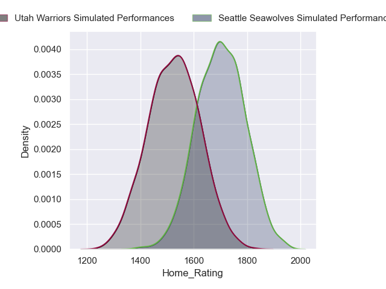
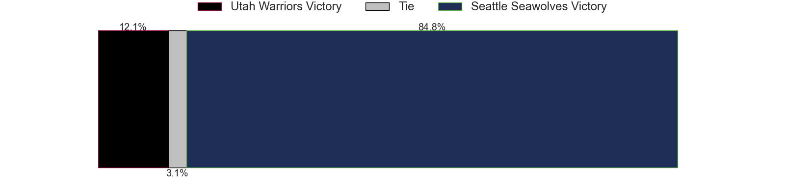
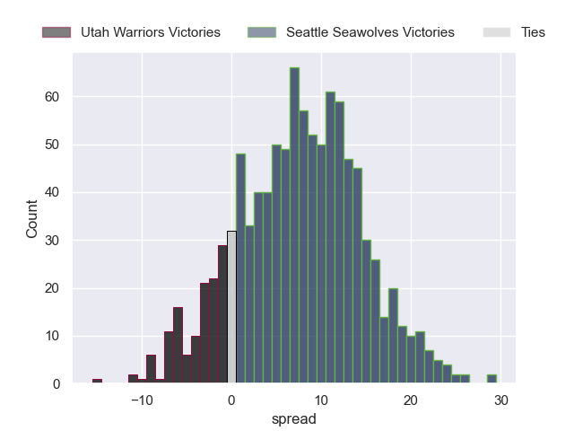

---  
title: "Major League Rugby 2024 Status"  
date: 2024-03-04 6:00:00 -0500  
categories: model review projection  
layout: article  
aside:  
    toc: true  
---
# Current Team Rankings

# Standings

## Current Standings

| Club                   |   Played |   Wins |   Point Differential |   Losing Bonus Points |   Try Bonus Points |   Competition Points |
|:-----------------------|---------:|-------:|---------------------:|----------------------:|-------------------:|---------------------:|
| New England Free Jacks |        1 |      1 |                   33 |                     0 |                nan |                    4 |
| NOLA Gold              |        1 |      1 |                   12 |                     0 |                nan |                    4 |
| Houston SaberCats      |        1 |      1 |                    7 |                     0 |                nan |                    4 |
| Seattle Seawolves      |        1 |      1 |                    6 |                     0 |                nan |                    4 |
| Chicago Hounds         |        1 |      1 |                    4 |                     0 |                nan |                    4 |
| Dallas Jackals         |        1 |      1 |                    3 |                     0 |                nan |                    4 |
| RFC Los Angeles        |        1 |      0 |                   -3 |                     1 |                nan |                    1 |
| Miami Sharks           |        1 |      0 |                   -4 |                     1 |                nan |                    1 |
| San Diego Legion       |        1 |      0 |                   -6 |                     1 |                nan |                    1 |
| Utah Warriors          |        1 |      0 |                   -7 |                     1 |                nan |                    1 |
| Old Glory DC           |        1 |      0 |                  -12 |                     0 |                nan |                    0 |
| Anthem RC              |        1 |      0 |                  -33 |                     0 |                nan |                    0 |

## Projected Remaining Table

| Club                   |   Matches Remaining |   Wins |   Point Differential |   Losing Bonus Points |   Try Bonus Points |   Competition Points |
|:-----------------------|--------------------:|-------:|---------------------:|----------------------:|-------------------:|---------------------:|
| New England Free Jacks |                  15 |   13.9 |             201.375  |                   0.9 |                9.1 |                 65.5 |
| San Diego Legion       |                  15 |   13.4 |             162.981  |                   1.4 |                8.4 |                 63.4 |
| Seattle Seawolves      |                  16 |   12.3 |             117.777  |                   2.3 |                7.9 |                 59.4 |
| Houston SaberCats      |                  15 |    8.1 |              23.2323 |                   3.9 |                7.6 |                 43.8 |
| Utah Warriors          |                  16 |    8.4 |              14.9195 |                   3.7 |                5.4 |                 42.8 |
| Old Glory DC           |                  15 |    6.4 |             -23.8416 |                   3.7 |                5.8 |                 35.1 |
| NOLA Gold              |                  15 |    6.3 |             -24.5703 |                   4.1 |                5.1 |                 34.3 |
| Chicago Hounds         |                  15 |    6.1 |             -33.5956 |                   3.8 |                4.3 |                 32.6 |
| Miami Sharks           |                  15 |    5.3 |             -58.454  |                   3.6 |                3.9 |                 28.7 |
| RFC Los Angeles        |                  15 |    4.4 |             -79.0912 |                   3.9 |                3.7 |                 25.3 |
| Anthem RC              |                  15 |    3.6 |            -162      |                   2.4 |                2.4 |                 19   |
| Dallas Jackals         |                  15 |    2.8 |            -138.732  |                   3.2 |                3.1 |                 17.7 |

## Projected Total Table

| Club                   |   Total Matches |   Wins |   Point Differential |   Losing Bonus Points |   Try Bonus Points |   Competition Points |
|:-----------------------|----------------:|-------:|---------------------:|----------------------:|-------------------:|---------------------:|
| New England Free Jacks |              16 |   14.9 |            234.375   |                   0.9 |                9.1 |                 69.5 |
| San Diego Legion       |              16 |   13.4 |            156.981   |                   2.4 |                8.4 |                 64.4 |
| Seattle Seawolves      |              17 |   13.3 |            123.777   |                   2.3 |                7.9 |                 63.4 |
| Houston SaberCats      |              16 |    9.1 |             30.2323  |                   3.9 |                7.6 |                 47.8 |
| Utah Warriors          |              17 |    8.4 |              7.91949 |                   4.7 |                5.4 |                 43.8 |
| NOLA Gold              |              16 |    7.3 |            -12.5703  |                   4.1 |                5.1 |                 38.3 |
| Chicago Hounds         |              16 |    7.1 |            -29.5956  |                   3.8 |                4.3 |                 36.6 |
| Old Glory DC           |              16 |    6.4 |            -35.8416  |                   3.7 |                5.8 |                 35.1 |
| Miami Sharks           |              16 |    5.3 |            -62.454   |                   4.6 |                3.9 |                 29.7 |
| RFC Los Angeles        |              16 |    4.4 |            -82.0912  |                   4.9 |                3.7 |                 26.3 |
| Dallas Jackals         |              16 |    3.8 |           -135.732   |                   3.2 |                3.1 |                 21.7 |
| Anthem RC              |              16 |    3.6 |           -195       |                   2.4 |                2.4 |                 19   |

# Completed Match Review

| Model | Percent Correct Predictions | Spread Error |
| ------ | ------ | ------ |
| Club Level | 50.0% | 13.1 |
| Player Level: Lineup | nan% | nan |
| Player Level: Minutes | nan% | nan |

# Future Predictions

## Week 2

### Seattle Seawolves V Miami Sharks on 2024/03/09

Average Margin: Seattle Seawolves by 13.9

Average Scoreline: 33-19

### New England Free Jacks V Old Glory DC on 2024/03/09

Average Margin: New England Free Jacks by 17.8

Average Scoreline: 39-22

### Utah Warriors V Chicago Hounds on 2024/03/09

Average Margin: Utah Warriors by 7.8

Average Scoreline: 30-22

### NOLA Gold V Anthem RC on 2024/03/09

Average Margin: NOLA Gold by 15.6

Average Scoreline: 39-23

### Seattle Seawolves V Utah Warriors on 2024/03/09

Average Margin: Seattle Seawolves by 8.5

Average Scoreline: 32-24

### RFC Los Angeles V Houston SaberCats on 2024/03/10

Average Margin: Houston SaberCats by 2.4

Average Scoreline: 27-25

### Dallas Jackals V San Diego Legion on 2024/03/10

Average Margin: San Diego Legion by 14.7

Average Scoreline: 35-21

## Week 3

### Utah Warriors V Seattle Seawolves on 2024/03/16

Average Margin: Seattle Seawolves by 1.7

Average Scoreline: 26-24

### San Diego Legion V RFC Los Angeles on 2024/03/16

Average Margin: San Diego Legion by 16.9

Average Scoreline: 37-20

### Old Glory DC V Chicago Hounds on 2024/03/16

Average Margin: Old Glory DC by 3.8

Average Scoreline: 31-28

### New England Free Jacks V NOLA Gold on 2024/03/16

Average Margin: New England Free Jacks by 17.7

Average Scoreline: 38-21

### Houston SaberCats V Miami Sharks on 2024/03/16

Average Margin: Houston SaberCats by 9.5

Average Scoreline: 30-21

### Anthem RC V Dallas Jackals on 2024/03/17

Average Margin: Dallas Jackals by 3.1

Average Scoreline: 29-26

## Week 4

### Seattle Seawolves V Houston SaberCats on 2024/03/22

Average Margin: Seattle Seawolves by 8.2

Average Scoreline: 33-24

### Dallas Jackals V NOLA Gold on 2024/03/23

Average Margin: NOLA Gold by 3.2

Average Scoreline: 26-23

### Miami Sharks V Anthem RC on 2024/03/23

Average Margin: Miami Sharks by 13.0

Average Scoreline: 32-19

### Old Glory DC V San Diego Legion on 2024/03/23

Average Margin: San Diego Legion by 8.7

Average Scoreline: 33-25

### Chicago Hounds V New England Free Jacks on 2024/03/24

Average Margin: New England Free Jacks by 11.4

Average Scoreline: 32-21

### RFC Los Angeles V Utah Warriors on 2024/03/24

Average Margin: Utah Warriors by 2.4

Average Scoreline: 27-24

## Week 5

### Dallas Jackals V Houston SaberCats on 2024/03/29

Average Margin: Houston SaberCats by 6.9

Average Scoreline: 29-22

### Chicago Hounds V Seattle Seawolves on 2024/03/30

Average Margin: Seattle Seawolves by 5.8

Average Scoreline: 27-22

### Anthem RC V Old Glory DC on 2024/03/30

Average Margin: Old Glory DC by 9.1

Average Scoreline: 29-20

### Miami Sharks V San Diego Legion on 2024/03/31

Average Margin: San Diego Legion by 10.6

Average Scoreline: 33-22

## Week 6

### Utah Warriors V Anthem RC on 2024/04/05

Average Margin: Utah Warriors by 14.8

Average Scoreline: 38-23

### Seattle Seawolves V Dallas Jackals on 2024/04/05

Average Margin: Seattle Seawolves by 18.2

Average Scoreline: 39-20

### New England Free Jacks V Miami Sharks on 2024/04/06

Average Margin: New England Free Jacks by 18.8

Average Scoreline: 36-18

### NOLA Gold V Chicago Hounds on 2024/04/06

Average Margin: NOLA Gold by 3.3

Average Scoreline: 30-27

### Old Glory DC V RFC Los Angeles on 2024/04/06

Average Margin: Old Glory DC by 4.9

Average Scoreline: 29-24

## Week 7

### Dallas Jackals V Utah Warriors on 2024/04/12

Average Margin: Utah Warriors by 6.3

Average Scoreline: 29-23

### Houston SaberCats V New England Free Jacks on 2024/04/13

Average Margin: New England Free Jacks by 6.7

Average Scoreline: 30-23

### Chicago Hounds V Anthem RC on 2024/04/14

Average Margin: Chicago Hounds by 10.5

Average Scoreline: 32-21

### RFC Los Angeles V Seattle Seawolves on 2024/04/14

Average Margin: Seattle Seawolves by 6.6

Average Scoreline: 30-23

### San Diego Legion V NOLA Gold on 2024/04/14

Average Margin: San Diego Legion by 14.5

Average Scoreline: 35-21

## Week 8

### NOLA Gold V Miami Sharks on 2024/04/20

Average Margin: NOLA Gold by 4.9

Average Scoreline: 27-22

### Old Glory DC V Houston SaberCats on 2024/04/20

Average Margin: Houston SaberCats by 0.6

Average Scoreline: 27-26

### New England Free Jacks V Seattle Seawolves on 2024/04/20

Average Margin: New England Free Jacks by 8.8

Average Scoreline: 29-20

### San Diego Legion V Utah Warriors on 2024/04/21

Average Margin: San Diego Legion by 11.3

Average Scoreline: 33-22

### Chicago Hounds V RFC Los Angeles on 2024/04/21

Average Margin: Chicago Hounds by 4.8

Average Scoreline: 25-21

## Week 9

### Anthem RC V NOLA Gold on 2024/04/26

Average Margin: NOLA Gold by 5.5

Average Scoreline: 26-20

### Utah Warriors V Old Glory DC on 2024/04/26

Average Margin: Utah Warriors by 7.0

Average Scoreline: 33-26

### Miami Sharks V Dallas Jackals on 2024/04/27

Average Margin: Miami Sharks by 7.2

Average Scoreline: 31-23

### RFC Los Angeles V New England Free Jacks on 2024/04/27

Average Margin: New England Free Jacks by 12.3

Average Scoreline: 33-21

### Houston SaberCats V San Diego Legion on 2024/04/27

Average Margin: San Diego Legion by 4.3

Average Scoreline: 30-26

## Week 10

### Seattle Seawolves V Anthem RC on 2024/05/03

Average Margin: Seattle Seawolves by 19.6

Average Scoreline: 40-20

### Old Glory DC V Miami Sharks on 2024/05/04

Average Margin: Old Glory DC by 4.9

Average Scoreline: 30-25

### Utah Warriors V Houston SaberCats on 2024/05/04

Average Margin: Utah Warriors by 2.8

Average Scoreline: 30-27

### New England Free Jacks V Chicago Hounds on 2024/05/05

Average Margin: New England Free Jacks by 17.4

Average Scoreline: 36-19

### San Diego Legion V Dallas Jackals on 2024/05/05

Average Margin: San Diego Legion by 20.6

Average Scoreline: 41-21

## Week 11

### Anthem RC V Houston SaberCats on 2024/05/10

Average Margin: Houston SaberCats by 7.9

Average Scoreline: 33-25

### Dallas Jackals V RFC Los Angeles on 2024/05/10

Average Margin: RFC Los Angeles by 1.5

Average Scoreline: 27-25

### NOLA Gold V Seattle Seawolves on 2024/05/11

Average Margin: Seattle Seawolves by 4.9

Average Scoreline: 29-24

### Chicago Hounds V Old Glory DC on 2024/05/11

Average Margin: Chicago Hounds by 3.2

Average Scoreline: 29-26

### Miami Sharks V Utah Warriors on 2024/05/11

Average Margin: Utah Warriors by 1.5

Average Scoreline: 29-27

## Week 12

### NOLA Gold V Utah Warriors on 2024/05/18

Average Margin: Utah Warriors by 0.0

Average Scoreline: 29-29

### Anthem RC V RFC Los Angeles on 2024/05/18

Average Margin: RFC Los Angeles by 2.2

Average Scoreline: 24-22

### Houston SaberCats V Chicago Hounds on 2024/05/18

Average Margin: Houston SaberCats by 7.6

Average Scoreline: 35-27

### San Diego Legion V New England Free Jacks on 2024/05/19

Average Margin: San Diego Legion by 1.1

Average Scoreline: 30-29

### Dallas Jackals V Seattle Seawolves on 2024/05/19

Average Margin: Seattle Seawolves by 11.0

Average Scoreline: 36-25

## Week 13

### Seattle Seawolves V Old Glory DC on 2024/05/24

Average Margin: Seattle Seawolves by 11.9

Average Scoreline: 36-24

### Miami Sharks V New England Free Jacks on 2024/05/25

Average Margin: New England Free Jacks by 11.8

Average Scoreline: 32-20

### RFC Los Angeles V San Diego Legion on 2024/05/26

Average Margin: San Diego Legion by 9.2

Average Scoreline: 30-21

### Chicago Hounds V NOLA Gold on 2024/05/26

Average Margin: Chicago Hounds by 3.0

Average Scoreline: 28-25

## Week 14

### NOLA Gold V Houston SaberCats on 2024/06/01

Average Margin: Houston SaberCats by 0.5

Average Scoreline: 28-28

### Old Glory DC V Anthem RC on 2024/06/01

Average Margin: Old Glory DC by 10.3

Average Scoreline: 36-25

### Utah Warriors V San Diego Legion on 2024/06/01

Average Margin: San Diego Legion by 4.5

Average Scoreline: 29-24

### New England Free Jacks V Dallas Jackals on 2024/06/02

Average Margin: New England Free Jacks by 22.3

Average Scoreline: 40-18

### RFC Los Angeles V Miami Sharks on 2024/06/02

Average Margin: RFC Los Angeles by 3.8

Average Scoreline: 28-24

## Week 15

### Houston SaberCats V RFC Los Angeles on 2024/06/08

Average Margin: Houston SaberCats by 8.2

Average Scoreline: 33-25

### Old Glory DC V New England Free Jacks on 2024/06/08

Average Margin: New England Free Jacks by 10.4

Average Scoreline: 33-23

### San Diego Legion V Anthem RC on 2024/06/09

Average Margin: San Diego Legion by 21.7

Average Scoreline: 41-19

### Seattle Seawolves V Utah Warriors on 2024/06/09

Average Margin: Seattle Seawolves by 8.2

Average Scoreline: 33-25

### Dallas Jackals V Chicago Hounds on 2024/06/09

Average Margin: Chicago Hounds by 2.3

Average Scoreline: 28-25

### Miami Sharks V NOLA Gold on 2024/06/09

Average Margin: Miami Sharks by 1.8

Average Scoreline: 26-25

## Week 16

### Dallas Jackals V Old Glory DC on 2024/06/14

Average Margin: Old Glory DC by 2.1

Average Scoreline: 27-24

### Houston SaberCats V Seattle Seawolves on 2024/06/15

Average Margin: Seattle Seawolves by 1.0

Average Scoreline: 29-28

### Chicago Hounds V San Diego Legion on 2024/06/15

Average Margin: San Diego Legion by 8.2

Average Scoreline: 28-20

### RFC Los Angeles V NOLA Gold on 2024/06/16

Average Margin: RFC Los Angeles by 2.0

Average Scoreline: 27-25

### New England Free Jacks V Utah Warriors on 2024/06/16

Average Margin: New England Free Jacks by 13.7

Average Scoreline: 34-20

### Anthem RC V Miami Sharks on 2024/06/16

Average Margin: Miami Sharks by 2.1

Average Scoreline: 25-22

## Week 17

### Anthem RC V Chicago Hounds on 2024/06/22

Average Margin: Chicago Hounds by 3.3

Average Scoreline: 28-25

### Utah Warriors V Dallas Jackals on 2024/06/22

Average Margin: Utah Warriors by 12.2

Average Scoreline: 36-24

### Miami Sharks V Old Glory DC on 2024/06/22

Average Margin: Miami Sharks by 1.9

Average Scoreline: 27-26

### NOLA Gold V New England Free Jacks on 2024/06/22

Average Margin: New England Free Jacks by 9.9

Average Scoreline: 32-22

### Seattle Seawolves V RFC Los Angeles on 2024/06/22

Average Margin: Seattle Seawolves by 13.0

Average Scoreline: 37-23

### San Diego Legion V Houston SaberCats on 2024/06/23

Average Margin: San Diego Legion by 10.7

Average Scoreline: 34-24

## Week 18

### Utah Warriors V RFC Los Angeles on 2024/06/28

Average Margin: Utah Warriors by 7.9

Average Scoreline: 31-23

### San Diego Legion V Seattle Seawolves on 2024/06/29

Average Margin: San Diego Legion by 6.1

Average Scoreline: 32-26

### Houston SaberCats V Dallas Jackals on 2024/06/29

Average Margin: Houston SaberCats by 13.2

Average Scoreline: 37-24

### Chicago Hounds V Miami Sharks on 2024/06/29

Average Margin: Chicago Hounds by 4.5

Average Scoreline: 29-25

### New England Free Jacks V Anthem RC on 2024/06/29

Average Margin: New England Free Jacks by 23.4

Average Scoreline: 38-14

### Old Glory DC V NOLA Gold on 2024/06/29

Average Margin: Old Glory DC by 2.7

Average Scoreline: 29-27

