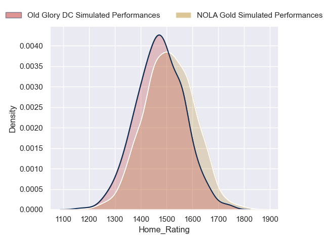
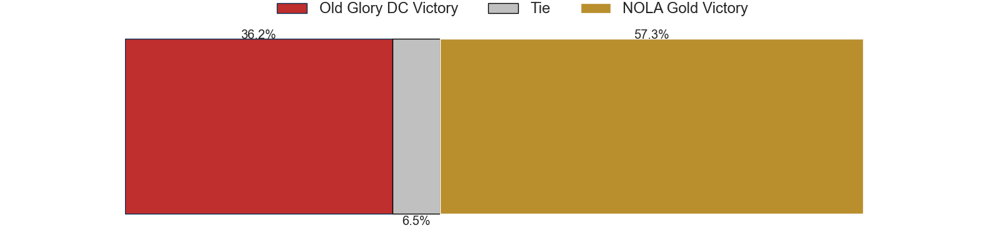
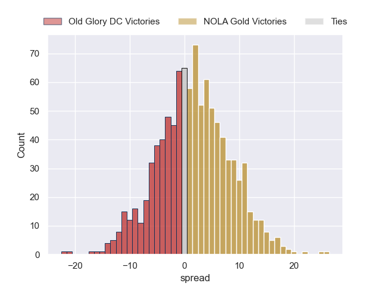
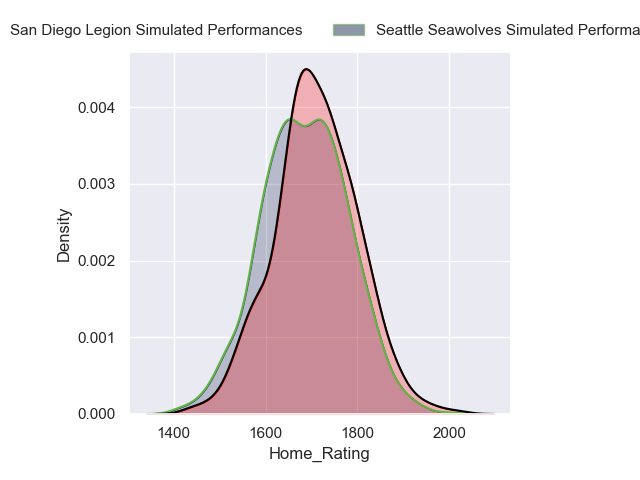
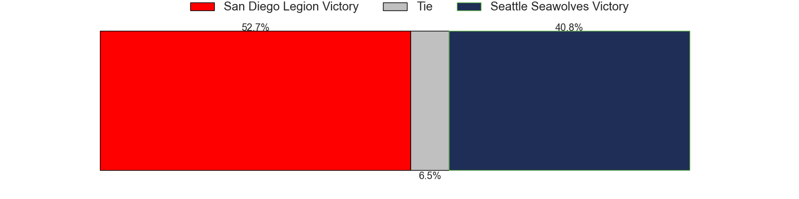
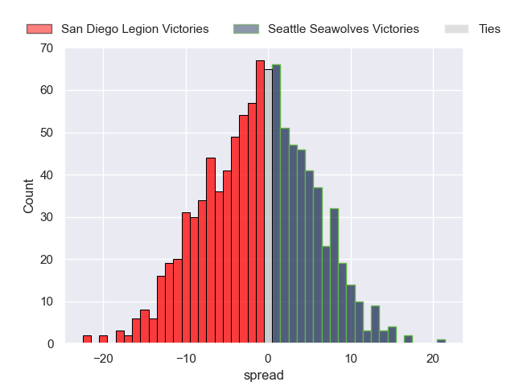
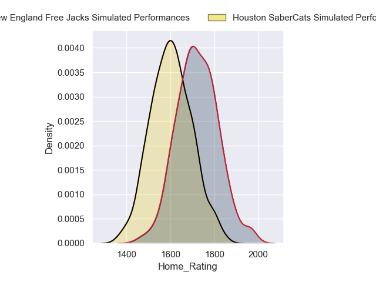
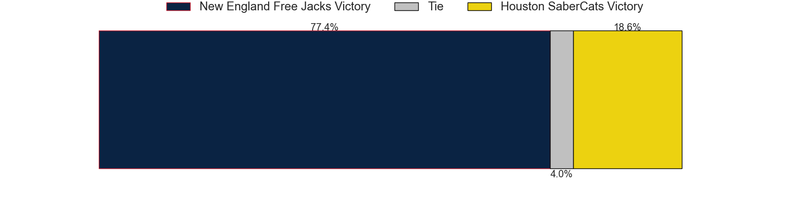
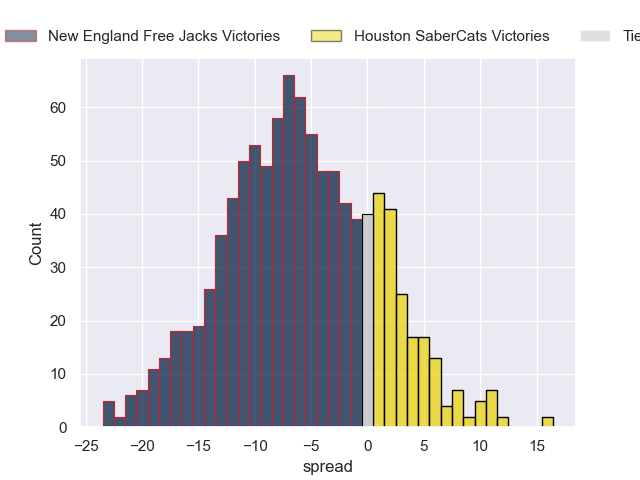

---  
title: "Major League Rugby 2024 Status"  
date: 2024-02-26 6:00:00 -0500  
categories: model review projection  
layout: article  
aside:  
    toc: true  
---
# Current Team Rankings

# Standings

## Projected Total Table

| Club                   |   Total Matches |   Wins |   Point Differential |   Losing Bonus Points |   Try Bonus Points |   Competition Points |
|:-----------------------|----------------:|-------:|---------------------:|----------------------:|-------------------:|---------------------:|
| New England Free Jacks |              16 |   12.9 |            149.495   |                   2.3 |                8.1 |                 61.9 |
| Miami Sharks           |              16 |   12.6 |            128.086   |                   2.4 |                7.7 |                 60.3 |
| San Diego Legion       |              16 |   12.4 |            131.501   |                   2.6 |                7.8 |                 60.2 |
| RFC Los Angeles        |              16 |   12.6 |            108.645   |                   2.6 |                6.9 |                 59.8 |
| Seattle Seawolves      |              16 |   10.2 |             63.9478  |                   3.6 |                6.3 |                 50.6 |
| Utah Warriors          |              16 |    7.8 |              5.49689 |                   4.3 |                4.9 |                 40.6 |
| Houston SaberCats      |              16 |    6.7 |            -25.5365  |                   4.1 |                7   |                 37.8 |
| Old Glory DC           |              16 |    4.8 |            -76.2933  |                   3.9 |                4.8 |                 28   |
| NOLA Gold              |              16 |    4.5 |            -93.8224  |                   3.8 |                3.7 |                 25.5 |
| Chicago Hounds         |              16 |    2.5 |           -155.591   |                   3.7 |                2.8 |                 16.5 |
| Dallas Jackals         |              16 |    1   |           -235.929   |                   2.3 |                2.9 |                  9.3 |

# Future Predictions

## Week 1

### NOLA Gold V Old Glory DC on 2024/03/03

Average Margin: NOLA Gold by 1.8

Average Scoreline: 32-31

### RFC Los Angeles V Utah Warriors on 2024/03/03

Average Margin: RFC Los Angeles by 10.5

Average Scoreline: 19-8

### Seattle Seawolves V San Diego Legion on 2024/03/03

Average Margin: San Diego Legion by 1.2

Average Scoreline: 29-28

### Miami Sharks V Chicago Hounds on 2024/03/03

Average Margin: Miami Sharks by 18.0

Average Scoreline: 20-1

### Houston SaberCats V New England Free Jacks on 2024/03/03

Average Margin: New England Free Jacks by 5.9

Average Scoreline: 29-23

## Week 2

### NOLA Gold V San Diego Legion on 2024/03/09

Average Margin: San Diego Legion by 10.5

Average Scoreline: 36-26

### Seattle Seawolves V Utah Warriors on 2024/03/09

Average Margin: Seattle Seawolves by 7.6

Average Scoreline: 29-21

### New England Free Jacks V Old Glory DC on 2024/03/09

Average Margin: New England Free Jacks by 15.4

Average Scoreline: 31-16

### RFC Los Angeles V Houston SaberCats on 2024/03/09

Average Margin: RFC Los Angeles by 11.0

Average Scoreline: 27-16

### Dallas Jackals V Miami Sharks on 2024/03/10

Average Margin: Miami Sharks by 16.5

Average Scoreline: 39-22

## Week 3

### Houston SaberCats V Dallas Jackals on 2024/03/16

Average Margin: Houston SaberCats by 16.4

Average Scoreline: 33-17

### Old Glory DC V Miami Sharks on 2024/03/16

Average Margin: Miami Sharks by 6.8

Average Scoreline: 34-27

### New England Free Jacks V NOLA Gold on 2024/03/16

Average Margin: New England Free Jacks by 17.2

Average Scoreline: 30-13

### San Diego Legion V RFC Los Angeles on 2024/03/16

Average Margin: San Diego Legion by 5.0

Average Scoreline: 27-22

### Utah Warriors V Chicago Hounds on 2024/03/16

Average Margin: Utah Warriors by 10.9

Average Scoreline: 24-13

## Week 4

### RFC Los Angeles V Seattle Seawolves on 2024/03/22

Average Margin: RFC Los Angeles by 6.7

Average Scoreline: 20-13

### Dallas Jackals V New England Free Jacks on 2024/03/23

Average Margin: New England Free Jacks by 18.6

Average Scoreline: 34-16

### Miami Sharks V Houston SaberCats on 2024/03/23

Average Margin: Miami Sharks by 11.0

Average Scoreline: 27-16

### Old Glory DC V Utah Warriors on 2024/03/23

Average Margin: Old Glory DC by 0.7

Average Scoreline: 29-28

### Chicago Hounds V San Diego Legion on 2024/03/24

Average Margin: San Diego Legion by 13.5

Average Scoreline: 27-14

## Week 5

### Dallas Jackals V RFC Los Angeles on 2024/03/29

Average Margin: RFC Los Angeles by 17.2

Average Scoreline: 39-22

### Utah Warriors V NOLA Gold on 2024/03/30

Average Margin: Utah Warriors by 8.0

Average Scoreline: 30-22

### Miami Sharks V Seattle Seawolves on 2024/03/30

Average Margin: Miami Sharks by 6.2

Average Scoreline: 20-13

### Chicago Hounds V Old Glory DC on 2024/03/30

Average Margin: Old Glory DC by 1.5

Average Scoreline: 24-23

## Week 6

### Seattle Seawolves V Dallas Jackals on 2024/04/05

Average Margin: Seattle Seawolves by 20.2

Average Scoreline: 36-16

### Utah Warriors V Houston SaberCats on 2024/04/05

Average Margin: Utah Warriors by 3.7

Average Scoreline: 33-29

### New England Free Jacks V Chicago Hounds on 2024/04/06

Average Margin: New England Free Jacks by 19.5

Average Scoreline: 30-10

### NOLA Gold V Miami Sharks on 2024/04/06

Average Margin: Miami Sharks by 8.4

Average Scoreline: 34-25

### Old Glory DC V San Diego Legion on 2024/04/06

Average Margin: San Diego Legion by 8.1

Average Scoreline: 33-24

## Week 7

### RFC Los Angeles V NOLA Gold on 2024/04/12

Average Margin: RFC Los Angeles by 14.9

Average Scoreline: 19-4

### Dallas Jackals V Utah Warriors on 2024/04/13

Average Margin: Utah Warriors by 9.3

Average Scoreline: 36-27

### Houston SaberCats V Old Glory DC on 2024/04/13

Average Margin: Houston SaberCats by 5.8

Average Scoreline: 31-25

### San Diego Legion V New England Free Jacks on 2024/04/14

Average Margin: San Diego Legion by 2.9

Average Scoreline: 27-24

### Chicago Hounds V Seattle Seawolves on 2024/04/14

Average Margin: Seattle Seawolves by 7.8

Average Scoreline: 26-18

## Week 8

### NOLA Gold V Dallas Jackals on 2024/04/20

Average Margin: NOLA Gold by 11.2

Average Scoreline: 29-18

### New England Free Jacks V Miami Sharks on 2024/04/20

Average Margin: New England Free Jacks by 5.2

Average Scoreline: 23-17

### Old Glory DC V RFC Los Angeles on 2024/04/20

Average Margin: RFC Los Angeles by 6.8

Average Scoreline: 36-29

### Chicago Hounds V Houston SaberCats on 2024/04/21

Average Margin: Houston SaberCats by 3.8

Average Scoreline: 33-29

### San Diego Legion V Seattle Seawolves on 2024/04/21

Average Margin: San Diego Legion by 7.9

Average Scoreline: 28-21

## Week 9

### Utah Warriors V San Diego Legion on 2024/04/26

Average Margin: San Diego Legion by 4.8

Average Scoreline: 31-26

### Houston SaberCats V NOLA Gold on 2024/04/27

Average Margin: Houston SaberCats by 8.1

Average Scoreline: 32-24

### Miami Sharks V Old Glory DC on 2024/04/27

Average Margin: Miami Sharks by 13.1

Average Scoreline: 19-6

### RFC Los Angeles V New England Free Jacks on 2024/04/27

Average Margin: RFC Los Angeles by 1.9

Average Scoreline: 23-21

## Week 10

### RFC Los Angeles V Miami Sharks on 2024/05/03

Average Margin: RFC Los Angeles by 3.9

Average Scoreline: 23-19

### Seattle Seawolves V Houston SaberCats on 2024/05/03

Average Margin: Seattle Seawolves by 7.3

Average Scoreline: 29-21

### Old Glory DC V Dallas Jackals on 2024/05/04

Average Margin: Old Glory DC by 13.0

Average Scoreline: 31-18

### San Diego Legion V Chicago Hounds on 2024/05/05

Average Margin: San Diego Legion by 18.7

Average Scoreline: 34-16

### New England Free Jacks V Utah Warriors on 2024/05/05

Average Margin: New England Free Jacks by 12.3

Average Scoreline: 29-16

## Week 11

### NOLA Gold V Utah Warriors on 2024/05/11

Average Margin: Utah Warriors by 1.2

Average Scoreline: 28-27

### Dallas Jackals V Houston SaberCats on 2024/05/11

Average Margin: Houston SaberCats by 8.4

Average Scoreline: 37-29

### Miami Sharks V San Diego Legion on 2024/05/11

Average Margin: Miami Sharks by 1.9

Average Scoreline: 21-19

### Chicago Hounds V RFC Los Angeles on 2024/05/11

Average Margin: RFC Los Angeles by 10.7

Average Scoreline: 35-24

### Seattle Seawolves V New England Free Jacks on 2024/05/12

Average Margin: New England Free Jacks by 1.3

Average Scoreline: 28-27

## Week 12

### Utah Warriors V RFC Los Angeles on 2024/05/18

Average Margin: RFC Los Angeles by 3.7

Average Scoreline: 30-26

### NOLA Gold V Seattle Seawolves on 2024/05/18

Average Margin: Seattle Seawolves by 5.1

Average Scoreline: 28-23

### Houston SaberCats V Miami Sharks on 2024/05/18

Average Margin: Miami Sharks by 3.8

Average Scoreline: 29-25

### San Diego Legion V Old Glory DC on 2024/05/19

Average Margin: San Diego Legion by 14.6

Average Scoreline: 33-19

### Dallas Jackals V Chicago Hounds on 2024/05/19

Average Margin: Chicago Hounds by 1.9

Average Scoreline: 31-29

## Week 13

### Seattle Seawolves V Old Glory DC on 2024/05/24

Average Margin: Seattle Seawolves by 10.4

Average Scoreline: 28-18

### Miami Sharks V NOLA Gold on 2024/05/25

Average Margin: Miami Sharks by 14.7

Average Scoreline: 20-5

### New England Free Jacks V Dallas Jackals on 2024/05/25

Average Margin: New England Free Jacks by 24.5

Average Scoreline: 37-12

### RFC Los Angeles V San Diego Legion on 2024/05/26

Average Margin: RFC Los Angeles by 2.0

Average Scoreline: 21-19

### Chicago Hounds V Utah Warriors on 2024/05/26

Average Margin: Utah Warriors by 3.4

Average Scoreline: 28-25

## Week 14

### Dallas Jackals V Seattle Seawolves on 2024/06/01

Average Margin: Seattle Seawolves by 12.7

Average Scoreline: 35-23

### Old Glory DC V Chicago Hounds on 2024/06/01

Average Margin: Old Glory DC by 7.5

Average Scoreline: 29-22

### New England Free Jacks V Houston SaberCats on 2024/06/01

Average Margin: New England Free Jacks by 12.0

Average Scoreline: 30-18

### NOLA Gold V RFC Los Angeles on 2024/06/01

Average Margin: RFC Los Angeles by 7.9

Average Scoreline: 37-29

### Utah Warriors V Miami Sharks on 2024/06/01

Average Margin: Miami Sharks by 3.2

Average Scoreline: 33-30

## Week 15

### Old Glory DC V New England Free Jacks on 2024/06/08

Average Margin: New England Free Jacks by 7.9

Average Scoreline: 37-29

### Miami Sharks V Dallas Jackals on 2024/06/08

Average Margin: Miami Sharks by 22.3

Average Scoreline: 30-8

### Houston SaberCats V Utah Warriors on 2024/06/08

Average Margin: Houston SaberCats by 2.9

Average Scoreline: 29-26

### Seattle Seawolves V Chicago Hounds on 2024/06/09

Average Margin: Seattle Seawolves by 14.3

Average Scoreline: 34-20

### San Diego Legion V NOLA Gold on 2024/06/09

Average Margin: San Diego Legion by 16.3

Average Scoreline: 36-20

## Week 16

### Dallas Jackals V NOLA Gold on 2024/06/14

Average Margin: NOLA Gold by 4.5

Average Scoreline: 32-28

### RFC Los Angeles V Old Glory DC on 2024/06/14

Average Margin: RFC Los Angeles by 12.9

Average Scoreline: 26-13

### Houston SaberCats V Seattle Seawolves on 2024/06/15

Average Margin: Seattle Seawolves by 0.6

Average Scoreline: 29-29

### Chicago Hounds V Miami Sharks on 2024/06/15

Average Margin: Miami Sharks by 10.1

Average Scoreline: 37-27

### New England Free Jacks V San Diego Legion on 2024/06/16

Average Margin: New England Free Jacks by 3.6

Average Scoreline: 28-24

## Week 17

### Seattle Seawolves V RFC Los Angeles on 2024/06/22

Average Margin: Seattle Seawolves by 0.3

Average Scoreline: 26-26

### Utah Warriors V Dallas Jackals on 2024/06/22

Average Margin: Utah Warriors by 15.5

Average Scoreline: 36-20

### Miami Sharks V New England Free Jacks on 2024/06/22

Average Margin: Miami Sharks by 1.3

Average Scoreline: 23-22

### NOLA Gold V Chicago Hounds on 2024/06/22

Average Margin: NOLA Gold by 5.7

Average Scoreline: 29-23

### San Diego Legion V Houston SaberCats on 2024/06/23

Average Margin: San Diego Legion by 11.8

Average Scoreline: 35-23

## Week 18

### Utah Warriors V Seattle Seawolves on 2024/06/29

Average Margin: Seattle Seawolves by 0.8

Average Scoreline: 29-28

### Chicago Hounds V New England Free Jacks on 2024/06/29

Average Margin: New England Free Jacks by 12.1

Average Scoreline: 34-22

### Old Glory DC V NOLA Gold on 2024/06/29

Average Margin: Old Glory DC by 4.7

Average Scoreline: 29-24

### Houston SaberCats V RFC Los Angeles on 2024/06/29

Average Margin: RFC Los Angeles by 3.9

Average Scoreline: 35-31

### San Diego Legion V Dallas Jackals on 2024/06/29

Average Margin: San Diego Legion by 23.7

Average Scoreline: 41-17

