---  
title: "Major League Rugby 2024 Status"  
date: 2024-07-15 6:00:00 -0500  
categories: model review projection  
layout: article  
aside:  
    toc: true  
---
# Current Team Rankings

# Standings

## Current Standings

| Club                   |   Played |   Wins |   Point Differential |   Losing Bonus Points |   Try Bonus Points |   Competition Points |
|:-----------------------|---------:|-------:|---------------------:|----------------------:|-------------------:|---------------------:|
| Houston SaberCats      |       18 |     16 |                  159 |                     0 |                nan |                   72 |
| Seattle Seawolves      |       20 |     13 |                  136 |                     5 |                nan |                   65 |
| New England Free Jacks |       19 |     12 |                  139 |                     4 |                nan |                   59 |
| San Diego Legion       |       16 |     12 |                   59 |                     3 |                nan |                   56 |
| NOLA Gold              |       17 |     11 |                   96 |                     2 |                nan |                   51 |
| Dallas Jackals         |       20 |      8 |                   51 |                    11 |                nan |                   50 |
| Old Glory DC           |       19 |     10 |                  -20 |                     5 |                nan |                   49 |
| Chicago Hounds         |       16 |      7 |                   60 |                     5 |                nan |                   39 |
| RFC Los Angeles        |       19 |      7 |                 -121 |                     2 |                nan |                   39 |
| Utah Warriors          |       19 |      6 |                  -52 |                     9 |                nan |                   37 |
| Miami Sharks           |       19 |      7 |                  -76 |                     5 |                nan |                   35 |
| Anthem RC              |       20 |      0 |                 -431 |                     2 |                nan |                    7 |

## Projected Remaining Table

| Club                   |   Matches Remaining |   Wins |   Point Differential |   Losing Bonus Points |   Try Bonus Points |   Competition Points |
|:-----------------------|--------------------:|-------:|---------------------:|----------------------:|-------------------:|---------------------:|
| Houston SaberCats      |                   1 |    0.9 |              7.88874 |                   0.1 |                0.6 |                  4.4 |
| New England Free Jacks |                   1 |    0.9 |              7.99659 |                   0.1 |                0.4 |                  4.2 |
| NOLA Gold              |                   1 |    0.7 |              3.74681 |                   0.2 |                0.2 |                  3.4 |
| Seattle Seawolves      |                   1 |    0.6 |              1.70981 |                   0.3 |                0.3 |                  3.1 |
| San Diego Legion       |                   1 |    0.4 |             -1.70981 |                   0.5 |                0.3 |                  2.2 |
| Chicago Hounds         |                   1 |    0.3 |             -3.74681 |                   0.5 |                0.3 |                  1.7 |
| Dallas Jackals         |                   1 |    0.1 |             -7.88874 |                   0.4 |                0.2 |                  0.8 |
| Old Glory DC           |                   1 |    0.1 |             -7.99659 |                   0.4 |                0.2 |                  0.8 |

## Projected Total Table

| Club                   |   Total Matches |   Wins |   Point Differential |   Losing Bonus Points |   Try Bonus Points |   Competition Points |
|:-----------------------|----------------:|-------:|---------------------:|----------------------:|-------------------:|---------------------:|
| Houston SaberCats      |              19 |   16.9 |             166.889  |                   0.1 |                0.6 |                 76.4 |
| Seattle Seawolves      |              21 |   13.6 |             137.71   |                   5.3 |                0.3 |                 68.1 |
| New England Free Jacks |              20 |   12.9 |             146.997  |                   4.1 |                0.4 |                 63.2 |
| San Diego Legion       |              17 |   12.4 |              57.2902 |                   3.5 |                0.3 |                 58.2 |
| NOLA Gold              |              18 |   11.7 |              99.7468 |                   2.2 |                0.2 |                 54.4 |
| Dallas Jackals         |              21 |    8.1 |              43.1113 |                  11.4 |                0.2 |                 50.8 |
| Old Glory DC           |              20 |   10.1 |             -27.9966 |                   5.4 |                0.2 |                 49.8 |
| Chicago Hounds         |              17 |    7.3 |              56.2532 |                   5.5 |                0.3 |                 40.7 |
| RFC Los Angeles        |              19 |    7   |            -121      |                   2   |                0   |                 39   |
| Utah Warriors          |              19 |    6   |             -52      |                   9   |                0   |                 37   |
| Miami Sharks           |              19 |    7   |             -76      |                   5   |                0   |                 35   |
| Anthem RC              |              20 |    0   |            -431      |                   2   |                0   |                  7   |

# Completed Match Review

| Model | Percent Correct Predictions | Spread Error |
| ------ | ------ | ------ |
| Club Level | 63.1% | 11.4 |
| Player Level: Lineup | 60.7% | 11.1 |
| Player Level: Minutes | 60.6% | 11.0 |

# Future Predictions

## Week 21

### New England Free Jacks V Old Glory DC on 2024/07/20

Average Margin: New England Free Jacks by 8.0

Average Scoreline: 38-30

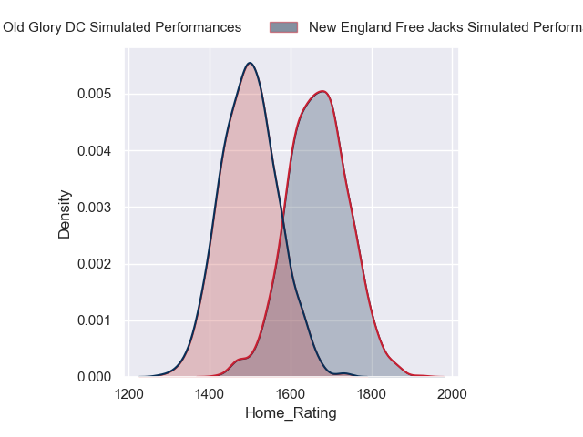
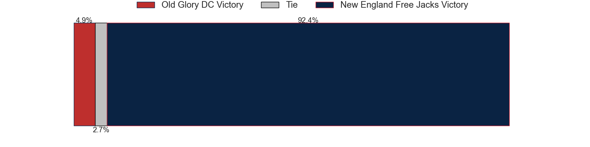
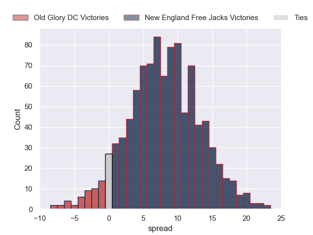

### Houston SaberCats V Dallas Jackals on 2024/07/21

Average Margin: Houston SaberCats by 7.9

Average Scoreline: 36-28

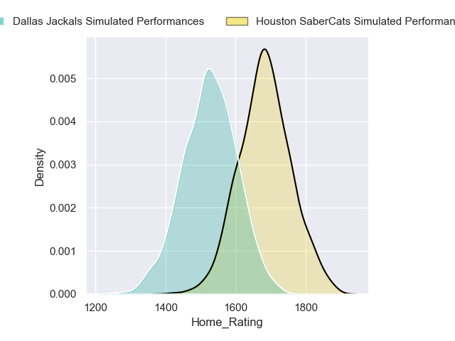
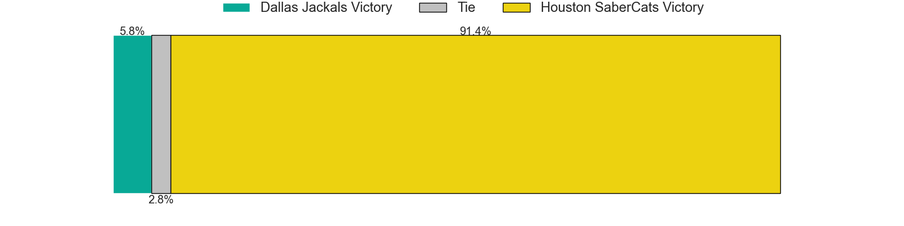
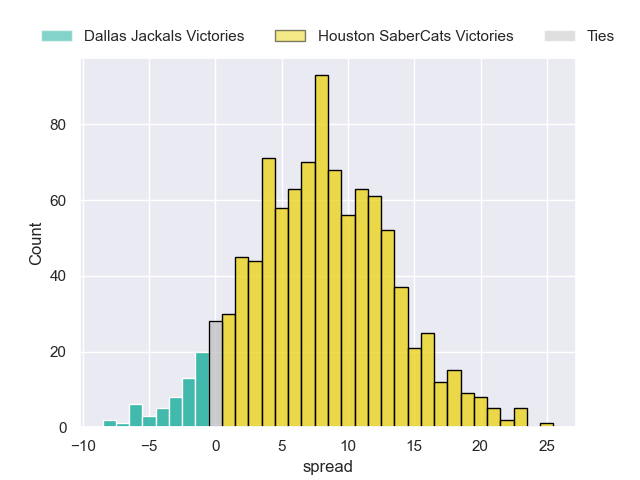

## Week 22

### Seattle Seawolves V San Diego Legion on 2024/07/22

Average Margin: Seattle Seawolves by 1.7

Average Scoreline: 27-26

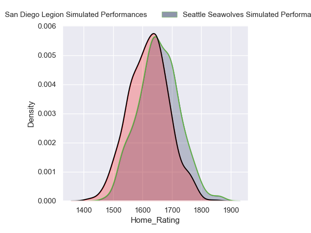
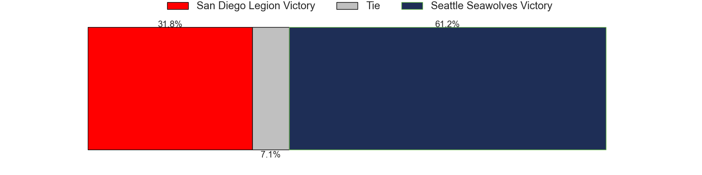
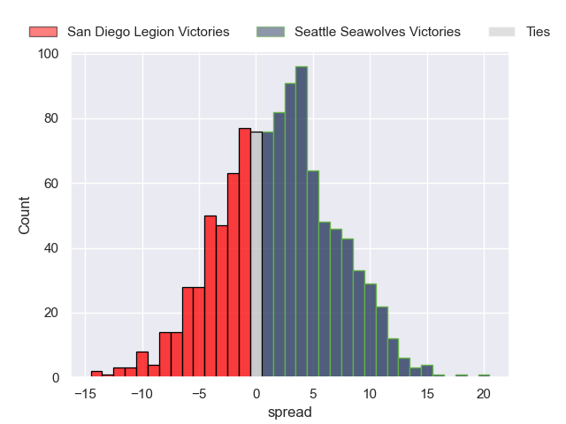

### NOLA Gold V Chicago Hounds on 2024/07/22

Average Margin: NOLA Gold by 3.7

Average Scoreline: 30-27

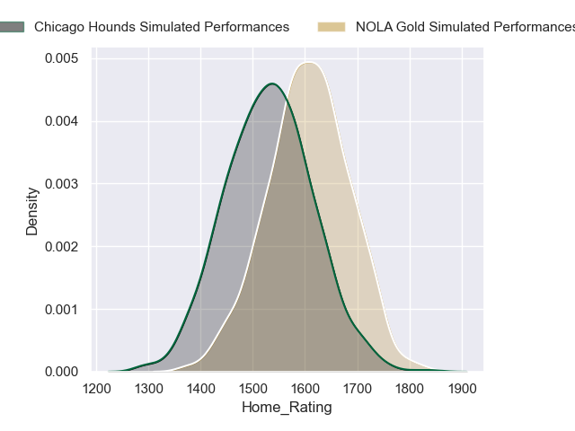
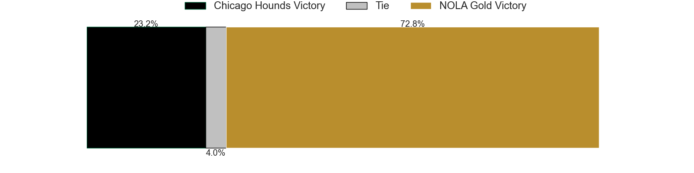
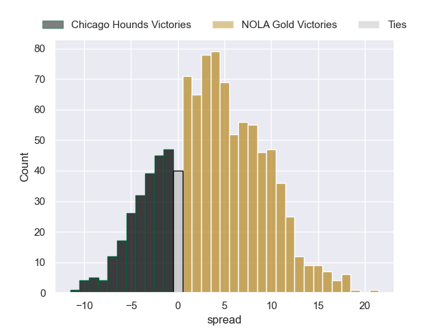

