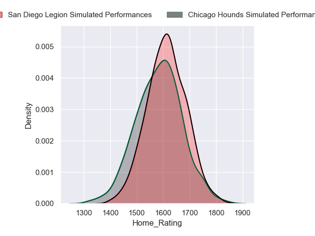
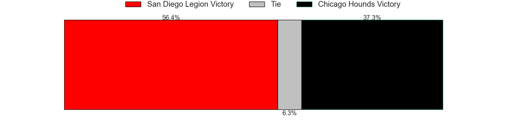
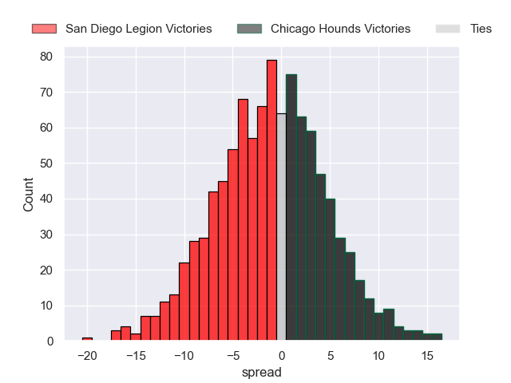

---  
title: "Major League Rugby 2024 Status"  
date: 2024-06-17 6:00:00 -0500  
categories: model review projection  
layout: article  
aside:  
    toc: true  
---
# Current Team Rankings

# Standings

## Current Standings

| Club                   |   Played |   Wins |   Point Differential |   Losing Bonus Points |   Try Bonus Points |   Competition Points |
|:-----------------------|---------:|-------:|---------------------:|----------------------:|-------------------:|---------------------:|
| Houston SaberCats      |       16 |     15 |                  171 |                     0 |                nan |                   68 |
| Seattle Seawolves      |       18 |     12 |                  131 |                     5 |                nan |                   61 |
| New England Free Jacks |       17 |     11 |                  116 |                     4 |                nan |                   55 |
| Dallas Jackals         |       18 |      8 |                   56 |                     9 |                nan |                   48 |
| San Diego Legion       |       14 |     10 |                   34 |                     3 |                nan |                   48 |
| NOLA Gold              |       15 |     10 |                   89 |                     1 |                nan |                   46 |
| Old Glory DC           |       17 |      9 |                  -18 |                     4 |                nan |                   44 |
| RFC Los Angeles        |       17 |      6 |                 -111 |                     2 |                nan |                   35 |
| Utah Warriors          |       17 |      5 |                  -49 |                     8 |                nan |                   32 |
| Chicago Hounds         |       14 |      5 |                   39 |                     5 |                nan |                   31 |
| Miami Sharks           |       17 |      6 |                  -69 |                     5 |                nan |                   31 |
| Anthem RC              |       18 |      0 |                 -389 |                     2 |                nan |                    7 |

## Projected Remaining Table

| Club                   |   Matches Remaining |   Wins |   Point Differential |   Losing Bonus Points |   Try Bonus Points |   Competition Points |
|:-----------------------|--------------------:|-------:|---------------------:|----------------------:|-------------------:|---------------------:|
| Utah Warriors          |                   3 |    2.6 |             21.238   |                   0.4 |                1.3 |                 12   |
| Chicago Hounds         |                   3 |    2.3 |             24.1153  |                   0.5 |                1.3 |                 11   |
| San Diego Legion       |                   3 |    2   |              7.35194 |                   0.9 |                0.9 |                  9.9 |
| New England Free Jacks |                   2 |    1.6 |             29.6947  |                   0.4 |                1.3 |                  8   |
| Houston SaberCats      |                   2 |    1.3 |              8.24615 |                   0.5 |                0.6 |                  6.5 |
| Seattle Seawolves      |                   2 |    1.2 |              9.8065  |                   0.5 |                0.9 |                  6.2 |
| Old Glory DC           |                   2 |    1.2 |              3.54622 |                   0.7 |                0.6 |                  6.2 |
| NOLA Gold              |                   2 |    0.7 |             -3.92866 |                   1   |                0.5 |                  4.3 |
| Miami Sharks           |                   2 |    0.5 |             -9.26302 |                   0.8 |                0.3 |                  3.2 |
| Dallas Jackals         |                   2 |    0.3 |            -12.687   |                   0.7 |                0.6 |                  2.6 |
| RFC Los Angeles        |                   3 |    0.1 |            -32.5363  |                   0.7 |                1.1 |                  2.1 |
| Anthem RC              |                   2 |    0   |            -45.5839  |                   0.1 |                0.3 |                  0.5 |

## Projected Total Table

| Club                   |   Total Matches |   Wins |   Point Differential |   Losing Bonus Points |   Try Bonus Points |   Competition Points |
|:-----------------------|----------------:|-------:|---------------------:|----------------------:|-------------------:|---------------------:|
| Houston SaberCats      |              18 |   16.3 |             179.246  |                   0.5 |                0.6 |                 74.5 |
| Seattle Seawolves      |              20 |   13.2 |             140.806  |                   5.5 |                0.9 |                 67.2 |
| New England Free Jacks |              19 |   12.6 |             145.695  |                   4.4 |                1.3 |                 63   |
| San Diego Legion       |              17 |   12   |              41.3519 |                   3.9 |                0.9 |                 57.9 |
| Dallas Jackals         |              20 |    8.3 |              43.313  |                   9.7 |                0.6 |                 50.6 |
| NOLA Gold              |              17 |   10.7 |              85.0713 |                   2   |                0.5 |                 50.3 |
| Old Glory DC           |              19 |   10.2 |             -14.4538 |                   4.7 |                0.6 |                 50.2 |
| Utah Warriors          |              20 |    7.6 |             -27.762  |                   8.4 |                1.3 |                 44   |
| Chicago Hounds         |              17 |    7.3 |              63.1153 |                   5.5 |                1.3 |                 42   |
| RFC Los Angeles        |              20 |    6.1 |            -143.536  |                   2.7 |                1.1 |                 37.1 |
| Miami Sharks           |              19 |    6.5 |             -78.263  |                   5.8 |                0.3 |                 34.2 |
| Anthem RC              |              20 |    0   |            -434.584  |                   2.1 |                0.3 |                  7.5 |

# Completed Match Review

| Model | Percent Correct Predictions | Spread Error |
| ------ | ------ | ------ |
| Club Level | 60.6% | 12.0 |
| Player Level: Lineup | 57.0% | 11.3 |
| Player Level: Minutes | 57.7% | 11.2 |

# Future Predictions

## Week 19

### Chicago Hounds V San Diego Legion on 2024/06/18

Average Margin: San Diego Legion by 1.4

Average Scoreline: 24-23

### NOLA Gold V New England Free Jacks on 2024/06/22

Average Margin: New England Free Jacks by 1.4

Average Scoreline: 28-27

### Miami Sharks V Old Glory DC on 2024/06/22

Average Margin: Old Glory DC by 1.0

Average Scoreline: 29-28

### Anthem RC V Chicago Hounds on 2024/06/22

Average Margin: Chicago Hounds by 17.3

Average Scoreline: 43-25

### Utah Warriors V Dallas Jackals on 2024/06/22

Average Margin: Utah Warriors by 2.9

Average Scoreline: 28-25

### Seattle Seawolves V RFC Los Angeles on 2024/06/22

Average Margin: Seattle Seawolves by 14.2

Average Scoreline: 37-23

### San Diego Legion V Houston SaberCats on 2024/06/23

Average Margin: San Diego Legion by 1.6

Average Scoreline: 32-31

## Week 20

### Utah Warriors V RFC Los Angeles on 2024/06/28

Average Margin: Utah Warriors by 9.1

Average Scoreline: 31-22

### Houston SaberCats V Dallas Jackals on 2024/06/29

Average Margin: Houston SaberCats by 9.8

Average Scoreline: 29-19

### Chicago Hounds V Miami Sharks on 2024/06/29

Average Margin: Chicago Hounds by 8.3

Average Scoreline: 31-23

### New England Free Jacks V Anthem RC on 2024/06/29

Average Margin: New England Free Jacks by 28.3

Average Scoreline: 41-12

### San Diego Legion V Seattle Seawolves on 2024/06/29

Average Margin: San Diego Legion by 4.3

Average Scoreline: 29-25

### Old Glory DC V NOLA Gold on 2024/06/29

Average Margin: Old Glory DC by 2.6

Average Scoreline: 25-23

### Utah Warriors V RFC Los Angeles on 2024/06/30

Average Margin: Utah Warriors by 9.3

Average Scoreline: 31-22

