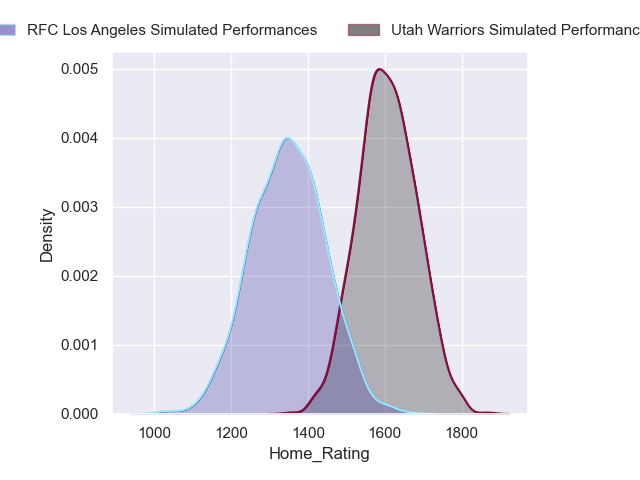
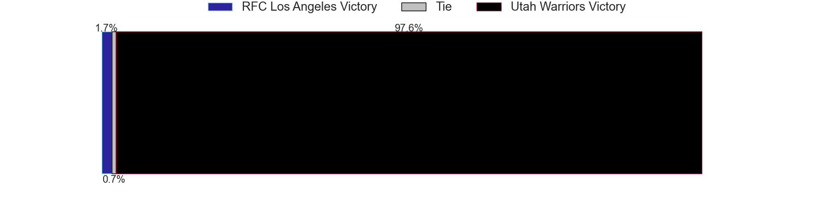
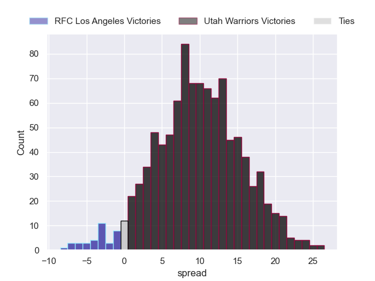

---  
title: "Major League Rugby 2024 Status"  
date: 2024-06-20 6:00:00 -0500  
categories: model review projection  
layout: article  
aside:  
    toc: true  
---
# Current Team Rankings

# Standings

## Current Standings

| Club                   |   Played |   Wins |   Point Differential |   Losing Bonus Points |   Try Bonus Points |   Competition Points |
|:-----------------------|---------:|-------:|---------------------:|----------------------:|-------------------:|---------------------:|
| Houston SaberCats      |       16 |     15 |                  171 |                     0 |                nan |                   68 |
| Seattle Seawolves      |       18 |     12 |                  131 |                     5 |                nan |                   61 |
| New England Free Jacks |       17 |     11 |                  116 |                     4 |                nan |                   55 |
| Dallas Jackals         |       18 |      8 |                   56 |                     9 |                nan |                   48 |
| San Diego Legion       |       14 |     10 |                   34 |                     3 |                nan |                   48 |
| NOLA Gold              |       15 |     10 |                   89 |                     1 |                nan |                   46 |
| Old Glory DC           |       17 |      9 |                  -18 |                     4 |                nan |                   44 |
| RFC Los Angeles        |       17 |      6 |                 -111 |                     2 |                nan |                   35 |
| Utah Warriors          |       17 |      5 |                  -49 |                     8 |                nan |                   32 |
| Chicago Hounds         |       14 |      5 |                   39 |                     5 |                nan |                   31 |
| Miami Sharks           |       17 |      6 |                  -69 |                     5 |                nan |                   31 |
| Anthem RC              |       18 |      0 |                 -389 |                     2 |                nan |                    7 |

## Projected Remaining Table

| Club                   |   Matches Remaining |   Wins |   Point Differential |   Losing Bonus Points |   Try Bonus Points |   Competition Points |
|:-----------------------|--------------------:|-------:|---------------------:|----------------------:|-------------------:|---------------------:|
| Utah Warriors          |                   3 |    2.6 |             20.8526  |                   0.4 |                1.3 |                 12.1 |
| Chicago Hounds         |                   2 |    1.9 |             25.8153  |                   0.1 |                1.1 |                  8.8 |
| New England Free Jacks |                   2 |    1.6 |             29.7219  |                   0.3 |                1.3 |                  8.1 |
| San Diego Legion       |                   2 |    1.4 |              6.02277 |                   0.5 |                0.5 |                  6.8 |
| Houston SaberCats      |                   2 |    1.3 |              8.27765 |                   0.5 |                0.7 |                  6.5 |
| Old Glory DC           |                   2 |    1.3 |              3.43147 |                   0.6 |                0.6 |                  6.3 |
| Seattle Seawolves      |                   2 |    1.2 |              9.53845 |                   0.5 |                1   |                  6.2 |
| NOLA Gold              |                   2 |    0.7 |             -3.78469 |                   1   |                0.5 |                  4.2 |
| Miami Sharks           |                   2 |    0.5 |             -9.48981 |                   0.7 |                0.3 |                  3.1 |
| Dallas Jackals         |                   2 |    0.3 |            -12.7428  |                   0.8 |                0.6 |                  2.7 |
| RFC Los Angeles        |                   3 |    0.1 |            -31.9486  |                   0.7 |                1.1 |                  2.2 |
| Anthem RC              |                   2 |    0   |            -45.6942  |                   0.1 |                0.3 |                  0.4 |

## Projected Total Table

| Club                   |   Total Matches |   Wins |   Point Differential |   Losing Bonus Points |   Try Bonus Points |   Competition Points |
|:-----------------------|----------------:|-------:|---------------------:|----------------------:|-------------------:|---------------------:|
| Houston SaberCats      |              18 |   16.3 |             179.278  |                   0.5 |                0.7 |                 74.5 |
| Seattle Seawolves      |              20 |   13.2 |             140.538  |                   5.5 |                1   |                 67.2 |
| New England Free Jacks |              19 |   12.6 |             145.722  |                   4.3 |                1.3 |                 63.1 |
| San Diego Legion       |              16 |   11.4 |              40.0228 |                   3.5 |                0.5 |                 54.8 |
| Dallas Jackals         |              20 |    8.3 |              43.2572 |                   9.8 |                0.6 |                 50.7 |
| Old Glory DC           |              19 |   10.3 |             -14.5685 |                   4.6 |                0.6 |                 50.3 |
| NOLA Gold              |              17 |   10.7 |              85.2153 |                   2   |                0.5 |                 50.2 |
| Utah Warriors          |              20 |    7.6 |             -28.1474 |                   8.4 |                1.3 |                 44.1 |
| Chicago Hounds         |              16 |    6.9 |              64.8153 |                   5.1 |                1.1 |                 39.8 |
| RFC Los Angeles        |              20 |    6.1 |            -142.949  |                   2.7 |                1.1 |                 37.2 |
| Miami Sharks           |              19 |    6.5 |             -78.4898 |                   5.7 |                0.3 |                 34.1 |
| Anthem RC              |              20 |    0   |            -434.694  |                   2.1 |                0.3 |                  7.4 |

# Completed Match Review

| Model | Percent Correct Predictions | Spread Error |
| ------ | ------ | ------ |
| Club Level | 60.6% | 12.0 |
| Player Level: Lineup | 57.0% | 11.3 |
| Player Level: Minutes | 57.7% | 11.2 |

# Future Predictions

## Week 19

### Seattle Seawolves V RFC Los Angeles on 2024/06/22

Average Margin: Seattle Seawolves by 13.8

Average Scoreline: 37-23

### NOLA Gold V New England Free Jacks on 2024/06/22

Average Margin: New England Free Jacks by 1.3

Average Scoreline: 28-27

### Utah Warriors V Dallas Jackals on 2024/06/22

Average Margin: Utah Warriors by 2.7

Average Scoreline: 28-25

### Miami Sharks V Old Glory DC on 2024/06/22

Average Margin: Old Glory DC by 1.0

Average Scoreline: 29-28

### Anthem RC V Chicago Hounds on 2024/06/22

Average Margin: Chicago Hounds by 17.3

Average Scoreline: 43-25

### San Diego Legion V Houston SaberCats on 2024/06/23

Average Margin: San Diego Legion by 1.7

Average Scoreline: 32-31

## Week 20

### Utah Warriors V RFC Los Angeles on 2024/06/28

Average Margin: Utah Warriors by 9.0

Average Scoreline: 31-22

### Old Glory DC V NOLA Gold on 2024/06/29

Average Margin: Old Glory DC by 2.4

Average Scoreline: 25-23

### Chicago Hounds V Miami Sharks on 2024/06/29

Average Margin: Chicago Hounds by 8.5

Average Scoreline: 31-23

### Houston SaberCats V Dallas Jackals on 2024/06/29

Average Margin: Houston SaberCats by 10.0

Average Scoreline: 29-19

### San Diego Legion V Seattle Seawolves on 2024/06/29

Average Margin: San Diego Legion by 4.3

Average Scoreline: 29-25

### New England Free Jacks V Anthem RC on 2024/06/29

Average Margin: New England Free Jacks by 28.4

Average Scoreline: 41-12

### Utah Warriors V RFC Los Angeles on 2024/06/30

Average Margin: Utah Warriors by 9.1

Average Scoreline: 31-22

