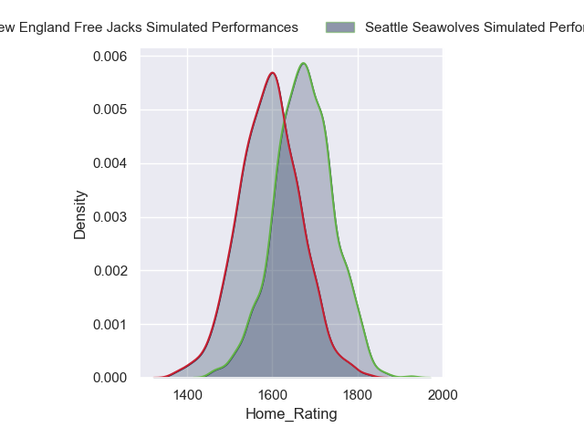
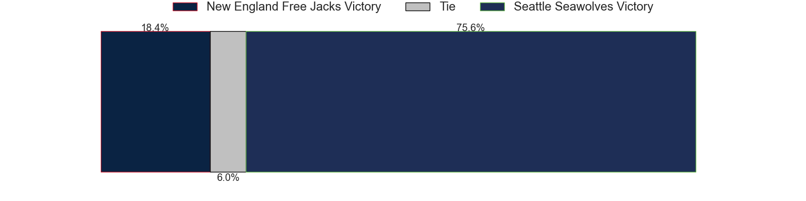
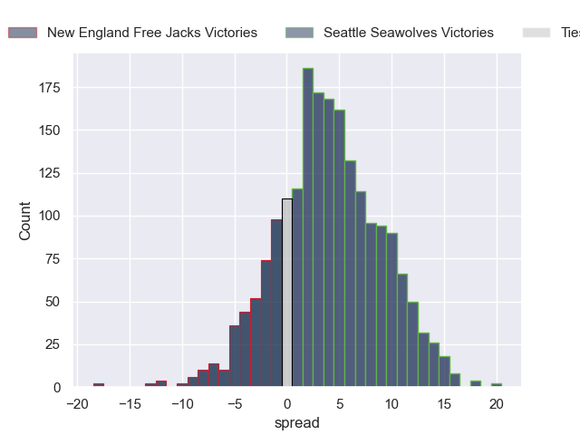

---  
title: "Major League Rugby 2024 Status"  
date: 2024-07-29 6:00:00 -0500  
categories: model review projection  
layout: article  
aside:  
    toc: true  
---
# Current Team Rankings

# Standings

## Current Standings

| Club                   |   Played |   Wins |   Point Differential |   Losing Bonus Points |   Try Bonus Points |   Competition Points |
|:-----------------------|---------:|-------:|---------------------:|----------------------:|-------------------:|---------------------:|
| Seattle Seawolves      |       20 |     14 |                  132 |                     4 |                nan |                   69 |
| Houston SaberCats      |       18 |     14 |                  107 |                     0 |                nan |                   64 |
| New England Free Jacks |       19 |     13 |                  129 |                     3 |                nan |                   62 |
| Dallas Jackals         |       20 |      9 |                   74 |                    10 |                nan |                   54 |
| San Diego Legion       |       17 |     11 |                   49 |                     5 |                nan |                   54 |
| NOLA Gold              |       19 |     11 |                   48 |                     2 |                nan |                   51 |
| Chicago Hounds         |       18 |      9 |                  103 |                     5 |                nan |                   49 |
| Old Glory DC           |       17 |      8 |                  -26 |                     5 |                nan |                   42 |
| Utah Warriors          |       18 |      6 |                  -47 |                     8 |                nan |                   36 |
| RFC Los Angeles        |       16 |      5 |                 -106 |                     2 |                nan |                   31 |
| Miami Sharks           |       17 |      6 |                  -75 |                     4 |                nan |                   30 |
| Anthem RC              |       17 |      0 |                 -388 |                     1 |                nan |                    6 |

## Projected Remaining Table

| Club                   |   Matches Remaining |   Wins |   Point Differential |   Losing Bonus Points |   Try Bonus Points |   Competition Points |
|:-----------------------|--------------------:|-------:|---------------------:|----------------------:|-------------------:|---------------------:|
| Seattle Seawolves      |                   2 |    1.6 |              7.65828 |                   0.4 |                0.5 |                  7.2 |
| New England Free Jacks |                   2 |    0.4 |             -7.65828 |                   1.1 |                0.5 |                  3.3 |

## Projected Total Table

| Club                   |   Total Matches |   Wins |   Point Differential |   Losing Bonus Points |   Try Bonus Points |   Competition Points |
|:-----------------------|----------------:|-------:|---------------------:|----------------------:|-------------------:|---------------------:|
| Seattle Seawolves      |              22 |   15.6 |              139.658 |                   4.4 |                0.5 |                 76.2 |
| New England Free Jacks |              21 |   13.4 |              121.342 |                   4.1 |                0.5 |                 65.3 |
| Houston SaberCats      |              18 |   14   |              107     |                   0   |                0   |                 64   |
| Dallas Jackals         |              20 |    9   |               74     |                  10   |                0   |                 54   |
| San Diego Legion       |              17 |   11   |               49     |                   5   |                0   |                 54   |
| NOLA Gold              |              19 |   11   |               48     |                   2   |                0   |                 51   |
| Chicago Hounds         |              18 |    9   |              103     |                   5   |                0   |                 49   |
| Old Glory DC           |              17 |    8   |              -26     |                   5   |                0   |                 42   |
| Utah Warriors          |              18 |    6   |              -47     |                   8   |                0   |                 36   |
| RFC Los Angeles        |              16 |    5   |             -106     |                   2   |                0   |                 31   |
| Miami Sharks           |              17 |    6   |              -75     |                   4   |                0   |                 30   |
| Anthem RC              |              17 |    0   |             -388     |                   1   |                0   |                  6   |

## Projected Playoff Results

|                        | Reach Final   | Win Final   |
|:-----------------------|:--------------|:------------|
| Seattle Seawolves      | 200.0 %       | 117.0 %     |
| New England Free Jacks | 200.0 %       | 83.0 %      |

# Completed Match Review

| Model | Percent Correct Predictions | Spread Error |
| ------ | ------ | ------ |
| Club Level | 63.0% | 11.5 |
| Player Level: Lineup | 56.0% | 11.8 |
| Player Level: Minutes | 56.6% | 11.6 |

# Future Predictions

## Week 21

### Seattle Seawolves V New England Free Jacks on 2024/08/04

Average Margin: Seattle Seawolves by 3.8

Average Scoreline: 26-23

### Seattle Seawolves V New England Free Jacks on 2024/08/04

Average Margin: Seattle Seawolves by 3.8

Average Scoreline: 26-23

