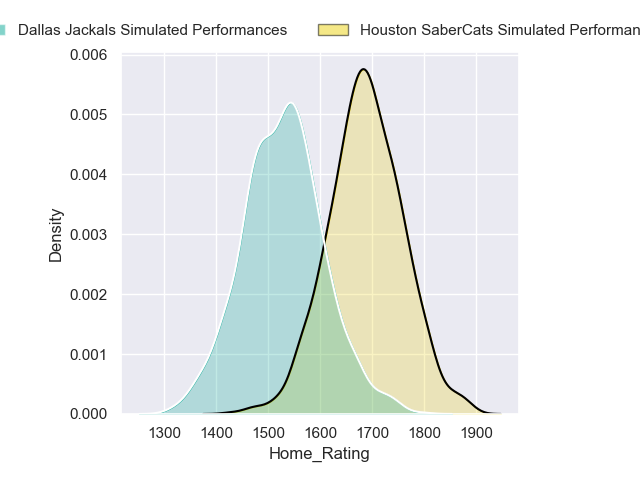
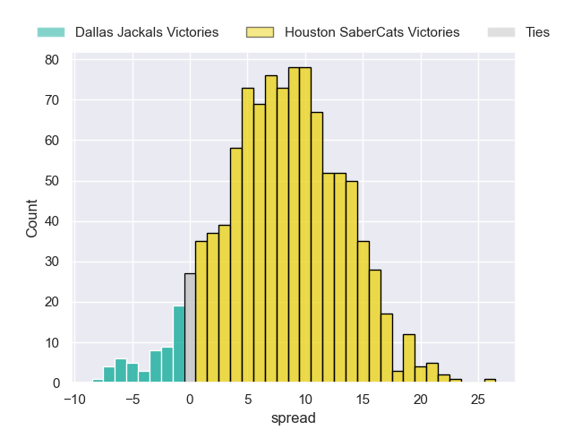
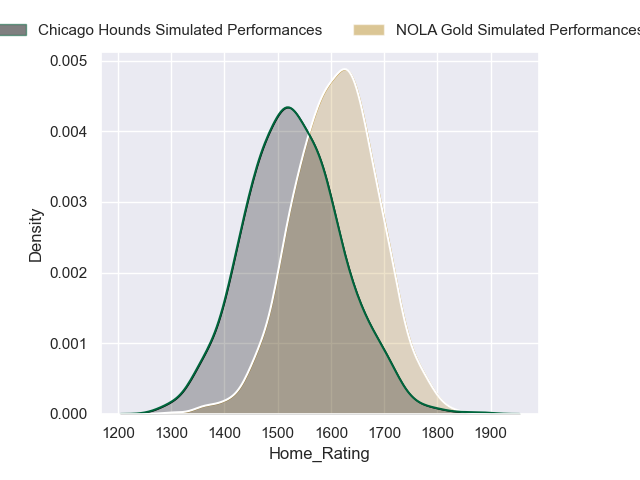
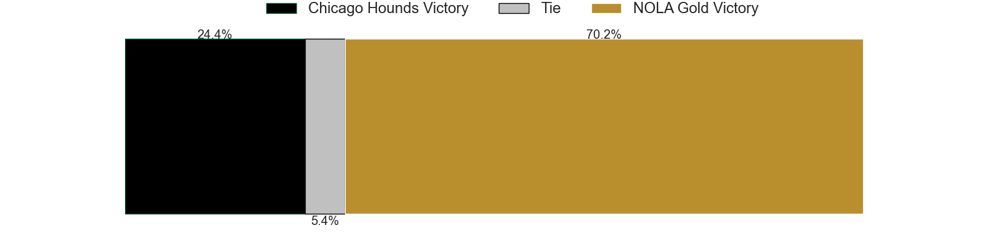
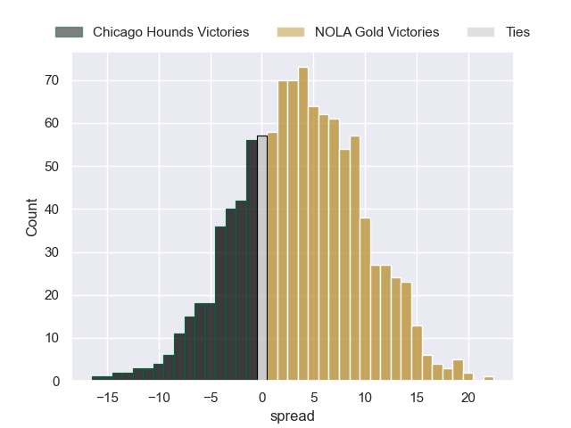

---  
title: "Major League Rugby 2024 Status"  
date: 2024-07-19 6:00:00 -0500  
categories: model review projection  
layout: article  
aside:  
    toc: true  
---
# Standings

## Current Standings

| Club                   |   Played |   Wins |   Point Differential |   Losing Bonus Points |   Try Bonus Points |   Competition Points |
|:-----------------------|---------:|-------:|---------------------:|----------------------:|-------------------:|---------------------:|
| Houston SaberCats      |       18 |     16 |                  159 |                     0 |                nan |                   72 |
| Seattle Seawolves      |       20 |     13 |                  136 |                     5 |                nan |                   65 |
| New England Free Jacks |       19 |     12 |                  139 |                     4 |                nan |                   59 |
| San Diego Legion       |       16 |     12 |                   59 |                     3 |                nan |                   56 |
| NOLA Gold              |       17 |     11 |                   96 |                     2 |                nan |                   51 |
| Dallas Jackals         |       20 |      8 |                   51 |                    11 |                nan |                   50 |
| Old Glory DC           |       19 |     10 |                  -20 |                     5 |                nan |                   49 |
| Chicago Hounds         |       16 |      7 |                   60 |                     5 |                nan |                   39 |
| RFC Los Angeles        |       19 |      7 |                 -121 |                     2 |                nan |                   39 |
| Utah Warriors          |       19 |      6 |                  -52 |                     9 |                nan |                   37 |
| Miami Sharks           |       19 |      7 |                  -76 |                     5 |                nan |                   35 |
| Anthem RC              |       20 |      0 |                 -431 |                     2 |                nan |                    7 |

## Projected Playoff Results

|                        | quarterfinal qualifiers   | Reach Semifinals   | Reach Final   | Win Final   |
|:-----------------------|:--------------------------|:-------------------|:--------------|:------------|
| Houston SaberCats      | 100.0 %                   | 94.5 %             | 76.7 %        | 49.5 %      |
| New England Free Jacks | 100.0 %                   | 94.8 %             | 85.7 %        | 31.3 %      |
| San Diego Legion       | 100.0 %                   | 38.2 %             | 11.0 %        | 9.7 %       |
| Seattle Seawolves      | 100.0 %                   | 61.8 %             | 9.4 %         | 4.9 %       |
| NOLA Gold              | 100.0 %                   | 76.6 %             | 8.9 %         | 2.1 %       |
| Dallas Jackals         | 100.0 %                   | 5.5 %              | 2.9 %         | 1.3 %       |
| Old Glory DC           | 100.0 %                   | 5.2 %              | 3.2 %         | 0.6 %       |
| Chicago Hounds         | 100.0 %                   | 23.4 %             | 2.2 %         | 0.6 %       |

# Completed Match Review

| Model | Percent Correct Predictions | Spread Error |
| ------ | ------ | ------ |
| Club Level | 63.1% | 11.4 |
| Player Level: Lineup | 60.7% | 11.1 |
| Player Level: Minutes | 60.6% | 11.0 |

# Future Predictions

## quarterfinal

### New England Free Jacks V Old Glory DC on 2024/07/20

Average Margin: New England Free Jacks by 8.5

Average Scoreline: 38-29

### Houston SaberCats V Dallas Jackals on 2024/07/20

Average Margin: Houston SaberCats by 8.2

Average Scoreline: 36-28

### NOLA Gold V Chicago Hounds on 2024/07/21

Average Margin: NOLA Gold by 4.1

Average Scoreline: 31-26

## quarterfinal

### Seattle Seawolves V San Diego Legion on 2024/07/22

Average Margin: Seattle Seawolves by 1.7

Average Scoreline: 27-26

