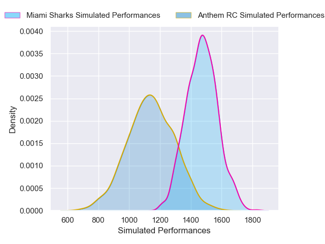
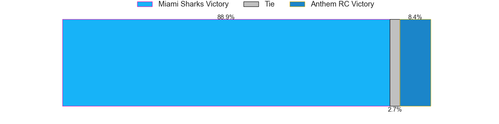
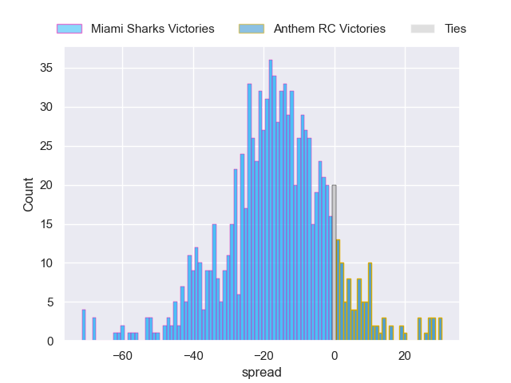
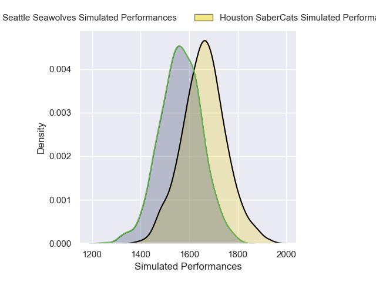
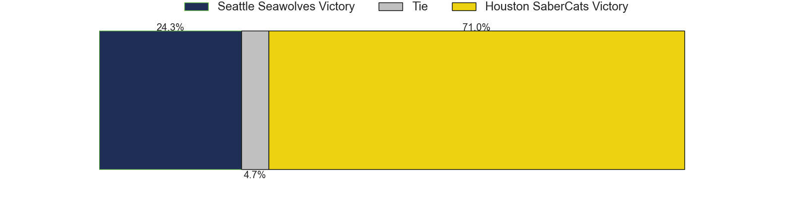
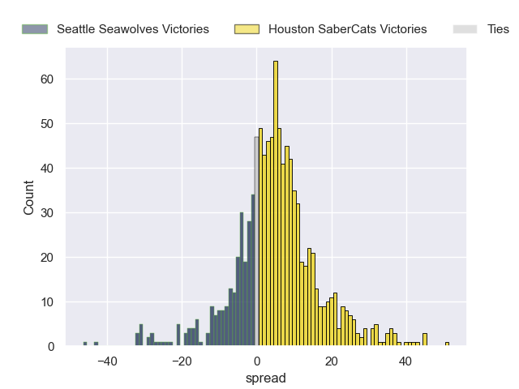

---  
title: "Major League Rugby 2025 Status"  
date: 2025-02-27 6:00:00 -0500  
categories: model review projection  
layout: article  
aside:  
    toc: true  
---
# Current Team Rankings

# Standings

## Current Standings

| Club                   |   Played |   Wins |   Point Differential |   Losing Bonus Points |   Try Bonus Points |   Competition Points |
|:-----------------------|---------:|-------:|---------------------:|----------------------:|-------------------:|---------------------:|
| San Diego Legion       |        2 |      2 |                   61 |                     0 |                  2 |                   10 |
| Miami Sharks           |        2 |      2 |                   23 |                     0 |                  1 |                    9 |
| Houston SaberCats      |        2 |      1 |                   14 |                     1 |                  1 |                    6 |
| Chicago Hounds         |        2 |      1 |                  -11 |                     0 |                  2 |                    6 |
| NOLA Gold              |        2 |      1 |                   16 |                     1 |                nan |                    5 |
| Utah Warriors          |        1 |      1 |                   14 |                     0 |                  1 |                    5 |
| New England Free Jacks |        1 |      1 |                    7 |                     0 |                  1 |                    5 |
| Seattle Seawolves      |        1 |      0 |                  -14 |                     0 |                  1 |                    1 |
| Old Glory DC           |        1 |      0 |                  -18 |                     0 |                  1 |                    1 |
| RFC Los Angeles        |        2 |      0 |                  -24 |                     1 |                nan |                    1 |
| Anthem RC              |        2 |      0 |                  -68 |                     0 |                nan |                    0 |

## Projected Remaining Table

| Club                   |   Matches Remaining |   Wins |   Point Differential |   Losing Bonus Points |   Try Bonus Points |   Competition Points |
|:-----------------------|--------------------:|-------:|---------------------:|----------------------:|-------------------:|---------------------:|
| New England Free Jacks |                  15 |   10.6 |              99.1434 |                   2.7 |                6.4 |                 51.6 |
| San Diego Legion       |                  14 |   10.2 |             100.024  |                   2.3 |                6.4 |                 49.6 |
| Seattle Seawolves      |                  15 |    9.5 |              79.6623 |                   3.1 |                6.1 |                 47.3 |
| Houston SaberCats      |                  14 |    8.9 |              77.5331 |                   2.7 |                6.6 |                 45   |
| Chicago Hounds         |                  14 |    8.3 |              58.3258 |                   2.8 |                5.6 |                 41.8 |
| Utah Warriors          |                  15 |    8   |              21.385  |                   3.7 |                5   |                 40.5 |
| Old Glory DC           |                  15 |    6.6 |             -12.7687 |                   3.6 |                4.7 |                 34.7 |
| NOLA Gold              |                  14 |    6.5 |              -6.5585 |                   3.5 |                3.9 |                 33.3 |
| Miami Sharks           |                  14 |    5.6 |             -24.948  |                   3.5 |                4.1 |                 29.9 |
| RFC Los Angeles        |                  14 |    3.6 |            -102.815  |                   3.2 |                3.1 |                 20.7 |
| Anthem RC              |                  14 |    1.2 |            -288.984  |                   1.5 |                1.5 |                  7.6 |

## Projected Total Table

| Club                   |   Total Matches |   Wins |   Point Differential |   Losing Bonus Points |   Try Bonus Points |   Competition Points |
|:-----------------------|----------------:|-------:|---------------------:|----------------------:|-------------------:|---------------------:|
| San Diego Legion       |              16 |   12.2 |            161.024   |                   2.3 |                8.4 |                 59.6 |
| New England Free Jacks |              16 |   11.6 |            106.143   |                   2.7 |                7.4 |                 56.6 |
| Houston SaberCats      |              16 |    9.9 |             91.5331  |                   3.7 |                7.6 |                 51   |
| Seattle Seawolves      |              16 |    9.5 |             65.6623  |                   3.1 |                7.1 |                 48.3 |
| Chicago Hounds         |              16 |    9.3 |             47.3258  |                   2.8 |                7.6 |                 47.8 |
| Utah Warriors          |              16 |    9   |             35.385   |                   3.7 |                6   |                 45.5 |
| Miami Sharks           |              16 |    7.6 |             -1.94797 |                   3.5 |                5.1 |                 38.9 |
| NOLA Gold              |              16 |    7.5 |              9.4415  |                   4.5 |                3.9 |                 38.3 |
| Old Glory DC           |              16 |    6.6 |            -30.7687  |                   3.6 |                5.7 |                 35.7 |
| RFC Los Angeles        |              16 |    3.6 |           -126.815   |                   4.2 |                3.1 |                 21.7 |
| Anthem RC              |              16 |    1.2 |           -356.984   |                   1.5 |                1.5 |                  7.6 |

# Completed Match Review

| Model | Percent Correct Predictions | Spread Error |
| ------ | ------ | ------ |
| Club Level | 66.7% | 11.7 |
| Player Level: Lineup | 57.1% | 18.1 |
| Player Level: Minutes | 57.1% | 18.0 |

# Future Predictions

## Week 3

### Old Glory DC V San Diego Legion on 2025/03/01

Average Margin: San Diego Legion by 6.6

Average Scoreline: 33-27

### Anthem RC V Miami Sharks on 2025/03/01

Average Margin: Miami Sharks by 16.5

Average Scoreline: 38-22

### Utah Warriors V NOLA Gold on 2025/03/01

Average Margin: Utah Warriors by 5.8

Average Scoreline: 34-29

### Houston SaberCats V Seattle Seawolves on 2025/03/02

Average Margin: Houston SaberCats by 5.1

Average Scoreline: 29-24

### Chicago Hounds V New England Free Jacks on 2025/03/02

Average Margin: Chicago Hounds by 0.6

Average Scoreline: 31-31

## Week 4

### Miami Sharks V Chicago Hounds on 2025/03/08

Average Margin: Chicago Hounds by 1.0

Average Scoreline: 27-26

### Old Glory DC V Anthem RC on 2025/03/08

Average Margin: Old Glory DC by 23.8

Average Scoreline: 47-23

### Utah Warriors V Houston SaberCats on 2025/03/08

Average Margin: Utah Warriors by 0.9

Average Scoreline: 32-31

### San Diego Legion V RFC Los Angeles on 2025/03/08

Average Margin: San Diego Legion by 17.0

Average Scoreline: 40-23

### Seattle Seawolves V New England Free Jacks on 2025/03/08

Average Margin: Seattle Seawolves by 1.7

Average Scoreline: 32-30

## Week 5

### RFC Los Angeles V Seattle Seawolves on 2025/03/15

Average Margin: Seattle Seawolves by 6.5

Average Scoreline: 36-29

### Miami Sharks V Utah Warriors on 2025/03/15

Average Margin: Miami Sharks by 0.4

Average Scoreline: 31-31

### New England Free Jacks V NOLA Gold on 2025/03/15

Average Margin: New England Free Jacks by 10.6

Average Scoreline: 39-28

### Chicago Hounds V Old Glory DC on 2025/03/15

Average Margin: Chicago Hounds by 9.3

Average Scoreline: 37-28

## Week 6

### Anthem RC V Houston SaberCats on 2025/03/22

Average Margin: Houston SaberCats by 22.5

Average Scoreline: 47-24

### Old Glory DC V New England Free Jacks on 2025/03/22

Average Margin: New England Free Jacks by 4.8

Average Scoreline: 31-26

### San Diego Legion V Miami Sharks on 2025/03/22

Average Margin: San Diego Legion by 13.1

Average Scoreline: 35-22

### NOLA Gold V RFC Los Angeles on 2025/03/22

Average Margin: NOLA Gold by 10.3

Average Scoreline: 38-27

### Seattle Seawolves V Utah Warriors on 2025/03/22

Average Margin: Seattle Seawolves by 6.1

Average Scoreline: 33-27

## Week 7

### Houston SaberCats V San Diego Legion on 2025/03/29

Average Margin: Houston SaberCats by 1.5

Average Scoreline: 33-31

### Utah Warriors V New England Free Jacks on 2025/03/29

Average Margin: New England Free Jacks by 0.1

Average Scoreline: 29-29

### NOLA Gold V Chicago Hounds on 2025/03/29

Average Margin: NOLA Gold by 0.6

Average Scoreline: 29-29

### RFC Los Angeles V Old Glory DC on 2025/03/29

Average Margin: Old Glory DC by 0.2

Average Scoreline: 34-34

### Seattle Seawolves V Anthem RC on 2025/03/29

Average Margin: Seattle Seawolves by 28.6

Average Scoreline: 50-21

## Week 8

### Anthem RC V NOLA Gold on 2025/04/05

Average Margin: NOLA Gold by 16.9

Average Scoreline: 45-28

### Old Glory DC V Seattle Seawolves on 2025/04/05

Average Margin: Seattle Seawolves by 2.1

Average Scoreline: 30-28

### San Diego Legion V Chicago Hounds on 2025/04/05

Average Margin: San Diego Legion by 9.3

Average Scoreline: 29-20

### Houston SaberCats V RFC Los Angeles on 2025/04/05

Average Margin: Houston SaberCats by 13.7

Average Scoreline: 37-23

### New England Free Jacks V Miami Sharks on 2025/04/06

Average Margin: New England Free Jacks by 11.6

Average Scoreline: 37-26

## Week 9

### New England Free Jacks V San Diego Legion on 2025/04/12

Average Margin: New England Free Jacks by 2.5

Average Scoreline: 31-29

### Miami Sharks V Houston SaberCats on 2025/04/12

Average Margin: Houston SaberCats by 3.6

Average Scoreline: 31-28

### RFC Los Angeles V Utah Warriors on 2025/04/12

Average Margin: Utah Warriors by 4.5

Average Scoreline: 31-26

### NOLA Gold V Old Glory DC on 2025/04/12

Average Margin: NOLA Gold by 5.6

Average Scoreline: 31-25

### Chicago Hounds V Anthem RC on 2025/04/13

Average Margin: Chicago Hounds by 26.1

Average Scoreline: 49-23

## Week 10

### Anthem RC V New England Free Jacks on 2025/04/18

Average Margin: New England Free Jacks by 21.7

Average Scoreline: 48-26

### Seattle Seawolves V Chicago Hounds on 2025/04/18

Average Margin: Seattle Seawolves by 4.8

Average Scoreline: 31-26

### Houston SaberCats V NOLA Gold on 2025/04/19

Average Margin: Houston SaberCats by 8.7

Average Scoreline: 32-23

### Old Glory DC V Miami Sharks on 2025/04/19

Average Margin: Old Glory DC by 3.5

Average Scoreline: 29-25

### San Diego Legion V Utah Warriors on 2025/04/19

Average Margin: San Diego Legion by 9.4

Average Scoreline: 29-19

## Week 11

### New England Free Jacks V RFC Los Angeles on 2025/04/22

Average Margin: New England Free Jacks by 15.7

Average Scoreline: 39-24

### Anthem RC V Seattle Seawolves on 2025/04/23

Average Margin: Seattle Seawolves by 19.5

Average Scoreline: 46-26

### RFC Los Angeles V San Diego Legion on 2025/04/26

Average Margin: San Diego Legion by 9.6

Average Scoreline: 30-20

### Utah Warriors V Chicago Hounds on 2025/04/26

Average Margin: Utah Warriors by 3.1

Average Scoreline: 27-24

### Houston SaberCats V Old Glory DC on 2025/04/26

Average Margin: Houston SaberCats by 10.9

Average Scoreline: 36-25

### Miami Sharks V Anthem RC on 2025/04/27

Average Margin: Miami Sharks by 22.4

Average Scoreline: 42-20

### NOLA Gold V Seattle Seawolves on 2025/04/27

Average Margin: Seattle Seawolves by 0.0

Average Scoreline: 24-24

## Week 12

### Utah Warriors V San Diego Legion on 2025/04/30

Average Margin: San Diego Legion by 2.4

Average Scoreline: 24-22

### Seattle Seawolves V RFC Los Angeles on 2025/05/02

Average Margin: Seattle Seawolves by 12.4

Average Scoreline: 36-24

### San Diego Legion V NOLA Gold on 2025/05/04

Average Margin: San Diego Legion by 11.2

Average Scoreline: 35-23

### Chicago Hounds V Miami Sharks on 2025/05/04

Average Margin: Chicago Hounds by 8.4

Average Scoreline: 33-24

### New England Free Jacks V Houston SaberCats on 2025/05/04

Average Margin: New England Free Jacks by 5.8

Average Scoreline: 30-25

### Old Glory DC V Utah Warriors on 2025/05/04

Average Margin: Old Glory DC by 0.2

Average Scoreline: 24-24

## Week 13

### NOLA Gold V Miami Sharks on 2025/05/09

Average Margin: NOLA Gold by 5.5

Average Scoreline: 32-26

### RFC Los Angeles V Anthem RC on 2025/05/10

Average Margin: RFC Los Angeles by 15.7

Average Scoreline: 38-22

### New England Free Jacks V Chicago Hounds on 2025/05/10

Average Margin: New England Free Jacks by 6.6

Average Scoreline: 30-23

### San Diego Legion V Houston SaberCats on 2025/05/10

Average Margin: San Diego Legion by 7.1

Average Scoreline: 31-24

## Week 14

### Utah Warriors V Seattle Seawolves on 2025/05/12

Average Margin: Utah Warriors by 1.9

Average Scoreline: 25-23

### Old Glory DC V NOLA Gold on 2025/05/13

Average Margin: Old Glory DC by 1.9

Average Scoreline: 31-29

### Houston SaberCats V Utah Warriors on 2025/05/17

Average Margin: Houston SaberCats by 6.7

Average Scoreline: 29-22

### Miami Sharks V New England Free Jacks on 2025/05/17

Average Margin: New England Free Jacks by 3.2

Average Scoreline: 28-25

### Seattle Seawolves V San Diego Legion on 2025/05/17

Average Margin: San Diego Legion by 0.5

Average Scoreline: 26-26

### Anthem RC V Old Glory DC on 2025/05/18

Average Margin: Old Glory DC by 12.3

Average Scoreline: 39-27

### Chicago Hounds V RFC Los Angeles on 2025/05/18

Average Margin: Chicago Hounds by 11.0

Average Scoreline: 36-25

## Week 15

### RFC Los Angeles V Miami Sharks on 2025/05/23

Average Margin: Miami Sharks by 0.2

Average Scoreline: 27-27

### Seattle Seawolves V Houston SaberCats on 2025/05/23

Average Margin: Seattle Seawolves by 2.6

Average Scoreline: 27-24

### NOLA Gold V Utah Warriors on 2025/05/24

Average Margin: NOLA Gold by 2.0

Average Scoreline: 29-27

### Anthem RC V Chicago Hounds on 2025/05/24

Average Margin: Chicago Hounds by 17.1

Average Scoreline: 43-26

### New England Free Jacks V Old Glory DC on 2025/05/24

Average Margin: New England Free Jacks by 10.9

Average Scoreline: 32-21

## Week 16

### Chicago Hounds V NOLA Gold on 2025/05/31

Average Margin: Chicago Hounds by 7.2

Average Scoreline: 31-23

### Old Glory DC V RFC Los Angeles on 2025/05/31

Average Margin: Old Glory DC by 7.2

Average Scoreline: 34-27

### Miami Sharks V San Diego Legion on 2025/05/31

Average Margin: San Diego Legion by 6.0

Average Scoreline: 31-25

### Utah Warriors V Anthem RC on 2025/05/31

Average Margin: Utah Warriors by 22.4

Average Scoreline: 41-18

### New England Free Jacks V Seattle Seawolves on 2025/06/01

Average Margin: New England Free Jacks by 5.8

Average Scoreline: 33-27

## Week 17

### Chicago Hounds V Houston SaberCats on 2025/06/04

Average Margin: Chicago Hounds by 2.2

Average Scoreline: 27-25

### Utah Warriors V RFC Los Angeles on 2025/06/07

Average Margin: Utah Warriors by 10.2

Average Scoreline: 30-20

### San Diego Legion V Old Glory DC on 2025/06/07

Average Margin: San Diego Legion by 11.9

Average Scoreline: 33-21

### NOLA Gold V New England Free Jacks on 2025/06/07

Average Margin: New England Free Jacks by 2.0

Average Scoreline: 28-26

### Seattle Seawolves V Miami Sharks on 2025/06/08

Average Margin: Seattle Seawolves by 8.5

Average Scoreline: 34-25

### Houston SaberCats V Anthem RC on 2025/06/08

Average Margin: Houston SaberCats by 23.5

Average Scoreline: 44-20

