---  
title: "Major League Rugby 2025 Status"  
date: 2025-06-09 6:00:00 -0500  
categories: model review projection  
layout: article  
aside:  
    toc: true  
---
# Current Team Rankings

# Standings

## Current Standings

| Club                   |   Played |   Wins |   Point Differential |   Losing Bonus Points |   Try Bonus Points |   Competition Points |
|:-----------------------|---------:|-------:|---------------------:|----------------------:|-------------------:|---------------------:|
| Utah Warriors          |       18 |     13 |                  118 |                     2 |                nan |                   66 |
| New England Free Jacks |       17 |     12 |                   86 |                     2 |                nan |                   57 |
| Houston SaberCats      |       18 |     10 |                  120 |                     5 |                nan |                   55 |
| Chicago Hounds         |       17 |     11 |                   67 |                     3 |                nan |                   55 |
| San Diego Legion       |       17 |      9 |                   61 |                     4 |                nan |                   52 |
| Seattle Seawolves      |       17 |      9 |                    9 |                     3 |                nan |                   48 |
| RFC Los Angeles        |       16 |      8 |                    4 |                     3 |                nan |                   46 |
| Miami Sharks           |       17 |      9 |                  -47 |                     3 |                nan |                   44 |
| Old Glory DC           |       16 |      7 |                  -53 |                     2 |                nan |                   39 |
| NOLA Gold              |       17 |      4 |                  -43 |                     9 |                nan |                   32 |
| RFCLA                  |       10 |      5 |                   13 |                     2 |                nan |                   24 |
| Anthem RC              |       18 |      0 |                 -335 |                     3 |                nan |                    3 |

## Projected Remaining Table

| Club                   |   Matches Remaining |   Wins |   Point Differential |   Losing Bonus Points |   Try Bonus Points |   Competition Points |
|:-----------------------|--------------------:|-------:|---------------------:|----------------------:|-------------------:|---------------------:|
| Utah Warriors          |                   1 |    0.9 |             13.092   |                   0.1 |                0.6 |                  4.2 |
| New England Free Jacks |                   1 |    0.9 |             10.7369  |                   0.1 |                0.4 |                  4   |
| Chicago Hounds         |                   1 |    0.8 |              8.95265 |                   0.1 |                0.5 |                  3.9 |
| Houston SaberCats      |                   1 |    0.6 |              3.09982 |                   0.2 |                0.3 |                  3   |
| RFCLA                  |                   1 |    0.4 |             -3.09982 |                   0.3 |                0.2 |                  2   |
| Old Glory DC           |                   1 |    0.2 |             -8.95265 |                   0.3 |                0.2 |                  1.1 |
| Miami Sharks           |                   1 |    0.1 |            -10.7369  |                   0.2 |                0.2 |                  0.9 |

## Projected Total Table

| Club                   |   Total Matches |   Wins |   Point Differential |   Losing Bonus Points |   Try Bonus Points |   Competition Points |
|:-----------------------|----------------:|-------:|---------------------:|----------------------:|-------------------:|---------------------:|
| Utah Warriors          |              19 |   13.9 |            131.092   |                   2.1 |                0.6 |                 70.2 |
| New England Free Jacks |              18 |   12.9 |             96.7369  |                   2.1 |                0.4 |                 61   |
| Chicago Hounds         |              18 |   11.8 |             75.9527  |                   3.1 |                0.5 |                 58.9 |
| Houston SaberCats      |              19 |   10.6 |            123.1     |                   5.2 |                0.3 |                 58   |
| San Diego Legion       |              17 |    9   |             61       |                   4   |                0   |                 52   |
| Seattle Seawolves      |              17 |    9   |              9       |                   3   |                0   |                 48   |
| RFC Los Angeles        |              16 |    8   |              4       |                   3   |                0   |                 46   |
| Miami Sharks           |              18 |    9.1 |            -57.7369  |                   3.2 |                0.2 |                 44.9 |
| Old Glory DC           |              17 |    7.2 |            -61.9527  |                   2.3 |                0.2 |                 40.1 |
| NOLA Gold              |              17 |    4   |            -43       |                   9   |                0   |                 32   |
| RFCLA                  |              11 |    5.4 |              9.90018 |                   2.3 |                0.2 |                 26   |
| Anthem RC              |              18 |    0   |           -335       |                   3   |                0   |                  3   |

# Completed Match Review

| Model | Percent Correct Predictions | Spread Error |
| ------ | ------ | ------ |
| Club Level | 66.7% | 11.8 |
| Player Level: Lineup | 69.6% | 10.6 |
| Player Level: Minutes | 78.3% | 9.8 |

# Future Predictions

## Week 19

### Chicago Hounds V Old Glory DC on 2025/06/14

Average Margin: Chicago Hounds by 9.0

Average Scoreline: 30-21

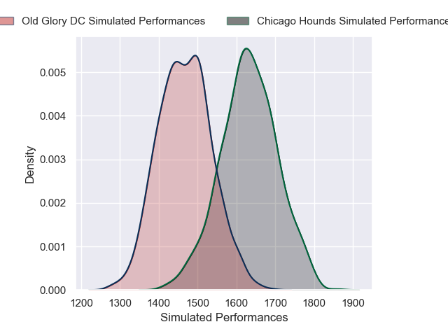
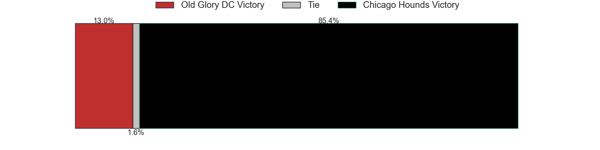
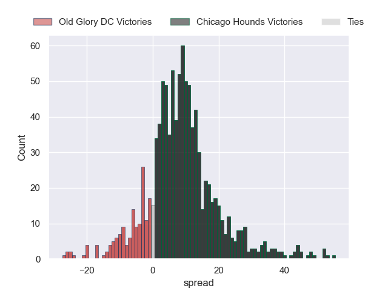

### Utah Warriors V TBC on 2025/06/14

Average Margin: Utah Warriors by 13.1

Average Scoreline: 21-8

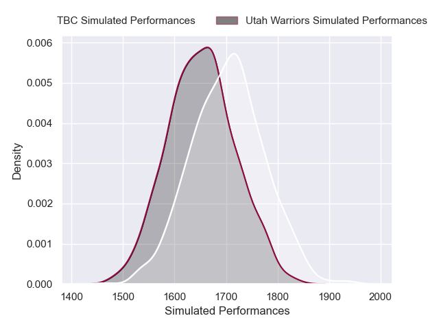
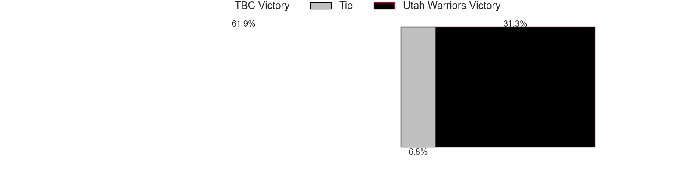
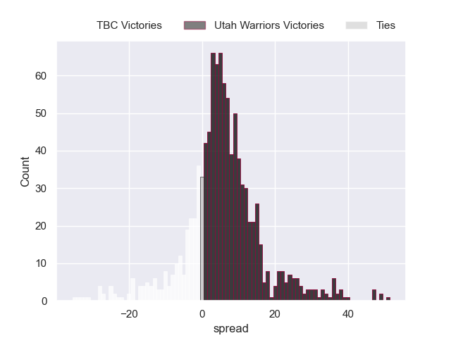

### New England Free Jacks V Miami Sharks on 2025/06/15

Average Margin: New England Free Jacks by 10.7

Average Scoreline: 33-22

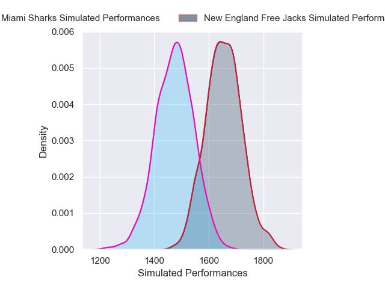

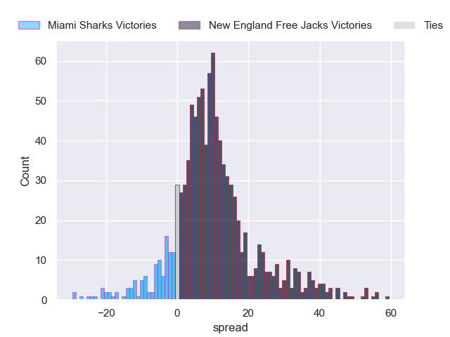

### Houston SaberCats V RFCLA on 2025/06/15

Average Margin: Houston SaberCats by 3.1

Average Scoreline: 23-20

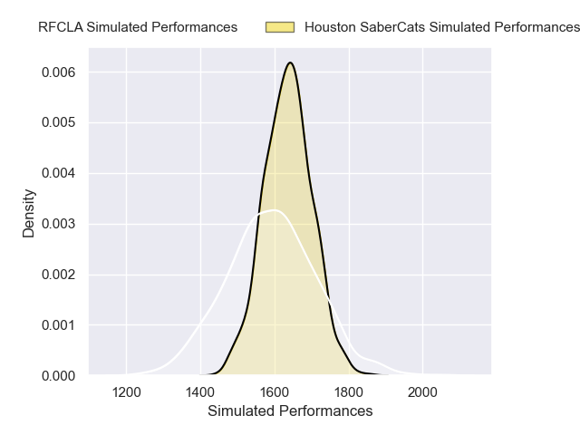
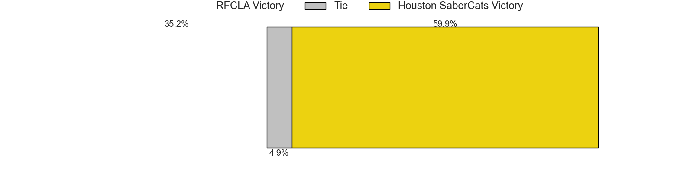
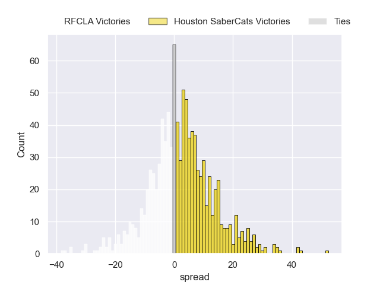

