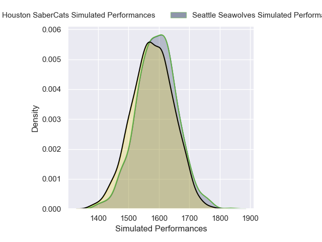
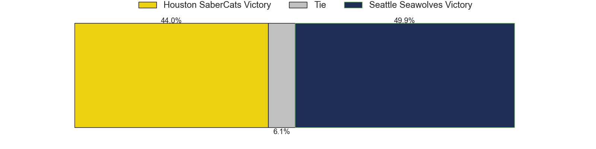
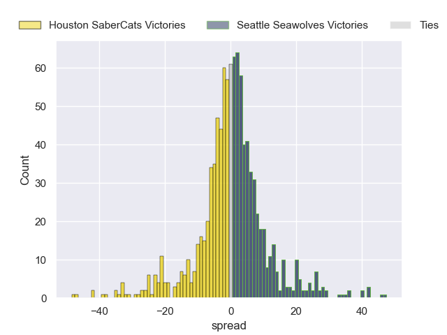
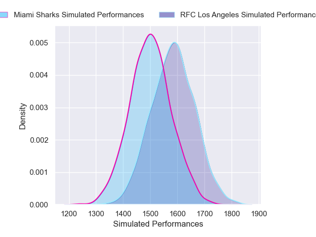
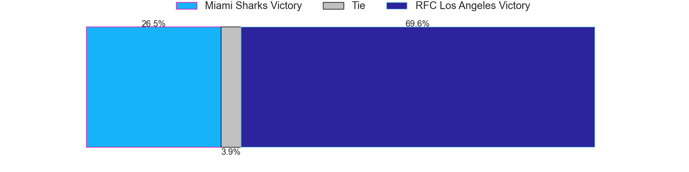
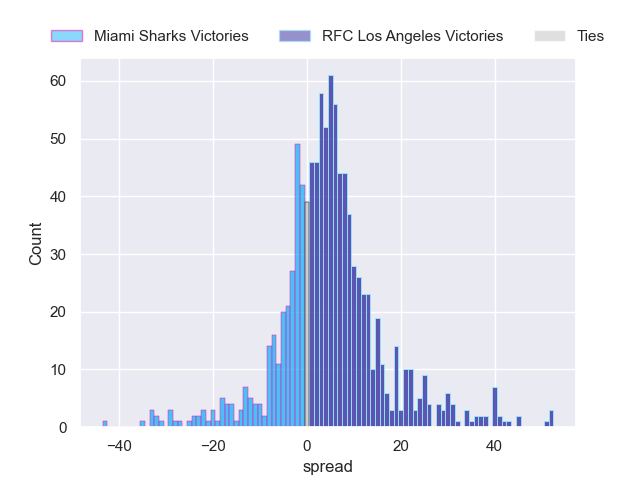

---  
title: "Major League Rugby 2025 Status"  
date: 2025-05-23 6:00:00 -0500  
categories: model review projection  
layout: article  
aside:  
    toc: true  
---
# Current Team Rankings

# Standings

## Current Standings

| Club                   |   Played |   Wins |   Point Differential |   Losing Bonus Points |   Try Bonus Points |   Competition Points |
|:-----------------------|---------:|-------:|---------------------:|----------------------:|-------------------:|---------------------:|
| Houston SaberCats      |       15 |      9 |                   87 |                     3 |                nan |                   48 |
| New England Free Jacks |       14 |     10 |                   78 |                     1 |                nan |                   48 |
| Utah Warriors          |       14 |      9 |                   64 |                     2 |                nan |                   47 |
| San Diego Legion       |       15 |      8 |                   20 |                     3 |                nan |                   45 |
| Miami Sharks           |       14 |      9 |                    4 |                     1 |                nan |                   43 |
| Chicago Hounds         |       14 |      8 |                   29 |                     3 |                nan |                   41 |
| Seattle Seawolves      |       14 |      7 |                   15 |                     3 |                nan |                   39 |
| RFC Los Angeles        |       13 |      6 |                    2 |                     3 |                nan |                   35 |
| Old Glory DC           |       13 |      6 |                   -7 |                     2 |                  9 |                   35 |
| NOLA Gold              |       14 |      4 |                  -15 |                     7 |                nan |                   29 |
| RFCLA                  |        7 |      3 |                   11 |                     2 |                nan |                   16 |
| Anthem RC              |       15 |      0 |                 -288 |                     3 |                nan |                    3 |

## Projected Remaining Table

| Club                   |   Matches Remaining |   Wins |   Point Differential |   Losing Bonus Points |   Try Bonus Points |   Competition Points |
|:-----------------------|--------------------:|-------:|---------------------:|----------------------:|-------------------:|---------------------:|
| Chicago Hounds         |                   3 |    2.4 |             26.7305  |                   0.4 |                1.6 |                 11.5 |
| New England Free Jacks |                   3 |    2.4 |             20.521   |                   0.4 |                1.3 |                 11.1 |
| Utah Warriors          |                   3 |    2.2 |             29.6279  |                   0.5 |                1.6 |                 11   |
| Houston SaberCats      |                   3 |    1.8 |             21.2534  |                   0.8 |                1.7 |                  9.5 |
| Miami Sharks           |                   4 |    1.3 |            -18.7137  |                   1.2 |                0.9 |                  7.5 |
| Seattle Seawolves      |                   3 |    1.4 |             -2.20376 |                   0.8 |                0.7 |                  7.3 |
| RFC Los Angeles        |                   3 |    1.3 |             -4.04796 |                   0.9 |                1.1 |                  7.2 |
| NOLA Gold              |                   3 |    1   |            -10.3201  |                   1.1 |                0.6 |                  5.7 |
| Old Glory DC           |                   3 |    1   |            -12.4893  |                   0.9 |                0.8 |                  5.7 |
| San Diego Legion       |                   2 |    1.1 |              3.14383 |                   0.5 |                0.5 |                  5.6 |
| RFCLA                  |                   1 |    0.8 |             10.6664  |                   0.1 |                0.2 |                  3.7 |
| Anthem RC              |                   3 |    0.2 |            -64.1681  |                   0.2 |                0.4 |                  1.5 |

## Projected Total Table

| Club                   |   Total Matches |   Wins |   Point Differential |   Losing Bonus Points |   Try Bonus Points |   Competition Points |
|:-----------------------|----------------:|-------:|---------------------:|----------------------:|-------------------:|---------------------:|
| New England Free Jacks |              17 |   12.4 |             98.521   |                   1.4 |                1.3 |                 59.1 |
| Utah Warriors          |              17 |   11.2 |             93.6279  |                   2.5 |                1.6 |                 58   |
| Houston SaberCats      |              18 |   10.8 |            108.253   |                   3.8 |                1.7 |                 57.5 |
| Chicago Hounds         |              17 |   10.4 |             55.7305  |                   3.4 |                1.6 |                 52.5 |
| San Diego Legion       |              17 |    9.1 |             23.1438  |                   3.5 |                0.5 |                 50.6 |
| Miami Sharks           |              18 |   10.3 |            -14.7137  |                   2.2 |                0.9 |                 50.5 |
| Seattle Seawolves      |              17 |    8.4 |             12.7962  |                   3.8 |                0.7 |                 46.3 |
| RFC Los Angeles        |              16 |    7.3 |             -2.04796 |                   3.9 |                1.1 |                 42.2 |
| Old Glory DC           |              16 |    7   |            -19.4893  |                   2.9 |                9.8 |                 40.7 |
| NOLA Gold              |              17 |    5   |            -25.3201  |                   8.1 |                0.6 |                 34.7 |
| RFCLA                  |               8 |    3.8 |             21.6664  |                   2.1 |                0.2 |                 19.7 |
| Anthem RC              |              18 |    0.2 |           -352.168   |                   3.2 |                0.4 |                  4.5 |

# Completed Match Review

| Model | Percent Correct Predictions | Spread Error |
| ------ | ------ | ------ |
| Club Level | 64.2% | 12.2 |
| Player Level: Lineup | 58.3% | 13.4 |
| Player Level: Minutes | 58.3% | 13.1 |

# Future Predictions

## Week 16

### New England Free Jacks V Old Glory DC on 2025/05/24

Average Margin: New England Free Jacks by 9.9

Average Scoreline: 38-28

### Anthem RC V Chicago Hounds on 2025/05/24

Average Margin: Chicago Hounds by 16.2

Average Scoreline: 33-17

### Seattle Seawolves V Houston SaberCats on 2025/05/24

Average Margin: Seattle Seawolves by 0.4

Average Scoreline: 33-33

### NOLA Gold V Utah Warriors on 2025/05/24

Average Margin: NOLA Gold by 0.2

Average Scoreline: 34-34

## Week 17

### RFC Los Angeles V Miami Sharks on 2025/05/26

Average Margin: RFC Los Angeles by 5.0

Average Scoreline: 32-27

### Utah Warriors V Anthem RC on 2025/05/31

Average Margin: Utah Warriors by 23.4

Average Scoreline: 41-18

### Chicago Hounds V NOLA Gold on 2025/05/31

Average Margin: Chicago Hounds by 7.7

Average Scoreline: 34-26

### Miami Sharks V San Diego Legion on 2025/05/31

Average Margin: Miami Sharks by 2.2

Average Scoreline: 32-30

### Old Glory DC V RFC Los Angeles on 2025/05/31

Average Margin: Old Glory DC by 2.7

Average Scoreline: 35-33

### New England Free Jacks V Seattle Seawolves on 2025/06/01

Average Margin: New England Free Jacks by 7.8

Average Scoreline: 35-27

## Week 18

### Chicago Hounds V Houston SaberCats on 2025/06/04

Average Margin: Chicago Hounds by 2.9

Average Scoreline: 34-31

### Utah Warriors V RFC Los Angeles on 2025/06/07

Average Margin: Utah Warriors by 6.3

Average Scoreline: 38-32

### San Diego Legion V Old Glory DC on 2025/06/07

Average Margin: San Diego Legion by 5.3

Average Scoreline: 35-30

### NOLA Gold V New England Free Jacks on 2025/06/07

Average Margin: New England Free Jacks by 2.8

Average Scoreline: 37-34

### Houston SaberCats V Anthem RC on 2025/06/08

Average Margin: Houston SaberCats by 24.6

Average Scoreline: 41-17

### Seattle Seawolves V Miami Sharks on 2025/06/08

Average Margin: Seattle Seawolves by 5.2

Average Scoreline: 33-27

