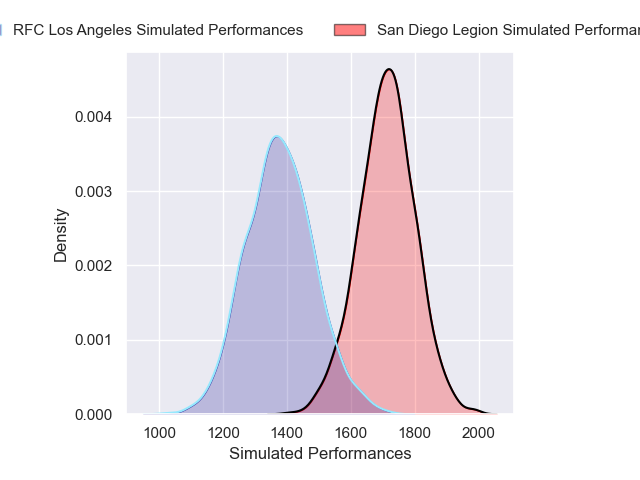
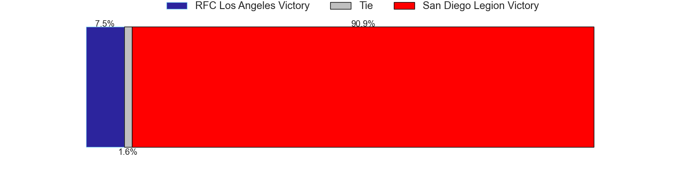
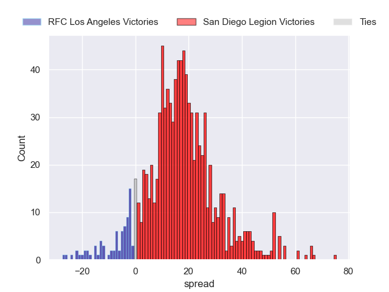
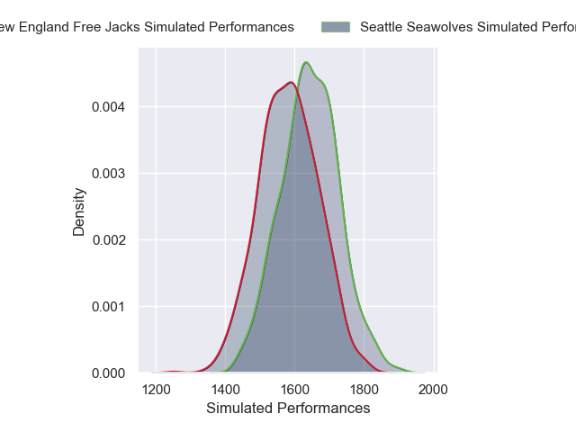
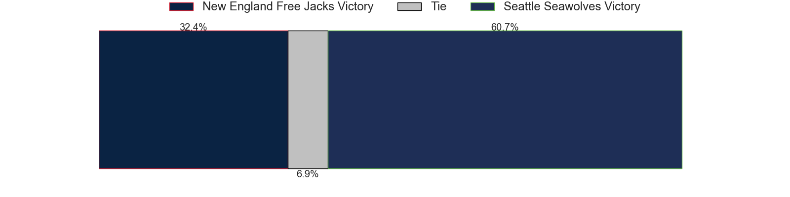
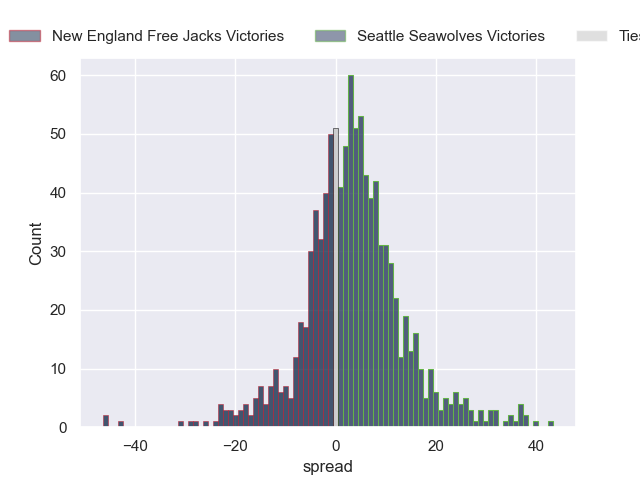

---  
title: "Major League Rugby 2025 Status"  
date: 2025-03-06 6:00:00 -0500  
categories: model review projection  
layout: article  
aside:  
    toc: true  
---
# Current Team Rankings

# Standings

## Current Standings

| Club                   |   Played |   Wins |   Point Differential |   Losing Bonus Points |   Try Bonus Points |   Competition Points |
|:-----------------------|---------:|-------:|---------------------:|----------------------:|-------------------:|---------------------:|
| San Diego Legion       |        3 |      3 |                   77 |                     0 |                  3 |                   15 |
| Chicago Hounds         |        3 |      2 |                   18 |                     0 |                  3 |                   11 |
| Utah Warriors          |        2 |      2 |                   48 |                     0 |                  2 |                   10 |
| Houston SaberCats      |        3 |      2 |                   15 |                     1 |                  1 |                   10 |
| Miami Sharks           |        2 |      2 |                    6 |                     0 |                  1 |                    9 |
| NOLA Gold              |        3 |      1 |                  -18 |                     1 |                nan |                    5 |
| New England Free Jacks |        2 |      1 |                  -22 |                     0 |                  1 |                    5 |
| Seattle Seawolves      |        2 |      0 |                  -15 |                     1 |                  1 |                    2 |
| RFC Los Angeles        |        2 |      0 |                  -24 |                     1 |                nan |                    1 |
| Anthem RC              |        3 |      0 |                  -69 |                     1 |                nan |                    1 |
| Old Glory DC           |        1 |      0 |                  -16 |                     0 |                  0 |                    0 |

## Projected Remaining Table

| Club                   |   Matches Remaining |   Wins |   Point Differential |   Losing Bonus Points |   Try Bonus Points |   Competition Points |
|:-----------------------|--------------------:|-------:|---------------------:|----------------------:|-------------------:|---------------------:|
| San Diego Legion       |                  13 |   10.2 |           122.407    |                   1.8 |                6.5 |                 49   |
| Seattle Seawolves      |                  14 |    9.7 |            99.3617   |                   2.6 |                6.3 |                 47.5 |
| New England Free Jacks |                  14 |    9.6 |            79.6556   |                   2.6 |                5.9 |                 46.8 |
| Chicago Hounds         |                  13 |    8.4 |            75.0213   |                   2.3 |                5.6 |                 41.6 |
| Houston SaberCats      |                  13 |    7.8 |            61.501    |                   2.7 |                6.8 |                 40.6 |
| Utah Warriors          |                  14 |    8.1 |            39.0281   |                   3.1 |                5   |                 40.4 |
| Old Glory DC           |                  14 |    6.7 |             0.121394 |                   3.2 |                5.2 |                 35.1 |
| NOLA Gold              |                  13 |    5.5 |           -27.2486   |                   3.2 |                4.2 |                 29.2 |
| RFC Los Angeles        |                  14 |    3.6 |          -108.021    |                   3   |                3.5 |                 21   |
| Miami Sharks           |                  13 |    3.4 |           -89.1162   |                   3.2 |                2.2 |                 18.8 |
| Anthem RC              |                  13 |    1.2 |          -252.71     |                   1.4 |                2   |                  8.3 |

## Projected Total Table

| Club                   |   Total Matches |   Wins |   Point Differential |   Losing Bonus Points |   Try Bonus Points |   Competition Points |
|:-----------------------|----------------:|-------:|---------------------:|----------------------:|-------------------:|---------------------:|
| San Diego Legion       |              16 |   13.2 |             199.407  |                   1.8 |                9.5 |                 64   |
| Chicago Hounds         |              16 |   10.4 |              93.0213 |                   2.3 |                8.6 |                 52.6 |
| New England Free Jacks |              16 |   10.6 |              57.6556 |                   2.6 |                6.9 |                 51.8 |
| Houston SaberCats      |              16 |    9.8 |              76.501  |                   3.7 |                7.8 |                 50.6 |
| Utah Warriors          |              16 |   10.1 |              87.0281 |                   3.1 |                7   |                 50.4 |
| Seattle Seawolves      |              16 |    9.7 |              84.3617 |                   3.6 |                7.3 |                 49.5 |
| Old Glory DC           |              15 |    6.7 |             -15.8786 |                   3.2 |                5.2 |                 35.1 |
| NOLA Gold              |              16 |    6.5 |             -45.2486 |                   4.2 |                4.2 |                 34.2 |
| Miami Sharks           |              15 |    5.4 |             -83.1162 |                   3.2 |                3.2 |                 27.8 |
| RFC Los Angeles        |              16 |    3.6 |            -132.021  |                   4   |                3.5 |                 22   |
| Anthem RC              |              16 |    1.2 |            -321.71   |                   2.4 |                2   |                  9.3 |

# Completed Match Review

| Model | Percent Correct Predictions | Spread Error |
| ------ | ------ | ------ |
| Club Level | 69.2% | 13.0 |
| Player Level: Lineup | 44.4% | 16.8 |
| Player Level: Minutes | 55.6% | 15.4 |

# Future Predictions

## Week 4

### Old Glory DC V Anthem RC on 2025/03/08

Average Margin: Old Glory DC by 22.4

Average Scoreline: 41-19

### Utah Warriors V Houston SaberCats on 2025/03/08

Average Margin: Utah Warriors by 3.4

Average Scoreline: 35-31

### Miami Sharks V Chicago Hounds on 2025/03/08

Average Margin: Chicago Hounds by 5.5

Average Scoreline: 36-31

### San Diego Legion V RFC Los Angeles on 2025/03/09

Average Margin: San Diego Legion by 18.2

Average Scoreline: 40-21

### Seattle Seawolves V New England Free Jacks on 2025/03/09

Average Margin: Seattle Seawolves by 3.6

Average Scoreline: 23-19

## Week 5

### RFC Los Angeles V Seattle Seawolves on 2025/03/15

Average Margin: Seattle Seawolves by 8.6

Average Scoreline: 33-24

### New England Free Jacks V NOLA Gold on 2025/03/15

Average Margin: New England Free Jacks by 10.7

Average Scoreline: 36-25

### Chicago Hounds V Old Glory DC on 2025/03/15

Average Margin: Chicago Hounds by 10.1

Average Scoreline: 34-24

### Miami Sharks V Utah Warriors on 2025/03/15

Average Margin: Utah Warriors by 5.3

Average Scoreline: 27-21

## Week 6

### Anthem RC V Houston SaberCats on 2025/03/22

Average Margin: Houston SaberCats by 20.3

Average Scoreline: 46-25

### Old Glory DC V New England Free Jacks on 2025/03/22

Average Margin: New England Free Jacks by 2.9

Average Scoreline: 32-30

### San Diego Legion V Miami Sharks on 2025/03/22

Average Margin: San Diego Legion by 17.6

Average Scoreline: 35-18

### NOLA Gold V RFC Los Angeles on 2025/03/22

Average Margin: NOLA Gold by 8.0

Average Scoreline: 34-26

### Seattle Seawolves V Utah Warriors on 2025/03/22

Average Margin: Seattle Seawolves by 5.5

Average Scoreline: 26-20

## Week 7

### RFC Los Angeles V Old Glory DC on 2025/03/29

Average Margin: Old Glory DC by 1.1

Average Scoreline: 33-32

### Utah Warriors V New England Free Jacks on 2025/03/29

Average Margin: Utah Warriors by 3.3

Average Scoreline: 28-25

### Houston SaberCats V San Diego Legion on 2025/03/29

Average Margin: San Diego Legion by 1.8

Average Scoreline: 24-22

### NOLA Gold V Chicago Hounds on 2025/03/29

Average Margin: Chicago Hounds by 2.8

Average Scoreline: 32-30

### Seattle Seawolves V Anthem RC on 2025/03/29

Average Margin: Seattle Seawolves by 29.3

Average Scoreline: 43-14

## Week 8

### Old Glory DC V Seattle Seawolves on 2025/04/05

Average Margin: Seattle Seawolves by 3.5

Average Scoreline: 30-26

### Anthem RC V NOLA Gold on 2025/04/05

Average Margin: NOLA Gold by 13.4

Average Scoreline: 39-26

### San Diego Legion V Chicago Hounds on 2025/04/05

Average Margin: San Diego Legion by 10.3

Average Scoreline: 33-23

### Houston SaberCats V RFC Los Angeles on 2025/04/05

Average Margin: Houston SaberCats by 14.3

Average Scoreline: 36-22

### New England Free Jacks V Miami Sharks on 2025/04/06

Average Margin: New England Free Jacks by 13.1

Average Scoreline: 32-19

## Week 9

### RFC Los Angeles V Utah Warriors on 2025/04/12

Average Margin: Utah Warriors by 5.8

Average Scoreline: 33-27

### New England Free Jacks V San Diego Legion on 2025/04/12

Average Margin: San Diego Legion by 1.3

Average Scoreline: 31-30

### NOLA Gold V Old Glory DC on 2025/04/12

Average Margin: NOLA Gold by 3.5

Average Scoreline: 27-23

### Miami Sharks V Houston SaberCats on 2025/04/12

Average Margin: Houston SaberCats by 5.9

Average Scoreline: 33-27

### Chicago Hounds V Anthem RC on 2025/04/13

Average Margin: Chicago Hounds by 25.2

Average Scoreline: 40-15

## Week 10

### Seattle Seawolves V Chicago Hounds on 2025/04/18

Average Margin: Seattle Seawolves by 4.5

Average Scoreline: 22-17

### Anthem RC V New England Free Jacks on 2025/04/18

Average Margin: New England Free Jacks by 19.0

Average Scoreline: 40-21

### San Diego Legion V Utah Warriors on 2025/04/19

Average Margin: San Diego Legion by 10.4

Average Scoreline: 29-19

### Houston SaberCats V NOLA Gold on 2025/04/19

Average Margin: Houston SaberCats by 9.9

Average Scoreline: 35-25

### Old Glory DC V Miami Sharks on 2025/04/19

Average Margin: Old Glory DC by 7.0

Average Scoreline: 30-23

## Week 11

### New England Free Jacks V RFC Los Angeles on 2025/04/22

Average Margin: New England Free Jacks by 13.1

Average Scoreline: 33-20

### Anthem RC V Seattle Seawolves on 2025/04/23

Average Margin: Seattle Seawolves by 19.4

Average Scoreline: 42-22

### Houston SaberCats V Old Glory DC on 2025/04/26

Average Margin: Houston SaberCats by 9.5

Average Scoreline: 34-25

### Utah Warriors V Chicago Hounds on 2025/04/26

Average Margin: Utah Warriors by 3.8

Average Scoreline: 27-23

### RFC Los Angeles V San Diego Legion on 2025/04/26

Average Margin: San Diego Legion by 11.4

Average Scoreline: 38-26

### NOLA Gold V Seattle Seawolves on 2025/04/27

Average Margin: Seattle Seawolves by 2.7

Average Scoreline: 26-23

### Miami Sharks V Anthem RC on 2025/04/27

Average Margin: Miami Sharks by 16.6

Average Scoreline: 31-14

## Week 12

### Utah Warriors V San Diego Legion on 2025/04/30

Average Margin: San Diego Legion by 3.1

Average Scoreline: 28-25

### Seattle Seawolves V RFC Los Angeles on 2025/05/02

Average Margin: Seattle Seawolves by 13.2

Average Scoreline: 33-20

### New England Free Jacks V Houston SaberCats on 2025/05/04

Average Margin: New England Free Jacks by 4.4

Average Scoreline: 27-22

### Old Glory DC V Utah Warriors on 2025/05/04

Average Margin: Utah Warriors by 0.9

Average Scoreline: 28-27

### Chicago Hounds V Miami Sharks on 2025/05/04

Average Margin: Chicago Hounds by 12.3

Average Scoreline: 30-18

### San Diego Legion V NOLA Gold on 2025/05/04

Average Margin: San Diego Legion by 14.2

Average Scoreline: 34-20

## Week 13

### NOLA Gold V Miami Sharks on 2025/05/09

Average Margin: NOLA Gold by 6.8

Average Scoreline: 30-24

### San Diego Legion V Houston SaberCats on 2025/05/10

Average Margin: San Diego Legion by 8.9

Average Scoreline: 32-23

### RFC Los Angeles V Anthem RC on 2025/05/10

Average Margin: RFC Los Angeles by 14.4

Average Scoreline: 37-22

### New England Free Jacks V Chicago Hounds on 2025/05/10

Average Margin: New England Free Jacks by 4.1

Average Scoreline: 27-23

## Week 14

### Utah Warriors V Seattle Seawolves on 2025/05/12

Average Margin: Utah Warriors by 3.7

Average Scoreline: 26-23

### Old Glory DC V NOLA Gold on 2025/05/13

Average Margin: Old Glory DC by 4.3

Average Scoreline: 30-25

### Houston SaberCats V Utah Warriors on 2025/05/17

Average Margin: Houston SaberCats by 5.0

Average Scoreline: 28-23

### Seattle Seawolves V San Diego Legion on 2025/05/17

Average Margin: San Diego Legion by 1.0

Average Scoreline: 30-29

### Miami Sharks V New England Free Jacks on 2025/05/17

Average Margin: New England Free Jacks by 5.4

Average Scoreline: 30-24

### Chicago Hounds V RFC Los Angeles on 2025/05/18

Average Margin: Chicago Hounds by 12.8

Average Scoreline: 33-20

### Anthem RC V Old Glory DC on 2025/05/18

Average Margin: Old Glory DC by 11.6

Average Scoreline: 30-18

## Week 15

### RFC Los Angeles V Miami Sharks on 2025/05/23

Average Margin: RFC Los Angeles by 3.4

Average Scoreline: 26-23

### Seattle Seawolves V Houston SaberCats on 2025/05/23

Average Margin: Seattle Seawolves by 4.5

Average Scoreline: 28-24

### New England Free Jacks V Old Glory DC on 2025/05/24

Average Margin: New England Free Jacks by 9.6

Average Scoreline: 28-18

### NOLA Gold V Utah Warriors on 2025/05/24

Average Margin: Utah Warriors by 2.2

Average Scoreline: 29-26

### Anthem RC V Chicago Hounds on 2025/05/24

Average Margin: Chicago Hounds by 15.9

Average Scoreline: 33-17

## Week 16

### Miami Sharks V San Diego Legion on 2025/05/31

Average Margin: San Diego Legion by 10.7

Average Scoreline: 34-23

### Chicago Hounds V NOLA Gold on 2025/05/31

Average Margin: Chicago Hounds by 9.8

Average Scoreline: 31-21

### Old Glory DC V RFC Los Angeles on 2025/05/31

Average Margin: Old Glory DC by 7.2

Average Scoreline: 32-25

### Utah Warriors V Anthem RC on 2025/05/31

Average Margin: Utah Warriors by 22.4

Average Scoreline: 39-17

### New England Free Jacks V Seattle Seawolves on 2025/06/01

Average Margin: New England Free Jacks by 3.4

Average Scoreline: 25-21

## Week 17

### Chicago Hounds V Houston SaberCats on 2025/06/04

Average Margin: Chicago Hounds by 3.2

Average Scoreline: 26-23

### San Diego Legion V Old Glory DC on 2025/06/07

Average Margin: San Diego Legion by 13.5

Average Scoreline: 34-20

### NOLA Gold V New England Free Jacks on 2025/06/07

Average Margin: New England Free Jacks by 2.4

Average Scoreline: 29-27

### Utah Warriors V RFC Los Angeles on 2025/06/07

Average Margin: Utah Warriors by 12.2

Average Scoreline: 29-17

### Houston SaberCats V Anthem RC on 2025/06/08

Average Margin: Houston SaberCats by 22.8

Average Scoreline: 42-19

### Seattle Seawolves V Miami Sharks on 2025/06/08

Average Margin: Seattle Seawolves by 12.7

Average Scoreline: 33-20

