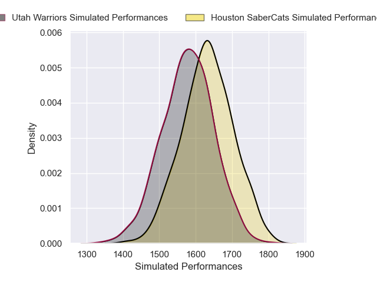
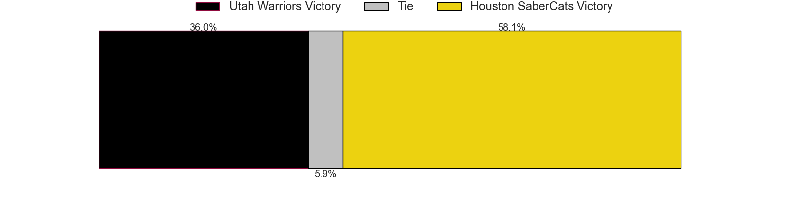
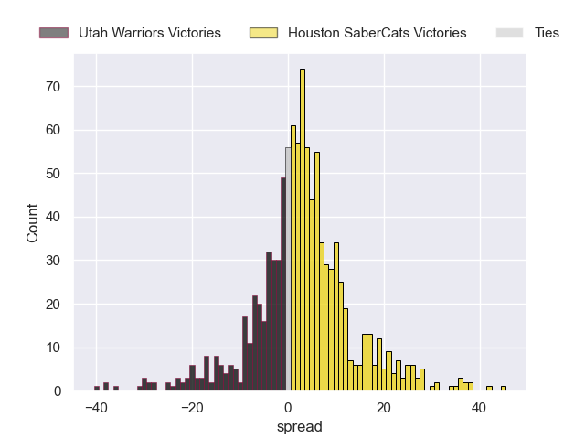
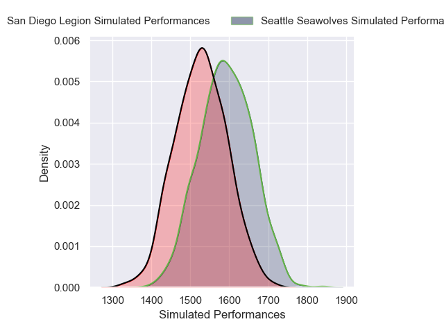
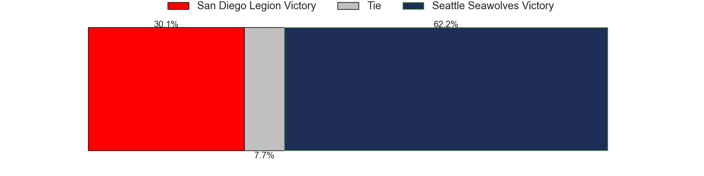
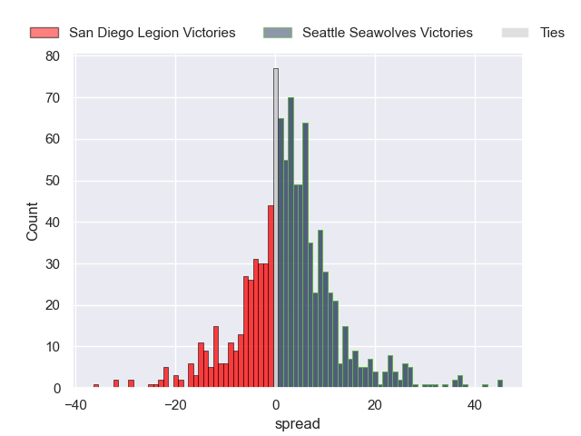

---  
title: "Major League Rugby 2025 Status"  
date: 2025-05-15 6:00:00 -0500  
categories: model review projection  
layout: article  
aside:  
    toc: true  
---
# Current Team Rankings

# Standings

## Current Standings

| Club                   |   Played |   Wins |   Point Differential |   Losing Bonus Points |   Try Bonus Points |   Competition Points |
|:-----------------------|---------:|-------:|---------------------:|----------------------:|-------------------:|---------------------:|
| New England Free Jacks |       13 |     10 |                   89 |                     1 |                nan |                   47 |
| Utah Warriors          |       13 |      9 |                   85 |                     2 |                nan |                   46 |
| Houston SaberCats      |       14 |      8 |                   66 |                     3 |                nan |                   42 |
| San Diego Legion       |       14 |      8 |                   24 |                     2 |                nan |                   41 |
| Chicago Hounds         |       12 |      8 |                   33 |                     1 |                nan |                   39 |
| Miami Sharks           |       12 |      7 |                  -25 |                     1 |                nan |                   33 |
| Seattle Seawolves      |       13 |      6 |                   11 |                     3 |                nan |                   32 |
| RFC Los Angeles        |       12 |      5 |                    0 |                     3 |                nan |                   28 |
| NOLA Gold              |       14 |      4 |                  -15 |                     7 |                nan |                   28 |
| Old Glory DC           |       11 |      5 |                  -11 |                     2 |                nan |                   27 |
| RFCLA                  |        6 |      2 |                    9 |                     2 |                nan |                   12 |
| Anthem RC              |       14 |      0 |                 -266 |                     3 |                nan |                    3 |

## Projected Remaining Table

| Club                   |   Matches Remaining |   Wins |   Point Differential |   Losing Bonus Points |   Try Bonus Points |   Competition Points |
|:-----------------------|--------------------:|-------:|---------------------:|----------------------:|-------------------:|---------------------:|
| Chicago Hounds         |                   4 |    3.3 |            40.2198   |                   0.4 |                2.1 |                 15.9 |
| New England Free Jacks |                   4 |    3.2 |            29.8042   |                   0.5 |                1.8 |                 15   |
| Utah Warriors          |                   4 |    2.8 |            34.1522   |                   0.7 |                2.1 |                 14   |
| Houston SaberCats      |                   4 |    2.2 |            17.4911   |                   1   |                2   |                 11.8 |
| Seattle Seawolves      |                   4 |    2.3 |             5.7632   |                   0.9 |                1.1 |                 11.2 |
| Old Glory DC           |                   4 |    1.9 |            -0.979865 |                   0.9 |                1.7 |                 10.1 |
| RFC Los Angeles        |                   4 |    1.5 |           -13.1234   |                   1.1 |                1.5 |                  8.4 |
| San Diego Legion       |                   3 |    1.6 |             1.66604  |                   0.8 |                1   |                  8.1 |
| Miami Sharks           |                   4 |    1.1 |           -20.6081   |                   1.4 |                0.6 |                  6.4 |
| NOLA Gold              |                   3 |    0.8 |           -14.9396   |                   1.1 |                0.6 |                  5   |
| Anthem RC              |                   4 |    0.3 |           -79.4455   |                   0.4 |                0.7 |                  2.3 |

## Projected Total Table

| Club                   |   Total Matches |   Wins |   Point Differential |   Losing Bonus Points |   Try Bonus Points |   Competition Points |
|:-----------------------|----------------:|-------:|---------------------:|----------------------:|-------------------:|---------------------:|
| New England Free Jacks |              17 |   13.2 |             118.804  |                   1.5 |                1.8 |                 62   |
| Utah Warriors          |              17 |   11.8 |             119.152  |                   2.7 |                2.1 |                 60   |
| Chicago Hounds         |              16 |   11.3 |              73.2198 |                   1.4 |                2.1 |                 54.9 |
| Houston SaberCats      |              18 |   10.2 |              83.4911 |                   4   |                2   |                 53.8 |
| San Diego Legion       |              17 |    9.6 |              25.666  |                   2.8 |                1   |                 49.1 |
| Seattle Seawolves      |              17 |    8.3 |              16.7632 |                   3.9 |                1.1 |                 43.2 |
| Miami Sharks           |              16 |    8.1 |             -45.6081 |                   2.4 |                0.6 |                 39.4 |
| Old Glory DC           |              15 |    6.9 |             -11.9799 |                   2.9 |                1.7 |                 37.1 |
| RFC Los Angeles        |              16 |    6.5 |             -13.1234 |                   4.1 |                1.5 |                 36.4 |
| NOLA Gold              |              17 |    4.8 |             -29.9396 |                   8.1 |                0.6 |                 33   |
| RFCLA                  |               6 |    2   |               9      |                   2   |                0   |                 12   |
| Anthem RC              |              18 |    0.3 |            -345.446  |                   3.4 |                0.7 |                  5.3 |

# Completed Match Review

| Model | Percent Correct Predictions | Spread Error |
| ------ | ------ | ------ |
| Club Level | 66.2% | 12.1 |
| Player Level: Lineup | 66.7% | 11.2 |
| Player Level: Minutes | 73.3% | 11.2 |

# Future Predictions

## Week 15

### Miami Sharks V New England Free Jacks on 2025/05/17

Average Margin: New England Free Jacks by 6.8

Average Scoreline: 38-31

### Anthem RC V Old Glory DC on 2025/05/18

Average Margin: Old Glory DC by 13.6

Average Scoreline: 44-30

### Chicago Hounds V RFC Los Angeles on 2025/05/18

Average Margin: Chicago Hounds by 8.5

Average Scoreline: 35-27

### Houston SaberCats V Utah Warriors on 2025/05/18

Average Margin: Houston SaberCats by 2.0

Average Scoreline: 34-32

### Seattle Seawolves V San Diego Legion on 2025/05/18

Average Margin: Seattle Seawolves by 4.1

Average Scoreline: 30-26

## Week 16

### Seattle Seawolves V Houston SaberCats on 2025/05/23

Average Margin: Seattle Seawolves by 2.4

Average Scoreline: 32-30

### RFC Los Angeles V Miami Sharks on 2025/05/23

Average Margin: RFC Los Angeles by 6.3

Average Scoreline: 23-17

### NOLA Gold V Utah Warriors on 2025/05/24

Average Margin: Utah Warriors by 2.5

Average Scoreline: 32-29

### New England Free Jacks V Old Glory DC on 2025/05/24

Average Margin: New England Free Jacks by 11.3

Average Scoreline: 32-21

### Anthem RC V Chicago Hounds on 2025/05/24

Average Margin: Chicago Hounds by 17.4

Average Scoreline: 49-31

## Week 17

### Old Glory DC V RFC Los Angeles on 2025/05/31

Average Margin: Old Glory DC by 2.7

Average Scoreline: 29-26

### Utah Warriors V Anthem RC on 2025/05/31

Average Margin: Utah Warriors by 25.5

Average Scoreline: 43-18

### Miami Sharks V San Diego Legion on 2025/05/31

Average Margin: Miami Sharks by 0.2

Average Scoreline: 33-33

### Chicago Hounds V NOLA Gold on 2025/05/31

Average Margin: Chicago Hounds by 9.2

Average Scoreline: 33-24

### New England Free Jacks V Seattle Seawolves on 2025/06/01

Average Margin: New England Free Jacks by 8.4

Average Scoreline: 32-23

## Week 18

### Chicago Hounds V Houston SaberCats on 2025/06/04

Average Margin: Chicago Hounds by 5.1

Average Scoreline: 31-26

### Utah Warriors V RFC Los Angeles on 2025/06/07

Average Margin: Utah Warriors by 8.2

Average Scoreline: 35-27

### San Diego Legion V Old Glory DC on 2025/06/07

Average Margin: San Diego Legion by 5.9

Average Scoreline: 30-24

### NOLA Gold V New England Free Jacks on 2025/06/07

Average Margin: New England Free Jacks by 3.2

Average Scoreline: 39-36

### Seattle Seawolves V Miami Sharks on 2025/06/08

Average Margin: Seattle Seawolves by 7.7

Average Scoreline: 30-22

### Houston SaberCats V Anthem RC on 2025/06/08

Average Margin: Houston SaberCats by 23.0

Average Scoreline: 43-20

