---  
title: "Major League Rugby 2025 Status"  
date: 2025-04-17 6:00:00 -0500  
categories: model review projection  
layout: article  
aside:  
    toc: true  
---
# Current Team Rankings

# Standings

## Current Standings

| Club                   |   Played |   Wins |   Point Differential |   Losing Bonus Points |   Try Bonus Points |   Competition Points |
|:-----------------------|---------:|-------:|---------------------:|----------------------:|-------------------:|---------------------:|
| Chicago Hounds         |        8 |      7 |                   52 |                     0 |                nan |                   32 |
| Utah Warriors          |        8 |      6 |                   75 |                     1 |                nan |                   29 |
| San Diego Legion       |        8 |      5 |                   50 |                     1 |                nan |                   26 |
| Houston SaberCats      |        9 |      5 |                   45 |                     3 |                nan |                   26 |
| New England Free Jacks |        8 |      5 |                   36 |                     1 |                nan |                   24 |
| RFC Los Angeles        |        8 |      4 |                  -24 |                     1 |                nan |                   18 |
| NOLA Gold              |        8 |      3 |                    5 |                     4 |                nan |                   17 |
| Old Glory DC           |        7 |      3 |                  -17 |                     1 |                nan |                   15 |
| Seattle Seawolves      |        7 |      2 |                  -32 |                     3 |                nan |                   14 |
| Miami Sharks           |        7 |      3 |                  -71 |                     0 |                nan |                   13 |
| RFCLA                  |        2 |      1 |                  -15 |                     0 |                nan |                    4 |
| Anthem RC              |        8 |      0 |                 -104 |                     3 |                nan |                    3 |

## Projected Remaining Table

| Club                   |   Matches Remaining |   Wins |   Point Differential |   Losing Bonus Points |   Try Bonus Points |   Competition Points |
|:-----------------------|--------------------:|-------:|---------------------:|----------------------:|-------------------:|---------------------:|
| New England Free Jacks |                   8 |    6.4 |             66.0246  |                   1   |                3.9 |                 30.5 |
| Utah Warriors          |                   9 |    5.9 |             42.7389  |                   1.9 |                3.6 |                 28.9 |
| Chicago Hounds         |                   8 |    5.6 |             53.9384  |                   1.4 |                3.7 |                 27.6 |
| San Diego Legion       |                   8 |    5.3 |             33.2551  |                   1.6 |                3.2 |                 26.1 |
| Seattle Seawolves      |                   9 |    4.7 |              7.24795 |                   2.3 |                2.9 |                 23.8 |
| Houston SaberCats      |                   8 |    4.3 |             15.063   |                   1.8 |                3.5 |                 22.6 |
| Old Glory DC           |                   8 |    3.7 |             -8.30019 |                   1.9 |                2.5 |                 19.3 |
| RFC Los Angeles        |                   8 |    3.2 |            -18.595   |                   1.9 |                4.1 |                 18.7 |
| NOLA Gold              |                   8 |    3   |            -24.992   |                   2.2 |                1.9 |                 16.3 |
| Miami Sharks           |                   8 |    1.9 |            -58.925   |                   2   |                1.8 |                 11.3 |
| Anthem RC              |                   8 |    1   |           -107.456   |                   1.5 |                1.3 |                  6.8 |

## Projected Total Table

| Club                   |   Total Matches |   Wins |   Point Differential |   Losing Bonus Points |   Try Bonus Points |   Competition Points |
|:-----------------------|----------------:|-------:|---------------------:|----------------------:|-------------------:|---------------------:|
| Chicago Hounds         |              16 |   12.6 |             105.938  |                   1.4 |                3.7 |                 59.6 |
| Utah Warriors          |              17 |   11.9 |             117.739  |                   2.9 |                3.6 |                 57.9 |
| New England Free Jacks |              16 |   11.4 |             102.025  |                   2   |                3.9 |                 54.5 |
| San Diego Legion       |              16 |   10.3 |              83.2551 |                   2.6 |                3.2 |                 52.1 |
| Houston SaberCats      |              17 |    9.3 |              60.063  |                   4.8 |                3.5 |                 48.6 |
| Seattle Seawolves      |              16 |    6.7 |             -24.752  |                   5.3 |                2.9 |                 37.8 |
| RFC Los Angeles        |              16 |    7.2 |             -42.595  |                   2.9 |                4.1 |                 36.7 |
| Old Glory DC           |              15 |    6.7 |             -25.3002 |                   2.9 |                2.5 |                 34.3 |
| NOLA Gold              |              16 |    6   |             -19.992  |                   6.2 |                1.9 |                 33.3 |
| Miami Sharks           |              15 |    4.9 |            -129.925  |                   2   |                1.8 |                 24.3 |
| Anthem RC              |              16 |    1   |            -211.456  |                   4.5 |                1.3 |                  9.8 |
| RFCLA                  |               2 |    1   |             -15      |                   0   |                0   |                  4   |

# Completed Match Review

| Model | Percent Correct Predictions | Spread Error |
| ------ | ------ | ------ |
| Club Level | 63.6% | 13.5 |
| Player Level: Lineup | 60.0% | 12.4 |
| Player Level: Minutes | 60.0% | 11.6 |

# Future Predictions

## Week 10

### Old Glory DC V Miami Sharks on 2025/04/19

Average Margin: Old Glory DC by 8.3

Average Scoreline: 33-24

### Anthem RC V New England Free Jacks on 2025/04/19

Average Margin: New England Free Jacks by 14.2

Average Scoreline: 42-28

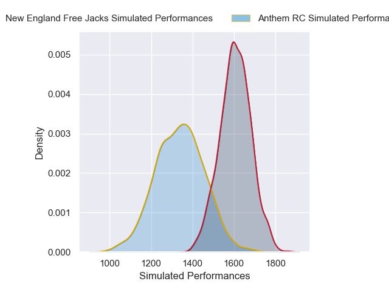
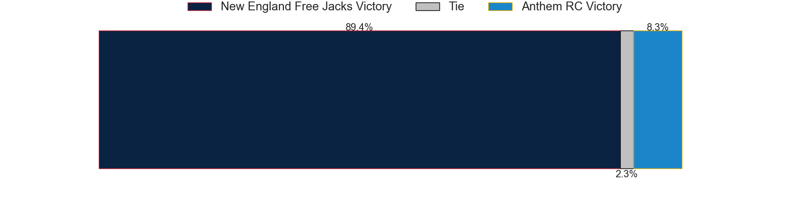
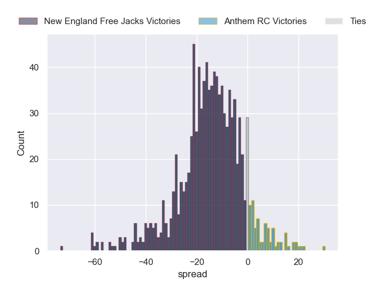

### Seattle Seawolves V Chicago Hounds on 2025/04/19

Average Margin: Chicago Hounds by 2.4

Average Scoreline: 30-28

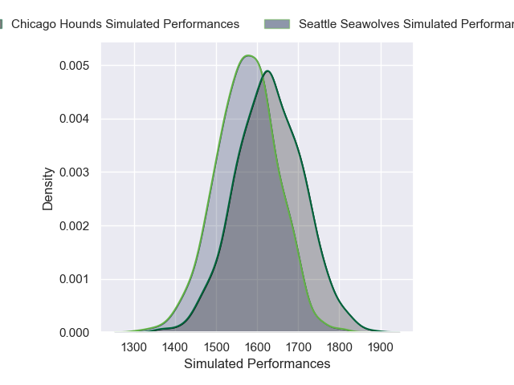

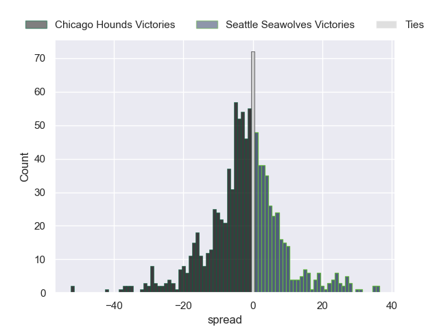

### Houston SaberCats V NOLA Gold on 2025/04/20

Average Margin: Houston SaberCats by 7.9

Average Scoreline: 36-28

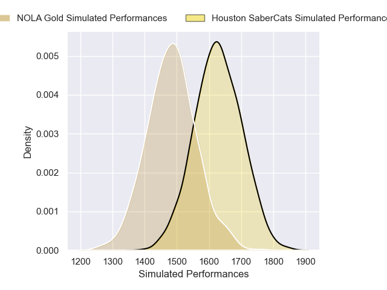
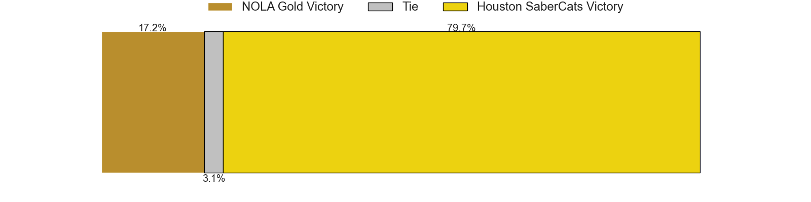
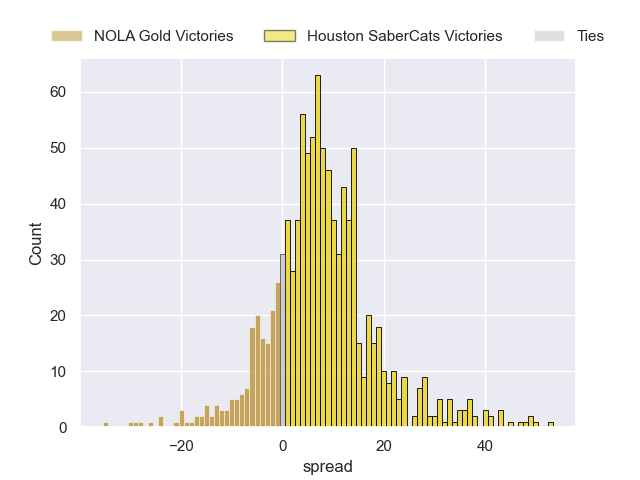

### San Diego Legion V Utah Warriors on 2025/04/20

Average Margin: San Diego Legion by 3.3

Average Scoreline: 31-27

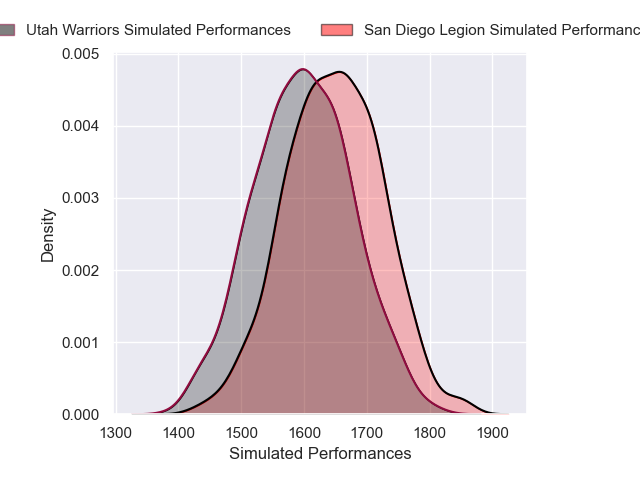
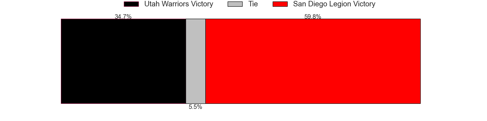
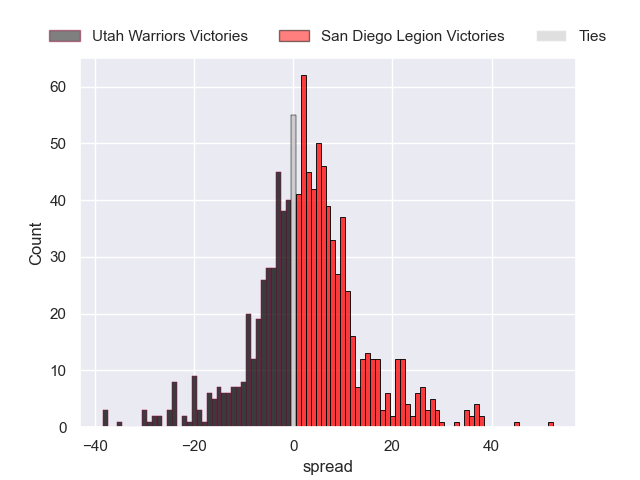

## Week 11

### New England Free Jacks V RFC Los Angeles on 2025/04/22

Average Margin: New England Free Jacks by 10.7

Average Scoreline: 34-23

### Anthem RC V Seattle Seawolves on 2025/04/23

Average Margin: Seattle Seawolves by 10.3

Average Scoreline: 43-32

### Houston SaberCats V Old Glory DC on 2025/04/26

Average Margin: Houston SaberCats by 8.8

Average Scoreline: 34-25

### RFC Los Angeles V San Diego Legion on 2025/04/26

Average Margin: San Diego Legion by 2.1

Average Scoreline: 32-30

### Utah Warriors V Chicago Hounds on 2025/04/26

Average Margin: Utah Warriors by 3.4

Average Scoreline: 25-22

### NOLA Gold V Seattle Seawolves on 2025/04/27

Average Margin: NOLA Gold by 2.0

Average Scoreline: 29-27

### Miami Sharks V Anthem RC on 2025/04/27

Average Margin: Miami Sharks by 10.7

Average Scoreline: 37-26

## Week 12

### Utah Warriors V San Diego Legion on 2025/04/30

Average Margin: Utah Warriors by 3.6

Average Scoreline: 28-24

### Seattle Seawolves V RFC Los Angeles on 2025/05/02

Average Margin: Seattle Seawolves by 5.9

Average Scoreline: 34-28

### Chicago Hounds V Miami Sharks on 2025/05/04

Average Margin: Chicago Hounds by 15.4

Average Scoreline: 38-23

### Old Glory DC V Utah Warriors on 2025/05/04

Average Margin: Utah Warriors by 2.7

Average Scoreline: 28-26

### New England Free Jacks V Houston SaberCats on 2025/05/04

Average Margin: New England Free Jacks by 6.5

Average Scoreline: 30-23

### San Diego Legion V NOLA Gold on 2025/05/04

Average Margin: San Diego Legion by 9.3

Average Scoreline: 36-26

## Week 13

### NOLA Gold V Miami Sharks on 2025/05/09

Average Margin: NOLA Gold by 9.3

Average Scoreline: 34-25

### New England Free Jacks V Chicago Hounds on 2025/05/10

Average Margin: New England Free Jacks by 3.3

Average Scoreline: 30-26

### San Diego Legion V Houston SaberCats on 2025/05/10

Average Margin: San Diego Legion by 5.4

Average Scoreline: 31-26

### RFC Los Angeles V Anthem RC on 2025/05/10

Average Margin: RFC Los Angeles by 14.3

Average Scoreline: 35-21

## Week 14

### Utah Warriors V Seattle Seawolves on 2025/05/12

Average Margin: Utah Warriors by 7.6

Average Scoreline: 31-23

### Old Glory DC V NOLA Gold on 2025/05/13

Average Margin: Old Glory DC by 3.6

Average Scoreline: 31-27

### Houston SaberCats V Utah Warriors on 2025/05/17

Average Margin: Houston SaberCats by 2.3

Average Scoreline: 32-30

### Seattle Seawolves V San Diego Legion on 2025/05/17

Average Margin: San Diego Legion by 0.0

Average Scoreline: 30-30

### Miami Sharks V New England Free Jacks on 2025/05/17

Average Margin: New England Free Jacks by 8.7

Average Scoreline: 36-27

### Anthem RC V Old Glory DC on 2025/05/18

Average Margin: Old Glory DC by 7.4

Average Scoreline: 35-27

### Chicago Hounds V RFC Los Angeles on 2025/05/18

Average Margin: Chicago Hounds by 10.6

Average Scoreline: 41-30

## Week 15

### Seattle Seawolves V Houston SaberCats on 2025/05/23

Average Margin: Seattle Seawolves by 1.9

Average Scoreline: 32-30

### RFC Los Angeles V Miami Sharks on 2025/05/23

Average Margin: RFC Los Angeles by 9.8

Average Scoreline: 27-17

### New England Free Jacks V Old Glory DC on 2025/05/24

Average Margin: New England Free Jacks by 10.6

Average Scoreline: 30-19

### Anthem RC V Chicago Hounds on 2025/05/24

Average Margin: Chicago Hounds by 14.3

Average Scoreline: 32-18

### NOLA Gold V Utah Warriors on 2025/05/24

Average Margin: Utah Warriors by 2.1

Average Scoreline: 33-31

## Week 16

### Old Glory DC V RFC Los Angeles on 2025/05/31

Average Margin: Old Glory DC by 3.6

Average Scoreline: 31-28

### Miami Sharks V San Diego Legion on 2025/05/31

Average Margin: San Diego Legion by 7.7

Average Scoreline: 36-28

### Chicago Hounds V NOLA Gold on 2025/05/31

Average Margin: Chicago Hounds by 10.8

Average Scoreline: 35-24

### Utah Warriors V Anthem RC on 2025/05/31

Average Margin: Utah Warriors by 19.1

Average Scoreline: 41-22

### New England Free Jacks V Seattle Seawolves on 2025/06/01

Average Margin: New England Free Jacks by 9.4

Average Scoreline: 32-23

## Week 17

### Chicago Hounds V Houston SaberCats on 2025/06/04

Average Margin: Chicago Hounds by 7.2

Average Scoreline: 31-23

### Utah Warriors V RFC Los Angeles on 2025/06/07

Average Margin: Utah Warriors by 9.7

Average Scoreline: 37-27

### NOLA Gold V New England Free Jacks on 2025/06/07

Average Margin: New England Free Jacks by 2.6

Average Scoreline: 33-30

### San Diego Legion V Old Glory DC on 2025/06/07

Average Margin: San Diego Legion by 9.1

Average Scoreline: 33-24

### Seattle Seawolves V Miami Sharks on 2025/06/08

Average Margin: Seattle Seawolves by 10.5

Average Scoreline: 36-25

### Houston SaberCats V Anthem RC on 2025/06/08

Average Margin: Houston SaberCats by 17.1

Average Scoreline: 42-25

