---  
title: "Major League Rugby 2025 Status"  
date: 2025-06-05 6:00:00 -0500  
categories: model review projection  
layout: article  
aside:  
    toc: true  
---
# Current Team Rankings

# Standings

## Current Standings

| Club                   |   Played |   Wins |   Point Differential |   Losing Bonus Points |   Try Bonus Points |   Competition Points |
|:-----------------------|---------:|-------:|---------------------:|----------------------:|-------------------:|---------------------:|
| Utah Warriors          |       16 |     11 |                   88 |                     2 |                nan |                   57 |
| Chicago Hounds         |       17 |     11 |                   67 |                     3 |                nan |                   54 |
| New England Free Jacks |       16 |     11 |                   82 |                     2 |                nan |                   53 |
| Houston SaberCats      |       17 |      9 |                   79 |                     5 |                nan |                   50 |
| San Diego Legion       |       16 |      8 |                   16 |                     4 |                nan |                   47 |
| RFC Los Angeles        |       15 |      8 |                   19 |                     3 |                nan |                   44 |
| Seattle Seawolves      |       16 |      8 |                   13 |                     4 |                nan |                   44 |
| Miami Sharks           |       16 |      9 |                  -22 |                     3 |                nan |                   44 |
| Old Glory DC           |       15 |      7 |                   -8 |                     2 |                nan |                   38 |
| NOLA Gold              |       16 |      4 |                  -39 |                     8 |                nan |                   31 |
| RFCLA                  |        9 |      5 |                   28 |                     2 |                nan |                   24 |
| Anthem RC              |       17 |      0 |                 -323 |                     3 |                nan |                    3 |

## Projected Remaining Table

| Club                   |   Matches Remaining |   Wins |   Point Differential |   Losing Bonus Points |   Try Bonus Points |   Competition Points |
|:-----------------------|--------------------:|-------:|---------------------:|----------------------:|-------------------:|---------------------:|
| Utah Warriors          |                   2 |    1.2 |             4.05709  |                   0.4 |                0.6 |                  5.9 |
| Houston SaberCats      |                   1 |    0.9 |            24.9952   |                   0   |                0.9 |                  4.7 |
| San Diego Legion       |                   1 |    0.8 |             5.99484  |                   0.1 |                0.3 |                  3.6 |
| Seattle Seawolves      |                   1 |    0.8 |             6.26819  |                   0.2 |                0.3 |                  3.5 |
| New England Free Jacks |                   1 |    0.6 |             2.31034  |                   0.2 |                0.5 |                  3.2 |
| RFCLA                  |                   1 |    0.5 |             0.488726 |                   0.3 |                0.3 |                  2.7 |
| NOLA Gold              |                   1 |    0.4 |            -2.31034  |                   0.4 |                0.2 |                  2.1 |
| RFC Los Angeles        |                   1 |    0.3 |            -4.54582  |                   0.4 |                0.5 |                  2   |
| Old Glory DC           |                   1 |    0.2 |            -5.99484  |                   0.4 |                0.5 |                  1.7 |
| Miami Sharks           |                   1 |    0.2 |            -6.26819  |                   0.3 |                0.2 |                  1.4 |
| Anthem RC              |                   1 |    0.1 |           -24.9952   |                   0.1 |                0.2 |                  0.4 |

## Projected Total Table

| Club                   |   Total Matches |   Wins |   Point Differential |   Losing Bonus Points |   Try Bonus Points |   Competition Points |
|:-----------------------|----------------:|-------:|---------------------:|----------------------:|-------------------:|---------------------:|
| Utah Warriors          |              18 |   12.2 |              92.0571 |                   2.4 |                0.6 |                 62.9 |
| New England Free Jacks |              17 |   11.6 |              84.3103 |                   2.2 |                0.5 |                 56.2 |
| Houston SaberCats      |              18 |    9.9 |             103.995  |                   5   |                0.9 |                 54.7 |
| Chicago Hounds         |              17 |   11   |              67      |                   3   |                0   |                 54   |
| San Diego Legion       |              17 |    8.8 |              21.9948 |                   4.1 |                0.3 |                 50.6 |
| Seattle Seawolves      |              17 |    8.8 |              19.2682 |                   4.2 |                0.3 |                 47.5 |
| RFC Los Angeles        |              16 |    8.3 |              14.4542 |                   3.4 |                0.5 |                 46   |
| Miami Sharks           |              17 |    9.2 |             -28.2682 |                   3.3 |                0.2 |                 45.4 |
| Old Glory DC           |              16 |    7.2 |             -13.9948 |                   2.4 |                0.5 |                 39.7 |
| NOLA Gold              |              17 |    4.4 |             -41.3103 |                   8.4 |                0.2 |                 33.1 |
| RFCLA                  |              10 |    5.5 |              28.4887 |                   2.3 |                0.3 |                 26.7 |
| Anthem RC              |              18 |    0.1 |            -347.995  |                   3.1 |                0.2 |                  3.4 |

# Completed Match Review

| Model | Percent Correct Predictions | Spread Error |
| ------ | ------ | ------ |
| Club Level | 66.7% | 11.3 |
| Player Level: Lineup | 69.6% | 10.4 |
| Player Level: Minutes | 73.9% | 9.4 |

# Future Predictions

## Week 18

### Utah Warriors V RFCLA on 2025/06/07

Average Margin: RFCLA by 0.5

Average Scoreline: 22-22

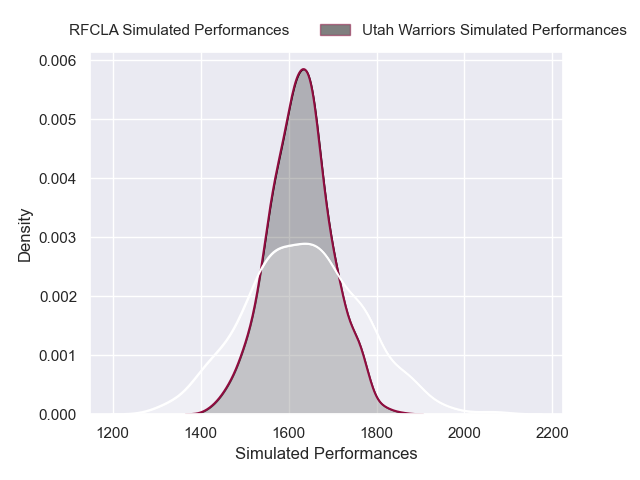

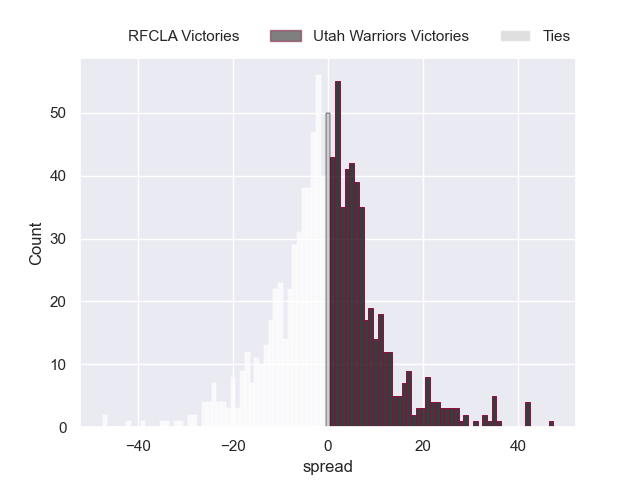

### Utah Warriors V RFC Los Angeles on 2025/06/08

Average Margin: Utah Warriors by 4.5

Average Scoreline: 32-27

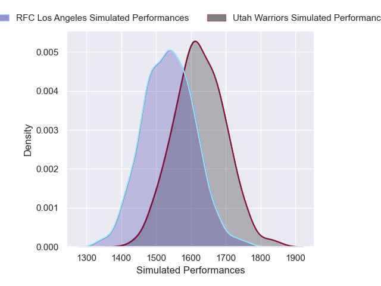
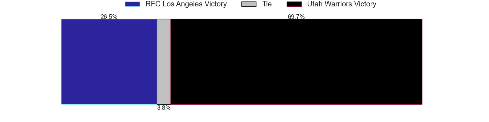
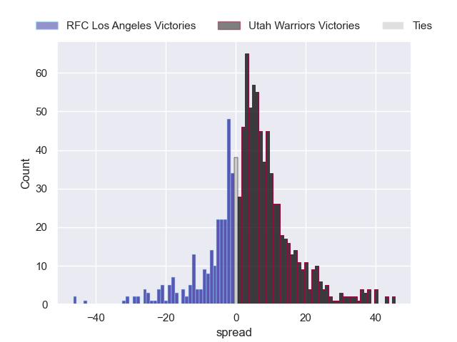

### San Diego Legion V Old Glory DC on 2025/06/08

Average Margin: San Diego Legion by 6.0

Average Scoreline: 42-36

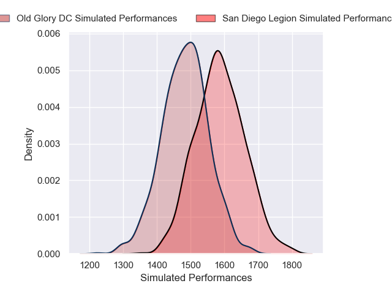
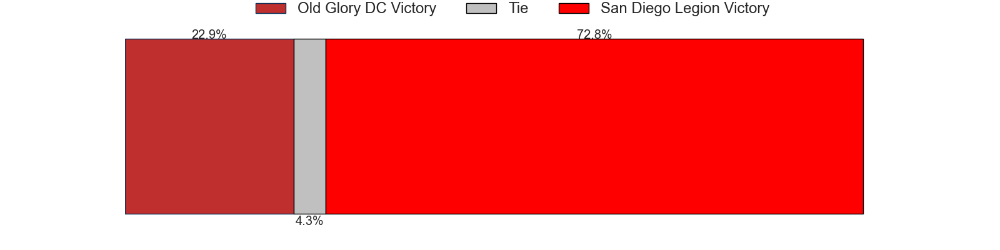
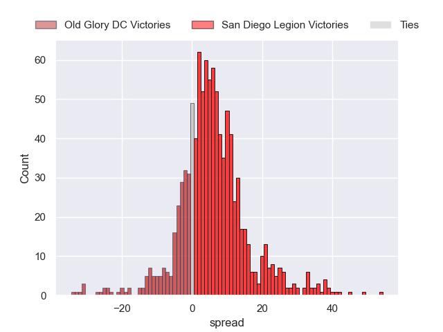

### NOLA Gold V New England Free Jacks on 2025/06/08

Average Margin: New England Free Jacks by 2.3

Average Scoreline: 37-34

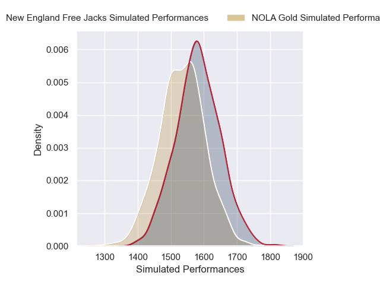
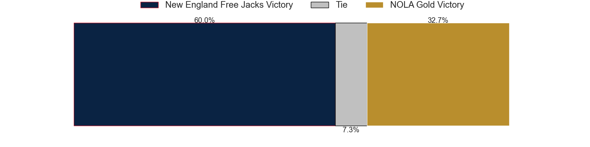
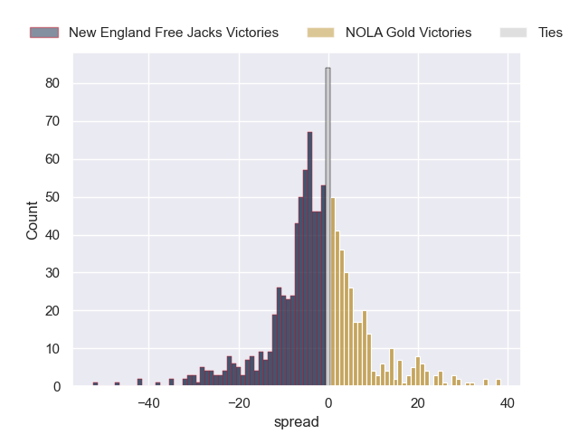

## Week 19

### Houston SaberCats V Anthem RC on 2025/06/09

Average Margin: Houston SaberCats by 25.0

Average Scoreline: 44-19

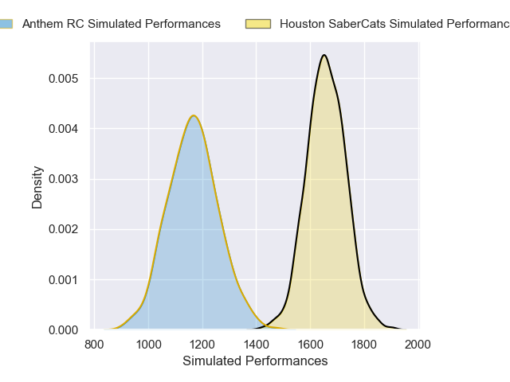
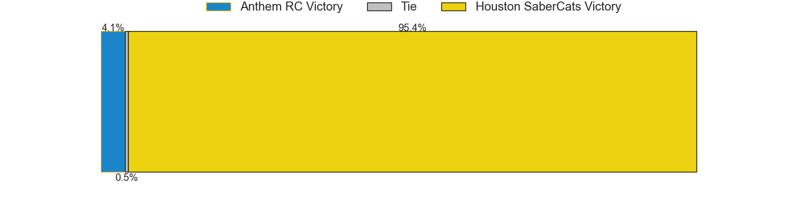
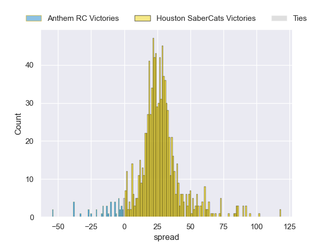

### Seattle Seawolves V Miami Sharks on 2025/06/09

Average Margin: Seattle Seawolves by 6.3

Average Scoreline: 29-23

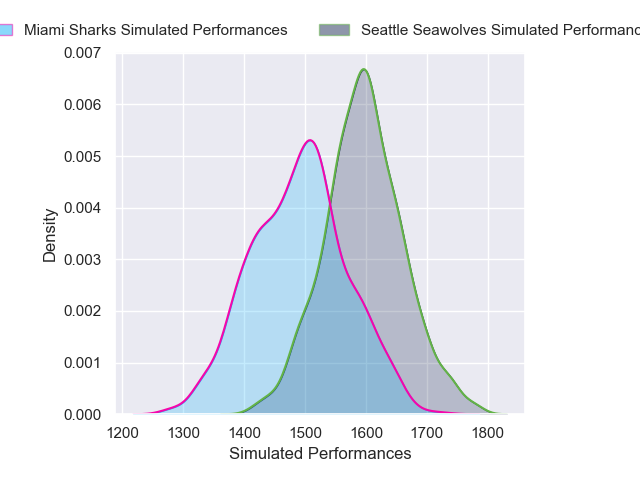
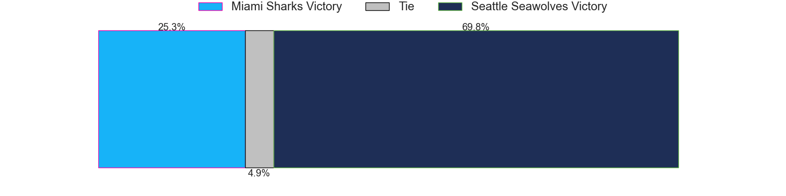
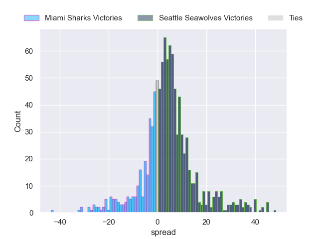

