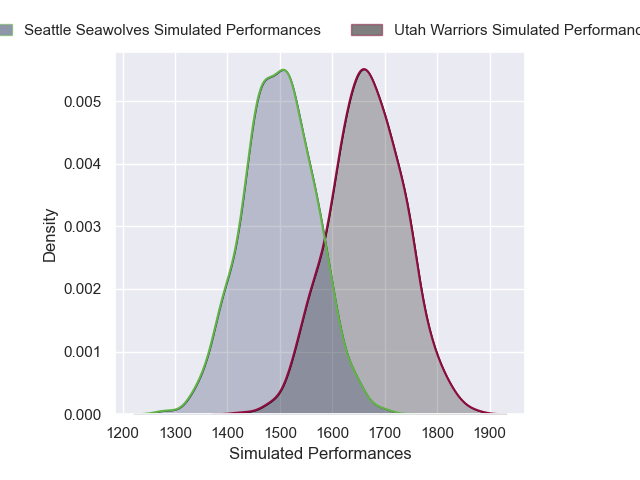
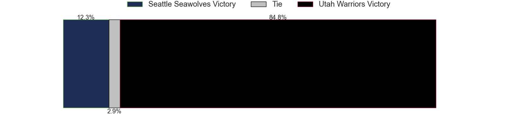
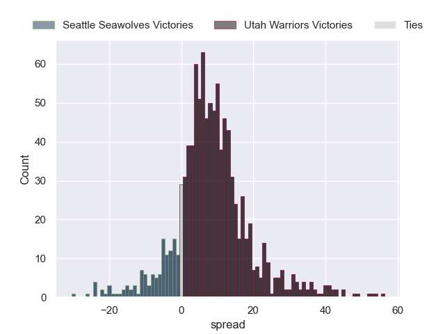
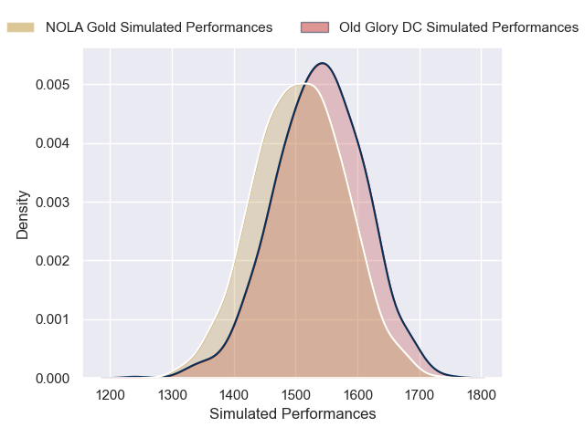
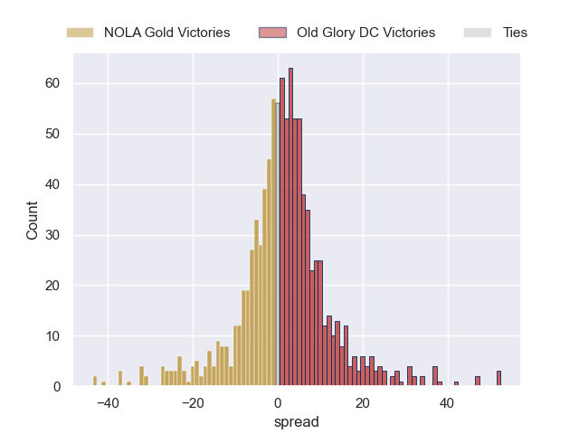

---  
title: "Major League Rugby 2025 Status"  
date: 2025-05-12 6:00:00 -0500  
categories: model review projection  
layout: article  
aside:  
    toc: true  
---
# Current Team Rankings

# Standings

## Current Standings

| Club                   |   Played |   Wins |   Point Differential |   Losing Bonus Points |   Try Bonus Points |   Competition Points |
|:-----------------------|---------:|-------:|---------------------:|----------------------:|-------------------:|---------------------:|
| Utah Warriors          |       12 |      9 |                   89 |                     1 |                nan |                   45 |
| New England Free Jacks |       12 |      9 |                   79 |                     1 |                nan |                   43 |
| Houston SaberCats      |       14 |      8 |                   95 |                     3 |                nan |                   42 |
| San Diego Legion       |       14 |      8 |                   24 |                     2 |                nan |                   41 |
| Chicago Hounds         |       11 |      8 |                   43 |                     1 |                nan |                   39 |
| Miami Sharks           |       12 |      7 |                  -25 |                     1 |                nan |                   33 |
| RFC Los Angeles        |       12 |      5 |                    0 |                     3 |                nan |                   28 |
| NOLA Gold              |       13 |      4 |                   -2 |                     7 |                nan |                   28 |
| Seattle Seawolves      |       12 |      5 |                  -22 |                     2 |                nan |                   27 |
| Old Glory DC           |       10 |      4 |                  -24 |                     2 |                nan |                   23 |
| RFCLA                  |        5 |      1 |                  -19 |                     2 |                nan |                    8 |
| Anthem RC              |       13 |      0 |                 -238 |                     3 |                nan |                    3 |

## Projected Remaining Table

| Club                   |   Matches Remaining |   Wins |   Point Differential |   Losing Bonus Points |   Try Bonus Points |   Competition Points |
|:-----------------------|--------------------:|-------:|---------------------:|----------------------:|-------------------:|---------------------:|
| Utah Warriors          |                   5 |    3.6 |             44.8676  |                   0.8 |                2.5 |                 17.9 |
| Chicago Hounds         |                   4 |    3.3 |             39.2734  |                   0.5 |                2   |                 15.8 |
| New England Free Jacks |                   4 |    3.1 |             29.4739  |                   0.6 |                1.9 |                 15   |
| Houston SaberCats      |                   4 |    2.4 |             22.0369  |                   1   |                2.1 |                 12.6 |
| Old Glory DC           |                   5 |    2.4 |             -1.42128 |                   1.1 |                1.8 |                 12.5 |
| Seattle Seawolves      |                   5 |    2.1 |            -10.3536  |                   1.3 |                1.2 |                 11   |
| RFC Los Angeles        |                   4 |    1.5 |            -14.0002  |                   1.1 |                1.5 |                  8.5 |
| San Diego Legion       |                   3 |    1.6 |              2.61928 |                   0.8 |                1   |                  8.4 |
| NOLA Gold              |                   4 |    1.3 |            -15.8478  |                   1.4 |                0.9 |                  7.6 |
| Miami Sharks           |                   4 |    1.3 |            -16.3567  |                   1.4 |                0.6 |                  7.1 |
| Anthem RC              |                   4 |    0.3 |            -80.2914  |                   0.4 |                0.6 |                  2.2 |

## Projected Total Table

| Club                   |   Total Matches |   Wins |   Point Differential |   Losing Bonus Points |   Try Bonus Points |   Competition Points |
|:-----------------------|----------------:|-------:|---------------------:|----------------------:|-------------------:|---------------------:|
| Utah Warriors          |              17 |   12.6 |             133.868  |                   1.8 |                2.5 |                 62.9 |
| New England Free Jacks |              16 |   12.1 |             108.474  |                   1.6 |                1.9 |                 58   |
| Chicago Hounds         |              15 |   11.3 |              82.2734 |                   1.5 |                2   |                 54.8 |
| Houston SaberCats      |              18 |   10.4 |             117.037  |                   4   |                2.1 |                 54.6 |
| San Diego Legion       |              17 |    9.6 |              26.6193 |                   2.8 |                1   |                 49.4 |
| Miami Sharks           |              16 |    8.3 |             -41.3567 |                   2.4 |                0.6 |                 40.1 |
| Seattle Seawolves      |              17 |    7.1 |             -32.3536 |                   3.3 |                1.2 |                 38   |
| RFC Los Angeles        |              16 |    6.5 |             -14.0002 |                   4.1 |                1.5 |                 36.5 |
| NOLA Gold              |              17 |    5.3 |             -17.8478 |                   8.4 |                0.9 |                 35.6 |
| Old Glory DC           |              15 |    6.4 |             -25.4213 |                   3.1 |                1.8 |                 35.5 |
| RFCLA                  |               5 |    1   |             -19      |                   2   |                0   |                  8   |
| Anthem RC              |              17 |    0.3 |            -318.291  |                   3.4 |                0.6 |                  5.2 |

# Completed Match Review

| Model | Percent Correct Predictions | Spread Error |
| ------ | ------ | ------ |
| Club Level | 64.3% | 12.7 |
| Player Level: Lineup | 66.7% | 12.7 |
| Player Level: Minutes | 71.4% | 13.0 |

# Future Predictions

## Week 15

### Utah Warriors V Seattle Seawolves on 2025/05/13

Average Margin: Utah Warriors by 8.7

Average Scoreline: 32-23

### Old Glory DC V NOLA Gold on 2025/05/14

Average Margin: Old Glory DC by 1.5

Average Scoreline: 30-28

### Miami Sharks V New England Free Jacks on 2025/05/17

Average Margin: New England Free Jacks by 4.8

Average Scoreline: 38-33

### Seattle Seawolves V San Diego Legion on 2025/05/18

Average Margin: Seattle Seawolves by 2.8

Average Scoreline: 30-27

### Anthem RC V Old Glory DC on 2025/05/18

Average Margin: Old Glory DC by 13.0

Average Scoreline: 38-25

### Houston SaberCats V Utah Warriors on 2025/05/18

Average Margin: Houston SaberCats by 2.0

Average Scoreline: 34-32

### Chicago Hounds V RFC Los Angeles on 2025/05/18

Average Margin: Chicago Hounds by 8.8

Average Scoreline: 39-30

## Week 16

### RFC Los Angeles V Miami Sharks on 2025/05/23

Average Margin: RFC Los Angeles by 6.1

Average Scoreline: 23-17

### Seattle Seawolves V Houston SaberCats on 2025/05/23

Average Margin: Houston SaberCats by 0.8

Average Scoreline: 31-30

### New England Free Jacks V Old Glory DC on 2025/05/24

Average Margin: New England Free Jacks by 11.7

Average Scoreline: 33-21

### Anthem RC V Chicago Hounds on 2025/05/24

Average Margin: Chicago Hounds by 16.8

Average Scoreline: 48-31

### NOLA Gold V Utah Warriors on 2025/05/24

Average Margin: Utah Warriors by 2.1

Average Scoreline: 34-32

## Week 17

### Utah Warriors V Anthem RC on 2025/05/31

Average Margin: Utah Warriors by 26.6

Average Scoreline: 44-17

### Old Glory DC V RFC Los Angeles on 2025/05/31

Average Margin: Old Glory DC by 1.7

Average Scoreline: 30-28

### Chicago Hounds V NOLA Gold on 2025/05/31

Average Margin: Chicago Hounds by 9.0

Average Scoreline: 36-27

### Miami Sharks V San Diego Legion on 2025/05/31

Average Margin: Miami Sharks by 0.7

Average Scoreline: 33-32

### New England Free Jacks V Seattle Seawolves on 2025/06/01

Average Margin: New England Free Jacks by 9.7

Average Scoreline: 32-22

## Week 18

### Chicago Hounds V Houston SaberCats on 2025/06/04

Average Margin: Chicago Hounds by 4.7

Average Scoreline: 31-27

### Utah Warriors V RFC Los Angeles on 2025/06/07

Average Margin: Utah Warriors by 9.5

Average Scoreline: 36-26

### San Diego Legion V Old Glory DC on 2025/06/07

Average Margin: San Diego Legion by 6.1

Average Scoreline: 31-25

### NOLA Gold V New England Free Jacks on 2025/06/07

Average Margin: New England Free Jacks by 3.3

Average Scoreline: 39-36

### Houston SaberCats V Anthem RC on 2025/06/08

Average Margin: Houston SaberCats by 23.9

Average Scoreline: 43-19

### Seattle Seawolves V Miami Sharks on 2025/06/08

Average Margin: Seattle Seawolves by 6.2

Average Scoreline: 28-22

