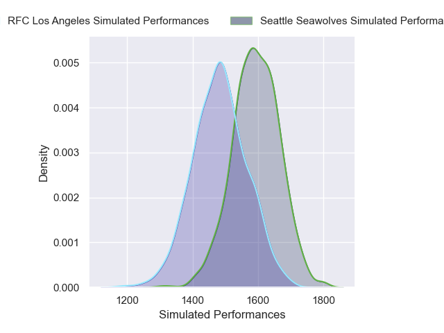
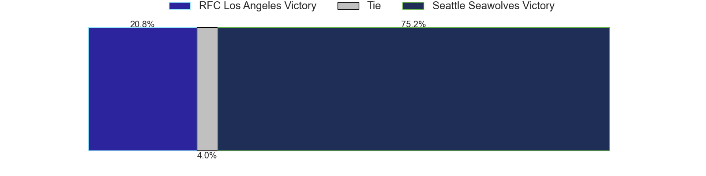
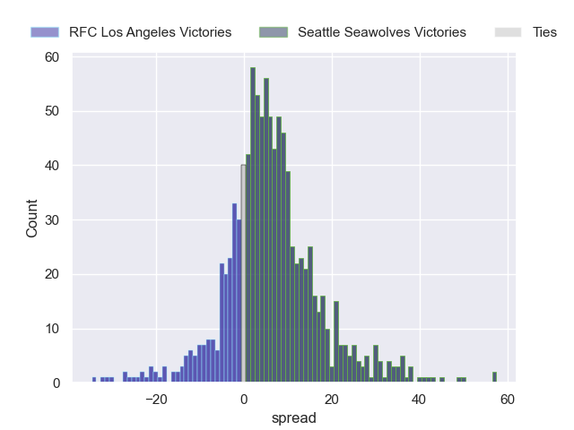

---  
title: "Major League Rugby 2025 Status"  
date: 2025-05-02 6:00:00 -0500  
categories: model review projection  
layout: article  
aside:  
    toc: true  
---
# Current Team Rankings

# Standings

## Current Standings

| Club                   |   Played |   Wins |   Point Differential |   Losing Bonus Points |   Try Bonus Points |   Competition Points |
|:-----------------------|---------:|-------:|---------------------:|----------------------:|-------------------:|---------------------:|
| Utah Warriors          |       11 |      9 |                  105 |                     1 |                nan |                   45 |
| New England Free Jacks |       11 |      8 |                   60 |                     1 |                nan |                   39 |
| Houston SaberCats      |       12 |      7 |                   67 |                     3 |                nan |                   38 |
| San Diego Legion       |       12 |      7 |                   34 |                     2 |                nan |                   37 |
| Chicago Hounds         |       10 |      7 |                   36 |                     1 |                nan |                   35 |
| Miami Sharks           |       10 |      6 |                  -24 |                     0 |                nan |                   28 |
| NOLA Gold              |       11 |      4 |                   11 |                     5 |                nan |                   26 |
| Seattle Seawolves      |       10 |      4 |                    8 |                     3 |                nan |                   24 |
| RFC Los Angeles        |       10 |      4 |                  -28 |                     3 |                nan |                   22 |
| Old Glory DC           |        9 |      3 |                  -40 |                     2 |                  5 |                   19 |
| RFCLA                  |        4 |      1 |                  -19 |                     2 |                nan |                    6 |
| Anthem RC              |       12 |      0 |                 -210 |                     3 |                nan |                    3 |

## Projected Remaining Table

| Club                   |   Matches Remaining |   Wins |   Point Differential |   Losing Bonus Points |   Try Bonus Points |   Competition Points |
|:-----------------------|--------------------:|-------:|---------------------:|----------------------:|-------------------:|---------------------:|
| Utah Warriors          |                   6 |    4.7 |            60.2443   |                   0.8 |                3.3 |                 23   |
| Chicago Hounds         |                   6 |    4.6 |            51.7933   |                   0.8 |                3.4 |                 22.5 |
| New England Free Jacks |                   6 |    4.5 |            37.2538   |                   1   |                2.4 |                 21.3 |
| Seattle Seawolves      |                   7 |    3.9 |             9.50573  |                   1.5 |                1.9 |                 19.1 |
| San Diego Legion       |                   5 |    3.3 |            18.9668   |                   1.1 |                1.6 |                 15.7 |
| NOLA Gold              |                   6 |    2.8 |            -4.46433  |                   1.7 |                1.6 |                 14.4 |
| RFC Los Angeles        |                   6 |    2.6 |            -0.913559 |                   1.3 |                2.1 |                 14   |
| Houston SaberCats      |                   6 |    2.5 |             0.271402 |                   1.7 |                2.1 |                 13.7 |
| Old Glory DC           |                   6 |    2.3 |           -19.7599   |                   1.5 |                1.9 |                 12.4 |
| Miami Sharks           |                   6 |    1.1 |           -48.8026   |                   1.8 |                1   |                  7.4 |
| Anthem RC              |                   5 |    0.4 |           -99.5472   |                   0.5 |                0.6 |                  2.7 |
| RFCLA                  |                   1 |    0.4 |            -4.54782  |                   0.2 |                0.1 |                  1.8 |

## Projected Total Table

| Club                   |   Total Matches |   Wins |   Point Differential |   Losing Bonus Points |   Try Bonus Points |   Competition Points |
|:-----------------------|----------------:|-------:|---------------------:|----------------------:|-------------------:|---------------------:|
| Utah Warriors          |              17 |   13.7 |            165.244   |                   1.8 |                3.3 |                 68   |
| New England Free Jacks |              17 |   12.5 |             97.2538  |                   2   |                2.4 |                 60.3 |
| Chicago Hounds         |              16 |   11.6 |             87.7933  |                   1.8 |                3.4 |                 57.5 |
| San Diego Legion       |              17 |   10.3 |             52.9668  |                   3.1 |                1.6 |                 52.7 |
| Houston SaberCats      |              18 |    9.5 |             67.2714  |                   4.7 |                2.1 |                 51.7 |
| Seattle Seawolves      |              17 |    7.9 |             17.5057  |                   4.5 |                1.9 |                 43.1 |
| NOLA Gold              |              17 |    6.8 |              6.53567 |                   6.7 |                1.6 |                 40.4 |
| RFC Los Angeles        |              16 |    6.6 |            -28.9136  |                   4.3 |                2.1 |                 36   |
| Miami Sharks           |              16 |    7.1 |            -72.8026  |                   1.8 |                1   |                 35.4 |
| Old Glory DC           |              15 |    5.3 |            -59.7599  |                   3.5 |                6.9 |                 31.4 |
| RFCLA                  |               5 |    1.4 |            -23.5478  |                   2.2 |                0.1 |                  7.8 |
| Anthem RC              |              17 |    0.4 |           -309.547   |                   3.5 |                0.6 |                  5.7 |

# Completed Match Review

| Model | Percent Correct Predictions | Spread Error |
| ------ | ------ | ------ |
| Club Level | 67.2% | 12.6 |
| Player Level: Lineup | 58.8% | 13.0 |
| Player Level: Minutes | 64.7% | 13.5 |

# Future Predictions

## Week 13

### Seattle Seawolves V RFCLA on 2025/05/02

Average Margin: Seattle Seawolves by 4.5

Average Scoreline: 27-22

### Seattle Seawolves V RFC Los Angeles on 2025/05/03

Average Margin: Seattle Seawolves by 6.4

Average Scoreline: 29-22

### New England Free Jacks V Houston SaberCats on 2025/05/04

Average Margin: New England Free Jacks by 6.7

Average Scoreline: 29-22

### Old Glory DC V Utah Warriors on 2025/05/04

Average Margin: Utah Warriors by 7.3

Average Scoreline: 36-29

### San Diego Legion V NOLA Gold on 2025/05/04

Average Margin: San Diego Legion by 4.4

Average Scoreline: 25-21

### Chicago Hounds V Miami Sharks on 2025/05/04

Average Margin: Chicago Hounds by 12.9

Average Scoreline: 27-14

## Week 14

### NOLA Gold V Miami Sharks on 2025/05/09

Average Margin: NOLA Gold by 9.8

Average Scoreline: 28-18

### New England Free Jacks V Chicago Hounds on 2025/05/10

Average Margin: New England Free Jacks by 3.6

Average Scoreline: 25-21

### San Diego Legion V Houston SaberCats on 2025/05/10

Average Margin: San Diego Legion by 4.4

Average Scoreline: 26-21

### RFC Los Angeles V Anthem RC on 2025/05/10

Average Margin: RFC Los Angeles by 20.3

Average Scoreline: 35-15

## Week 15

### Utah Warriors V Seattle Seawolves on 2025/05/12

Average Margin: Utah Warriors by 9.6

Average Scoreline: 30-21

### Old Glory DC V NOLA Gold on 2025/05/13

Average Margin: NOLA Gold by 1.3

Average Scoreline: 30-28

### Houston SaberCats V Utah Warriors on 2025/05/17

Average Margin: Utah Warriors by 1.5

Average Scoreline: 27-26

### Miami Sharks V New England Free Jacks on 2025/05/17

Average Margin: New England Free Jacks by 5.9

Average Scoreline: 33-27

### Seattle Seawolves V San Diego Legion on 2025/05/17

Average Margin: Seattle Seawolves by 2.8

Average Scoreline: 32-30

### Chicago Hounds V RFC Los Angeles on 2025/05/18

Average Margin: Chicago Hounds by 10.0

Average Scoreline: 22-12

### Anthem RC V Old Glory DC on 2025/05/18

Average Margin: Old Glory DC by 10.7

Average Scoreline: 36-25

## Week 16

### Seattle Seawolves V Houston SaberCats on 2025/05/23

Average Margin: Seattle Seawolves by 3.8

Average Scoreline: 33-29

### RFC Los Angeles V Miami Sharks on 2025/05/23

Average Margin: RFC Los Angeles by 7.6

Average Scoreline: 29-21

### Anthem RC V Chicago Hounds on 2025/05/24

Average Margin: Chicago Hounds by 18.5

Average Scoreline: 41-22

### NOLA Gold V Utah Warriors on 2025/05/24

Average Margin: Utah Warriors by 2.6

Average Scoreline: 29-26

### New England Free Jacks V Old Glory DC on 2025/05/24

Average Margin: New England Free Jacks by 12.9

Average Scoreline: 30-17

## Week 17

### Chicago Hounds V NOLA Gold on 2025/05/31

Average Margin: Chicago Hounds by 8.2

Average Scoreline: 30-22

### Utah Warriors V Anthem RC on 2025/05/31

Average Margin: Utah Warriors by 27.6

Average Scoreline: 40-12

### Miami Sharks V San Diego Legion on 2025/05/31

Average Margin: San Diego Legion by 3.2

Average Scoreline: 31-28

### Old Glory DC V RFC Los Angeles on 2025/05/31

Average Margin: Old Glory DC by 0.8

Average Scoreline: 29-28

### New England Free Jacks V Seattle Seawolves on 2025/06/01

Average Margin: New England Free Jacks by 7.8

Average Scoreline: 30-22

## Week 18

### Chicago Hounds V Houston SaberCats on 2025/06/04

Average Margin: Chicago Hounds by 5.9

Average Scoreline: 28-22

### Utah Warriors V RFC Los Angeles on 2025/06/07

Average Margin: Utah Warriors by 11.6

Average Scoreline: 31-19

### San Diego Legion V Old Glory DC on 2025/06/07

Average Margin: San Diego Legion by 9.8

Average Scoreline: 30-20

### NOLA Gold V New England Free Jacks on 2025/06/07

Average Margin: New England Free Jacks by 0.4

Average Scoreline: 30-30

### Houston SaberCats V Anthem RC on 2025/06/08

Average Margin: Houston SaberCats by 22.5

Average Scoreline: 40-18

### Seattle Seawolves V Miami Sharks on 2025/06/08

Average Margin: Seattle Seawolves by 9.4

Average Scoreline: 30-21

