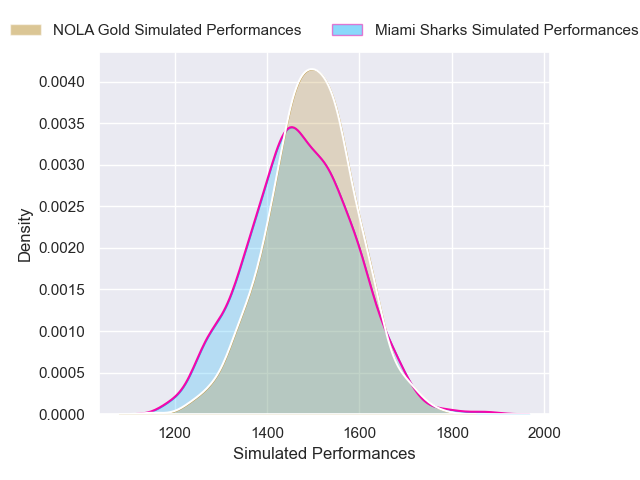
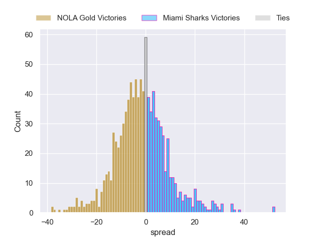
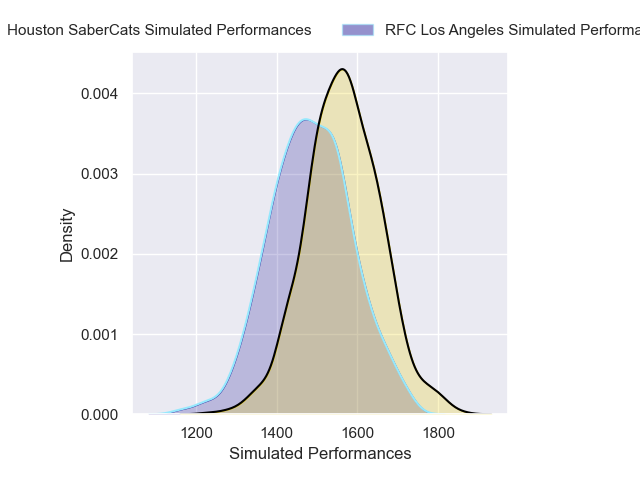
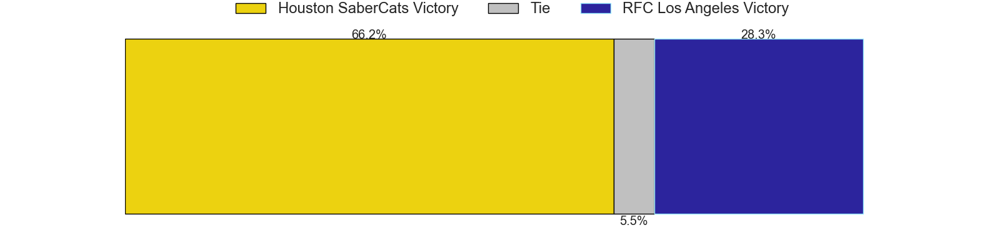
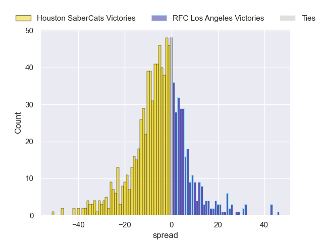

---  
title: "Major League Rugby 2025 Status"  
date: 2025-02-17 6:00:00 -0500  
categories: model review projection  
layout: article  
aside:  
    toc: true  
---
# Current Team Rankings

# Standings

## Current Standings

| Club                   |   Played |   Wins |   Point Differential |   Losing Bonus Points |   Try Bonus Points |   Competition Points |
|:-----------------------|---------:|-------:|---------------------:|----------------------:|-------------------:|---------------------:|
| Old Glory DC           |        1 |      1 |                    2 |                     0 |                  1 |                    5 |
| NOLA Gold              |        1 |      1 |                   21 |                     0 |                nan |                    4 |
| New England Free Jacks |        1 |      1 |                    7 |                     0 |                  0 |                    4 |
| San Diego Legion       |        1 |      1 |                    6 |                     0 |                  0 |                    4 |
| Chicago Hounds         |        1 |      1 |                    3 |                     0 |                  0 |                    4 |
| Miami Sharks           |        1 |      0 |                   -2 |                     1 |                  1 |                    2 |
| Houston SaberCats      |        1 |      0 |                   -3 |                     1 |                  0 |                    1 |
| Seattle Seawolves      |        1 |      0 |                   -6 |                     1 |                  0 |                    1 |
| RFC Los Angeles        |        1 |      0 |                   -7 |                     1 |                nan |                    1 |
| Anthem RC              |        1 |      0 |                  -21 |                     0 |                nan |                    0 |

## Projected Remaining Table

| Club                   |   Matches Remaining |   Wins |   Point Differential |   Losing Bonus Points |   Try Bonus Points |   Competition Points |
|:-----------------------|--------------------:|-------:|---------------------:|----------------------:|-------------------:|---------------------:|
| Chicago Hounds         |                  15 |   10.9 |            121.138   |                   2.4 |                7.1 |                 53   |
| New England Free Jacks |                  15 |   10.7 |             97.3175  |                   2.6 |                6.5 |                 51.9 |
| San Diego Legion       |                  15 |   10.3 |             91.7376  |                   2.6 |                6.5 |                 50.5 |
| Seattle Seawolves      |                  15 |    9.8 |             86.0925  |                   3   |                6.2 |                 48.6 |
| Houston SaberCats      |                  15 |    9.3 |             69.1423  |                   3   |                7.6 |                 47.9 |
| Old Glory DC           |                  15 |    7.5 |             15.8375  |                   3.5 |                5.3 |                 38.6 |
| NOLA Gold              |                  15 |    7.2 |             -3.58231 |                   3.6 |                4.7 |                 37   |
| Utah Warriors          |                  16 |    6.5 |            -31.4034  |                   4.3 |                4.6 |                 35.1 |
| RFC Los Angeles        |                  15 |    4.5 |            -85.0546  |                   3.7 |                4.6 |                 26.4 |
| Miami Sharks           |                  15 |    4.7 |            -77.8303  |                   3.5 |                4   |                 26.3 |
| Anthem RC              |                  15 |    1.5 |           -283.394   |                   1.7 |                1.7 |                  9.2 |

## Projected Total Table

| Club                   |   Total Matches |   Wins |   Point Differential |   Losing Bonus Points |   Try Bonus Points |   Competition Points |
|:-----------------------|----------------:|-------:|---------------------:|----------------------:|-------------------:|---------------------:|
| Chicago Hounds         |              16 |   11.9 |             124.138  |                   2.4 |                7.1 |                 57   |
| New England Free Jacks |              16 |   11.7 |             104.317  |                   2.6 |                6.5 |                 55.9 |
| San Diego Legion       |              16 |   11.3 |              97.7376 |                   2.6 |                6.5 |                 54.5 |
| Seattle Seawolves      |              16 |    9.8 |              80.0925 |                   4   |                6.2 |                 49.6 |
| Houston SaberCats      |              16 |    9.3 |              66.1423 |                   4   |                7.6 |                 48.9 |
| Old Glory DC           |              16 |    8.5 |              17.8375 |                   3.5 |                6.3 |                 43.6 |
| NOLA Gold              |              16 |    8.2 |              17.4177 |                   3.6 |                4.7 |                 41   |
| Utah Warriors          |              16 |    6.5 |             -31.4034 |                   4.3 |                4.6 |                 35.1 |
| Miami Sharks           |              16 |    4.7 |             -79.8303 |                   4.5 |                5   |                 28.3 |
| RFC Los Angeles        |              16 |    4.5 |             -92.0546 |                   4.7 |                4.6 |                 27.4 |
| Anthem RC              |              16 |    1.5 |            -304.394  |                   1.7 |                1.7 |                  9.2 |

# Completed Match Review

| Model | Percent Correct Predictions | Spread Error |
| ------ | ------ | ------ |
| Club Level | 60.0% | 3.1 |
| Player Level: Lineup | 100.0% | 0.6 |
| Player Level: Minutes | 100.0% | 5.2 |

# Future Predictions

## Week 2

### Anthem RC V San Diego Legion on 2025/02/22

Average Margin: San Diego Legion by 21.7

Average Scoreline: 50-28

### Chicago Hounds V Utah Warriors on 2025/02/23

Average Margin: Chicago Hounds by 11.4

Average Scoreline: 40-29

### Miami Sharks V NOLA Gold on 2025/02/23

Average Margin: NOLA Gold by 1.7

Average Scoreline: 31-30

## Week 3

### RFC Los Angeles V Houston SaberCats on 2025/02/24

Average Margin: Houston SaberCats by 4.8

Average Scoreline: 36-31

### Anthem RC V Miami Sharks on 2025/02/28

Average Margin: Miami Sharks by 12.5

Average Scoreline: 29-17

### Utah Warriors V NOLA Gold on 2025/03/01

Average Margin: Utah Warriors by 3.0

Average Scoreline: 34-31

### Old Glory DC V San Diego Legion on 2025/03/01

Average Margin: San Diego Legion by 2.4

Average Scoreline: 32-30

### Houston SaberCats V Seattle Seawolves on 2025/03/01

Average Margin: Houston SaberCats by 3.5

Average Scoreline: 33-30

### Chicago Hounds V New England Free Jacks on 2025/03/02

Average Margin: Chicago Hounds by 4.4

Average Scoreline: 29-25

## Week 4

### Miami Sharks V Chicago Hounds on 2025/03/08

Average Margin: Chicago Hounds by 8.5

Average Scoreline: 34-26

### Seattle Seawolves V New England Free Jacks on 2025/03/08

Average Margin: Seattle Seawolves by 2.3

Average Scoreline: 28-25

### Old Glory DC V Anthem RC on 2025/03/08

Average Margin: Old Glory DC by 23.0

Average Scoreline: 47-24

### San Diego Legion V RFC Los Angeles on 2025/03/08

Average Margin: San Diego Legion by 13.3

Average Scoreline: 42-29

### Utah Warriors V Houston SaberCats on 2025/03/08

Average Margin: Houston SaberCats by 0.9

Average Scoreline: 32-31

## Week 5

### New England Free Jacks V NOLA Gold on 2025/03/15

Average Margin: New England Free Jacks by 9.9

Average Scoreline: 34-24

### Chicago Hounds V Old Glory DC on 2025/03/15

Average Margin: Chicago Hounds by 10.5

Average Scoreline: 44-33

### RFC Los Angeles V Seattle Seawolves on 2025/03/15

Average Margin: Seattle Seawolves by 5.7

Average Scoreline: 43-37

### Miami Sharks V Utah Warriors on 2025/03/15

Average Margin: Utah Warriors by 0.9

Average Scoreline: 34-33

## Week 6

### Old Glory DC V New England Free Jacks on 2025/03/22

Average Margin: New England Free Jacks by 2.6

Average Scoreline: 31-29

### NOLA Gold V RFC Los Angeles on 2025/03/22

Average Margin: NOLA Gold by 9.3

Average Scoreline: 37-28

### Seattle Seawolves V Utah Warriors on 2025/03/22

Average Margin: Seattle Seawolves by 8.7

Average Scoreline: 35-26

### San Diego Legion V Miami Sharks on 2025/03/22

Average Margin: San Diego Legion by 14.0

Average Scoreline: 42-28

### Anthem RC V Houston SaberCats on 2025/03/22

Average Margin: Houston SaberCats by 19.8

Average Scoreline: 46-26

## Week 7

### Houston SaberCats V San Diego Legion on 2025/03/29

Average Margin: Houston SaberCats by 2.4

Average Scoreline: 33-30

### Utah Warriors V New England Free Jacks on 2025/03/29

Average Margin: New England Free Jacks by 3.9

Average Scoreline: 34-30

### RFC Los Angeles V Old Glory DC on 2025/03/29

Average Margin: Old Glory DC by 1.0

Average Scoreline: 41-40

### NOLA Gold V Chicago Hounds on 2025/03/29

Average Margin: Chicago Hounds by 3.6

Average Scoreline: 32-28

### Seattle Seawolves V Anthem RC on 2025/03/29

Average Margin: Seattle Seawolves by 26.9

Average Scoreline: 48-21

## Week 8

### Anthem RC V NOLA Gold on 2025/04/05

Average Margin: NOLA Gold by 14.4

Average Scoreline: 44-30

### San Diego Legion V Chicago Hounds on 2025/04/05

Average Margin: San Diego Legion by 2.6

Average Scoreline: 28-25

### Old Glory DC V Seattle Seawolves on 2025/04/05

Average Margin: Seattle Seawolves by 0.5

Average Scoreline: 28-28

### Houston SaberCats V RFC Los Angeles on 2025/04/05

Average Margin: Houston SaberCats by 10.8

Average Scoreline: 38-27

### New England Free Jacks V Miami Sharks on 2025/04/06

Average Margin: New England Free Jacks by 14.7

Average Scoreline: 39-25

## Week 9

### New England Free Jacks V San Diego Legion on 2025/04/12

Average Margin: New England Free Jacks by 5.1

Average Scoreline: 30-25

### Miami Sharks V Houston SaberCats on 2025/04/12

Average Margin: Houston SaberCats by 5.1

Average Scoreline: 33-28

### NOLA Gold V Old Glory DC on 2025/04/12

Average Margin: NOLA Gold by 4.1

Average Scoreline: 33-29

### RFC Los Angeles V Utah Warriors on 2025/04/12

Average Margin: RFC Los Angeles by 0.3

Average Scoreline: 34-33

### Chicago Hounds V Anthem RC on 2025/04/13

Average Margin: Chicago Hounds by 26.0

Average Scoreline: 49-23

## Week 10

### Seattle Seawolves V Chicago Hounds on 2025/04/18

Average Margin: Seattle Seawolves by 1.6

Average Scoreline: 32-30

### Anthem RC V New England Free Jacks on 2025/04/18

Average Margin: New England Free Jacks by 20.4

Average Scoreline: 40-20

### Old Glory DC V Miami Sharks on 2025/04/19

Average Margin: Old Glory DC by 8.8

Average Scoreline: 31-23

### Houston SaberCats V NOLA Gold on 2025/04/19

Average Margin: Houston SaberCats by 7.4

Average Scoreline: 33-26

### San Diego Legion V Utah Warriors on 2025/04/19

Average Margin: San Diego Legion by 10.0

Average Scoreline: 32-22

## Week 11

### New England Free Jacks V RFC Los Angeles on 2025/04/22

Average Margin: New England Free Jacks by 13.4

Average Scoreline: 37-24

### Anthem RC V Seattle Seawolves on 2025/04/23

Average Margin: Seattle Seawolves by 18.7

Average Scoreline: 46-27

### RFC Los Angeles V San Diego Legion on 2025/04/26

Average Margin: San Diego Legion by 6.4

Average Scoreline: 35-29

### Utah Warriors V Chicago Hounds on 2025/04/26

Average Margin: Chicago Hounds by 3.7

Average Scoreline: 30-26

### Houston SaberCats V Old Glory DC on 2025/04/26

Average Margin: Houston SaberCats by 8.1

Average Scoreline: 36-28

### NOLA Gold V Seattle Seawolves on 2025/04/27

Average Margin: NOLA Gold by 0.4

Average Scoreline: 28-28

### Miami Sharks V Anthem RC on 2025/04/27

Average Margin: Miami Sharks by 16.0

Average Scoreline: 44-28

## Week 12

### Utah Warriors V San Diego Legion on 2025/04/30

Average Margin: San Diego Legion by 2.7

Average Scoreline: 29-27

### Seattle Seawolves V RFC Los Angeles on 2025/05/02

Average Margin: Seattle Seawolves by 11.6

Average Scoreline: 36-24

### New England Free Jacks V Houston SaberCats on 2025/05/04

Average Margin: New England Free Jacks by 6.5

Average Scoreline: 31-25

### Chicago Hounds V Miami Sharks on 2025/05/04

Average Margin: Chicago Hounds by 13.9

Average Scoreline: 38-24

### San Diego Legion V NOLA Gold on 2025/05/04

Average Margin: San Diego Legion by 8.9

Average Scoreline: 32-23

### Old Glory DC V Utah Warriors on 2025/05/04

Average Margin: Old Glory DC by 4.7

Average Scoreline: 30-25

## Week 13

### NOLA Gold V Miami Sharks on 2025/05/09

Average Margin: NOLA Gold by 8.4

Average Scoreline: 35-26

### San Diego Legion V Houston SaberCats on 2025/05/10

Average Margin: San Diego Legion by 5.2

Average Scoreline: 31-26

### RFC Los Angeles V Anthem RC on 2025/05/10

Average Margin: RFC Los Angeles by 15.0

Average Scoreline: 43-28

### New England Free Jacks V Chicago Hounds on 2025/05/10

Average Margin: New England Free Jacks by 3.5

Average Scoreline: 28-24

## Week 14

### Utah Warriors V Seattle Seawolves on 2025/05/12

Average Margin: Seattle Seawolves by 0.9

Average Scoreline: 30-29

### Old Glory DC V NOLA Gold on 2025/05/13

Average Margin: Old Glory DC by 3.6

Average Scoreline: 28-25

### Miami Sharks V New England Free Jacks on 2025/05/17

Average Margin: New England Free Jacks by 7.1

Average Scoreline: 30-23

### Seattle Seawolves V San Diego Legion on 2025/05/17

Average Margin: Seattle Seawolves by 2.6

Average Scoreline: 29-26

### Houston SaberCats V Utah Warriors on 2025/05/17

Average Margin: Houston SaberCats by 7.8

Average Scoreline: 34-27

### Anthem RC V Old Glory DC on 2025/05/18

Average Margin: Old Glory DC by 12.5

Average Scoreline: 40-28

### Chicago Hounds V RFC Los Angeles on 2025/05/18

Average Margin: Chicago Hounds by 13.8

Average Scoreline: 40-26

## Week 15

### Seattle Seawolves V Houston SaberCats on 2025/05/23

Average Margin: Seattle Seawolves by 4.1

Average Scoreline: 31-27

### RFC Los Angeles V Miami Sharks on 2025/05/23

Average Margin: RFC Los Angeles by 4.9

Average Scoreline: 33-28

### Anthem RC V Chicago Hounds on 2025/05/24

Average Margin: Chicago Hounds by 17.4

Average Scoreline: 40-23

### New England Free Jacks V Old Glory DC on 2025/05/24

Average Margin: New England Free Jacks by 9.2

Average Scoreline: 34-25

### NOLA Gold V Utah Warriors on 2025/05/24

Average Margin: NOLA Gold by 5.8

Average Scoreline: 31-25

## Week 16

### Chicago Hounds V NOLA Gold on 2025/05/31

Average Margin: Chicago Hounds by 9.3

Average Scoreline: 35-25

### Utah Warriors V Anthem RC on 2025/05/31

Average Margin: Utah Warriors by 18.2

Average Scoreline: 43-25

### Miami Sharks V San Diego Legion on 2025/05/31

Average Margin: San Diego Legion by 6.6

Average Scoreline: 33-26

### Old Glory DC V RFC Los Angeles on 2025/05/31

Average Margin: Old Glory DC by 8.0

Average Scoreline: 31-23

### New England Free Jacks V Seattle Seawolves on 2025/06/01

Average Margin: New England Free Jacks by 5.7

Average Scoreline: 30-25

## Week 17

### Chicago Hounds V Houston SaberCats on 2025/06/04

Average Margin: Chicago Hounds by 6.4

Average Scoreline: 33-26

### San Diego Legion V Old Glory DC on 2025/06/07

Average Margin: San Diego Legion by 8.2

Average Scoreline: 34-26

### NOLA Gold V New England Free Jacks on 2025/06/07

Average Margin: New England Free Jacks by 2.2

Average Scoreline: 29-27

### Utah Warriors V RFC Los Angeles on 2025/06/07

Average Margin: Utah Warriors by 7.2

Average Scoreline: 33-25

### Seattle Seawolves V Miami Sharks on 2025/06/08

Average Margin: Seattle Seawolves by 11.9

Average Scoreline: 38-26

### Houston SaberCats V Anthem RC on 2025/06/08

Average Margin: Houston SaberCats by 20.8

Average Scoreline: 47-26

