---  
title: "Major League Rugby 2025 Status"  
date: 2025-03-28 6:00:00 -0500  
categories: model review projection  
layout: article  
aside:  
    toc: true  
---
# Current Team Rankings

# Standings

## Current Standings

| Club                   |   Played |   Wins |   Point Differential |   Losing Bonus Points |   Try Bonus Points |   Competition Points |
|:-----------------------|---------:|-------:|---------------------:|----------------------:|-------------------:|---------------------:|
| San Diego Legion       |        5 |      5 |                  104 |                     0 |                  5 |                   25 |
| Houston SaberCats      |        5 |      4 |                   38 |                     1 |                  3 |                   20 |
| Chicago Hounds         |        5 |      4 |                   35 |                     0 |                  4 |                   20 |
| Utah Warriors          |        5 |      4 |                   48 |                     0 |                  3 |                   19 |
| Old Glory DC           |        4 |      2 |                   -2 |                     1 |                  2 |                   11 |
| New England Free Jacks |        5 |      2 |                  -35 |                     1 |                nan |                   11 |
| RFC Los Angeles        |        5 |      2 |                  -19 |                     1 |                nan |                   10 |
| Seattle Seawolves      |        5 |      1 |                  -23 |                     3 |                nan |                    9 |
| Miami Sharks           |        5 |      2 |                  -43 |                     0 |                  1 |                    9 |
| NOLA Gold              |        5 |      1 |                  -29 |                     3 |                nan |                    8 |
| Anthem RC              |        5 |      0 |                  -74 |                     3 |                nan |                    3 |

## Projected Remaining Table

| Club                   |   Matches Remaining |   Wins |   Point Differential |   Losing Bonus Points |   Try Bonus Points |   Competition Points |
|:-----------------------|--------------------:|-------:|---------------------:|----------------------:|-------------------:|---------------------:|
| San Diego Legion       |                  11 |    7.8 |             63.3104  |                   2   |                4.5 |                 37.7 |
| Chicago Hounds         |                  11 |    7.5 |             77.2404  |                   2   |                5.5 |                 37.5 |
| Houston SaberCats      |                  11 |    7.2 |             57.8431  |                   2.1 |                5.7 |                 36.6 |
| New England Free Jacks |                  11 |    7.4 |             56.1164  |                   2.1 |                4.5 |                 36.4 |
| Seattle Seawolves      |                  11 |    6.6 |             43.8745  |                   2.5 |                4.5 |                 33.4 |
| Utah Warriors          |                  11 |    6.5 |             34.6051  |                   2.5 |                4.1 |                 32.6 |
| Old Glory DC           |                  11 |    5.3 |             -6.55597 |                   2.6 |                3.5 |                 27.2 |
| NOLA Gold              |                  11 |    4.4 |            -31.2079  |                   2.8 |                3.1 |                 23.5 |
| RFC Los Angeles        |                  11 |    4   |            -33.8292  |                   2.9 |                3.8 |                 22.8 |
| Miami Sharks           |                  10 |    2   |            -95.2136  |                   2.2 |                2.1 |                 12.2 |
| Anthem RC              |                  11 |    1.3 |           -166.183   |                   1.8 |                1.8 |                  8.8 |

## Projected Total Table

| Club                   |   Total Matches |   Wins |   Point Differential |   Losing Bonus Points |   Try Bonus Points |   Competition Points |
|:-----------------------|----------------:|-------:|---------------------:|----------------------:|-------------------:|---------------------:|
| San Diego Legion       |              16 |   12.8 |            167.31    |                   2   |                9.5 |                 62.7 |
| Chicago Hounds         |              16 |   11.5 |            112.24    |                   2   |                9.5 |                 57.5 |
| Houston SaberCats      |              16 |   11.2 |             95.8431  |                   3.1 |                8.7 |                 56.6 |
| Utah Warriors          |              16 |   10.5 |             82.6051  |                   2.5 |                7.1 |                 51.6 |
| New England Free Jacks |              16 |    9.4 |             21.1164  |                   3.1 |                4.5 |                 47.4 |
| Seattle Seawolves      |              16 |    7.6 |             20.8745  |                   5.5 |                4.5 |                 42.4 |
| Old Glory DC           |              15 |    7.3 |             -8.55597 |                   3.6 |                5.5 |                 38.2 |
| RFC Los Angeles        |              16 |    6   |            -52.8292  |                   3.9 |                3.8 |                 32.8 |
| NOLA Gold              |              16 |    5.4 |            -60.2079  |                   5.8 |                3.1 |                 31.5 |
| Miami Sharks           |              15 |    4   |           -138.214   |                   2.2 |                3.1 |                 21.2 |
| Anthem RC              |              16 |    1.3 |           -240.183   |                   4.8 |                1.8 |                 11.8 |

# Completed Match Review

| Model | Percent Correct Predictions | Spread Error |
| ------ | ------ | ------ |
| Club Level | 70.4% | 12.5 |
| Player Level: Lineup | 50.0% | 12.6 |
| Player Level: Minutes | 58.3% | 12.5 |

# Future Predictions

## Week 6

### NOLA Gold V Chicago Hounds on 2025/03/30

Average Margin: Chicago Hounds by 4.7

Average Scoreline: 28-23

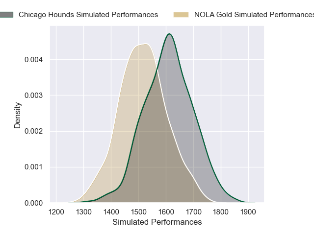
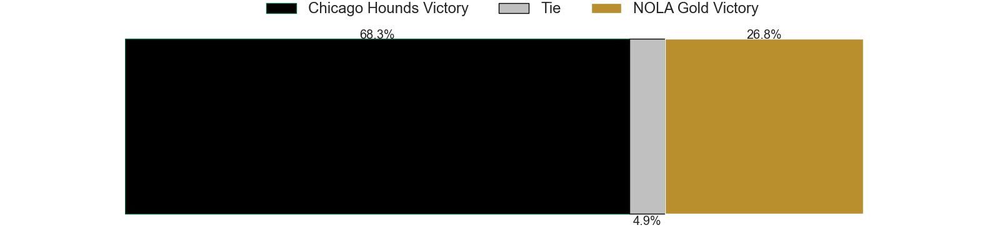
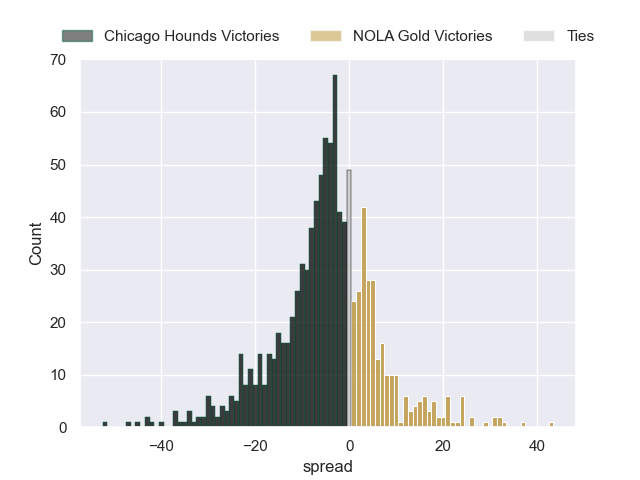

### Houston SaberCats V San Diego Legion on 2025/03/30

Average Margin: Houston SaberCats by 2.1

Average Scoreline: 26-24

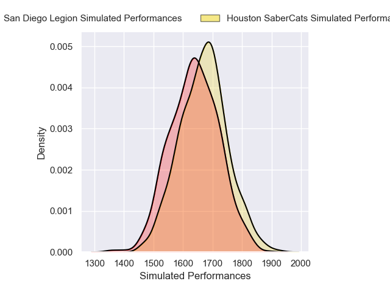

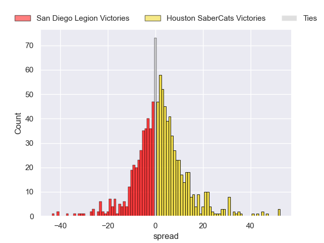

### Utah Warriors V New England Free Jacks on 2025/03/30

Average Margin: Utah Warriors by 4.2

Average Scoreline: 22-17

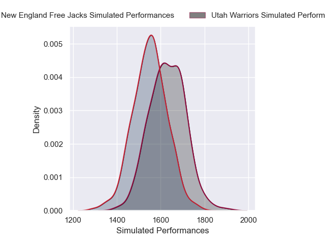
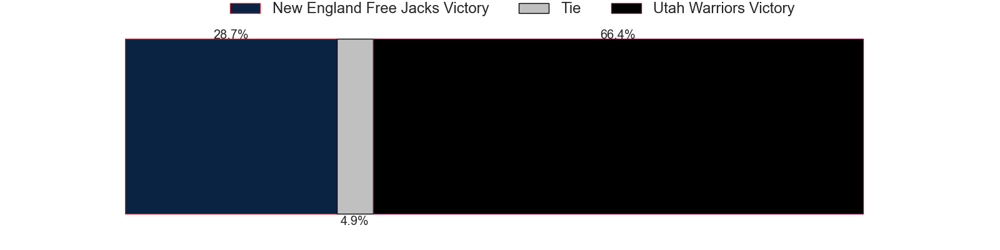
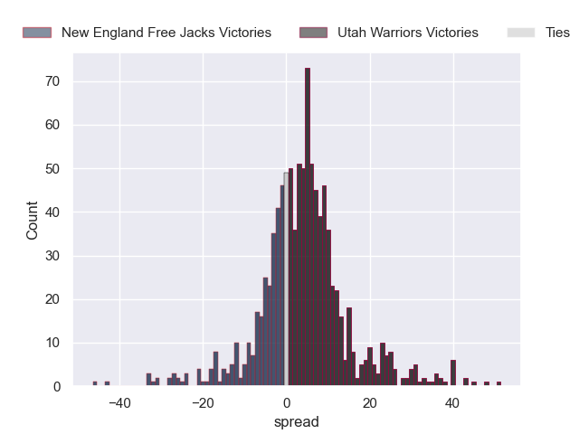

### Seattle Seawolves V Anthem RC on 2025/03/30

Average Margin: Seattle Seawolves by 21.0

Average Scoreline: 45-24

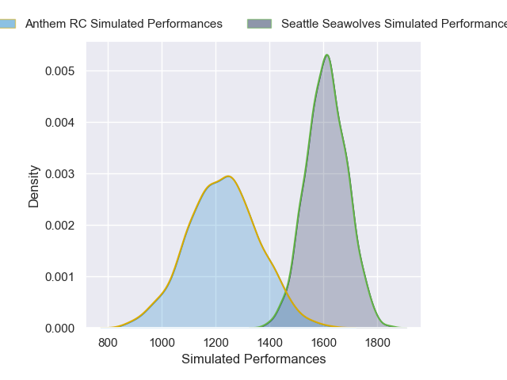
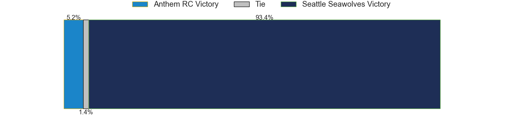
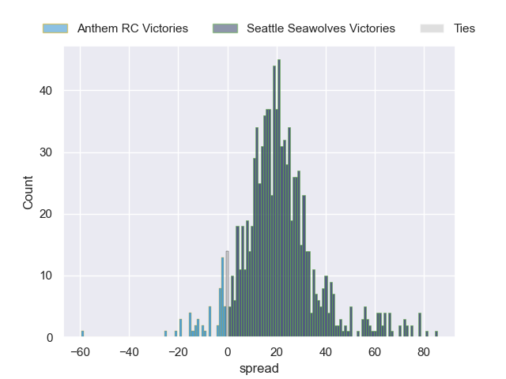

### RFC Los Angeles V Old Glory DC on 2025/03/30

Average Margin: RFC Los Angeles by 3.3

Average Scoreline: 25-21

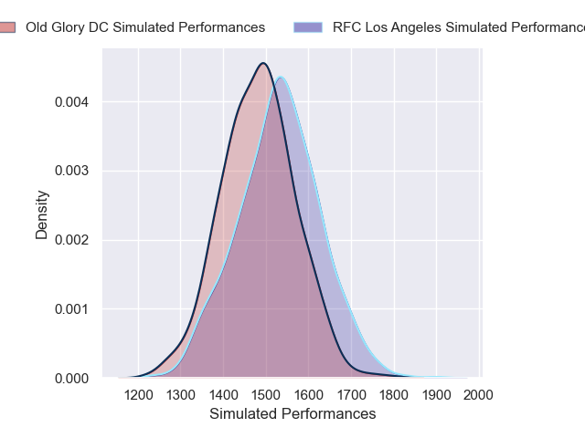

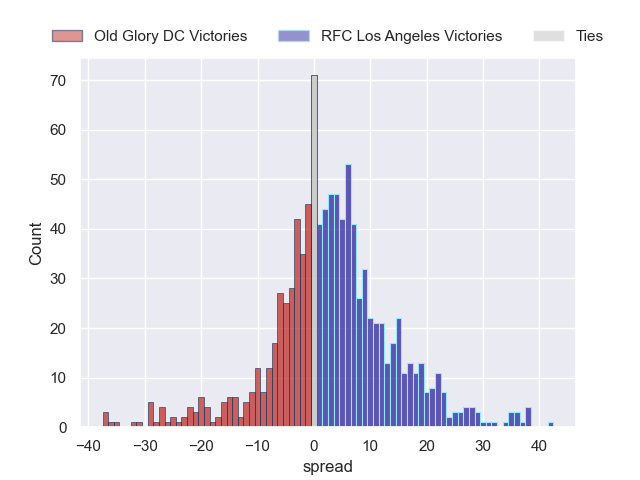

## Week 7

### San Diego Legion V Chicago Hounds on 2025/04/05

Average Margin: San Diego Legion by 5.0

Average Scoreline: 27-22

### Anthem RC V NOLA Gold on 2025/04/05

Average Margin: NOLA Gold by 8.7

Average Scoreline: 34-25

### Old Glory DC V Seattle Seawolves on 2025/04/05

Average Margin: Old Glory DC by 1.0

Average Scoreline: 27-26

### Houston SaberCats V RFC Los Angeles on 2025/04/05

Average Margin: Houston SaberCats by 10.9

Average Scoreline: 34-23

### New England Free Jacks V Miami Sharks on 2025/04/06

Average Margin: New England Free Jacks by 14.3

Average Scoreline: 33-19

## Week 8

### Miami Sharks V Houston SaberCats on 2025/04/12

Average Margin: Houston SaberCats by 11.6

Average Scoreline: 40-28

### NOLA Gold V Old Glory DC on 2025/04/12

Average Margin: NOLA Gold by 2.7

Average Scoreline: 28-26

### RFC Los Angeles V Utah Warriors on 2025/04/12

Average Margin: Utah Warriors by 2.3

Average Scoreline: 31-28

### New England Free Jacks V San Diego Legion on 2025/04/12

Average Margin: San Diego Legion by 0.9

Average Scoreline: 29-28

### Chicago Hounds V Anthem RC on 2025/04/13

Average Margin: Chicago Hounds by 22.9

Average Scoreline: 44-21

## Week 9

### Anthem RC V New England Free Jacks on 2025/04/18

Average Margin: New England Free Jacks by 13.3

Average Scoreline: 35-22

### Seattle Seawolves V Chicago Hounds on 2025/04/18

Average Margin: Chicago Hounds by 0.2

Average Scoreline: 27-27

### Old Glory DC V Miami Sharks on 2025/04/19

Average Margin: Old Glory DC by 11.5

Average Scoreline: 28-17

### San Diego Legion V Utah Warriors on 2025/04/19

Average Margin: San Diego Legion by 8.2

Average Scoreline: 26-18

### Houston SaberCats V NOLA Gold on 2025/04/19

Average Margin: Houston SaberCats by 11.1

Average Scoreline: 32-20

## Week 10

### New England Free Jacks V RFC Los Angeles on 2025/04/22

Average Margin: New England Free Jacks by 9.1

Average Scoreline: 33-24

### Anthem RC V Seattle Seawolves on 2025/04/23

Average Margin: Seattle Seawolves by 12.7

Average Scoreline: 35-22

### RFC Los Angeles V San Diego Legion on 2025/04/26

Average Margin: San Diego Legion by 6.1

Average Scoreline: 35-29

### Houston SaberCats V Old Glory DC on 2025/04/26

Average Margin: Houston SaberCats by 10.5

Average Scoreline: 33-23

### Utah Warriors V Chicago Hounds on 2025/04/26

Average Margin: Utah Warriors by 2.2

Average Scoreline: 27-25

### NOLA Gold V Seattle Seawolves on 2025/04/27

Average Margin: Seattle Seawolves by 0.7

Average Scoreline: 25-24

### Miami Sharks V Anthem RC on 2025/04/27

Average Margin: Miami Sharks by 10.1

Average Scoreline: 31-21

## Week 11

### Utah Warriors V San Diego Legion on 2025/04/30

Average Margin: San Diego Legion by 0.7

Average Scoreline: 25-24

### Seattle Seawolves V RFC Los Angeles on 2025/05/02

Average Margin: Seattle Seawolves by 7.6

Average Scoreline: 31-23

### Chicago Hounds V Miami Sharks on 2025/05/04

Average Margin: Chicago Hounds by 16.5

Average Scoreline: 36-20

### Old Glory DC V Utah Warriors on 2025/05/04

Average Margin: Utah Warriors by 1.3

Average Scoreline: 28-27

### San Diego Legion V NOLA Gold on 2025/05/04

Average Margin: San Diego Legion by 13.3

Average Scoreline: 34-21

### New England Free Jacks V Houston SaberCats on 2025/05/04

Average Margin: New England Free Jacks by 1.3

Average Scoreline: 30-28

## Week 12

### NOLA Gold V Miami Sharks on 2025/05/09

Average Margin: NOLA Gold by 8.6

Average Scoreline: 33-24

### New England Free Jacks V Chicago Hounds on 2025/05/10

Average Margin: New England Free Jacks by 1.4

Average Scoreline: 30-28

### RFC Los Angeles V Anthem RC on 2025/05/10

Average Margin: RFC Los Angeles by 14.0

Average Scoreline: 34-20

### San Diego Legion V Houston SaberCats on 2025/05/10

Average Margin: San Diego Legion by 6.3

Average Scoreline: 30-23

## Week 13

### Utah Warriors V Seattle Seawolves on 2025/05/12

Average Margin: Utah Warriors by 5.5

Average Scoreline: 27-21

### Old Glory DC V NOLA Gold on 2025/05/13

Average Margin: Old Glory DC by 4.6

Average Scoreline: 30-25

### Houston SaberCats V Utah Warriors on 2025/05/17

Average Margin: Houston SaberCats by 4.8

Average Scoreline: 27-22

### Seattle Seawolves V San Diego Legion on 2025/05/17

Average Margin: San Diego Legion by 1.4

Average Scoreline: 27-25

### Miami Sharks V New England Free Jacks on 2025/05/17

Average Margin: New England Free Jacks by 7.8

Average Scoreline: 35-27

### Chicago Hounds V RFC Los Angeles on 2025/05/18

Average Margin: Chicago Hounds by 10.4

Average Scoreline: 34-23

### Anthem RC V Old Glory DC on 2025/05/18

Average Margin: Old Glory DC by 8.5

Average Scoreline: 32-23

## Week 14

### RFC Los Angeles V Miami Sharks on 2025/05/23

Average Margin: RFC Los Angeles by 9.9

Average Scoreline: 28-18

### Seattle Seawolves V Houston SaberCats on 2025/05/23

Average Margin: Seattle Seawolves by 0.9

Average Scoreline: 29-28

### NOLA Gold V Utah Warriors on 2025/05/24

Average Margin: Utah Warriors by 2.8

Average Scoreline: 28-26

### Anthem RC V Chicago Hounds on 2025/05/24

Average Margin: Chicago Hounds by 14.7

Average Scoreline: 30-15

### New England Free Jacks V Old Glory DC on 2025/05/24

Average Margin: New England Free Jacks by 7.9

Average Scoreline: 30-22

## Week 15

### Utah Warriors V Anthem RC on 2025/05/31

Average Margin: Utah Warriors by 20.6

Average Scoreline: 42-22

### Miami Sharks V San Diego Legion on 2025/05/31

Average Margin: San Diego Legion by 11.7

Average Scoreline: 39-27

### Chicago Hounds V NOLA Gold on 2025/05/31

Average Margin: Chicago Hounds by 12.3

Average Scoreline: 32-20

### Old Glory DC V RFC Los Angeles on 2025/05/31

Average Margin: Old Glory DC by 5.4

Average Scoreline: 33-27

### New England Free Jacks V Seattle Seawolves on 2025/06/01

Average Margin: New England Free Jacks by 4.5

Average Scoreline: 30-25

## Week 16

### Chicago Hounds V Houston SaberCats on 2025/06/04

Average Margin: Chicago Hounds by 4.2

Average Scoreline: 26-22

### NOLA Gold V New England Free Jacks on 2025/06/07

Average Margin: New England Free Jacks by 1.7

Average Scoreline: 28-26

### San Diego Legion V Old Glory DC on 2025/06/07

Average Margin: San Diego Legion by 11.9

Average Scoreline: 33-21

### Utah Warriors V RFC Los Angeles on 2025/06/07

Average Margin: Utah Warriors by 9.2

Average Scoreline: 31-21

### Seattle Seawolves V Miami Sharks on 2025/06/08

Average Margin: Seattle Seawolves by 13.5

Average Scoreline: 31-18

### Houston SaberCats V Anthem RC on 2025/06/08

Average Margin: Houston SaberCats by 19.7

Average Scoreline: 44-24

