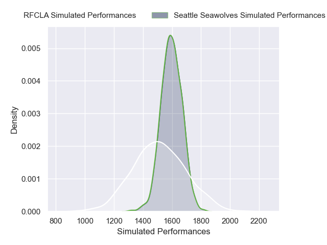
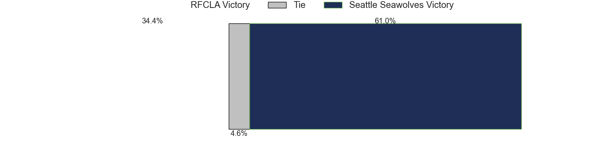
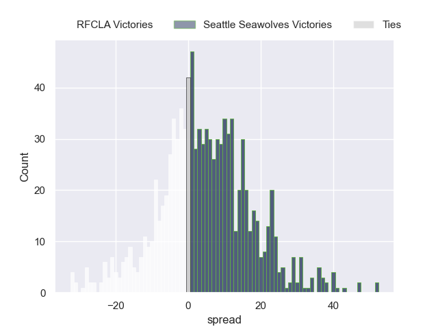

---  
title: "Major League Rugby 2025 Status"  
date: 2025-04-28 6:00:00 -0500  
categories: model review projection  
layout: article  
aside:  
    toc: true  
---
# Current Team Rankings

# Standings

## Current Standings

| Club                   |   Played |   Wins |   Point Differential |   Losing Bonus Points |   Try Bonus Points |   Competition Points |
|:-----------------------|---------:|-------:|---------------------:|----------------------:|-------------------:|---------------------:|
| Utah Warriors          |       10 |      8 |                   98 |                     1 |                nan |                   39 |
| New England Free Jacks |       11 |      8 |                   60 |                     1 |                nan |                   39 |
| Houston SaberCats      |       12 |      7 |                   68 |                     3 |                nan |                   37 |
| San Diego Legion       |       11 |      7 |                   41 |                     1 |                nan |                   34 |
| Chicago Hounds         |       10 |      7 |                   36 |                     1 |                nan |                   34 |
| Miami Sharks           |       10 |      6 |                  -22 |                     0 |                nan |                   28 |
| NOLA Gold              |       11 |      4 |                   11 |                     5 |                nan |                   25 |
| Seattle Seawolves      |       10 |      4 |                    7 |                     3 |                nan |                   22 |
| RFC Los Angeles        |       10 |      4 |                  -28 |                     3 |                nan |                   21 |
| Old Glory DC           |       10 |      3 |                  -61 |                     2 |                nan |                   20 |
| RFCLA                  |        4 |      1 |                  -19 |                     2 |                nan |                    6 |
| Anthem RC              |       11 |      0 |                 -191 |                     3 |                nan |                    3 |

## Projected Remaining Table

| Club                   |   Matches Remaining |   Wins |   Point Differential |   Losing Bonus Points |   Try Bonus Points |   Competition Points |
|:-----------------------|--------------------:|-------:|---------------------:|----------------------:|-------------------:|---------------------:|
| Utah Warriors          |                   7 |    5.7 |             71.7952  |                   0.9 |                3.6 |                 27.1 |
| Chicago Hounds         |                   6 |    4.6 |             52.2748  |                   0.8 |                3.2 |                 22.5 |
| New England Free Jacks |                   6 |    4.5 |             38.1665  |                   1   |                2.3 |                 21.3 |
| Seattle Seawolves      |                   7 |    3.8 |              6.35868 |                   1.5 |                1.9 |                 18.7 |
| San Diego Legion       |                   6 |    3.4 |              9.25662 |                   1.4 |                1.9 |                 16.8 |
| NOLA Gold              |                   6 |    2.7 |             -3.06839 |                   1.8 |                1.7 |                 14.4 |
| RFC Los Angeles        |                   6 |    2.6 |             -4.07556 |                   1.3 |                2   |                 13.8 |
| Houston SaberCats      |                   6 |    2.4 |             -1.34164 |                   1.8 |                2.3 |                 13.7 |
| Old Glory DC           |                   6 |    2.2 |            -23.7757  |                   1.5 |                1.8 |                 12   |
| Miami Sharks           |                   6 |    1.3 |            -45.7236  |                   1.8 |                1   |                  7.8 |
| Anthem RC              |                   5 |    0.4 |            -95.2893  |                   0.6 |                0.8 |                  2.9 |
| RFCLA                  |                   1 |    0.4 |             -4.5777  |                   0.2 |                0.1 |                  1.8 |

## Projected Total Table

| Club                   |   Total Matches |   Wins |   Point Differential |   Losing Bonus Points |   Try Bonus Points |   Competition Points |
|:-----------------------|----------------:|-------:|---------------------:|----------------------:|-------------------:|---------------------:|
| Utah Warriors          |              17 |   13.7 |            169.795   |                   1.9 |                3.6 |                 66.1 |
| New England Free Jacks |              17 |   12.5 |             98.1665  |                   2   |                2.3 |                 60.3 |
| Chicago Hounds         |              16 |   11.6 |             88.2748  |                   1.8 |                3.2 |                 56.5 |
| San Diego Legion       |              17 |   10.4 |             50.2566  |                   2.4 |                1.9 |                 50.8 |
| Houston SaberCats      |              18 |    9.4 |             66.6584  |                   4.8 |                2.3 |                 50.7 |
| Seattle Seawolves      |              17 |    7.8 |             13.3587  |                   4.5 |                1.9 |                 40.7 |
| NOLA Gold              |              17 |    6.7 |              7.93161 |                   6.8 |                1.7 |                 39.4 |
| Miami Sharks           |              16 |    7.3 |            -67.7236  |                   1.8 |                1   |                 35.8 |
| RFC Los Angeles        |              16 |    6.6 |            -32.0756  |                   4.3 |                2   |                 34.8 |
| Old Glory DC           |              16 |    5.2 |            -84.7757  |                   3.5 |                1.8 |                 32   |
| RFCLA                  |               5 |    1.4 |            -23.5777  |                   2.2 |                0.1 |                  7.8 |
| Anthem RC              |              16 |    0.4 |           -286.289   |                   3.6 |                0.8 |                  5.9 |

# Completed Match Review

| Model | Percent Correct Predictions | Spread Error |
| ------ | ------ | ------ |
| Club Level | 65.0% | 12.9 |
| Player Level: Lineup | 64.3% | 11.7 |
| Player Level: Minutes | 64.3% | 11.1 |

# Future Predictions

## Week 13

### Utah Warriors V San Diego Legion on 2025/04/30

Average Margin: Utah Warriors by 9.3

Average Scoreline: 34-25

### Seattle Seawolves V RFC Los Angeles on 2025/05/02

Average Margin: Seattle Seawolves by 6.2

Average Scoreline: 29-23

### Seattle Seawolves V RFCLA on 2025/05/02

Average Margin: Seattle Seawolves by 4.6

Average Scoreline: 25-20

### Old Glory DC V Utah Warriors on 2025/05/04

Average Margin: Utah Warriors by 8.7

Average Scoreline: 37-28

### San Diego Legion V NOLA Gold on 2025/05/04

Average Margin: San Diego Legion by 4.1

Average Scoreline: 26-22

### New England Free Jacks V Houston SaberCats on 2025/05/04

Average Margin: New England Free Jacks by 7.4

Average Scoreline: 29-21

### Chicago Hounds V Miami Sharks on 2025/05/04

Average Margin: Chicago Hounds by 12.5

Average Scoreline: 25-12

## Week 14

### NOLA Gold V Miami Sharks on 2025/05/09

Average Margin: NOLA Gold by 9.3

Average Scoreline: 28-18

### RFC Los Angeles V Anthem RC on 2025/05/10

Average Margin: RFC Los Angeles by 18.9

Average Scoreline: 34-15

### New England Free Jacks V Chicago Hounds on 2025/05/10

Average Margin: New England Free Jacks by 4.0

Average Scoreline: 35-31

### San Diego Legion V Houston SaberCats on 2025/05/10

Average Margin: San Diego Legion by 4.0

Average Scoreline: 30-26

## Week 15

### Utah Warriors V Seattle Seawolves on 2025/05/12

Average Margin: Utah Warriors by 10.3

Average Scoreline: 30-19

### Old Glory DC V NOLA Gold on 2025/05/13

Average Margin: NOLA Gold by 2.5

Average Scoreline: 31-28

### Houston SaberCats V Utah Warriors on 2025/05/17

Average Margin: Utah Warriors by 1.9

Average Scoreline: 28-26

### Miami Sharks V New England Free Jacks on 2025/05/17

Average Margin: New England Free Jacks by 5.6

Average Scoreline: 34-28

### Seattle Seawolves V San Diego Legion on 2025/05/17

Average Margin: Seattle Seawolves by 2.8

Average Scoreline: 32-29

### Anthem RC V Old Glory DC on 2025/05/18

Average Margin: Old Glory DC by 9.6

Average Scoreline: 35-26

### Chicago Hounds V RFC Los Angeles on 2025/05/18

Average Margin: Chicago Hounds by 10.4

Average Scoreline: 21-11

## Week 16

### Seattle Seawolves V Houston SaberCats on 2025/05/23

Average Margin: Seattle Seawolves by 2.7

Average Scoreline: 32-30

### RFC Los Angeles V Miami Sharks on 2025/05/23

Average Margin: RFC Los Angeles by 6.7

Average Scoreline: 29-22

### NOLA Gold V Utah Warriors on 2025/05/24

Average Margin: Utah Warriors by 2.8

Average Scoreline: 29-27

### New England Free Jacks V Old Glory DC on 2025/05/24

Average Margin: New England Free Jacks by 13.1

Average Scoreline: 31-18

### Anthem RC V Chicago Hounds on 2025/05/24

Average Margin: Chicago Hounds by 18.4

Average Scoreline: 41-23

## Week 17

### Miami Sharks V San Diego Legion on 2025/05/31

Average Margin: San Diego Legion by 3.0

Average Scoreline: 32-29

### Old Glory DC V RFC Los Angeles on 2025/05/31

Average Margin: Old Glory DC by 1.2

Average Scoreline: 27-26

### Utah Warriors V Anthem RC on 2025/05/31

Average Margin: Utah Warriors by 27.0

Average Scoreline: 41-14

### Chicago Hounds V NOLA Gold on 2025/05/31

Average Margin: Chicago Hounds by 8.2

Average Scoreline: 25-17

### New England Free Jacks V Seattle Seawolves on 2025/06/01

Average Margin: New England Free Jacks by 8.2

Average Scoreline: 34-26

## Week 18

### Chicago Hounds V Houston SaberCats on 2025/06/04

Average Margin: Chicago Hounds by 6.8

Average Scoreline: 28-21

### San Diego Legion V Old Glory DC on 2025/06/07

Average Margin: San Diego Legion by 10.3

Average Scoreline: 30-20

### NOLA Gold V New England Free Jacks on 2025/06/07

Average Margin: NOLA Gold by 0.2

Average Scoreline: 29-29

### Utah Warriors V RFC Los Angeles on 2025/06/07

Average Margin: Utah Warriors by 11.9

Average Scoreline: 31-19

### Houston SaberCats V Anthem RC on 2025/06/08

Average Margin: Houston SaberCats by 21.4

Average Scoreline: 40-19

### Seattle Seawolves V Miami Sharks on 2025/06/08

Average Margin: Seattle Seawolves by 8.6

Average Scoreline: 31-22

