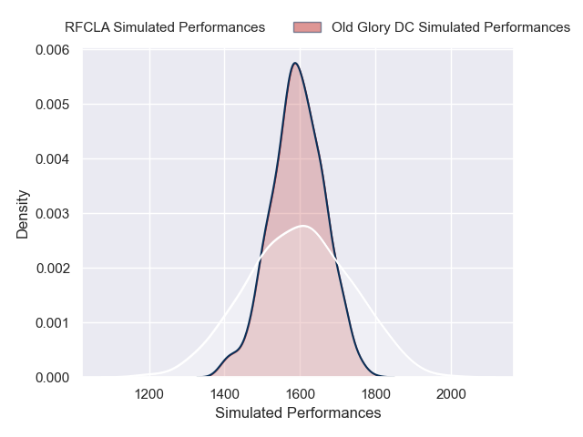
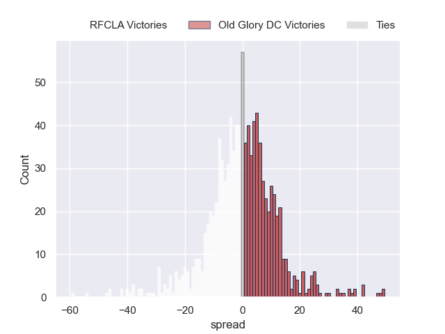
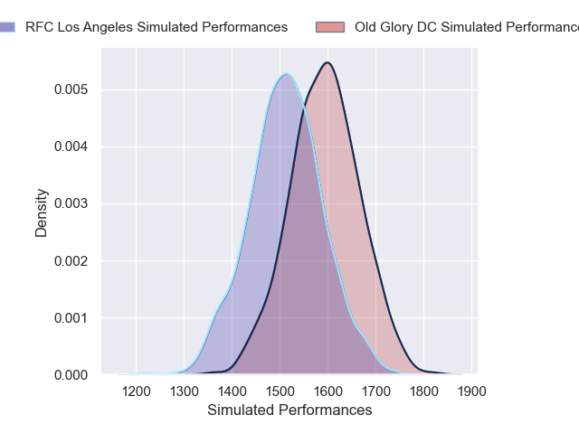
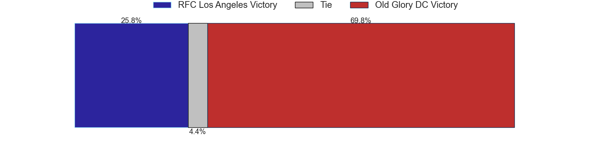
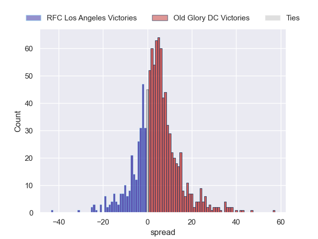
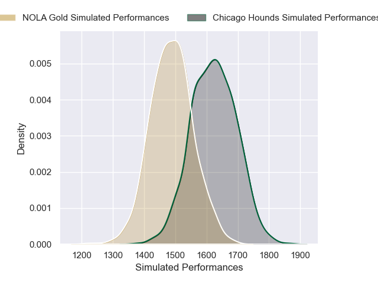
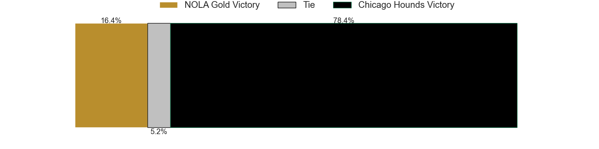
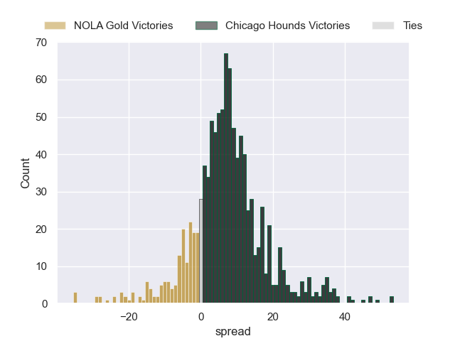

---  
title: "Major League Rugby 2025 Status"  
date: 2025-05-30 6:00:00 -0500  
categories: model review projection  
layout: article  
aside:  
    toc: true  
---
# Current Team Rankings

# Standings

## Current Standings

| Club                   |   Played |   Wins |   Point Differential |   Losing Bonus Points |   Try Bonus Points |   Competition Points |
|:-----------------------|---------:|-------:|---------------------:|----------------------:|-------------------:|---------------------:|
| Utah Warriors          |       15 |     10 |                   67 |                     2 |                nan |                   52 |
| Houston SaberCats      |       16 |      9 |                   82 |                     4 |                nan |                   49 |
| New England Free Jacks |       15 |     10 |                   75 |                     2 |                nan |                   49 |
| Chicago Hounds         |       15 |      9 |                   43 |                     3 |                nan |                   46 |
| San Diego Legion       |       15 |      8 |                   20 |                     3 |                nan |                   45 |
| Seattle Seawolves      |       15 |      8 |                   20 |                     3 |                nan |                   43 |
| RFC Los Angeles        |       14 |      7 |                    8 |                     3 |                nan |                   40 |
| Miami Sharks           |       15 |      8 |                  -26 |                     3 |                nan |                   40 |
| Old Glory DC           |       13 |      7 |                   14 |                     2 |                nan |                   38 |
| NOLA Gold              |       15 |      4 |                  -18 |                     8 |                nan |                   31 |
| RFCLA                  |        8 |      4 |                   17 |                     2 |                nan |                   20 |
| Anthem RC              |       16 |      0 |                 -302 |                     3 |                nan |                    3 |

## Projected Remaining Table

| Club                   |   Matches Remaining |   Wins |   Point Differential |   Losing Bonus Points |   Try Bonus Points |   Competition Points |
|:-----------------------|--------------------:|-------:|---------------------:|----------------------:|-------------------:|---------------------:|
| Utah Warriors          |                   2 |    1.7 |            30.321    |                   0.2 |                1.3 |                  8.4 |
| Old Glory DC           |                   3 |    1.5 |            -0.268241 |                   0.8 |                0.9 |                  7.8 |
| Chicago Hounds         |                   2 |    1.5 |            10.605    |                   0.3 |                0.6 |                  6.9 |
| Houston SaberCats      |                   2 |    1.3 |            21.1878   |                   0.4 |                1.3 |                  6.8 |
| New England Free Jacks |                   2 |    1.4 |             9.14005  |                   0.4 |                0.7 |                  6.8 |
| San Diego Legion       |                   2 |    1.1 |             2.18006  |                   0.6 |                0.6 |                  5.5 |
| Seattle Seawolves      |                   2 |    1   |            -1.18923  |                   0.5 |                0.5 |                  4.8 |
| Miami Sharks           |                   2 |    0.8 |            -4.03081  |                   0.6 |                0.3 |                  4.2 |
| RFC Los Angeles        |                   2 |    0.5 |           -10.6937   |                   0.7 |                1.1 |                  3.9 |
| NOLA Gold              |                   2 |    0.6 |            -9.38052  |                   0.7 |                0.5 |                  3.5 |
| RFCLA                  |                   1 |    0.5 |             0.426309 |                   0.3 |                0.2 |                  2.5 |
| Anthem RC              |                   2 |    0.1 |           -48.2976   |                   0.1 |                0.3 |                  0.9 |

## Projected Total Table

| Club                   |   Total Matches |   Wins |   Point Differential |   Losing Bonus Points |   Try Bonus Points |   Competition Points |
|:-----------------------|----------------:|-------:|---------------------:|----------------------:|-------------------:|---------------------:|
| Utah Warriors          |              17 |   11.7 |             97.321   |                   2.2 |                1.3 |                 60.4 |
| Houston SaberCats      |              18 |   10.3 |            103.188   |                   4.4 |                1.3 |                 55.8 |
| New England Free Jacks |              17 |   11.4 |             84.14    |                   2.4 |                0.7 |                 55.8 |
| Chicago Hounds         |              17 |   10.5 |             53.605   |                   3.3 |                0.6 |                 52.9 |
| San Diego Legion       |              17 |    9.1 |             22.1801  |                   3.6 |                0.6 |                 50.5 |
| Seattle Seawolves      |              17 |    9   |             18.8108  |                   3.5 |                0.5 |                 47.8 |
| Old Glory DC           |              16 |    8.5 |             13.7318  |                   2.8 |                0.9 |                 45.8 |
| Miami Sharks           |              17 |    8.8 |            -30.0308  |                   3.6 |                0.3 |                 44.2 |
| RFC Los Angeles        |              16 |    7.5 |             -2.69371 |                   3.7 |                1.1 |                 43.9 |
| NOLA Gold              |              17 |    4.6 |            -27.3805  |                   8.7 |                0.5 |                 34.5 |
| RFCLA                  |               9 |    4.5 |             17.4263  |                   2.3 |                0.2 |                 22.5 |
| Anthem RC              |              18 |    0.1 |           -350.298   |                   3.1 |                0.3 |                  3.9 |

# Completed Match Review

| Model | Percent Correct Predictions | Spread Error |
| ------ | ------ | ------ |
| Club Level | 62.8% | 11.5 |
| Player Level: Lineup | 62.5% | 12.4 |
| Player Level: Minutes | 62.5% | 12.6 |

# Future Predictions

## Week 17

### Utah Warriors V Anthem RC on 2025/05/31

Average Margin: Utah Warriors by 24.0

Average Scoreline: 42-18

### Miami Sharks V San Diego Legion on 2025/05/31

Average Margin: Miami Sharks by 2.1

Average Scoreline: 26-24

### Old Glory DC V RFCLA on 2025/05/31

Average Margin: RFCLA by 0.4

Average Scoreline: 26-26

### Old Glory DC V RFC Los Angeles on 2025/06/01

Average Margin: Old Glory DC by 4.4

Average Scoreline: 33-29

### Chicago Hounds V NOLA Gold on 2025/06/01

Average Margin: Chicago Hounds by 7.5

Average Scoreline: 30-22

### New England Free Jacks V Seattle Seawolves on 2025/06/01

Average Margin: New England Free Jacks by 7.3

Average Scoreline: 27-20

## Week 18

### Chicago Hounds V Houston SaberCats on 2025/06/04

Average Margin: Chicago Hounds by 3.1

Average Scoreline: 28-25

### NOLA Gold V New England Free Jacks on 2025/06/07

Average Margin: New England Free Jacks by 1.9

Average Scoreline: 27-25

### Utah Warriors V RFC Los Angeles on 2025/06/07

Average Margin: Utah Warriors by 6.3

Average Scoreline: 34-27

### San Diego Legion V Old Glory DC on 2025/06/07

Average Margin: San Diego Legion by 4.2

Average Scoreline: 30-25

### Seattle Seawolves V Miami Sharks on 2025/06/08

Average Margin: Seattle Seawolves by 6.1

Average Scoreline: 27-21

### Houston SaberCats V Anthem RC on 2025/06/08

Average Margin: Houston SaberCats by 24.3

Average Scoreline: 43-19

