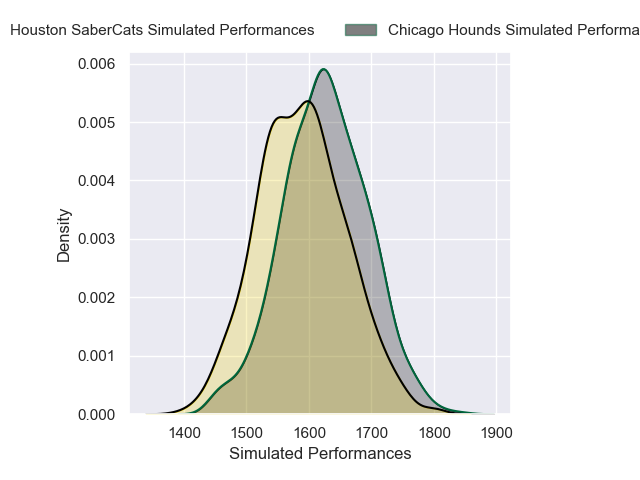
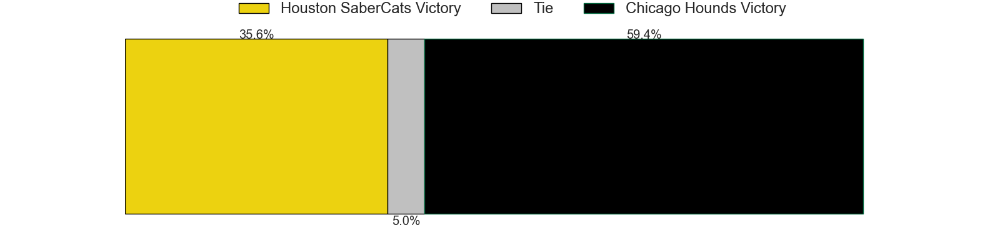
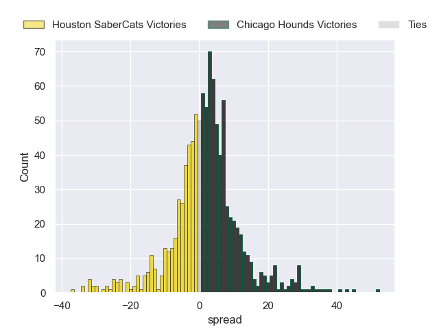

---  
title: "Major League Rugby 2025 Status"  
date: 2025-06-02 6:00:00 -0500  
categories: model review projection  
layout: article  
aside:  
    toc: true  
---
# Current Team Rankings

# Standings

## Current Standings

| Club                   |   Played |   Wins |   Point Differential |   Losing Bonus Points |   Try Bonus Points |   Competition Points |
|:-----------------------|---------:|-------:|---------------------:|----------------------:|-------------------:|---------------------:|
| Utah Warriors          |       16 |     11 |                   88 |                     2 |                nan |                   57 |
| New England Free Jacks |       16 |     11 |                   82 |                     2 |                nan |                   53 |
| Chicago Hounds         |       16 |     10 |                   64 |                     3 |                nan |                   50 |
| Houston SaberCats      |       16 |      9 |                  111 |                     4 |                nan |                   49 |
| San Diego Legion       |       16 |      8 |                   16 |                     4 |                nan |                   47 |
| RFC Los Angeles        |       15 |      8 |                   19 |                     3 |                nan |                   44 |
| Miami Sharks           |       16 |      9 |                  -22 |                     3 |                nan |                   44 |
| Seattle Seawolves      |       16 |      8 |                  -16 |                     3 |                nan |                   43 |
| Old Glory DC           |       15 |      7 |                   -8 |                     2 |                nan |                   38 |
| NOLA Gold              |       16 |      4 |                  -39 |                     8 |                nan |                   31 |
| RFCLA                  |        9 |      5 |                   28 |                     2 |                nan |                   24 |
| Anthem RC              |       17 |      0 |                 -323 |                     3 |                nan |                    3 |

## Projected Remaining Table

| Club                   |   Matches Remaining |   Wins |   Point Differential |   Losing Bonus Points |   Try Bonus Points |   Competition Points |
|:-----------------------|--------------------:|-------:|---------------------:|----------------------:|-------------------:|---------------------:|
| Houston SaberCats      |                   2 |    1.3 |            24.3315   |                   0.4 |                1.2 |                  7   |
| Utah Warriors          |                   2 |    1.2 |             4.54206  |                   0.5 |                0.6 |                  5.9 |
| San Diego Legion       |                   1 |    0.8 |             5.72087  |                   0.2 |                0.3 |                  3.5 |
| Seattle Seawolves      |                   1 |    0.7 |             4.82566  |                   0.2 |                0.2 |                  3.3 |
| New England Free Jacks |                   1 |    0.6 |             2.56564  |                   0.2 |                0.5 |                  3.2 |
| Chicago Hounds         |                   1 |    0.6 |             2.11981  |                   0.3 |                0.3 |                  3   |
| RFCLA                  |                   1 |    0.5 |             0.280546 |                   0.3 |                0.3 |                  2.7 |
| NOLA Gold              |                   1 |    0.4 |            -2.56564  |                   0.4 |                0.2 |                  2.1 |
| RFC Los Angeles        |                   1 |    0.3 |            -4.82261  |                   0.4 |                0.5 |                  2   |
| Old Glory DC           |                   1 |    0.2 |            -5.72087  |                   0.4 |                0.4 |                  1.8 |
| Miami Sharks           |                   1 |    0.3 |            -4.82566  |                   0.4 |                0.2 |                  1.7 |
| Anthem RC              |                   1 |    0   |           -26.4513   |                   0   |                0.2 |                  0.4 |

## Projected Total Table

| Club                   |   Total Matches |   Wins |   Point Differential |   Losing Bonus Points |   Try Bonus Points |   Competition Points |
|:-----------------------|----------------:|-------:|---------------------:|----------------------:|-------------------:|---------------------:|
| Utah Warriors          |              18 |   12.2 |              92.5421 |                   2.5 |                0.6 |                 62.9 |
| New England Free Jacks |              17 |   11.6 |              84.5656 |                   2.2 |                0.5 |                 56.2 |
| Houston SaberCats      |              18 |   10.3 |             135.331  |                   4.4 |                1.2 |                 56   |
| Chicago Hounds         |              17 |   10.6 |              66.1198 |                   3.3 |                0.3 |                 53   |
| San Diego Legion       |              17 |    8.8 |              21.7209 |                   4.2 |                0.3 |                 50.5 |
| Seattle Seawolves      |              17 |    8.7 |             -11.1743 |                   3.2 |                0.2 |                 46.3 |
| RFC Los Angeles        |              16 |    8.3 |              14.1774 |                   3.4 |                0.5 |                 46   |
| Miami Sharks           |              17 |    9.3 |             -26.8257 |                   3.4 |                0.2 |                 45.7 |
| Old Glory DC           |              16 |    7.2 |             -13.7209 |                   2.4 |                0.4 |                 39.8 |
| NOLA Gold              |              17 |    4.4 |             -41.5656 |                   8.4 |                0.2 |                 33.1 |
| RFCLA                  |              10 |    5.5 |              28.2805 |                   2.3 |                0.3 |                 26.7 |
| Anthem RC              |              18 |    0   |            -349.451  |                   3   |                0.2 |                  3.4 |

# Completed Match Review

| Model | Percent Correct Predictions | Spread Error |
| ------ | ------ | ------ |
| Club Level | 65.2% | 11.7 |
| Player Level: Lineup | 68.2% | 10.7 |
| Player Level: Minutes | 77.3% | 9.7 |

# Future Predictions

## Week 18

### Chicago Hounds V Houston SaberCats on 2025/06/05

Average Margin: Chicago Hounds by 2.1

Average Scoreline: 30-27

### Utah Warriors V RFCLA on 2025/06/07

Average Margin: RFCLA by 0.3

Average Scoreline: 22-22

### NOLA Gold V New England Free Jacks on 2025/06/08

Average Margin: New England Free Jacks by 2.6

Average Scoreline: 37-34

### San Diego Legion V Old Glory DC on 2025/06/08

Average Margin: San Diego Legion by 5.7

Average Scoreline: 42-37

### Utah Warriors V RFC Los Angeles on 2025/06/08

Average Margin: Utah Warriors by 4.8

Average Scoreline: 32-27

## Week 19

### Seattle Seawolves V Miami Sharks on 2025/06/09

Average Margin: Seattle Seawolves by 4.8

Average Scoreline: 28-24

### Houston SaberCats V Anthem RC on 2025/06/09

Average Margin: Houston SaberCats by 26.5

Average Scoreline: 47-21

