---  
title: "Major League Rugby 2025 Status"  
date: 2025-04-21 6:00:00 -0500  
categories: model review projection  
layout: article  
aside:  
    toc: true  
---
# Current Team Rankings

# Standings

## Current Standings

| Club                   |   Played |   Wins |   Point Differential |   Losing Bonus Points |   Try Bonus Points |   Competition Points |
|:-----------------------|---------:|-------:|---------------------:|----------------------:|-------------------:|---------------------:|
| Utah Warriors          |        9 |      7 |                   88 |                     1 |                nan |                   34 |
| Chicago Hounds         |        9 |      7 |                   46 |                     1 |                nan |                   34 |
| Houston SaberCats      |       10 |      6 |                   47 |                     3 |                nan |                   31 |
| New England Free Jacks |        9 |      6 |                   56 |                     1 |                nan |                   30 |
| San Diego Legion       |        9 |      5 |                   37 |                     1 |                nan |                   26 |
| NOLA Gold              |        9 |      3 |                    3 |                     5 |                nan |                   19 |
| RFC Los Angeles        |        8 |      4 |                  -24 |                     1 |                nan |                   19 |
| Seattle Seawolves      |        8 |      3 |                  -26 |                     3 |                nan |                   18 |
| Miami Sharks           |        8 |      4 |                  -69 |                     0 |                nan |                   18 |
| Old Glory DC           |        8 |      3 |                  -19 |                     2 |                nan |                   17 |
| RFCLA                  |        2 |      1 |                  -15 |                     0 |                nan |                    4 |
| Anthem RC              |        9 |      0 |                 -124 |                     3 |                nan |                    3 |

## Projected Remaining Table

| Club                   |   Matches Remaining |   Wins |   Point Differential |   Losing Bonus Points |   Try Bonus Points |   Competition Points |
|:-----------------------|--------------------:|-------:|---------------------:|----------------------:|-------------------:|---------------------:|
| New England Free Jacks |                   8 |    6.5 |             71.5548  |                   0.9 |                3.9 |                 30.9 |
| Utah Warriors          |                   8 |    6.2 |             67.5697  |                   1.1 |                3.9 |                 30   |
| San Diego Legion       |                   8 |    4.8 |             19.0158  |                   1.8 |                3.3 |                 24.1 |
| Chicago Hounds         |                   7 |    4.9 |             44.8194  |                   1.1 |                3.2 |                 24   |
| Seattle Seawolves      |                   8 |    4.4 |              9.99263 |                   1.8 |                2.9 |                 22.1 |
| RFC Los Angeles        |                   8 |    3.2 |            -17.7623  |                   1.9 |                4.1 |                 18.8 |
| Houston SaberCats      |                   7 |    3.3 |              5.73576 |                   1.9 |                3.3 |                 18.4 |
| NOLA Gold              |                   7 |    3   |            -10.6032  |                   2   |                1.9 |                 15.9 |
| Old Glory DC           |                   7 |    2.5 |            -28.7628  |                   1.9 |                2.2 |                 13.9 |
| Miami Sharks           |                   7 |    1.9 |            -43.2694  |                   1.8 |                1.7 |                 10.9 |
| Anthem RC              |                   7 |    0.8 |           -100.404   |                   1.2 |                1.3 |                  5.8 |
| RFCLA                  |                   2 |    0.5 |            -17.8865  |                   0.4 |                0.2 |                  2.8 |

## Projected Total Table

| Club                   |   Total Matches |   Wins |   Point Differential |   Losing Bonus Points |   Try Bonus Points |   Competition Points |
|:-----------------------|----------------:|-------:|---------------------:|----------------------:|-------------------:|---------------------:|
| Utah Warriors          |              17 |   13.2 |            155.57    |                   2.1 |                3.9 |                 64   |
| New England Free Jacks |              17 |   12.5 |            127.555   |                   1.9 |                3.9 |                 60.9 |
| Chicago Hounds         |              16 |   11.9 |             90.8194  |                   2.1 |                3.2 |                 58   |
| San Diego Legion       |              17 |    9.8 |             56.0158  |                   2.8 |                3.3 |                 50.1 |
| Houston SaberCats      |              17 |    9.3 |             52.7358  |                   4.9 |                3.3 |                 49.4 |
| Seattle Seawolves      |              16 |    7.4 |            -16.0074  |                   4.8 |                2.9 |                 40.1 |
| RFC Los Angeles        |              16 |    7.2 |            -41.7623  |                   2.9 |                4.1 |                 37.8 |
| NOLA Gold              |              16 |    6   |             -7.60322 |                   7   |                1.9 |                 34.9 |
| Old Glory DC           |              15 |    5.5 |            -47.7628  |                   3.9 |                2.2 |                 30.9 |
| Miami Sharks           |              15 |    5.9 |           -112.269   |                   1.8 |                1.7 |                 28.9 |
| Anthem RC              |              16 |    0.8 |           -224.404   |                   4.2 |                1.3 |                  8.8 |
| RFCLA                  |               4 |    1.5 |            -32.8865  |                   0.4 |                0.2 |                  6.8 |

# Completed Match Review

| Model | Percent Correct Predictions | Spread Error |
| ------ | ------ | ------ |
| Club Level | 63.3% | 13.4 |
| Player Level: Lineup | 68.8% | 12.4 |
| Player Level: Minutes | 62.5% | 12.4 |

# Future Predictions

## Week 11

### New England Free Jacks V RFCLA on 2025/04/22

Average Margin: New England Free Jacks by 15.0

Average Scoreline: 32-17

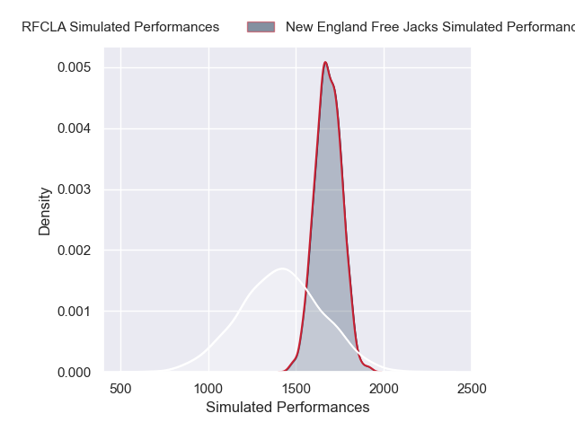
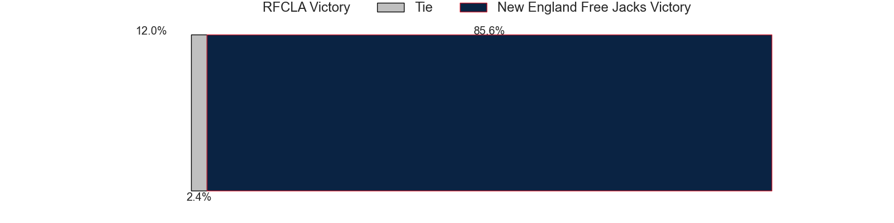
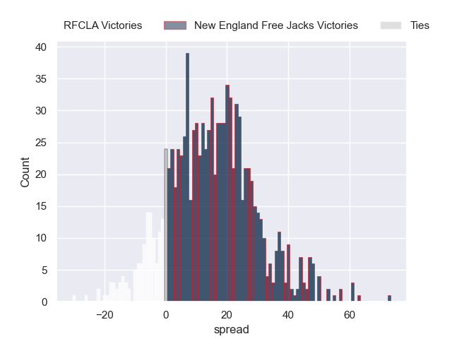

### New England Free Jacks V RFC Los Angeles on 2025/04/23

Average Margin: New England Free Jacks by 11.2

Average Scoreline: 33-22

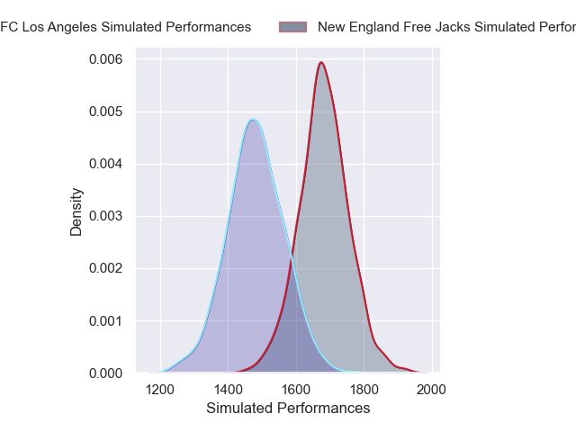
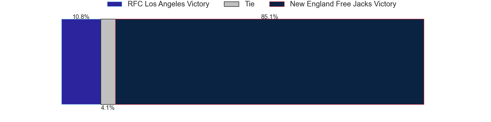
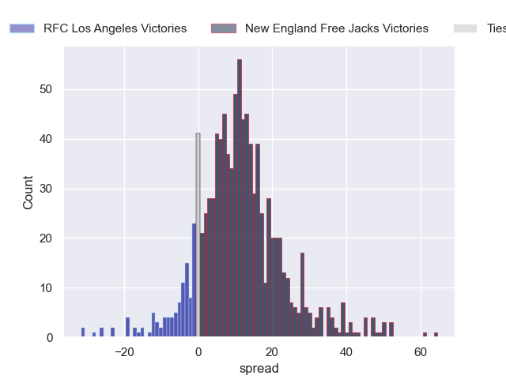

### Anthem RC V Seattle Seawolves on 2025/04/24

Average Margin: Seattle Seawolves by 11.3

Average Scoreline: 37-25

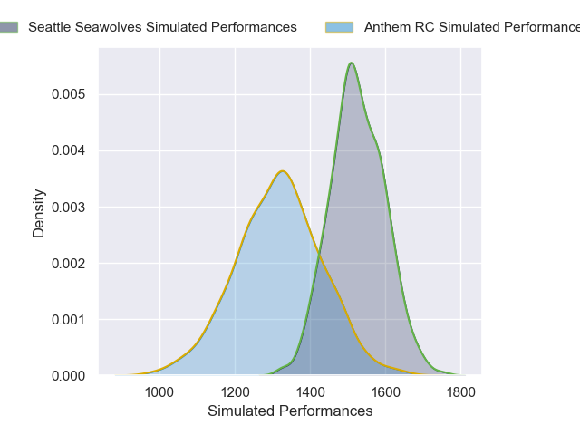
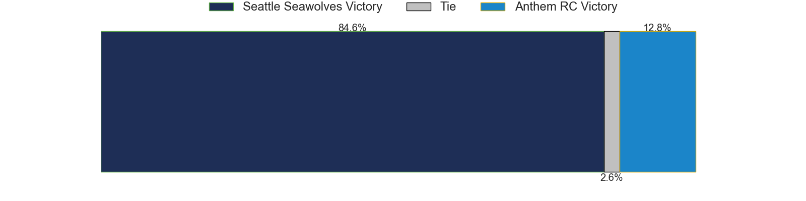
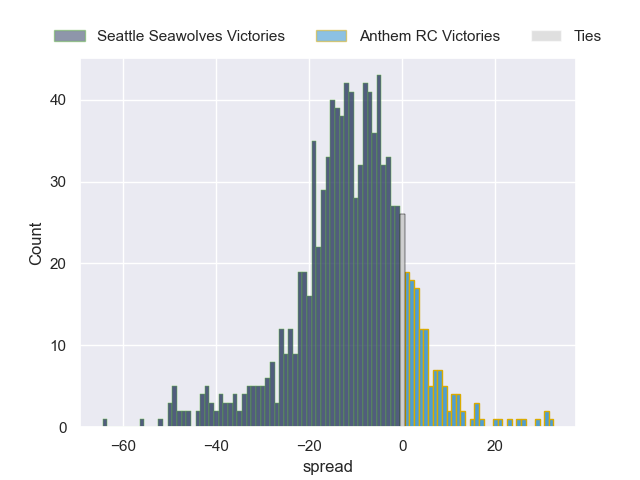

### NOLA Gold V Seattle Seawolves on 2025/04/27

Average Margin: NOLA Gold by 2.7

Average Scoreline: 27-25

### Houston SaberCats V Old Glory DC on 2025/04/27

Average Margin: Houston SaberCats by 10.1

Average Scoreline: 35-25

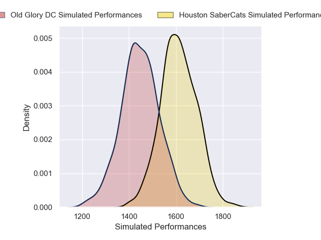
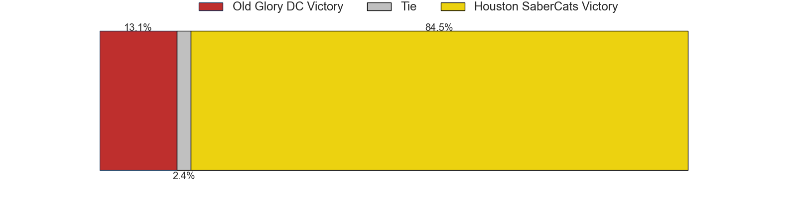
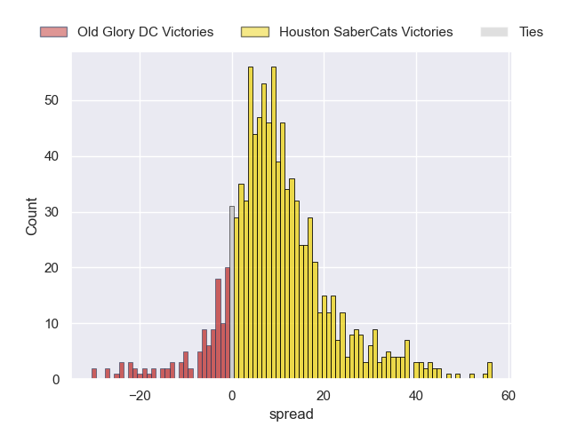

### Utah Warriors V Chicago Hounds on 2025/04/27

Average Margin: Utah Warriors by 5.2

Average Scoreline: 31-26

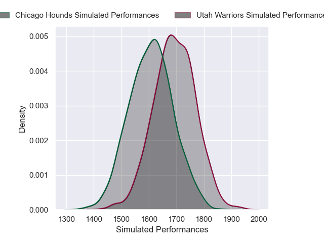
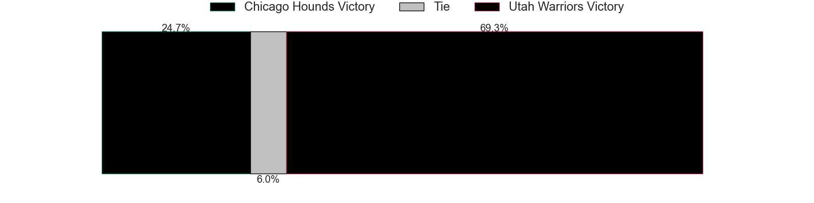
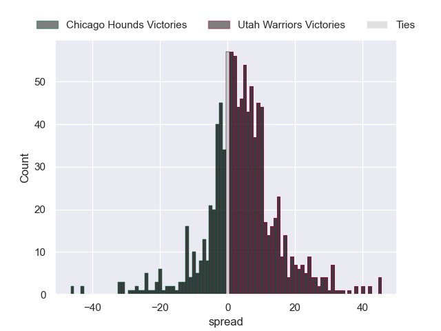

### RFC Los Angeles V San Diego Legion on 2025/04/27

Average Margin: San Diego Legion by 0.7

Average Scoreline: 31-30

## Week 12

### Miami Sharks V Anthem RC on 2025/04/28

Average Margin: Miami Sharks by 12.5

Average Scoreline: 32-20

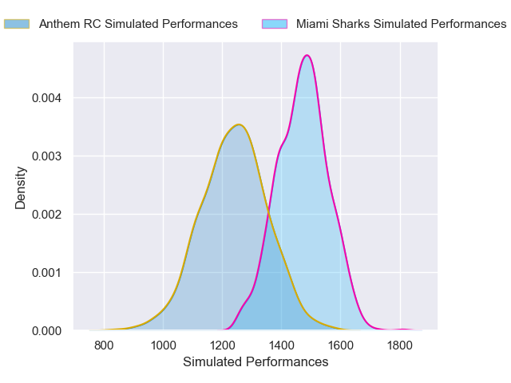

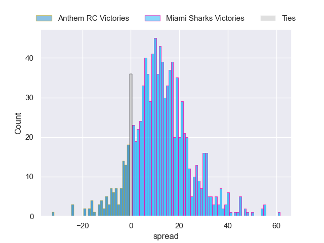

### Utah Warriors V San Diego Legion on 2025/04/30

Average Margin: Utah Warriors by 8.0

Average Scoreline: 34-26

### Seattle Seawolves V RFC Los Angeles on 2025/05/02

Average Margin: Seattle Seawolves by 6.0

Average Scoreline: 30-24

### Old Glory DC V Utah Warriors on 2025/05/04

Average Margin: Utah Warriors by 6.2

Average Scoreline: 27-21

### New England Free Jacks V Houston SaberCats on 2025/05/04

Average Margin: New England Free Jacks by 8.0

Average Scoreline: 33-25

### Chicago Hounds V Miami Sharks on 2025/05/04

Average Margin: Chicago Hounds by 13.9

Average Scoreline: 31-17

### San Diego Legion V NOLA Gold on 2025/05/04

Average Margin: San Diego Legion by 7.1

Average Scoreline: 33-26

## Week 13

### NOLA Gold V Miami Sharks on 2025/05/09

Average Margin: NOLA Gold by 9.8

Average Scoreline: 30-20

### San Diego Legion V Houston SaberCats on 2025/05/10

Average Margin: San Diego Legion by 4.3

Average Scoreline: 31-27

### RFC Los Angeles V Anthem RC on 2025/05/10

Average Margin: RFC Los Angeles by 15.4

Average Scoreline: 37-22

### New England Free Jacks V Chicago Hounds on 2025/05/10

Average Margin: New England Free Jacks by 4.7

Average Scoreline: 31-27

## Week 14

### Utah Warriors V Seattle Seawolves on 2025/05/12

Average Margin: Utah Warriors by 10.0

Average Scoreline: 33-22

### Old Glory DC V NOLA Gold on 2025/05/13

Average Margin: Old Glory DC by 0.9

Average Scoreline: 30-29

### Houston SaberCats V Utah Warriors on 2025/05/17

Average Margin: Utah Warriors by 0.9

Average Scoreline: 27-26

### Seattle Seawolves V San Diego Legion on 2025/05/17

Average Margin: Seattle Seawolves by 2.2

Average Scoreline: 26-24

### Miami Sharks V New England Free Jacks on 2025/05/17

Average Margin: New England Free Jacks by 8.6

Average Scoreline: 32-24

### Chicago Hounds V RFC Los Angeles on 2025/05/18

Average Margin: Chicago Hounds by 10.7

Average Scoreline: 32-21

### Anthem RC V Old Glory DC on 2025/05/18

Average Margin: Old Glory DC by 6.5

Average Scoreline: 32-25

## Week 15

### RFC Los Angeles V Miami Sharks on 2025/05/23

Average Margin: RFC Los Angeles by 8.7

Average Scoreline: 28-19

### Seattle Seawolves V Houston SaberCats on 2025/05/23

Average Margin: Seattle Seawolves by 2.2

Average Scoreline: 26-24

### New England Free Jacks V Old Glory DC on 2025/05/24

Average Margin: New England Free Jacks by 12.4

Average Scoreline: 34-22

### NOLA Gold V Utah Warriors on 2025/05/24

Average Margin: Utah Warriors by 3.3

Average Scoreline: 28-25

### Anthem RC V Chicago Hounds on 2025/05/24

Average Margin: Chicago Hounds by 14.3

Average Scoreline: 35-21

## Week 16

### Chicago Hounds V NOLA Gold on 2025/05/31

Average Margin: Chicago Hounds by 9.1

Average Scoreline: 34-25

### Utah Warriors V Anthem RC on 2025/05/31

Average Margin: Utah Warriors by 22.6

Average Scoreline: 43-20

### Old Glory DC V RFC Los Angeles on 2025/05/31

Average Margin: Old Glory DC by 1.8

Average Scoreline: 29-27

### Miami Sharks V San Diego Legion on 2025/05/31

Average Margin: San Diego Legion by 4.9

Average Scoreline: 26-21

### New England Free Jacks V Seattle Seawolves on 2025/06/01

Average Margin: New England Free Jacks by 8.8

Average Scoreline: 34-25

## Week 17

### Chicago Hounds V Houston SaberCats on 2025/06/04

Average Margin: Chicago Hounds by 6.8

Average Scoreline: 31-24

### San Diego Legion V Old Glory DC on 2025/06/07

Average Margin: San Diego Legion by 9.3

Average Scoreline: 34-24

### NOLA Gold V New England Free Jacks on 2025/06/07

Average Margin: New England Free Jacks by 2.8

Average Scoreline: 31-28

### Utah Warriors V RFC Los Angeles on 2025/06/07

Average Margin: Utah Warriors by 11.4

Average Scoreline: 35-23

### Seattle Seawolves V Miami Sharks on 2025/06/08

Average Margin: Seattle Seawolves by 9.9

Average Scoreline: 33-23

### Houston SaberCats V Anthem RC on 2025/06/08

Average Margin: Houston SaberCats by 17.8

Average Scoreline: 40-22

