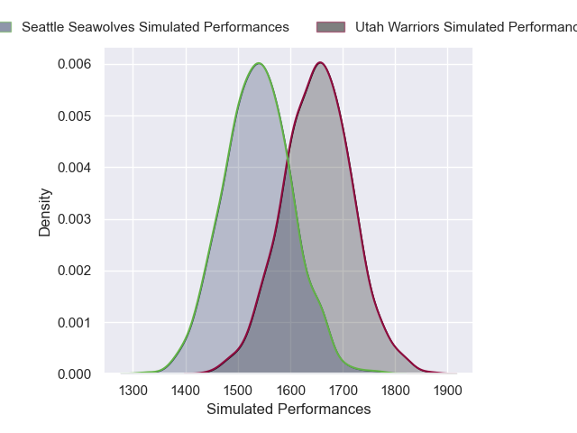
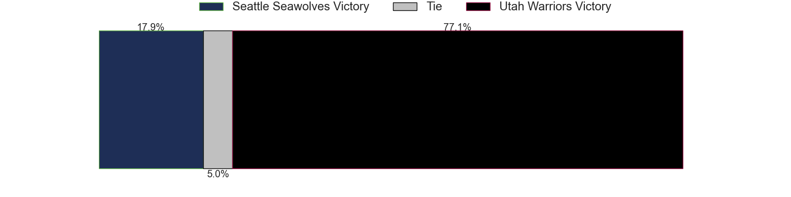
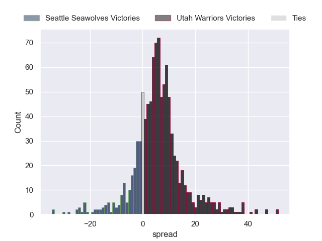

---  
title: "Major League Rugby 2025 Status"  
date: 2025-06-12 6:00:00 -0500  
categories: model review projection  
layout: article  
aside:  
    toc: true  
---
# Current Team Rankings

# Standings

## Current Standings

| Club                   |   Played |   Wins |   Point Differential |   Losing Bonus Points |   Try Bonus Points |   Competition Points |
|:-----------------------|---------:|-------:|---------------------:|----------------------:|-------------------:|---------------------:|
| Utah Warriors          |       18 |     13 |                  118 |                     2 |                nan |                   66 |
| New England Free Jacks |       17 |     12 |                   86 |                     2 |                nan |                   57 |
| Houston SaberCats      |       18 |     10 |                   91 |                     5 |                nan |                   55 |
| Chicago Hounds         |       17 |     11 |                   67 |                     3 |                nan |                   55 |
| San Diego Legion       |       17 |      9 |                   61 |                     4 |                nan |                   52 |
| Seattle Seawolves      |       17 |      9 |                   38 |                     4 |                nan |                   49 |
| RFC Los Angeles        |       16 |      8 |                    4 |                     3 |                nan |                   46 |
| Miami Sharks           |       17 |      9 |                  -47 |                     3 |                nan |                   44 |
| Old Glory DC           |       16 |      7 |                  -53 |                     2 |                nan |                   39 |
| NOLA Gold              |       17 |      4 |                  -43 |                     9 |                nan |                   32 |
| RFCLA                  |       10 |      5 |                   13 |                     2 |                nan |                   24 |
| Anthem RC              |       18 |      0 |                 -335 |                     3 |                nan |                    3 |

## Projected Remaining Table

| Club                   |   Matches Remaining |   Wins |   Point Differential |   Losing Bonus Points |   Try Bonus Points |   Competition Points |
|:-----------------------|--------------------:|-------:|---------------------:|----------------------:|-------------------:|---------------------:|
| Utah Warriors          |                   2 |    1.1 |              3.039   |                   0.5 |                0.5 |                  5.6 |
| New England Free Jacks |                   1 |    0.9 |             10.7151  |                   0.1 |                0.4 |                  3.9 |
| Chicago Hounds         |                   1 |    0.9 |              9.07685 |                   0.1 |                0.4 |                  3.9 |
| Houston SaberCats      |                   1 |    0.6 |              2.95879 |                   0.2 |                0.3 |                  3   |
| RFCLA                  |                   1 |    0.4 |             -2.95879 |                   0.3 |                0.2 |                  2.1 |
| Seattle Seawolves      |                   1 |    0.2 |             -6.09633 |                   0.4 |                0.2 |                  1.4 |
| Old Glory DC           |                   1 |    0.1 |             -9.07685 |                   0.3 |                0.2 |                  1.1 |
| Miami Sharks           |                   1 |    0.1 |            -10.7151  |                   0.2 |                0.3 |                  1   |

## Projected Total Table

| Club                   |   Total Matches |   Wins |   Point Differential |   Losing Bonus Points |   Try Bonus Points |   Competition Points |
|:-----------------------|----------------:|-------:|---------------------:|----------------------:|-------------------:|---------------------:|
| Utah Warriors          |              20 |   14.1 |             121.039  |                   2.5 |                0.5 |                 71.6 |
| New England Free Jacks |              18 |   12.9 |              96.7151 |                   2.1 |                0.4 |                 60.9 |
| Chicago Hounds         |              18 |   11.9 |              76.0769 |                   3.1 |                0.4 |                 58.9 |
| Houston SaberCats      |              19 |   10.6 |              93.9588 |                   5.2 |                0.3 |                 58   |
| San Diego Legion       |              17 |    9   |              61      |                   4   |                0   |                 52   |
| Seattle Seawolves      |              18 |    9.2 |              31.9037 |                   4.4 |                0.2 |                 50.4 |
| RFC Los Angeles        |              16 |    8   |               4      |                   3   |                0   |                 46   |
| Miami Sharks           |              18 |    9.1 |             -57.7151 |                   3.2 |                0.3 |                 45   |
| Old Glory DC           |              17 |    7.1 |             -62.0769 |                   2.3 |                0.2 |                 40.1 |
| NOLA Gold              |              17 |    4   |             -43      |                   9   |                0   |                 32   |
| RFCLA                  |              11 |    5.4 |              10.0412 |                   2.3 |                0.2 |                 26.1 |
| Anthem RC              |              18 |    0   |            -335      |                   3   |                0   |                  3   |

# Completed Match Review

| Model | Percent Correct Predictions | Spread Error |
| ------ | ------ | ------ |
| Club Level | 67.7% | 11.5 |
| Player Level: Lineup | 70.8% | 10.5 |
| Player Level: Minutes | 79.2% | 9.7 |

# Future Predictions

## Week 19

### Chicago Hounds V Old Glory DC on 2025/06/14

Average Margin: Chicago Hounds by 9.1

Average Scoreline: 30-21

### Utah Warriors V TBC on 2025/06/14

Average Margin: TBC by 3.1

Average Scoreline: 18-15

### Utah Warriors V Seattle Seawolves on 2025/06/14

Average Margin: Utah Warriors by 6.1

Average Scoreline: 27-21

### New England Free Jacks V Miami Sharks on 2025/06/15

Average Margin: New England Free Jacks by 10.7

Average Scoreline: 33-22

### Houston SaberCats V RFCLA on 2025/06/15

Average Margin: Houston SaberCats by 3.0

Average Scoreline: 23-20

