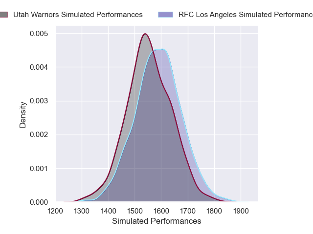
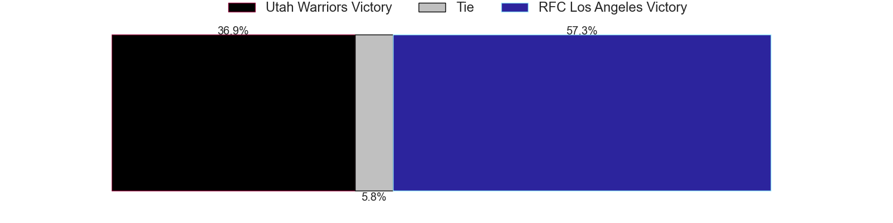
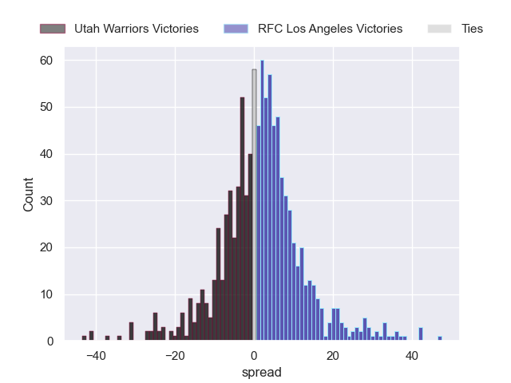
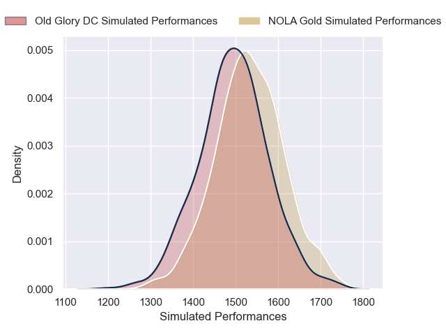
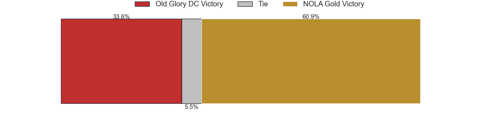
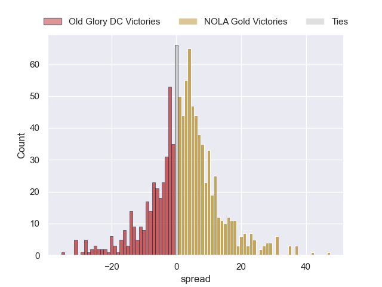
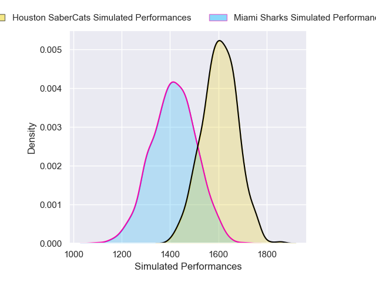
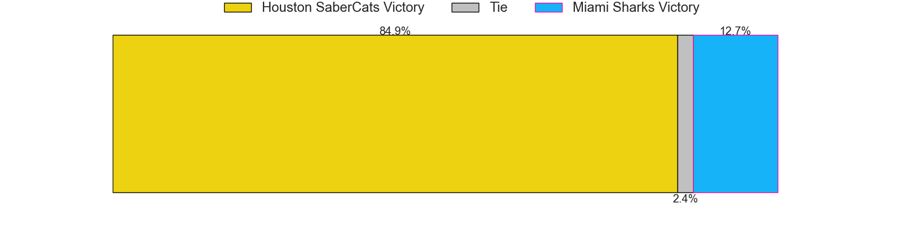
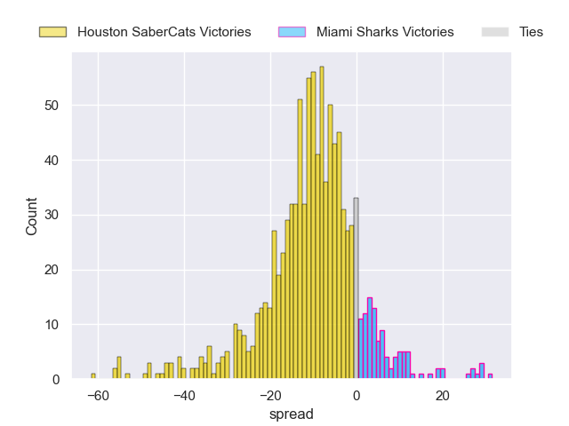

---  
title: "Major League Rugby 2025 Status"  
date: 2025-04-11 6:00:00 -0500  
categories: model review projection  
layout: article  
aside:  
    toc: true  
---
# Current Team Rankings

# Standings

## Current Standings

| Club                   |   Played |   Wins |   Point Differential |   Losing Bonus Points |   Try Bonus Points |   Competition Points |
|:-----------------------|---------:|-------:|---------------------:|----------------------:|-------------------:|---------------------:|
| Chicago Hounds         |        7 |      6 |                   44 |                     0 |                nan |                   28 |
| San Diego Legion       |        7 |      5 |                   77 |                     1 |                nan |                   26 |
| Houston SaberCats      |        8 |      5 |                   52 |                     3 |                nan |                   26 |
| Utah Warriors          |        6 |      4 |                   41 |                     1 |                  4 |                   21 |
| New England Free Jacks |        7 |      4 |                    9 |                     1 |                nan |                   20 |
| RFC Los Angeles        |        7 |      4 |                   -7 |                     1 |                nan |                   18 |
| Old Glory DC           |        6 |      3 |                    5 |                     1 |                nan |                   15 |
| Seattle Seawolves      |        7 |      2 |                  -30 |                     3 |                nan |                   14 |
| NOLA Gold              |        7 |      2 |                  -17 |                     4 |                nan |                   13 |
| Miami Sharks           |        6 |      2 |                  -80 |                     0 |                nan |                    9 |
| RFCLA                  |        1 |      1 |                    2 |                     0 |                nan |                    4 |
| Anthem RC              |        7 |      0 |                  -96 |                     3 |                nan |                    3 |

## Projected Remaining Table

| Club                   |   Matches Remaining |   Wins |   Point Differential |   Losing Bonus Points |   Try Bonus Points |   Competition Points |
|:-----------------------|--------------------:|-------:|---------------------:|----------------------:|-------------------:|---------------------:|
| Chicago Hounds         |                   9 |    6.9 |            86.8512   |                   1.3 |                4.7 |                 33.4 |
| New England Free Jacks |                   9 |    6.7 |            55.4184   |                   1.5 |                4.1 |                 32.2 |
| San Diego Legion       |                   9 |    6.1 |            43.4469   |                   1.7 |                3.7 |                 30   |
| Houston SaberCats      |                   9 |    5.6 |            40.2515   |                   1.9 |                4.6 |                 29.1 |
| Utah Warriors          |                  11 |    5.5 |            -0.810937 |                   2.6 |                3.8 |                 28.3 |
| Seattle Seawolves      |                   9 |    4.6 |             9.04105  |                   2.4 |                2.9 |                 23.6 |
| Old Glory DC           |                   9 |    4.3 |            -4.50876  |                   2.1 |                2.9 |                 22.4 |
| RFC Los Angeles        |                   9 |    4.2 |             4.07039  |                   2.3 |                3.2 |                 22.2 |
| NOLA Gold              |                   9 |    3.5 |           -29.0701   |                   2.3 |                2.1 |                 18.4 |
| Miami Sharks           |                   9 |    1.8 |           -83.1013   |                   1.9 |                1.8 |                 10.9 |
| Anthem RC              |                   9 |    1   |          -138.527    |                   1.4 |                1.4 |                  6.9 |
| RFCLA                  |                   1 |    0.9 |            16.9387   |                   0.1 |                0.4 |                  3.9 |

## Projected Total Table

| Club                   |   Total Matches |   Wins |   Point Differential |   Losing Bonus Points |   Try Bonus Points |   Competition Points |
|:-----------------------|----------------:|-------:|---------------------:|----------------------:|-------------------:|---------------------:|
| Chicago Hounds         |              16 |   12.9 |           130.851    |                   1.3 |                4.7 |                 61.4 |
| San Diego Legion       |              16 |   11.1 |           120.447    |                   2.7 |                3.7 |                 56   |
| Houston SaberCats      |              17 |   10.6 |            92.2515   |                   4.9 |                4.6 |                 55.1 |
| New England Free Jacks |              16 |   10.7 |            64.4184   |                   2.5 |                4.1 |                 52.2 |
| Utah Warriors          |              17 |    9.5 |            40.1891   |                   3.6 |                7.8 |                 49.3 |
| RFC Los Angeles        |              16 |    8.2 |            -2.92961  |                   3.3 |                3.2 |                 40.2 |
| Seattle Seawolves      |              16 |    6.6 |           -20.959    |                   5.4 |                2.9 |                 37.6 |
| Old Glory DC           |              15 |    7.3 |             0.491244 |                   3.1 |                2.9 |                 37.4 |
| NOLA Gold              |              16 |    5.5 |           -46.0701   |                   6.3 |                2.1 |                 31.4 |
| Miami Sharks           |              15 |    3.8 |          -163.101    |                   1.9 |                1.8 |                 19.9 |
| Anthem RC              |              16 |    1   |          -234.527    |                   4.4 |                1.4 |                  9.9 |
| RFCLA                  |               2 |    1.9 |            18.9387   |                   0.1 |                0.4 |                  7.9 |

# Completed Match Review

| Model | Percent Correct Predictions | Spread Error |
| ------ | ------ | ------ |
| Club Level | 68.4% | 12.7 |
| Player Level: Lineup | 60.0% | 12.1 |
| Player Level: Minutes | 70.0% | 11.9 |

# Future Predictions

## Week 9

### New England Free Jacks V San Diego Legion on 2025/04/12

Average Margin: New England Free Jacks by 2.3

Average Scoreline: 30-28

### RFC Los Angeles V Utah Warriors on 2025/04/13

Average Margin: RFC Los Angeles by 2.3

Average Scoreline: 30-28

### NOLA Gold V Old Glory DC on 2025/04/13

Average Margin: NOLA Gold by 3.3

Average Scoreline: 38-35

### Miami Sharks V Houston SaberCats on 2025/04/13

Average Margin: Houston SaberCats by 10.3

Average Scoreline: 38-27

### Chicago Hounds V Anthem RC on 2025/04/13

Average Margin: Chicago Hounds by 24.7

Average Scoreline: 44-19

## Week 10

### Seattle Seawolves V Chicago Hounds on 2025/04/18

Average Margin: Chicago Hounds by 2.7

Average Scoreline: 38-36

### Anthem RC V New England Free Jacks on 2025/04/18

Average Margin: New England Free Jacks by 14.0

Average Scoreline: 30-16

### San Diego Legion V Utah Warriors on 2025/04/19

Average Margin: San Diego Legion by 6.6

Average Scoreline: 32-25

### Houston SaberCats V NOLA Gold on 2025/04/19

Average Margin: Houston SaberCats by 10.3

Average Scoreline: 34-23

### Old Glory DC V Miami Sharks on 2025/04/19

Average Margin: Old Glory DC by 10.9

Average Scoreline: 34-23

## Week 11

### New England Free Jacks V RFC Los Angeles on 2025/04/22

Average Margin: New England Free Jacks by 6.5

Average Scoreline: 34-27

### Anthem RC V Seattle Seawolves on 2025/04/23

Average Margin: Seattle Seawolves by 11.1

Average Scoreline: 28-17

### Utah Warriors V Chicago Hounds on 2025/04/26

Average Margin: Chicago Hounds by 0.6

Average Scoreline: 29-28

### Houston SaberCats V Old Glory DC on 2025/04/26

Average Margin: Houston SaberCats by 9.6

Average Scoreline: 33-23

### RFC Los Angeles V San Diego Legion on 2025/04/26

Average Margin: San Diego Legion by 1.3

Average Scoreline: 30-29

### NOLA Gold V Seattle Seawolves on 2025/04/27

Average Margin: NOLA Gold by 1.0

Average Scoreline: 32-31

### Miami Sharks V Anthem RC on 2025/04/27

Average Margin: Miami Sharks by 10.1

Average Scoreline: 34-24

## Week 12

### Utah Warriors V San Diego Legion on 2025/04/30

Average Margin: Utah Warriors by 0.5

Average Scoreline: 29-28

### Seattle Seawolves V RFC Los Angeles on 2025/05/02

Average Margin: Seattle Seawolves by 3.3

Average Scoreline: 27-24

### Old Glory DC V Utah Warriors on 2025/05/04

Average Margin: Old Glory DC by 0.6

Average Scoreline: 30-30

### Chicago Hounds V Miami Sharks on 2025/05/04

Average Margin: Chicago Hounds by 17.4

Average Scoreline: 36-18

### San Diego Legion V NOLA Gold on 2025/05/04

Average Margin: San Diego Legion by 11.5

Average Scoreline: 36-24

### New England Free Jacks V Houston SaberCats on 2025/05/04

Average Margin: New England Free Jacks by 3.0

Average Scoreline: 31-28

## Week 13

### NOLA Gold V Miami Sharks on 2025/05/09

Average Margin: NOLA Gold by 9.7

Average Scoreline: 33-23

### New England Free Jacks V Chicago Hounds on 2025/05/10

Average Margin: New England Free Jacks by 1.2

Average Scoreline: 31-30

### RFC Los Angeles V Anthem RC on 2025/05/10

Average Margin: RFC Los Angeles by 17.2

Average Scoreline: 40-22

### San Diego Legion V Houston SaberCats on 2025/05/10

Average Margin: San Diego Legion by 5.4

Average Scoreline: 32-27

## Week 14

### Utah Warriors V Seattle Seawolves on 2025/05/12

Average Margin: Utah Warriors by 5.9

Average Scoreline: 29-23

### Old Glory DC V NOLA Gold on 2025/05/13

Average Margin: Old Glory DC by 4.9

Average Scoreline: 29-24

### Miami Sharks V New England Free Jacks on 2025/05/17

Average Margin: New England Free Jacks by 9.2

Average Scoreline: 37-28

### Seattle Seawolves V San Diego Legion on 2025/05/17

Average Margin: San Diego Legion by 1.0

Average Scoreline: 29-28

### Houston SaberCats V Utah Warriors on 2025/05/17

Average Margin: Houston SaberCats by 5.8

Average Scoreline: 32-26

### Anthem RC V Old Glory DC on 2025/05/18

Average Margin: Old Glory DC by 9.2

Average Scoreline: 37-28

### Chicago Hounds V RFC Los Angeles on 2025/05/18

Average Margin: Chicago Hounds by 9.3

Average Scoreline: 31-21

## Week 15

### Seattle Seawolves V Houston SaberCats on 2025/05/23

Average Margin: Houston SaberCats by 0.2

Average Scoreline: 29-29

### RFC Los Angeles V Miami Sharks on 2025/05/23

Average Margin: RFC Los Angeles by 13.1

Average Scoreline: 33-20

### NOLA Gold V Utah Warriors on 2025/05/24

Average Margin: Utah Warriors by 1.3

Average Scoreline: 28-27

### New England Free Jacks V Old Glory DC on 2025/05/24

Average Margin: New England Free Jacks by 9.5

Average Scoreline: 32-23

### Anthem RC V Chicago Hounds on 2025/05/24

Average Margin: Chicago Hounds by 15.3

Average Scoreline: 36-21

## Week 16

### Miami Sharks V San Diego Legion on 2025/05/31

Average Margin: San Diego Legion by 10.3

Average Scoreline: 36-26

### Old Glory DC V RFC Los Angeles on 2025/05/31

Average Margin: Old Glory DC by 2.6

Average Scoreline: 33-31

### Utah Warriors V Anthem RC on 2025/05/31

Average Margin: Utah Warriors by 18.9

Average Scoreline: 39-20

### Chicago Hounds V NOLA Gold on 2025/05/31

Average Margin: Chicago Hounds by 12.4

Average Scoreline: 32-19

### New England Free Jacks V Seattle Seawolves on 2025/06/01

Average Margin: New England Free Jacks by 7.0

Average Scoreline: 31-24

## Week 17

### Chicago Hounds V Houston SaberCats on 2025/06/04

Average Margin: Chicago Hounds by 5.7

Average Scoreline: 26-21

### San Diego Legion V Old Glory DC on 2025/06/07

Average Margin: San Diego Legion by 10.1

Average Scoreline: 34-23

### Utah Warriors V RFC Los Angeles on 2025/06/07

Average Margin: Utah Warriors by 5.5

Average Scoreline: 29-23

### NOLA Gold V New England Free Jacks on 2025/06/07

Average Margin: New England Free Jacks by 2.6

Average Scoreline: 31-29

### Seattle Seawolves V Miami Sharks on 2025/06/08

Average Margin: Seattle Seawolves by 12.3

Average Scoreline: 32-20

### Houston SaberCats V Anthem RC on 2025/06/08

Average Margin: Houston SaberCats by 18.2

Average Scoreline: 45-27

