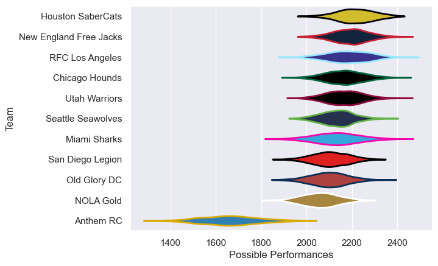

---  
title: "Major League Rugby 2025 Status"  
date: 2025-06-26 6:00:00 -0500  
categories: model review projection  
layout: article  
aside:  
    toc: true  
---
# Current Team Rankings

# Standings

## Current Standings

| Club                   |   Played |   Wins |   Point Differential |   Losing Bonus Points |   Try Bonus Points |   Competition Points |
|:-----------------------|---------:|-------:|---------------------:|----------------------:|-------------------:|---------------------:|
| New England Free Jacks |       18 |     13 |                  107 |                     2 |                  7 |                   61 |
| Utah Warriors          |       18 |     12 |                   74 |                     2 |                 11 |                   61 |
| Houston SaberCats      |       18 |     12 |                  112 |                     4 |                  8 |                   60 |
| Chicago Hounds         |       18 |     12 |                   79 |                     3 |                  7 |                   58 |
| Seattle Seawolves      |       17 |      8 |                   36 |                     5 |                  8 |                   47 |
| San Diego Legion       |       16 |      8 |                   60 |                     4 |                 10 |                   46 |
| RFC Los Angeles        |       17 |      8 |                   -2 |                     4 |                  7 |                   45 |
| Old Glory DC           |       17 |      8 |                  -51 |                     2 |                  9 |                   43 |
| Miami Sharks           |       17 |      8 |                  -86 |                     3 |                  6 |                   41 |
| NOLA Gold              |       16 |      4 |                  -43 |                     8 |                  5 |                   29 |
| Anthem RC              |       16 |      0 |                 -286 |                     3 |                    |                    3 |

## Projected Remaining Table

| Club                   |   To Play |   Projected Wins |   Projected Differential |   Projected Losing Bonus Points | Projected Try Bonus Points   |   Projected Competition Points |
|:-----------------------|----------:|-----------------:|-------------------------:|--------------------------------:|:-----------------------------|-------------------------------:|
| New England Free Jacks |         1 |            0.572 |                    2.213 |                           0.229 |                              |                          2.635 |
| Houston SaberCats      |         1 |            0.369 |                   -2.213 |                           0.288 |                              |                          1.882 |

## Projected Total Table

| Club                   |   Played |   Wins |   Point Differential |   Losing Bonus Points |   Try Bonus Points |   Competition Points |
|:-----------------------|---------:|-------:|---------------------:|----------------------:|-------------------:|---------------------:|
| New England Free Jacks |       19 | 13.572 |              109.213 |                 2.229 |                  7 |               63.635 |
| Houston SaberCats      |       19 | 12.369 |              109.787 |                 4.288 |                  8 |               61.882 |
| Utah Warriors          |       18 | 12     |               74     |                 2     |                 11 |               61     |
| Chicago Hounds         |       18 | 12     |               79     |                 3     |                  7 |               58     |
| Seattle Seawolves      |       17 |  8     |               36     |                 5     |                  8 |               47     |
| San Diego Legion       |       16 |  8     |               60     |                 4     |                 10 |               46     |
| RFC Los Angeles        |       17 |  8     |               -2     |                 4     |                  7 |               45     |
| Old Glory DC           |       17 |  8     |              -51     |                 2     |                  9 |               43     |
| Miami Sharks           |       17 |  8     |              -86     |                 3     |                  6 |               41     |
| NOLA Gold              |       16 |  4     |              -43     |                 8     |                  5 |               29     |
| Anthem RC              |       16 |  0     |             -286     |                 3     |                    |                3     |

# Completed Match Review

| Model | Percent Correct Predictions | Spread Error |
| ------ | ------ | ------ |
| Club Level | 66.3% | 11.7 |
| Player Level: Lineup | nan% | nan |
| Player Level: Minutes | nan% | nan |

# Future Predictions

## Week 19

### New England Free Jacks V Houston SaberCats on 2025/06/28

Average Margin: New England Free Jacks by 2.2

