# Team Rankings

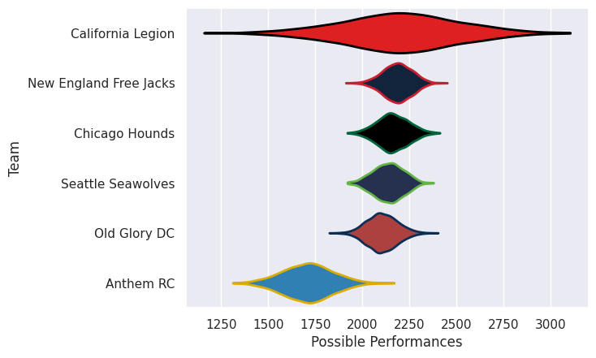
# Standings

## Projected Remaining Table

| Club                   |   To Play |   Projected Wins |   Projected Differential |   Projected Losing Bonus Points | Projected Try Bonus Points   |   Projected Competition Points |
|:-----------------------|----------:|-----------------:|-------------------------:|--------------------------------:|:-----------------------------|-------------------------------:|
| California Legion      |         2 |            1.121 |                   11.318 |                           0.274 |                              |                          4.854 |
| Chicago Hounds         |         1 |            0.728 |                    9.348 |                           0.11  |                              |                          3.098 |
| Seattle Seawolves      |         1 |            0.665 |                    4.908 |                           0.144 |                              |                          2.884 |
| Anthem RC              |         2 |            0.524 |                  -24.99  |                           0.342 |                              |                          2.556 |
| New England Free Jacks |         1 |            0.541 |                    4.324 |                           0.166 |                              |                          2.384 |
| Old Glory DC           |         1 |            0.295 |                   -4.908 |                           0.233 |                              |                          1.493 |

## Projected Total Table

| Club                   |   Played |   Wins |   Point Differential |   Losing Bonus Points | Try Bonus Points   |   Competition Points |
|:-----------------------|---------:|-------:|---------------------:|----------------------:|:-------------------|---------------------:|
| California Legion      |        2 |  1.121 |               11.318 |                 0.274 |                    |                4.854 |
| Chicago Hounds         |        1 |  0.728 |                9.348 |                 0.11  |                    |                3.098 |
| Seattle Seawolves      |        1 |  0.665 |                4.908 |                 0.144 |                    |                2.884 |
| Anthem RC              |        2 |  0.524 |              -24.99  |                 0.342 |                    |                2.556 |
| New England Free Jacks |        1 |  0.541 |                4.324 |                 0.166 |                    |                2.384 |
| Old Glory DC           |        1 |  0.295 |               -4.908 |                 0.233 |                    |                1.493 |

# Future Predictions

## Week 1

### California Legion V Anthem RC on 2026/03/28

Average Margin: California Legion by 15.6

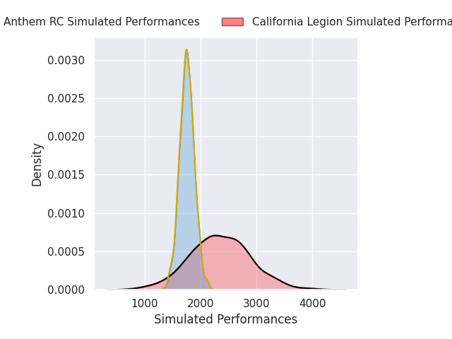
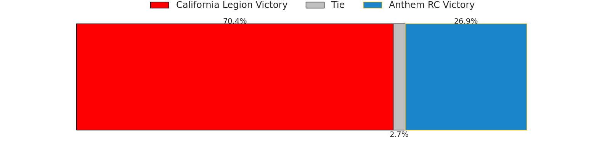
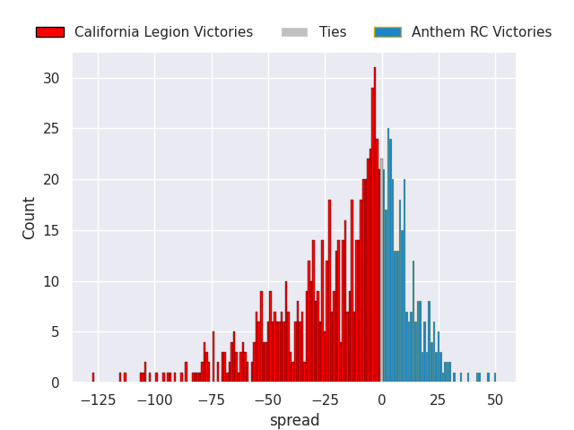

## Week 2

### Seattle Seawolves V Old Glory DC on 2026/04/03

Average Margin: Seattle Seawolves by 4.9

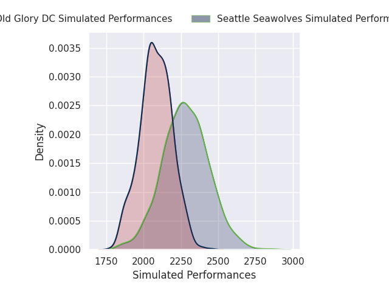

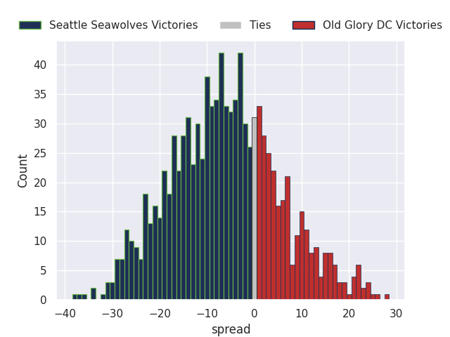

### California Legion V New England Free Jacks on 2026/04/04

Average Margin: New England Free Jacks by 4.3

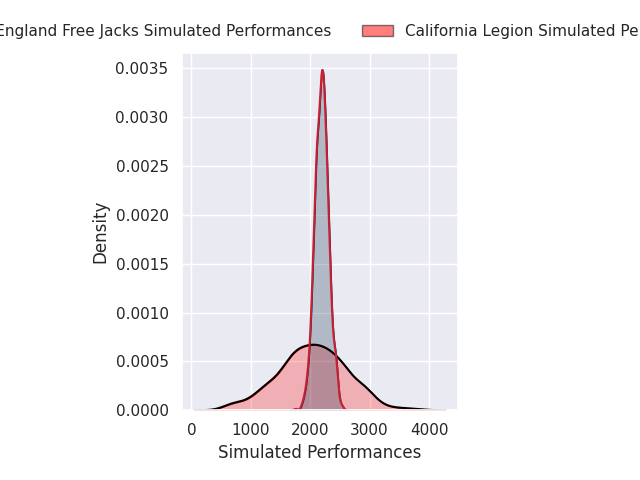
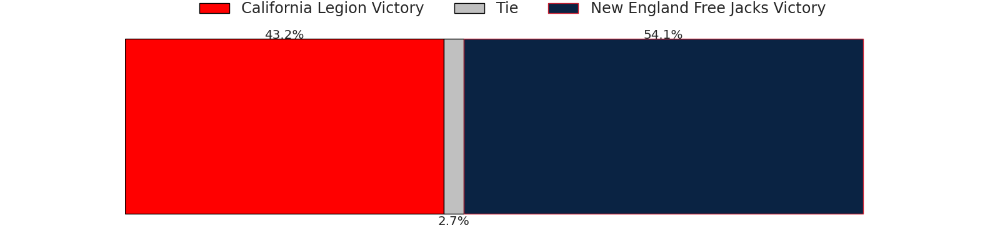
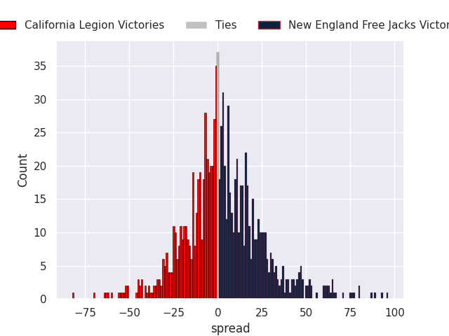

### Anthem RC V Chicago Hounds on 2026/04/04

Average Margin: Chicago Hounds by 9.3

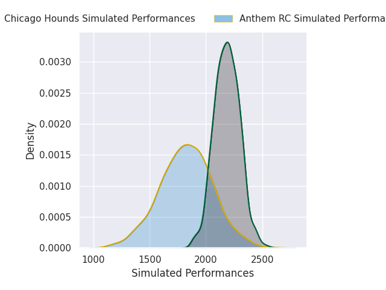
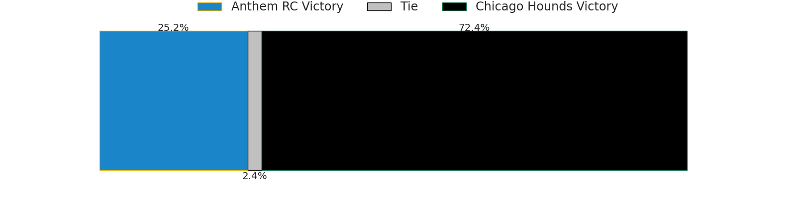
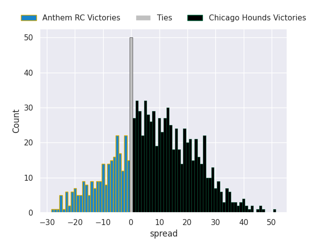

