# Team Rankings

# Standings

## Projected Remaining Table

| Club                   |   To Play |   Projected Wins |   Projected Differential |   Projected Losing Bonus Points | Projected Try Bonus Points   |   Projected Competition Points |
|:-----------------------|----------:|-----------------:|-------------------------:|--------------------------------:|:-----------------------------|-------------------------------:|
| California Legion      |         5 |            2.367 |                   -0.663 |                           0.748 |                              |                         10.55  |
| Seattle Seawolves      |         4 |            2.351 |                   15.792 |                           0.697 |                              |                         10.409 |
| New England Free Jacks |         4 |            2.352 |                   20.773 |                           0.633 |                              |                         10.317 |
| Chicago Hounds         |         4 |            2.256 |                   17.814 |                           0.755 |                              |                         10.105 |
| Old Glory DC           |         4 |            1.807 |                    0.212 |                           0.802 |                              |                          8.318 |
| Anthem RC              |         5 |            1.406 |                  -53.928 |                           0.842 |                              |                          6.778 |

## Projected Total Table

| Club                   |   Played |   Wins |   Point Differential |   Losing Bonus Points | Try Bonus Points   |   Competition Points |
|:-----------------------|---------:|-------:|---------------------:|----------------------:|:-------------------|---------------------:|
| California Legion      |        5 |  2.367 |               -0.663 |                 0.748 |                    |               10.55  |
| Seattle Seawolves      |        4 |  2.351 |               15.792 |                 0.697 |                    |               10.409 |
| New England Free Jacks |        4 |  2.352 |               20.773 |                 0.633 |                    |               10.317 |
| Chicago Hounds         |        4 |  2.256 |               17.814 |                 0.755 |                    |               10.105 |
| Old Glory DC           |        4 |  1.807 |                0.212 |                 0.802 |                    |                8.318 |
| Anthem RC              |        5 |  1.406 |              -53.928 |                 0.842 |                    |                6.778 |

# Future Predictions

## Week 1

### California Legion V Anthem RC on 2026/03/28

Average Margin: California Legion by 16.6

## Week 2

### Seattle Seawolves V Old Glory DC on 2026/04/03

Average Margin: Seattle Seawolves by 4.8

### California Legion V New England Free Jacks on 2026/04/04

Average Margin: New England Free Jacks by 3.3

### Anthem RC V Chicago Hounds on 2026/04/04

Average Margin: Chicago Hounds by 8.9

## Week 3

### New England Free Jacks V Old Glory DC on 2026/04/11

Average Margin: New England Free Jacks by 6.1

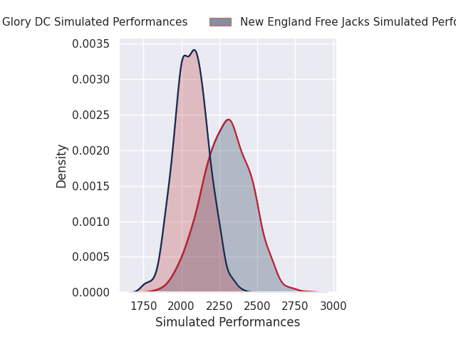

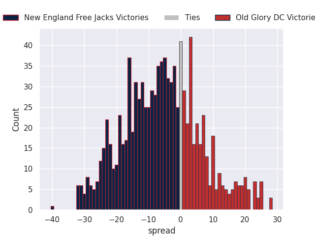

### Anthem RC V Seattle Seawolves on 2026/04/12

Average Margin: Seattle Seawolves by 8.2

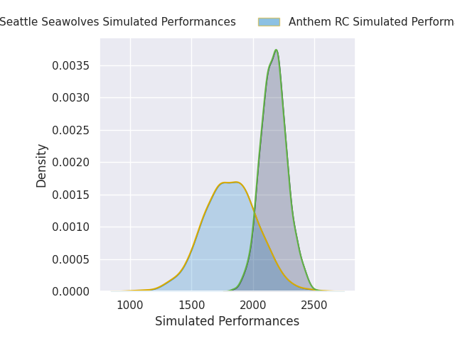
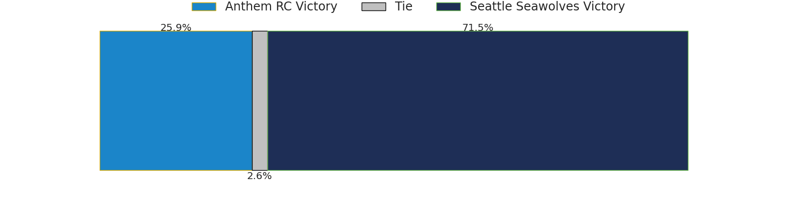
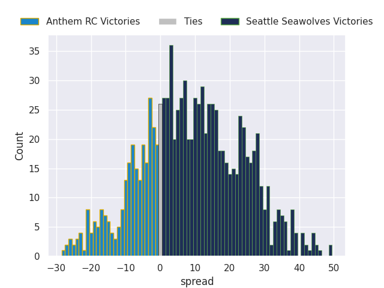

### Chicago Hounds V California Legion on 2026/04/12

Average Margin: Chicago Hounds by 8.6

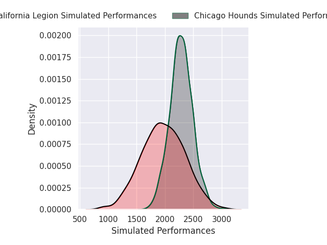
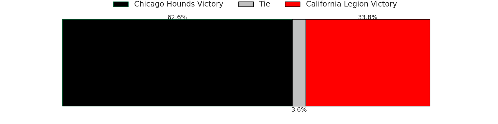
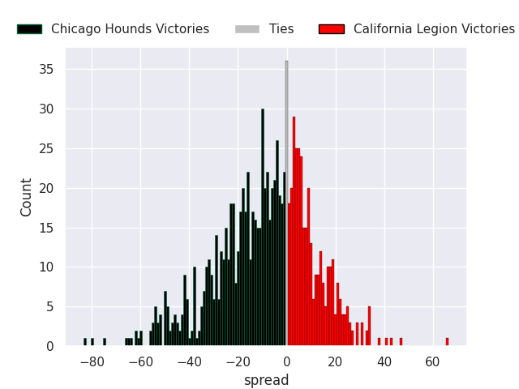

## Week 4

### Anthem RC V Old Glory DC on 2026/04/18

Average Margin: Old Glory DC by 6.1

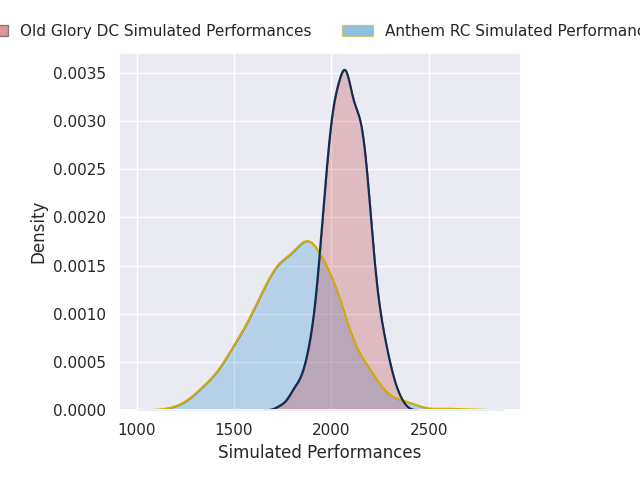
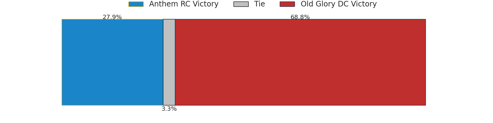
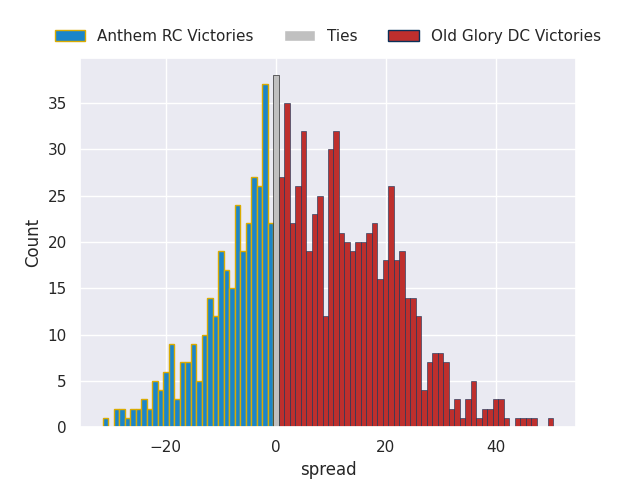

### Chicago Hounds V New England Free Jacks on 2026/04/19

Average Margin: Chicago Hounds by 2.7

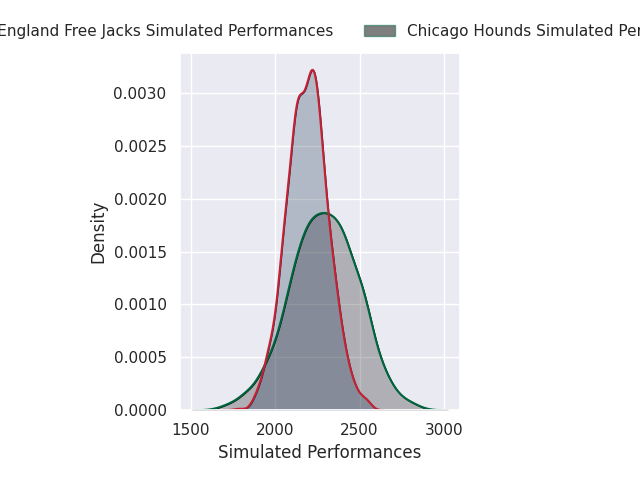
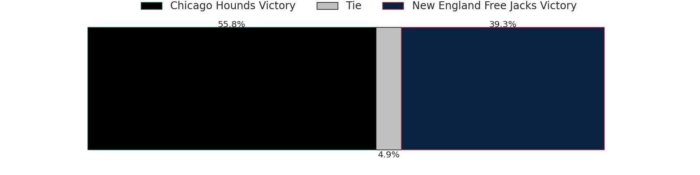
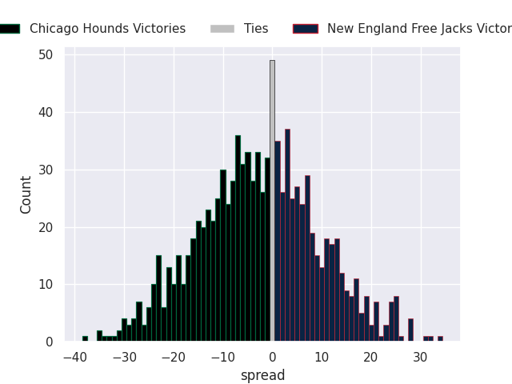

### California Legion V Seattle Seawolves on 2026/04/19

Average Margin: Seattle Seawolves by 0.4

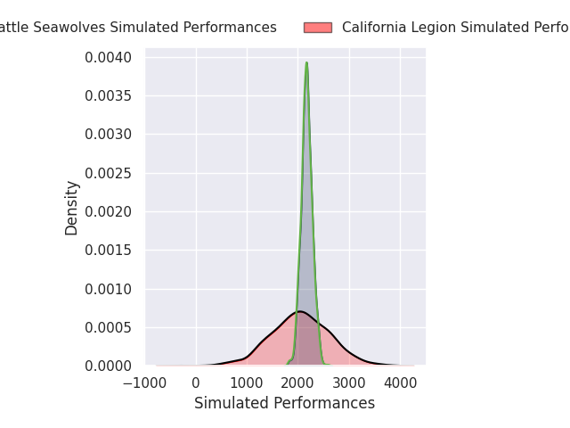
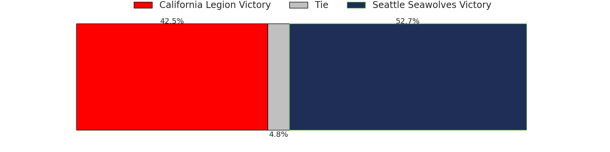
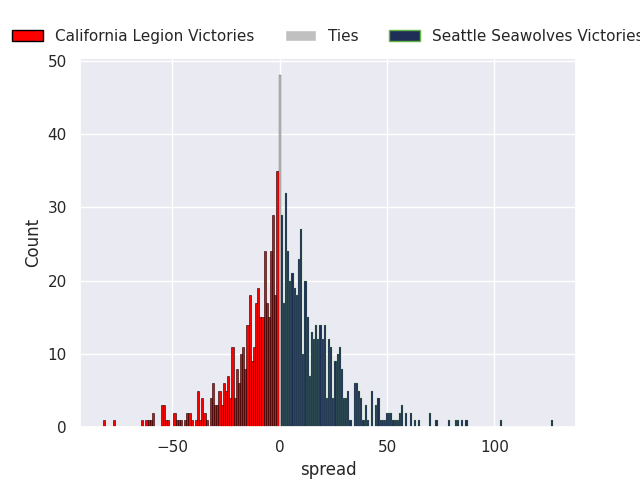

## Week 5

### Seattle Seawolves V Chicago Hounds on 2026/04/24

Average Margin: Seattle Seawolves by 2.4

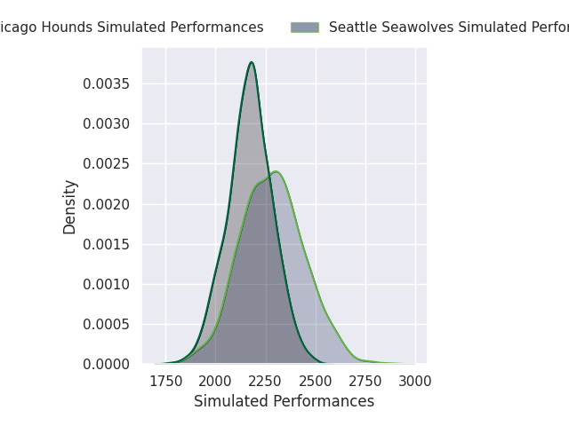

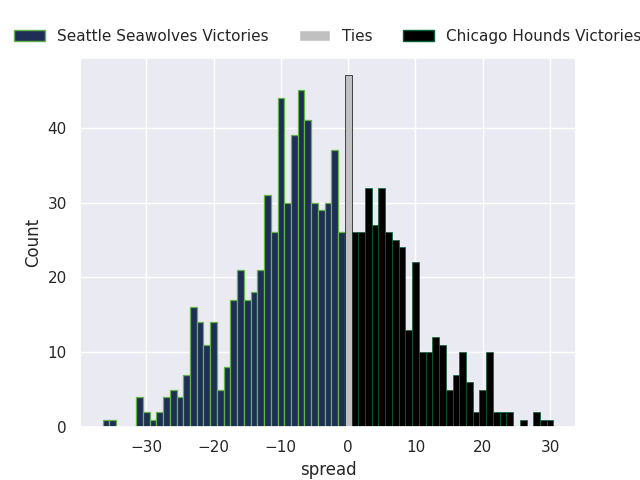

### New England Free Jacks V Anthem RC on 2026/04/26

Average Margin: New England Free Jacks by 14.1

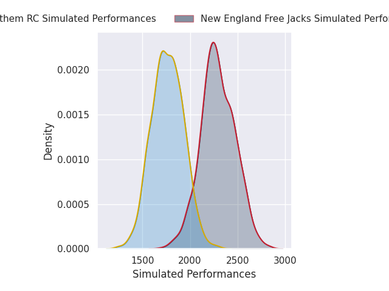

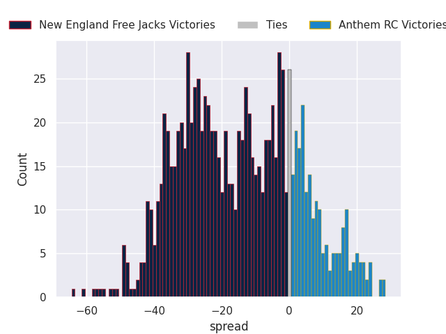

### Old Glory DC V California Legion on 2026/04/26

Average Margin: Old Glory DC by 4.9

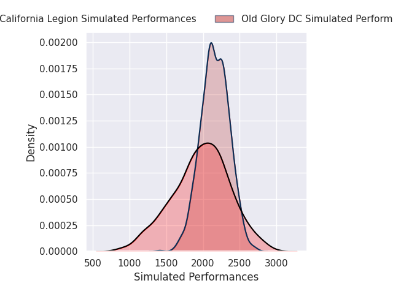
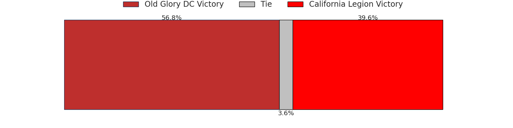
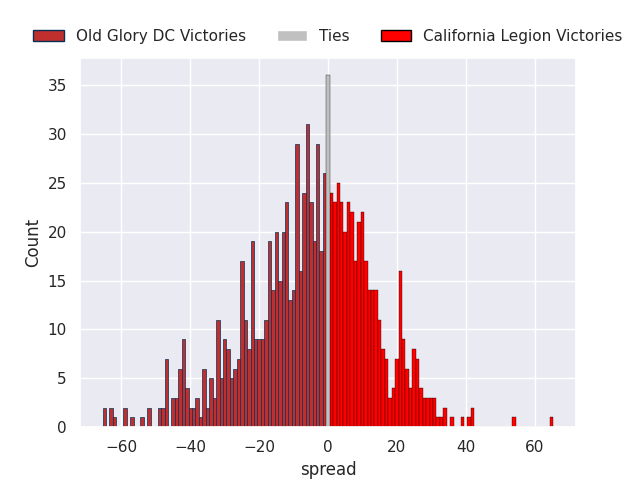

