# Team Rankings

# Standings

## Projected Remaining Table

| Club                   |   To Play |   Projected Wins |   Projected Differential |   Projected Losing Bonus Points | Projected Try Bonus Points   |   Projected Competition Points |
|:-----------------------|----------:|-----------------:|-------------------------:|--------------------------------:|:-----------------------------|-------------------------------:|
| Seattle Seawolves      |         4 |            2.424 |                   19.121 |                           0.673 |                              |                         10.663 |
| New England Free Jacks |         4 |            2.412 |                   23.507 |                           0.635 |                              |                         10.581 |
| Chicago Hounds         |         4 |            2.306 |                   17.565 |                           0.72  |                              |                         10.282 |
| California Legion      |         5 |            2.231 |                   -5.963 |                           0.823 |                              |                         10.101 |
| Old Glory DC           |         4 |            1.808 |                   -0.086 |                           0.784 |                              |                          8.306 |
| Anthem RC              |         5 |            1.334 |                  -54.144 |                           0.882 |                              |                          6.584 |

## Projected Total Table

| Club                   |   Played |   Wins |   Point Differential |   Losing Bonus Points | Try Bonus Points   |   Competition Points |
|:-----------------------|---------:|-------:|---------------------:|----------------------:|:-------------------|---------------------:|
| Seattle Seawolves      |        4 |  2.424 |               19.121 |                 0.673 |                    |               10.663 |
| New England Free Jacks |        4 |  2.412 |               23.507 |                 0.635 |                    |               10.581 |
| Chicago Hounds         |        4 |  2.306 |               17.565 |                 0.72  |                    |               10.282 |
| California Legion      |        5 |  2.231 |               -5.963 |                 0.823 |                    |               10.101 |
| Old Glory DC           |        4 |  1.808 |               -0.086 |                 0.784 |                    |                8.306 |
| Anthem RC              |        5 |  1.334 |              -54.144 |                 0.882 |                    |                6.584 |

# Future Predictions

## Week 1

### California Legion V Anthem RC on 2026/03/28

Average Margin: California Legion by 16.1

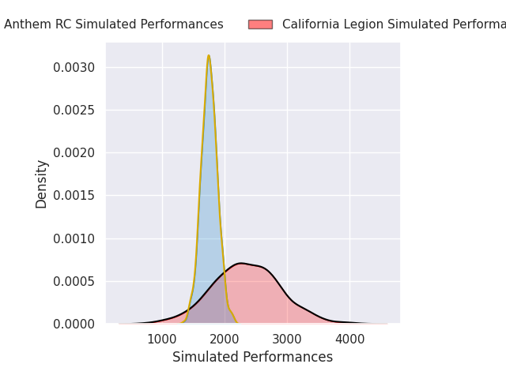

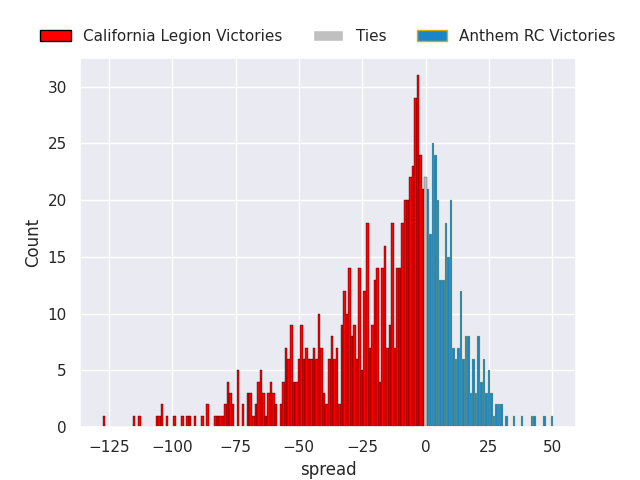

## Week 2

### Seattle Seawolves V Old Glory DC on 2026/04/03

Average Margin: Seattle Seawolves by 5.0

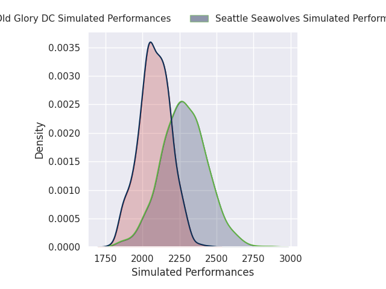

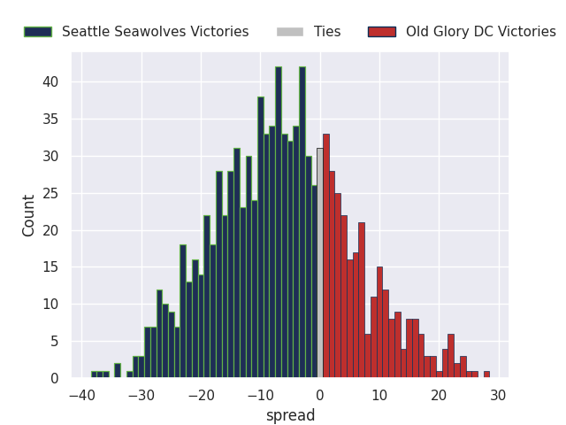

### Anthem RC V Chicago Hounds on 2026/04/04

Average Margin: Chicago Hounds by 9.1

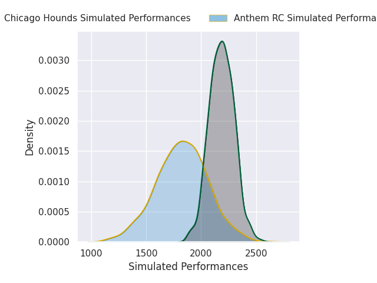
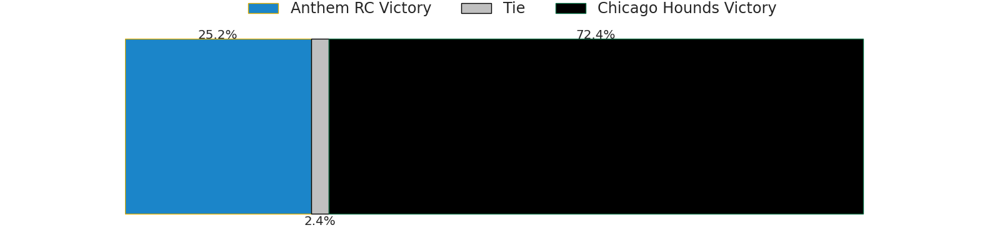
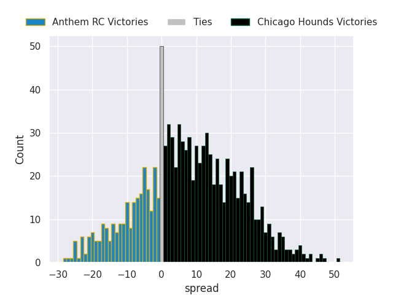

### California Legion V New England Free Jacks on 2026/04/04

Average Margin: New England Free Jacks by 4.5

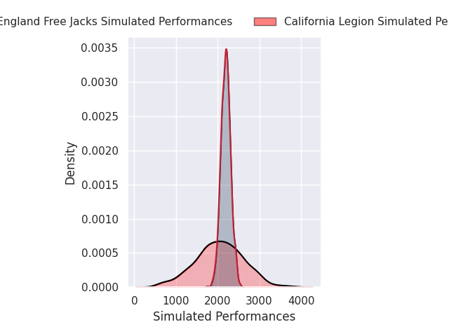

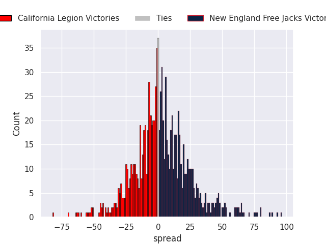

## Week 3

### New England Free Jacks V Old Glory DC on 2026/04/11

Average Margin: New England Free Jacks by 6.4

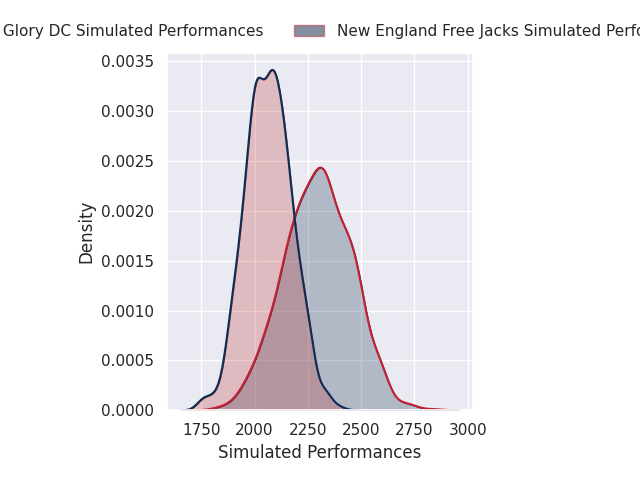

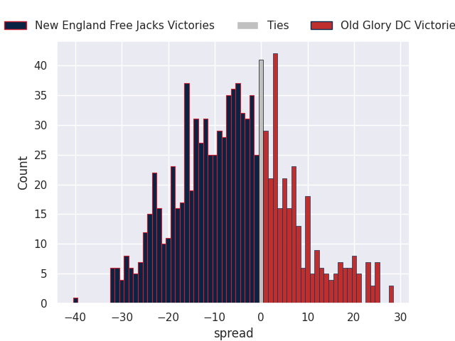

### Anthem RC V Seattle Seawolves on 2026/04/12

Average Margin: Seattle Seawolves by 8.8

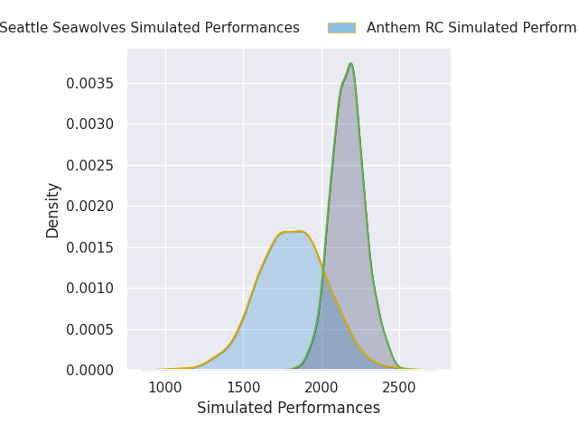

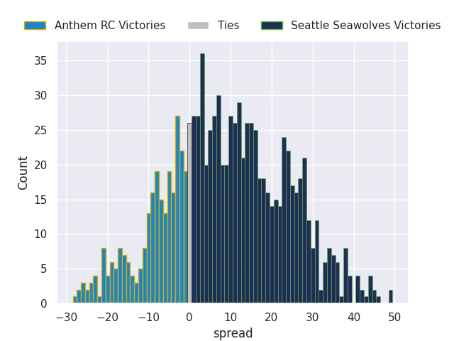

### Chicago Hounds V California Legion on 2026/04/12

Average Margin: Chicago Hounds by 8.5

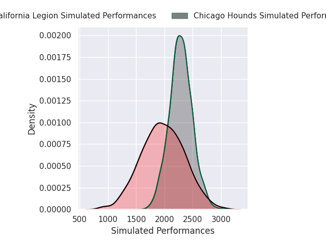

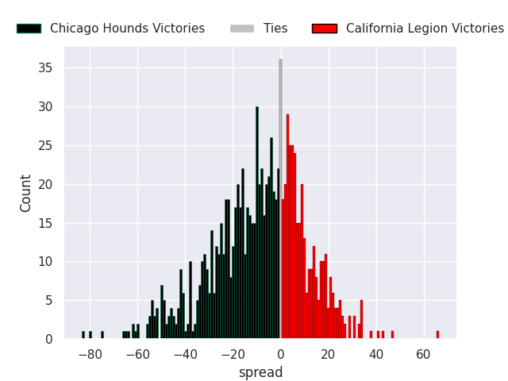

## Week 4

### Anthem RC V Old Glory DC on 2026/04/18

Average Margin: Old Glory DC by 5.7

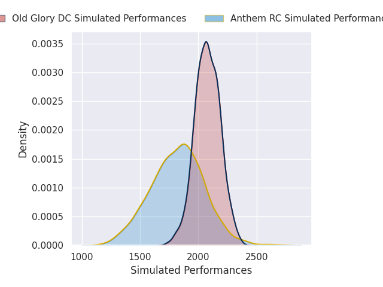
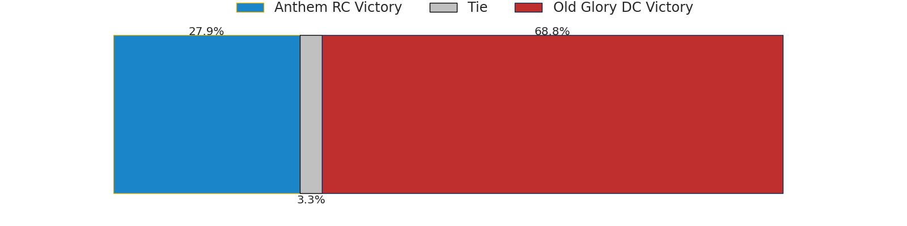
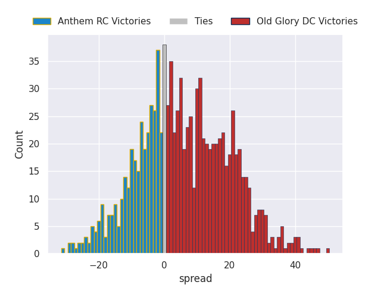

### Chicago Hounds V New England Free Jacks on 2026/04/19

Average Margin: Chicago Hounds by 1.8

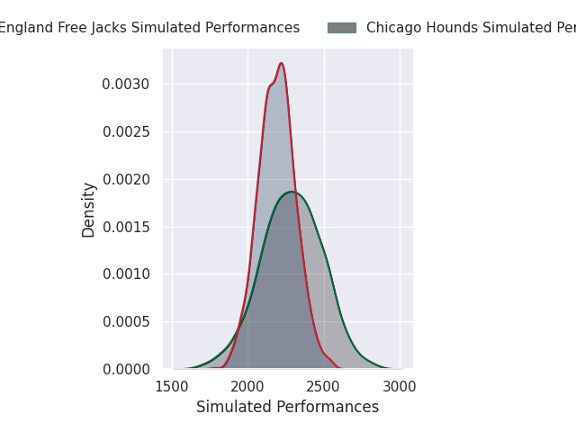

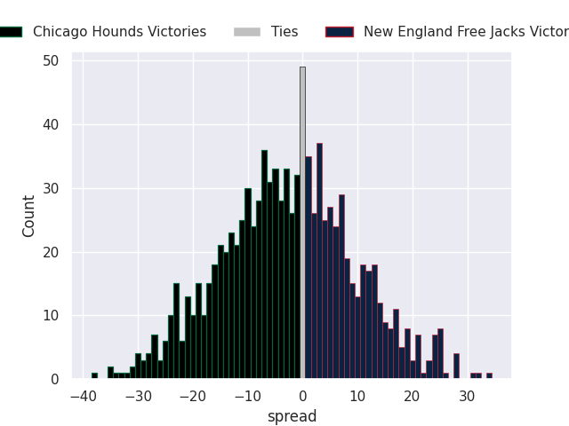

### California Legion V Seattle Seawolves on 2026/04/19

Average Margin: Seattle Seawolves by 3.5

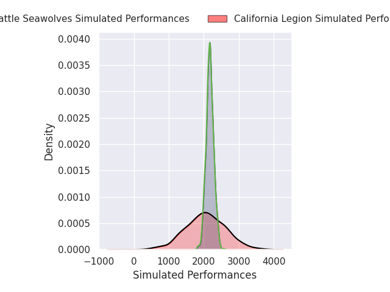

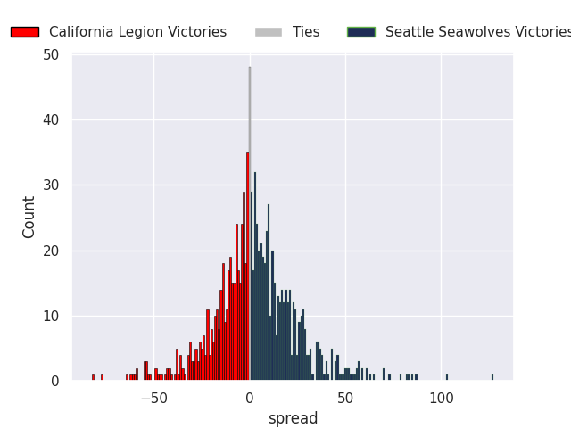

## Week 5

### Seattle Seawolves V Chicago Hounds on 2026/04/24

Average Margin: Seattle Seawolves by 1.8

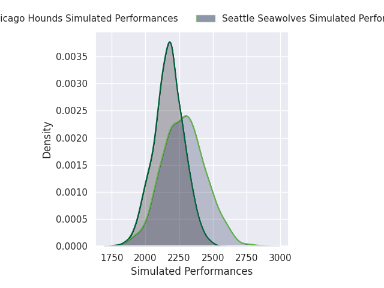

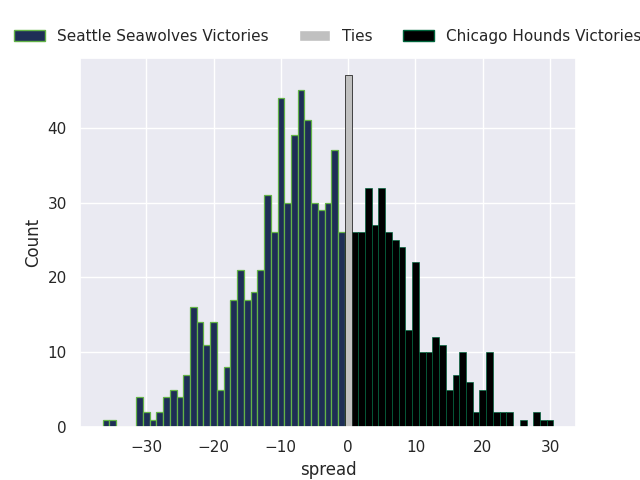

### New England Free Jacks V Anthem RC on 2026/04/26

Average Margin: New England Free Jacks by 14.4

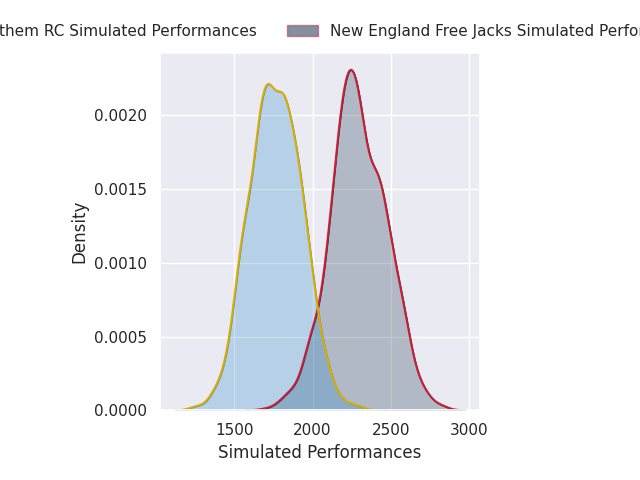

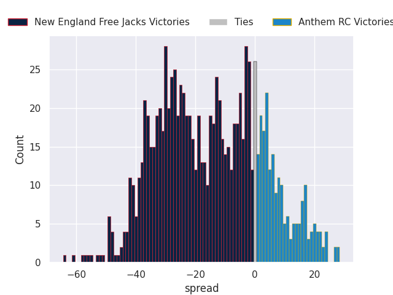

### Old Glory DC V California Legion on 2026/04/26

Average Margin: Old Glory DC by 5.6

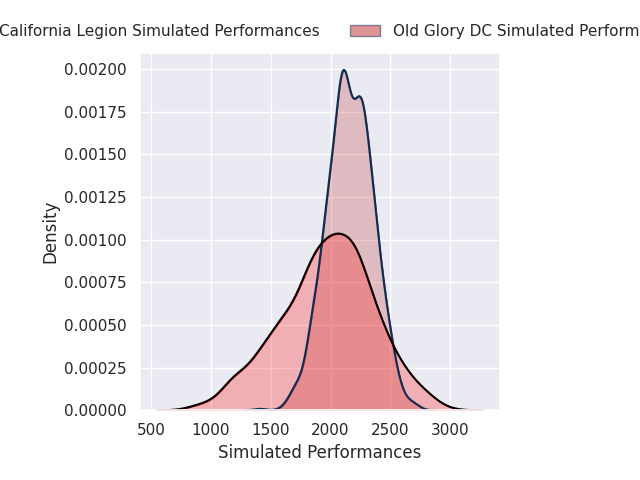
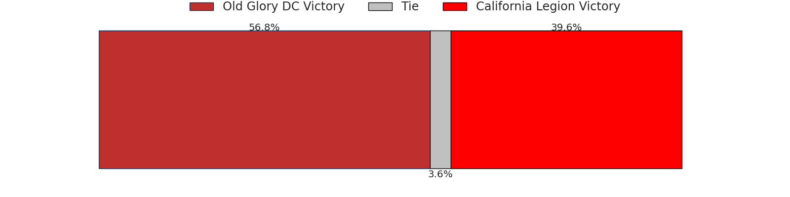
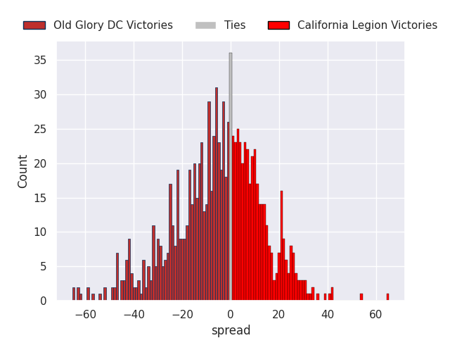

