# Team Rankings

# Standings

## Projected Remaining Table

| Club                   |   To Play |   Projected Wins |   Projected Differential |   Projected Losing Bonus Points | Projected Try Bonus Points   |   Projected Competition Points |
|:-----------------------|----------:|-----------------:|-------------------------:|--------------------------------:|:-----------------------------|-------------------------------:|
| New England Free Jacks |         8 |            4.482 |                   28.962 |                           1.445 |                              |                         20.037 |
| Seattle Seawolves      |         7 |            3.789 |                   17.766 |                           1.329 |                              |                         17.077 |
| Old Glory DC           |         6 |            2.92  |                    3.54  |                           1.154 |                              |                         13.316 |
| California Legion      |         6 |            2.714 |                   -3.999 |                           0.985 |                              |                         12.291 |
| Chicago Hounds         |         4 |            2.273 |                   16.677 |                           0.76  |                              |                         10.16  |
| Anthem RC              |         7 |            2.067 |                  -62.946 |                           1.302 |                              |                         10.094 |

## Projected Total Table

| Club                   |   Played |   Wins |   Point Differential |   Losing Bonus Points | Try Bonus Points   |   Competition Points |
|:-----------------------|---------:|-------:|---------------------:|----------------------:|:-------------------|---------------------:|
| New England Free Jacks |        8 |  4.482 |               28.962 |                 1.445 |                    |               20.037 |
| Seattle Seawolves      |        7 |  3.789 |               17.766 |                 1.329 |                    |               17.077 |
| Old Glory DC           |        6 |  2.92  |                3.54  |                 1.154 |                    |               13.316 |
| California Legion      |        6 |  2.714 |               -3.999 |                 0.985 |                    |               12.291 |
| Chicago Hounds         |        4 |  2.273 |               16.677 |                 0.76  |                    |               10.16  |
| Anthem RC              |        7 |  2.067 |              -62.946 |                 1.302 |                    |               10.094 |

# Future Predictions

## Week 1

### California Legion V Anthem RC on 2026/03/28

Average Margin: California Legion by 16.7

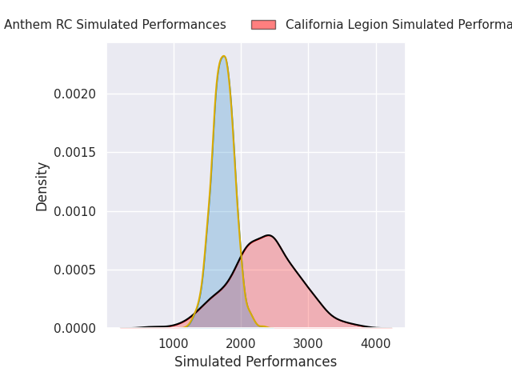
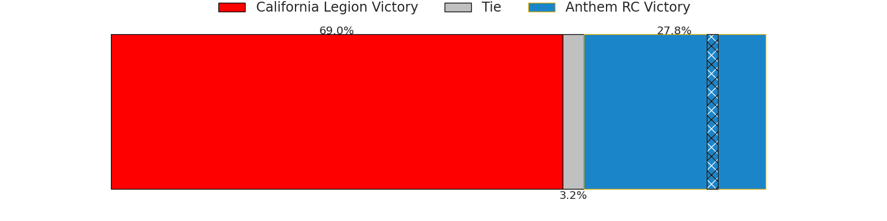
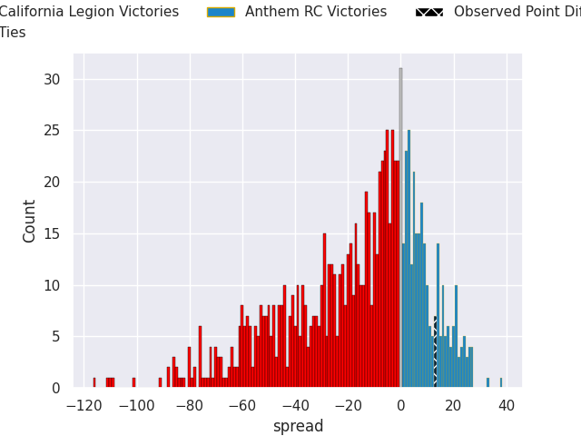

## Week 2

### Seattle Seawolves V Old Glory DC on 2026/04/03

Average Margin: Seattle Seawolves by 5.1

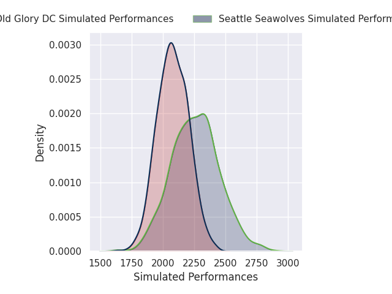

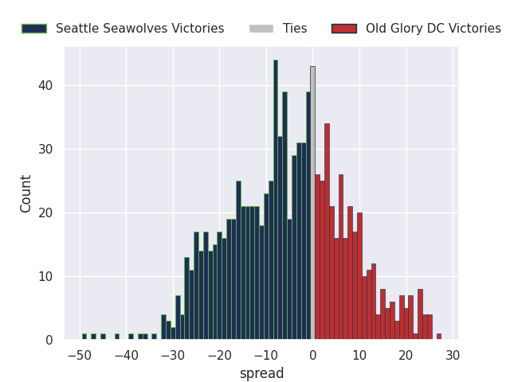

### Anthem RC V Chicago Hounds on 2026/04/04

Average Margin: Chicago Hounds by 8.0

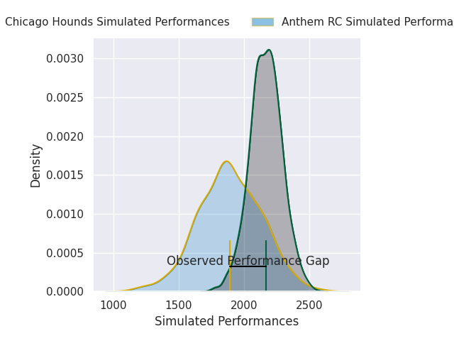
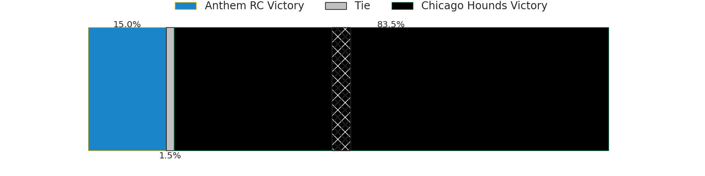
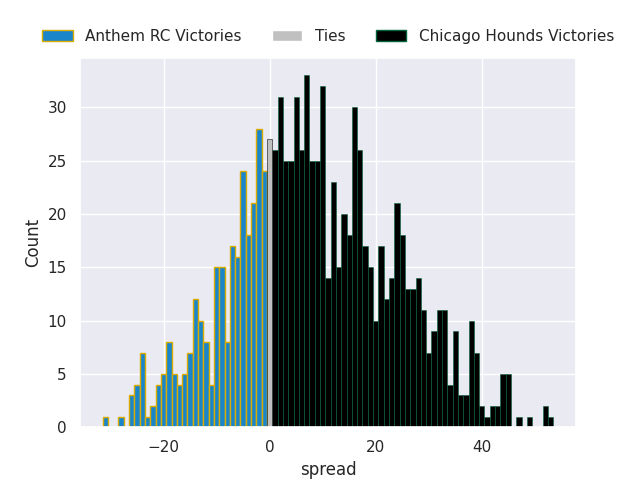

### California Legion V New England Free Jacks on 2026/04/04

Average Margin: New England Free Jacks by 2.5

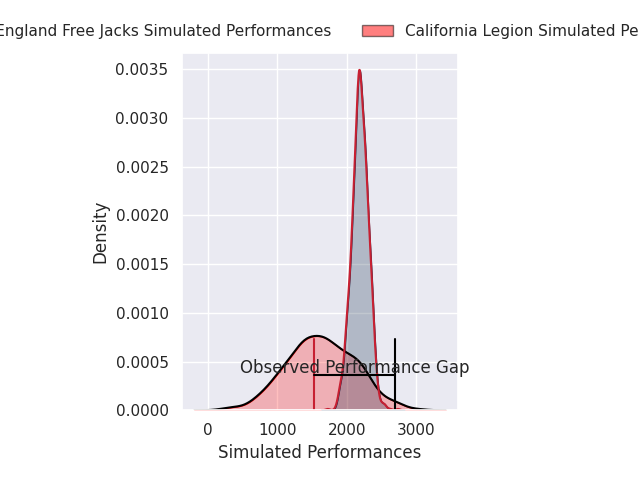
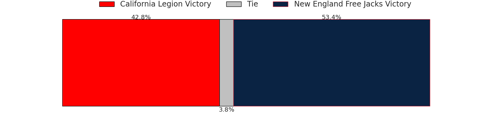
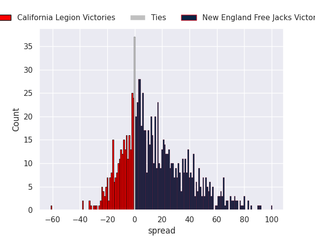

## Week 3

### New England Free Jacks V Old Glory DC on 2026/04/11

Average Margin: New England Free Jacks by 6.1

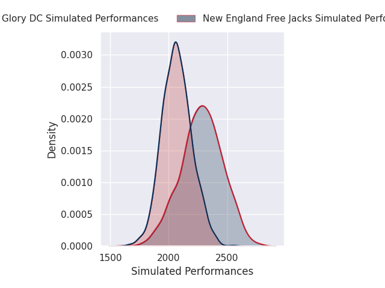

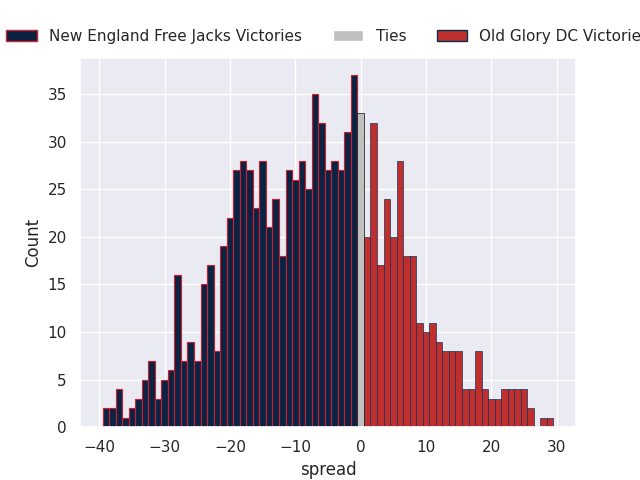

### Chicago Hounds V California Legion on 2026/04/12

Average Margin: Chicago Hounds by 8.5

### Anthem RC V Seattle Seawolves on 2026/04/12

Average Margin: Seattle Seawolves by 7.3

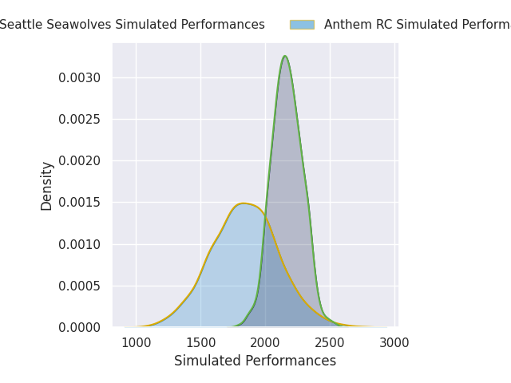
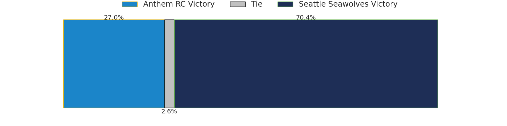
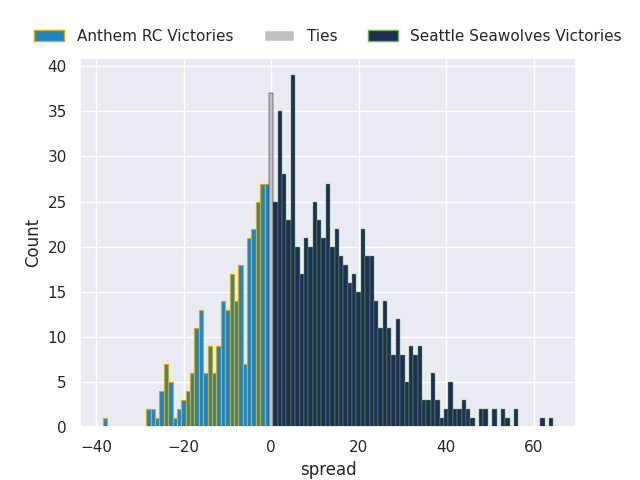

## Week 4

### Anthem RC V Old Glory DC on 2026/04/18

Average Margin: Old Glory DC by 6.2

### Chicago Hounds V New England Free Jacks on 2026/04/19

Average Margin: Chicago Hounds by 2.3

### California Legion V Seattle Seawolves on 2026/04/19

Average Margin: Seattle Seawolves by 1.8

## Week 5

### Seattle Seawolves V Chicago Hounds on 2026/04/24

Average Margin: Seattle Seawolves by 2.2

### Old Glory DC V California Legion on 2026/04/26

Average Margin: Old Glory DC by 5.6

### New England Free Jacks V Anthem RC on 2026/04/26

Average Margin: New England Free Jacks by 14.2

## Week 6

### New England Free Jacks V Seattle Seawolves on 2026/05/03

Average Margin: New England Free Jacks by 4.0

## Week 7

### New England Free Jacks V California Legion on 2026/05/09

Average Margin: New England Free Jacks by 2.3

### Old Glory DC V Seattle Seawolves on 2026/05/10

Average Margin: Old Glory DC by 1.9

## Week 8

### Old Glory DC V New England Free Jacks on 2026/05/17

Average Margin: Old Glory DC by 1.0

### Seattle Seawolves V Anthem RC on 2026/05/17

Average Margin: Seattle Seawolves by 7.3

## Week 9

### Anthem RC V New England Free Jacks on 2026/05/23

Average Margin: New England Free Jacks by 3.2

