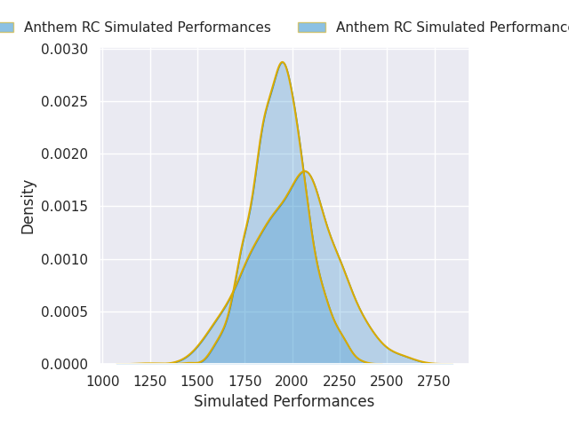
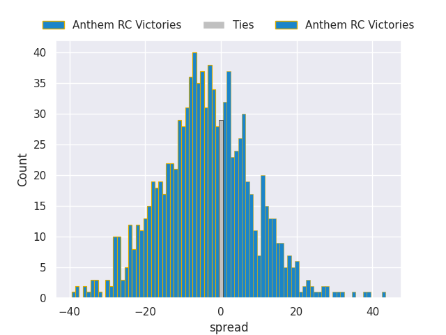
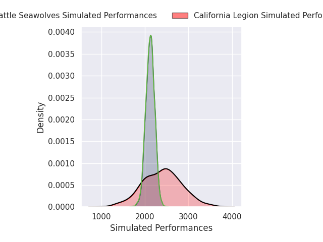
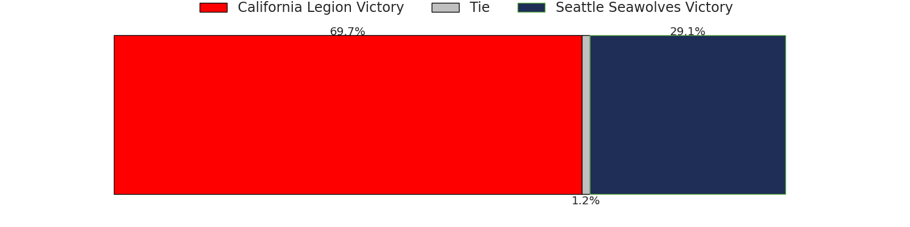
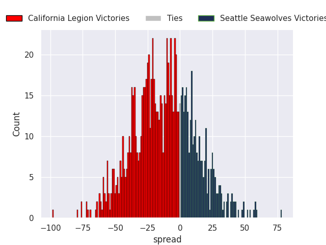
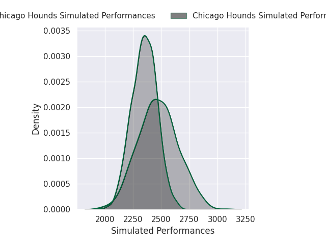
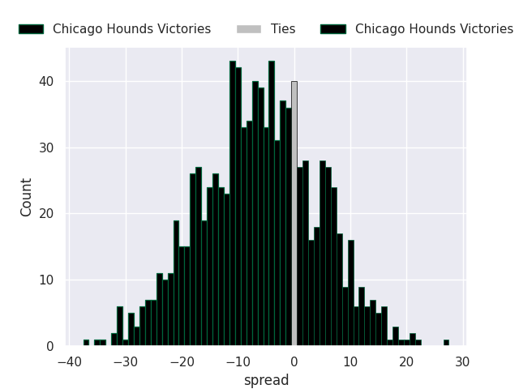

# Team Rankings

# Standings

## Current Standings

| Club                   |   Played |   Wins |   Point Differential |   Losing Bonus Points | Try Bonus Points   |   Competition Points |
|:-----------------------|---------:|-------:|---------------------:|----------------------:|:-------------------|---------------------:|
| Chicago Hounds         |        6 |      5 |                   93 |                     0 |                    |                   20 |
| California Legion      |        5 |      3 |                   23 |                     0 |                    |                   12 |
| Anthem RC              |        5 |      2 |                  -21 |                     0 |                    |                    8 |
| Seattle Seawolves      |        5 |      2 |                  -22 |                     0 |                    |                    8 |
| Old Glory DC           |        5 |      2 |                  -29 |                     0 |                    |                    8 |
| New England Free Jacks |        4 |      1 |                  -44 |                     1 |                    |                    5 |

## Projected Remaining Table

| Club                   |   To Play |   Projected Wins |   Projected Differential |   Projected Losing Bonus Points | Projected Try Bonus Points   |   Projected Competition Points |
|:-----------------------|----------:|-----------------:|-------------------------:|--------------------------------:|:-----------------------------|-------------------------------:|
| California Legion      |         6 |            5.996 |                  368.871 |                           0.001 |                              |                         23.987 |
| Chicago Hounds         |         6 |            3.669 |                   -3.919 |                           0.594 |                              |                         15.512 |
| Old Glory DC           |         5 |            2.305 |                  -57.598 |                           0.719 |                              |                         10.163 |
| Anthem RC              |         6 |            1.676 |                  -98.755 |                           0.875 |                              |                          7.787 |
| Seattle Seawolves      |         5 |            1.196 |                 -132.379 |                           0.516 |                              |                          5.456 |
| New England Free Jacks |         4 |            0.905 |                  -76.22  |                           0.672 |                              |                          4.472 |

## Projected Total Table

| Club                   |   Played |   Wins |   Point Differential |   Losing Bonus Points | Try Bonus Points   |   Competition Points |
|:-----------------------|---------:|-------:|---------------------:|----------------------:|:-------------------|---------------------:|
| California Legion      |       11 |  8.996 |              391.871 |                 0.001 |                    |               35.987 |
| Chicago Hounds         |       12 |  8.669 |               89.081 |                 0.594 |                    |               35.512 |
| Old Glory DC           |       10 |  4.305 |              -86.598 |                 0.719 |                    |               18.163 |
| Anthem RC              |       11 |  3.676 |             -119.755 |                 0.875 |                    |               15.787 |
| Seattle Seawolves      |       10 |  3.196 |             -154.379 |                 0.516 |                    |               13.456 |
| New England Free Jacks |        8 |  1.905 |             -120.22  |                 1.672 |                    |                9.472 |

# Completed Match Review

| Model | Percent Correct Predictions | Spread Error |
| ------ | ------ | ------ |
| Club Level | 67.7% | 15.7 |
| Player Level: Lineup | nan% | nan |
| Player Level: Minutes | nan% | nan |

# Future Predictions

## Week 7

### New England Free Jacks V California Legion on 2026/05/09

Average Margin: California Legion by 59.9

### Chicago Hounds V Anthem RC on 2026/05/10

Average Margin: Chicago Hounds by 25.0

### Old Glory DC V Seattle Seawolves on 2026/05/10

Average Margin: Old Glory DC by 3.0

## Week 8

### California Legion V Chicago Hounds on 2026/05/16

Average Margin: California Legion by 55.2

### Old Glory DC V New England Free Jacks on 2026/05/17

Average Margin: Old Glory DC by 6.8

### Anthem RC V Seattle Seawolves on 2026/05/17

Average Margin: Anthem RC by 4.0

## Week 9

### Anthem RC V New England Free Jacks on 2026/05/23

Average Margin: Anthem RC by 0.7

### California Legion V Old Glory DC on 2026/05/24

Average Margin: California Legion by 69.1

### Chicago Hounds V Seattle Seawolves on 2026/05/24

Average Margin: Chicago Hounds by 17.8

## Week 10

### Old Glory DC V Chicago Hounds on 2026/05/30

Average Margin: Chicago Hounds by 8.4

### Seattle Seawolves V New England Free Jacks on 2026/05/31

Average Margin: Seattle Seawolves by 8.8

### Anthem RC V California Legion on 2026/05/31

Average Margin: California Legion by 64.4

## Week 11

### California Legion V Seattle Seawolves on 2026/06/03

Average Margin: California Legion by 66.2

### Old Glory DC V Anthem RC on 2026/06/06

Average Margin: Old Glory DC by 10.1

### Seattle Seawolves V California Legion on 2026/06/07

Average Margin: California Legion by 54.1

### Chicago Hounds V New England Free Jacks on 2026/06/07

Average Margin: Chicago Hounds by 6.0

