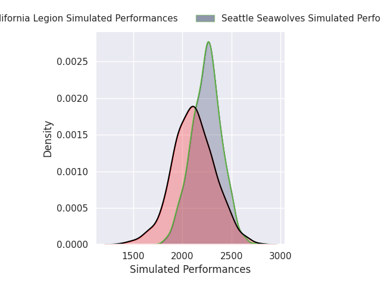
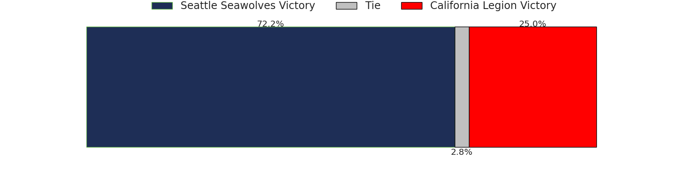
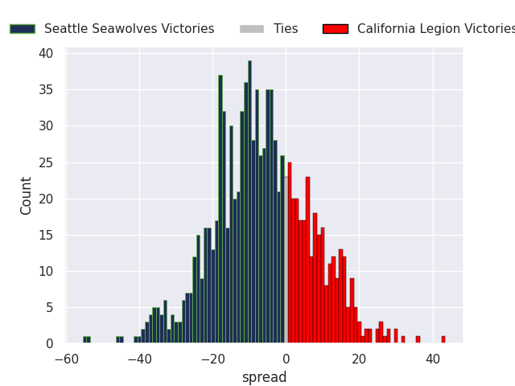

# Team Rankings

# Standings

## Current Standings

| Club                   |   Played |   Wins |   Point Differential |   Losing Bonus Points | Try Bonus Points   |   Competition Points |
|:-----------------------|---------:|-------:|---------------------:|----------------------:|:-------------------|---------------------:|
| Chicago Hounds         |       11 |     10 |                  185 |                     0 |                    |                   40 |
| Seattle Seawolves      |       10 |      6 |                    1 |                     0 |                    |                   24 |
| California Legion      |       10 |      5 |                   55 |                     1 |                    |                   21 |
| Old Glory DC           |       10 |      4 |                  -58 |                     2 |                    |                   18 |
| New England Free Jacks |        9 |      3 |                  -51 |                     2 |                    |                   14 |
| Anthem RC              |       10 |      2 |                 -132 |                     0 |                    |                    8 |

## Projected Remaining Table

| Club              |   To Play |   Projected Wins |   Projected Differential |   Projected Losing Bonus Points | Projected Try Bonus Points   |   Projected Competition Points |
|:------------------|----------:|-----------------:|-------------------------:|--------------------------------:|:-----------------------------|-------------------------------:|
| Seattle Seawolves |         2 |            1.013 |                   -4.581 |                           0.25  |                              |                          4.382 |
| California Legion |         2 |            0.947 |                    4.581 |                           0.318 |                              |                          4.186 |

## Projected Total Table

| Club                   |   Played |   Wins |   Point Differential |   Losing Bonus Points | Try Bonus Points   |   Competition Points |
|:-----------------------|---------:|-------:|---------------------:|----------------------:|:-------------------|---------------------:|
| Chicago Hounds         |       11 | 10     |              185     |                 0     |                    |               40     |
| Seattle Seawolves      |       12 |  7.013 |               -3.581 |                 0.25  |                    |               28.382 |
| California Legion      |       12 |  5.947 |               59.581 |                 1.318 |                    |               25.186 |
| Old Glory DC           |       10 |  4     |              -58     |                 2     |                    |               18     |
| New England Free Jacks |        9 |  3     |              -51     |                 2     |                    |               14     |
| Anthem RC              |       10 |  2     |             -132     |                 0     |                    |                8     |

# Completed Match Review

| Model | Percent Correct Predictions | Spread Error |
| ------ | ------ | ------ |
| Club Level | 59.4% | 20.9 |
| Player Level: Lineup | nan% | nan |
| Player Level: Minutes | nan% | nan |

# Future Predictions

## Week 12

### California Legion V Seattle Seawolves on 2026/06/03

Average Margin: California Legion by 12.0

## Week 13

### Seattle Seawolves V California Legion on 2026/06/14

Average Margin: Seattle Seawolves by 7.4

