# Team Rankings

# Standings

## Current Standings

| Club                   |   Played |   Wins |   Point Differential |   Losing Bonus Points | Try Bonus Points   |   Competition Points |
|:-----------------------|---------:|-------:|---------------------:|----------------------:|:-------------------|---------------------:|
| Anthem RC              |        3 |      2 |                    8 |                     0 |                    |                    8 |
| California Legion      |        2 |      1 |                   25 |                     0 |                    |                    4 |
| Chicago Hounds         |        1 |      1 |                   14 |                     0 |                    |                    4 |
| Seattle Seawolves      |        2 |      1 |                    8 |                     0 |                    |                    4 |
| Old Glory DC           |        2 |      1 |                  -15 |                     0 |                    |                    4 |
| New England Free Jacks |        2 |      0 |                  -40 |                     1 |                    |                    1 |

## Projected Remaining Table

| Club                   |   To Play |   Projected Wins |   Projected Differential |   Projected Losing Bonus Points | Projected Try Bonus Points   |   Projected Competition Points |
|:-----------------------|----------:|-----------------:|-------------------------:|--------------------------------:|:-----------------------------|-------------------------------:|
| Chicago Hounds         |         9 |            5.788 |                   64.488 |                           1.333 |                              |                         24.931 |
| California Legion      |         8 |            4.455 |                   19.394 |                           0.842 |                              |                         18.922 |
| Old Glory DC           |         8 |            3.988 |                   -6.101 |                           1.383 |                              |                         17.767 |
| Seattle Seawolves      |         8 |            3.924 |                   -4.133 |                           1.455 |                              |                         17.547 |
| New England Free Jacks |         8 |            3.685 |                   -5.765 |                           1.612 |                              |                         16.79  |
| Anthem RC              |         7 |            1.598 |                  -67.883 |                           1.267 |                              |                          7.935 |

## Projected Total Table

| Club                   |   Played |   Wins |   Point Differential |   Losing Bonus Points | Try Bonus Points   |   Competition Points |
|:-----------------------|---------:|-------:|---------------------:|----------------------:|:-------------------|---------------------:|
| Chicago Hounds         |       10 |  6.788 |               78.488 |                 1.333 |                    |               28.931 |
| California Legion      |       10 |  5.455 |               44.394 |                 0.842 |                    |               22.922 |
| Old Glory DC           |       10 |  4.988 |              -21.101 |                 1.383 |                    |               21.767 |
| Seattle Seawolves      |       10 |  4.924 |                3.867 |                 1.455 |                    |               21.547 |
| New England Free Jacks |       10 |  3.685 |              -45.765 |                 2.612 |                    |               17.79  |
| Anthem RC              |       10 |  3.598 |              -59.883 |                 1.267 |                    |               15.935 |

# Completed Match Review

| Model | Percent Correct Predictions | Spread Error |
| ------ | ------ | ------ |
| Club Level | 70.0% | 12.1 |
| Player Level: Lineup | nan% | nan |
| Player Level: Minutes | nan% | nan |

# Future Predictions

## Week 4

### Chicago Hounds V California Legion on 2026/04/12

Average Margin: Chicago Hounds by 36.2

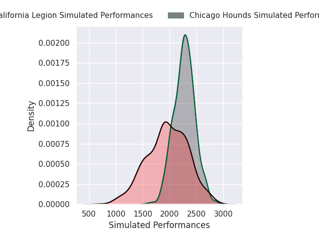
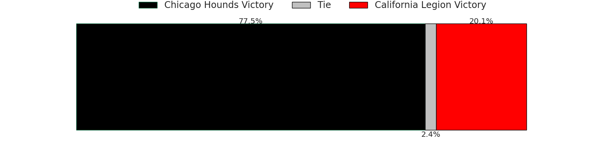
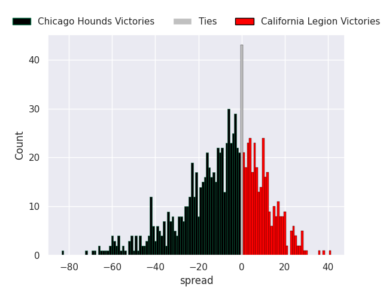

## Week 5

### Anthem RC V Old Glory DC on 2026/04/18

Average Margin: Old Glory DC by 3.2

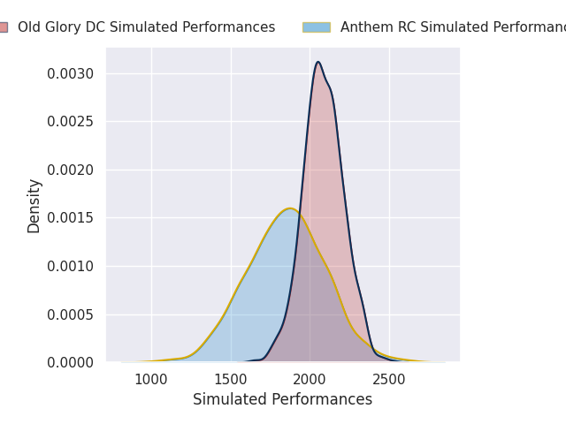
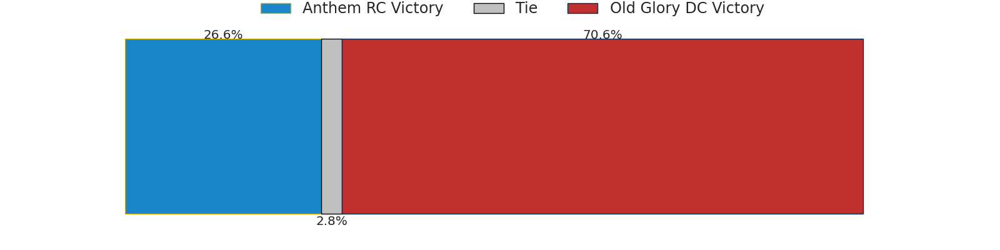
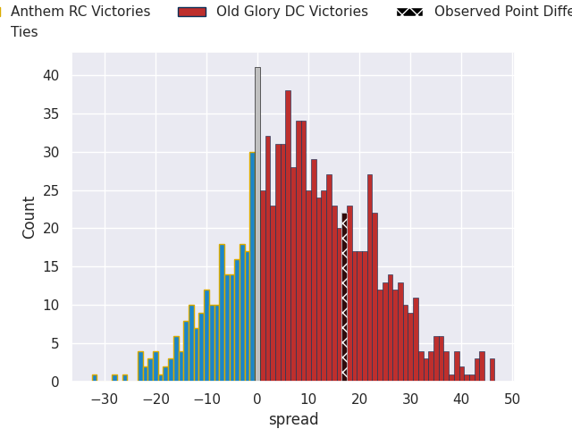

### Chicago Hounds V New England Free Jacks on 2026/04/19

Average Margin: Chicago Hounds by 9.5

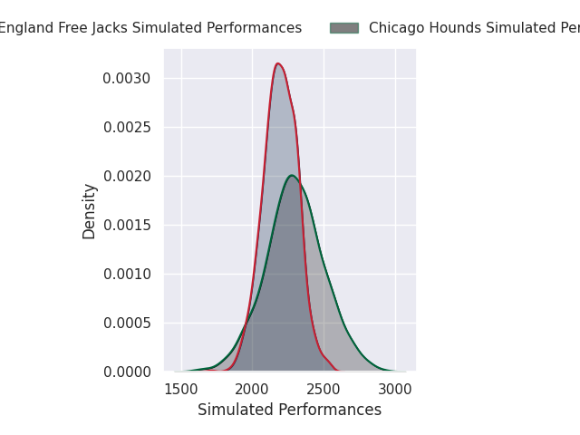
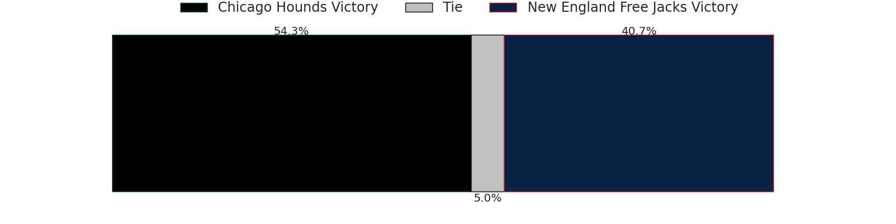
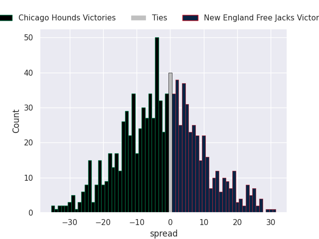

### California Legion V Seattle Seawolves on 2026/04/19

Average Margin: California Legion by 16.0

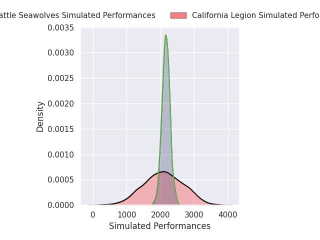

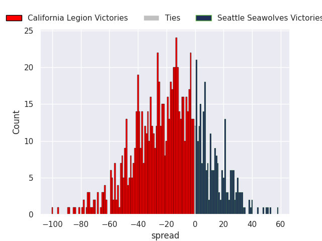

## Week 6

### Seattle Seawolves V Chicago Hounds on 2026/04/24

Average Margin: Seattle Seawolves by 2.4

### Old Glory DC V California Legion on 2026/04/26

Average Margin: California Legion by 7.7

### New England Free Jacks V Anthem RC on 2026/04/26

Average Margin: New England Free Jacks by 11.8

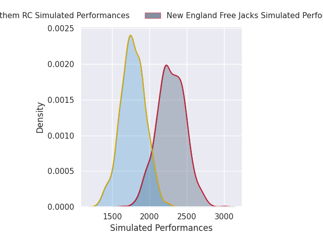

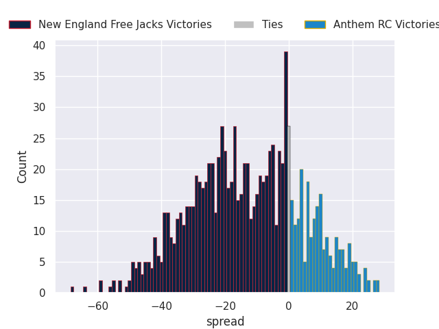

## Week 7

### New England Free Jacks V Seattle Seawolves on 2026/05/03

Average Margin: New England Free Jacks by 2.4

### Chicago Hounds V Old Glory DC on 2026/05/03

Average Margin: Chicago Hounds by 9.1

## Week 8

### New England Free Jacks V California Legion on 2026/05/09

Average Margin: California Legion by 2.7

### Chicago Hounds V Anthem RC on 2026/05/10

Average Margin: Chicago Hounds by 16.4

### Old Glory DC V Seattle Seawolves on 2026/05/10

Average Margin: Old Glory DC by 3.1

## Week 9

### California Legion V Chicago Hounds on 2026/05/16

Average Margin: California Legion by 9.2

### Old Glory DC V New England Free Jacks on 2026/05/17

Average Margin: Old Glory DC by 4.8

### Seattle Seawolves V Anthem RC on 2026/05/17

Average Margin: Seattle Seawolves by 13.4

## Week 10

### Anthem RC V New England Free Jacks on 2026/05/23

Average Margin: New England Free Jacks by 2.9

### Chicago Hounds V Seattle Seawolves on 2026/05/24

Average Margin: Chicago Hounds by 8.2

### California Legion V Old Glory DC on 2026/05/24

Average Margin: California Legion by 13.1

## Week 11

### Old Glory DC V Chicago Hounds on 2026/05/30

Average Margin: Old Glory DC by 2.0

### Anthem RC V California Legion on 2026/05/31

Average Margin: California Legion by 9.5

### Seattle Seawolves V New England Free Jacks on 2026/05/31

Average Margin: Seattle Seawolves by 7.1

## Week 12

### Old Glory DC V Anthem RC on 2026/06/06

Average Margin: Old Glory DC by 10.7

### Seattle Seawolves V California Legion on 2026/06/07

Average Margin: Seattle Seawolves by 2.6

### New England Free Jacks V Chicago Hounds on 2026/06/07

Average Margin: New England Free Jacks by 1.2

