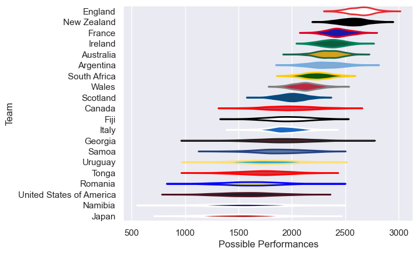

---  
title: "Men's Rugby World Cup 2003 Status"  
date: 2025-07-28 6:00:00 -0500  
categories: model review projection  
layout: article  
aside:  
    toc: true  
---
# Current Team Rankings

# Standings

## Current Standings

| Club                     |   Played |   Wins |   Point Differential |   Losing Bonus Points |   Try Bonus Points |   Competition Points |
|:-------------------------|---------:|-------:|---------------------:|----------------------:|-------------------:|---------------------:|
| England                  |        7 |      7 |                  239 |                     0 |                    |                   28 |
| Australia                |        7 |      6 |                  267 |                     1 |                    |                   25 |
| New Zealand              |        7 |      6 |                  260 |                     0 |                  1 |                   25 |
| France                   |        7 |      5 |                  112 |                     0 |                    |                   20 |
| Ireland                  |        5 |      3 |                   63 |                     1 |                    |                   13 |
| South Africa             |        5 |      3 |                  104 |                     0 |                    |                   12 |
| Wales                    |        5 |      3 |                   23 |                     0 |                    |                   12 |
| Scotland                 |        5 |      3 |                  -12 |                     0 |                    |                   12 |
| Argentina                |        4 |      2 |                   83 |                     1 |                    |                    9 |
| Fiji                     |        4 |      2 |                  -16 |                     1 |                    |                    9 |
| Samoa                    |        4 |      2 |                   21 |                     0 |                    |                    8 |
| Italy                    |        4 |      2 |                  -46 |                     0 |                    |                    8 |
| United States of America |        4 |      1 |                  -39 |                     1 |                    |                    5 |
| Canada                   |        4 |      1 |                  -81 |                     1 |                    |                    5 |
| Romania                  |        4 |      1 |                 -127 |                     0 |                    |                    4 |
| Uruguay                  |        4 |      1 |                 -199 |                     0 |                    |                    4 |
| Tonga                    |        4 |      0 |                 -132 |                     1 |                    |                    1 |
| Japan                    |        4 |      0 |                  -84 |                     0 |                    |                    0 |
| Georgia                  |        4 |      0 |                 -154 |                     0 |                    |                    0 |
| Namibia                  |        4 |      0 |                 -282 |                     0 |                    |                    0 |

# Completed Match Review

| Model | Percent Correct Predictions | Spread Error |
| ------ | ------ | ------ |
| Club Level | 87.5% | 19.6 |
| Player Level: Lineup | nan% | nan |
| Player Level: Minutes | nan% | nan |

