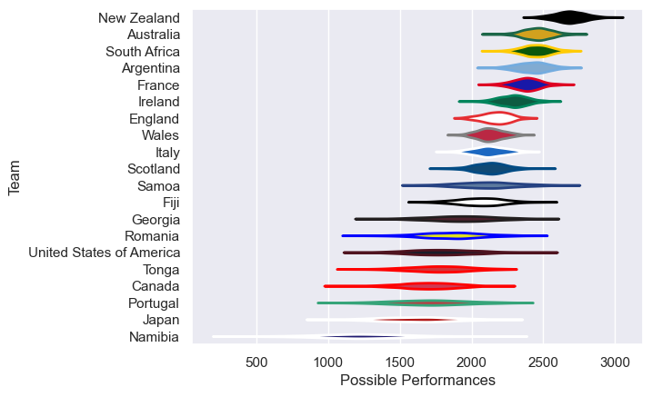

---  
title: "Men's Rugby World Cup 2007"  
date: 2025-07-29 6:00:00 -0500  
categories: model review projection  
layout: article  
aside:  
    toc: true  
---
# Current Team Rankings

# Standings

## Current Standings

| Club                     |   Played |   Wins |   Point Differential |   Losing Bonus Points | Try Bonus Points   |   Competition Points |
|:-------------------------|---------:|-------:|---------------------:|----------------------:|:-------------------|---------------------:|
| South Africa             |        7 |      7 |                  192 |                     0 |                    |                   28 |
| Argentina                |        7 |      6 |                  116 |                     0 |                    |                   24 |
| England                  |        7 |      5 |                   18 |                     0 |                    |                   20 |
| France                   |        7 |      4 |                  124 |                     2 |                    |                   18 |
| New Zealand              |        5 |      4 |                  272 |                     1 |                    |                   17 |
| Australia                |        5 |      4 |                  172 |                     1 |                    |                   17 |
| Scotland                 |        5 |      3 |                   44 |                     1 |                    |                   13 |
| Fiji                     |        5 |      3 |                  -39 |                     0 |                    |                   12 |
| Wales                    |        4 |      2 |                   63 |                     1 |                    |                    9 |
| Tonga                    |        4 |      2 |                   -7 |                     1 |                    |                    9 |
| Italy                    |        4 |      2 |                  -32 |                     1 |                    |                    9 |
| Ireland                  |        4 |      2 |                  -18 |                     0 |                    |                    8 |
| Georgia                  |        4 |      1 |                  -61 |                     1 |                    |                    5 |
| Samoa                    |        4 |      1 |                  -74 |                     1 |                    |                    5 |
| Romania                  |        4 |      1 |                 -121 |                     1 |                    |                    5 |
| Japan                    |        4 |      0 |                 -146 |                     1 |                    |                    3 |
| Canada                   |        4 |      0 |                  -69 |                     0 |                    |                    2 |
| United States of America |        4 |      0 |                  -81 |                     1 |                    |                    1 |
| Portugal                 |        4 |      0 |                 -171 |                     1 |                    |                    1 |
| Namibia                  |        4 |      0 |                 -182 |                     0 |                    |                    0 |

# Completed Match Review

| Model | Percent Correct Predictions | Spread Error |
| ------ | ------ | ------ |
| Club Level | 79.2% | 16.9 |
| Player Level: Lineup | nan% | nan |
| Player Level: Minutes | nan% | nan |

