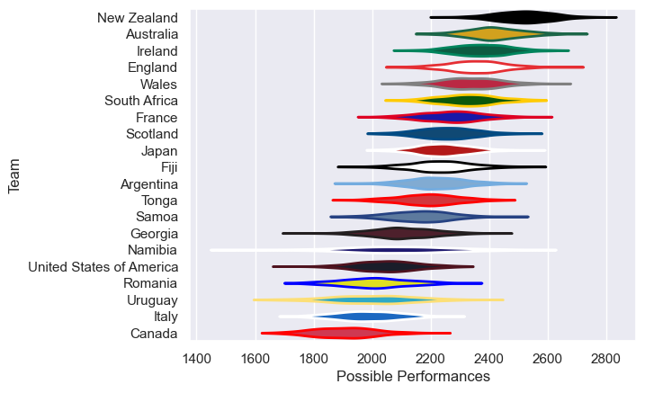

---  
title: "Men's Rugby World Cup 2015"  
date: 2025-07-29 6:00:00 -0500  
categories: model review projection  
layout: article  
aside:  
    toc: true  
---
# Current Team Rankings

# Standings

## Current Standings

| Club                     |   Played |   Wins |   Point Differential |   Losing Bonus Points |   Try Bonus Points |   Competition Points |
|:-------------------------|---------:|-------:|---------------------:|----------------------:|-------------------:|---------------------:|
| Argentina                |        9 |      4 |                  132 |                     0 |                  5 |                   29 |
| New Zealand              |        6 |      6 |                  176 |                     0 |                  4 |                   28 |
| Australia                |        9 |      3 |                   97 |                     0 |                  2 |                   26 |
| France                   |        6 |      3 |                   23 |                     0 |                  2 |                   18 |
| South Africa             |        6 |      2 |                  100 |                     2 |                  3 |                   17 |
| Ireland                  |        4 |      3 |                   61 |                     0 |                  2 |                   14 |
| Scotland                 |        4 |      2 |                   58 |                     0 |                  2 |                   14 |
| Wales                    |        3 |      3 |                   58 |                     0 |                  1 |                   13 |
| Japan                    |        4 |      3 |                   -2 |                     0 |                    |                   12 |
| England                  |        4 |      2 |                   58 |                     1 |                  1 |                   10 |
| Italy                    |        5 |      1 |                  -24 |                     1 |                  1 |                   10 |
| Samoa                    |        6 |      0 |                  -61 |                     0 |                  1 |                    9 |
| Georgia                  |        5 |      1 |                  -71 |                     0 |                    |                    8 |
| Tonga                    |        4 |      1 |                  -60 |                     1 |                  1 |                    6 |
| Fiji                     |        5 |      0 |                  -49 |                     0 |                  1 |                    5 |
| Canada                   |        5 |      0 |                  -71 |                     1 |                    |                    5 |
| Romania                  |        2 |      0 |                  -61 |                     0 |                    |                    0 |
| United States of America |        3 |      0 |                  -97 |                     0 |                    |                    0 |
| Namibia                  |        3 |      0 |                 -103 |                     0 |                    |                    0 |
| Uruguay                  |        3 |      0 |                 -164 |                     0 |                    |                    0 |

# Completed Match Review

| Model | Percent Correct Predictions | Spread Error |
| ------ | ------ | ------ |
| Club Level | 58.3% | 14.0 |
| Player Level: Lineup | nan% | nan |
| Player Level: Minutes | nan% | nan |

