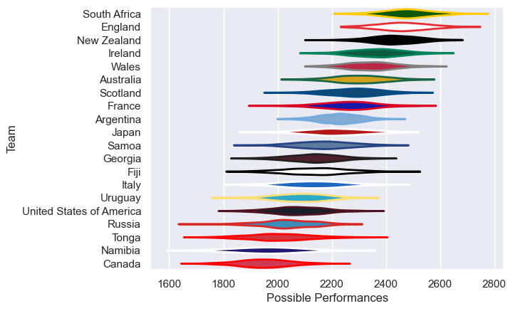

---  
title: "Men's Rugby World Cup 2019"  
date: 2025-07-29 6:00:00 -0500  
categories: model review projection  
layout: article  
aside:  
    toc: true  
---
# Current Team Rankings

# Standings

## Current Standings

| Club                     |   Played |   Wins |   Point Differential |   Losing Bonus Points |   Try Bonus Points |   Competition Points |
|:-------------------------|---------:|-------:|---------------------:|----------------------:|-------------------:|---------------------:|
| South Africa             |        7 |      6 |                  195 |                     0 |                  3 |                   27 |
| New Zealand              |        7 |      5 |                  178 |                     0 |                  4 |                   26 |
| England                  |        7 |      5 |                  115 |                     0 |                  4 |                   26 |
| Wales                    |        7 |      5 |                   42 |                     1 |                  3 |                   24 |
| Japan                    |        5 |      4 |                   30 |                     0 |                  3 |                   19 |
| Ireland                  |        5 |      3 |                   62 |                     1 |                  3 |                   16 |
| Australia                |        5 |      3 |                   44 |                     1 |                  3 |                   16 |
| France                   |        5 |      3 |                   27 |                     1 |                  1 |                   16 |
| Italy                    |        4 |      2 |                   20 |                     0 |                  2 |                   12 |
| Argentina                |        4 |      2 |                   15 |                     1 |                  2 |                   11 |
| Scotland                 |        4 |      2 |                   64 |                     1 |                  1 |                   10 |
| Fiji                     |        4 |      1 |                    2 |                     1 |                  2 |                    7 |
| Tonga                    |        4 |      1 |                  -38 |                     1 |                  1 |                    6 |
| Georgia                  |        4 |      1 |                  -57 |                     0 |                  1 |                    5 |
| Samoa                    |        4 |      1 |                  -70 |                     0 |                  1 |                    5 |
| Uruguay                  |        4 |      1 |                  -80 |                     0 |                    |                    4 |
| Namibia                  |        4 |      0 |                 -141 |                     0 |                    |                    2 |
| Canada                   |        4 |      0 |                 -163 |                     0 |                    |                    2 |
| United States of America |        4 |      0 |                 -104 |                     0 |                    |                    0 |
| Russia                   |        4 |      0 |                 -141 |                     0 |                    |                    0 |

# Completed Match Review

| Model | Percent Correct Predictions | Spread Error |
| ------ | ------ | ------ |
| Club Level | 77.1% | 16.1 |
| Player Level: Lineup | nan% | nan |
| Player Level: Minutes | nan% | nan |

