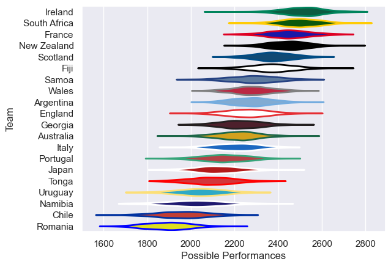

---  
title: "Men's Rugby World Cup 2023"  
date: 2025-07-29 6:00:00 -0500  
categories: model review projection  
layout: article  
aside:  
    toc: true  
---
# Current Team Rankings

# Standings

## Current Standings

| Club         |   Played |   Wins |   Point Differential |   Losing Bonus Points |   Try Bonus Points |   Competition Points |
|:-------------|---------:|-------:|---------------------:|----------------------:|-------------------:|---------------------:|
| Ireland      |        4 |      4 |                  144 |                     0 |                  3 |                   19 |
| Wales        |        4 |      4 |                   84 |                     0 |                  3 |                   19 |
| France       |        4 |      4 |                  178 |                     0 |                  2 |                   18 |
| England      |        4 |      4 |                  111 |                     0 |                  2 |                   18 |
| New Zealand  |        4 |      3 |                  206 |                     0 |                  3 |                   15 |
| South Africa |        4 |      3 |                  117 |                     1 |                  2 |                   15 |
| Argentina    |        4 |      3 |                   58 |                     0 |                  2 |                   14 |
| Fiji         |        4 |      2 |                    5 |                     2 |                  1 |                   11 |
| Australia    |        4 |      2 |                   -1 |                     1 |                  2 |                   11 |
| Scotland     |        4 |      2 |                   75 |                     0 |                  2 |                   10 |
| Italy        |        4 |      2 |                  -67 |                     0 |                  2 |                   10 |
| Japan        |        4 |      2 |                    2 |                     0 |                  1 |                    9 |
| Samoa        |        4 |      1 |                   17 |                     2 |                  1 |                    7 |
| Portugal     |        4 |      1 |                  -39 |                     0 |                    |                    6 |
| Tonga        |        4 |      1 |                  -81 |                     0 |                  1 |                    5 |
| Uruguay      |        4 |      1 |                  -99 |                     0 |                  1 |                    5 |
| Georgia      |        4 |      0 |                  -49 |                     1 |                    |                    3 |
| Chile        |        4 |      0 |                 -188 |                     0 |                    |                    0 |
| Namibia      |        4 |      0 |                 -218 |                     0 |                    |                    0 |
| Romania      |        4 |      0 |                 -255 |                     0 |                    |                    0 |

## Projected Playoff Results

|              | Reach Quarterfinal   | Win Quarterfinal   | Reach Semifinal   | Win Semifinal   | Reach Final   | Win Final   |
|:-------------|:---------------------|:-------------------|:------------------|:----------------|:--------------|:------------|
| South Africa | 100.0 %              | 100.0 %            | 100.0 %           | 100.0 %         | 100.0 %       | 100.0 %     |
| New Zealand  | 100.0 %              | 100.0 %            | 100.0 %           | 100.0 %         | 100.0 %       | 0.0 %       |
| England      | 100.0 %              | 100.0 %            | 100.0 %           | 0.0 %           | 0.0 %         | 0.0 %       |
| Argentina    | 100.0 %              | 100.0 %            | 100.0 %           | 0.0 %           | 0.0 %         | 0.0 %       |
| Wales        | 100.0 %              | 0.0 %              | 0.0 %             | 0.0 %           | 0.0 %         | 0.0 %       |
| Ireland      | 100.0 %              | 0.0 %              | 0.0 %             | 0.0 %           | 0.0 %         | 0.0 %       |
| France       | 100.0 %              | 0.0 %              | 0.0 %             | 0.0 %           | 0.0 %         | 0.0 %       |
| Fiji         | 100.0 %              | 0.0 %              | 0.0 %             | 0.0 %           | 0.0 %         | 0.0 %       |

# Completed Match Review

| Model | Percent Correct Predictions | Spread Error |
| ------ | ------ | ------ |
| Club Level | 75.0% | 19.6 |
| Player Level: Lineup | nan% | nan |
| Player Level: Minutes | nan% | nan |

