# Team Rankings

# Standings

## Current Standings

### Pool A

| Club   | Played   | Wins   | Point Differential   | Losing Bonus Points   | Try Bonus Points   | Competition Points   |
|--------|----------|--------|----------------------|-----------------------|--------------------|----------------------|

### Pool B

| Club   | Played   | Wins   | Point Differential   | Losing Bonus Points   | Try Bonus Points   | Competition Points   |
|--------|----------|--------|----------------------|-----------------------|--------------------|----------------------|

### Pool C

| Club   | Played   | Wins   | Point Differential   | Losing Bonus Points   | Try Bonus Points   | Competition Points   |
|--------|----------|--------|----------------------|-----------------------|--------------------|----------------------|

### Pool D

| Club   | Played   | Wins   | Point Differential   | Losing Bonus Points   | Try Bonus Points   | Competition Points   |
|--------|----------|--------|----------------------|-----------------------|--------------------|----------------------|

### Pool E

| Club   | Played   | Wins   | Point Differential   | Losing Bonus Points   | Try Bonus Points   | Competition Points   |
|--------|----------|--------|----------------------|-----------------------|--------------------|----------------------|

### Pool F

| Club   | Played   | Wins   | Point Differential   | Losing Bonus Points   | Try Bonus Points   | Competition Points   |
|--------|----------|--------|----------------------|-----------------------|--------------------|----------------------|

## Projected Remaining Table

### Pool A

| Club        |   To Play |   Projected Wins |   Projected Differential |   Projected Losing Bonus Points | Projected Try Bonus Points   |   Projected Competition Points |
|:------------|----------:|-----------------:|-------------------------:|--------------------------------:|:-----------------------------|-------------------------------:|
| New Zealand |         3 |            2.182 |                   41.782 |                           0.4   |                              |                          9.294 |
| Australia   |         3 |            1.818 |                   19.596 |                           0.477 |                              |                          7.941 |
| Chile       |         3 |            1.212 |                   -9.822 |                           0.47  |                              |                          5.506 |
| Hong Kong   |         3 |            0.605 |                  -51.556 |                           0.438 |                              |                          3.044 |

### Pool B

| Club         |   To Play |   Projected Wins |   Projected Differential |   Projected Losing Bonus Points | Projected Try Bonus Points   |   Projected Competition Points |
|:-------------|----------:|-----------------:|-------------------------:|--------------------------------:|:-----------------------------|-------------------------------:|
| South Africa |         3 |            2.244 |                   49.656 |                           0.354 |                              |                          9.504 |
| Italy        |         3 |            1.671 |                    8.987 |                           0.466 |                              |                          7.308 |
| Georgia      |         3 |            1.215 |                  -13.825 |                           0.498 |                              |                          5.556 |
| Romania      |         3 |            0.693 |                  -44.818 |                           0.462 |                              |                          3.412 |

### Pool C

| Club      |   To Play |   Projected Wins |   Projected Differential |   Projected Losing Bonus Points | Projected Try Bonus Points   |   Projected Competition Points |
|:----------|----------:|-----------------:|-------------------------:|--------------------------------:|:-----------------------------|-------------------------------:|
| Argentina |         3 |            2.141 |                   33.798 |                           0.376 |                              |                          9.126 |
| Fiji      |         3 |            1.846 |                   23.897 |                           0.445 |                              |                          7.991 |
| Spain     |         3 |            1.126 |                  -17.844 |                           0.457 |                              |                          5.155 |
| Canada    |         3 |            0.704 |                  -39.851 |                           0.494 |                              |                          3.5   |

### Pool D

| Club     |   To Play |   Projected Wins |   Projected Differential |   Projected Losing Bonus Points | Projected Try Bonus Points   |   Projected Competition Points |
|:---------|----------:|-----------------:|-------------------------:|--------------------------------:|:-----------------------------|-------------------------------:|
| Ireland  |         3 |            2.064 |                   27.503 |                           0.426 |                              |                          8.886 |
| Scotland |         3 |            1.843 |                   18.326 |                           0.444 |                              |                          8.02  |
| Uruguay  |         3 |            1.227 |                   -7.879 |                           0.524 |                              |                          5.624 |
| Portugal |         3 |            0.671 |                  -37.95  |                           0.458 |                              |                          3.322 |

### Pool E

| Club                     |   To Play |   Projected Wins |   Projected Differential |   Projected Losing Bonus Points | Projected Try Bonus Points   |   Projected Competition Points |
|:-------------------------|----------:|-----------------:|-------------------------:|--------------------------------:|:-----------------------------|-------------------------------:|
| France                   |         3 |            2.221 |                   35.263 |                           0.387 |                              |                          9.411 |
| Japan                    |         3 |            1.717 |                   10.712 |                           0.466 |                              |                          7.504 |
| United States of America |         3 |            1.035 |                  -18.845 |                           0.553 |                              |                          4.931 |
| Samoa                    |         3 |            0.843 |                  -27.13  |                           0.575 |                              |                          4.135 |

### Pool F

| Club     |   To Play |   Projected Wins |   Projected Differential |   Projected Losing Bonus Points | Projected Try Bonus Points   |   Projected Competition Points |
|:---------|----------:|-----------------:|-------------------------:|--------------------------------:|:-----------------------------|-------------------------------:|
| England  |         3 |            2.204 |                   38.858 |                           0.372 |                              |                          9.398 |
| Wales    |         3 |            1.495 |                    1.559 |                           0.515 |                              |                          6.723 |
| Zimbabwe |         3 |            1.287 |                   -8.162 |                           0.567 |                              |                          5.945 |
| Tonga    |         3 |            0.789 |                  -32.255 |                           0.533 |                              |                          3.921 |

## Projected Total Table

### Pool A

| Club        |   Played |   Wins |   Point Differential |   Losing Bonus Points | Try Bonus Points   |   Competition Points |
|:------------|---------:|-------:|---------------------:|----------------------:|:-------------------|---------------------:|
| New Zealand |        3 |  2.182 |               41.782 |                 0.4   |                    |                9.294 |
| Australia   |        3 |  1.818 |               19.596 |                 0.477 |                    |                7.941 |
| Chile       |        3 |  1.212 |               -9.822 |                 0.47  |                    |                5.506 |
| Hong Kong   |        3 |  0.605 |              -51.556 |                 0.438 |                    |                3.044 |

### Pool B

| Club         |   Played |   Wins |   Point Differential |   Losing Bonus Points | Try Bonus Points   |   Competition Points |
|:-------------|---------:|-------:|---------------------:|----------------------:|:-------------------|---------------------:|
| South Africa |        3 |  2.244 |               49.656 |                 0.354 |                    |                9.504 |
| Italy        |        3 |  1.671 |                8.987 |                 0.466 |                    |                7.308 |
| Georgia      |        3 |  1.215 |              -13.825 |                 0.498 |                    |                5.556 |
| Romania      |        3 |  0.693 |              -44.818 |                 0.462 |                    |                3.412 |

### Pool C

| Club      |   Played |   Wins |   Point Differential |   Losing Bonus Points | Try Bonus Points   |   Competition Points |
|:----------|---------:|-------:|---------------------:|----------------------:|:-------------------|---------------------:|
| Argentina |        3 |  2.141 |               33.798 |                 0.376 |                    |                9.126 |
| Fiji      |        3 |  1.846 |               23.897 |                 0.445 |                    |                7.991 |
| Spain     |        3 |  1.126 |              -17.844 |                 0.457 |                    |                5.155 |
| Canada    |        3 |  0.704 |              -39.851 |                 0.494 |                    |                3.5   |

### Pool D

| Club     |   Played |   Wins |   Point Differential |   Losing Bonus Points | Try Bonus Points   |   Competition Points |
|:---------|---------:|-------:|---------------------:|----------------------:|:-------------------|---------------------:|
| Ireland  |        3 |  2.064 |               27.503 |                 0.426 |                    |                8.886 |
| Scotland |        3 |  1.843 |               18.326 |                 0.444 |                    |                8.02  |
| Uruguay  |        3 |  1.227 |               -7.879 |                 0.524 |                    |                5.624 |
| Portugal |        3 |  0.671 |              -37.95  |                 0.458 |                    |                3.322 |

### Pool E

| Club                     |   Played |   Wins |   Point Differential |   Losing Bonus Points | Try Bonus Points   |   Competition Points |
|:-------------------------|---------:|-------:|---------------------:|----------------------:|:-------------------|---------------------:|
| France                   |        3 |  2.221 |               35.263 |                 0.387 |                    |                9.411 |
| Japan                    |        3 |  1.717 |               10.712 |                 0.466 |                    |                7.504 |
| United States of America |        3 |  1.035 |              -18.845 |                 0.553 |                    |                4.931 |
| Samoa                    |        3 |  0.843 |              -27.13  |                 0.575 |                    |                4.135 |

### Pool F

| Club     |   Played |   Wins |   Point Differential |   Losing Bonus Points | Try Bonus Points   |   Competition Points |
|:---------|---------:|-------:|---------------------:|----------------------:|:-------------------|---------------------:|
| England  |        3 |  2.204 |               38.858 |                 0.372 |                    |                9.398 |
| Wales    |        3 |  1.495 |                1.559 |                 0.515 |                    |                6.723 |
| Zimbabwe |        3 |  1.287 |               -8.162 |                 0.567 |                    |                5.945 |
| Tonga    |        3 |  0.789 |              -32.255 |                 0.533 |                    |                3.921 |

## Projected Playoff Results

|                          | Reach Round of 16   | Win Round of 16   | Reach Quarterfinal   | Win Quarterfinal   | Reach Semifinal   | Win Semifinal   | Reach Final   | Win Final   |
|:-------------------------|:--------------------|:------------------|:---------------------|:-------------------|:------------------|:----------------|:--------------|:------------|
| South Africa             | 96.4 %              | 69.1 %            | 69.1 %               | 48.5 %             | 48.5 %            | 32.5 %          | 32.5 %        | 21.8 %      |
| New Zealand              | 95.6 %              | 70.2 %            | 70.2 %               | 44.9 %             | 44.9 %            | 30.4 %          | 30.4 %        | 16.7 %      |
| England                  | 95.5 %              | 58.8 %            | 58.8 %               | 36.6 %             | 36.6 %            | 21.7 %          | 21.7 %        | 11.2 %      |
| Argentina                | 93.6 %              | 60.4 %            | 60.4 %               | 37.8 %             | 37.8 %            | 16.6 %          | 16.6 %        | 7.4 %       |
| France                   | 95.8 %              | 55.8 %            | 55.8 %               | 31.6 %             | 31.6 %            | 12.6 %          | 12.6 %        | 6.7 %       |
| Ireland                  | 93.0 %              | 57.1 %            | 57.1 %               | 28.4 %             | 28.4 %            | 12.8 %          | 12.8 %        | 6.3 %       |
| Fiji                     | 89.6 %              | 56.3 %            | 56.3 %               | 31.5 %             | 31.5 %            | 12.2 %          | 12.2 %        | 6.2 %       |
| Australia                | 89.0 %              | 54.8 %            | 54.8 %               | 24.4 %             | 24.4 %            | 13.0 %          | 13.0 %        | 4.5 %       |
| Scotland                 | 87.9 %              | 46.1 %            | 46.1 %               | 20.9 %             | 20.9 %            | 8.6 %           | 8.6 %         | 3.8 %       |
| Italy                    | 82.4 %              | 34.9 %            | 34.9 %               | 14.6 %             | 14.6 %            | 7.8 %           | 7.8 %         | 3.5 %       |
| Japan                    | 84.7 %              | 35.4 %            | 35.4 %               | 14.2 %             | 14.2 %            | 5.2 %           | 5.2 %         | 2.2 %       |
| Zimbabwe                 | 65.4 %              | 24.4 %            | 24.4 %               | 8.4 %              | 8.4 %             | 4.0 %           | 4.0 %         | 1.8 %       |
| Wales                    | 77.2 %              | 30.2 %            | 30.2 %               | 12.8 %             | 12.8 %            | 5.3 %           | 5.3 %         | 1.7 %       |
| Georgia                  | 58.5 %              | 20.1 %            | 20.1 %               | 6.6 %              | 6.6 %             | 2.4 %           | 2.4 %         | 1.2 %       |
| Uruguay                  | 62.5 %              | 22.2 %            | 22.2 %               | 7.9 %              | 7.9 %             | 2.4 %           | 2.4 %         | 1.0 %       |
| Spain                    | 52.8 %              | 17.7 %            | 17.7 %               | 5.2 %              | 5.2 %             | 1.9 %           | 1.9 %         | 0.8 %       |
| Chile                    | 60.8 %              | 25.0 %            | 25.0 %               | 8.4 %              | 8.4 %             | 3.9 %           | 3.9 %         | 0.7 %       |
| Samoa                    | 38.4 %              | 11.8 %            | 11.8 %               | 3.5 %              | 3.5 %             | 1.4 %           | 1.4 %         | 0.6 %       |
| United States of America | 48.3 %              | 13.1 %            | 13.1 %               | 4.0 %              | 4.0 %             | 1.7 %           | 1.7 %         | 0.5 %       |
| Tonga                    | 33.3 %              | 9.9 %             | 9.9 %                | 2.6 %              | 2.6 %             | 0.9 %           | 0.9 %         | 0.5 %       |
| Romania                  | 25.5 %              | 6.8 %             | 6.8 %                | 1.7 %              | 1.7 %             | 0.6 %           | 0.6 %         | 0.3 %       |
| Hong Kong                | 21.4 %              | 6.0 %             | 6.0 %                | 1.2 %              | 1.2 %             | 0.5 %           | 0.5 %         | 0.3 %       |
| Canada                   | 26.8 %              | 6.7 %             | 6.7 %                | 2.3 %              | 2.3 %             | 0.9 %           | 0.9 %         | 0.2 %       |
| Portugal                 | 25.6 %              | 7.2 %             | 7.2 %                | 2.0 %              | 2.0 %             | 0.7 %           | 0.7 %         | 0.1 %       |

# Future Predictions

## Week 1

### Australia V New Zealand on 2027/10/01

Average Margin: New Zealand by 3.8

### England V Wales on 2027/10/01

Average Margin: England by 10.1

### United States of America V Samoa on 2027/10/01

Average Margin: United States of America by 3.1

### France V Japan on 2027/10/01

Average Margin: France by 7.8

### Uruguay V Portugal on 2027/10/01

Average Margin: Uruguay by 9.3

### Ireland V Scotland on 2027/10/01

Average Margin: Ireland by 3.6

### Argentina V Fiji on 2027/10/01

Average Margin: Argentina by 4.5

### Georgia V Romania on 2027/10/01

Average Margin: Georgia by 9.3

### Spain V Canada on 2027/10/01

Average Margin: Spain by 7.2

### Tonga V Zimbabwe on 2027/10/01

Average Margin: Zimbabwe by 5.2

### South Africa V Italy on 2027/10/01

Average Margin: South Africa by 10.6

### Chile V Hong Kong on 2027/10/01

Average Margin: Chile by 11.2

## Week 2

### England V Tonga on 2027/10/08

Average Margin: England by 17.6

### Australia V Chile on 2027/10/08

Average Margin: Australia by 7.2

### Japan V Samoa on 2027/10/08

Average Margin: Japan by 9.8

### France V United States of America on 2027/10/08

Average Margin: France by 13.1

### New Zealand V Hong Kong on 2027/10/08

Average Margin: New Zealand by 24.1

### Ireland V Uruguay on 2027/10/08

Average Margin: Ireland by 9.3

### Scotland V Portugal on 2027/10/08

Average Margin: Scotland by 14.0

### Fiji V Canada on 2027/10/08

Average Margin: Fiji by 16.1

### Italy V Romania on 2027/10/08

Average Margin: Italy by 12.9

### South Africa V Georgia on 2027/10/08

Average Margin: South Africa by 16.4

### Argentina V Spain on 2027/10/08

Average Margin: Argentina by 12.8

### Wales V Zimbabwe on 2027/10/08

Average Margin: Wales by 2.3

## Week 3

### Wales V Tonga on 2027/10/15

Average Margin: Wales by 9.4

### England V Zimbabwe on 2027/10/15

Average Margin: England by 11.1

### Australia V Hong Kong on 2027/10/15

Average Margin: Australia by 16.2

### Japan V United States of America on 2027/10/15

Average Margin: Japan by 8.8

### Argentina V Canada on 2027/10/15

Average Margin: Argentina by 16.5

### New Zealand V Chile on 2027/10/15

Average Margin: New Zealand by 13.9

### Fiji V Spain on 2027/10/15

Average Margin: Fiji by 12.2

### South Africa V Romania on 2027/10/15

Average Margin: South Africa by 22.6

### Scotland V Uruguay on 2027/10/15

Average Margin: Scotland by 7.9

### Ireland V Portugal on 2027/10/15

Average Margin: Ireland by 14.6

### France V Samoa on 2027/10/15

Average Margin: France by 14.3

### Italy V Georgia on 2027/10/15

Average Margin: Italy by 6.7

## Week 4

### New Zealand V Romania on 2027-10-22

Average Margin: New Zealand by 20.9

### Fiji V South Africa on 2027-10-22

Average Margin: Fiji by 0.8

### Fiji V New Zealand on 2027-10-22

Average Margin: New Zealand by 1.3

### Fiji V France on 2027-10-22

Average Margin: Fiji by 3.0

### Argentina V Scotland on 2027-10-22

Average Margin: Argentina by 4.4

### Fiji V United States of America on 2027-10-22

Average Margin: Fiji by 23.8

### Argentina V Japan on 2027-10-22

Average Margin: Argentina by 8.1

### Argentina V Canada on 2027-10-22

Average Margin: Argentina by 11.5

### Fiji V Australia on 2027-10-22

Average Margin: Australia by 0.1

### Spain V Italy on 2027-10-22

Average Margin: Spain by 6.0

### Argentina V Chile on 2027-10-22

Average Margin: Argentina by 10.2

### Fiji V Romania on 2027-10-22

Average Margin: Fiji by 16.6

### Argentina V South Africa on 2027-10-22

Average Margin: Argentina by 3.0

### Spain V South Africa on 2027-10-22

Average Margin: South Africa by 3.8

### Fiji V Hong Kong on 2027-10-22

Average Margin: Fiji by 21.3

### Argentina V New Zealand on 2027-10-22

Average Margin: Argentina by 0.5

### Argentina V France on 2027-10-22

Average Margin: France by 0.3

### Argentina V Romania on 2027-10-22

Average Margin: Argentina by 19.5

### Argentina V Uruguay on 2027-10-22

Average Margin: Argentina by 16.9

### Spain V Hong Kong on 2027-10-22

Average Margin: Hong Kong by 1.0

### Argentina V Samoa on 2027-10-22

Average Margin: Argentina by 10.7

### Fiji V Italy on 2027-10-22

Average Margin: Fiji by 7.8

### Fiji V Portugal on 2027-10-22

Average Margin: Fiji by 14.5

### Canada V Georgia on 2027-10-22

Average Margin: Canada by 12.0

### Spain V Uruguay on 2027-10-22

Average Margin: Uruguay by 1.5

### Canada V Romania on 2027-10-22

Average Margin: Canada by 15.0

### Spain V Ireland on 2027-10-22

Average Margin: Ireland by 19.0

### Spain V Chile on 2027-10-22

Average Margin: Chile by 4.6

### Spain V New Zealand on 2027-10-22

Average Margin: New Zealand by 22.0

### Canada V Scotland on 2027-10-22

Average Margin: Scotland by 19.5

### Spain V Japan on 2027-10-22

Average Margin: Spain by 8.5

### Fiji V Canada on 2027-10-22

Average Margin: Fiji by 13.9

### Spain V United States of America on 2027-10-22

Average Margin: United States of America by 1.8

### Argentina V Hong Kong on 2027-10-22

Average Margin: Argentina by 24.9

### Fiji V Uruguay on 2027-10-22

Average Margin: Fiji by 14.2

### Spain V Australia on 2027-10-22

Average Margin: Australia by 3.6

### Argentina V Portugal on 2027-10-22

Average Margin: Argentina by 18.6

### Spain V France on 2027-10-22

Average Margin: France by 5.5

### Spain V Samoa on 2027-10-22

Average Margin: Spain by 17.0

### Spain V Canada on 2027-10-22

Average Margin: Spain by 8.5

### Fiji V Scotland on 2027-10-22

Average Margin: Fiji by 8.2

### Fiji V Ireland on 2027-10-22

Average Margin: Fiji by 2.1

### Canada V Chile on 2027-10-22

Average Margin: Chile by 10.0

### Fiji V Samoa on 2027-10-22

Average Margin: Fiji by 15.5

### Argentina V Spain on 2027-10-22

Average Margin: Argentina by 12.3

### England V South Africa on 2027-10-22

Average Margin: South Africa by 4.6

### Wales V South Africa on 2027-10-22

Average Margin: South Africa by 9.6

### Wales V Italy on 2027-10-22

Average Margin: Wales by 0.4

### Zimbabwe V Georgia on 2027-10-22

Average Margin: Zimbabwe by 4.6

### England V Georgia on 2027-10-22

Average Margin: England by 12.4

### Hong Kong V Japan on 2027-10-22

Average Margin: Japan by 9.9

### Chile V France on 2027-10-22

Average Margin: France by 3.4

### Samoa V Portugal on 2027-10-22

Average Margin: Portugal by 3.6

### England V Italy on 2027-10-22

Average Margin: England by 8.5

### United States of America V Portugal on 2027-10-22

Average Margin: United States of America by 2.6

### Samoa V Uruguay on 2027-10-22

Average Margin: Uruguay by 3.5

### United States of America V Scotland on 2027-10-22

Average Margin: Scotland by 4.7

### Japan V Ireland on 2027-10-22

Average Margin: Ireland by 2.1

### Japan V Portugal on 2027-10-22

Average Margin: Japan by 14.4

### Japan V Uruguay on 2027-10-22

Average Margin: Japan by 4.1

### United States of America V Ireland on 2027-10-22

Average Margin: Ireland by 9.4

### Samoa V Scotland on 2027-10-22

Average Margin: Scotland by 2.5

### France V Portugal on 2027-10-22

Average Margin: France by 12.3

### United States of America V Uruguay on 2027-10-22

Average Margin: Uruguay by 0.5

### Spain V Georgia on 2027-10-22

Average Margin: Georgia by 0.8

### Zimbabwe V Italy on 2027-10-22

Average Margin: Zimbabwe by 0.2

### England V Romania on 2027-10-22

Average Margin: England by 19.4

### Canada V Uruguay on 2027-10-22

Average Margin: Uruguay by 13.0

### Fiji V Chile on 2027-10-22

Average Margin: Fiji by 12.7

### Argentina V Georgia on 2027-10-22

Average Margin: Argentina by 9.5

### Fiji V Georgia on 2027-10-22

Average Margin: Fiji by 0.7

### Argentina V Australia on 2027-10-22

Average Margin: Argentina by 2.4

### Argentina V Fiji on 2027-10-22

Average Margin: Argentina by 2.9

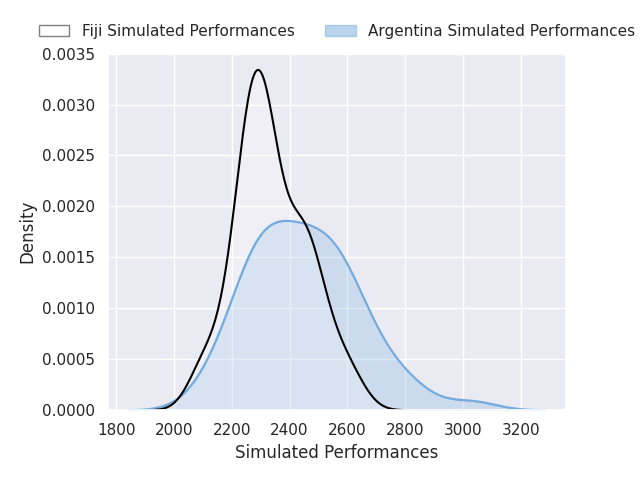

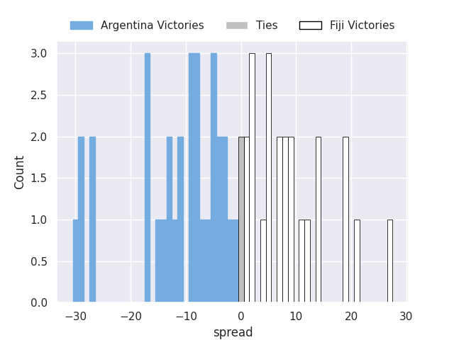

### Fiji V Japan on 2027-10-22

Average Margin: Fiji by 8.2

### Argentina V Ireland on 2027-10-22

Average Margin: Ireland by 0.7

### Zimbabwe V South Africa on 2027-10-22

Average Margin: South Africa by 9.6

### Fiji V Spain on 2027-10-22

Average Margin: Fiji by 13.8

### Argentina V Italy on 2027-10-22

Average Margin: Argentina by 5.5

### Tonga V Romania on 2027-10-22

Average Margin: Tonga by 0.6

### Wales V Georgia on 2027-10-22

Average Margin: Wales by 2.9

### Zimbabwe V Romania on 2027-10-22

Average Margin: Zimbabwe by 7.3

### Wales V Romania on 2027-10-22

Average Margin: Wales by 14.8

### Tonga V Georgia on 2027-10-22

Average Margin: Georgia by 1.3

### Tonga V Italy on 2027-10-22

Average Margin: Italy by 7.4

### Tonga V South Africa on 2027-10-22

Average Margin: South Africa by 19.4

### Argentina V United States of America on 2027-10-22

Average Margin: Argentina by 16.8

### Canada V Italy on 2027-10-22

Average Margin: Italy by 6.0

### Canada V Japan on 2027-10-22

Average Margin: Canada by 6.0

### Spain V Scotland on 2027-10-22

Average Margin: Scotland by 4.0

### Scotland V New Zealand on 2027-10-22

Average Margin: New Zealand by 4.2

### Uruguay V Spain on 2027-10-22

Average Margin: Spain by 4.0

### Portugal V Australia on 2027-10-22

Average Margin: Australia by 18.0

### Scotland V Samoa on 2027-10-22

Average Margin: Scotland by 14.5

### Scotland V Georgia on 2027-10-22

Average Margin: Scotland by 9.2

### Uruguay V Chile on 2027-10-22

Average Margin: Uruguay by 3.1

### Uruguay V Romania on 2027-10-22

Average Margin: Uruguay by 15.8

### Portugal V Spain on 2027-10-22

Average Margin: Spain by 9.0

### Portugal V Japan on 2027-10-22

Average Margin: Japan by 15.0

### Scotland V Argentina on 2027-10-22

Average Margin: Scotland by 1.4

### Scotland V Tonga on 2027-10-22

Average Margin: Scotland by 10.3

### Uruguay V South Africa on 2027-10-22

Average Margin: South Africa by 24.7

### Ireland V Argentina on 2027-10-22

Average Margin: Ireland by 0.1

### Uruguay V Canada on 2027-10-22

Average Margin: Uruguay by 16.0

### Ireland V Canada on 2027-10-22

Average Margin: Ireland by 8.8

### Scotland V Hong Kong on 2027-10-22

Average Margin: Scotland by 20.6

### Uruguay V Zimbabwe on 2027-10-22

Average Margin: Uruguay by 3.0

### Scotland V United States of America on 2027-10-22

Average Margin: Scotland by 16.7

### Scotland V Wales on 2027-10-22

Average Margin: Scotland by 14.2

### Ireland V England on 2027-10-22

Average Margin: Ireland by 1.4

### Ireland V Hong Kong on 2027-10-22

Average Margin: Ireland by 26.7

### Uruguay V Australia on 2027-10-22

Average Margin: Australia by 4.5

### Portugal V Argentina on 2027-10-22

Average Margin: Argentina by 26.0

### Uruguay V Fiji on 2027-10-22

Average Margin: Fiji by 8.0

### Portugal V Tonga on 2027-10-22

Average Margin: Portugal by 30.0

### Portugal V Italy on 2027-10-22

Average Margin: Portugal by 2.0

### Portugal V France on 2027-10-22

Average Margin: Portugal by 19.0

### Uruguay V France on 2027-10-22

Average Margin: France by 8.7

### Ireland V Romania on 2027-10-22

Average Margin: Ireland by 25.0

### Uruguay V Argentina on 2027-10-22

Average Margin: Argentina by 12.7

### Uruguay V Italy on 2027-10-22

Average Margin: Uruguay by 0.8

### Portugal V Romania on 2027-10-22

Average Margin: Romania by 1.0

### Uruguay V Samoa on 2027-10-22

Average Margin: Samoa by 0.0

### Uruguay V England on 2027-10-22

Average Margin: Uruguay by 2.0

### Portugal V Wales on 2027-10-22

Average Margin: Wales by 12.0

### Uruguay V Wales on 2027-10-22

Average Margin: Uruguay by 2.5

### Uruguay V Japan on 2027-10-22

Average Margin: Japan by 17.0

### Portugal V United States of America on 2027-10-22

Average Margin: United States of America by 0.0

### Uruguay V New Zealand on 2027-10-22

Average Margin: New Zealand by 9.7

### Uruguay V Georgia on 2027-10-22

Average Margin: Uruguay by 7.2

### Portugal V Fiji on 2027-10-22

Average Margin: Fiji by 23.0

### Scotland V Zimbabwe on 2027-10-22

Average Margin: Scotland by 6.0

### Ireland V New Zealand on 2027-10-22

Average Margin: New Zealand by 2.6

### Scotland V Japan on 2027-10-22

Average Margin: Scotland by 8.4

### Ireland V Chile on 2027-10-22

Average Margin: Ireland by 9.6

### Ireland V Uruguay on 2027-10-22

Average Margin: Ireland by 8.8

### Ireland V Tonga on 2027-10-22

Average Margin: Ireland by 17.7

### Ireland V Wales on 2027-10-22

Average Margin: Ireland by 6.4

### Scotland V England on 2027-10-22

Average Margin: England by 8.5

### Ireland V Georgia on 2027-10-22

Average Margin: Ireland by 15.0

### Scotland V Australia on 2027-10-22

Average Margin: Scotland by 2.4

### Ireland V Scotland on 2027-10-22

Average Margin: Ireland by 2.7

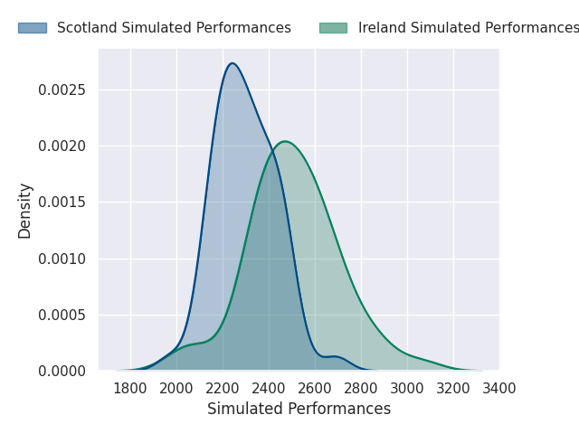

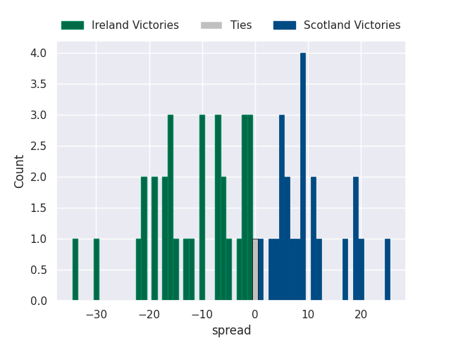

### Scotland V France on 2027-10-22

Average Margin: France by 7.9

### Scotland V Spain on 2027-10-22

Average Margin: Scotland by 5.8

### Ireland V Fiji on 2027-10-22

Average Margin: Fiji by 2.5

### Canada V United States of America on 2027-10-22

Average Margin: United States of America by 7.0

### Canada V France on 2027-10-22

Average Margin: France by 11.0

### Canada V Portugal on 2027-10-22

Average Margin: Canada by 13.0

### Canada V Samoa on 2027-10-22

Average Margin: Samoa by 0.0

### Spain V Romania on 2027-10-22

Average Margin: Spain by 5.5

### Canada V Australia on 2027-10-22

Average Margin: Australia by 1.0

### Canada V South Africa on 2027-10-22

Average Margin: South Africa by 18.0

### Uruguay V Scotland on 2027-10-22

Average Margin: Scotland by 4.3

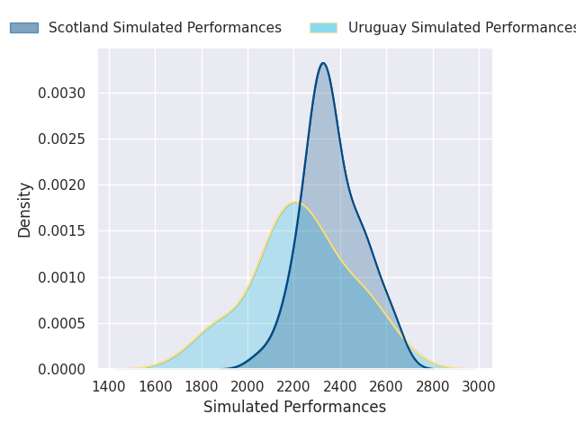
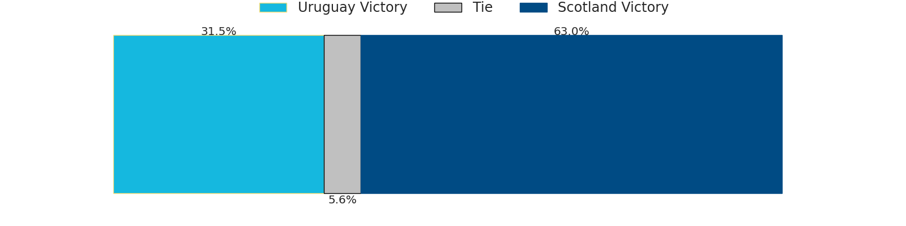
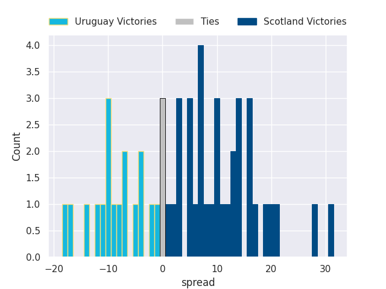

### Scotland V Fiji on 2027-10-22

Average Margin: Scotland by 1.2

### Ireland V Australia on 2027-10-22

Average Margin: Ireland by 3.7

### Scotland V Chile on 2027-10-22

Average Margin: Scotland by 9.6

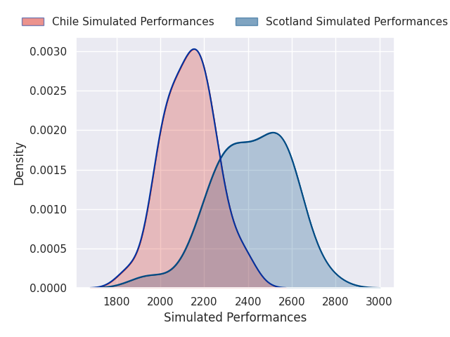
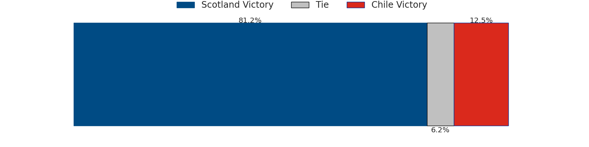
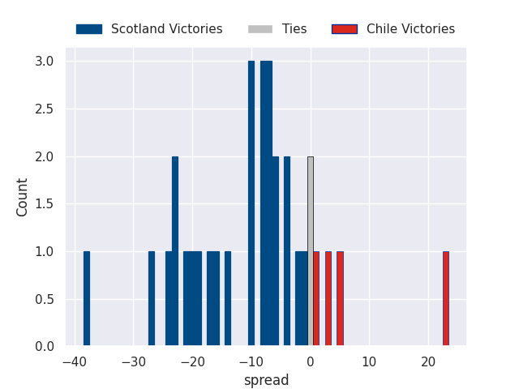

### Portugal V Georgia on 2027-10-22

Average Margin: Georgia by 9.0

### Ireland V Portugal on 2027-10-22

Average Margin: Ireland by 16.1

### Ireland V Japan on 2027-10-22

Average Margin: Ireland by 8.3

### Uruguay V United States of America on 2027-10-22

Average Margin: Uruguay by 4.7

### Ireland V Samoa on 2027-10-22

Average Margin: Ireland by 13.9

### Scotland V Canada on 2027-10-22

Average Margin: Scotland by 17.8

### Ireland V France on 2027-10-22

Average Margin: Ireland by 4.3

### Ireland V United States of America on 2027-10-22

Average Margin: Ireland by 13.4

### Portugal V Chile on 2027-10-22

Average Margin: Portugal by 6.4

### Ireland V Zimbabwe on 2027-10-22

Average Margin: Ireland by 10.1

### Portugal V Samoa on 2027-10-22

Average Margin: Samoa by 5.5

### Scotland V Portugal on 2027-10-22

Average Margin: Scotland by 7.1

### Scotland V South Africa on 2027-10-22

Average Margin: Scotland by 1.1

### Ireland V South Africa on 2027-10-22

Average Margin: South Africa by 6.1

### Scotland V Italy on 2027-10-22

Average Margin: Scotland by 6.7

### Scotland V Romania on 2027-10-22

Average Margin: Scotland by 13.6

### Portugal V Uruguay on 2027-10-22

Average Margin: Uruguay by 15.2

### Ireland V Spain on 2027-10-22

Average Margin: Ireland by 13.1

### Ireland V Italy on 2027-10-22

Average Margin: Ireland by 8.6

### Japan V Scotland on 2027-10-22

Average Margin: Scotland by 1.2

### Portugal V Hong Kong on 2027-10-22

Average Margin: Portugal by 38.0

### Samoa V Ireland on 2027-10-22

Average Margin: Ireland by 16.9

### France V Ireland on 2027-10-22

Average Margin: France by 1.6

### Chile V Fiji on 2027-10-22

Average Margin: Fiji by 7.2

### Hong Kong V Samoa on 2027-10-22

Average Margin: Samoa by 14.0

### New Zealand V South Africa on 2027-10-22

Average Margin: New Zealand by 4.8

### Chile V Spain on 2027-10-22

Average Margin: Chile by 8.8

### Australia V England on 2027-10-22

Average Margin: England by 2.8

### Hong Kong V Zimbabwe on 2027-10-22

Average Margin: Zimbabwe by 26.0

### Hong Kong V Spain on 2027-10-22

Average Margin: Hong Kong by 10.3

### Australia V Fiji on 2027-10-22

Average Margin: Australia by 2.4

### Australia V Argentina on 2027-10-22

Average Margin: Argentina by 7.0

### Hong Kong V Uruguay on 2027-10-22

Average Margin: Uruguay by 7.7

### Australia V Canada on 2027-10-22

Average Margin: Australia by 16.5

### Australia V Italy on 2027-10-22

Average Margin: Australia by 3.7

### Hong Kong V Portugal on 2027-10-22

Average Margin: Hong Kong by 3.0

### Hong Kong V Chile on 2027-10-22

Average Margin: Chile by 18.2

### Australia V Wales on 2027-10-22

Average Margin: Australia by 12.0

### Hong Kong V Italy on 2027-10-22

Average Margin: Italy by 16.0

### Hong Kong V England on 2027-10-22

Average Margin: England by 23.0

### Australia V Spain on 2027-10-22

Average Margin: Australia by 13.9

### Hong Kong V Tonga on 2027-10-22

Average Margin: Hong Kong by 2.0

### New Zealand V Samoa on 2027-10-22

Average Margin: New Zealand by 16.1

### Australia V Tonga on 2027-10-22

Average Margin: Australia by 21.6

### Chile V Ireland on 2027-10-22

Average Margin: Ireland by 14.5

### Italy V Zimbabwe on 2027-10-22

Average Margin: Italy by 7.1

### South Africa V Argentina on 2027-10-22

Average Margin: South Africa by 11.2

### Italy V England on 2027-10-22

Average Margin: Italy by 0.9

### South Africa V Hong Kong on 2027-10-22

Average Margin: South Africa by 38.4

### Georgia V Italy on 2027-10-22

Average Margin: Italy by 2.8

### Romania V Italy on 2027-10-22

Average Margin: Italy by 3.1

### Georgia V South Africa on 2027-10-22

Average Margin: South Africa by 11.9

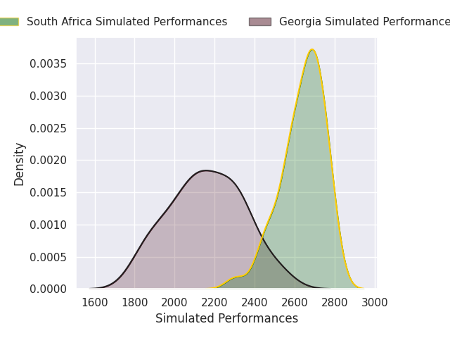
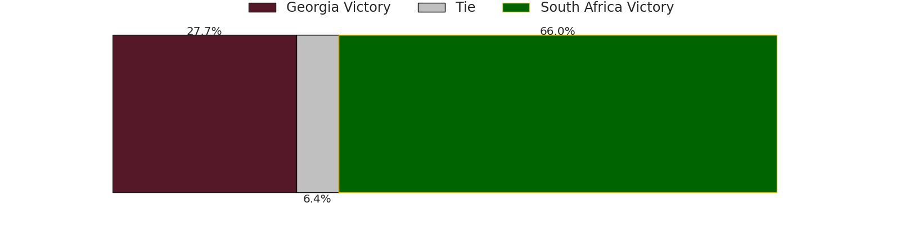
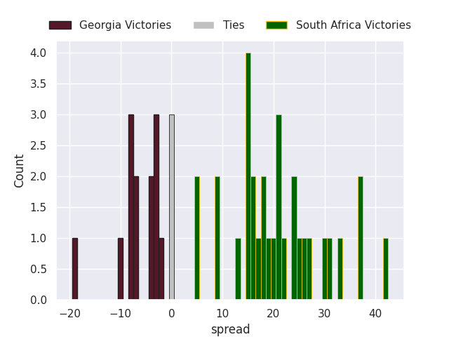

### South Africa V Spain on 2027-10-22

Average Margin: South Africa by 20.0

### Chile V Wales on 2027-10-22

Average Margin: Wales by 5.5

### South Africa V Samoa on 2027-10-22

Average Margin: South Africa by 19.8

### Chile V United States of America on 2027-10-22

Average Margin: Chile by 4.0

### Chile V Italy on 2027-10-22

Average Margin: Chile by 19.8

### Hong Kong V United States of America on 2027-10-22

Average Margin: Hong Kong by 12.0

### Chile V Canada on 2027-10-22

Average Margin: Chile by 11.7

### Australia V France on 2027-10-22

Average Margin: Australia by 0.5

### Chile V Scotland on 2027-10-22

Average Margin: Chile by 2.7

### Chile V Tonga on 2027-10-22

Average Margin: Chile by 9.9

### Hong Kong V Scotland on 2027-10-22

Average Margin: Hong Kong by 14.0

### South Africa V Uruguay on 2027-10-22

Average Margin: South Africa by 16.1

### Italy V Tonga on 2027-10-22

Average Margin: Italy by 18.1

### Hong Kong V France on 2027-10-22

Average Margin: France by 17.0

### Chile V Samoa on 2027-10-22

Average Margin: Chile by 4.3

### New Zealand V Ireland on 2027-10-22

Average Margin: New Zealand by 3.6

### New Zealand V Argentina on 2027-10-22

Average Margin: New Zealand by 4.1

### Australia V Zimbabwe on 2027-10-22

Average Margin: Australia by 6.2

### New Zealand V Chile on 2027-10-22

Average Margin: New Zealand by 15.3

### Australia V New Zealand on 2027-10-22

Average Margin: New Zealand by 3.9

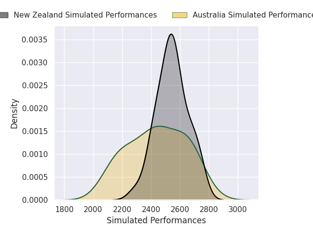
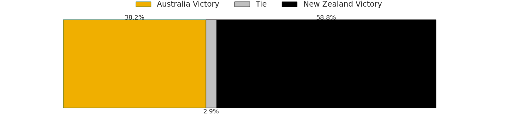
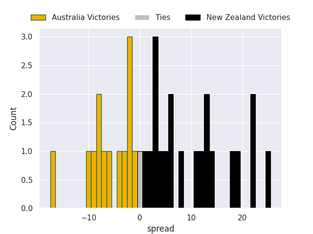

### New Zealand V Japan on 2027-10-22

Average Margin: New Zealand by 11.8

### Australia V Portugal on 2027-10-22

Average Margin: Australia by 3.0

### New Zealand V Canada on 2027-10-22

Average Margin: New Zealand by 20.7

### New Zealand V Hong Kong on 2027-10-22

Average Margin: New Zealand by 19.8

### New Zealand V Uruguay on 2027-10-22

Average Margin: New Zealand by 12.3

### Australia V United States of America on 2027-10-22

Average Margin: Australia by 12.0

### New Zealand V Georgia on 2027-10-22

Average Margin: New Zealand by 13.0

### New Zealand V United States of America on 2027-10-22

Average Margin: New Zealand by 18.9

### New Zealand V Spain on 2027-10-22

Average Margin: New Zealand by 14.7

### Australia V Samoa on 2027-10-22

Average Margin: Australia by 9.6

### Australia V Ireland on 2027-10-22

Average Margin: Australia by 5.9

### New Zealand V Italy on 2027-10-22

Average Margin: New Zealand by 16.0

### Australia V Chile on 2027-10-22

Average Margin: Australia by 6.5

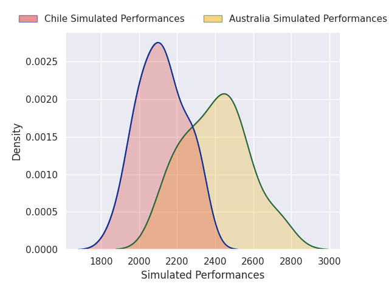
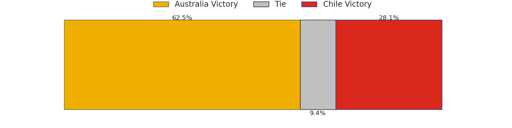
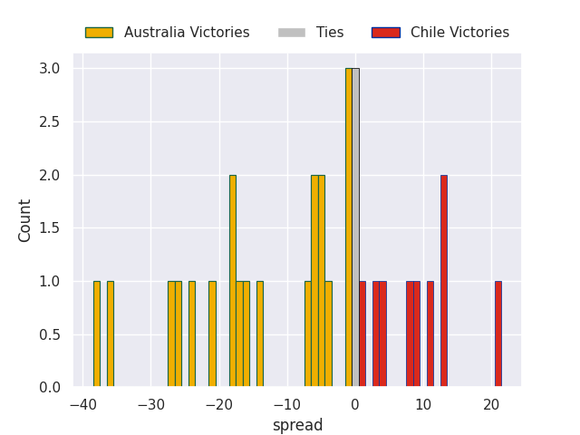

### New Zealand V Scotland on 2027-10-22

Average Margin: New Zealand by 13.3

### Chile V Uruguay on 2027-10-22

Average Margin: Chile by 1.5

### New Zealand V Zimbabwe on 2027-10-22

Average Margin: New Zealand by 11.2

### Australia V Romania on 2027-10-22

Average Margin: Australia by 10.9

### New Zealand V Portugal on 2027-10-22

Average Margin: New Zealand by 12.1

### Chile V Georgia on 2027-10-22

Average Margin: Georgia by 8.7

### Chile V Zimbabwe on 2027-10-22

Average Margin: Zimbabwe by 7.0

### New Zealand V England on 2027-10-22

Average Margin: New Zealand by 3.5

### Hong Kong V Georgia on 2027-10-22

Average Margin: Hong Kong by 9.0

### New Zealand V Tonga on 2027-10-22

Average Margin: New Zealand by 18.4

### Australia V Scotland on 2027-10-22

Average Margin: Australia by 3.8

### Chile V Romania on 2027-10-22

Average Margin: Chile by 0.3

### New Zealand V Wales on 2027-10-22

Average Margin: New Zealand by 12.5

### New Zealand V Fiji on 2027-10-22

Average Margin: New Zealand by 17.4

### Chile V Portugal on 2027-10-22

Average Margin: Chile by 1.0

### Australia V South Africa on 2027-10-22

Average Margin: South Africa by 10.0

### Australia V Japan on 2027-10-22

Average Margin: Australia by 4.7

### Australia V Hong Kong on 2027-10-22

Average Margin: Australia by 13.1

### Chile V Japan on 2027-10-22

Average Margin: Japan by 7.8

### Australia V Georgia on 2027-10-22

Average Margin: Australia by 8.2

### Australia V Uruguay on 2027-10-22

Average Margin: Australia by 3.7

### Hong Kong V Ireland on 2027-10-22

Average Margin: Ireland by 52.0

### New Zealand V France on 2027-10-22

Average Margin: New Zealand by 9.6

### Georgia V United States of America on 2027-10-22

Average Margin: Georgia by 11.0

### South Africa V New Zealand on 2027-10-22

Average Margin: South Africa by 2.5

### South Africa V Tonga on 2027-10-22

Average Margin: South Africa by 20.1

### Romania V Japan on 2027-10-22

Average Margin: Japan by 17.0

### Romania V Canada on 2027-10-22

Average Margin: Romania by 2.0

### South Africa V France on 2027-10-22

Average Margin: France by 8.3

### Georgia V England on 2027-10-22

Average Margin: England by 7.0

### Georgia V Fiji on 2027-10-22

Average Margin: Georgia by 12.0

### Georgia V Scotland on 2027-10-22

Average Margin: Georgia by 3.8

### Georgia V Hong Kong on 2027-10-22

Average Margin: Georgia by 36.0

### Georgia V Ireland on 2027-10-22

Average Margin: Ireland by 5.7

### Georgia V Canada on 2027-10-22

Average Margin: Georgia by 2.0

### Romania V Portugal on 2027-10-22

Average Margin: Romania by 20.0

### Italy V Hong Kong on 2027-10-22

Average Margin: Italy by 13.4

### Italy V United States of America on 2027-10-22

Average Margin: Italy by 13.7

### Georgia V Argentina on 2027-10-22

Average Margin: Argentina by 7.0

### Italy V Portugal on 2027-10-22

Average Margin: Italy by 11.3

### Romania V France on 2027-10-22

Average Margin: Romania by 3.0

### Romania V Australia on 2027-10-22

Average Margin: Australia by 24.0

### Georgia V Zimbabwe on 2027-10-22

Average Margin: Georgia by 8.1

### Italy V Ireland on 2027-10-22

Average Margin: Italy by 6.2

### Romania V Samoa on 2027-10-22

Average Margin: Romania by 15.7

### Georgia V Portugal on 2027-10-22

Average Margin: Georgia by 1.7

### Romania V Uruguay on 2027-10-22

Average Margin: Uruguay by 12.0

### Georgia V Romania on 2027-10-22

Average Margin: Georgia by 19.0

### France V Scotland on 2027-10-22

Average Margin: France by 4.2

### Spain V England on 2027-10-22

Average Margin: England by 10.5

### Argentina V Tonga on 2027-10-22

Average Margin: Argentina by 11.7

### Canada V Zimbabwe on 2027-10-22

Average Margin: Zimbabwe by 7.0

### Fiji V Tonga on 2027-10-22

Average Margin: Fiji by 17.2

### Canada V Wales on 2027-10-22

Average Margin: Wales by 6.2

### Fiji V Zimbabwe on 2027-10-22

Average Margin: Fiji by 8.6

### Spain V Wales on 2027-10-22

Average Margin: Wales by 3.0

### Romania V Fiji on 2027-10-22

Average Margin: Fiji by 20.0

### Fiji V England on 2027-10-22

Average Margin: England by 2.3

### Canada V Tonga on 2027-10-22

Average Margin: Canada by 0.8

### Spain V Tonga on 2027-10-22

Average Margin: Spain by 2.0

### Argentina V Wales on 2027-10-22

Average Margin: Argentina by 8.2

### Argentina V England on 2027-10-22

Average Margin: Argentina by 3.9

### Fiji V Wales on 2027-10-22

Average Margin: Fiji by 8.0

### Canada V England on 2027-10-22

Average Margin: England by 12.2

### Spain V Zimbabwe on 2027-10-22

Average Margin: Zimbabwe by 2.3

### Italy V New Zealand on 2027-10-22

Average Margin: New Zealand by 0.3

### Argentina V Zimbabwe on 2027-10-22

Average Margin: Argentina by 8.4

### Romania V Chile on 2027-10-22

Average Margin: Romania by 4.6

### Italy V Argentina on 2027-10-22

Average Margin: Argentina by 19.3

### Georgia V Wales on 2027-10-22

Average Margin: Wales by 2.3

### Georgia V Spain on 2027-10-22

Average Margin: Georgia by 2.2

### Italy V Scotland on 2027-10-22

Average Margin: Italy by 2.9

### South Africa V England on 2027-10-22

Average Margin: South Africa by 8.9

### Italy V Canada on 2027-10-22

Average Margin: Italy by 18.5

### South Africa V Canada on 2027-10-22

Average Margin: South Africa by 20.2

### South Africa V Chile on 2027-10-22

Average Margin: South Africa by 16.6

### South Africa V Japan on 2027-10-22

Average Margin: South Africa by 11.7

### Italy V Chile on 2027-10-22

Average Margin: Italy by 4.7

### Italy V Uruguay on 2027-10-22

Average Margin: Italy by 4.7

### Georgia V Samoa on 2027-10-22

Average Margin: Georgia by 11.5

### Georgia V Uruguay on 2027-10-22

Average Margin: Georgia by 3.7

### South Africa V Wales on 2027-10-22

Average Margin: South Africa by 14.7

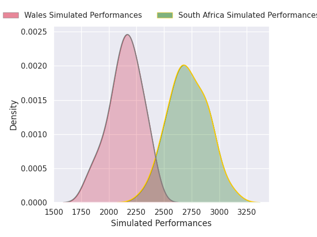
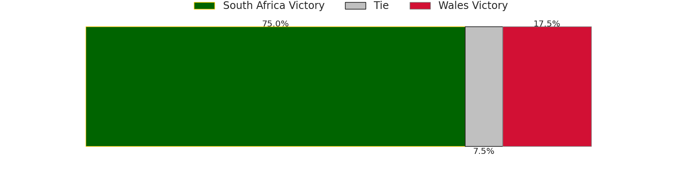
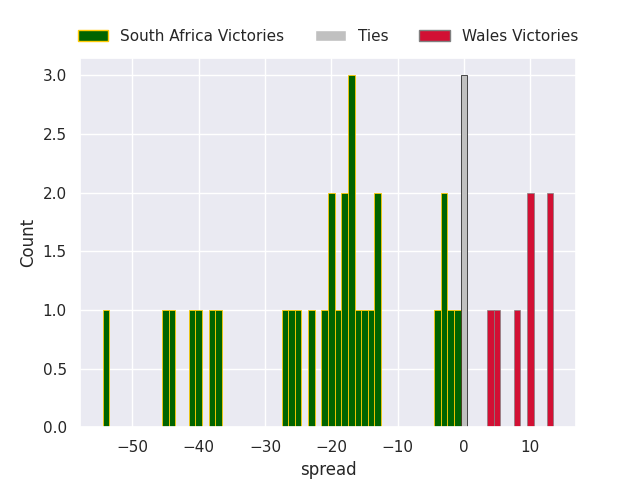

### South Africa V Zimbabwe on 2027-10-22

Average Margin: South Africa by 15.6

### South Africa V Scotland on 2027-10-22

Average Margin: South Africa by 9.2

### Romania V Spain on 2027-10-22

Average Margin: Spain by 3.3

### South Africa V Italy on 2027-10-22

Average Margin: South Africa by 9.8

### South Africa V Romania on 2027-10-22

Average Margin: South Africa by 23.5

### South Africa V United States of America on 2027-10-22

Average Margin: South Africa by 21.8

### Romania V Wales on 2027-10-22

Average Margin: Wales by 6.0

### South Africa V Fiji on 2027-10-22

Average Margin: South Africa by 7.3

### Romania V Ireland on 2027-10-22

Average Margin: Ireland by 18.0

### Georgia V Japan on 2027-10-22

Average Margin: Georgia by 9.5

### Romania V Scotland on 2027-10-22

Average Margin: Scotland by 24.5

### Georgia V France on 2027-10-22

Average Margin: France by 5.0

### Italy V France on 2027-10-22

Average Margin: France by 3.9

### Georgia V Chile on 2027-10-22

Average Margin: Georgia by 4.0

### Italy V Spain on 2027-10-22

Average Margin: Italy by 4.4

### Romania V New Zealand on 2027-10-22

Average Margin: New Zealand by 2.0

### South Africa V Portugal on 2027-10-22

Average Margin: South Africa by 18.6

### Georgia V Australia on 2027-10-22

Average Margin: Australia by 14.8

### Italy V Australia on 2027-10-22

Average Margin: Australia by 0.4

### Georgia V New Zealand on 2027-10-22

Average Margin: Georgia by 2.5

### Italy V Wales on 2027-10-22

Average Margin: Italy by 6.3

### Romania V Zimbabwe on 2027-10-22

Average Margin: Zimbabwe by 1.0

### Italy V Samoa on 2027-10-22

Average Margin: Italy by 17.5

### Romania V United States of America on 2027-10-22

Average Margin: United States of America by 5.2

### Georgia V Tonga on 2027-10-22

Average Margin: Georgia by 13.8

### South Africa V Australia on 2027-10-22

Average Margin: South Africa by 14.5

### Italy V Japan on 2027-10-22

Average Margin: Italy by 1.0

### Italy V Fiji on 2027-10-22

Average Margin: Italy by 2.5

### South Africa V Ireland on 2027-10-22

Average Margin: South Africa by 9.8

### France V Uruguay on 2027-10-22

Average Margin: France by 8.5

### Portugal V England on 2027-10-22

Average Margin: England by 3.0

## Week 5

### Romania V South Africa on 2027-10-29

Average Margin: South Africa by 18.9

### France V Wales on 2027-10-29

Average Margin: France by 7.7

### Samoa V England on 2027-10-29

Average Margin: England by 14.3

### Chile V Tonga on 2027-10-29

Average Margin: Chile by 1.7

### Australia V Georgia on 2027-10-29

Average Margin: Australia by 10.0

### France V Georgia on 2027-10-29

Average Margin: France by 11.8

### France V England on 2027-10-29

Average Margin: England by 1.3

### United States of America V Wales on 2027-10-29

Average Margin: United States of America by 2.9

### Japan V Wales on 2027-10-29

Average Margin: Japan by 0.7

### Wales V Samoa on 2027-10-29

Average Margin: Wales by 28.0

### Tonga V United States of America on 2027-10-29

Average Margin: United States of America by 29.0

### Tonga V Samoa on 2027-10-29

Average Margin: Samoa by 11.0

### Spain V United States of America on 2027-10-29

Average Margin: Spain by 2.5

### England V Portugal on 2027-10-29

Average Margin: England by 6.0

### Canada V Samoa on 2027-10-29

Average Margin: Samoa by 23.0

### Japan V England on 2027-10-29

Average Margin: England by 5.0

### France V Tonga on 2027-10-29

Average Margin: France by 9.0

### United States of America V Zimbabwe on 2027-10-29

Average Margin: Zimbabwe by 5.4

### Hong Kong V England on 2027-10-29

Average Margin: England by 13.3

### Ireland V Scotland on 2027-10-29

Average Margin: Ireland by 7.0

### Argentina V Spain on 2027-10-29

Average Margin: Argentina by 18.5

### Argentina V Fiji on 2027-10-29

Average Margin: Argentina by 5.3

### Japan V Romania on 2027-10-29

Average Margin: Japan by 6.5

### Chile V Romania on 2027-10-29

Average Margin: Chile by 24.0

### Hong Kong V Zimbabwe on 2027-10-29

Average Margin: Hong Kong by 16.0

### Samoa V Zimbabwe on 2027-10-29

Average Margin: Zimbabwe by 15.0

### United States of America V Tonga on 2027-10-29

Average Margin: United States of America by 6.0

### Japan V Tonga on 2027-10-29

Average Margin: Japan by 14.5

### Hong Kong V Wales on 2027-10-29

Average Margin: Wales by 4.8

### France V Zimbabwe on 2027-10-29

Average Margin: France by 12.4

### Samoa V Wales on 2027-10-29

Average Margin: Wales by 11.8

### United States of America V Romania on 2027-10-29

Average Margin: Romania by 1.3

### Japan V Zimbabwe on 2027-10-29

Average Margin: Japan by 9.8

### United States of America V Italy on 2027-10-29

Average Margin: Italy by 9.6

### England V United States of America on 2027-10-29

Average Margin: United States of America by 5.5

### England V Samoa on 2027-10-29

Average Margin: England by 5.3

### Tonga V Portugal on 2027-10-29

Average Margin: Portugal by 0.0

### Argentina V Portugal on 2027-10-29

Average Margin: Portugal by 4.5

### Canada V Scotland on 2027-10-29

Average Margin: Scotland by 9.4

### Canada V Uruguay on 2027-10-29

Average Margin: Uruguay by 6.5

### Wales V Japan on 2027-10-29

Average Margin: Wales by 3.8

### Zimbabwe V Samoa on 2027-10-29

Average Margin: Zimbabwe by 10.0

### England V Ireland on 2027-10-29

Average Margin: England by 5.2

### Wales V Scotland on 2027-10-29

Average Margin: Scotland by 5.5

### Tonga V Japan on 2027-10-29

Average Margin: Japan by 11.4

### Fiji V Ireland on 2027-10-29

Average Margin: Ireland by 0.4

### Wales V Ireland on 2027-10-29

Average Margin: Ireland by 5.2

### Wales V Uruguay on 2027-10-29

Average Margin: Wales by 2.3

### England V France on 2027-10-29

Average Margin: England by 6.3

### Argentina V Japan on 2027-10-29

Average Margin: Argentina by 10.6

### Fiji V France on 2027-10-29

Average Margin: Fiji by 2.0

### Fiji V Japan on 2027-10-29

Average Margin: Fiji by 5.6

### Fiji V United States of America on 2027-10-29

Average Margin: Fiji by 16.2

### Fiji V Uruguay on 2027-10-29

Average Margin: Fiji by 6.9

### Fiji V England on 2027-10-29

Average Margin: England by 5.5

### Argentina V Scotland on 2027-10-29

Average Margin: Argentina by 5.6

### England V Uruguay on 2027-10-29

Average Margin: England by 14.6

### Zimbabwe V Ireland on 2027-10-29

Average Margin: Ireland by 6.0

### Zimbabwe V United States of America on 2027-10-29

Average Margin: Zimbabwe by 41.0

### Argentina V United States of America on 2027-10-29

Average Margin: Argentina by 13.2

### Argentina V Samoa on 2027-10-29

Average Margin: Argentina by 9.8

### Tonga V Ireland on 2027-10-29

Average Margin: Ireland by 2.5

### Spain V Uruguay on 2027-10-29

Average Margin: Uruguay by 10.0

### Zimbabwe V Uruguay on 2027-10-29

Average Margin: Uruguay by 3.0

### Wales V United States of America on 2027-10-29

Average Margin: Wales by 5.0

### Wales V Portugal on 2027-10-29

Average Margin: Portugal by 3.7

### Canada V Japan on 2027-10-29

Average Margin: Canada by 5.2

### Tonga V Uruguay on 2027-10-29

Average Margin: Uruguay by 2.2

### Argentina V Uruguay on 2027-10-29

Average Margin: Argentina by 11.1

### Tonga V Scotland on 2027-10-29

Average Margin: Scotland by 3.9

### Spain V Portugal on 2027-10-29

Average Margin: Spain by 2.4

### Canada V Ireland on 2027-10-29

Average Margin: Ireland by 11.7

### Spain V Japan on 2027-10-29

Average Margin: Spain by 2.5

### Argentina V Wales on 2027-10-29

Average Margin: Argentina by 12.7

### Argentina V Georgia on 2027-10-29

Average Margin: Argentina by 2.9

### Uruguay V Fiji on 2027-10-29

Average Margin: Fiji by 0.7

### Argentina V Canada on 2027-10-29

Average Margin: Canada by 12.5

### Spain V Australia on 2027-10-29

Average Margin: Spain by 1.0

### France V Uruguay on 2027-10-29

Average Margin: France by 5.0

### Samoa V Scotland on 2027-10-29

Average Margin: Scotland by 20.3

### South Africa V England on 2027-10-29

Average Margin: South Africa by 20.0

### Argentina V England on 2027-10-29

Average Margin: Argentina by 8.5

### Fiji V Zimbabwe on 2027-10-29

Average Margin: Fiji by 9.5

### Italy V Scotland on 2027-10-29

Average Margin: Italy by 9.8

### South Africa V Uruguay on 2027-10-29

Average Margin: South Africa by 8.0

### Samoa V New Zealand on 2027-10-29

Average Margin: New Zealand by 0.0

### United States of America V Scotland on 2027-10-29

Average Margin: Scotland by 2.5

### France V New Zealand on 2027-10-29

Average Margin: New Zealand by 14.0

### Uruguay V Zimbabwe on 2027-10-29

Average Margin: Zimbabwe by 4.0

### South Africa V Scotland on 2027-10-29

Average Margin: South Africa by 5.7

### Ireland V France on 2027-10-29

Average Margin: France by 2.5

### Wales V Australia on 2027-10-29

Average Margin: Wales by 17.0

### France V Scotland on 2027-10-29

Average Margin: Scotland by 7.0

### Canada V New Zealand on 2027-10-29

Average Margin: New Zealand by 5.0

### Italy V Chile on 2027-10-29

Average Margin: Italy by 7.0

### Uruguay V Portugal on 2027-10-29

Average Margin: Uruguay by 19.0

### South Africa V France on 2027-10-29

Average Margin: France by 6.0

### Romania V Chile on 2027-10-29

Average Margin: Chile by 10.0

### United States of America V Canada on 2027-10-29

Average Margin: United States of America by 19.0

### Australia V Canada on 2027-10-29

Average Margin: Australia by 29.0

### Japan V Portugal on 2027-10-29

Average Margin: Japan by 21.0

### Georgia V France on 2027-10-29

Average Margin: France by 16.0

### Romania V Scotland on 2027-10-29

Average Margin: Scotland by 5.0

### Fiji V Wales on 2027-10-29

Average Margin: Fiji by 6.7

### United States of America V New Zealand on 2027-10-29

Average Margin: New Zealand by 23.0

### Japan V Australia on 2027-10-29

Average Margin: Japan by 3.0

### Argentina V Romania on 2027-10-29

Average Margin: Argentina by 43.0

### Japan V Scotland on 2027-10-29

Average Margin: Scotland by 8.3

### Romania V Japan on 2027-10-29

Average Margin: Romania by 21.0

### Samoa V Canada on 2027-10-29

Average Margin: Samoa by 2.0

### Spain V Zimbabwe on 2027-10-29

Average Margin: Spain by 32.0

### Fiji V Samoa on 2027-10-29

Average Margin: Fiji by 21.8

### Fiji V Tonga on 2027-10-29

Average Margin: Fiji by 21.0

### Uruguay V Scotland on 2027-10-29

Average Margin: Scotland by 6.7

### Japan V Ireland on 2027-10-29

Average Margin: Ireland by 0.5

### Georgia V Spain on 2027-10-29

Average Margin: Georgia by 11.0

### Argentina V Zimbabwe on 2027-10-29

Average Margin: Argentina by 5.7

### Ireland V Spain on 2027-10-29

Average Margin: Ireland by 13.7

### South Africa V Ireland on 2027-10-29

Average Margin: South Africa by 10.0

### Argentina V Italy on 2027-10-29

Average Margin: Argentina by 24.3

### Argentina V Hong Kong on 2027-10-29

Average Margin: Argentina by 12.0

### South Africa V Chile on 2027-10-29

Average Margin: South Africa by 26.0

### Georgia V United States of America on 2027-10-29

Average Margin: Georgia by 20.0

### Zimbabwe V Australia on 2027-10-29

Average Margin: Australia by 6.5

### France V Portugal on 2027-10-29

Average Margin: France by 7.0

### Romania V Ireland on 2027-10-29

Average Margin: Romania by 6.0

### Georgia V Ireland on 2027-10-29

Average Margin: Georgia by 0.1

### Italy V Spain on 2027-10-29

Average Margin: Italy by 8.4

### Argentina V Chile on 2027-10-29

Average Margin: Argentina by 11.6

### Georgia V Scotland on 2027-10-29

Average Margin: Scotland by 5.3

### Georgia V New Zealand on 2027-10-29

Average Margin: New Zealand by 2.3

### Fiji V New Zealand on 2027-10-29

Average Margin: Fiji by 3.0

### Georgia V Wales on 2027-10-29

Average Margin: Wales by 4.0

### Georgia V Japan on 2027-10-29

Average Margin: Japan by 4.0

### Portugal V Scotland on 2027-10-29

Average Margin: Scotland by 8.0

### Australia V Ireland on 2027-10-29

Average Margin: Australia by 7.1

### Fiji V Georgia on 2027-10-29

Average Margin: Fiji by 2.5

### Fiji V Hong Kong on 2027-10-29

Average Margin: Fiji by 24.0

### Argentina V New Zealand on 2027-10-29

Average Margin: New Zealand by 0.6

### United States of America V Ireland on 2027-10-29

Average Margin: Ireland by 24.0

### United States of America V Chile on 2027-10-29

Average Margin: United States of America by 4.0

### Fiji V Australia on 2027-10-29

Average Margin: Fiji by 1.4

### Argentina V Australia on 2027-10-29

Average Margin: Argentina by 17.2

### Samoa V Spain on 2027-10-29

Average Margin: Samoa by 6.0

### England V Australia on 2027-10-29

Average Margin: England by 23.0

### Uruguay V Ireland on 2027-10-29

Average Margin: Uruguay by 6.0

### Fiji V Chile on 2027-10-29

Average Margin: Chile by 3.5

### Fiji V Spain on 2027-10-29

Average Margin: Fiji by 15.5

### Spain V Romania on 2027-10-29

Average Margin: Romania by 3.0

### Japan V Chile on 2027-10-29

Average Margin: Japan by 21.0

### Tonga V France on 2027-10-29

Average Margin: France by 10.1

### Spain V Scotland on 2027-10-29

Average Margin: Scotland by 1.5

### Samoa V Chile on 2027-10-29

Average Margin: Samoa by 0.3

### England V Japan on 2027-10-29

Average Margin: England by 22.0

### Australia V England on 2027-10-29

Average Margin: Australia by 2.8

### Hong Kong V Uruguay on 2027-10-29

Average Margin: Uruguay by 4.0

### Japan V Georgia on 2027-10-29

Average Margin: Japan by 4.0

### New Zealand V Romania on 2027-10-29

Average Margin: New Zealand by 29.1

### Portugal V France on 2027-10-29

Average Margin: Portugal by 8.0

### France V South Africa on 2027-10-29

Average Margin: South Africa by 1.0

### New Zealand V United States of America on 2027-10-29

Average Margin: New Zealand by 8.8

### Chile V Uruguay on 2027-10-29

Average Margin: Chile by 6.8

### Georgia V Australia on 2027-10-29

Average Margin: Australia by 0.0

### Wales V Fiji on 2027-10-29

Average Margin: Fiji by 10.0

### England V Georgia on 2027-10-29

Average Margin: England by 39.0

### New Zealand V Tonga on 2027-10-29

Average Margin: New Zealand by 19.6

### Australia V Zimbabwe on 2027-10-29

Average Margin: Australia by 4.8

### Romania V Argentina on 2027-10-29

Average Margin: Romania by 7.0

### Zimbabwe V Portugal on 2027-10-29

Average Margin: Zimbabwe by 12.2

### New Zealand V Chile on 2027-10-29

Average Margin: New Zealand by 8.8

### England V Spain on 2027-10-29

Average Margin: England by 12.0

### Romania V United States of America on 2027-10-29

Average Margin: United States of America by 28.0

### Samoa V South Africa on 2027-10-29

Average Margin: South Africa by 19.8

### New Zealand V Hong Kong on 2027-10-29

Average Margin: New Zealand by 35.8

### Fiji V South Africa on 2027-10-29

Average Margin: South Africa by 13.5

### Hong Kong V South Africa on 2027-10-29

Average Margin: South Africa by 36.8

### New Zealand V Argentina on 2027-10-29

Average Margin: New Zealand by 1.5

### Hong Kong V Georgia on 2027-10-29

Average Margin: Georgia by 44.0

### Australia V Uruguay on 2027-10-29

Average Margin: Australia by 10.4

### Samoa V Ireland on 2027-10-29

Average Margin: Ireland by 7.5

### Zimbabwe V South Africa on 2027-10-29

Average Margin: South Africa by 22.0

### Portugal V South Africa on 2027-10-29

Average Margin: South Africa by 23.1

### Italy V Ireland on 2027-10-29

Average Margin: Ireland by 5.0

### Georgia V Italy on 2027-10-29

Average Margin: Italy by 7.0

### New Zealand V Zimbabwe on 2027-10-29

Average Margin: New Zealand by 18.8

### Romania V Italy on 2027-10-29

Average Margin: Italy by 12.0

### Tonga V South Africa on 2027-10-29

Average Margin: South Africa by 23.7

### Hong Kong V Italy on 2027-10-29

Average Margin: Italy by 5.8

### New Zealand V Ireland on 2027-10-29

Average Margin: New Zealand by 9.2

### Chile V South Africa on 2027-10-29

Average Margin: South Africa by 10.8

### New Zealand V Scotland on 2027-10-29

Average Margin: New Zealand by 5.0

### Australia V Spain on 2027-10-29

Average Margin: Australia by 13.0

### Japan V Italy on 2027-10-29

Average Margin: Italy by 0.5

### Australia V New Zealand on 2027-10-29

Average Margin: New Zealand by 5.9

### Portugal V United States of America on 2027-10-29

Average Margin: United States of America by 24.0

### Chile V Italy on 2027-10-29

Average Margin: Chile by 1.1

### New Zealand V Italy on 2027-10-29

Average Margin: New Zealand by 8.0

### Georgia V South Africa on 2027-10-29

Average Margin: South Africa by 12.8

### United States of America V South Africa on 2027-10-29

Average Margin: South Africa by 24.8

### Spain V Italy on 2027-10-29

Average Margin: Italy by 0.2

### Samoa V Italy on 2027-10-29

Average Margin: Italy by 16.0

### Ireland V South Africa on 2027-10-29

Average Margin: South Africa by 10.7

### New Zealand V South Africa on 2027-10-29

Average Margin: South Africa by 0.2

### Australia V South Africa on 2027-10-29

Average Margin: South Africa by 10.9

### Australia V United States of America on 2027-10-29

Average Margin: United States of America by 2.5

### Chile V Wales on 2027-10-29

Average Margin: Wales by 6.0

### New Zealand V Georgia on 2027-10-29

Average Margin: New Zealand by 16.2

### New Zealand V Samoa on 2027-10-29

Average Margin: New Zealand by 18.5

### New Zealand V Fiji on 2027-10-29

Average Margin: New Zealand by 10.7

### New Zealand V Spain on 2027-10-29

Average Margin: New Zealand by 18.4

### New Zealand V Uruguay on 2027-10-29

Average Margin: New Zealand by 16.9

### Australia V Italy on 2027-10-29

Average Margin: Australia by 3.5

### Portugal V Georgia on 2027-10-29

Average Margin: Georgia by 6.5

### South Africa V Italy on 2027-10-29

Average Margin: South Africa by 9.3

### Japan V South Africa on 2027-10-29

Average Margin: South Africa by 12.4

### Canada V South Africa on 2027-10-29

Average Margin: South Africa by 12.9

### Chile V Japan on 2027-10-29

Average Margin: Japan by 18.0

### Australia V Romania on 2027-10-29

Average Margin: Australia by 14.6

### Japan V Canada on 2027-10-29

Average Margin: Japan by 8.0

### Australia V Chile on 2027-10-29

Average Margin: Australia by 9.7

### Romania V Wales on 2027-10-29

Average Margin: Wales by 7.0

### New Zealand V Japan on 2027-10-29

Average Margin: New Zealand by 7.0

### Uruguay V South Africa on 2027-10-29

Average Margin: South Africa by 18.4

### New Zealand V Wales on 2027-10-29

Average Margin: New Zealand by 8.3

### United States of America V England on 2027-10-29

Average Margin: England by 3.0

### New Zealand V France on 2027-10-29

Average Margin: New Zealand by 8.2

### Wales V South Africa on 2027-10-29

Average Margin: South Africa by 12.0

### Chile V Fiji on 2027-10-29

Average Margin: Fiji by 9.0

### Chile V Zimbabwe on 2027-10-29

Average Margin: Chile by 9.0

### Ireland V United States of America on 2027-10-29

Average Margin: Ireland by 38.0

### England V Scotland on 2027-10-29

Average Margin: England by 28.0

### Georgia V Fiji on 2027-10-29

Average Margin: Georgia by 1.0

### Italy V Tonga on 2027-10-29

Average Margin: Italy by 2.5

### Australia V France on 2027-10-29

Average Margin: France by 13.0

### Argentina V Ireland on 2027-10-29

Average Margin: Argentina by 23.0

### Chile V Scotland on 2027-10-29

Average Margin: Scotland by 16.5

### France V Romania on 2027-10-29

Average Margin: France by 28.0

### France V Italy on 2027-10-29

Average Margin: France by 24.0

### Spain V Chile on 2027-10-29

Average Margin: Spain by 3.5

### Zimbabwe V Romania on 2027-10-29

Average Margin: Zimbabwe by 24.0

### Hong Kong V Ireland on 2027-10-29

Average Margin: Ireland by 18.0

### Spain V France on 2027-10-29

Average Margin: France by 7.5

### Hong Kong V Romania on 2027-10-29

Average Margin: Hong Kong by 2.0

### Australia V Fiji on 2027-10-29

Average Margin: Fiji by 0.2

### Hong Kong V Argentina on 2027-10-29

Average Margin: Hong Kong by 3.0

### Chile V France on 2027-10-29

Average Margin: France by 18.0

### Fiji V Scotland on 2027-10-29

Average Margin: Fiji by 2.0

### Argentina V France on 2027-10-29

Average Margin: Argentina by 0.8

### Canada V France on 2027-10-29

Average Margin: France by 6.3

### Wales V France on 2027-10-29

Average Margin: France by 3.2

### Zimbabwe V Scotland on 2027-10-29

Average Margin: Scotland by 1.7

### Australia V Tonga on 2027-10-29

Average Margin: Australia by 4.0

### Chile V Canada on 2027-10-29

Average Margin: Chile by 4.0

### Scotland V Italy on 2027-10-29

Average Margin: Scotland by 23.0

### New Zealand V England on 2027-10-29

Average Margin: New Zealand by 6.5

### Chile V Argentina on 2027-10-29

Average Margin: Chile by 3.0

### Portugal V Tonga on 2027-10-29

Average Margin: Tonga by 4.0

### Portugal V Chile on 2027-10-29

Average Margin: Chile by 1.0

### England V Italy on 2027-10-29

Average Margin: Italy by 18.0

### Scotland V South Africa on 2027-10-29

Average Margin: South Africa by 3.0

### Zimbabwe V France on 2027-10-29

Average Margin: France by 20.0

### Uruguay V Tonga on 2027-10-29

Average Margin: Uruguay by 24.0

### Fiji V Portugal on 2027-10-29

Average Margin: Fiji by 9.8

### Zimbabwe V Georgia on 2027-10-29

Average Margin: Zimbabwe by 19.0

### Spain V Ireland on 2027-10-29

Average Margin: Ireland by 6.0

### Australia V Wales on 2027-10-29

Average Margin: Australia by 3.0

### Australia V Scotland on 2027-10-29

Average Margin: Australia by 16.3

### Australia V Hong Kong on 2027-10-29

Average Margin: Australia by 41.5

### Portugal V Romania on 2027-10-29

Average Margin: Portugal by 4.0

### Australia V Japan on 2027-10-29

Average Margin: Australia by 6.0

### Uruguay V Georgia on 2027-10-29

Average Margin: Georgia by 13.0

### Australia V Portugal on 2027-10-29

Average Margin: Australia by 2.0

### Zimbabwe V Italy on 2027-10-29

Average Margin: Italy by 13.0

### Romania V Georgia on 2027-10-29

Average Margin: Georgia by 18.0

### Uruguay V Italy on 2027-10-29

Average Margin: Uruguay by 2.7

### Fiji V Italy on 2027-10-29

Average Margin: Fiji by 5.5

### Samoa V Georgia on 2027-10-29

Average Margin: Samoa by 2.0

### Australia V Samoa on 2027-10-29

Average Margin: Australia by 12.8

### Argentina V South Africa on 2027-10-29

Average Margin: South Africa by 7.5

### Zimbabwe V Japan on 2027-10-29

Average Margin: Zimbabwe by 10.0

### Chile V Georgia on 2027-10-29

Average Margin: Georgia by 7.0

### United States of America V Spain on 2027-10-29

Average Margin: Spain by 8.0

### Hong Kong V Chile on 2027-10-29

Average Margin: Chile by 4.0

### Chile V Ireland on 2027-10-29

Average Margin: Ireland by 17.5

### Scotland V Fiji on 2027-10-29

Average Margin: Scotland by 6.0

### United States of America V Georgia on 2027-10-29

Average Margin: United States of America by 3.5

### Hong Kong V France on 2027-10-29

Average Margin: France by 30.0

### Uruguay V Japan on 2027-10-29

Average Margin: Japan by 5.0

### England V South Africa on 2027-10-29

Average Margin: South Africa by 4.5

### Portugal V Japan on 2027-10-29

Average Margin: Japan by 18.0

### New Zealand V Canada on 2027-10-29

Average Margin: New Zealand by 0.3

### Wales V Italy on 2027-10-29

Average Margin: Italy by 7.7

### Uruguay V Samoa on 2027-10-29

Average Margin: Samoa by 6.0

### Uruguay V Romania on 2027-10-29

Average Margin: Uruguay by 8.0

### Australia V Argentina on 2027-10-29

Average Margin: Argentina by 3.0

### Chile V United States of America on 2027-10-29

Average Margin: Chile by 2.0

### Chile V England on 2027-10-29

Average Margin: England by 16.0

### Hong Kong V Scotland on 2027-10-29

Average Margin: Scotland by 16.0

### New Zealand V Portugal on 2027-10-29

Average Margin: New Zealand by 18.0

### Spain V South Africa on 2027-10-29

Average Margin: South Africa by 21.2

### Argentina V Tonga on 2027-10-29

Average Margin: Argentina by 5.0

## Week 6

### South Africa V Scotland on 2027-11-05

Average Margin: South Africa by 8.5

### Wales V Fiji on 2027-11-05

Average Margin: Wales by 3.7

### France V Fiji on 2027-11-05

Average Margin: France by 4.6

### England V Wales on 2027-11-05

Average Margin: England by 8.1

### Chile V Georgia on 2027-11-05

Average Margin: Chile by 12.0

### England V Ireland on 2027-11-05

Average Margin: England by 6.4

### Japan V Spain on 2027-11-05

Average Margin: Spain by 1.7

### England V Scotland on 2027-11-05

Average Margin: England by 5.0

### France V Scotland on 2027-11-05

Average Margin: Scotland by 6.8

### Australia V South Africa on 2027-11-05

Average Margin: South Africa by 0.1

### France V South Africa on 2027-11-05

Average Margin: South Africa by 4.8

### England V Australia on 2027-11-05

Average Margin: England by 4.7

### New Zealand V Romania on 2027-11-05

Average Margin: Romania by 11.0

### Zimbabwe V Argentina on 2027-11-05

Average Margin: Zimbabwe by 13.0

### Australia V Samoa on 2027-11-05

Average Margin: Australia by 3.6

### South Africa V Georgia on 2027-11-05

Average Margin: Georgia by 0.0

### France V Ireland on 2027-11-05

Average Margin: Ireland by 1.9

### Wales V Ireland on 2027-11-05

Average Margin: Ireland by 0.0

### Georgia V Spain on 2027-11-05

Average Margin: Georgia by 16.0

### France V Argentina on 2027-11-05

Average Margin: France by 2.0

### New Zealand V South Africa on 2027-11-05

Average Margin: South Africa by 7.2

### Japan V Ireland on 2027-11-05

Average Margin: Japan by 1.9

### Chile V Scotland on 2027-11-05

Average Margin: Scotland by 1.0

### Zimbabwe V Fiji on 2027-11-05

Average Margin: Fiji by 11.0

### England V Japan on 2027-11-05

Average Margin: England by 9.2

### England V Georgia on 2027-11-05

Average Margin: England by 8.0

### Italy V Chile on 2027-11-05

Average Margin: Italy by 8.5

### England V Zimbabwe on 2027-11-05

Average Margin: England by 3.8

### Hong Kong V Fiji on 2027-11-05

Average Margin: Hong Kong by 3.7

### Uruguay V Japan on 2027-11-05

Average Margin: Uruguay by 28.0

### Tonga V Japan on 2027-11-05

Average Margin: Tonga by 17.0

### Hong Kong V Scotland on 2027-11-05

Average Margin: Scotland by 9.0

### Samoa V Fiji on 2027-11-05

Average Margin: Samoa by 3.0

### Argentina V France on 2027-11-05

Average Margin: France by 8.3

### Samoa V England on 2027-11-05

Average Margin: England by 1.0

### England V Argentina on 2027-11-05

Average Margin: Argentina by 6.0

### United States of America V Ireland on 2027-11-05

Average Margin: Ireland by 4.3

### Scotland V France on 2027-11-05

Average Margin: Scotland by 7.8

### Japan V Scotland on 2027-11-05

Average Margin: Scotland by 2.0

### Canada V Argentina on 2027-11-05

Average Margin: Canada by 6.0

### Chile V Japan on 2027-11-05

Average Margin: Japan by 8.0

### Zimbabwe V Japan on 2027-11-05

Average Margin: Zimbabwe by 6.0

### Australia V Portugal on 2027-11-05

Average Margin: Australia by 8.0

### Georgia V Japan on 2027-11-05

Average Margin: Georgia by 5.0

### Samoa V Scotland on 2027-11-05

Average Margin: Samoa by 15.0

### Georgia V Canada on 2027-11-05

Average Margin: Georgia by 10.0

### Italy V Canada on 2027-11-05

Average Margin: Italy by 24.0

### Georgia V Scotland on 2027-11-05

Average Margin: Georgia by 7.0

### Chile V Portugal on 2027-11-05

Average Margin: Portugal by 2.0

### Ireland V Scotland on 2027-11-05

Average Margin: Ireland by 8.0

### Hong Kong V Argentina on 2027-11-05

Average Margin: Argentina by 3.0

### Hong Kong V France on 2027-11-05

Average Margin: Hong Kong by 4.5

### Italy V Uruguay on 2027-11-05

Average Margin: Italy by 10.0

### Italy V Zimbabwe on 2027-11-05

Average Margin: Italy by 4.0

### Samoa V Ireland on 2027-11-05

Average Margin: Samoa by 3.0

### Tonga V Fiji on 2027-11-05

Average Margin: Tonga by 23.0

### Portugal V Scotland on 2027-11-05

Average Margin: Scotland by 2.0

### Scotland V England on 2027-11-05

Average Margin: England by 9.0

### England V Romania on 2027-11-05

Average Margin: Romania by 9.0

### Samoa V Argentina on 2027-11-05

Average Margin: Argentina by 21.0

### Samoa V Wales on 2027-11-05

Average Margin: Wales by 12.0

### Zimbabwe V Chile on 2027-11-05

Average Margin: Chile by 0.0

### France V Wales on 2027-11-05

Average Margin: France by 8.7

### Wales V Spain on 2027-11-05

Average Margin: Spain by 2.0

### Wales V New Zealand on 2027-11-05

Average Margin: New Zealand by 1.7

### Tonga V Argentina on 2027-11-05

Average Margin: Argentina by 29.0

### Wales V Canada on 2027-11-05

Average Margin: Wales by 6.0

### Japan V Georgia on 2027-11-05

Average Margin: Japan by 3.0

### France V United States of America on 2027-11-05

Average Margin: France by 5.7

### England V Canada on 2027-11-05

Average Margin: England by 28.0

### Romania V United States of America on 2027-11-05

Average Margin: Romania by 4.0

### Hong Kong V New Zealand on 2027-11-05

Average Margin: New Zealand by 17.0

### Japan V New Zealand on 2027-11-05

Average Margin: New Zealand by 8.0

### Tonga V Ireland on 2027-11-05

Average Margin: Ireland by 12.0

### Australia V Georgia on 2027-11-05

Average Margin: Georgia by 5.0

### France V Georgia on 2027-11-05

Average Margin: France by 8.5

### Australia V Spain on 2027-11-05

Average Margin: Australia by 11.0

### Chile V Spain on 2027-11-05

Average Margin: Chile by 5.5

### South Africa V Italy on 2027-11-05

Average Margin: South Africa by 6.5

### England V Portugal on 2027-11-05

Average Margin: England by 14.0

### Hong Kong V Zimbabwe on 2027-11-05

Average Margin: Zimbabwe by 13.0

### Australia V Canada on 2027-11-05

Average Margin: Australia by 7.0

### Japan V Romania on 2027-11-05

Average Margin: Japan by 24.0

### Japan V Tonga on 2027-11-05

Average Margin: Japan by 25.0

### France V Tonga on 2027-11-05

Average Margin: Tonga by 4.0

### Romania V Fiji on 2027-11-05

Average Margin: Fiji by 13.0

### Romania V South Africa on 2027-11-05

Average Margin: South Africa by 20.0

### Samoa V Japan on 2027-11-05

Average Margin: Samoa by 7.0

### New Zealand V Australia on 2027-11-05

Average Margin: New Zealand by 6.4

### France V Canada on 2027-11-05

Average Margin: Canada by 11.0

### Chile V South Africa on 2027-11-05

Average Margin: South Africa by 9.0

### England V Italy on 2027-11-05

Average Margin: England by 5.8

### England V South Africa on 2027-11-05

Average Margin: England by 2.4

### England V Spain on 2027-11-05

Average Margin: England by 6.0

### Japan V Fiji on 2027-11-05

Average Margin: Fiji by 2.0

### France V Spain on 2027-11-05

Average Margin: Spain by 0.0

### England V New Zealand on 2027-11-05

Average Margin: England by 6.4

### France V Chile on 2027-11-05

Average Margin: France by 10.0

### United States of America V Scotland on 2027-11-05

Average Margin: United States of America by 1.8

### Romania V Italy on 2027-11-05

Average Margin: Romania by 0.7

### United States of America V Wales on 2027-11-05

Average Margin: United States of America by 12.3

### Tonga V England on 2027-11-05

Average Margin: England by 10.0

### Chile V New Zealand on 2027-11-05

Average Margin: New Zealand by 0.2

### Georgia V Uruguay on 2027-11-05

Average Margin: Georgia by 3.0

### Georgia V New Zealand on 2027-11-05

Average Margin: New Zealand by 9.2

### Italy V New Zealand on 2027-11-05

Average Margin: New Zealand by 6.2

### England V Uruguay on 2027-11-05

Average Margin: England by 8.7

### Romania V Ireland on 2027-11-05

Average Margin: Ireland by 9.0

### Japan V Uruguay on 2027-11-05

Average Margin: Japan by 19.5

### New Zealand V Samoa on 2027-11-05

Average Margin: New Zealand by 37.0

### Japan V South Africa on 2027-11-05

Average Margin: South Africa by 5.7

### Italy V Australia on 2027-11-05

Average Margin: Italy by 4.2

### Chile V Australia on 2027-11-05

Average Margin: Australia by 3.8

### United States of America V Argentina on 2027-11-05

Average Margin: United States of America by 0.2

### France V England on 2027-11-05

Average Margin: France by 1.0

### Romania V Argentina on 2027-11-05

Average Margin: Romania by 0.3

### France V Uruguay on 2027-11-05

Average Margin: France by 5.0

### Hong Kong V South Africa on 2027-11-05

Average Margin: Hong Kong by 2.0

### Uruguay V Spain on 2027-11-05

Average Margin: Uruguay by 14.0

### England V Samoa on 2027-11-05

Average Margin: England by 35.0

### Chile V Ireland on 2027-11-05

Average Margin: Ireland by 1.0

### Georgia V England on 2027-11-05

Average Margin: England by 11.0

### Georgia V Zimbabwe on 2027-11-05

Average Margin: Zimbabwe by 2.0

### Italy V Argentina on 2027-11-05

Average Margin: Italy by 0.7

### Fiji V Japan on 2027-11-05

Average Margin: Fiji by 5.5

### Ireland V Wales on 2027-11-05

Average Margin: Ireland by 2.0

### Italy V Samoa on 2027-11-05

Average Margin: Italy by 30.0

### Italy V France on 2027-11-05

Average Margin: Italy by 1.9

### South Africa V Uruguay on 2027-11-05

Average Margin: South Africa by 15.1

### England V France on 2027-11-05

Average Margin: England by 4.0

### Fiji V France on 2027-11-05

Average Margin: France by 2.8

### Georgia V France on 2027-11-05

Average Margin: France by 1.5

### Chile V Argentina on 2027-11-05

Average Margin: Argentina by 2.8

### New Zealand V Argentina on 2027-11-05

Average Margin: New Zealand by 7.0

### South Africa V Argentina on 2027-11-05

Average Margin: South Africa by 6.6

### New Zealand V Uruguay on 2027-11-05

Average Margin: New Zealand by 9.8

### Italy V Fiji on 2027-11-05

Average Margin: Fiji by 0.8

### Uruguay V England on 2027-11-05

Average Margin: Uruguay by 0.6

### South Africa V Portugal on 2027-11-05

Average Margin: South Africa by 19.8

### South Africa V England on 2027-11-05

Average Margin: South Africa by 9.1

### Uruguay V Argentina on 2027-11-05

Average Margin: Argentina by 5.0

### New Zealand V Canada on 2027-11-05

Average Margin: New Zealand by 2.4

### Australia V Scotland on 2027-11-05

Average Margin: Scotland by 0.4

### Australia V Fiji on 2027-11-05

Average Margin: Australia by 1.3

### New Zealand V Spain on 2027-11-05

Average Margin: New Zealand by 4.3

### Australia V Ireland on 2027-11-05

Average Margin: Australia by 0.9

### New Zealand V Tonga on 2027-11-05

Average Margin: New Zealand by 8.0

### Australia V Wales on 2027-11-05

Average Margin: Wales by 2.7

### Australia V France on 2027-11-05

Average Margin: Australia by 0.2

### Spain V Scotland on 2027-11-05

Average Margin: Scotland by 2.0

### Australia V United States of America on 2027-11-05

Average Margin: Australia by 8.0

### Chile V Wales on 2027-11-05

Average Margin: Wales by 7.5

### Australia V England on 2027-11-05

Average Margin: Australia by 2.7

### South Africa V Wales on 2027-11-05

Average Margin: South Africa by 9.0

### South Africa V Canada on 2027-11-05

Average Margin: South Africa by 11.2

### Samoa V France on 2027-11-05

Average Margin: France by 2.0

### Spain V France on 2027-11-05

Average Margin: Spain by 0.5

### South Africa V Ireland on 2027-11-05

Average Margin: South Africa by 6.9

### South Africa V Spain on 2027-11-05

Average Margin: South Africa by 6.9

### New Zealand V Fiji on 2027-11-05

Average Margin: New Zealand by 11.0

### South Africa V France on 2027-11-05

Average Margin: South Africa by 8.1

### Chile V Tonga on 2027-11-05

Average Margin: Chile by 4.0

### New Zealand V Zimbabwe on 2027-11-05

Average Margin: New Zealand by 10.4

### United States of America V Fiji on 2027-11-05

Average Margin: Fiji by 0.0

### Japan V Argentina on 2027-11-05

Average Margin: Argentina by 14.0

### South Africa V Fiji on 2027-11-05

Average Margin: South Africa by 8.8

### Japan V France on 2027-11-05

Average Margin: France by 3.2

### Spain V Japan on 2027-11-05

Average Margin: Spain by 3.3

### New Zealand V Portugal on 2027-11-05

Average Margin: New Zealand by 22.0

### Chile V France on 2027-11-05

Average Margin: Chile by 1.8

### Australia V Uruguay on 2027-11-05

Average Margin: Australia by 2.6

### New Zealand V Ireland on 2027-11-05

Average Margin: New Zealand by 5.0

### New Zealand V Japan on 2027-11-05

Average Margin: New Zealand by 10.6

### New Zealand V England on 2027-11-05

Average Margin: New Zealand by 4.7

### New Zealand V Scotland on 2027-11-05

Average Margin: New Zealand by 5.7

### Italy V Japan on 2027-11-05

Average Margin: Italy by 8.5

### Uruguay V Fiji on 2027-11-05

Average Margin: Uruguay by 5.3

### Wales V Japan on 2027-11-05

Average Margin: Wales by 4.0

### New Zealand V France on 2027-11-05

Average Margin: New Zealand by 5.8

### Portugal V Fiji on 2027-11-05

Average Margin: Portugal by 3.0

### Scotland V Argentina on 2027-11-05

Average Margin: Scotland by 4.5

### Romania V England on 2027-11-05

Average Margin: England by 11.5

### Chile V United States of America on 2027-11-05

Average Margin: United States of America by 1.0

### Scotland V Fiji on 2027-11-05

Average Margin: Scotland by 13.5

### Wales V England on 2027-11-05

Average Margin: England by 7.0

### Ireland V Argentina on 2027-11-05

Average Margin: Argentina by 11.5

### Zimbabwe V Uruguay on 2027-11-05

Average Margin: Zimbabwe by 9.0

### Chile V England on 2027-11-05

Average Margin: England by 1.7

### Australia V Argentina on 2027-11-05

Average Margin: Australia by 1.5

### Fiji V Argentina on 2027-11-05

Average Margin: Fiji by 4.0

### Italy V Spain on 2027-11-05

Average Margin: Spain by 2.3

### Romania V Japan on 2027-11-05

Average Margin: Japan by 18.0

### Georgia V Fiji on 2027-11-05

Average Margin: Fiji by 6.6

### Georgia V Wales on 2027-11-05

Average Margin: Georgia by 22.0

### South Africa V Samoa on 2027-11-05

Average Margin: South Africa by 26.5

### Zimbabwe V Scotland on 2027-11-05

Average Margin: Zimbabwe by 3.5

### Australia V Tonga on 2027-11-05

Average Margin: Tonga by 2.0

### Australia V Japan on 2027-11-05

Average Margin: Japan by 0.0

### Wales V France on 2027-11-05

Average Margin: France by 9.5

### Italy V United States of America on 2027-11-05

Average Margin: United States of America by 3.0

### Australia V Zimbabwe on 2027-11-05

Average Margin: Australia by 7.5

### Ireland V Portugal on 2027-11-05

Average Margin: Ireland by 8.0

### Zimbabwe V France on 2027-11-05

Average Margin: France by 7.0

### Wales V Argentina on 2027-11-05

Average Margin: Wales by 12.7

### Canada V France on 2027-11-05

Average Margin: Canada by 9.0

### Scotland V Canada on 2027-11-05

Average Margin: Scotland by 14.0

### England V Tonga on 2027-11-05

Average Margin: Tonga by 9.0

### Georgia V Ireland on 2027-11-05

Average Margin: Ireland by 11.0

### Chile V Zimbabwe on 2027-11-05

Average Margin: Chile by 17.0

### South Africa V Tonga on 2027-11-05

Average Margin: South Africa by 5.8

### Spain V Tonga on 2027-11-05

Average Margin: Spain by 10.0

### Wales V Scotland on 2027-11-05

Average Margin: Wales by 5.7

### Samoa V Zimbabwe on 2027-11-05

Average Margin: Samoa by 3.0

### Georgia V Argentina on 2027-11-05

Average Margin: Georgia by 1.4

### Zimbabwe V Ireland on 2027-11-05

Average Margin: Ireland by 0.0

### New Zealand V Wales on 2027-11-05

Average Margin: New Zealand by 7.6

### South Africa V Zimbabwe on 2027-11-05

Average Margin: South Africa by 4.7

### Italy V England on 2027-11-05

Average Margin: England by 1.7

### Zimbabwe V England on 2027-11-05

Average Margin: Zimbabwe by 3.0

### Ireland V Japan on 2027-11-05

Average Margin: Ireland by 6.0

### United States of America V England on 2027-11-05

Average Margin: United States of America by 14.0

### Zimbabwe V Wales on 2027-11-05

Average Margin: Zimbabwe by 15.8

### Chile V Uruguay on 2027-11-05

Average Margin: Uruguay by 0.5

### Italy V Ireland on 2027-11-05

Average Margin: Italy by 6.7

### Chile V Fiji on 2027-11-05

Average Margin: Chile by 7.8

### Canada V Spain on 2027-11-05

Average Margin: Spain by 6.0

### Ireland V France on 2027-11-05

Average Margin: Ireland by 11.2

### Uruguay V Ireland on 2027-11-05

Average Margin: Ireland by 0.0

### Italy V Wales on 2027-11-05

Average Margin: Italy by 3.2

### Argentina V Spain on 2027-11-05

Average Margin: Argentina by 21.0

### South Africa V United States of America on 2027-11-05

Average Margin: South Africa by 19.0

### Wales V Uruguay on 2027-11-05

Average Margin: Uruguay by 6.0

### South Africa V Japan on 2027-11-05

Average Margin: South Africa by 9.7

### Fiji V Zimbabwe on 2027-11-05

Average Margin: Fiji by 28.5

### Italy V Scotland on 2027-11-05

Average Margin: Italy by 7.3

### Romania V France on 2027-11-05

Average Margin: France by 6.0

### United States of America V France on 2027-11-05

Average Margin: France by 11.0

### United States of America V Japan on 2027-11-05

Average Margin: Japan by 0.0

### England V Fiji on 2027-11-05

Average Margin: England by 8.7

### New Zealand V United States of America on 2027-11-05

Average Margin: New Zealand by 8.4

### Australia V Hong Kong on 2027-11-05

Average Margin: Australia by 5.0

## Week 7

### Scotland V Fiji on 2027-11-12

Average Margin: Scotland by 3.4

### Hong Kong V Japan on 2027-11-12

Average Margin: Hong Kong by 16.0

### Wales V Samoa on 2027-11-12

Average Margin: Wales by 9.5

### United States of America V Zimbabwe on 2027-11-12

Average Margin: Zimbabwe by 16.5

### Samoa V France on 2027-11-12

Average Margin: France by 1.0

### Fiji V Tonga on 2027-11-12

Average Margin: Tonga by 5.0

### Hong Kong V Ireland on 2027-11-12

Average Margin: Ireland by 14.0

### Chile V Zimbabwe on 2027-11-12

Average Margin: Zimbabwe by 11.0

### South Africa V Zimbabwe on 2027-11-12

Average Margin: South Africa by 6.0

### Canada V Australia on 2027-11-12

Average Margin: Canada by 3.0

### New Zealand V Romania on 2027-11-12

Average Margin: New Zealand by 6.0

### New Zealand V Hong Kong on 2027-11-12

Average Margin: New Zealand by 28.0

### South Africa V Australia on 2027-11-12

Average Margin: South Africa by 16.1

### Australia V Argentina on 2027-11-12

Average Margin: Australia by 2.5

### South Africa V England on 2027-11-12

Average Margin: South Africa by 6.4

### France V Wales on 2027-11-12

Average Margin: France by 8.4

### Ireland V Fiji on 2027-11-12

Average Margin: Fiji by 2.2

### New Zealand V Chile on 2027-11-12

Average Margin: New Zealand by 11.2

### South Africa V Wales on 2027-11-12

Average Margin: South Africa by 6.2

### Italy V New Zealand on 2027-11-12

Average Margin: New Zealand by 1.9

### Zimbabwe V New Zealand on 2027-11-12

Average Margin: New Zealand by 0.5

### Ireland V Zimbabwe on 2027-11-12

Average Margin: Ireland by 4.0

### South Africa V Chile on 2027-11-12

Average Margin: South Africa by 15.8

### Argentina V Ireland on 2027-11-12

Average Margin: Argentina by 2.7

### Spain V Samoa on 2027-11-12

Average Margin: Spain by 16.0

### South Africa V New Zealand on 2027-11-12

Average Margin: South Africa by 3.5

### Italy V South Africa on 2027-11-12

Average Margin: South Africa by 3.5

### New Zealand V England on 2027-11-12

Average Margin: New Zealand by 4.5

### Australia V New Zealand on 2027-11-12

Average Margin: New Zealand by 3.5

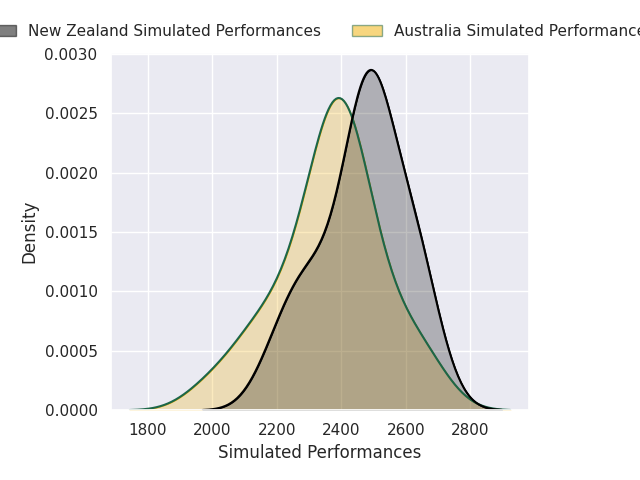
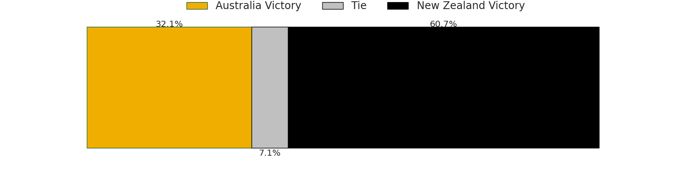
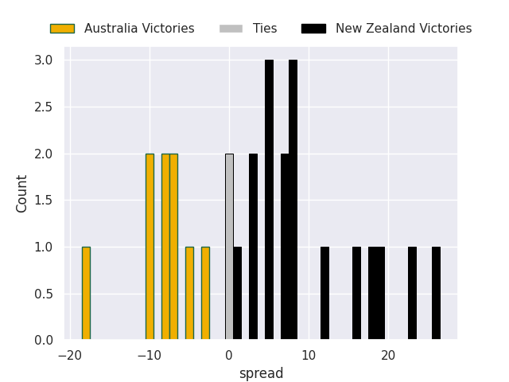

### Chile V Italy on 2027-11-12

Average Margin: Italy by 9.0

### Spain V Fiji on 2027-11-12

Average Margin: Spain by 4.0

### France V Italy on 2027-11-12

Average Margin: France by 8.5

### Wales V Portugal on 2027-11-12

Average Margin: Wales by 12.0

### Georgia V England on 2027-11-12

Average Margin: England by 7.0

### Portugal V Australia on 2027-11-12

Average Margin: Portugal by 6.0

### Scotland V Hong Kong on 2027-11-12

Average Margin: Scotland by 2.0

### England V Tonga on 2027-11-12

Average Margin: England by 8.5

### Samoa V Chile on 2027-11-12

Average Margin: Chile by 13.0

### Zimbabwe V Australia on 2027-11-12

Average Margin: Australia by 5.0

### Scotland V United States of America on 2027-11-12

Average Margin: Scotland by 11.0

### Hong Kong V England on 2027-11-12

Average Margin: Hong Kong by 11.0

### Uruguay V New Zealand on 2027-11-12

Average Margin: Uruguay by 1.2

### Italy V Chile on 2027-11-12

Average Margin: Italy by 32.0

### Zimbabwe V Wales on 2027-11-12

Average Margin: Zimbabwe by 6.0

### Tonga V Italy on 2027-11-12

Average Margin: Tonga by 25.0

### New Zealand V Georgia on 2027-11-12

Average Margin: New Zealand by 0.3

### Canada V Ireland on 2027-11-12

Average Margin: Canada by 2.7

### Japan V Tonga on 2027-11-12

Average Margin: Tonga by 16.0

### France V Georgia on 2027-11-12

Average Margin: France by 8.0

### Georgia V Scotland on 2027-11-12

Average Margin: Scotland by 5.5

### United States of America V Wales on 2027-11-12

Average Margin: Wales by 4.0

### Argentina V Fiji on 2027-11-12

Average Margin: Argentina by 4.3

### Romania V Argentina on 2027-11-12

Average Margin: Romania by 8.5

### Chile V Georgia on 2027-11-12

Average Margin: Chile by 4.0

### France V Portugal on 2027-11-12

Average Margin: Portugal by 12.0

### Canada V Fiji on 2027-11-12

Average Margin: Canada by 29.0

### Fiji V Portugal on 2027-11-12

Average Margin: Fiji by 7.0

### Portugal V Japan on 2027-11-12

Average Margin: Japan by 2.0

### Australia V Italy on 2027-11-12

Average Margin: Australia by 6.7

### Portugal V Georgia on 2027-11-12

Average Margin: Portugal by 8.0

### France V Canada on 2027-11-12

Average Margin: France by 6.5

### France V Spain on 2027-11-12

Average Margin: Spain by 7.0

### Tonga V Scotland on 2027-11-12

Average Margin: Tonga by 9.0

### Spain V Italy on 2027-11-12

Average Margin: Italy by 3.0

### South Africa V Tonga on 2027-11-12

Average Margin: Tonga by 19.0

### New Zealand V Canada on 2027-11-12

Average Margin: New Zealand by 30.0

### New Zealand V United States of America on 2027-11-12

Average Margin: New Zealand by 15.0

### South Africa V United States of America on 2027-11-12

Average Margin: United States of America by 1.0

### Australia V Samoa on 2027-11-12

Average Margin: Australia by 25.0

### Zimbabwe V Argentina on 2027-11-12

Average Margin: Zimbabwe by 8.5

### Ireland V England on 2027-11-12

Average Margin: Ireland by 3.4

### New Zealand V Uruguay on 2027-11-12

Average Margin: New Zealand by 10.3

### Italy V Wales on 2027-11-12

Average Margin: Italy by 4.5

### Australia V Chile on 2027-11-12

Average Margin: Australia by 15.0

### Argentina V Uruguay on 2027-11-12

Average Margin: Uruguay by 16.0

### United States of America V Australia on 2027-11-12

Average Margin: United States of America by 5.0

### Tonga V Australia on 2027-11-12

Average Margin: Tonga by 6.0

### Fiji V Hong Kong on 2027-11-12

Average Margin: Fiji by 7.0

### Georgia V Ireland on 2027-11-12

Average Margin: Georgia by 12.0

### Portugal V Ireland on 2027-11-12

Average Margin: Ireland by 11.0

### Tonga V Canada on 2027-11-12

Average Margin: Tonga by 16.0

### Australia V Canada on 2027-11-12

Average Margin: Australia by 6.0

### Tonga V Japan on 2027-11-12

Average Margin: Japan by 8.0

### Spain V Argentina on 2027-11-12

Average Margin: Spain by 3.5

### Ireland V Hong Kong on 2027-11-12

Average Margin: Hong Kong by 6.0

### Ireland V Wales on 2027-11-12

Average Margin: Wales by 6.0

### Ireland V Romania on 2027-11-12

Average Margin: Ireland by 1.0

### Spain V United States of America on 2027-11-12

Average Margin: United States of America by 14.0

### Japan V Italy on 2027-11-12

Average Margin: Italy by 4.0

### Canada V Scotland on 2027-11-12

Average Margin: Scotland by 18.0

### Zimbabwe V Italy on 2027-11-12

Average Margin: Zimbabwe by 7.0

### Fiji V Samoa on 2027-11-12

Average Margin: Fiji by 16.0

### Japan V Ireland on 2027-11-12

Average Margin: Japan by 5.0

### Australia V Japan on 2027-11-12

Average Margin: Japan by 5.5

### Georgia V France on 2027-11-12

Average Margin: Georgia by 31.0

### Scotland V France on 2027-11-12

Average Margin: Scotland by 10.2

### Uruguay V Japan on 2027-11-12

Average Margin: Japan by 19.0

### Samoa V England on 2027-11-12

Average Margin: Samoa by 4.5

### Portugal V England on 2027-11-12

Average Margin: England by 11.5

### France V Romania on 2027-11-12

Average Margin: Romania by 5.0

### France V Ireland on 2027-11-12

Average Margin: France by 1.1

### Samoa V Japan on 2027-11-12

Average Margin: Samoa by 16.0

### United States of America V New Zealand on 2027-11-12

Average Margin: New Zealand by 9.2

### Australia V Wales on 2027-11-12

Average Margin: Australia by 12.0

### England V United States of America on 2027-11-12

Average Margin: England by 7.0

### England V Italy on 2027-11-12

Average Margin: England by 4.5

### Zimbabwe V Japan on 2027-11-12

Average Margin: Zimbabwe by 7.0

### Zimbabwe V Scotland on 2027-11-12

Average Margin: Scotland by 7.0

### United States of America V South Africa on 2027-11-12

Average Margin: South Africa by 7.2

### Argentina V Japan on 2027-11-12

Average Margin: Argentina by 14.5

### South Africa V Samoa on 2027-11-12

Average Margin: South Africa by 1.0

### South Africa V France on 2027-11-12

Average Margin: South Africa by 8.5

### Canada V Georgia on 2027-11-12

Average Margin: Canada by 4.0

### South Africa V Spain on 2027-11-12

Average Margin: South Africa by 13.0

### Italy V Fiji on 2027-11-12

Average Margin: Fiji by 4.3

### Australia V Zimbabwe on 2027-11-12

Average Margin: Australia by 2.2

### Scotland V South Africa on 2027-11-12

Average Margin: South Africa by 7.8

### Portugal V Romania on 2027-11-12

Average Margin: Romania by 5.0

### Australia V Hong Kong on 2027-11-12

Average Margin: Australia by 24.0

### Fiji V New Zealand on 2027-11-12

Average Margin: Fiji by 5.0

### Fiji V Scotland on 2027-11-12

Average Margin: Scotland by 0.6

### Zimbabwe V South Africa on 2027-11-12

Average Margin: South Africa by 7.7

### France V New Zealand on 2027-11-12

Average Margin: New Zealand by 0.8

### Chile V Argentina on 2027-11-12

Average Margin: Argentina by 3.5

### Canada V France on 2027-11-12

Average Margin: Canada by 3.0

### Wales V Fiji on 2027-11-12

Average Margin: Fiji by 2.3

### United States of America V Fiji on 2027-11-12

Average Margin: Fiji by 17.0

### Tonga V United States of America on 2027-11-12

Average Margin: Tonga by 1.0

### Zimbabwe V Romania on 2027-11-12

Average Margin: Zimbabwe by 8.0

### England V Georgia on 2027-11-12

Average Margin: England by 3.7

### Wales V Zimbabwe on 2027-11-12

Average Margin: Zimbabwe by 7.0

### Argentina V United States of America on 2027-11-12

Average Margin: Argentina by 15.0

### Italy V United States of America on 2027-11-12

Average Margin: United States of America by 0.0

### Italy V Australia on 2027-11-12

Average Margin: Italy by 5.5

### Japan V Georgia on 2027-11-12

Average Margin: Japan by 18.0

### Uruguay V Fiji on 2027-11-12

Average Margin: Fiji by 7.5

### Uruguay V Italy on 2027-11-12

Average Margin: Italy by 16.0

### France V Japan on 2027-11-12

Average Margin: France by 5.7

### Spain V New Zealand on 2027-11-12

Average Margin: Spain by 4.0

### France V Zimbabwe on 2027-11-12

Average Margin: France by 8.0

### Canada V Argentina on 2027-11-12

Average Margin: Argentina by 10.0

### New Zealand V Wales on 2027-11-12

Average Margin: New Zealand by 0.5

### Portugal V New Zealand on 2027-11-12

Average Margin: Portugal by 19.0

### Scotland V Zimbabwe on 2027-11-12

Average Margin: Zimbabwe by 3.2

### South Africa V Italy on 2027-11-12

Average Margin: South Africa by 6.1

### South Africa V Argentina on 2027-11-12

Average Margin: South Africa by 12.6

### Georgia V Argentina on 2027-11-12

Average Margin: Argentina by 3.3

### Italy V Georgia on 2027-11-12

Average Margin: Italy by 12.0

### New Zealand V France on 2027-11-12

Average Margin: France by 1.9

### Wales V Australia on 2027-11-12

Average Margin: Australia by 4.6

### Samoa V Argentina on 2027-11-12

Average Margin: Argentina by 15.0

### New Zealand V Samoa on 2027-11-12

Average Margin: New Zealand by 8.0

### Italy V England on 2027-11-12

Average Margin: Italy by 3.0

### Uruguay V Scotland on 2027-11-12

Average Margin: Uruguay by 2.5

### Ireland V Argentina on 2027-11-12

Average Margin: Ireland by 3.5

### Fiji V Wales on 2027-11-12

Average Margin: Fiji by 0.9

### Chile V South Africa on 2027-11-12

Average Margin: South Africa by 13.8

### England V Wales on 2027-11-12

Average Margin: England by 8.7

### France V Scotland on 2027-11-12

Average Margin: France by 5.0

### New Zealand V Australia on 2027-11-12

Average Margin: New Zealand by 4.3

### Ireland V Australia on 2027-11-12

Average Margin: Ireland by 8.7

### Spain V Ireland on 2027-11-12

Average Margin: Ireland by 7.5

### Fiji V South Africa on 2027-11-12

Average Margin: South Africa by 4.0

### Japan V Wales on 2027-11-12

Average Margin: Japan by 1.0

### England V Ireland on 2027-11-12

Average Margin: England by 4.8

### Argentina V Australia on 2027-11-12

Average Margin: Argentina by 11.1

### Fiji V Ireland on 2027-11-12

Average Margin: Ireland by 9.3

### Portugal V Argentina on 2027-11-12

Average Margin: Argentina by 4.3

### New Zealand V Italy on 2027-11-12

Average Margin: New Zealand by 3.2

### Italy V France on 2027-11-12

Average Margin: Italy by 2.7

### Japan V Spain on 2027-11-12

Average Margin: Spain by 7.5

### South Africa V Scotland on 2027-11-12

Average Margin: South Africa by 5.1

### Japan V England on 2027-11-12

Average Margin: England by 2.6

### New Zealand V Zimbabwe on 2027-11-12

Average Margin: New Zealand by 19.2

### Uruguay V Australia on 2027-11-12

Average Margin: Uruguay by 19.0

### United States of America V Uruguay on 2027-11-12

Average Margin: Uruguay by 8.5

### Japan V Zimbabwe on 2027-11-12

Average Margin: Zimbabwe by 15.0

### Scotland V Australia on 2027-11-12

Average Margin: Scotland by 2.2

### South Africa V Uruguay on 2027-11-12

Average Margin: South Africa by 5.5

### Fiji V Japan on 2027-11-12

Average Margin: Fiji by 10.2

### United States of America V Argentina on 2027-11-12

Average Margin: Argentina by 8.8

### New Zealand V Ireland on 2027-11-12

Average Margin: New Zealand by 11.8

### Tonga V Ireland on 2027-11-12

Average Margin: Tonga by 1.5

### France V Fiji on 2027-11-12

Average Margin: France by 4.3

### Fiji V Chile on 2027-11-12

Average Margin: Fiji by 8.0

### Fiji V Georgia on 2027-11-12

Average Margin: Fiji by 13.0

### Scotland V Italy on 2027-11-12

Average Margin: Scotland by 3.5

### France V South Africa on 2027-11-12

Average Margin: South Africa by 7.3

### Samoa V Fiji on 2027-11-12

Average Margin: Fiji by 13.5

### Canada V Italy on 2027-11-12

Average Margin: Canada by 6.0

### Wales V Argentina on 2027-11-12

Average Margin: Wales by 8.2

### England V New Zealand on 2027-11-12

Average Margin: England by 0.4

### Spain V Wales on 2027-11-12

Average Margin: Spain by 12.5

### Ireland V Japan on 2027-11-12

Average Margin: Ireland by 6.2

### New Zealand V Argentina on 2027-11-12

Average Margin: New Zealand by 5.4

### Japan V New Zealand on 2027-11-12

Average Margin: Japan by 1.4

### Scotland V England on 2027-11-12

Average Margin: Scotland by 4.9

### France V Chile on 2027-11-12

Average Margin: France by 2.5

### Wales V France on 2027-11-12

Average Margin: France by 4.9

### France V England on 2027-11-12

Average Margin: France by 3.5

### Chile V New Zealand on 2027-11-12

Average Margin: New Zealand by 4.3

### Japan V Australia on 2027-11-12

Average Margin: Japan by 0.5

### Japan V Argentina on 2027-11-12

Average Margin: Argentina by 3.5

### Fiji V Argentina on 2027-11-12

Average Margin: Argentina by 1.3

### Japan V France on 2027-11-12

Average Margin: France by 1.5

### Ireland V Scotland on 2027-11-12

Average Margin: Ireland by 0.3

### Uruguay V Ireland on 2027-11-12

Average Margin: Uruguay by 3.3

### Fiji V Italy on 2027-11-12

Average Margin: Fiji by 3.7

### France V Argentina on 2027-11-12

Average Margin: Argentina by 2.3

### New Zealand V Spain on 2027-11-12

Average Margin: New Zealand by 2.7

### New Zealand V South Africa on 2027-11-12

Average Margin: South Africa by 7.5

### Uruguay V Zimbabwe on 2027-11-12

Average Margin: Zimbabwe by 3.0

### Canada V England on 2027-11-12

Average Margin: England by 4.3

### Spain V Scotland on 2027-11-12

Average Margin: Scotland by 6.0

### Chile V Australia on 2027-11-12

Average Margin: Chile by 8.5

### Samoa V Ireland on 2027-11-12

Average Margin: Samoa by 4.5

### Australia V South Africa on 2027-11-12

Average Margin: South Africa by 4.2

### Japan V Scotland on 2027-11-12

Average Margin: Japan by 2.0

### Fiji V Uruguay on 2027-11-12

Average Margin: Fiji by 8.0

### Argentina V Tonga on 2027-11-12

Average Margin: Argentina by 1.8

### Wales V Georgia on 2027-11-12

Average Margin: Wales by 14.0

### Uruguay V Argentina on 2027-11-12

Average Margin: Argentina by 4.8

### France V United States of America on 2027-11-12

Average Margin: France by 7.2

### Zimbabwe V England on 2027-11-12

Average Margin: England by 4.3

### Tonga V Samoa on 2027-11-12

Average Margin: Tonga by 9.0

### South Africa V Ireland on 2027-11-12

Average Margin: South Africa by 8.8

### Australia V Romania on 2027-11-12

Average Margin: Australia by 7.0

### Wales V Italy on 2027-11-12

Average Margin: Italy by 6.0

### Romania V England on 2027-11-12

Average Margin: Romania by 5.5

### Ireland V United States of America on 2027-11-12

Average Margin: Ireland by 2.5

### Italy V Argentina on 2027-11-12

Average Margin: Italy by 4.0

### Wales V Romania on 2027-11-12

Average Margin: Romania by 1.0

### South Africa V Georgia on 2027-11-12

Average Margin: South Africa by 14.0

### South Africa V Hong Kong on 2027-11-12

Average Margin: South Africa by 4.0

### Tonga V Georgia on 2027-11-12

Average Margin: Tonga by 8.0

### Spain V Georgia on 2027-11-12

Average Margin: Georgia by 2.0

### Georgia V Romania on 2027-11-12

Average Margin: Romania by 5.0

### Zimbabwe V Fiji on 2027-11-12

Average Margin: Zimbabwe by 2.3

### Argentina V Chile on 2027-11-12

Average Margin: Argentina by 4.0

### Ireland V Italy on 2027-11-12

Average Margin: Ireland by 7.0

### Portugal V South Africa on 2027-11-12

Average Margin: Portugal by 23.0

### Scotland V Chile on 2027-11-12

Average Margin: Scotland by 10.0

### Zimbabwe V Ireland on 2027-11-12

Average Margin: Zimbabwe by 2.3

### Romania V Samoa on 2027-11-12

Average Margin: Samoa by 5.0

### Spain V Uruguay on 2027-11-12

Average Margin: Spain by 1.0

### Italy V Uruguay on 2027-11-12

Average Margin: Italy by 12.0

### Japan V Chile on 2027-11-12

Average Margin: Chile by 33.0

### Tonga V France on 2027-11-12

Average Margin: Tonga by 14.0

### United States of America V England on 2027-11-12

Average Margin: United States of America by 29.0

### Uruguay V England on 2027-11-12

Average Margin: England by 3.5

### Argentina V England on 2027-11-12

Average Margin: Argentina by 2.0

### Zimbabwe V France on 2027-11-12

Average Margin: France by 22.3

### Romania V Fiji on 2027-11-12

Average Margin: Fiji by 9.0

### Fiji V Spain on 2027-11-12

Average Margin: Fiji by 9.2

### Wales V Scotland on 2027-11-12

Average Margin: Scotland by 6.0

### Argentina V Spain on 2027-11-12

Average Margin: Spain by 2.0

### Wales V South Africa on 2027-11-12

Average Margin: South Africa by 17.5

### Fiji V England on 2027-11-12

Average Margin: Fiji by 1.4

### England V Australia on 2027-11-12

Average Margin: England by 5.1

### South Africa V Japan on 2027-11-12

Average Margin: South Africa by 5.3

### Ireland V Chile on 2027-11-12

Average Margin: Ireland by 1.2

### England V Samoa on 2027-11-12

Average Margin: England by 3.3

### Tonga V Wales on 2027-11-12

Average Margin: Tonga by 6.5

### Australia V Georgia on 2027-11-12

Average Margin: Australia by 10.3

### Spain V England on 2027-11-12

Average Margin: Spain by 5.0

### Spain V Australia on 2027-11-12

Average Margin: Australia by 0.2

### New Zealand V Fiji on 2027-11-12

Average Margin: New Zealand by 7.7

### New Zealand V Scotland on 2027-11-12

Average Margin: New Zealand by 2.8

### Fiji V United States of America on 2027-11-12

Average Margin: Fiji by 7.0

### France V Australia on 2027-11-12

Average Margin: France by 8.1

### Uruguay V Chile on 2027-11-12

Average Margin: Chile by 4.0

### Portugal V Chile on 2027-11-12

Average Margin: Portugal by 3.0

### Chile V England on 2027-11-12

Average Margin: Chile by 3.3

### Wales V Ireland on 2027-11-12

Average Margin: Ireland by 2.6

### Wales V Chile on 2027-11-12

Average Margin: Chile by 10.8

### Uruguay V France on 2027-11-12

Average Margin: France by 1.0

### Scotland V Argentina on 2027-11-12

Average Margin: Argentina by 1.3

### England V South Africa on 2027-11-12

Average Margin: England by 0.4

### Fiji V Australia on 2027-11-12

Average Margin: Fiji by 2.6

### Italy V Japan on 2027-11-12

Average Margin: Japan by 3.2

### Georgia V Japan on 2027-11-12

Average Margin: Georgia by 1.0

### Ireland V France on 2027-11-12

Average Margin: Ireland by 3.0

### England V Portugal on 2027-11-12

Average Margin: England by 11.0

### Uruguay V Georgia on 2027-11-12

Average Margin: Uruguay by 11.0

