# Team Rankings

# Standings

## Current Standings

### Pool A

| Club   | Played   | Wins   | Point Differential   | Losing Bonus Points   | Try Bonus Points   | Competition Points   |
|--------|----------|--------|----------------------|-----------------------|--------------------|----------------------|

### Pool B

| Club   | Played   | Wins   | Point Differential   | Losing Bonus Points   | Try Bonus Points   | Competition Points   |
|--------|----------|--------|----------------------|-----------------------|--------------------|----------------------|

### Pool C

| Club   | Played   | Wins   | Point Differential   | Losing Bonus Points   | Try Bonus Points   | Competition Points   |
|--------|----------|--------|----------------------|-----------------------|--------------------|----------------------|

### Pool D

| Club   | Played   | Wins   | Point Differential   | Losing Bonus Points   | Try Bonus Points   | Competition Points   |
|--------|----------|--------|----------------------|-----------------------|--------------------|----------------------|

### Pool E

| Club   | Played   | Wins   | Point Differential   | Losing Bonus Points   | Try Bonus Points   | Competition Points   |
|--------|----------|--------|----------------------|-----------------------|--------------------|----------------------|

### Pool F

| Club   | Played   | Wins   | Point Differential   | Losing Bonus Points   | Try Bonus Points   | Competition Points   |
|--------|----------|--------|----------------------|-----------------------|--------------------|----------------------|

## Projected Remaining Table

### Pool A

| Club        |   To Play |   Projected Wins |   Projected Differential |   Projected Losing Bonus Points | Projected Try Bonus Points   |   Projected Competition Points |
|:------------|----------:|-----------------:|-------------------------:|--------------------------------:|:-----------------------------|-------------------------------:|
| New Zealand |         3 |            2.771 |                   77.676 |                           0.143 |                              |                         11.279 |
| Australia   |         3 |            2.064 |                   35.432 |                           0.327 |                              |                          8.669 |
| Chile       |         3 |            1.052 |                  -19.679 |                           0.26  |                              |                          4.524 |
| Hong Kong   |         3 |            0.059 |                  -93.429 |                           0.117 |                              |                          0.375 |

### Pool B

| Club         |   To Play |   Projected Wins |   Projected Differential |   Projected Losing Bonus Points | Projected Try Bonus Points   |   Projected Competition Points |
|:-------------|----------:|-----------------:|-------------------------:|--------------------------------:|:-----------------------------|-------------------------------:|
| South Africa |         3 |            2.98  |                   95.379 |                           0.014 |                              |                         11.944 |
| Italy        |         3 |            1.727 |                    8.835 |                           0.208 |                              |                          7.19  |
| Georgia      |         3 |            1.209 |                  -12.781 |                           0.29  |                              |                          5.218 |
| Romania      |         3 |            0.035 |                  -91.433 |                           0.102 |                              |                          0.262 |

### Pool C

| Club      |   To Play |   Projected Wins |   Projected Differential |   Projected Losing Bonus Points | Projected Try Bonus Points   |   Projected Competition Points |
|:----------|----------:|-----------------:|-------------------------:|--------------------------------:|:-----------------------------|-------------------------------:|
| Argentina |         3 |            2.737 |                   63.706 |                           0.15  |                              |                         11.146 |
| Fiji      |         3 |            2.136 |                   44.569 |                           0.289 |                              |                          8.903 |
| Spain     |         3 |            0.939 |                  -29.504 |                           0.22  |                              |                          4.038 |
| Canada    |         3 |            0.133 |                  -78.771 |                           0.196 |                              |                          0.768 |

### Pool D

| Club     |   To Play |   Projected Wins |   Projected Differential |   Projected Losing Bonus Points | Projected Try Bonus Points   |   Projected Competition Points |
|:---------|----------:|-----------------:|-------------------------:|--------------------------------:|:-----------------------------|-------------------------------:|
| Ireland  |         3 |            2.69  |                   48.925 |                           0.173 |                              |                         11.011 |
| Scotland |         3 |            2.034 |                   23.718 |                           0.344 |                              |                          8.588 |
| Uruguay  |         3 |            0.696 |                  -34.217 |                           0.362 |                              |                          3.238 |
| Portugal |         3 |            0.487 |                  -38.426 |                           0.483 |                              |                          2.525 |

### Pool E

| Club                     |   To Play |   Projected Wins |   Projected Differential |   Projected Losing Bonus Points | Projected Try Bonus Points   |   Projected Competition Points |
|:-------------------------|----------:|-----------------:|-------------------------:|--------------------------------:|:-----------------------------|-------------------------------:|
| France                   |         3 |            2.923 |                   76.327 |                           0.044 |                              |                         11.78  |
| Japan                    |         3 |            1.826 |                   11.577 |                           0.257 |                              |                          7.647 |
| United States of America |         3 |            0.793 |                  -34.448 |                           0.351 |                              |                          3.627 |
| Samoa                    |         3 |            0.381 |                  -53.456 |                           0.365 |                              |                          1.963 |

### Pool F

| Club     |   To Play |   Projected Wins |   Projected Differential |   Projected Losing Bonus Points | Projected Try Bonus Points   |   Projected Competition Points |
|:---------|----------:|-----------------:|-------------------------:|--------------------------------:|:-----------------------------|-------------------------------:|
| England  |         3 |            2.818 |                   64.03  |                           0.107 |                              |                         11.445 |
| Wales    |         3 |            1.563 |                    4.546 |                           0.353 |                              |                          6.723 |
| Zimbabwe |         3 |            1.181 |                  -11.505 |                           0.452 |                              |                          5.322 |
| Tonga    |         3 |            0.338 |                  -57.071 |                           0.338 |                              |                          1.76  |

## Projected Total Table

### Pool A

| Club        |   Played |   Wins |   Point Differential |   Losing Bonus Points | Try Bonus Points   |   Competition Points |
|:------------|---------:|-------:|---------------------:|----------------------:|:-------------------|---------------------:|
| New Zealand |        3 |  2.771 |               77.676 |                 0.143 |                    |               11.279 |
| Australia   |        3 |  2.064 |               35.432 |                 0.327 |                    |                8.669 |
| Chile       |        3 |  1.052 |              -19.679 |                 0.26  |                    |                4.524 |
| Hong Kong   |        3 |  0.059 |              -93.429 |                 0.117 |                    |                0.375 |

### Pool B

| Club         |   Played |   Wins |   Point Differential |   Losing Bonus Points | Try Bonus Points   |   Competition Points |
|:-------------|---------:|-------:|---------------------:|----------------------:|:-------------------|---------------------:|
| South Africa |        3 |  2.98  |               95.379 |                 0.014 |                    |               11.944 |
| Italy        |        3 |  1.727 |                8.835 |                 0.208 |                    |                7.19  |
| Georgia      |        3 |  1.209 |              -12.781 |                 0.29  |                    |                5.218 |
| Romania      |        3 |  0.035 |              -91.433 |                 0.102 |                    |                0.262 |

### Pool C

| Club      |   Played |   Wins |   Point Differential |   Losing Bonus Points | Try Bonus Points   |   Competition Points |
|:----------|---------:|-------:|---------------------:|----------------------:|:-------------------|---------------------:|
| Argentina |        3 |  2.737 |               63.706 |                 0.15  |                    |               11.146 |
| Fiji      |        3 |  2.136 |               44.569 |                 0.289 |                    |                8.903 |
| Spain     |        3 |  0.939 |              -29.504 |                 0.22  |                    |                4.038 |
| Canada    |        3 |  0.133 |              -78.771 |                 0.196 |                    |                0.768 |

### Pool D

| Club     |   Played |   Wins |   Point Differential |   Losing Bonus Points | Try Bonus Points   |   Competition Points |
|:---------|---------:|-------:|---------------------:|----------------------:|:-------------------|---------------------:|
| Ireland  |        3 |  2.69  |               48.925 |                 0.173 |                    |               11.011 |
| Scotland |        3 |  2.034 |               23.718 |                 0.344 |                    |                8.588 |
| Uruguay  |        3 |  0.696 |              -34.217 |                 0.362 |                    |                3.238 |
| Portugal |        3 |  0.487 |              -38.426 |                 0.483 |                    |                2.525 |

### Pool E

| Club                     |   Played |   Wins |   Point Differential |   Losing Bonus Points | Try Bonus Points   |   Competition Points |
|:-------------------------|---------:|-------:|---------------------:|----------------------:|:-------------------|---------------------:|
| France                   |        3 |  2.923 |               76.327 |                 0.044 |                    |               11.78  |
| Japan                    |        3 |  1.826 |               11.577 |                 0.257 |                    |                7.647 |
| United States of America |        3 |  0.793 |              -34.448 |                 0.351 |                    |                3.627 |
| Samoa                    |        3 |  0.381 |              -53.456 |                 0.365 |                    |                1.963 |

### Pool F

| Club     |   Played |   Wins |   Point Differential |   Losing Bonus Points | Try Bonus Points   |   Competition Points |
|:---------|---------:|-------:|---------------------:|----------------------:|:-------------------|---------------------:|
| England  |        3 |  2.818 |               64.03  |                 0.107 |                    |               11.445 |
| Wales    |        3 |  1.563 |                4.546 |                 0.353 |                    |                6.723 |
| Zimbabwe |        3 |  1.181 |              -11.505 |                 0.452 |                    |                5.322 |
| Tonga    |        3 |  0.338 |              -57.071 |                 0.338 |                    |                1.76  |

## Projected Playoff Results

|                          | Reach Round of 16   | Win Round of 16   | Reach Quarterfinal   | Win Quarterfinal   | Reach Semifinal   | Win Semifinal   | Reach Final   | Win Final   |
|:-------------------------|:--------------------|:------------------|:---------------------|:-------------------|:------------------|:----------------|:--------------|:------------|
| South Africa             | 100.0 %             | 99.4 %            | 99.4 %               | 56.6 %             | 56.6 %            | 52.8 %          | 52.8 %        | 47.9 %      |
| New Zealand              | 100.0 %             | 98.4 %            | 98.4 %               | 56.9 %             | 56.9 %            | 45.6 %          | 45.6 %        | 32.9 %      |
| Argentina                | 100.0 %             | 92.1 %            | 92.1 %               | 59.6 %             | 59.6 %            | 25.5 %          | 25.5 %        | 4.8 %       |
| France                   | 100.0 %             | 78.0 %            | 78.0 %               | 41.8 %             | 41.8 %            | 7.3 %           | 7.3 %         | 4.4 %       |
| England                  | 100.0 %             | 84.5 %            | 84.5 %               | 44.7 %             | 44.7 %            | 25.4 %          | 25.4 %        | 3.4 %       |
| Ireland                  | 99.9 %              | 82.0 %            | 82.0 %               | 37.4 %             | 37.4 %            | 18.8 %          | 18.8 %        | 3.0 %       |
| Fiji                     | 99.9 %              | 83.4 %            | 83.4 %               | 44.1 %             | 44.1 %            | 5.2 %           | 5.2 %         | 1.9 %       |
| Scotland                 | 98.6 %              | 37.2 %            | 37.2 %               | 13.7 %             | 13.7 %            | 3.7 %           | 3.7 %         | 0.8 %       |
| Australia                | 99.8 %              | 76.0 %            | 76.0 %               | 29.8 %             | 29.8 %            | 11.3 %          | 11.3 %        | 0.7 %       |
| Italy                    | 98.0 %              | 13.4 %            | 13.4 %               | 3.2 %              | 3.2 %             | 1.3 %           | 1.3 %         | 0.1 %       |
| Georgia                  | 84.0 %              | 5.5 %             | 5.5 %                | 0.9 %              | 0.9 %             | 0.2 %           | 0.2 %         | 0.1 %       |
| Japan                    | 98.1 %              | 17.1 %            | 17.1 %               | 6.0 %              | 6.0 %             | 2.0 %           | 2.0 %         | 0.0 %       |
| Zimbabwe                 | 71.2 %              | 9.5 %             | 9.5 %                | 2.4 %              | 2.4 %             | 0.4 %           | 0.4 %         | 0.0 %       |
| Chile                    | 71.0 %              | 5.5 %             | 5.5 %                | 0.7 %              | 0.7 %             | 0.3 %           | 0.3 %         | 0.0 %       |
| Portugal                 | 26.3 %              | 2.4 %             | 2.4 %                | 0.3 %              | 0.3 %             | 0.2 %           | 0.2 %         | 0.0 %       |
| Wales                    | 93.9 %              | 9.9 %             | 9.9 %                | 1.7 %              | 1.7 %             | 0.0 %           | 0.0 %         | 0.0 %       |
| Uruguay                  | 37.9 %              | 1.4 %             | 1.4 %                | 0.1 %              | 0.1 %             | 0.0 %           | 0.0 %         | 0.0 %       |
| United States of America | 41.4 %              | 0.8 %             | 0.8 %                | 0.1 %              | 0.1 %             | 0.0 %           | 0.0 %         | 0.0 %       |
| Spain                    | 50.2 %              | 2.9 %             | 2.9 %                | 0.0 %              | 0.0 %             | 0.0 %           | 0.0 %         | 0.0 %       |
| Samoa                    | 14.5 %              | 0.3 %             | 0.3 %                | 0.0 %              | 0.0 %             | 0.0 %           | 0.0 %         | 0.0 %       |
| Canada                   | 1.6 %               | 0.2 %             | 0.2 %                | 0.0 %              | 0.0 %             | 0.0 %           | 0.0 %         | 0.0 %       |
| Tonga                    | 12.9 %              | 0.1 %             | 0.1 %                | 0.0 %              | 0.0 %             | 0.0 %           | 0.0 %         | 0.0 %       |
| Hong Kong                | 0.4 %               | 0.0 %             | 0.0 %                | 0.0 %              | 0.0 %             | 0.0 %           | 0.0 %         | 0.0 %       |
| Romania                  | 0.4 %               | 0.0 %             | 0.0 %                | 0.0 %              | 0.0 %             | 0.0 %           | 0.0 %         | 0.0 %       |

# Future Predictions

## Week 1

### Australia V New Zealand on 2027/10/01

Average Margin: New Zealand by 8.8

### England V Wales on 2027/10/01

Average Margin: England by 17.0

### United States of America V Samoa on 2027/10/01

Average Margin: United States of America by 6.2

### France V Japan on 2027/10/01

Average Margin: France by 18.1

### Uruguay V Portugal on 2027/10/01

Average Margin: Uruguay by 3.7

### Ireland V Scotland on 2027/10/01

Average Margin: Ireland by 8.6

### Argentina V Fiji on 2027/10/01

Average Margin: Argentina by 8.1

### Georgia V Romania on 2027/10/01

Average Margin: Georgia by 22.0

### Spain V Canada on 2027/10/01

Average Margin: Spain by 14.7

### Tonga V Zimbabwe on 2027/10/01

Average Margin: Zimbabwe by 8.4

### South Africa V Italy on 2027/10/01

Average Margin: South Africa by 23.8

### Chile V Hong Kong on 2027/10/01

Average Margin: Chile by 19.9

## Week 2

### England V Tonga on 2027/10/08

Average Margin: England by 30.7

### Australia V Chile on 2027/10/08

Average Margin: Australia by 13.3

### Japan V Samoa on 2027/10/08

Average Margin: Japan by 16.6

### France V United States of America on 2027/10/08

Average Margin: France by 27.6

### New Zealand V Hong Kong on 2027/10/08

Average Margin: New Zealand by 42.6

### Ireland V Uruguay on 2027/10/08

Average Margin: Ireland by 20.9

### Scotland V Portugal on 2027/10/08

Average Margin: Scotland by 15.4

### Fiji V Canada on 2027/10/08

Average Margin: Fiji by 31.7

### Italy V Romania on 2027/10/08

Average Margin: Italy by 25.0

### South Africa V Georgia on 2027/10/08

Average Margin: South Africa by 27.1

### Argentina V Spain on 2027/10/08

Average Margin: Argentina by 23.2

### Wales V Zimbabwe on 2027/10/08

Average Margin: Wales by 3.6

## Week 3

### Wales V Tonga on 2027/10/15

Average Margin: Wales by 17.9

### England V Zimbabwe on 2027/10/15

Average Margin: England by 16.4

### Australia V Hong Kong on 2027/10/15

Average Margin: Australia by 31.0

### Japan V United States of America on 2027/10/15

Average Margin: Japan by 13.1

### Argentina V Canada on 2027/10/15

Average Margin: Argentina by 32.4

### New Zealand V Chile on 2027/10/15

Average Margin: New Zealand by 26.3

### Fiji V Spain on 2027/10/15

Average Margin: Fiji by 21.0

### South Africa V Romania on 2027/10/15

Average Margin: South Africa by 44.5

### Scotland V Uruguay on 2027/10/15

Average Margin: Scotland by 16.9

### Ireland V Portugal on 2027/10/15

Average Margin: Ireland by 19.4

### France V Samoa on 2027/10/15

Average Margin: France by 30.6

### Italy V Georgia on 2027/10/15

Average Margin: Italy by 7.7

## Week 4

### New Zealand V Georgia on 2027-10-22

Average Margin: New Zealand by 24.4

### Argentina V Portugal on 2027-10-22

Average Margin: Argentina by 15.1

### Argentina V Italy on 2027-10-22

Average Margin: Argentina by 15.8

### Fiji V Georgia on 2027-10-22

Average Margin: Fiji by 12.4

### Fiji V Australia on 2027-10-22

Average Margin: Fiji by 20.0

### Fiji V United States of America on 2027-10-22

Average Margin: Fiji by 19.5

### Argentina V Fiji on 2027-10-22

Average Margin: Argentina by 8.2

### Argentina V Uruguay on 2027-10-22

Average Margin: Argentina by 19.3

### Fiji V Chile on 2027-10-22

Average Margin: Fiji by 15.8

### Argentina V Georgia on 2027-10-22

Average Margin: Argentina by 13.0

### Fiji V Japan on 2027-10-22

Average Margin: Fiji by 13.7

### Argentina V Scotland on 2027-10-22

Average Margin: Argentina by 7.5

### Fiji V Uruguay on 2027-10-22

Average Margin: Fiji by 13.7

### Fiji V Italy on 2027-10-22

Average Margin: Fiji by 13.1

### Argentina V Spain on 2027-10-22

Average Margin: Argentina by 22.5

### Argentina V Samoa on 2027-10-22

Average Margin: Argentina by 26.9

### Argentina V Romania on 2027-10-22

Average Margin: Argentina by 36.0

### Fiji V Samoa on 2027-10-22

Average Margin: Fiji by 26.5

### Fiji V Scotland on 2027-10-22

Average Margin: Scotland by 4.7

### Argentina V Japan on 2027-10-22

Average Margin: Argentina by 19.7

### Argentina V United States of America on 2027-10-22

Average Margin: Argentina by 23.7

### Chile V France on 2027-10-22

Average Margin: France by 7.5

### Chile V Samoa on 2027-10-22

Average Margin: Chile by 8.0

### Chile V United States of America on 2027-10-22

Average Margin: Chile by 7.5

### New Zealand V France on 2027-10-22

Average Margin: New Zealand by 8.7

### England V Italy on 2027-10-22

Average Margin: England by 13.1

### England V Georgia on 2027-10-22

Average Margin: England by 16.8

### Tonga V Italy on 2027-10-22

Average Margin: Italy by 21.7

### Fiji V Spain on 2027-10-22

Average Margin: Fiji by 18.4

### Zimbabwe V Georgia on 2027-10-22

Average Margin: Georgia by 3.7

### Wales V Romania on 2027-10-22

Average Margin: Wales by 15.0

### Zimbabwe V Italy on 2027-10-22

Average Margin: Italy by 5.3

### England V South Africa on 2027-10-22

Average Margin: South Africa by 9.0

### Wales V Georgia on 2027-10-22

Average Margin: Wales by 5.4

### Argentina V Chile on 2027-10-22

Average Margin: Argentina by 19.0

### Argentina V Australia on 2027-10-22

Average Margin: Argentina by 12.5

### Fiji V Portugal on 2027-10-22

Average Margin: Fiji by 17.1

### Wales V Italy on 2027-10-22

Average Margin: Wales by 0.9

### Argentina V Ireland on 2027-10-22

Average Margin: Ireland by 16.0

### Argentina V Canada on 2027-10-22

Average Margin: Argentina by 30.0

### Spain V Italy on 2027-10-22

Average Margin: Italy by 11.0

### Scotland V Japan on 2027-10-22

Average Margin: Scotland by 21.2

### Scotland V Georgia on 2027-10-22

Average Margin: Scotland by 13.0

### Portugal V Scotland on 2027-10-22

Average Margin: Scotland by 11.7

### Scotland V Australia on 2027-10-22

Average Margin: Scotland by 12.9

### Scotland V Spain on 2027-10-22

Average Margin: Scotland by 18.7

### Scotland V Italy on 2027-10-22

Average Margin: Scotland by 12.2

### Scotland V Fiji on 2027-10-22

Average Margin: Scotland by 6.3

### Ireland V Fiji on 2027-10-22

Average Margin: Ireland by 11.2

### Ireland V Canada on 2027-10-22

Average Margin: Ireland by 34.0

### Scotland V Chile on 2027-10-22

Average Margin: Scotland by 13.4

### Portugal V Uruguay on 2027-10-22

Average Margin: Portugal by 11.0

### Ireland V Samoa on 2027-10-22

Average Margin: Ireland by 36.2

### Scotland V Tonga on 2027-10-22

Average Margin: Scotland by 6.0

### Scotland V Samoa on 2027-10-22

Average Margin: Scotland by 26.0

### Portugal V Wales on 2027-10-22

Average Margin: Portugal by 6.0

### Scotland V Argentina on 2027-10-22

Average Margin: Scotland by 4.0

### Ireland V Tonga on 2027-10-22

Average Margin: Ireland by 36.2

### Scotland V Wales on 2027-10-22

Average Margin: Scotland by 21.2

### Scotland V United States of America on 2027-10-22

Average Margin: Scotland by 22.7

### Ireland V England on 2027-10-22

Average Margin: Ireland by 12.6

### Argentina V New Zealand on 2027-10-22

Average Margin: New Zealand by 1.0

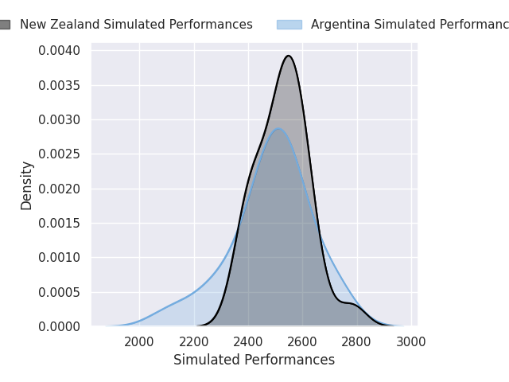
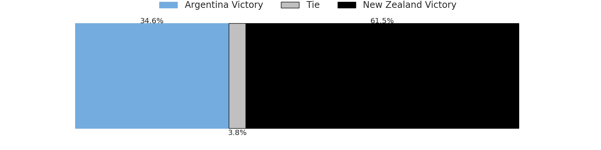
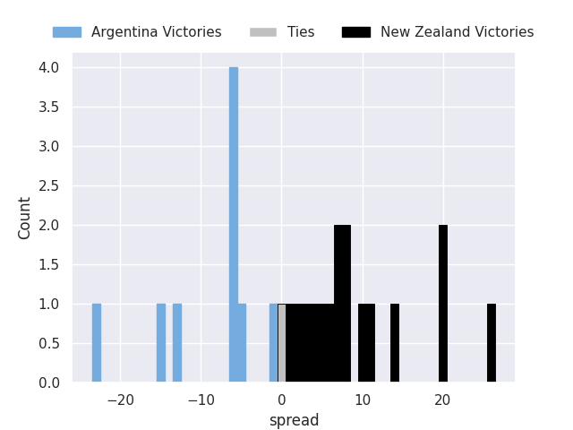

### Fiji V Canada on 2027-10-22

Average Margin: Fiji by 22.0

### Ireland V Scotland on 2027-10-22

Average Margin: Ireland by 10.4

### Ireland V Portugal on 2027-10-22

Average Margin: Ireland by 18.7

### Ireland V Georgia on 2027-10-22

Average Margin: Ireland by 19.7

### Ireland V Spain on 2027-10-22

Average Margin: Ireland by 25.2

### Ireland V Italy on 2027-10-22

Average Margin: Ireland by 16.1

### Ireland V United States of America on 2027-10-22

Average Margin: Ireland by 27.3

### Ireland V Japan on 2027-10-22

Average Margin: Ireland by 20.7

### Ireland V Chile on 2027-10-22

Average Margin: Ireland by 20.1

### Ireland V Uruguay on 2027-10-22

Average Margin: Ireland by 25.5

### Ireland V Zimbabwe on 2027-10-22

Average Margin: Ireland by 18.5

### Scotland V Zimbabwe on 2027-10-22

Average Margin: Scotland by 17.7

### Scotland V Uruguay on 2027-10-22

Average Margin: Scotland by 14.9

### Ireland V Argentina on 2027-10-22

Average Margin: Argentina by 2.3

### Ireland V Wales on 2027-10-22

Average Margin: Ireland by 17.6

### Ireland V Australia on 2027-10-22

Average Margin: Ireland by 15.7

### Australia V France on 2027-10-22

Average Margin: France by 7.0

### Chile V Japan on 2027-10-22

Average Margin: Japan by 3.7

### Japan V Uruguay on 2027-10-22

Average Margin: Japan by 4.0

### Japan V Ireland on 2027-10-22

Average Margin: Ireland by 11.2

### New Zealand V Australia on 2027-10-22

Average Margin: New Zealand by 12.3

### New Zealand V Hong Kong on 2027-10-22

Average Margin: New Zealand by 45.5

### Australia V Hong Kong on 2027-10-22

Average Margin: Australia by 38.0

### New Zealand V Fiji on 2027-10-22

Average Margin: New Zealand by 3.5

### New Zealand V Romania on 2027-10-22

Average Margin: New Zealand by 28.0

### Australia V Samoa on 2027-10-22

Average Margin: Australia by 24.4

### Australia V Wales on 2027-10-22

Average Margin: Australia by 6.7

### Australia V Italy on 2027-10-22

Average Margin: Australia by 11.7

### Australia V Canada on 2027-10-22

Average Margin: Australia by 11.0

### New Zealand V Ireland on 2027-10-22

Average Margin: New Zealand by 21.0

### New Zealand V Scotland on 2027-10-22

Average Margin: Scotland by 15.0

### Australia V Scotland on 2027-10-22

Average Margin: Australia by 4.0

### South Africa V Spain on 2027-10-22

Average Margin: South Africa by 34.9

### South Africa V Zimbabwe on 2027-10-22

Average Margin: South Africa by 26.4

### South Africa V Uruguay on 2027-10-22

Average Margin: South Africa by 29.1

### South Africa V Italy on 2027-10-22

Average Margin: South Africa by 24.1

### Australia V Japan on 2027-10-22

Average Margin: Australia by 7.7

### Australia V Tonga on 2027-10-22

Average Margin: Australia by 15.2

### Australia V Portugal on 2027-10-22

Average Margin: Australia by 8.3

### Australia V Spain on 2027-10-22

Average Margin: Australia by 20.0

### Australia V Georgia on 2027-10-22

Average Margin: Australia by 10.4

### New Zealand V Chile on 2027-10-22

Average Margin: New Zealand by 27.2

### New Zealand V Wales on 2027-10-22

Average Margin: New Zealand by 23.9

### New Zealand V Zimbabwe on 2027-10-22

Average Margin: New Zealand by 25.2

### Australia V Zimbabwe on 2027-10-22

Average Margin: Australia by 14.7

### New Zealand V Portugal on 2027-10-22

Average Margin: New Zealand by 22.0

### Australia V Uruguay on 2027-10-22

Average Margin: Australia by 11.7

### New Zealand V United States of America on 2027-10-22

Average Margin: New Zealand by 32.4

### New Zealand V Spain on 2027-10-22

Average Margin: New Zealand by 28.9

### New Zealand V Uruguay on 2027-10-22

Average Margin: New Zealand by 26.0

### New Zealand V Samoa on 2027-10-22

Average Margin: New Zealand by 34.8

### Australia V United States of America on 2027-10-22

Average Margin: Australia by 17.8

### New Zealand V Canada on 2027-10-22

Average Margin: New Zealand by 43.5

### Australia V Chile on 2027-10-22

Average Margin: Australia by 12.6

### New Zealand V Italy on 2027-10-22

Average Margin: New Zealand by 24.9

### New Zealand V Japan on 2027-10-22

Average Margin: New Zealand by 27.8

### New Zealand V Tonga on 2027-10-22

Average Margin: New Zealand by 41.9

### South Africa V Chile on 2027-10-22

Average Margin: South Africa by 31.8

### Scotland V England on 2027-10-22

Average Margin: Scotland by 12.0

### South Africa V Tonga on 2027-10-22

Average Margin: South Africa by 44.7

### South Africa V Georgia on 2027-10-22

Average Margin: South Africa by 28.4

### Argentina V England on 2027-10-22

Average Margin: Argentina by 8.2

### Fiji V England on 2027-10-22

Average Margin: Fiji by 2.7

### Argentina V Tonga on 2027-10-22

Average Margin: Argentina by 30.7

### Spain V Wales on 2027-10-22

Average Margin: Spain by 1.0

### Argentina V Zimbabwe on 2027-10-22

Average Margin: Argentina by 17.1

### Fiji V Tonga on 2027-10-22

Average Margin: Fiji by 27.1

### Spain V Zimbabwe on 2027-10-22

Average Margin: Spain by 1.7

### Argentina V Wales on 2027-10-22

Average Margin: Argentina by 18.0

### Spain V England on 2027-10-22

Average Margin: England by 24.8

### Canada V Zimbabwe on 2027-10-22

Average Margin: Canada by 10.0

### Canada V England on 2027-10-22

Average Margin: England by 36.0

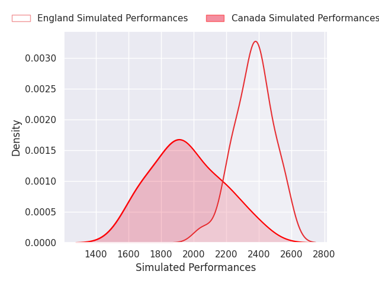
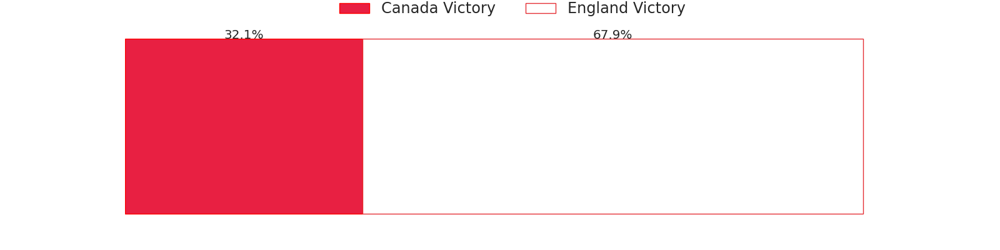
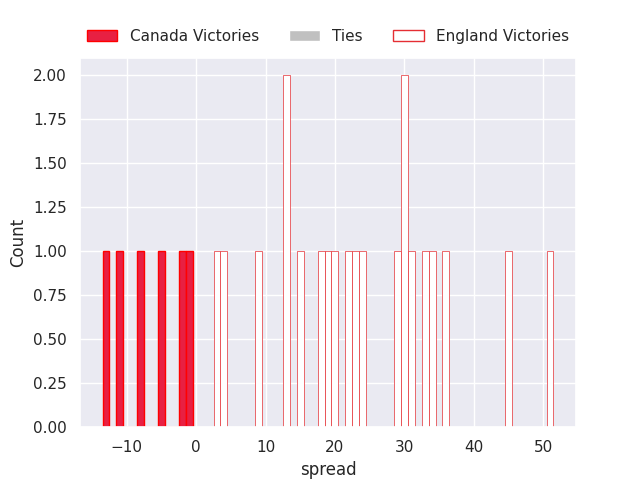

### France V Portugal on 2027-10-22

Average Margin: France by 19.8

### France V Scotland on 2027-10-22

Average Margin: France by 9.3

### Japan V Scotland on 2027-10-22

Average Margin: Scotland by 4.4

### France V Ireland on 2027-10-22

Average Margin: France by 4.6

### France V Uruguay on 2027-10-22

Average Margin: France by 21.3

### Canada V Wales on 2027-10-22

Average Margin: Canada by 1.0

### Fiji V Wales on 2027-10-22

Average Margin: Fiji by 15.3

### Fiji V Zimbabwe on 2027-10-22

Average Margin: Fiji by 15.9

### Italy V Zimbabwe on 2027-10-22

Average Margin: Italy by 21.0

### South Africa V Samoa on 2027-10-22

Average Margin: South Africa by 37.6

### South Africa V Wales on 2027-10-22

Average Margin: South Africa by 26.5

### South Africa V United States of America on 2027-10-22

Average Margin: South Africa by 35.2

### South Africa V Japan on 2027-10-22

Average Margin: South Africa by 26.4

### South Africa V Scotland on 2027-10-22

Average Margin: South Africa by 23.9

### South Africa V Canada on 2027-10-22

Average Margin: South Africa by 52.7

### Italy V Chile on 2027-10-22

Average Margin: Italy by 28.0

### South Africa V Australia on 2027-10-22

Average Margin: South Africa by 25.9

### Italy V Samoa on 2027-10-22

Average Margin: Italy by 32.0

### Italy V Portugal on 2027-10-22

Average Margin: Italy by 17.0

### Italy V Spain on 2027-10-22

Average Margin: Italy by 20.0

### Italy V Georgia on 2027-10-22

Average Margin: Georgia by 0.5

### South Africa V Fiji on 2027-10-22

Average Margin: South Africa by 20.0

### South Africa V Ireland on 2027-10-22

Average Margin: South Africa by 24.0

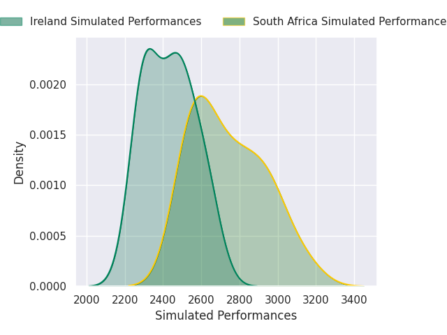

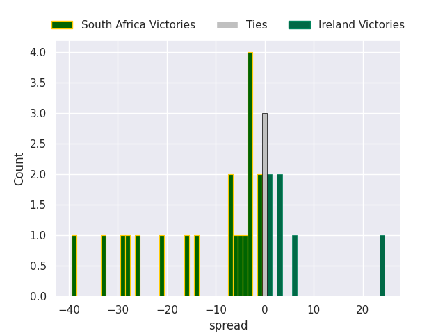

### South Africa V Hong Kong on 2027-10-22

Average Margin: South Africa by 37.0

### South Africa V Argentina on 2027-10-22

Average Margin: South Africa by 22.0

### Georgia V Chile on 2027-10-22

Average Margin: Chile by 10.0

### South Africa V Portugal on 2027-10-22

Average Margin: South Africa by 27.7

### Uruguay V Fiji on 2027-10-22

Average Margin: Uruguay by 6.0

## Week 5

### New Zealand V South Africa on 2027-10-29

Average Margin: New Zealand by 0.7

### Argentina V Australia on 2027-10-29

Average Margin: Argentina by 7.0

### Italy V Ireland on 2027-10-29

Average Margin: Ireland by 6.3

### Argentina V Chile on 2027-10-29

Average Margin: Argentina by 20.1

### Uruguay V Ireland on 2027-10-29

Average Margin: Ireland by 10.5

### Georgia V Scotland on 2027-10-29

Average Margin: Georgia by 7.3

### Georgia V Ireland on 2027-10-29

Average Margin: Ireland by 9.2

### Fiji V Spain on 2027-10-29

Average Margin: Fiji by 20.0

### Fiji V Argentina on 2027-10-29

Average Margin: Argentina by 2.6

### Chile V Ireland on 2027-10-29

Average Margin: Ireland by 10.8

### Portugal V Ireland on 2027-10-29

Average Margin: Ireland by 1.7

### Samoa V England on 2027-10-29

Average Margin: England by 8.0

### New Zealand V Wales on 2027-10-29

Average Margin: New Zealand by 25.5

### France V Wales on 2027-10-29

Average Margin: France by 6.0

### Japan V South Africa on 2027-10-29

Average Margin: South Africa by 21.5

### Japan V Wales on 2027-10-29

Average Margin: Japan by 10.0

### France V Georgia on 2027-10-29

Average Margin: France by 27.0

### Samoa V Italy on 2027-10-29

Average Margin: Italy by 9.0

### France V Italy on 2027-10-29

Average Margin: France by 13.4

### Chile V Italy on 2027-10-29

Average Margin: Italy by 3.3

### United States of America V Italy on 2027-10-29

Average Margin: Italy by 34.0

### Japan V Georgia on 2027-10-29

Average Margin: Japan by 4.5

### Georgia V Wales on 2027-10-29

Average Margin: Wales by 1.0

### Argentina V Italy on 2027-10-29

Average Margin: Argentina by 14.4

### Spain V Portugal on 2027-10-29

Average Margin: Portugal by 8.0

### Chile V Zimbabwe on 2027-10-29

Average Margin: Zimbabwe by 19.0

### Fiji V Zimbabwe on 2027-10-29

Average Margin: Fiji by 27.5

### Argentina V United States of America on 2027-10-29

Average Margin: Argentina by 18.0

### Uruguay V Scotland on 2027-10-29

Average Margin: Scotland by 7.5

### Fiji V Australia on 2027-10-29

Average Margin: Fiji by 26.0

### Australia V Ireland on 2027-10-29

Average Margin: Ireland by 15.0

### New Zealand V Scotland on 2027-10-29

Average Margin: New Zealand by 9.0

### Chile V Scotland on 2027-10-29

Average Margin: Scotland by 14.0

### England V Portugal on 2027-10-29

Average Margin: Portugal by 1.0

### Samoa V Ireland on 2027-10-29

Average Margin: Ireland by 15.0

### Fiji V Georgia on 2027-10-29

Average Margin: Fiji by 11.5

### United States of America V England on 2027-10-29

Average Margin: England by 10.8

### Argentina V Uruguay on 2027-10-29

Average Margin: Argentina by 11.0

### Italy V Scotland on 2027-10-29

Average Margin: Scotland by 8.0

### Portugal V Scotland on 2027-10-29

Average Margin: Scotland by 9.5

### Argentina V Wales on 2027-10-29

Average Margin: Argentina by 16.4

### Argentina V Zimbabwe on 2027-10-29

Average Margin: Argentina by 8.5

### Japan V Ireland on 2027-10-29

Average Margin: Ireland by 4.0

### Argentina V Portugal on 2027-10-29

Average Margin: Argentina by 26.8

### Scotland V Zimbabwe on 2027-10-29

Average Margin: Scotland by 14.3

### Fiji V Wales on 2027-10-29

Average Margin: Fiji by 30.0

### Chile V Wales on 2027-10-29

Average Margin: Wales by 14.0

### Scotland V Ireland on 2027-10-29

Average Margin: Ireland by 1.3

### United States of America V Ireland on 2027-10-29

Average Margin: Ireland by 10.0

### Argentina V Spain on 2027-10-29

Average Margin: Argentina by 29.0

### Japan V Italy on 2027-10-29

Average Margin: Japan by 3.0

### Chile V England on 2027-10-29

Average Margin: England by 15.1

### Argentina V France on 2027-10-29

Average Margin: Argentina by 0.5

### Argentina V Scotland on 2027-10-29

Average Margin: Argentina by 5.1

### Zimbabwe V France on 2027-10-29

Average Margin: France by 6.8

### Fiji V Scotland on 2027-10-29

Average Margin: Fiji by 4.7

### Fiji V France on 2027-10-29

Average Margin: Fiji by 0.5

### Scotland V South Africa on 2027-10-29

Average Margin: Scotland by 10.0

### New Zealand V Portugal on 2027-10-29

Average Margin: New Zealand by 17.0

### Chile V South Africa on 2027-10-29

Average Margin: South Africa by 25.0

### Australia V Zimbabwe on 2027-10-29

Average Margin: Australia by 14.0

### New Zealand V Chile on 2027-10-29

Average Margin: New Zealand by 23.0

### New Zealand V Georgia on 2027-10-29

Average Margin: New Zealand by 20.5

### Australia V Italy on 2027-10-29

Average Margin: Australia by 1.0

### New Zealand V Zimbabwe on 2027-10-29

Average Margin: New Zealand by 21.5

### Uruguay V South Africa on 2027-10-29

Average Margin: South Africa by 30.0

### Fiji V South Africa on 2027-10-29

Average Margin: South Africa by 8.0

### Spain V South Africa on 2027-10-29

Average Margin: South Africa by 24.5

### New Zealand V Italy on 2027-10-29

Average Margin: New Zealand by 23.3

### Zimbabwe V South Africa on 2027-10-29

Average Margin: South Africa by 29.3

### Portugal V South Africa on 2027-10-29

Average Margin: South Africa by 19.9

### Georgia V South Africa on 2027-10-29

Average Margin: South Africa by 22.3

### Australia V South Africa on 2027-10-29

Average Margin: South Africa by 14.3

### England V France on 2027-10-29

Average Margin: France by 1.2

### Spain V France on 2027-10-29

Average Margin: France by 17.1

### Fiji V Japan on 2027-10-29

Average Margin: Fiji by 11.8

### Wales V Scotland on 2027-10-29

Average Margin: Scotland by 11.4

### Australia V Georgia on 2027-10-29

Average Margin: Australia by 11.6

### France V England on 2027-10-29

Average Margin: France by 4.3

### Japan V England on 2027-10-29

Average Margin: England by 4.9

### New Zealand V England on 2027-10-29

Average Margin: New Zealand by 10.0

### Australia V England on 2027-10-29

Average Margin: England by 1.2

### Zimbabwe V Ireland on 2027-10-29

Average Margin: Ireland by 27.3

### Spain V Ireland on 2027-10-29

Average Margin: Ireland by 17.5

### Canada V France on 2027-10-29

Average Margin: France by 15.0

### Zimbabwe V Japan on 2027-10-29

Average Margin: Zimbabwe by 6.0

### Wales V Ireland on 2027-10-29

Average Margin: Ireland by 14.5

### Australia V Wales on 2027-10-29

Average Margin: Australia by 10.6

### Spain V Scotland on 2027-10-29

Average Margin: Scotland by 16.5

### Fiji V Portugal on 2027-10-29

Average Margin: Fiji by 7.0

### Zimbabwe V Scotland on 2027-10-29

Average Margin: Scotland by 8.4

### England V Ireland on 2027-10-29

Average Margin: England by 2.0

### Argentina V Ireland on 2027-10-29

Average Margin: Argentina by 0.5

### Fiji V Uruguay on 2027-10-29

Average Margin: Fiji by 23.0

### England V Scotland on 2027-10-29

Average Margin: England by 6.0

### Fiji V Ireland on 2027-10-29

Average Margin: Fiji by 2.2

### Wales V Japan on 2027-10-29

Average Margin: Wales by 11.0

### Argentina V Japan on 2027-10-29

Average Margin: Argentina by 7.7

### Wales V France on 2027-10-29

Average Margin: France by 11.8

### Tonga V Scotland on 2027-10-29

Average Margin: Scotland by 2.0

### Argentina V Georgia on 2027-10-29

Average Margin: Argentina by 19.5

## Week 6

### South Africa V Fiji on 2027-11-05

Average Margin: South Africa by 19.7

### England V Fiji on 2027-11-05

Average Margin: England by 7.1

### Japan V Argentina on 2027-11-05

Average Margin: Argentina by 5.8

### France V Argentina on 2027-11-05

Average Margin: France by 3.9

### England V Scotland on 2027-11-05

Average Margin: England by 5.4

### New Zealand V Georgia on 2027-11-05

Average Margin: New Zealand by 11.0

### France V Scotland on 2027-11-05

Average Margin: France by 9.0

### Wales V Ireland on 2027-11-05

Average Margin: Ireland by 7.0

### Japan V Scotland on 2027-11-05

Average Margin: Japan by 0.8

### Italy V Argentina on 2027-11-05

Average Margin: Italy by 3.9

### England V Wales on 2027-11-05

Average Margin: England by 18.0

### Australia V Portugal on 2027-11-05

Average Margin: Portugal by 15.0

### England V Zimbabwe on 2027-11-05

Average Margin: Zimbabwe by 3.2

### Chile V Ireland on 2027-11-05

Average Margin: Chile by 6.5

### Wales V Argentina on 2027-11-05

Average Margin: Argentina by 13.7

### Italy V Scotland on 2027-11-05

Average Margin: Italy by 5.0

### Japan V Fiji on 2027-11-05

Average Margin: Japan by 1.5

### Chile V Argentina on 2027-11-05

Average Margin: Argentina by 15.2

### Australia V Georgia on 2027-11-05

Average Margin: Georgia by 12.0

### England V Georgia on 2027-11-05

Average Margin: England by 15.0

### United States of America V Ireland on 2027-11-05

Average Margin: Ireland by 1.0

### New Zealand V Portugal on 2027-11-05

Average Margin: New Zealand by 20.0

### Australia V Chile on 2027-11-05

Average Margin: Chile by 9.0

### England V Uruguay on 2027-11-05

Average Margin: England by 15.0

### France V Fiji on 2027-11-05

Average Margin: Fiji by 4.0

### England V New Zealand on 2027-11-05

Average Margin: New Zealand by 8.0

### Georgia V Argentina on 2027-11-05

Average Margin: Argentina by 12.5

### Italy V Ireland on 2027-11-05

Average Margin: Ireland by 5.7

### Australia V Ireland on 2027-11-05

Average Margin: Ireland by 3.7

### France V Ireland on 2027-11-05

Average Margin: Ireland by 2.5

### South Africa V France on 2027-11-05

Average Margin: South Africa by 13.3

### New Zealand V Fiji on 2027-11-05

Average Margin: New Zealand by 14.1

### South Africa V Zimbabwe on 2027-11-05

Average Margin: South Africa by 21.2

### South Africa V Scotland on 2027-11-05

Average Margin: South Africa by 15.3

### New Zealand V France on 2027-11-05

Average Margin: New Zealand by 10.0

### South Africa V Argentina on 2027-11-05

Average Margin: South Africa by 17.7

### New Zealand V Argentina on 2027-11-05

Average Margin: New Zealand by 12.9

### New Zealand V Scotland on 2027-11-05

Average Margin: New Zealand by 11.7

### South Africa V Wales on 2027-11-05

Average Margin: South Africa by 26.0

### New Zealand V Zimbabwe on 2027-11-05

Average Margin: New Zealand by 22.0

### South Africa V Ireland on 2027-11-05

Average Margin: South Africa by 12.0

### New Zealand V Ireland on 2027-11-05

Average Margin: New Zealand by 8.3

### Japan V Zimbabwe on 2027-11-05

Average Margin: Japan by 11.0

### South Africa V England on 2027-11-05

Average Margin: South Africa by 15.6

### Australia V Scotland on 2027-11-05

Average Margin: Australia by 15.0

### New Zealand V England on 2027-11-05

Average Margin: New Zealand by 2.2

### Australia V Argentina on 2027-11-05

Average Margin: Argentina by 0.0

### Australia V England on 2027-11-05

Average Margin: Australia by 12.5

### Australia V France on 2027-11-05

Average Margin: Australia by 4.2

### New Zealand V Japan on 2027-11-05

Average Margin: New Zealand by 21.0

### New Zealand V Wales on 2027-11-05

Average Margin: New Zealand by 33.7

### Italy V Fiji on 2027-11-05

Average Margin: Fiji by 4.0

### Scotland V Fiji on 2027-11-05

Average Margin: Scotland by 6.0

### England V Ireland on 2027-11-05

Average Margin: England by 1.2

### England V Argentina on 2027-11-05

Average Margin: England by 1.8

### Japan V Ireland on 2027-11-05

Average Margin: Ireland by 7.3

### Australia V Fiji on 2027-11-05

Average Margin: Australia by 10.0

### Georgia V Fiji on 2027-11-05

Average Margin: Fiji by 14.0

## Week 7

### Fiji V Ireland on 2027-11-12

Average Margin: Ireland by 0.5

### South Africa V Scotland on 2027-11-12

Average Margin: South Africa by 15.5

### Scotland V Australia on 2027-11-12

Average Margin: Scotland by 8.8

### England V Wales on 2027-11-12

Average Margin: England by 7.7

### New Zealand V Italy on 2027-11-12

Average Margin: New Zealand by 19.8

### Ireland V Italy on 2027-11-12

Average Margin: Ireland by 14.0

### Argentina V Uruguay on 2027-11-12

Average Margin: Argentina by 7.0

### Wales V Argentina on 2027-11-12

Average Margin: Wales by 3.0

### South Africa V Italy on 2027-11-12

Average Margin: South Africa by 13.0

### Ireland V Australia on 2027-11-12

Average Margin: Ireland by 14.0

### England V Portugal on 2027-11-12

Average Margin: Portugal by 22.0

### Fiji V Italy on 2027-11-12

Average Margin: Fiji by 1.5

### New Zealand V Wales on 2027-11-12

Average Margin: New Zealand by 23.0

### Fiji V United States of America on 2027-11-12

Average Margin: Fiji by 3.0

### Fiji V Chile on 2027-11-12

Average Margin: Chile by 0.7

### South Africa V Fiji on 2027-11-12

Average Margin: South Africa by 18.8

### France V Wales on 2027-11-12

Average Margin: France by 5.0

### South Africa V New Zealand on 2027-11-12

Average Margin: South Africa by 11.5

### Fiji V Wales on 2027-11-12

Average Margin: Fiji by 18.5

### South Africa V England on 2027-11-12

Average Margin: South Africa by 13.2

### New Zealand V Japan on 2027-11-12

Average Margin: New Zealand by 24.0

### France V Zimbabwe on 2027-11-12

Average Margin: France by 25.0

### Zimbabwe V Ireland on 2027-11-12

Average Margin: Zimbabwe by 4.0

### Ireland V Japan on 2027-11-12

Average Margin: Ireland by 1.0

### New Zealand V Georgia on 2027-11-12

Average Margin: Georgia by 1.0

### France V Scotland on 2027-11-12

Average Margin: France by 15.0

### Fiji V France on 2027-11-12

Average Margin: Fiji by 12.5

### South Africa V Chile on 2027-11-12

Average Margin: South Africa by 24.5

### England V Ireland on 2027-11-12

Average Margin: England by 7.7

### South Africa V Georgia on 2027-11-12

Average Margin: South Africa by 36.0

### New Zealand V Chile on 2027-11-12

Average Margin: New Zealand by 14.0

### Fiji V Scotland on 2027-11-12

Average Margin: Fiji by 3.7

### New Zealand V Portugal on 2027-11-12

Average Margin: New Zealand by 10.0

### Australia V Ireland on 2027-11-12

Average Margin: Australia by 1.3

### New Zealand V France on 2027-11-12

Average Margin: New Zealand by 9.1

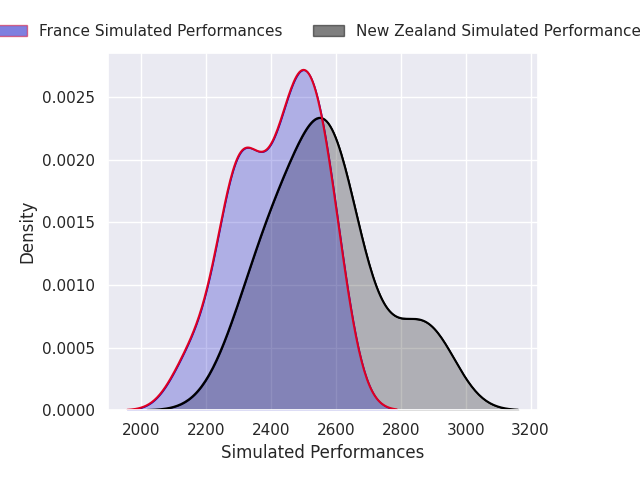
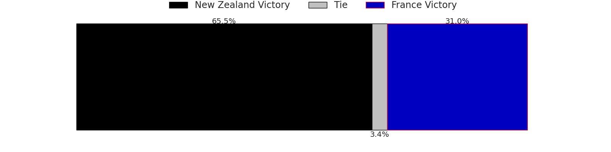
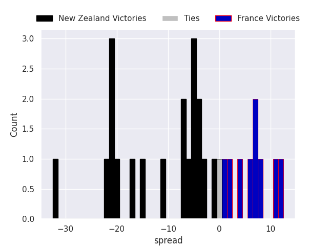

### New Zealand V Scotland on 2027-11-12

Average Margin: New Zealand by 9.1

### South Africa V France on 2027-11-12

Average Margin: South Africa by 20.8

### New Zealand V Fiji on 2027-11-12

Average Margin: New Zealand by 12.6

### Fiji V Georgia on 2027-11-12

Average Margin: Fiji by 14.0

### Scotland V Italy on 2027-11-12

Average Margin: Scotland by 18.0

### Wales V Ireland on 2027-11-12

Average Margin: Ireland by 18.0

### Argentina V Chile on 2027-11-12

Average Margin: Argentina by 20.0

### Scotland V Japan on 2027-11-12

Average Margin: Scotland by 15.0

### Argentina V Georgia on 2027-11-12

Average Margin: Argentina by 13.0

### South Africa V Zimbabwe on 2027-11-12

Average Margin: South Africa by 21.0

### Fiji V New Zealand on 2027-11-12

Average Margin: New Zealand by 3.1

### South Africa V Australia on 2027-11-12

Average Margin: South Africa by 19.1

### France V Argentina on 2027-11-12

Average Margin: France by 6.1

### Scotland V England on 2027-11-12

Average Margin: Scotland by 8.5

### Argentina V England on 2027-11-12

Average Margin: Argentina by 3.0

### Zimbabwe V Fiji on 2027-11-12

Average Margin: Zimbabwe by 5.0

### France V Japan on 2027-11-12

Average Margin: France by 18.1

### France V New Zealand on 2027-11-12

Average Margin: France by 0.9

### France V Fiji on 2027-11-12

Average Margin: France by 10.5

### France V Australia on 2027-11-12

Average Margin: France by 11.5

### France V Georgia on 2027-11-12

Average Margin: France by 19.0

### Fiji V Australia on 2027-11-12

Average Margin: Fiji by 6.7

### Argentina V Italy on 2027-11-12

Average Margin: Argentina by 14.0

### South Africa V Ireland on 2027-11-12

Average Margin: South Africa by 9.8

### Scotland V Ireland on 2027-11-12

Average Margin: Scotland by 3.5

### France V England on 2027-11-12

Average Margin: France by 10.0

### Fiji V Argentina on 2027-11-12

Average Margin: Fiji by 0.9

### Scotland V France on 2027-11-12

Average Margin: France by 2.6

### Zimbabwe V Japan on 2027-11-12

Average Margin: Japan by 6.0

### Fiji V England on 2027-11-12

Average Margin: Fiji by 4.7

### France V Ireland on 2027-11-12

Average Margin: France by 6.4

### Scotland V Argentina on 2027-11-12

Average Margin: Scotland by 1.1

### Argentina V Japan on 2027-11-12

Average Margin: Argentina by 16.2

### Wales V Australia on 2027-11-12

Average Margin: Australia by 0.3

### New Zealand V Ireland on 2027-11-12

Average Margin: New Zealand by 13.6

### Argentina V Australia on 2027-11-12

Average Margin: Argentina by 8.5

### Zimbabwe V Argentina on 2027-11-12

Average Margin: Zimbabwe by 2.4

### Zimbabwe V Australia on 2027-11-12

Average Margin: Zimbabwe by 9.3

### Fiji V Japan on 2027-11-12

Average Margin: Fiji by 6.9

### South Africa V Japan on 2027-11-12

Average Margin: South Africa by 45.0

### England V Japan on 2027-11-12

Average Margin: England by 22.0

### Scotland V Wales on 2027-11-12

Average Margin: Scotland by 13.5

### New Zealand V Australia on 2027-11-12

Average Margin: New Zealand by 16.4

### Zimbabwe V New Zealand on 2027-11-12

Average Margin: Zimbabwe by 2.5

### England V Australia on 2027-11-12

Average Margin: England by 18.5

### New Zealand V England on 2027-11-12

Average Margin: New Zealand by 13.9

### Scotland V New Zealand on 2027-11-12

Average Margin: New Zealand by 3.2

### New Zealand V Argentina on 2027-11-12

Average Margin: New Zealand by 7.8

### South Africa V Argentina on 2027-11-12

Average Margin: South Africa by 22.6

### Ireland V England on 2027-11-12

Average Margin: Ireland by 2.9

### Scotland V Fiji on 2027-11-12

Average Margin: Scotland by 9.4

### Ireland V Georgia on 2027-11-12

Average Margin: Ireland by 16.0

### Zimbabwe V England on 2027-11-12

Average Margin: Zimbabwe by 18.5

### Argentina V Ireland on 2027-11-12

Average Margin: Argentina by 0.2

### France V Italy on 2027-11-12

Average Margin: France by 13.2

### New Zealand V Zimbabwe on 2027-11-12

Average Margin: New Zealand by 3.0

