# Team Rankings

# Standings

## Current Standings

### Pool A

| Club   | Played   | Wins   | Point Differential   | Losing Bonus Points   | Try Bonus Points   | Competition Points   |
|--------|----------|--------|----------------------|-----------------------|--------------------|----------------------|

### Pool B

| Club   | Played   | Wins   | Point Differential   | Losing Bonus Points   | Try Bonus Points   | Competition Points   |
|--------|----------|--------|----------------------|-----------------------|--------------------|----------------------|

### Pool C

| Club   | Played   | Wins   | Point Differential   | Losing Bonus Points   | Try Bonus Points   | Competition Points   |
|--------|----------|--------|----------------------|-----------------------|--------------------|----------------------|

### Pool D

| Club   | Played   | Wins   | Point Differential   | Losing Bonus Points   | Try Bonus Points   | Competition Points   |
|--------|----------|--------|----------------------|-----------------------|--------------------|----------------------|

### Pool E

| Club   | Played   | Wins   | Point Differential   | Losing Bonus Points   | Try Bonus Points   | Competition Points   |
|--------|----------|--------|----------------------|-----------------------|--------------------|----------------------|

### Pool F

| Club   | Played   | Wins   | Point Differential   | Losing Bonus Points   | Try Bonus Points   | Competition Points   |
|--------|----------|--------|----------------------|-----------------------|--------------------|----------------------|

## Projected Remaining Table

### Pool A

| Club        |   To Play |   Projected Wins |   Projected Differential |   Projected Losing Bonus Points | Projected Try Bonus Points   |   Projected Competition Points |
|:------------|----------:|-----------------:|-------------------------:|--------------------------------:|:-----------------------------|-------------------------------:|
| New Zealand |         3 |            2.772 |                   79.19  |                           0.158 |                              |                         11.284 |
| Australia   |         3 |            2.073 |                   36.063 |                           0.297 |                              |                          8.663 |
| Chile       |         3 |            1.041 |                  -21.486 |                           0.239 |                              |                          4.467 |
| Hong Kong   |         3 |            0.066 |                  -93.767 |                           0.123 |                              |                          0.403 |

### Pool B

| Club         |   To Play |   Projected Wins |   Projected Differential |   Projected Losing Bonus Points | Projected Try Bonus Points   |   Projected Competition Points |
|:-------------|----------:|-----------------:|-------------------------:|--------------------------------:|:-----------------------------|-------------------------------:|
| South Africa |         3 |            2.963 |                   96.319 |                           0.024 |                              |                         11.888 |
| Italy        |         3 |            1.736 |                    7.07  |                           0.193 |                              |                          7.223 |
| Georgia      |         3 |            1.214 |                  -12.307 |                           0.309 |                              |                          5.241 |
| Romania      |         3 |            0.038 |                  -91.082 |                           0.116 |                              |                          0.29  |

### Pool C

| Club      |   To Play |   Projected Wins |   Projected Differential |   Projected Losing Bonus Points | Projected Try Bonus Points   |   Projected Competition Points |
|:----------|----------:|-----------------:|-------------------------:|--------------------------------:|:-----------------------------|-------------------------------:|
| Argentina |         3 |            2.691 |                   62.557 |                           0.169 |                              |                         11.015 |
| Fiji      |         3 |            2.188 |                   44.961 |                           0.26  |                              |                          9.092 |
| Spain     |         3 |            0.945 |                  -28.763 |                           0.237 |                              |                          4.063 |
| Canada    |         3 |            0.115 |                  -78.755 |                           0.199 |                              |                          0.695 |

### Pool D

| Club     |   To Play |   Projected Wins |   Projected Differential |   Projected Losing Bonus Points | Projected Try Bonus Points   |   Projected Competition Points |
|:---------|----------:|-----------------:|-------------------------:|--------------------------------:|:-----------------------------|-------------------------------:|
| Ireland  |         3 |            2.686 |                   48.671 |                           0.197 |                              |                         11.013 |
| Scotland |         3 |            2.048 |                   23.769 |                           0.338 |                              |                          8.608 |
| Uruguay  |         3 |            0.704 |                  -34.109 |                           0.4   |                              |                          3.306 |
| Portugal |         3 |            0.48  |                  -38.331 |                           0.467 |                              |                          2.475 |

### Pool E

| Club                     |   To Play |   Projected Wins |   Projected Differential |   Projected Losing Bonus Points | Projected Try Bonus Points   |   Projected Competition Points |
|:-------------------------|----------:|-----------------:|-------------------------:|--------------------------------:|:-----------------------------|-------------------------------:|
| France                   |         3 |            2.935 |                   77.181 |                           0.038 |                              |                         11.802 |
| Japan                    |         3 |            1.818 |                   10.259 |                           0.247 |                              |                          7.591 |
| United States of America |         3 |            0.828 |                  -33.786 |                           0.327 |                              |                          3.733 |
| Samoa                    |         3 |            0.352 |                  -53.654 |                           0.395 |                              |                          1.881 |

### Pool F

| Club     |   To Play |   Projected Wins |   Projected Differential |   Projected Losing Bonus Points | Projected Try Bonus Points   |   Projected Competition Points |
|:---------|----------:|-----------------:|-------------------------:|--------------------------------:|:-----------------------------|-------------------------------:|
| England  |         3 |            2.814 |                   64.318 |                           0.113 |                              |                         11.419 |
| Wales    |         3 |            1.58  |                    3.58  |                           0.326 |                              |                          6.754 |
| Zimbabwe |         3 |            1.179 |                  -11.113 |                           0.517 |                              |                          5.373 |
| Tonga    |         3 |            0.335 |                  -56.785 |                           0.313 |                              |                          1.723 |

## Projected Total Table

### Pool A

| Club        |   Played |   Wins |   Point Differential |   Losing Bonus Points | Try Bonus Points   |   Competition Points |
|:------------|---------:|-------:|---------------------:|----------------------:|:-------------------|---------------------:|
| New Zealand |        3 |  2.772 |               79.19  |                 0.158 |                    |               11.284 |
| Australia   |        3 |  2.073 |               36.063 |                 0.297 |                    |                8.663 |
| Chile       |        3 |  1.041 |              -21.486 |                 0.239 |                    |                4.467 |
| Hong Kong   |        3 |  0.066 |              -93.767 |                 0.123 |                    |                0.403 |

### Pool B

| Club         |   Played |   Wins |   Point Differential |   Losing Bonus Points | Try Bonus Points   |   Competition Points |
|:-------------|---------:|-------:|---------------------:|----------------------:|:-------------------|---------------------:|
| South Africa |        3 |  2.963 |               96.319 |                 0.024 |                    |               11.888 |
| Italy        |        3 |  1.736 |                7.07  |                 0.193 |                    |                7.223 |
| Georgia      |        3 |  1.214 |              -12.307 |                 0.309 |                    |                5.241 |
| Romania      |        3 |  0.038 |              -91.082 |                 0.116 |                    |                0.29  |

### Pool C

| Club      |   Played |   Wins |   Point Differential |   Losing Bonus Points | Try Bonus Points   |   Competition Points |
|:----------|---------:|-------:|---------------------:|----------------------:|:-------------------|---------------------:|
| Argentina |        3 |  2.691 |               62.557 |                 0.169 |                    |               11.015 |
| Fiji      |        3 |  2.188 |               44.961 |                 0.26  |                    |                9.092 |
| Spain     |        3 |  0.945 |              -28.763 |                 0.237 |                    |                4.063 |
| Canada    |        3 |  0.115 |              -78.755 |                 0.199 |                    |                0.695 |

### Pool D

| Club     |   Played |   Wins |   Point Differential |   Losing Bonus Points | Try Bonus Points   |   Competition Points |
|:---------|---------:|-------:|---------------------:|----------------------:|:-------------------|---------------------:|
| Ireland  |        3 |  2.686 |               48.671 |                 0.197 |                    |               11.013 |
| Scotland |        3 |  2.048 |               23.769 |                 0.338 |                    |                8.608 |
| Uruguay  |        3 |  0.704 |              -34.109 |                 0.4   |                    |                3.306 |
| Portugal |        3 |  0.48  |              -38.331 |                 0.467 |                    |                2.475 |

### Pool E

| Club                     |   Played |   Wins |   Point Differential |   Losing Bonus Points | Try Bonus Points   |   Competition Points |
|:-------------------------|---------:|-------:|---------------------:|----------------------:|:-------------------|---------------------:|
| France                   |        3 |  2.935 |               77.181 |                 0.038 |                    |               11.802 |
| Japan                    |        3 |  1.818 |               10.259 |                 0.247 |                    |                7.591 |
| United States of America |        3 |  0.828 |              -33.786 |                 0.327 |                    |                3.733 |
| Samoa                    |        3 |  0.352 |              -53.654 |                 0.395 |                    |                1.881 |

### Pool F

| Club     |   Played |   Wins |   Point Differential |   Losing Bonus Points | Try Bonus Points   |   Competition Points |
|:---------|---------:|-------:|---------------------:|----------------------:|:-------------------|---------------------:|
| England  |        3 |  2.814 |               64.318 |                 0.113 |                    |               11.419 |
| Wales    |        3 |  1.58  |                3.58  |                 0.326 |                    |                6.754 |
| Zimbabwe |        3 |  1.179 |              -11.113 |                 0.517 |                    |                5.373 |
| Tonga    |        3 |  0.335 |              -56.785 |                 0.313 |                    |                1.723 |

## Projected Playoff Results

|                          | Reach Round of 16   | Win Round of 16   | Reach Quarterfinal   | Win Quarterfinal   | Reach Semifinal   | Win Semifinal   | Reach Final   | Win Final   |
|:-------------------------|:--------------------|:------------------|:---------------------|:-------------------|:------------------|:----------------|:--------------|:------------|
| South Africa             | 100.0 %             | 99.0 %            | 99.0 %               | 61.7 %             | 61.7 %            | 55.8 %          | 55.8 %        | 50.3 %      |
| New Zealand              | 100.0 %             | 97.3 %            | 97.3 %               | 52.6 %             | 52.6 %            | 41.4 %          | 41.4 %        | 30.5 %      |
| Argentina                | 100.0 %             | 92.1 %            | 92.1 %               | 53.6 %             | 53.6 %            | 23.7 %          | 23.7 %        | 4.5 %       |
| France                   | 100.0 %             | 77.8 %            | 77.8 %               | 41.5 %             | 41.5 %            | 7.7 %           | 7.7 %         | 4.2 %       |
| England                  | 100.0 %             | 81.7 %            | 81.7 %               | 43.0 %             | 43.0 %            | 24.6 %          | 24.6 %        | 3.2 %       |
| Ireland                  | 100.0 %             | 80.4 %            | 80.4 %               | 38.5 %             | 38.5 %            | 16.8 %          | 16.8 %        | 2.4 %       |
| Fiji                     | 100.0 %             | 83.6 %            | 83.6 %               | 46.1 %             | 46.1 %            | 8.5 %           | 8.5 %         | 2.3 %       |
| Scotland                 | 99.5 %              | 37.3 %            | 37.3 %               | 14.4 %             | 14.4 %            | 5.2 %           | 5.2 %         | 1.1 %       |
| Australia                | 99.8 %              | 75.7 %            | 75.7 %               | 30.2 %             | 30.2 %            | 11.4 %          | 11.4 %        | 0.8 %       |
| Japan                    | 97.5 %              | 19.5 %            | 19.5 %               | 6.7 %              | 6.7 %             | 2.2 %           | 2.2 %         | 0.3 %       |
| Zimbabwe                 | 75.3 %              | 9.7 %             | 9.7 %                | 2.4 %              | 2.4 %             | 0.7 %           | 0.7 %         | 0.3 %       |
| Italy                    | 97.4 %              | 15.4 %            | 15.4 %               | 3.7 %              | 3.7 %             | 1.2 %           | 1.2 %         | 0.1 %       |
| Georgia                  | 84.0 %              | 7.4 %             | 7.4 %                | 1.8 %              | 1.8 %             | 0.5 %           | 0.5 %         | 0.0 %       |
| Uruguay                  | 36.7 %              | 1.6 %             | 1.6 %                | 0.6 %              | 0.6 %             | 0.2 %           | 0.2 %         | 0.0 %       |
| Portugal                 | 25.8 %              | 1.0 %             | 1.0 %                | 0.3 %              | 0.3 %             | 0.1 %           | 0.1 %         | 0.0 %       |
| Wales                    | 92.3 %              | 11.8 %            | 11.8 %               | 1.5 %              | 1.5 %             | 0.0 %           | 0.0 %         | 0.0 %       |
| Chile                    | 67.1 %              | 5.5 %             | 5.5 %                | 0.9 %              | 0.9 %             | 0.0 %           | 0.0 %         | 0.0 %       |
| Spain                    | 51.9 %              | 1.9 %             | 1.9 %                | 0.3 %              | 0.3 %             | 0.0 %           | 0.0 %         | 0.0 %       |
| United States of America | 45.5 %              | 1.1 %             | 1.1 %                | 0.2 %              | 0.2 %             | 0.0 %           | 0.0 %         | 0.0 %       |
| Samoa                    | 14.1 %              | 0.2 %             | 0.2 %                | 0.0 %              | 0.0 %             | 0.0 %           | 0.0 %         | 0.0 %       |
| Tonga                    | 11.0 %              | 0.0 %             | 0.0 %                | 0.0 %              | 0.0 %             | 0.0 %           | 0.0 %         | 0.0 %       |
| Canada                   | 1.5 %               | 0.0 %             | 0.0 %                | 0.0 %              | 0.0 %             | 0.0 %           | 0.0 %         | 0.0 %       |
| Hong Kong                | 0.4 %               | 0.0 %             | 0.0 %                | 0.0 %              | 0.0 %             | 0.0 %           | 0.0 %         | 0.0 %       |
| Romania                  | 0.2 %               | 0.0 %             | 0.0 %                | 0.0 %              | 0.0 %             | 0.0 %           | 0.0 %         | 0.0 %       |

# Future Predictions

## Week 1

### Australia V New Zealand on 2027/10/01

Average Margin: New Zealand by 9.0

### England V Wales on 2027/10/01

Average Margin: England by 16.9

### United States of America V Samoa on 2027/10/01

Average Margin: United States of America by 7.1

### France V Japan on 2027/10/01

Average Margin: France by 18.6

### Uruguay V Portugal on 2027/10/01

Average Margin: Uruguay by 4.1

### Ireland V Scotland on 2027/10/01

Average Margin: Ireland by 9.0

### Argentina V Fiji on 2027/10/01

Average Margin: Argentina by 7.2

### Georgia V Romania on 2027/10/01

Average Margin: Georgia by 21.9

### Spain V Canada on 2027/10/01

Average Margin: Spain by 15.0

### Tonga V Zimbabwe on 2027/10/01

Average Margin: Zimbabwe by 9.0

### South Africa V Italy on 2027/10/01

Average Margin: South Africa by 24.4

### Chile V Hong Kong on 2027/10/01

Average Margin: Chile by 19.4

## Week 2

### England V Tonga on 2027/10/08

Average Margin: England by 30.6

### Australia V Chile on 2027/10/08

Average Margin: Australia by 14.1

### Japan V Samoa on 2027/10/08

Average Margin: Japan by 15.8

### France V United States of America on 2027/10/08

Average Margin: France by 27.8

### New Zealand V Hong Kong on 2027/10/08

Average Margin: New Zealand by 43.4

### Ireland V Uruguay on 2027/10/08

Average Margin: Ireland by 20.7

### Scotland V Portugal on 2027/10/08

Average Margin: Scotland by 15.2

### Fiji V Canada on 2027/10/08

Average Margin: Fiji by 31.0

### Italy V Romania on 2027/10/08

Average Margin: Italy by 24.3

### South Africa V Georgia on 2027/10/08

Average Margin: South Africa by 27.1

### Argentina V Spain on 2027/10/08

Average Margin: Argentina by 22.7

### Wales V Zimbabwe on 2027/10/08

Average Margin: Wales by 3.3

## Week 3

### Wales V Tonga on 2027/10/15

Average Margin: Wales by 17.2

### England V Zimbabwe on 2027/10/15

Average Margin: England by 16.8

### Australia V Hong Kong on 2027/10/15

Average Margin: Australia by 31.0

### Japan V United States of America on 2027/10/15

Average Margin: Japan by 13.1

### Argentina V Canada on 2027/10/15

Average Margin: Argentina by 32.7

### New Zealand V Chile on 2027/10/15

Average Margin: New Zealand by 26.8

### Fiji V Spain on 2027/10/15

Average Margin: Fiji by 21.1

### South Africa V Romania on 2027/10/15

Average Margin: South Africa by 44.8

### Scotland V Uruguay on 2027/10/15

Average Margin: Scotland by 17.5

### Ireland V Portugal on 2027/10/15

Average Margin: Ireland by 19.0

### France V Samoa on 2027/10/15

Average Margin: France by 30.8

### Italy V Georgia on 2027/10/15

Average Margin: Italy by 7.1

## Week 4

### New Zealand V Georgia on 2027-10-22

Average Margin: New Zealand by 22.6

### Argentina V Chile on 2027-10-22

Average Margin: Argentina by 20.8

### Fiji V Italy on 2027-10-22

Average Margin: Fiji by 8.7

### Fiji V Georgia on 2027-10-22

Average Margin: Fiji by 16.7

### Argentina V Italy on 2027-10-22

Average Margin: Argentina by 13.4

### Argentina V Portugal on 2027-10-22

Average Margin: Argentina by 18.9

### Argentina V Australia on 2027-10-22

Average Margin: Argentina by 10.0

### Fiji V Spain on 2027-10-22

Average Margin: Fiji by 21.9

### Argentina V Uruguay on 2027-10-22

Average Margin: Argentina by 17.5

### Fiji V Portugal on 2027-10-22

Average Margin: Fiji by 15.2

### Fiji V Samoa on 2027-10-22

Average Margin: Fiji by 23.7

### Argentina V Scotland on 2027-10-22

Average Margin: Argentina by 4.9

### Argentina V Fiji on 2027-10-22

Average Margin: Argentina by 14.9

### Fiji V Japan on 2027-10-22

Average Margin: Fiji by 19.8

### Argentina V New Zealand on 2027-10-22

Average Margin: New Zealand by 11.0

### Argentina V Samoa on 2027-10-22

Average Margin: Argentina by 30.7

### Fiji V New Zealand on 2027-10-22

Average Margin: New Zealand by 7.0

### Fiji V Scotland on 2027-10-22

Average Margin: Scotland by 0.2

### Argentina V Japan on 2027-10-22

Average Margin: Argentina by 13.3

### Fiji V United States of America on 2027-10-22

Average Margin: Fiji by 23.2

### Argentina V Georgia on 2027-10-22

Average Margin: Argentina by 16.8

### Chile V France on 2027-10-22

Average Margin: France by 15.2

### Chile V Samoa on 2027-10-22

Average Margin: Chile by 14.7

### Chile V United States of America on 2027-10-22

Average Margin: United States of America by 2.8

### New Zealand V France on 2027-10-22

Average Margin: New Zealand by 3.9

### Hong Kong V Japan on 2027-10-22

Average Margin: Japan by 40.0

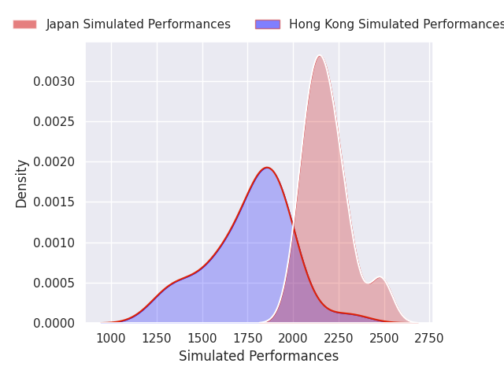
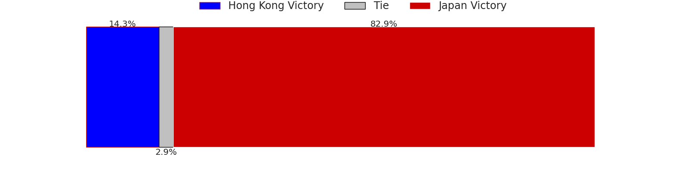
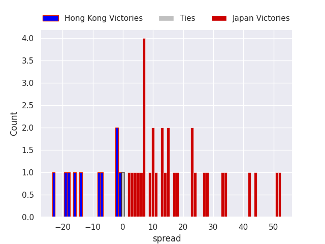

### England V Italy on 2027-10-22

Average Margin: England by 13.4

### England V Georgia on 2027-10-22

Average Margin: England by 14.4

### England V South Africa on 2027-10-22

Average Margin: South Africa by 2.3

### Wales V Italy on 2027-10-22

Average Margin: Italy by 0.9

### Wales V Georgia on 2027-10-22

Average Margin: Wales by 7.8

### Zimbabwe V Georgia on 2027-10-22

Average Margin: Georgia by 2.0

### Zimbabwe V Italy on 2027-10-22

Average Margin: Zimbabwe by 7.0

### Tonga V Italy on 2027-10-22

Average Margin: Italy by 12.0

### Fiji V Chile on 2027-10-22

Average Margin: Fiji by 17.4

### Argentina V Spain on 2027-10-22

Average Margin: Argentina by 23.8

### Argentina V United States of America on 2027-10-22

Average Margin: Argentina by 24.4

### Fiji V Uruguay on 2027-10-22

Average Margin: Fiji by 13.9

### Argentina V Ireland on 2027-10-22

Average Margin: Ireland by 18.0

### Australia V France on 2027-10-22

Average Margin: France by 1.9

### Fiji V Australia on 2027-10-22

Average Margin: Fiji by 15.2

### Argentina V South Africa on 2027-10-22

Average Margin: Argentina by 9.0

### Scotland V England on 2027-10-22

Average Margin: Scotland by 11.0

### Ireland V England on 2027-10-22

Average Margin: Ireland by 1.7

### Ireland V Tonga on 2027-10-22

Average Margin: Ireland by 36.9

### Portugal V Spain on 2027-10-22

Average Margin: Portugal by 18.0

### Scotland V Japan on 2027-10-22

Average Margin: Scotland by 10.8

### Scotland V United States of America on 2027-10-22

Average Margin: Scotland by 20.2

### Ireland V Samoa on 2027-10-22

Average Margin: Ireland by 26.3

### Scotland V Georgia on 2027-10-22

Average Margin: Scotland by 10.5

### Scotland V Argentina on 2027-10-22

Average Margin: Argentina by 0.0

### Scotland V Fiji on 2027-10-22

Average Margin: Scotland by 3.5

### Ireland V Canada on 2027-10-22

Average Margin: Ireland by 28.5

### Scotland V Samoa on 2027-10-22

Average Margin: Scotland by 22.4

### Scotland V New Zealand on 2027-10-22

Average Margin: Scotland by 0.5

### Scotland V Australia on 2027-10-22

Average Margin: Australia by 0.2

### Ireland V Argentina on 2027-10-22

Average Margin: Argentina by 5.0

### Ireland V New Zealand on 2027-10-22

Average Margin: New Zealand by 10.5

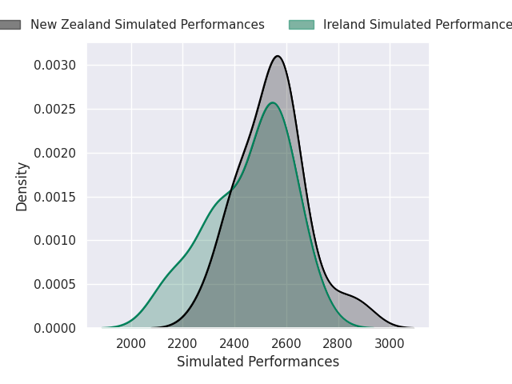

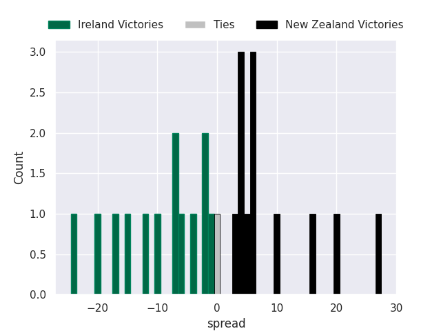

### Scotland V Italy on 2027-10-22

Average Margin: Scotland by 9.0

### Scotland V Uruguay on 2027-10-22

Average Margin: Scotland by 16.3

### Scotland V Portugal on 2027-10-22

Average Margin: Scotland by 19.1

### Ireland V United States of America on 2027-10-22

Average Margin: Ireland by 27.9

### Ireland V Uruguay on 2027-10-22

Average Margin: Ireland by 21.1

### Ireland V Italy on 2027-10-22

Average Margin: Ireland by 17.9

### Ireland V Georgia on 2027-10-22

Average Margin: Ireland by 18.6

### Ireland V Chile on 2027-10-22

Average Margin: Ireland by 22.2

### Scotland V Ireland on 2027-10-22

Average Margin: Scotland by 1.3

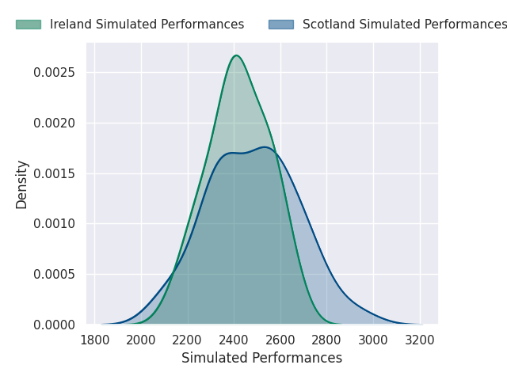

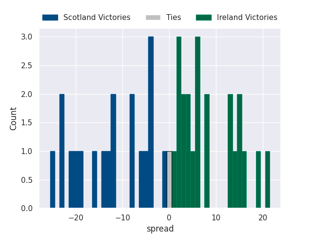

### Ireland V Portugal on 2027-10-22

Average Margin: Ireland by 17.4

### Ireland V Wales on 2027-10-22

Average Margin: Ireland by 21.0

### Ireland V Australia on 2027-10-22

Average Margin: Ireland by 11.6

### Ireland V Japan on 2027-10-22

Average Margin: Ireland by 16.7

### Ireland V Spain on 2027-10-22

Average Margin: Ireland by 24.7

### Portugal V Georgia on 2027-10-22

Average Margin: Portugal by 2.5

### Ireland V Zimbabwe on 2027-10-22

Average Margin: Ireland by 21.4

### Scotland V Wales on 2027-10-22

Average Margin: Scotland by 12.6

### Ireland V Fiji on 2027-10-22

Average Margin: Ireland by 10.2

### Scotland V Chile on 2027-10-22

Average Margin: Scotland by 20.8

### Scotland V Zimbabwe on 2027-10-22

Average Margin: Scotland by 17.5

### Scotland V Spain on 2027-10-22

Average Margin: Scotland by 22.5

### Fiji V Ireland on 2027-10-22

Average Margin: Fiji by 12.0

### Scotland V Tonga on 2027-10-22

Average Margin: Scotland by 24.0

### Chile V Japan on 2027-10-22

Average Margin: Japan by 2.2

### Japan V Portugal on 2027-10-22

Average Margin: Japan by 10.0

### Australia V Italy on 2027-10-22

Average Margin: Australia by 7.1

### New Zealand V Canada on 2027-10-22

Average Margin: New Zealand by 42.0

### Australia V Zimbabwe on 2027-10-22

Average Margin: Australia by 7.0

### New Zealand V Australia on 2027-10-22

Average Margin: New Zealand by 17.5

### New Zealand V Ireland on 2027-10-22

Average Margin: Ireland by 3.0

### Australia V Hong Kong on 2027-10-22

Average Margin: Australia by 25.0

### Australia V Portugal on 2027-10-22

Average Margin: Australia by 14.7

### Australia V Japan on 2027-10-22

Average Margin: Australia by 21.3

### Australia V Canada on 2027-10-22

Average Margin: Australia by 29.0

### Australia V Samoa on 2027-10-22

Average Margin: Australia by 28.0

### Chile V Italy on 2027-10-22

Average Margin: Italy by 21.0

### Australia V Scotland on 2027-10-22

Average Margin: Scotland by 9.0

### New Zealand V Romania on 2027-10-22

Average Margin: New Zealand by 48.0

### South Africa V Zimbabwe on 2027-10-22

Average Margin: South Africa by 28.9

### South Africa V Spain on 2027-10-22

Average Margin: South Africa by 33.6

### South Africa V United States of America on 2027-10-22

Average Margin: South Africa by 36.5

### Australia V Tonga on 2027-10-22

Average Margin: Australia by 24.3

### New Zealand V Hong Kong on 2027-10-22

Average Margin: New Zealand by 60.0

### Australia V Uruguay on 2027-10-22

Average Margin: Australia by 14.2

### Australia V Georgia on 2027-10-22

Average Margin: Australia by 7.6

### New Zealand V Uruguay on 2027-10-22

Average Margin: New Zealand by 25.1

### Australia V Chile on 2027-10-22

Average Margin: Australia by 16.6

### New Zealand V Chile on 2027-10-22

Average Margin: New Zealand by 26.0

### New Zealand V Spain on 2027-10-22

Average Margin: New Zealand by 30.8

### New Zealand V Zimbabwe on 2027-10-22

Average Margin: New Zealand by 22.4

### New Zealand V United States of America on 2027-10-22

Average Margin: New Zealand by 33.8

### Australia V Spain on 2027-10-22

Average Margin: Australia by 20.1

### New Zealand V Tonga on 2027-10-22

Average Margin: New Zealand by 42.4

### Australia V Wales on 2027-10-22

Average Margin: Australia by 13.0

### New Zealand V Samoa on 2027-10-22

Average Margin: New Zealand by 35.2

### New Zealand V Portugal on 2027-10-22

Average Margin: New Zealand by 23.4

### New Zealand V Wales on 2027-10-22

Average Margin: New Zealand by 23.5

### New Zealand V Italy on 2027-10-22

Average Margin: New Zealand by 25.9

### New Zealand V Japan on 2027-10-22

Average Margin: New Zealand by 23.1

### New Zealand V Scotland on 2027-10-22

Average Margin: New Zealand by 12.7

### Australia V United States of America on 2027-10-22

Average Margin: Australia by 21.8

### New Zealand V Fiji on 2027-10-22

Average Margin: New Zealand by 15.0

### South Africa V Georgia on 2027-10-22

Average Margin: South Africa by 27.0

### United States of America V Uruguay on 2027-10-22

Average Margin: United States of America by 9.0

### South Africa V Scotland on 2027-10-22

Average Margin: South Africa by 18.6

### South Africa V Ireland on 2027-10-22

Average Margin: South Africa by 18.5

### Fiji V Zimbabwe on 2027-10-22

Average Margin: Fiji by 15.8

### Argentina V England on 2027-10-22

Average Margin: Argentina by 4.1

### Spain V Zimbabwe on 2027-10-22

Average Margin: Zimbabwe by 0.0

### Fiji V England on 2027-10-22

Average Margin: Fiji by 4.6

### Fiji V Tonga on 2027-10-22

Average Margin: Fiji by 30.9

### Spain V Wales on 2027-10-22

Average Margin: Wales by 3.0

### Spain V England on 2027-10-22

Average Margin: England by 2.3

### Argentina V Zimbabwe on 2027-10-22

Average Margin: Argentina by 17.7

### Argentina V Tonga on 2027-10-22

Average Margin: Argentina by 33.3

### France V Scotland on 2027-10-22

Average Margin: France by 9.1

### France V Uruguay on 2027-10-22

Average Margin: France by 17.9

### France V Portugal on 2027-10-22

Average Margin: France by 18.1

### France V Ireland on 2027-10-22

Average Margin: France by 5.5

### Japan V Scotland on 2027-10-22

Average Margin: Scotland by 5.1

### Japan V Ireland on 2027-10-22

Average Margin: Ireland by 8.5

### United States of America V Scotland on 2027-10-22

Average Margin: Scotland by 25.0

### Canada V Zimbabwe on 2027-10-22

Average Margin: Zimbabwe by 17.0

### Fiji V Wales on 2027-10-22

Average Margin: Fiji by 16.0

### Argentina V Wales on 2027-10-22

Average Margin: Argentina by 16.1

### Italy V Zimbabwe on 2027-10-22

Average Margin: Italy by 4.5

### South Africa V Japan on 2027-10-22

Average Margin: South Africa by 28.3

### Italy V Portugal on 2027-10-22

Average Margin: Italy by 14.0

### South Africa V Portugal on 2027-10-22

Average Margin: South Africa by 29.7

### South Africa V Samoa on 2027-10-22

Average Margin: South Africa by 36.1

### South Africa V Wales on 2027-10-22

Average Margin: South Africa by 25.8

### South Africa V Canada on 2027-10-22

Average Margin: South Africa by 45.4

### Georgia V Italy on 2027-10-22

Average Margin: Italy by 0.2

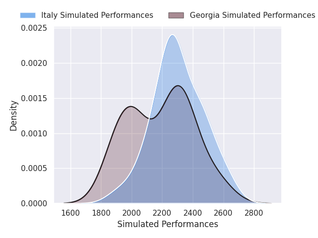

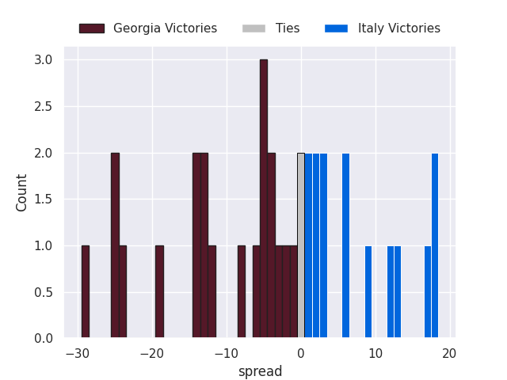

### South Africa V Chile on 2027-10-22

Average Margin: South Africa by 30.3

### South Africa V Italy on 2027-10-22

Average Margin: South Africa by 25.1

### Italy V Uruguay on 2027-10-22

Average Margin: Italy by 17.5

### South Africa V Fiji on 2027-10-22

Average Margin: South Africa by 18.8

### South Africa V Australia on 2027-10-22

Average Margin: South Africa by 20.0

### Italy V Spain on 2027-10-22

Average Margin: Italy by 12.0

### South Africa V Tonga on 2027-10-22

Average Margin: South Africa by 42.7

### South Africa V Romania on 2027-10-22

Average Margin: South Africa by 39.0

### Italy V Chile on 2027-10-22

Average Margin: Italy by 13.0

### Italy V United States of America on 2027-10-22

Average Margin: Italy by 13.0

### South Africa V Uruguay on 2027-10-22

Average Margin: South Africa by 31.2

### Portugal V Samoa on 2027-10-22

Average Margin: Portugal by 28.0

## Week 5

### New Zealand V South Africa on 2027-10-29

Average Margin: South Africa by 0.5

### Chile V Ireland on 2027-10-29

Average Margin: Ireland by 12.5

### Fiji V Georgia on 2027-10-29

Average Margin: Fiji by 24.5

### Georgia V Ireland on 2027-10-29

Average Margin: Ireland by 6.5

### Uruguay V Ireland on 2027-10-29

Average Margin: Uruguay by 2.4

### Samoa V England on 2027-10-29

Average Margin: England by 15.0

### Chile V Wales on 2027-10-29

Average Margin: Chile by 8.5

### Chile V Georgia on 2027-10-29

Average Margin: Georgia by 9.5

### France V Wales on 2027-10-29

Average Margin: France by 17.5

### Japan V Wales on 2027-10-29

Average Margin: Japan by 4.0

### Japan V Zimbabwe on 2027-10-29

Average Margin: Japan by 0.6

### United States of America V Italy on 2027-10-29

Average Margin: Italy by 3.5

### Australia V Georgia on 2027-10-29

Average Margin: Australia by 5.1

### France V Italy on 2027-10-29

Average Margin: France by 15.0

### United States of America V England on 2027-10-29

Average Margin: England by 23.2

### Chile V Italy on 2027-10-29

Average Margin: Italy by 6.0

### Australia V Zimbabwe on 2027-10-29

Average Margin: Australia by 13.2

### France V Zimbabwe on 2027-10-29

Average Margin: France by 12.0

### Australia V Wales on 2027-10-29

Average Margin: Australia by 14.8

### Japan V Italy on 2027-10-29

Average Margin: Japan by 1.4

### United States of America V Ireland on 2027-10-29

Average Margin: Ireland by 9.0

### Italy V Fiji on 2027-10-29

Average Margin: Italy by 7.0

### Chile V Scotland on 2027-10-29

Average Margin: Chile by 7.0

### Argentina V Australia on 2027-10-29

Average Margin: Argentina by 7.9

### Scotland V Japan on 2027-10-29

Average Margin: Scotland by 5.0

### Argentina V Chile on 2027-10-29

Average Margin: Argentina by 33.0

### Georgia V Scotland on 2027-10-29

Average Margin: Scotland by 5.7

### Japan V Ireland on 2027-10-29

Average Margin: Japan by 10.0

### Argentina V New Zealand on 2027-10-29

Average Margin: Argentina by 1.0

### Argentina V Italy on 2027-10-29

Average Margin: Argentina by 16.0

### Argentina V Wales on 2027-10-29

Average Margin: Argentina by 14.4

### Italy V Scotland on 2027-10-29

Average Margin: Scotland by 14.5

### Australia V Ireland on 2027-10-29

Average Margin: Ireland by 22.5

### France V England on 2027-10-29

Average Margin: France by 5.4

### Samoa V Ireland on 2027-10-29

Average Margin: Ireland by 10.0

### Scotland V Ireland on 2027-10-29

Average Margin: Ireland by 1.7

### Italy V Ireland on 2027-10-29

Average Margin: Ireland by 2.0

### Fiji V Zimbabwe on 2027-10-29

Average Margin: Fiji by 9.0

### Argentina V Georgia on 2027-10-29

Average Margin: Argentina by 18.2

### Argentina V Fiji on 2027-10-29

Average Margin: Argentina by 17.7

### Fiji V Australia on 2027-10-29

Average Margin: Fiji by 21.0

### Portugal V Ireland on 2027-10-29

Average Margin: Ireland by 4.0

### New Zealand V Ireland on 2027-10-29

Average Margin: Ireland by 1.0

### Argentina V Zimbabwe on 2027-10-29

Average Margin: Argentina by 16.8

### Fiji V England on 2027-10-29

Average Margin: England by 20.5

### Japan V Georgia on 2027-10-29

Average Margin: Georgia by 1.3

### Chile V England on 2027-10-29

Average Margin: England by 12.0

### New Zealand V England on 2027-10-29

Average Margin: New Zealand by 10.5

### Argentina V Scotland on 2027-10-29

Average Margin: Argentina by 5.5

### Fiji V France on 2027-10-29

Average Margin: Fiji by 1.8

### Argentina V France on 2027-10-29

Average Margin: Argentina by 1.5

### New Zealand V Wales on 2027-10-29

Average Margin: New Zealand by 22.0

### Australia V Italy on 2027-10-29

Average Margin: Australia by 8.0

### New Zealand V Zimbabwe on 2027-10-29

Average Margin: New Zealand by 15.0

### Chile V South Africa on 2027-10-29

Average Margin: South Africa by 32.2

### New Zealand V Georgia on 2027-10-29

Average Margin: New Zealand by 28.0

### Japan V South Africa on 2027-10-29

Average Margin: South Africa by 21.0

### Wales V France on 2027-10-29

Average Margin: France by 10.2

### Italy V South Africa on 2027-10-29

Average Margin: South Africa by 34.0

### Australia V Spain on 2027-10-29

Average Margin: Australia by 18.5

### Zimbabwe V South Africa on 2027-10-29

Average Margin: South Africa by 23.4

### Portugal V South Africa on 2027-10-29

Average Margin: South Africa by 29.0

### Scotland V South Africa on 2027-10-29

Average Margin: South Africa by 15.0

### Spain V South Africa on 2027-10-29

Average Margin: South Africa by 31.0

### Georgia V South Africa on 2027-10-29

Average Margin: South Africa by 17.3

### New Zealand V Italy on 2027-10-29

Average Margin: New Zealand by 20.8

### Wales V South Africa on 2027-10-29

Average Margin: South Africa by 24.0

### Australia V South Africa on 2027-10-29

Average Margin: South Africa by 13.0

### Ireland V South Africa on 2027-10-29

Average Margin: South Africa by 2.0

### Argentina V England on 2027-10-29

Average Margin: Argentina by 10.0

### Argentina V Portugal on 2027-10-29

Average Margin: Argentina by 10.0

### Fiji V Scotland on 2027-10-29

Average Margin: Fiji by 6.7

### Japan V England on 2027-10-29

Average Margin: England by 4.4

### Australia V England on 2027-10-29

Average Margin: England by 1.6

### Spain V Japan on 2027-10-29

Average Margin: Spain by 3.0

### Fiji V United States of America on 2027-10-29

Average Margin: Fiji by 28.0

### Argentina V Uruguay on 2027-10-29

Average Margin: Argentina by 27.5

### Spain V Scotland on 2027-10-29

Average Margin: Scotland by 11.5

### Argentina V Japan on 2027-10-29

Average Margin: Argentina by 28.5

### England V Ireland on 2027-10-29

Average Margin: England by 3.0

### Wales V Ireland on 2027-10-29

Average Margin: Ireland by 9.0

### Zimbabwe V Scotland on 2027-10-29

Average Margin: Scotland by 18.0

### Fiji V Uruguay on 2027-10-29

Average Margin: Fiji by 41.0

### Spain V Ireland on 2027-10-29

Average Margin: Spain by 4.0

### Wales V Scotland on 2027-10-29

Average Margin: Scotland by 12.5

### Fiji V Ireland on 2027-10-29

Average Margin: Ireland by 4.0

### Zimbabwe V Ireland on 2027-10-29

Average Margin: Ireland by 25.0

### Argentina V Ireland on 2027-10-29

Average Margin: Argentina by 0.6

### England V France on 2027-10-29

Average Margin: England by 1.0

### Zimbabwe V France on 2027-10-29

Average Margin: France by 6.9

### Fiji V Japan on 2027-10-29

Average Margin: Fiji by 13.1

### Spain V France on 2027-10-29

Average Margin: France by 11.0

### England V Scotland on 2027-10-29

Average Margin: England by 8.2

### Uruguay V Italy on 2027-10-29

Average Margin: Italy by 32.0

## Week 6

### New Zealand V Argentina on 2027-11-05

Average Margin: New Zealand by 11.4

### Georgia V Argentina on 2027-11-05

Average Margin: Argentina by 7.7

### Wales V Argentina on 2027-11-05

Average Margin: Argentina by 14.5

### Japan V Scotland on 2027-11-05

Average Margin: Scotland by 2.0

### England V Zimbabwe on 2027-11-05

Average Margin: England by 14.0

### Zimbabwe V Ireland on 2027-11-05

Average Margin: Zimbabwe by 7.0

### Wales V Ireland on 2027-11-05

Average Margin: Ireland by 9.7

### England V Australia on 2027-11-05

Average Margin: England by 9.7

### England V Georgia on 2027-11-05

Average Margin: England by 20.5

### New Zealand V Georgia on 2027-11-05

Average Margin: New Zealand by 31.0

### France V Argentina on 2027-11-05

Average Margin: France by 7.7

### Chile V Ireland on 2027-11-05

Average Margin: Ireland by 15.3

### France V Ireland on 2027-11-05

Average Margin: Ireland by 0.0

### England V Portugal on 2027-11-05

Average Margin: England by 6.0

### England V Chile on 2027-11-05

Average Margin: England by 19.0

### England V New Zealand on 2027-11-05

Average Margin: New Zealand by 14.0

### Japan V Georgia on 2027-11-05

Average Margin: Japan by 0.5

### Australia V Zimbabwe on 2027-11-05

Average Margin: Australia by 25.0

### Chile V Argentina on 2027-11-05

Average Margin: Argentina by 19.0

### Australia V Portugal on 2027-11-05

Average Margin: Portugal by 7.0

### New Zealand V Italy on 2027-11-05

Average Margin: New Zealand by 2.0

### Wales V Scotland on 2027-11-05

Average Margin: Scotland by 5.0

### France V Scotland on 2027-11-05

Average Margin: France by 12.0

### Australia V Georgia on 2027-11-05

Average Margin: Australia by 16.0

### Japan V Zimbabwe on 2027-11-05

Average Margin: Zimbabwe by 14.0

### New Zealand V Uruguay on 2027-11-05

Average Margin: New Zealand by 17.0

### Chile V Scotland on 2027-11-05

Average Margin: Scotland by 4.0

### Georgia V Uruguay on 2027-11-05

Average Margin: Georgia by 5.0

### United States of America V Scotland on 2027-11-05

Average Margin: Scotland by 10.0

### Zimbabwe V Georgia on 2027-11-05

Average Margin: Zimbabwe by 4.0

### Italy V Fiji on 2027-11-05

Average Margin: Fiji by 1.7

### Australia V United States of America on 2027-11-05

Average Margin: Australia by 10.0

### Chile V New Zealand on 2027-11-05

Average Margin: New Zealand by 10.7

### Georgia V Ireland on 2027-11-05

Average Margin: Ireland by 1.2

### France V Fiji on 2027-11-05

Average Margin: Fiji by 4.3

### Zimbabwe V Portugal on 2027-11-05

Average Margin: Zimbabwe by 31.0

### Italy V Ireland on 2027-11-05

Average Margin: Ireland by 0.2

### Japan V Fiji on 2027-11-05

Average Margin: Japan by 0.2

### New Zealand V Wales on 2027-11-05

Average Margin: New Zealand by 17.0

### Australia V France on 2027-11-05

Average Margin: Australia by 2.4

### New Zealand V Ireland on 2027-11-05

Average Margin: New Zealand by 13.6

### New Zealand V Spain on 2027-11-05

Average Margin: New Zealand by 35.0

### New Zealand V Zimbabwe on 2027-11-05

Average Margin: New Zealand by 17.3

### South Africa V England on 2027-11-05

Average Margin: South Africa by 14.5

### Australia V Fiji on 2027-11-05

Average Margin: Australia by 9.7

### South Africa V Ireland on 2027-11-05

Average Margin: South Africa by 14.6

### South Africa V Scotland on 2027-11-05

Average Margin: South Africa by 15.2

### New Zealand V Fiji on 2027-11-05

Average Margin: New Zealand by 16.8

### South Africa V France on 2027-11-05

Average Margin: South Africa by 13.1

### South Africa V Argentina on 2027-11-05

Average Margin: South Africa by 16.5

### South Africa V Fiji on 2027-11-05

Average Margin: South Africa by 18.9

### New Zealand V France on 2027-11-05

Average Margin: New Zealand by 9.6

### New Zealand V Scotland on 2027-11-05

Average Margin: New Zealand by 10.4

### New Zealand V England on 2027-11-05

Average Margin: New Zealand by 18.4

### South Africa V Wales on 2027-11-05

Average Margin: South Africa by 20.0

### New Zealand V Japan on 2027-11-05

Average Margin: New Zealand by 22.0

### Australia V Scotland on 2027-11-05

Average Margin: Scotland by 0.4

### England V Italy on 2027-11-05

Average Margin: England by 5.2

### Japan V England on 2027-11-05

Average Margin: England by 0.0

### England V Scotland on 2027-11-05

Average Margin: England by 3.7

### Italy V Argentina on 2027-11-05

Average Margin: Argentina by 5.5

### England V Fiji on 2027-11-05

Average Margin: England by 2.6

### Australia V Ireland on 2027-11-05

Average Margin: Ireland by 4.0

### Japan V Ireland on 2027-11-05

Average Margin: Ireland by 4.4

### England V Uruguay on 2027-11-05

Average Margin: Uruguay by 0.3

### England V Argentina on 2027-11-05

Average Margin: England by 1.6

### England V Ireland on 2027-11-05

Average Margin: England by 1.9

### South Africa V Spain on 2027-11-05

Average Margin: South Africa by 30.0

### Australia V Argentina on 2027-11-05

Average Margin: Argentina by 0.5

### South Africa V Zimbabwe on 2027-11-05

Average Margin: South Africa by 18.4

### South Africa V Japan on 2027-11-05

Average Margin: South Africa by 16.0

### Japan V Argentina on 2027-11-05

Average Margin: Argentina by 1.7

### Italy V Scotland on 2027-11-05

Average Margin: Italy by 1.0

## Week 7

### New Zealand V England on 2027-11-12

Average Margin: New Zealand by 13.1

### Fiji V United States of America on 2027-11-12

Average Margin: United States of America by 10.0

### France V Zimbabwe on 2027-11-12

Average Margin: France by 14.0

### France V Chile on 2027-11-12

Average Margin: France by 23.0

### Zimbabwe V Japan on 2027-11-12

Average Margin: Zimbabwe by 18.5

### Scotland V Georgia on 2027-11-12

Average Margin: Scotland by 30.0

### Wales V Australia on 2027-11-12

Average Margin: Australia by 3.0

### England V Georgia on 2027-11-12

Average Margin: England by 4.0

### Scotland V Zimbabwe on 2027-11-12

Average Margin: Scotland by 7.0

### South Africa V New Zealand on 2027-11-12

Average Margin: South Africa by 7.0

### Wales V Italy on 2027-11-12

Average Margin: Italy by 11.0

### Zimbabwe V Georgia on 2027-11-12

Average Margin: Zimbabwe by 1.0

### Fiji V Chile on 2027-11-12

Average Margin: Fiji by 6.0

### England V Japan on 2027-11-12

Average Margin: England by 15.0

### Argentina V Georgia on 2027-11-12

Average Margin: Argentina by 12.0

### South Africa V Scotland on 2027-11-12

Average Margin: South Africa by 23.3

### Wales V England on 2027-11-12

Average Margin: Wales by 3.7

### South Africa V Zimbabwe on 2027-11-12

Average Margin: South Africa by 11.0

### Zimbabwe V Argentina on 2027-11-12

Average Margin: Argentina by 0.5

### Scotland V Wales on 2027-11-12

Average Margin: Wales by 4.0

### Fiji V Georgia on 2027-11-12

Average Margin: Georgia by 0.8

### Scotland V Japan on 2027-11-12

Average Margin: Scotland by 4.8

### Argentina V Chile on 2027-11-12

Average Margin: Argentina by 19.0

### Scotland V Australia on 2027-11-12

Average Margin: Scotland by 9.2

### Ireland V United States of America on 2027-11-12

Average Margin: Ireland by 8.0

### Ireland V Japan on 2027-11-12

Average Margin: Ireland by 22.0

### Australia V England on 2027-11-12

Average Margin: Australia by 10.0

### Scotland V Italy on 2027-11-12

Average Margin: Scotland by 17.0

### France V South Africa on 2027-11-12

Average Margin: South Africa by 2.4

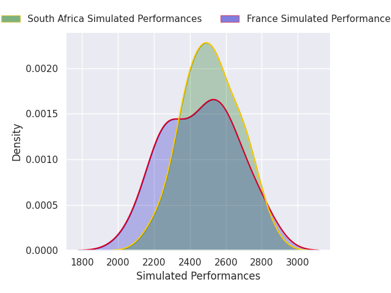

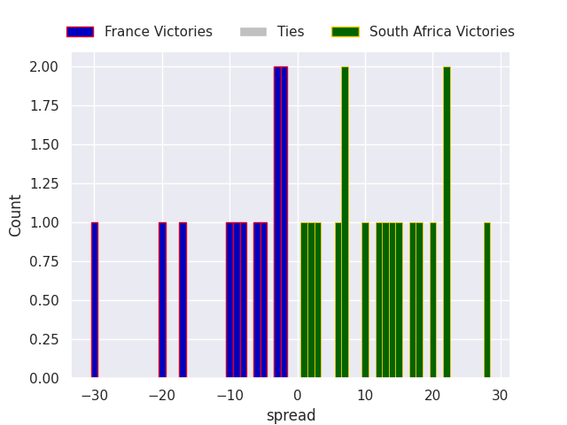

### New Zealand V France on 2027-11-12

Average Margin: New Zealand by 13.2

### New Zealand V Uruguay on 2027-11-12

Average Margin: New Zealand by 24.0

### Zimbabwe V England on 2027-11-12

Average Margin: Zimbabwe by 14.0

### New Zealand V Fiji on 2027-11-12

Average Margin: New Zealand by 12.2

### South Africa V Uruguay on 2027-11-12

Average Margin: South Africa by 10.0

### South Africa V Argentina on 2027-11-12

Average Margin: South Africa by 13.8

### New Zealand V Argentina on 2027-11-12

Average Margin: New Zealand by 10.6

### France V Portugal on 2027-11-12

Average Margin: France by 15.0

### South Africa V Italy on 2027-11-12

Average Margin: South Africa by 28.0

### Spain V Scotland on 2027-11-12

Average Margin: Scotland by 15.0

### Argentina V Uruguay on 2027-11-12

Average Margin: Uruguay by 1.0

### South Africa V Japan on 2027-11-12

Average Margin: South Africa by 11.0

### Zimbabwe V Ireland on 2027-11-12

Average Margin: Zimbabwe by 7.3

### South Africa V France on 2027-11-12

Average Margin: South Africa by 46.0

### France V Uruguay on 2027-11-12

Average Margin: France by 16.0

### Ireland V Chile on 2027-11-12

Average Margin: Ireland by 14.0

### South Africa V Wales on 2027-11-12

Average Margin: South Africa by 22.0

### England V Italy on 2027-11-12

Average Margin: England by 15.0

### Scotland V Uruguay on 2027-11-12

Average Margin: Scotland by 25.0

### Australia V Ireland on 2027-11-12

Average Margin: Australia by 16.0

### Spain V Argentina on 2027-11-12

Average Margin: Argentina by 2.0

### New Zealand V Zimbabwe on 2027-11-12

Average Margin: New Zealand by 11.0

### France V Argentina on 2027-11-12

Average Margin: France by 7.1

### Scotland V England on 2027-11-12

Average Margin: Scotland by 8.8

### Fiji V England on 2027-11-12

Average Margin: Fiji by 3.9

### France V Italy on 2027-11-12

Average Margin: France by 17.6

### Fiji V Japan on 2027-11-12

Average Margin: Fiji by 11.2

### New Zealand V Ireland on 2027-11-12

Average Margin: New Zealand by 9.1

### Scotland V Ireland on 2027-11-12

Average Margin: Scotland by 5.0

### Fiji V Scotland on 2027-11-12

Average Margin: Fiji by 5.5

### Fiji V Australia on 2027-11-12

Average Margin: Fiji by 9.6

### Scotland V Argentina on 2027-11-12

Average Margin: Scotland by 5.9

### Fiji V Italy on 2027-11-12

Average Margin: Fiji by 6.0

### South Africa V Ireland on 2027-11-12

Average Margin: South Africa by 8.8

### Argentina V New Zealand on 2027-11-12

Average Margin: New Zealand by 2.5

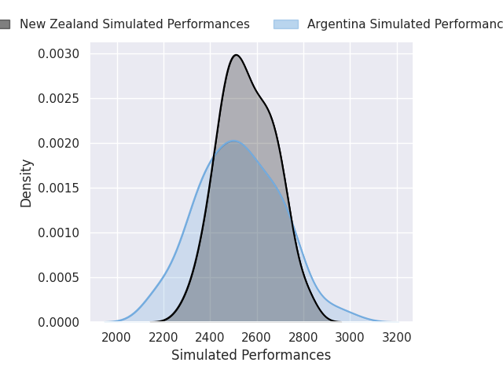

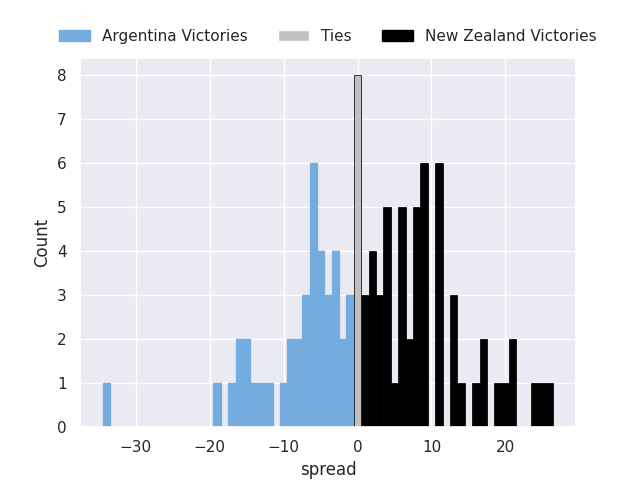

### France V Ireland on 2027-11-12

Average Margin: France by 5.2

### Fiji V Argentina on 2027-11-12

Average Margin: Fiji by 3.5

### South Africa V England on 2027-11-12

Average Margin: South Africa by 13.7

### France V Australia on 2027-11-12

Average Margin: France by 11.8

### France V Japan on 2027-11-12

Average Margin: France by 15.6

### Argentina V England on 2027-11-12

Average Margin: Argentina by 5.0

### Fiji V New Zealand on 2027-11-12

Average Margin: Fiji by 1.7

### France V England on 2027-11-12

Average Margin: France by 8.2

### Argentina V South Africa on 2027-11-12

Average Margin: South Africa by 6.0

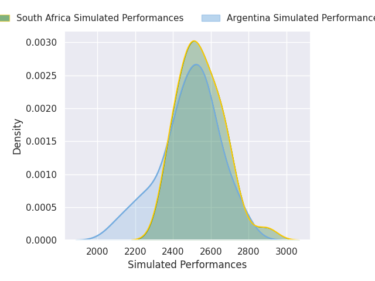
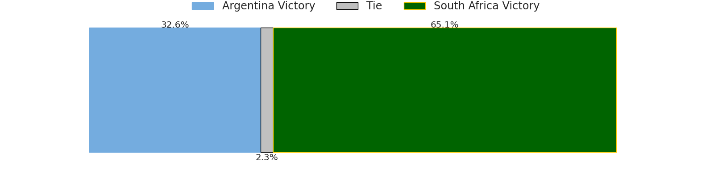
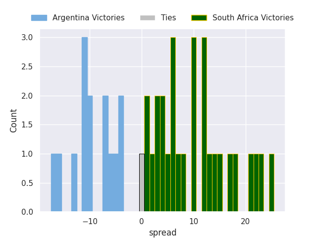

### New Zealand V Japan on 2027-11-12

Average Margin: New Zealand by 27.5

### Fiji V Ireland on 2027-11-12

Average Margin: Fiji by 2.0

### Argentina V Ireland on 2027-11-12

Average Margin: Argentina by 0.1

### France V Wales on 2027-11-12

Average Margin: France by 14.8

### France V Georgia on 2027-11-12

Average Margin: France by 12.7

### Wales V Fiji on 2027-11-12

Average Margin: Wales by 1.2

### South Africa V Georgia on 2027-11-12

Average Margin: South Africa by 9.0

### New Zealand V Scotland on 2027-11-12

Average Margin: New Zealand by 6.6

### Ireland V Australia on 2027-11-12

Average Margin: Ireland by 8.4

### Scotland V Chile on 2027-11-12

Average Margin: Scotland by 21.0

### Argentina V Italy on 2027-11-12

Average Margin: Argentina by 9.0

### Ireland V England on 2027-11-12

Average Margin: Ireland by 8.1

### Ireland V Portugal on 2027-11-12

Average Margin: Ireland by 10.0

### France V Fiji on 2027-11-12

Average Margin: France by 8.3

### New Zealand V Australia on 2027-11-12

Average Margin: New Zealand by 18.5

### South Africa V Australia on 2027-11-12

Average Margin: South Africa by 19.4

### Spain V England on 2027-11-12

Average Margin: England by 3.0

### Argentina V Australia on 2027-11-12

Average Margin: Argentina by 7.4

### France V Scotland on 2027-11-12

Average Margin: France by 6.1

### New Zealand V Chile on 2027-11-12

Average Margin: New Zealand by 26.0

### England V Australia on 2027-11-12

Average Margin: England by 6.6

### Argentina V Japan on 2027-11-12

Average Margin: Argentina by 13.9

### New Zealand V Italy on 2027-11-12

Average Margin: New Zealand by 15.0

### France V New Zealand on 2027-11-12

Average Margin: France by 5.6

### South Africa V Fiji on 2027-11-12

Average Margin: South Africa by 2.0

### New Zealand V Portugal on 2027-11-12

Average Margin: New Zealand by 11.0

