# Team Rankings

# Standings

## Current Standings

### Pool A

| Club   | Played   | Wins   | Point Differential   | Losing Bonus Points   | Try Bonus Points   | Competition Points   |
|--------|----------|--------|----------------------|-----------------------|--------------------|----------------------|

### Pool B

| Club   | Played   | Wins   | Point Differential   | Losing Bonus Points   | Try Bonus Points   | Competition Points   |
|--------|----------|--------|----------------------|-----------------------|--------------------|----------------------|

### Pool C

| Club   | Played   | Wins   | Point Differential   | Losing Bonus Points   | Try Bonus Points   | Competition Points   |
|--------|----------|--------|----------------------|-----------------------|--------------------|----------------------|

### Pool D

| Club   | Played   | Wins   | Point Differential   | Losing Bonus Points   | Try Bonus Points   | Competition Points   |
|--------|----------|--------|----------------------|-----------------------|--------------------|----------------------|

### Pool E

| Club   | Played   | Wins   | Point Differential   | Losing Bonus Points   | Try Bonus Points   | Competition Points   |
|--------|----------|--------|----------------------|-----------------------|--------------------|----------------------|

### Pool F

| Club   | Played   | Wins   | Point Differential   | Losing Bonus Points   | Try Bonus Points   | Competition Points   |
|--------|----------|--------|----------------------|-----------------------|--------------------|----------------------|

## Projected Remaining Table

### Pool A

| Club        |   To Play |   Projected Wins |   Projected Differential |   Projected Losing Bonus Points | Projected Try Bonus Points   |   Projected Competition Points |
|:------------|----------:|-----------------:|-------------------------:|--------------------------------:|:-----------------------------|-------------------------------:|
| New Zealand |         3 |            2.749 |                   76.539 |                           0.147 |                              |                         11.237 |
| Australia   |         3 |            2.093 |                   37.242 |                           0.302 |                              |                          8.794 |
| Chile       |         3 |            0.997 |                  -22.061 |                           0.264 |                              |                          4.298 |
| Hong Kong   |         3 |            0.09  |                  -91.72  |                           0.118 |                              |                          0.502 |

### Pool B

| Club         |   To Play |   Projected Wins |   Projected Differential |   Projected Losing Bonus Points | Projected Try Bonus Points   |   Projected Competition Points |
|:-------------|----------:|-----------------:|-------------------------:|--------------------------------:|:-----------------------------|-------------------------------:|
| South Africa |         3 |            2.977 |                   95.853 |                           0.013 |                              |                         11.939 |
| Italy        |         3 |            1.722 |                    7.591 |                           0.199 |                              |                          7.183 |
| Georgia      |         3 |            1.202 |                  -12.621 |                           0.28  |                              |                          5.184 |
| Romania      |         3 |            0.042 |                  -90.823 |                           0.108 |                              |                          0.294 |

### Pool C

| Club      |   To Play |   Projected Wins |   Projected Differential |   Projected Losing Bonus Points | Projected Try Bonus Points   |   Projected Competition Points |
|:----------|----------:|-----------------:|-------------------------:|--------------------------------:|:-----------------------------|-------------------------------:|
| Argentina |         3 |            2.709 |                   62.638 |                           0.156 |                              |                         11.074 |
| Fiji      |         3 |            2.182 |                   43.412 |                           0.268 |                              |                          9.076 |
| Spain     |         3 |            0.909 |                  -29.83  |                           0.242 |                              |                          3.926 |
| Canada    |         3 |            0.138 |                  -76.22  |                           0.202 |                              |                          0.792 |

### Pool D

| Club     |   To Play |   Projected Wins |   Projected Differential |   Projected Losing Bonus Points | Projected Try Bonus Points   |   Projected Competition Points |
|:---------|----------:|-----------------:|-------------------------:|--------------------------------:|:-----------------------------|-------------------------------:|
| Ireland  |         3 |            2.657 |                   47.594 |                           0.197 |                              |                         10.907 |
| Scotland |         3 |            2.057 |                   25.138 |                           0.331 |                              |                          8.669 |
| Uruguay  |         3 |            0.732 |                  -33.863 |                           0.383 |                              |                          3.397 |
| Portugal |         3 |            0.459 |                  -38.869 |                           0.501 |                              |                          2.439 |

### Pool E

| Club                     |   To Play |   Projected Wins |   Projected Differential |   Projected Losing Bonus Points | Projected Try Bonus Points   |   Projected Competition Points |
|:-------------------------|----------:|-----------------:|-------------------------:|--------------------------------:|:-----------------------------|-------------------------------:|
| France                   |         3 |            2.926 |                   76.381 |                           0.048 |                              |                         11.778 |
| Japan                    |         3 |            1.826 |                   13.313 |                           0.246 |                              |                          7.652 |
| United States of America |         3 |            0.817 |                  -34.283 |                           0.352 |                              |                          3.726 |
| Samoa                    |         3 |            0.353 |                  -55.411 |                           0.357 |                              |                          1.847 |

### Pool F

| Club     |   To Play |   Projected Wins |   Projected Differential |   Projected Losing Bonus Points | Projected Try Bonus Points   |   Projected Competition Points |
|:---------|----------:|-----------------:|-------------------------:|--------------------------------:|:-----------------------------|-------------------------------:|
| England  |         3 |            2.807 |                   62.713 |                           0.118 |                              |                         11.402 |
| Wales    |         3 |            1.678 |                    8.989 |                           0.327 |                              |                          7.155 |
| Zimbabwe |         3 |            1.061 |                  -16.365 |                           0.466 |                              |                          4.834 |
| Tonga    |         3 |            0.364 |                  -55.337 |                           0.333 |                              |                          1.853 |

## Projected Total Table

### Pool A

| Club        |   Played |   Wins |   Point Differential |   Losing Bonus Points | Try Bonus Points   |   Competition Points |
|:------------|---------:|-------:|---------------------:|----------------------:|:-------------------|---------------------:|
| New Zealand |        3 |  2.749 |               76.539 |                 0.147 |                    |               11.237 |
| Australia   |        3 |  2.093 |               37.242 |                 0.302 |                    |                8.794 |
| Chile       |        3 |  0.997 |              -22.061 |                 0.264 |                    |                4.298 |
| Hong Kong   |        3 |  0.09  |              -91.72  |                 0.118 |                    |                0.502 |

### Pool B

| Club         |   Played |   Wins |   Point Differential |   Losing Bonus Points | Try Bonus Points   |   Competition Points |
|:-------------|---------:|-------:|---------------------:|----------------------:|:-------------------|---------------------:|
| South Africa |        3 |  2.977 |               95.853 |                 0.013 |                    |               11.939 |
| Italy        |        3 |  1.722 |                7.591 |                 0.199 |                    |                7.183 |
| Georgia      |        3 |  1.202 |              -12.621 |                 0.28  |                    |                5.184 |
| Romania      |        3 |  0.042 |              -90.823 |                 0.108 |                    |                0.294 |

### Pool C

| Club      |   Played |   Wins |   Point Differential |   Losing Bonus Points | Try Bonus Points   |   Competition Points |
|:----------|---------:|-------:|---------------------:|----------------------:|:-------------------|---------------------:|
| Argentina |        3 |  2.709 |               62.638 |                 0.156 |                    |               11.074 |
| Fiji      |        3 |  2.182 |               43.412 |                 0.268 |                    |                9.076 |
| Spain     |        3 |  0.909 |              -29.83  |                 0.242 |                    |                3.926 |
| Canada    |        3 |  0.138 |              -76.22  |                 0.202 |                    |                0.792 |

### Pool D

| Club     |   Played |   Wins |   Point Differential |   Losing Bonus Points | Try Bonus Points   |   Competition Points |
|:---------|---------:|-------:|---------------------:|----------------------:|:-------------------|---------------------:|
| Ireland  |        3 |  2.657 |               47.594 |                 0.197 |                    |               10.907 |
| Scotland |        3 |  2.057 |               25.138 |                 0.331 |                    |                8.669 |
| Uruguay  |        3 |  0.732 |              -33.863 |                 0.383 |                    |                3.397 |
| Portugal |        3 |  0.459 |              -38.869 |                 0.501 |                    |                2.439 |

### Pool E

| Club                     |   Played |   Wins |   Point Differential |   Losing Bonus Points | Try Bonus Points   |   Competition Points |
|:-------------------------|---------:|-------:|---------------------:|----------------------:|:-------------------|---------------------:|
| France                   |        3 |  2.926 |               76.381 |                 0.048 |                    |               11.778 |
| Japan                    |        3 |  1.826 |               13.313 |                 0.246 |                    |                7.652 |
| United States of America |        3 |  0.817 |              -34.283 |                 0.352 |                    |                3.726 |
| Samoa                    |        3 |  0.353 |              -55.411 |                 0.357 |                    |                1.847 |

### Pool F

| Club     |   Played |   Wins |   Point Differential |   Losing Bonus Points | Try Bonus Points   |   Competition Points |
|:---------|---------:|-------:|---------------------:|----------------------:|:-------------------|---------------------:|
| England  |        3 |  2.807 |               62.713 |                 0.118 |                    |               11.402 |
| Wales    |        3 |  1.678 |                8.989 |                 0.327 |                    |                7.155 |
| Zimbabwe |        3 |  1.061 |              -16.365 |                 0.466 |                    |                4.834 |
| Tonga    |        3 |  0.364 |              -55.337 |                 0.333 |                    |                1.853 |

## Projected Playoff Results

|                          | Reach Round of 16   | Win Round of 16   | Reach Quarterfinal   | Win Quarterfinal   | Reach Semifinal   | Win Semifinal   | Reach Final   | Win Final   |
|:-------------------------|:--------------------|:------------------|:---------------------|:-------------------|:------------------|:----------------|:--------------|:------------|
| South Africa             | 100.0 %             | 99.4 %            | 99.4 %               | 59.7 %             | 59.7 %            | 55.1 %          | 55.1 %        | 49.1 %      |
| New Zealand              | 100.0 %             | 97.7 %            | 97.7 %               | 52.3 %             | 52.3 %            | 41.1 %          | 41.1 %        | 30.2 %      |
| France                   | 100.0 %             | 77.3 %            | 77.3 %               | 44.6 %             | 44.6 %            | 9.0 %           | 9.0 %         | 5.2 %       |
| Argentina                | 100.0 %             | 91.3 %            | 91.3 %               | 56.3 %             | 56.3 %            | 22.6 %          | 22.6 %        | 3.7 %       |
| Ireland                  | 99.9 %              | 80.5 %            | 80.5 %               | 37.5 %             | 37.5 %            | 17.8 %          | 17.8 %        | 3.6 %       |
| England                  | 100.0 %             | 83.7 %            | 83.7 %               | 43.1 %             | 43.1 %            | 24.6 %          | 24.6 %        | 3.5 %       |
| Scotland                 | 99.3 %              | 36.5 %            | 36.5 %               | 14.8 %             | 14.8 %            | 3.9 %           | 3.9 %         | 1.5 %       |
| Australia                | 99.8 %              | 75.2 %            | 75.2 %               | 30.2 %             | 30.2 %            | 13.0 %          | 13.0 %        | 1.4 %       |
| Fiji                     | 100.0 %             | 83.3 %            | 83.3 %               | 42.4 %             | 42.4 %            | 7.3 %           | 7.3 %         | 1.3 %       |
| Japan                    | 97.3 %              | 21.0 %            | 21.0 %               | 8.7 %              | 8.7 %             | 3.1 %           | 3.1 %         | 0.3 %       |
| Italy                    | 97.5 %              | 14.3 %            | 14.3 %               | 4.2 %              | 4.2 %             | 1.4 %           | 1.4 %         | 0.1 %       |
| Zimbabwe                 | 67.7 %              | 8.5 %             | 8.5 %                | 1.7 %              | 1.7 %             | 0.5 %           | 0.5 %         | 0.1 %       |
| Wales                    | 96.0 %              | 13.2 %            | 13.2 %               | 2.6 %              | 2.6 %             | 0.3 %           | 0.3 %         | 0.0 %       |
| Chile                    | 66.2 %              | 4.9 %             | 4.9 %                | 0.6 %              | 0.6 %             | 0.1 %           | 0.1 %         | 0.0 %       |
| Georgia                  | 84.4 %              | 5.7 %             | 5.7 %                | 0.5 %              | 0.5 %             | 0.1 %           | 0.1 %         | 0.0 %       |
| Portugal                 | 26.2 %              | 1.2 %             | 1.2 %                | 0.2 %              | 0.2 %             | 0.1 %           | 0.1 %         | 0.0 %       |
| Spain                    | 48.4 %              | 2.7 %             | 2.7 %                | 0.4 %              | 0.4 %             | 0.0 %           | 0.0 %         | 0.0 %       |
| Uruguay                  | 40.1 %              | 2.3 %             | 2.3 %                | 0.1 %              | 0.1 %             | 0.0 %           | 0.0 %         | 0.0 %       |
| United States of America | 44.6 %              | 1.1 %             | 1.1 %                | 0.1 %              | 0.1 %             | 0.0 %           | 0.0 %         | 0.0 %       |
| Tonga                    | 14.8 %              | 0.1 %             | 0.1 %                | 0.0 %              | 0.0 %             | 0.0 %           | 0.0 %         | 0.0 %       |
| Samoa                    | 14.4 %              | 0.1 %             | 0.1 %                | 0.0 %              | 0.0 %             | 0.0 %           | 0.0 %         | 0.0 %       |
| Canada                   | 2.5 %               | 0.0 %             | 0.0 %                | 0.0 %              | 0.0 %             | 0.0 %           | 0.0 %         | 0.0 %       |
| Hong Kong                | 0.7 %               | 0.0 %             | 0.0 %                | 0.0 %              | 0.0 %             | 0.0 %           | 0.0 %         | 0.0 %       |
| Romania                  | 0.2 %               | 0.0 %             | 0.0 %                | 0.0 %              | 0.0 %             | 0.0 %           | 0.0 %         | 0.0 %       |

# Future Predictions

## Week 1

### Australia V New Zealand on 2027/10/01

Average Margin: New Zealand by 8.1

### England V Wales on 2027/10/01

Average Margin: England by 15.4

### United States of America V Samoa on 2027/10/01

Average Margin: United States of America by 7.1

### France V Japan on 2027/10/01

Average Margin: France by 17.8

### Uruguay V Portugal on 2027/10/01

Average Margin: Uruguay by 4.3

### Ireland V Scotland on 2027/10/01

Average Margin: Ireland by 7.8

### Argentina V Fiji on 2027/10/01

Average Margin: Argentina by 7.7

### Georgia V Romania on 2027/10/01

Average Margin: Georgia by 22.0

### Spain V Canada on 2027/10/01

Average Margin: Spain by 14.5

### Tonga V Zimbabwe on 2027/10/01

Average Margin: Zimbabwe by 7.4

### South Africa V Italy on 2027/10/01

Average Margin: South Africa by 24.2

### Chile V Hong Kong on 2027/10/01

Average Margin: Chile by 18.6

## Week 2

### England V Tonga on 2027/10/08

Average Margin: England by 29.8

### Australia V Chile on 2027/10/08

Average Margin: Australia by 14.3

### Japan V Samoa on 2027/10/08

Average Margin: Japan by 17.2

### France V United States of America on 2027/10/08

Average Margin: France by 27.4

### New Zealand V Hong Kong on 2027/10/08

Average Margin: New Zealand by 42.2

### Ireland V Uruguay on 2027/10/08

Average Margin: Ireland by 20.8

### Scotland V Portugal on 2027/10/08

Average Margin: Scotland by 15.6

### Fiji V Canada on 2027/10/08

Average Margin: Fiji by 29.6

### Italy V Romania on 2027/10/08

Average Margin: Italy by 24.2

### South Africa V Georgia on 2027/10/08

Average Margin: South Africa by 27.0

### Argentina V Spain on 2027/10/08

Average Margin: Argentina by 22.8

### Wales V Zimbabwe on 2027/10/08

Average Margin: Wales by 6.3

## Week 3

### Wales V Tonga on 2027/10/15

Average Margin: Wales by 18.1

### England V Zimbabwe on 2027/10/15

Average Margin: England by 17.5

### Australia V Hong Kong on 2027/10/15

Average Margin: Australia by 31.0

### Japan V United States of America on 2027/10/15

Average Margin: Japan by 14.0

### Argentina V Canada on 2027/10/15

Average Margin: Argentina by 32.1

### New Zealand V Chile on 2027/10/15

Average Margin: New Zealand by 26.3

### Fiji V Spain on 2027/10/15

Average Margin: Fiji by 21.5

### South Africa V Romania on 2027/10/15

Average Margin: South Africa by 44.7

### Scotland V Uruguay on 2027/10/15

Average Margin: Scotland by 17.4

### Ireland V Portugal on 2027/10/15

Average Margin: Ireland by 18.9

### France V Samoa on 2027/10/15

Average Margin: France by 31.1

### Italy V Georgia on 2027/10/15

Average Margin: Italy by 7.6

## Week 4

### Australia V Chile on 2027-10-22

Average Margin: Australia by 17.0

### Fiji V United States of America on 2027-10-22

Average Margin: Fiji by 22.0

### Argentina V Chile on 2027-10-22

Average Margin: Argentina by 19.9

### Fiji V Japan on 2027-10-22

Average Margin: Fiji by 11.2

### Argentina V Samoa on 2027-10-22

Average Margin: Argentina by 24.8

### Argentina V Uruguay on 2027-10-22

Average Margin: Argentina by 19.2

### Argentina V Scotland on 2027-10-22

Average Margin: Argentina by 11.2

### Fiji V Chile on 2027-10-22

Average Margin: Fiji by 20.0

### Fiji V Spain on 2027-10-22

Average Margin: Fiji by 17.9

### Fiji V Georgia on 2027-10-22

Average Margin: Fiji by 13.1

### Argentina V Fiji on 2027-10-22

Average Margin: Argentina by 11.8

### Fiji V Italy on 2027-10-22

Average Margin: Fiji by 12.2

### Fiji V Uruguay on 2027-10-22

Average Margin: Fiji by 18.6

### Argentina V Australia on 2027-10-22

Average Margin: Argentina by 11.8

### Fiji V Australia on 2027-10-22

Average Margin: Australia by 5.0

### Argentina V Ireland on 2027-10-22

Average Margin: Argentina by 2.8

### Argentina V Canada on 2027-10-22

Average Margin: Argentina by 26.5

### Fiji V Samoa on 2027-10-22

Average Margin: Fiji by 25.0

### Argentina V Japan on 2027-10-22

Average Margin: Argentina by 19.2

### Argentina V Italy on 2027-10-22

Average Margin: Argentina by 12.3

### Argentina V Portugal on 2027-10-22

Average Margin: Argentina by 16.0

### New Zealand V France on 2027-10-22

Average Margin: New Zealand by 7.0

### Chile V France on 2027-10-22

Average Margin: France by 10.8

### England V Italy on 2027-10-22

Average Margin: England by 12.9

### Wales V Italy on 2027-10-22

Average Margin: Wales by 0.4

### England V Georgia on 2027-10-22

Average Margin: England by 16.4

### Zimbabwe V Italy on 2027-10-22

Average Margin: Italy by 0.0

### England V South Africa on 2027-10-22

Average Margin: South Africa by 0.6

### Zimbabwe V Georgia on 2027-10-22

Average Margin: Zimbabwe by 11.1

### Wales V Georgia on 2027-10-22

Average Margin: Wales by 4.1

### Tonga V Italy on 2027-10-22

Average Margin: Italy by 18.5

### Wales V South Africa on 2027-10-22

Average Margin: South Africa by 27.0

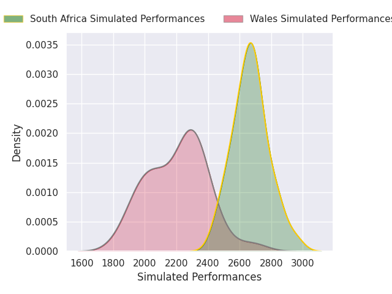
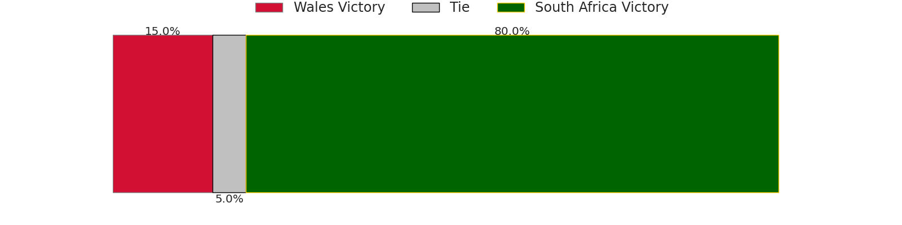
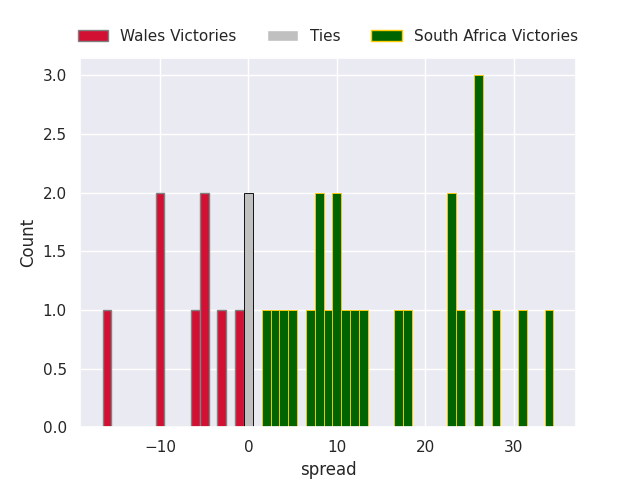

### Wales V Romania on 2027-10-22

Average Margin: Wales by 11.0

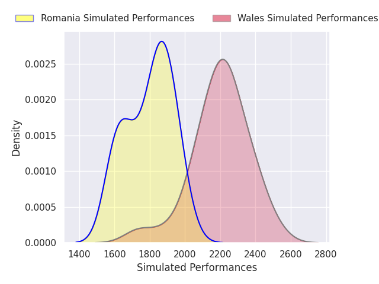
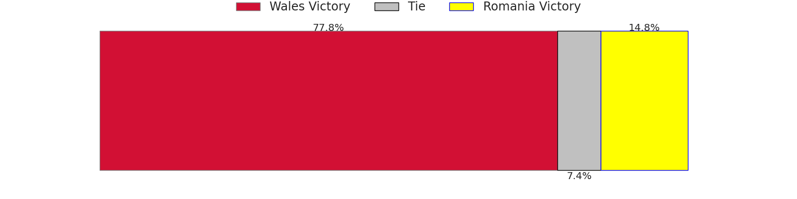
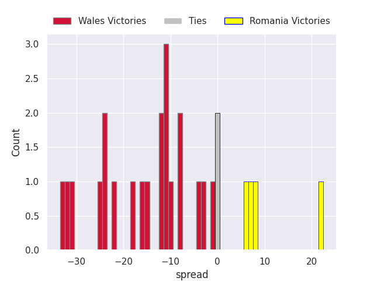

### Tonga V Georgia on 2027-10-22

Average Margin: Georgia by 27.0

### Argentina V Georgia on 2027-10-22

Average Margin: Argentina by 14.9

### Argentina V United States of America on 2027-10-22

Average Margin: Argentina by 24.6

### Fiji V Portugal on 2027-10-22

Average Margin: Fiji by 14.1

### Argentina V Spain on 2027-10-22

Average Margin: Argentina by 22.1

### Fiji V Ireland on 2027-10-22

Average Margin: Ireland by 10.5

### Chile V Samoa on 2027-10-22

Average Margin: Chile by 1.5

### Fiji V Scotland on 2027-10-22

Average Margin: Fiji by 7.6

### Ireland V Georgia on 2027-10-22

Average Margin: Ireland by 15.6

### Portugal V Georgia on 2027-10-22

Average Margin: Georgia by 8.0

### Ireland V Samoa on 2027-10-22

Average Margin: Ireland by 35.8

### Scotland V Italy on 2027-10-22

Average Margin: Scotland by 13.4

### Scotland V Japan on 2027-10-22

Average Margin: Scotland by 20.6

### Uruguay V Chile on 2027-10-22

Average Margin: Uruguay by 9.0

### Scotland V United States of America on 2027-10-22

Average Margin: Scotland by 24.4

### Scotland V Argentina on 2027-10-22

Average Margin: Scotland by 10.0

### Scotland V Wales on 2027-10-22

Average Margin: Scotland by 15.4

### Ireland V Argentina on 2027-10-22

Average Margin: Ireland by 14.0

### Scotland V France on 2027-10-22

Average Margin: Scotland by 10.0

### Ireland V Canada on 2027-10-22

Average Margin: Ireland by 34.0

### Scotland V Tonga on 2027-10-22

Average Margin: Scotland by 30.6

### Portugal V United States of America on 2027-10-22

Average Margin: Portugal by 19.0

### Scotland V Samoa on 2027-10-22

Average Margin: Scotland by 10.0

### Ireland V Hong Kong on 2027-10-22

Average Margin: Ireland by 37.0

### Scotland V New Zealand on 2027-10-22

Average Margin: New Zealand by 4.0

### Ireland V England on 2027-10-22

Average Margin: Ireland by 7.0

### Scotland V Spain on 2027-10-22

Average Margin: Scotland by 17.5

### Ireland V Japan on 2027-10-22

Average Margin: Ireland by 21.7

### Scotland V Georgia on 2027-10-22

Average Margin: Scotland by 16.2

### Ireland V Spain on 2027-10-22

Average Margin: Ireland by 25.5

### Scotland V Portugal on 2027-10-22

Average Margin: Scotland by 11.4

### Ireland V Wales on 2027-10-22

Average Margin: Ireland by 17.9

### Ireland V Chile on 2027-10-22

Average Margin: Ireland by 23.7

### Ireland V Australia on 2027-10-22

Average Margin: Ireland by 14.5

### Ireland V Zimbabwe on 2027-10-22

Average Margin: Ireland by 18.8

### Scotland V Zimbabwe on 2027-10-22

Average Margin: Scotland by 16.5

### Ireland V Uruguay on 2027-10-22

Average Margin: Ireland by 19.0

### Ireland V Fiji on 2027-10-22

Average Margin: Ireland by 12.9

### Ireland V Portugal on 2027-10-22

Average Margin: Ireland by 19.8

### Scotland V Chile on 2027-10-22

Average Margin: Scotland by 19.1

### Ireland V Scotland on 2027-10-22

Average Margin: Ireland by 10.0

### Ireland V Tonga on 2027-10-22

Average Margin: Ireland by 25.9

### Ireland V Italy on 2027-10-22

Average Margin: Ireland by 15.6

### Ireland V United States of America on 2027-10-22

Average Margin: Ireland by 26.9

### Scotland V Australia on 2027-10-22

Average Margin: Scotland by 12.6

### Scotland V Uruguay on 2027-10-22

Average Margin: Scotland by 13.2

### Argentina V Hong Kong on 2027-10-22

Average Margin: Argentina by 32.0

### Portugal V Spain on 2027-10-22

Average Margin: Portugal by 10.0

### Chile V United States of America on 2027-10-22

Average Margin: Chile by 10.0

### Chile V Japan on 2027-10-22

Average Margin: Japan by 4.9

### New Zealand V Italy on 2027-10-22

Average Margin: New Zealand by 15.2

### Australia V United States of America on 2027-10-22

Average Margin: Australia by 16.7

### New Zealand V Hong Kong on 2027-10-22

Average Margin: New Zealand by 32.5

### Australia V Fiji on 2027-10-22

Average Margin: Fiji by 0.0

### Australia V Japan on 2027-10-22

Average Margin: Australia by 4.7

### Australia V Samoa on 2027-10-22

Average Margin: Australia by 21.2

### Australia V Spain on 2027-10-22

Average Margin: Australia by 15.1

### Australia V Canada on 2027-10-22

Average Margin: Australia by 30.0

### New Zealand V Australia on 2027-10-22

Average Margin: New Zealand by 18.8

### New Zealand V Fiji on 2027-10-22

Average Margin: New Zealand by 32.0

### Chile V Zimbabwe on 2027-10-22

Average Margin: Chile by 2.0

### South Africa V Spain on 2027-10-22

Average Margin: South Africa by 34.1

### South Africa V Zimbabwe on 2027-10-22

Average Margin: South Africa by 28.7

### South Africa V Georgia on 2027-10-22

Average Margin: South Africa by 29.6

### South Africa V United States of America on 2027-10-22

Average Margin: South Africa by 36.2

### South Africa V Japan on 2027-10-22

Average Margin: South Africa by 24.3

### Australia V Italy on 2027-10-22

Average Margin: Australia by 6.8

### Australia V Zimbabwe on 2027-10-22

Average Margin: Australia by 15.4

### Australia V Uruguay on 2027-10-22

Average Margin: Australia by 12.6

### Australia V Scotland on 2027-10-22

Average Margin: Scotland by 0.0

### New Zealand V Uruguay on 2027-10-22

Average Margin: New Zealand by 23.5

### New Zealand V Portugal on 2027-10-22

Average Margin: New Zealand by 23.9

### New Zealand V Chile on 2027-10-22

Average Margin: New Zealand by 23.9

### New Zealand V Japan on 2027-10-22

Average Margin: New Zealand by 19.6

### New Zealand V Zimbabwe on 2027-10-22

Average Margin: New Zealand by 24.1

### New Zealand V Georgia on 2027-10-22

Average Margin: New Zealand by 23.3

### New Zealand V Spain on 2027-10-22

Average Margin: New Zealand by 29.6

### Australia V Portugal on 2027-10-22

Average Margin: Australia by 15.3

### New Zealand V Wales on 2027-10-22

Average Margin: New Zealand by 22.8

### New Zealand V United States of America on 2027-10-22

Average Margin: New Zealand by 31.2

### New Zealand V Tonga on 2027-10-22

Average Margin: New Zealand by 36.7

### Australia V Tonga on 2027-10-22

Average Margin: Australia by 23.6

### New Zealand V Scotland on 2027-10-22

Average Margin: New Zealand by 9.5

### Australia V Georgia on 2027-10-22

Average Margin: Australia by 15.1

### New Zealand V Samoa on 2027-10-22

Average Margin: New Zealand by 34.6

### New Zealand V Canada on 2027-10-22

Average Margin: New Zealand by 41.0

### Australia V Wales on 2027-10-22

Average Margin: Australia by 16.0

### South Africa V Italy on 2027-10-22

Average Margin: South Africa by 22.7

### Australia V France on 2027-10-22

Average Margin: France by 1.7

### South Africa V Canada on 2027-10-22

Average Margin: South Africa by 46.0

### South Africa V Chile on 2027-10-22

Average Margin: South Africa by 31.2

### Spain V Zimbabwe on 2027-10-22

Average Margin: Spain by 6.3

### Fiji V Tonga on 2027-10-22

Average Margin: Fiji by 26.0

### Argentina V England on 2027-10-22

Average Margin: Argentina by 2.2

### Spain V Tonga on 2027-10-22

Average Margin: Spain by 11.0

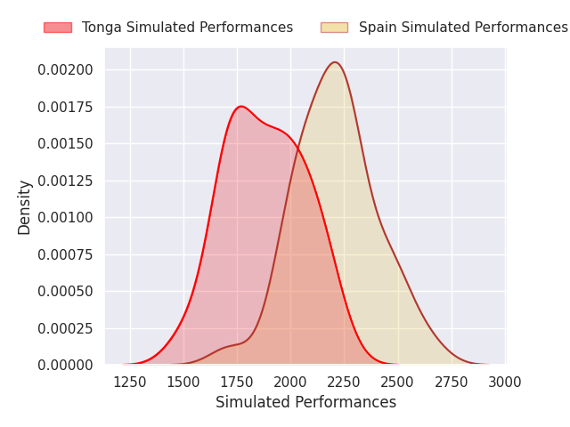
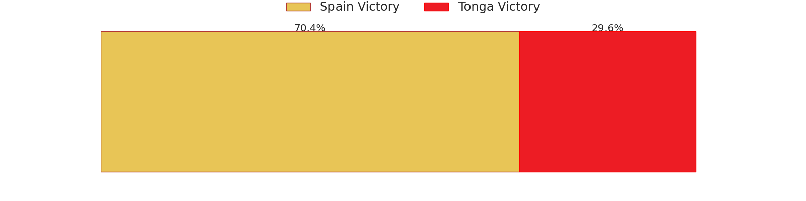
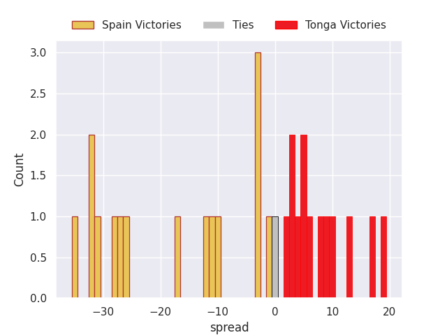

### Spain V Wales on 2027-10-22

Average Margin: Spain by 1.7

### Argentina V Tonga on 2027-10-22

Average Margin: Argentina by 21.2

### Canada V Wales on 2027-10-22

Average Margin: Wales by 36.0

### Fiji V Zimbabwe on 2027-10-22

Average Margin: Fiji by 13.9

### Spain V England on 2027-10-22

Average Margin: England by 13.0

### France V Scotland on 2027-10-22

Average Margin: France by 9.0

### France V Ireland on 2027-10-22

Average Margin: France by 6.7

### Japan V Scotland on 2027-10-22

Average Margin: Scotland by 3.0

### France V Portugal on 2027-10-22

Average Margin: France by 22.0

### Japan V Uruguay on 2027-10-22

Average Margin: Japan by 16.3

### Japan V Ireland on 2027-10-22

Average Margin: Ireland by 3.5

### Japan V Portugal on 2027-10-22

Average Margin: Japan by 14.0

### France V Uruguay on 2027-10-22

Average Margin: France by 15.8

### Fiji V England on 2027-10-22

Average Margin: Fiji by 1.7

### Argentina V Zimbabwe on 2027-10-22

Average Margin: Argentina by 16.1

### Fiji V Wales on 2027-10-22

Average Margin: Fiji by 12.8

### South Africa V Uruguay on 2027-10-22

Average Margin: South Africa by 30.2

### South Africa V Wales on 2027-10-22

Average Margin: South Africa by 23.1

### South Africa V Samoa on 2027-10-22

Average Margin: South Africa by 37.8

### Italy V Spain on 2027-10-22

Average Margin: Italy by 17.7

### South Africa V Tonga on 2027-10-22

Average Margin: South Africa by 37.3

### South Africa V Romania on 2027-10-22

Average Margin: South Africa by 29.0

### South Africa V Portugal on 2027-10-22

Average Margin: South Africa by 28.2

### South Africa V Scotland on 2027-10-22

Average Margin: South Africa by 19.7

### South Africa V Australia on 2027-10-22

Average Margin: South Africa by 24.6

### South Africa V Fiji on 2027-10-22

Average Margin: South Africa by 31.3

### Italy V Georgia on 2027-10-22

Average Margin: Italy by 6.7

### South Africa V Argentina on 2027-10-22

Average Margin: South Africa by 38.0

### South Africa V England on 2027-10-22

Average Margin: South Africa by 9.5

### Italy V Portugal on 2027-10-22

Average Margin: Italy by 23.0

### Italy V Zimbabwe on 2027-10-22

Average Margin: Zimbabwe by 4.0

### Italy V Chile on 2027-10-22

Average Margin: Italy by 21.0

### Argentina V Wales on 2027-10-22

Average Margin: Argentina by 14.8

### South Africa V Hong Kong on 2027-10-22

Average Margin: South Africa by 49.0

### Scotland V England on 2027-10-22

Average Margin: Scotland by 16.0

## Week 5

### Chile V South Africa on 2027-10-29

Average Margin: South Africa by 31.1

### Italy V Ireland on 2027-10-29

Average Margin: Ireland by 7.1

### Argentina V Georgia on 2027-10-29

Average Margin: Argentina by 16.1

### Argentina V Chile on 2027-10-29

Average Margin: Argentina by 19.8

### Georgia V Ireland on 2027-10-29

Average Margin: Ireland by 14.0

### Argentina V Australia on 2027-10-29

Average Margin: Argentina by 7.5

### France V Wales on 2027-10-29

Average Margin: Wales by 11.0

### New Zealand V Wales on 2027-10-29

Average Margin: New Zealand by 29.5

### Chile V Georgia on 2027-10-29

Average Margin: Chile by 23.0

### Japan V Zimbabwe on 2027-10-29

Average Margin: Zimbabwe by 1.2

### Fiji V Georgia on 2027-10-29

Average Margin: Fiji by 10.5

### Samoa V England on 2027-10-29

Average Margin: England by 28.0

### France V Italy on 2027-10-29

Average Margin: France by 16.3

### Japan V Wales on 2027-10-29

Average Margin: Japan by 3.4

### Japan V Georgia on 2027-10-29

Average Margin: Japan by 7.4

### United States of America V Italy on 2027-10-29

Average Margin: Italy by 8.0

### Australia V Georgia on 2027-10-29

Average Margin: Australia by 10.1

### Japan V Italy on 2027-10-29

Average Margin: Japan by 2.7

### France V England on 2027-10-29

Average Margin: France by 5.7

### Australia V Zimbabwe on 2027-10-29

Average Margin: Australia by 12.9

### Australia V Italy on 2027-10-29

Average Margin: Australia by 4.5

### Chile V Italy on 2027-10-29

Average Margin: Italy by 8.7

### United States of America V England on 2027-10-29

Average Margin: England by 15.9

### Argentina V Wales on 2027-10-29

Average Margin: Argentina by 17.1

### Argentina V Zimbabwe on 2027-10-29

Average Margin: Argentina by 19.2

### Argentina V New Zealand on 2027-10-29

Average Margin: New Zealand by 0.0

### Japan V Ireland on 2027-10-29

Average Margin: Ireland by 3.0

### Italy V Scotland on 2027-10-29

Average Margin: Scotland by 20.0

### Fiji V Wales on 2027-10-29

Average Margin: Fiji by 17.0

### Uruguay V Scotland on 2027-10-29

Average Margin: Scotland by 16.0

### Georgia V Scotland on 2027-10-29

Average Margin: Scotland by 5.3

### Fiji V Italy on 2027-10-29

Average Margin: Fiji by 21.0

### Fiji V Portugal on 2027-10-29

Average Margin: Fiji by 23.5

### Portugal V Ireland on 2027-10-29

Average Margin: Ireland by 11.3

### Chile V Ireland on 2027-10-29

Average Margin: Ireland by 22.6

### Argentina V Italy on 2027-10-29

Average Margin: Argentina by 8.5

### Uruguay V Ireland on 2027-10-29

Average Margin: Ireland by 3.7

### Chile V Scotland on 2027-10-29

Average Margin: Scotland by 48.0

### Argentina V Portugal on 2027-10-29

Average Margin: Argentina by 14.0

### Fiji V Chile on 2027-10-29

Average Margin: Fiji by 37.0

### Ireland V Scotland on 2027-10-29

Average Margin: Ireland by 5.2

### Portugal V Scotland on 2027-10-29

Average Margin: Scotland by 9.0

### Uruguay V Zimbabwe on 2027-10-29

Average Margin: Zimbabwe by 17.0

### Australia V Ireland on 2027-10-29

Average Margin: Ireland by 3.0

### Fiji V Zimbabwe on 2027-10-29

Average Margin: Fiji by 4.3

### Spain V Ireland on 2027-10-29

Average Margin: Ireland by 26.0

### Argentina V England on 2027-10-29

Average Margin: Argentina by 27.0

### Chile V England on 2027-10-29

Average Margin: England by 15.5

### Japan V England on 2027-10-29

Average Margin: England by 3.0

### Argentina V Scotland on 2027-10-29

Average Margin: Argentina by 4.7

### Fiji V France on 2027-10-29

Average Margin: France by 1.1

### Argentina V France on 2027-10-29

Average Margin: Argentina by 0.8

### Portugal V South Africa on 2027-10-29

Average Margin: Portugal by 1.0

### Japan V South Africa on 2027-10-29

Average Margin: South Africa by 4.0

### Wales V South Africa on 2027-10-29

Average Margin: South Africa by 24.0

### Zimbabwe V South Africa on 2027-10-29

Average Margin: South Africa by 19.5

### Georgia V South Africa on 2027-10-29

Average Margin: South Africa by 11.0

### Spain V Portugal on 2027-10-29

Average Margin: Portugal by 41.0

### England V France on 2027-10-29

Average Margin: England by 0.3

### New Zealand V Zimbabwe on 2027-10-29

Average Margin: New Zealand by 26.0

### Uruguay V South Africa on 2027-10-29

Average Margin: South Africa by 28.6

### Spain V South Africa on 2027-10-29

Average Margin: South Africa by 26.0

### Fiji V South Africa on 2027-10-29

Average Margin: South Africa by 0.0

### Italy V South Africa on 2027-10-29

Average Margin: South Africa by 18.6

### New Zealand V Japan on 2027-10-29

Average Margin: New Zealand by 30.0

### Scotland V South Africa on 2027-10-29

Average Margin: Scotland by 5.0

### New Zealand V Italy on 2027-10-29

Average Margin: New Zealand by 7.9

### Australia V South Africa on 2027-10-29

Average Margin: South Africa by 11.7

### New Zealand V South Africa on 2027-10-29

Average Margin: New Zealand by 0.1

### New Zealand V Georgia on 2027-10-29

Average Margin: New Zealand by 32.0

### Australia V Wales on 2027-10-29

Average Margin: Australia by 7.4

### Fiji V Scotland on 2027-10-29

Average Margin: Fiji by 1.6

### Zimbabwe V France on 2027-10-29

Average Margin: France by 8.1

### Australia V England on 2027-10-29

Average Margin: England by 1.4

### New Zealand V England on 2027-10-29

Average Margin: New Zealand by 9.9

### England V Ireland on 2027-10-29

Average Margin: Ireland by 1.0

### Tonga V France on 2027-10-29

Average Margin: France by 3.0

### Wales V Japan on 2027-10-29

Average Margin: Wales by 3.2

### England V Scotland on 2027-10-29

Average Margin: England by 8.0

### Argentina V Ireland on 2027-10-29

Average Margin: Ireland by 0.1

### Wales V Ireland on 2027-10-29

Average Margin: Ireland by 5.8

### Spain V France on 2027-10-29

Average Margin: France by 9.3

### Wales V France on 2027-10-29

Average Margin: France by 9.5

### Fiji V Uruguay on 2027-10-29

Average Margin: Fiji by 24.6

### Argentina V Japan on 2027-10-29

Average Margin: Argentina by 19.5

### Spain V Scotland on 2027-10-29

Average Margin: Scotland by 1.2

### England V Japan on 2027-10-29

Average Margin: England by 22.0

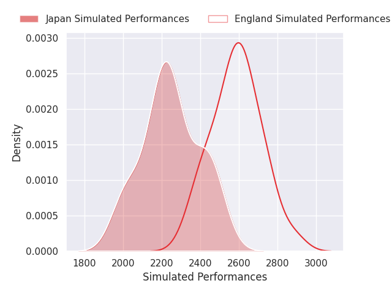
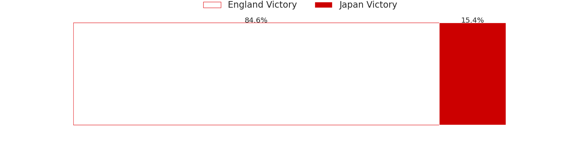
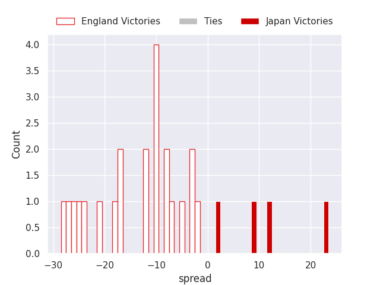

### Zimbabwe V Scotland on 2027-10-29

Average Margin: Scotland by 15.7

### Zimbabwe V Ireland on 2027-10-29

Average Margin: Zimbabwe by 25.0

### Fiji V Japan on 2027-10-29

Average Margin: Fiji by 9.5

### Wales V Scotland on 2027-10-29

Average Margin: Scotland by 6.7

### Argentina V Uruguay on 2027-10-29

Average Margin: Argentina by 28.0

### Fiji V Ireland on 2027-10-29

Average Margin: Ireland by 1.2

### Wales V Portugal on 2027-10-29

Average Margin: Wales by 3.0

### United States of America V Ireland on 2027-10-29

Average Margin: Ireland by 23.0

## Week 6

### South Africa V France on 2027-11-05

Average Margin: South Africa by 12.3

### France V Argentina on 2027-11-05

Average Margin: France by 0.9

### England V Fiji on 2027-11-05

Average Margin: England by 6.0

### Italy V Argentina on 2027-11-05

Average Margin: Argentina by 0.1

### Japan V Argentina on 2027-11-05

Average Margin: Argentina by 2.8

### England V Wales on 2027-11-05

Average Margin: England by 32.0

### Japan V Ireland on 2027-11-05

Average Margin: Ireland by 2.8

### Australia V Italy on 2027-11-05

Average Margin: Australia by 6.0

### Georgia V Argentina on 2027-11-05

Average Margin: Argentina by 15.0

### Japan V Fiji on 2027-11-05

Average Margin: Fiji by 3.3

### England V Zimbabwe on 2027-11-05

Average Margin: Zimbabwe by 3.5

### France V Fiji on 2027-11-05

Average Margin: France by 9.5

### Wales V Argentina on 2027-11-05

Average Margin: Argentina by 10.0

### France V Ireland on 2027-11-05

Average Margin: France by 7.3

### Chile V Argentina on 2027-11-05

Average Margin: Argentina by 13.5

### Zimbabwe V Ireland on 2027-11-05

Average Margin: Zimbabwe by 2.5

### Italy V Ireland on 2027-11-05

Average Margin: Ireland by 7.9

### England V Georgia on 2027-11-05

Average Margin: England by 23.0

### New Zealand V Uruguay on 2027-11-05

Average Margin: New Zealand by 6.0

### Italy V Scotland on 2027-11-05

Average Margin: Italy by 7.0

### England V Australia on 2027-11-05

Average Margin: England by 8.0

### New Zealand V Chile on 2027-11-05

Average Margin: New Zealand by 34.0

### New Zealand V Georgia on 2027-11-05

Average Margin: New Zealand by 1.0

### Georgia V Fiji on 2027-11-05

Average Margin: Fiji by 0.5

### England V Scotland on 2027-11-05

Average Margin: England by 3.8

### France V Scotland on 2027-11-05

Average Margin: France by 12.0

### United States of America V Fiji on 2027-11-05

Average Margin: Fiji by 11.0

### Australia V Japan on 2027-11-05

Average Margin: Australia by 7.0

### Zimbabwe V Scotland on 2027-11-05

Average Margin: Scotland by 34.0

### Zimbabwe V Argentina on 2027-11-05

Average Margin: Zimbabwe by 6.0

### Japan V Italy on 2027-11-05

Average Margin: Italy by 6.0

### Wales V Ireland on 2027-11-05

Average Margin: Wales by 0.2

### England V New Zealand on 2027-11-05

Average Margin: England by 12.0

### Chile V Ireland on 2027-11-05

Average Margin: Ireland by 9.5

### England V Ireland on 2027-11-05

Average Margin: England by 2.5

### Japan V Scotland on 2027-11-05

Average Margin: Scotland by 2.0

### South Africa V Zimbabwe on 2027-11-05

Average Margin: South Africa by 16.3

### New Zealand V Zimbabwe on 2027-11-05

Average Margin: New Zealand by 11.0

### Italy V Fiji on 2027-11-05

Average Margin: Fiji by 11.0

### South Africa V Wales on 2027-11-05

Average Margin: South Africa by 24.9

### New Zealand V England on 2027-11-05

Average Margin: New Zealand by 11.4

### New Zealand V Argentina on 2027-11-05

Average Margin: New Zealand by 13.0

### Scotland V Fiji on 2027-11-05

Average Margin: Scotland by 18.0

### South Africa V Ireland on 2027-11-05

Average Margin: South Africa by 12.5

### South Africa V Fiji on 2027-11-05

Average Margin: South Africa by 20.3

### South Africa V Argentina on 2027-11-05

Average Margin: South Africa by 17.5

### New Zealand V Scotland on 2027-11-05

Average Margin: New Zealand by 12.8

### South Africa V England on 2027-11-05

Average Margin: South Africa by 16.3

### South Africa V Scotland on 2027-11-05

Average Margin: South Africa by 15.0

### New Zealand V Fiji on 2027-11-05

Average Margin: New Zealand by 11.8

### New Zealand V France on 2027-11-05

Average Margin: New Zealand by 9.7

### Japan V Chile on 2027-11-05

Average Margin: Chile by 5.0

### Australia V Zimbabwe on 2027-11-05

Average Margin: Australia by 22.0

### New Zealand V Wales on 2027-11-05

Average Margin: New Zealand by 17.2

### England V Argentina on 2027-11-05

Average Margin: England by 2.0

### Portugal V Fiji on 2027-11-05

Average Margin: Portugal by 5.0

### Italy V England on 2027-11-05

Average Margin: England by 2.0

### New Zealand V Japan on 2027-11-05

Average Margin: New Zealand by 13.0

### New Zealand V Spain on 2027-11-05

Average Margin: New Zealand by 5.0

### Australia V Scotland on 2027-11-05

Average Margin: Australia by 10.5

### Australia V France on 2027-11-05

Average Margin: Australia by 2.4

### Australia V Ireland on 2027-11-05

Average Margin: Australia by 12.5

### Portugal V Wales on 2027-11-05

Average Margin: Wales by 13.0

### Australia V Fiji on 2027-11-05

Average Margin: Australia by 14.5

### Australia V Spain on 2027-11-05

Average Margin: Australia by 21.0

### South Africa V Spain on 2027-11-05

Average Margin: South Africa by 24.0

### New Zealand V Ireland on 2027-11-05

Average Margin: New Zealand by 2.7

### Australia V Argentina on 2027-11-05

Average Margin: Australia by 7.5

### South Africa V Japan on 2027-11-05

Average Margin: South Africa by 5.5

### Japan V Zimbabwe on 2027-11-05

Average Margin: Zimbabwe by 12.0

## Week 7

### France V Ireland on 2027-11-12

Average Margin: France by 7.4

### Scotland V Zimbabwe on 2027-11-12

Average Margin: Zimbabwe by 9.0

### New Zealand V Japan on 2027-11-12

Average Margin: New Zealand by 12.7

### Argentina V Italy on 2027-11-12

Average Margin: Argentina by 4.0

### Wales V Japan on 2027-11-12

Average Margin: Wales by 7.0

### France V Georgia on 2027-11-12

Average Margin: France by 22.0

### Spain V Argentina on 2027-11-12

Average Margin: Argentina by 15.0

### Ireland V Australia on 2027-11-12

Average Margin: Ireland by 17.4

### Wales V Australia on 2027-11-12

Average Margin: Australia by 7.0

### England V Italy on 2027-11-12

Average Margin: Italy by 14.0

### Portugal V Argentina on 2027-11-12

Average Margin: Argentina by 7.0

### New Zealand V Chile on 2027-11-12

Average Margin: New Zealand by 14.0

### Spain V Ireland on 2027-11-12

Average Margin: Ireland by 7.3

### South Africa V Scotland on 2027-11-12

Average Margin: South Africa by 7.6

### France V Chile on 2027-11-12

Average Margin: France by 16.0

### Wales V New Zealand on 2027-11-12

Average Margin: New Zealand by 15.0

### South Africa V Australia on 2027-11-12

Average Margin: South Africa by 16.8

### Scotland V Japan on 2027-11-12

Average Margin: Scotland by 7.3

### South Africa V Japan on 2027-11-12

Average Margin: South Africa by 27.7

### Wales V Ireland on 2027-11-12

Average Margin: Wales by 10.0

### France V United States of America on 2027-11-12

Average Margin: France by 20.0

### New Zealand V England on 2027-11-12

Average Margin: New Zealand by 7.3

### Ireland V England on 2027-11-12

Average Margin: Ireland by 10.0

### Ireland V Japan on 2027-11-12

Average Margin: Ireland by 13.0

### Australia V Argentina on 2027-11-12

Average Margin: Australia by 9.0

### South Africa V Georgia on 2027-11-12

Average Margin: South Africa by 32.0

### South Africa V Wales on 2027-11-12

Average Margin: South Africa by 36.0

### South Africa V Zimbabwe on 2027-11-12

Average Margin: South Africa by 12.0

### New Zealand V Zimbabwe on 2027-11-12

Average Margin: New Zealand by 9.0

### Scotland V Ireland on 2027-11-12

Average Margin: Scotland by 8.0

### South Africa V Italy on 2027-11-12

Average Margin: South Africa by 20.0

### France V Fiji on 2027-11-12

Average Margin: France by 6.5

### Australia V Scotland on 2027-11-12

Average Margin: Australia by 2.0

### Argentina V Fiji on 2027-11-12

Average Margin: Argentina by 8.0

### South Africa V France on 2027-11-12

Average Margin: South Africa by 17.4

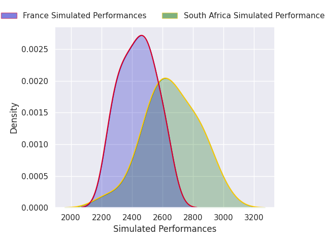

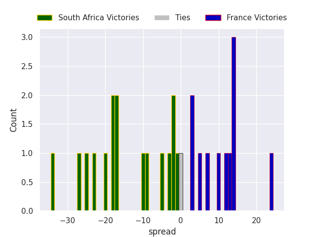

### Australia V England on 2027-11-12

Average Margin: Australia by 2.6

### New Zealand V Fiji on 2027-11-12

Average Margin: New Zealand by 14.6

### New Zealand V Georgia on 2027-11-12

Average Margin: New Zealand by 15.0

### Scotland V Wales on 2027-11-12

Average Margin: Scotland by 26.0

### Zimbabwe V Australia on 2027-11-12

Average Margin: Zimbabwe by 30.0

### South Africa V New Zealand on 2027-11-12

Average Margin: South Africa by 18.0

### Fiji V Uruguay on 2027-11-12

Average Margin: Fiji by 23.0

### England V Japan on 2027-11-12

Average Margin: England by 11.0

### Ireland V Chile on 2027-11-12

Average Margin: Ireland by 26.0

### Fiji V Scotland on 2027-11-12

Average Margin: Fiji by 5.3

### Wales V England on 2027-11-12

Average Margin: England by 9.0

### Fiji V Wales on 2027-11-12

Average Margin: Fiji by 4.3

### Wales V Argentina on 2027-11-12

Average Margin: Wales by 3.6

### Scotland V New Zealand on 2027-11-12

Average Margin: Scotland by 1.0

### Argentina V England on 2027-11-12

Average Margin: Argentina by 3.9

### Fiji V Ireland on 2027-11-12

Average Margin: Ireland by 1.6

### Argentina V Australia on 2027-11-12

Average Margin: Argentina by 9.8

### Ireland V Scotland on 2027-11-12

Average Margin: Ireland by 6.2

### Fiji V England on 2027-11-12

Average Margin: Fiji by 2.8

### Fiji V New Zealand on 2027-11-12

Average Margin: Fiji by 2.2

### France V Argentina on 2027-11-12

Average Margin: France by 6.9

### Scotland V Argentina on 2027-11-12

Average Margin: Scotland by 3.2

### New Zealand V Argentina on 2027-11-12

Average Margin: New Zealand by 7.0

### France V England on 2027-11-12

Average Margin: France by 7.9

### South Africa V England on 2027-11-12

Average Margin: South Africa by 11.4

### Scotland V Chile on 2027-11-12

Average Margin: Scotland by 3.0

### England V Australia on 2027-11-12

Average Margin: England by 6.9

### Scotland V England on 2027-11-12

Average Margin: Scotland by 6.3

### France V Japan on 2027-11-12

Average Margin: France by 15.4

### Fiji V Argentina on 2027-11-12

Average Margin: Fiji by 3.4

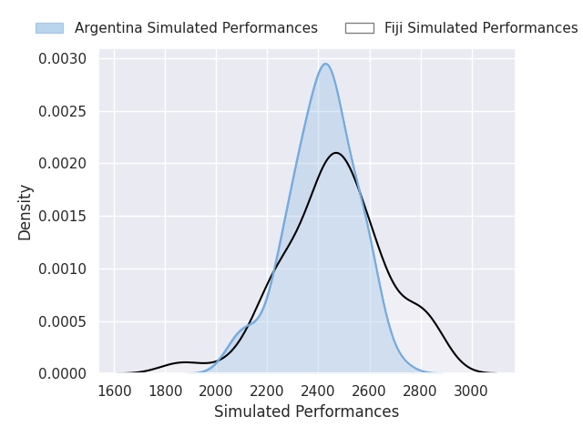

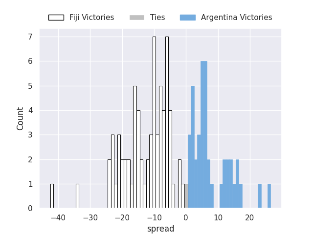

### Fiji V Australia on 2027-11-12

Average Margin: Fiji by 8.0

### Fiji V France on 2027-11-12

Average Margin: Fiji by 3.6

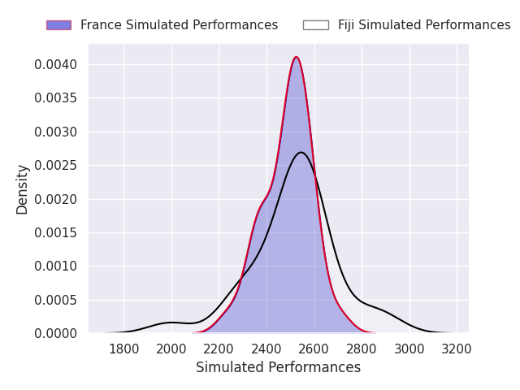

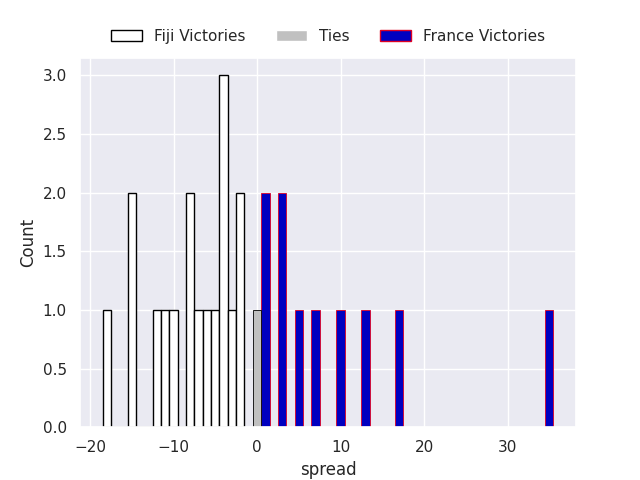

### New Zealand V Italy on 2027-11-12

Average Margin: New Zealand by 3.0

### Italy V Ireland on 2027-11-12

Average Margin: Italy by 3.0

### Zimbabwe V Argentina on 2027-11-12

Average Margin: Zimbabwe by 7.3

### France V Zimbabwe on 2027-11-12

Average Margin: France by 7.0

### Fiji V Japan on 2027-11-12

Average Margin: Fiji by 10.1

### Scotland V France on 2027-11-12

Average Margin: Scotland by 5.6

### New Zealand V Ireland on 2027-11-12

Average Margin: New Zealand by 9.8

### South Africa V Ireland on 2027-11-12

Average Margin: South Africa by 11.7

### Fiji V Italy on 2027-11-12

Average Margin: Fiji by 5.3

### New Zealand V Australia on 2027-11-12

Average Margin: New Zealand by 13.1

### Argentina V Ireland on 2027-11-12

Average Margin: Argentina by 1.8

### England V Georgia on 2027-11-12

Average Margin: England by 2.0

### France V Scotland on 2027-11-12

Average Margin: France by 17.5

### South Africa V Fiji on 2027-11-12

Average Margin: South Africa by 3.2

### Argentina V Japan on 2027-11-12

Average Margin: Argentina by 12.0

### France V Wales on 2027-11-12

Average Margin: France by 12.2

### France V New Zealand on 2027-11-12

Average Margin: France by 6.2

### France V Australia on 2027-11-12

Average Margin: France by 12.9

### Scotland V Australia on 2027-11-12

Average Margin: Scotland by 9.4

### Zimbabwe V Ireland on 2027-11-12

Average Margin: Zimbabwe by 5.5

### Zimbabwe V England on 2027-11-12

Average Margin: Zimbabwe by 2.0

### South Africa V Argentina on 2027-11-12

Average Margin: South Africa by 12.8

### Scotland V Italy on 2027-11-12

Average Margin: Scotland by 7.5

### France V Italy on 2027-11-12

Average Margin: France by 11.1

### South Africa V Chile on 2027-11-12

Average Margin: South Africa by 19.0

