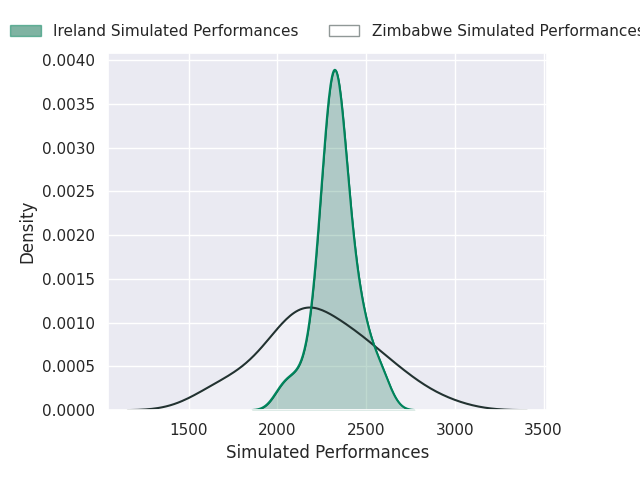
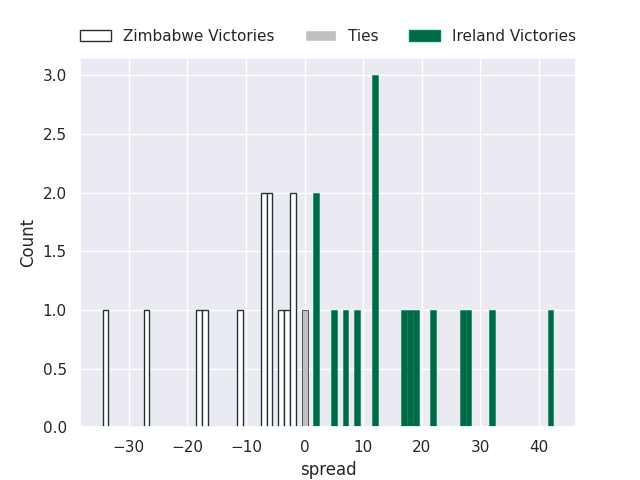

# Team Rankings

# Standings

## Current Standings

### Pool A

| Club   | Played   | Wins   | Point Differential   | Losing Bonus Points   | Try Bonus Points   | Competition Points   |
|--------|----------|--------|----------------------|-----------------------|--------------------|----------------------|

### Pool B

| Club   | Played   | Wins   | Point Differential   | Losing Bonus Points   | Try Bonus Points   | Competition Points   |
|--------|----------|--------|----------------------|-----------------------|--------------------|----------------------|

### Pool C

| Club   | Played   | Wins   | Point Differential   | Losing Bonus Points   | Try Bonus Points   | Competition Points   |
|--------|----------|--------|----------------------|-----------------------|--------------------|----------------------|

### Pool D

| Club   | Played   | Wins   | Point Differential   | Losing Bonus Points   | Try Bonus Points   | Competition Points   |
|--------|----------|--------|----------------------|-----------------------|--------------------|----------------------|

### Pool E

| Club   | Played   | Wins   | Point Differential   | Losing Bonus Points   | Try Bonus Points   | Competition Points   |
|--------|----------|--------|----------------------|-----------------------|--------------------|----------------------|

### Pool F

| Club   | Played   | Wins   | Point Differential   | Losing Bonus Points   | Try Bonus Points   | Competition Points   |
|--------|----------|--------|----------------------|-----------------------|--------------------|----------------------|

## Projected Remaining Table

### Pool A

| Club        |   To Play |   Projected Wins |   Projected Differential |   Projected Losing Bonus Points | Projected Try Bonus Points   |   Projected Competition Points |
|:------------|----------:|-----------------:|-------------------------:|--------------------------------:|:-----------------------------|-------------------------------:|
| New Zealand |         3 |            2.846 |                   88.488 |                           0.107 |                              |                         11.533 |
| Australia   |         3 |            2.099 |                   44.402 |                           0.312 |                              |                          8.77  |
| Chile       |         3 |            0.948 |                  -32.884 |                           0.153 |                              |                          3.981 |
| Hong Kong   |         3 |            0.068 |                 -100.006 |                           0.141 |                              |                          0.429 |

### Pool B

| Club         |   To Play |   Projected Wins |   Projected Differential |   Projected Losing Bonus Points | Projected Try Bonus Points   |   Projected Competition Points |
|:-------------|----------:|-----------------:|-------------------------:|--------------------------------:|:-----------------------------|-------------------------------:|
| South Africa |         3 |            2.987 |                   94.943 |                           0.012 |                              |                         11.962 |
| Georgia      |         3 |            1.468 |                   -1.094 |                           0.301 |                              |                          6.241 |
| Italy        |         3 |            1.442 |                  -10.05  |                           0.288 |                              |                          6.142 |
| Romania      |         3 |            0.056 |                  -83.799 |                           0.14  |                              |                          0.396 |

### Pool C

| Club      |   To Play |   Projected Wins |   Projected Differential |   Projected Losing Bonus Points | Projected Try Bonus Points   |   Projected Competition Points |
|:----------|----------:|-----------------:|-------------------------:|--------------------------------:|:-----------------------------|-------------------------------:|
| Argentina |         3 |            2.928 |                   63.977 |                           0.043 |                              |                         11.793 |
| Fiji      |         3 |            1.751 |                   10.718 |                           0.318 |                              |                          7.418 |
| Spain     |         3 |            1.031 |                  -18.472 |                           0.362 |                              |                          4.576 |
| Canada    |         3 |            0.217 |                  -56.223 |                           0.338 |                              |                          1.274 |

### Pool D

| Club     |   To Play |   Projected Wins |   Projected Differential |   Projected Losing Bonus Points | Projected Try Bonus Points   |   Projected Competition Points |
|:---------|----------:|-----------------:|-------------------------:|--------------------------------:|:-----------------------------|-------------------------------:|
| Ireland  |         3 |            2.601 |                   52.275 |                           0.212 |                              |                         10.714 |
| Scotland |         3 |            2.275 |                   44.476 |                           0.296 |                              |                          9.498 |
| Portugal |         3 |            0.663 |                  -37.977 |                           0.339 |                              |                          3.069 |
| Uruguay  |         3 |            0.378 |                  -58.774 |                           0.309 |                              |                          1.875 |

### Pool E

| Club                     |   To Play |   Projected Wins |   Projected Differential |   Projected Losing Bonus Points | Projected Try Bonus Points   |   Projected Competition Points |
|:-------------------------|----------:|-----------------:|-------------------------:|--------------------------------:|:-----------------------------|-------------------------------:|
| France                   |         3 |            2.98  |                   86.234 |                           0.01  |                              |                         11.942 |
| Japan                    |         3 |            1.688 |                    1.249 |                           0.221 |                              |                          7.063 |
| United States of America |         3 |            1.147 |                  -17.18  |                           0.358 |                              |                          5.05  |
| Samoa                    |         3 |            0.121 |                  -70.303 |                           0.25  |                              |                          0.784 |

### Pool F

| Club     |   To Play |   Projected Wins |   Projected Differential |   Projected Losing Bonus Points | Projected Try Bonus Points   |   Projected Competition Points |
|:---------|----------:|-----------------:|-------------------------:|--------------------------------:|:-----------------------------|-------------------------------:|
| England  |         3 |            2.944 |                   85.857 |                           0.035 |                              |                         11.831 |
| Wales    |         3 |            1.957 |                   22.02  |                           0.18  |                              |                          8.06  |
| Tonga    |         3 |            0.741 |                  -43.728 |                           0.259 |                              |                          3.285 |
| Zimbabwe |         3 |            0.31  |                  -64.149 |                           0.286 |                              |                          1.584 |

## Projected Total Table

### Pool A

| Club        |   Played |   Wins |   Point Differential |   Losing Bonus Points | Try Bonus Points   |   Competition Points |
|:------------|---------:|-------:|---------------------:|----------------------:|:-------------------|---------------------:|
| New Zealand |        3 |  2.846 |               88.488 |                 0.107 |                    |               11.533 |
| Australia   |        3 |  2.099 |               44.402 |                 0.312 |                    |                8.77  |
| Chile       |        3 |  0.948 |              -32.884 |                 0.153 |                    |                3.981 |
| Hong Kong   |        3 |  0.068 |             -100.006 |                 0.141 |                    |                0.429 |

### Pool B

| Club         |   Played |   Wins |   Point Differential |   Losing Bonus Points | Try Bonus Points   |   Competition Points |
|:-------------|---------:|-------:|---------------------:|----------------------:|:-------------------|---------------------:|
| South Africa |        3 |  2.987 |               94.943 |                 0.012 |                    |               11.962 |
| Georgia      |        3 |  1.468 |               -1.094 |                 0.301 |                    |                6.241 |
| Italy        |        3 |  1.442 |              -10.05  |                 0.288 |                    |                6.142 |
| Romania      |        3 |  0.056 |              -83.799 |                 0.14  |                    |                0.396 |

### Pool C

| Club      |   Played |   Wins |   Point Differential |   Losing Bonus Points | Try Bonus Points   |   Competition Points |
|:----------|---------:|-------:|---------------------:|----------------------:|:-------------------|---------------------:|
| Argentina |        3 |  2.928 |               63.977 |                 0.043 |                    |               11.793 |
| Fiji      |        3 |  1.751 |               10.718 |                 0.318 |                    |                7.418 |
| Spain     |        3 |  1.031 |              -18.472 |                 0.362 |                    |                4.576 |
| Canada    |        3 |  0.217 |              -56.223 |                 0.338 |                    |                1.274 |

### Pool D

| Club     |   Played |   Wins |   Point Differential |   Losing Bonus Points | Try Bonus Points   |   Competition Points |
|:---------|---------:|-------:|---------------------:|----------------------:|:-------------------|---------------------:|
| Ireland  |        3 |  2.601 |               52.275 |                 0.212 |                    |               10.714 |
| Scotland |        3 |  2.275 |               44.476 |                 0.296 |                    |                9.498 |
| Portugal |        3 |  0.663 |              -37.977 |                 0.339 |                    |                3.069 |
| Uruguay  |        3 |  0.378 |              -58.774 |                 0.309 |                    |                1.875 |

### Pool E

| Club                     |   Played |   Wins |   Point Differential |   Losing Bonus Points | Try Bonus Points   |   Competition Points |
|:-------------------------|---------:|-------:|---------------------:|----------------------:|:-------------------|---------------------:|
| France                   |        3 |  2.98  |               86.234 |                 0.01  |                    |               11.942 |
| Japan                    |        3 |  1.688 |                1.249 |                 0.221 |                    |                7.063 |
| United States of America |        3 |  1.147 |              -17.18  |                 0.358 |                    |                5.05  |
| Samoa                    |        3 |  0.121 |              -70.303 |                 0.25  |                    |                0.784 |

### Pool F

| Club     |   Played |   Wins |   Point Differential |   Losing Bonus Points | Try Bonus Points   |   Competition Points |
|:---------|---------:|-------:|---------------------:|----------------------:|:-------------------|---------------------:|
| England  |        3 |  2.944 |               85.857 |                 0.035 |                    |               11.831 |
| Wales    |        3 |  1.957 |               22.02  |                 0.18  |                    |                8.06  |
| Tonga    |        3 |  0.741 |              -43.728 |                 0.259 |                    |                3.285 |
| Zimbabwe |        3 |  0.31  |              -64.149 |                 0.286 |                    |                1.584 |

## Projected Playoff Results

|                          | Reach Round of 16   | Win Round of 16   | Reach Quarterfinal   | Win Quarterfinal   | Reach Semifinal   | Win Semifinal   | Reach Final   | Win Final   |
|:-------------------------|:--------------------|:------------------|:---------------------|:-------------------|:------------------|:----------------|:--------------|:------------|
| South Africa             | 100.0 %             | 99.4 %            | 99.4 %               | 48.3 %             | 48.3 %            | 44.4 %          | 44.4 %        | 39.3 %      |
| New Zealand              | 100.0 %             | 99.7 %            | 99.7 %               | 61.0 %             | 61.0 %            | 51.2 %          | 51.2 %        | 39.2 %      |
| England                  | 100.0 %             | 94.3 %            | 94.3 %               | 65.5 %             | 65.5 %            | 48.8 %          | 48.8 %        | 9.1 %       |
| France                   | 100.0 %             | 78.0 %            | 78.0 %               | 67.1 %             | 67.1 %            | 10.7 %          | 10.7 %        | 7.1 %       |
| Scotland                 | 99.9 %              | 49.9 %            | 49.9 %               | 34.3 %             | 34.3 %            | 11.0 %          | 11.0 %        | 2.7 %       |
| Ireland                  | 100.0 %             | 69.7 %            | 69.7 %               | 41.6 %             | 41.6 %            | 13.3 %          | 13.3 %        | 1.6 %       |
| Australia                | 100.0 %             | 92.5 %            | 92.5 %               | 25.2 %             | 25.2 %            | 10.7 %          | 10.7 %        | 0.5 %       |
| Argentina                | 100.0 %             | 92.6 %            | 92.6 %               | 41.4 %             | 41.4 %            | 8.7 %           | 8.7 %         | 0.4 %       |
| Fiji                     | 97.6 %              | 35.6 %            | 35.6 %               | 3.4 %              | 3.4 %             | 0.1 %           | 0.1 %         | 0.1 %       |
| Georgia                  | 96.1 %              | 9.4 %             | 9.4 %                | 1.8 %              | 1.8 %             | 0.5 %           | 0.5 %         | 0.0 %       |
| Italy                    | 93.4 %              | 3.7 %             | 3.7 %                | 0.9 %              | 0.9 %             | 0.2 %           | 0.2 %         | 0.0 %       |
| Japan                    | 97.5 %              | 5.2 %             | 5.2 %                | 0.7 %              | 0.7 %             | 0.2 %           | 0.2 %         | 0.0 %       |
| Wales                    | 99.8 %              | 58.3 %            | 58.3 %               | 8.5 %              | 8.5 %             | 0.1 %           | 0.1 %         | 0.0 %       |
| Chile                    | 56.1 %              | 1.7 %             | 1.7 %                | 0.2 %              | 0.2 %             | 0.1 %           | 0.1 %         | 0.0 %       |
| Spain                    | 76.5 %              | 5.1 %             | 5.1 %                | 0.1 %              | 0.1 %             | 0.0 %           | 0.0 %         | 0.0 %       |
| United States of America | 81.5 %              | 2.9 %             | 2.9 %                | 0.0 %              | 0.0 %             | 0.0 %           | 0.0 %         | 0.0 %       |
| Portugal                 | 37.6 %              | 0.6 %             | 0.6 %                | 0.0 %              | 0.0 %             | 0.0 %           | 0.0 %         | 0.0 %       |
| Tonga                    | 31.2 %              | 0.6 %             | 0.6 %                | 0.0 %              | 0.0 %             | 0.0 %           | 0.0 %         | 0.0 %       |
| Canada                   | 9.2 %               | 0.5 %             | 0.5 %                | 0.0 %              | 0.0 %             | 0.0 %           | 0.0 %         | 0.0 %       |
| Zimbabwe                 | 8.3 %               | 0.3 %             | 0.3 %                | 0.0 %              | 0.0 %             | 0.0 %           | 0.0 %         | 0.0 %       |
| Uruguay                  | 10.6 %              | 0.0 %             | 0.0 %                | 0.0 %              | 0.0 %             | 0.0 %           | 0.0 %         | 0.0 %       |
| Samoa                    | 3.5 %               | 0.0 %             | 0.0 %                | 0.0 %              | 0.0 %             | 0.0 %           | 0.0 %         | 0.0 %       |
| Romania                  | 0.8 %               | 0.0 %             | 0.0 %                | 0.0 %              | 0.0 %             | 0.0 %           | 0.0 %         | 0.0 %       |
| Hong Kong                | 0.4 %               | 0.0 %             | 0.0 %                | 0.0 %              | 0.0 %             | 0.0 %           | 0.0 %         | 0.0 %       |

# Future Predictions

## Week 1

### Australia V New Zealand on 2027/10/01

Average Margin: New Zealand by 9.3

### England V Wales on 2027/10/01

Average Margin: England by 17.4

### United States of America V Samoa on 2027/10/01

Average Margin: United States of America by 15.1

### France V Japan on 2027/10/01

Average Margin: France by 23.4

### Uruguay V Portugal on 2027/10/01

Average Margin: Portugal by 3.0

### Ireland V Scotland on 2027/10/01

Average Margin: Ireland by 4.1

### Argentina V Fiji on 2027/10/01

Average Margin: Argentina by 15.8

### Georgia V Romania on 2027/10/01

Average Margin: Georgia by 22.9

### Spain V Canada on 2027/10/01

Average Margin: Spain by 12.2

### Tonga V Zimbabwe on 2027/10/01

Average Margin: Tonga by 8.0

### South Africa V Italy on 2027/10/01

Average Margin: South Africa by 28.6

### Chile V Hong Kong on 2027/10/01

Average Margin: Chile by 17.6

## Week 2

### England V Tonga on 2027/10/08

Average Margin: England by 33.0

### Australia V Chile on 2027/10/08

Average Margin: Australia by 18.8

### Japan V Samoa on 2027/10/08

Average Margin: Japan by 18.1

### France V United States of America on 2027/10/08

Average Margin: France by 25.7

### New Zealand V Hong Kong on 2027/10/08

Average Margin: New Zealand by 47.5

### Ireland V Uruguay on 2027/10/08

Average Margin: Ireland by 27.8

### Scotland V Portugal on 2027/10/08

Average Margin: Scotland by 20.5

### Fiji V Canada on 2027/10/08

Average Margin: Fiji by 16.3

### Italy V Romania on 2027/10/08

Average Margin: Italy by 18.3

### South Africa V Georgia on 2027/10/08

Average Margin: South Africa by 23.7

### Argentina V Spain on 2027/10/08

Average Margin: Argentina by 20.4

### Wales V Zimbabwe on 2027/10/08

Average Margin: Wales by 20.7

## Week 3

### Wales V Tonga on 2027/10/15

Average Margin: Wales by 18.7

### England V Zimbabwe on 2027/10/15

Average Margin: England by 35.4

### Australia V Hong Kong on 2027/10/15

Average Margin: Australia by 34.9

### Japan V United States of America on 2027/10/15

Average Margin: Japan by 6.6

### Argentina V Canada on 2027/10/15

Average Margin: Argentina by 27.8

### New Zealand V Chile on 2027/10/15

Average Margin: New Zealand by 31.7

### Fiji V Spain on 2027/10/15

Average Margin: Fiji by 10.2

### South Africa V Romania on 2027/10/15

Average Margin: South Africa by 42.6

### Scotland V Uruguay on 2027/10/15

Average Margin: Scotland by 28.0

### Ireland V Portugal on 2027/10/15

Average Margin: Ireland by 20.4

### France V Samoa on 2027/10/15

Average Margin: France by 37.1

### Italy V Georgia on 2027/10/15

Average Margin: Italy by 0.3

## Week 4

### New Zealand V Italy on 2027-10-22

Average Margin: New Zealand by 27.2

### Fiji V Spain on 2027-10-22

Average Margin: Fiji by 7.0

### Argentina V Ireland on 2027-10-22

Average Margin: Argentina by 6.0

### Spain V Italy on 2027-10-22

Average Margin: Italy by 5.0

### Spain V Portugal on 2027-10-22

Average Margin: Portugal by 4.0

### Argentina V Uruguay on 2027-10-22

Average Margin: Argentina by 15.7

### Argentina V Romania on 2027-10-22

Average Margin: Argentina by 24.0

### Fiji V Italy on 2027-10-22

Average Margin: Italy by 5.2

### Argentina V Fiji on 2027-10-22

Average Margin: Argentina by 16.3

### Argentina V Australia on 2027-10-22

Average Margin: Australia by 1.8

### Argentina V Canada on 2027-10-22

Average Margin: Argentina by 25.4

### Argentina V Tonga on 2027-10-22

Average Margin: Argentina by 24.4

### Argentina V Georgia on 2027-10-22

Average Margin: Argentina by 8.6

### Argentina V Zimbabwe on 2027-10-22

Average Margin: Argentina by 25.6

### Fiji V Georgia on 2027-10-22

Average Margin: Georgia by 1.8

### Argentina V Japan on 2027-10-22

Average Margin: Argentina by 14.2

### Argentina V Chile on 2027-10-22

Average Margin: Argentina by 22.3

### Argentina V Portugal on 2027-10-22

Average Margin: Argentina by 14.8

### Australia V Samoa on 2027-10-22

Average Margin: Australia by 25.5

### Chile V Japan on 2027-10-22

Average Margin: Chile by 5.9

### Chile V United States of America on 2027-10-22

Average Margin: United States of America by 2.8

### Australia V France on 2027-10-22

Average Margin: France by 10.8

### New Zealand V France on 2027-10-22

Average Margin: France by 2.0

### England V Georgia on 2027-10-22

Average Margin: England by 16.8

### Fiji V Chile on 2027-10-22

Average Margin: Fiji by 18.3

### Wales V Georgia on 2027-10-22

Average Margin: Wales by 5.8

### England V South Africa on 2027-10-22

Average Margin: South Africa by 0.2

### Wales V Italy on 2027-10-22

Average Margin: Wales by 8.0

### Argentina V Spain on 2027-10-22

Average Margin: Argentina by 20.9

### Argentina V United States of America on 2027-10-22

Average Margin: Argentina by 16.1

### Argentina V Italy on 2027-10-22

Average Margin: Argentina by 14.5

### Argentina V Scotland on 2027-10-22

Average Margin: Argentina by 3.3

### England V Italy on 2027-10-22

Average Margin: England by 20.8

### Spain V Georgia on 2027-10-22

Average Margin: Georgia by 9.0

### Argentina V Samoa on 2027-10-22

Average Margin: Argentina by 29.0

### Fiji V Portugal on 2027-10-22

Average Margin: Fiji by 8.5

### Scotland V Portugal on 2027-10-22

Average Margin: Scotland by 21.6

### Scotland V Canada on 2027-10-22

Average Margin: Scotland by 28.1

### Ireland V Fiji on 2027-10-22

Average Margin: Ireland by 19.0

### Scotland V United States of America on 2027-10-22

Average Margin: Scotland by 23.1

### Scotland V Chile on 2027-10-22

Average Margin: Scotland by 25.2

### Ireland V Tonga on 2027-10-22

Average Margin: Ireland by 31.0

### Scotland V Spain on 2027-10-22

Average Margin: Scotland by 25.8

### Scotland V Tonga on 2027-10-22

Average Margin: Scotland by 22.2

### Ireland V Chile on 2027-10-22

Average Margin: Ireland by 25.3

### Ireland V Australia on 2027-10-22

Average Margin: Ireland by 10.7

### Ireland V Uruguay on 2027-10-22

Average Margin: Ireland by 31.8

### Ireland V Zimbabwe on 2027-10-22

Average Margin: Ireland by 39.8

### Scotland V Wales on 2027-10-22

Average Margin: Scotland by 14.7

### Ireland V Samoa on 2027-10-22

Average Margin: Ireland by 34.0

### Ireland V Wales on 2027-10-22

Average Margin: Ireland by 16.6

### France V Uruguay on 2027-10-22

Average Margin: France by 34.0

### Ireland V Italy on 2027-10-22

Average Margin: Ireland by 18.0

### Scotland V Italy on 2027-10-22

Average Margin: Scotland by 18.0

### Spain V Chile on 2027-10-22

Average Margin: Spain by 4.0

### Fiji V Canada on 2027-10-22

Average Margin: Fiji by 27.0

### Fiji V United States of America on 2027-10-22

Average Margin: Fiji by 3.0

### Fiji V Japan on 2027-10-22

Average Margin: Japan by 6.0

### Ireland V Japan on 2027-10-22

Average Margin: Ireland by 17.5

### Ireland V Canada on 2027-10-22

Average Margin: Ireland by 31.4

### Scotland V Australia on 2027-10-22

Average Margin: Scotland by 7.5

### Ireland V Portugal on 2027-10-22

Average Margin: Ireland by 20.4

### Ireland V Scotland on 2027-10-22

Average Margin: Ireland by 7.7

### Ireland V Georgia on 2027-10-22

Average Margin: Ireland by 12.1

### Ireland V United States of America on 2027-10-22

Average Margin: Ireland by 21.8

### Scotland V Fiji on 2027-10-22

Average Margin: Scotland by 20.5

### Scotland V Japan on 2027-10-22

Average Margin: Scotland by 19.1

### Ireland V Spain on 2027-10-22

Average Margin: Ireland by 25.1

### Scotland V Georgia on 2027-10-22

Average Margin: Scotland by 17.3

### Scotland V Zimbabwe on 2027-10-22

Average Margin: Scotland by 33.0

### Japan V Scotland on 2027-10-22

Average Margin: Scotland by 21.5

### France V Portugal on 2027-10-22

Average Margin: France by 23.5

### South Africa V Italy on 2027-10-22

Average Margin: South Africa by 28.1

### South Africa V Portugal on 2027-10-22

Average Margin: South Africa by 30.7

### South Africa V Chile on 2027-10-22

Average Margin: South Africa by 34.8

### New Zealand V Wales on 2027-10-22

Average Margin: New Zealand by 9.0

### Australia V Japan on 2027-10-22

Average Margin: Japan by 6.0

### New Zealand V Scotland on 2027-10-22

Average Margin: New Zealand by 15.0

### Australia V Portugal on 2027-10-22

Average Margin: Australia by 16.6

### New Zealand V Samoa on 2027-10-22

Average Margin: New Zealand by 43.8

### Australia V Georgia on 2027-10-22

Average Margin: Australia by 12.2

### New Zealand V Hong Kong on 2027-10-22

Average Margin: New Zealand by 44.2

### Australia V Italy on 2027-10-22

Average Margin: Australia by 13.1

### Australia V Zimbabwe on 2027-10-22

Average Margin: Australia by 28.2

### New Zealand V Romania on 2027-10-22

Average Margin: New Zealand by 43.8

### Australia V Uruguay on 2027-10-22

Average Margin: Australia by 25.2

### Australia V Canada on 2027-10-22

Average Margin: Australia by 25.2

### Australia V Wales on 2027-10-22

Average Margin: Australia by 14.0

### Australia V Tonga on 2027-10-22

Average Margin: Australia by 26.7

### New Zealand V Tonga on 2027-10-22

Average Margin: New Zealand by 36.0

### New Zealand V Spain on 2027-10-22

Average Margin: New Zealand by 32.4

### New Zealand V United States of America on 2027-10-22

Average Margin: New Zealand by 28.0

### New Zealand V Canada on 2027-10-22

Average Margin: New Zealand by 36.7

### New Zealand V Chile on 2027-10-22

Average Margin: New Zealand by 32.2

### New Zealand V Uruguay on 2027-10-22

Average Margin: New Zealand by 34.1

### South Africa V Spain on 2027-10-22

Average Margin: South Africa by 35.8

### New Zealand V Japan on 2027-10-22

Average Margin: New Zealand by 26.9

### Australia V Chile on 2027-10-22

Average Margin: Australia by 17.7

### New Zealand V Portugal on 2027-10-22

Average Margin: New Zealand by 26.6

### Australia V United States of America on 2027-10-22

Average Margin: Australia by 17.0

### Australia V Spain on 2027-10-22

Average Margin: Australia by 17.9

### New Zealand V Georgia on 2027-10-22

Average Margin: New Zealand by 20.7

### New Zealand V Fiji on 2027-10-22

Average Margin: New Zealand by 28.9

### New Zealand V Zimbabwe on 2027-10-22

Average Margin: New Zealand by 38.2

### South Africa V Zimbabwe on 2027-10-22

Average Margin: South Africa by 40.0

### South Africa V Fiji on 2027-10-22

Average Margin: South Africa by 31.5

### South Africa V Japan on 2027-10-22

Average Margin: South Africa by 30.9

### Fiji V England on 2027-10-22

Average Margin: England by 13.8

### Fiji V Tonga on 2027-10-22

Average Margin: Fiji by 12.8

### Spain V Wales on 2027-10-22

Average Margin: Wales by 5.6

### Argentina V Wales on 2027-10-22

Average Margin: Argentina by 10.9

### Fiji V Zimbabwe on 2027-10-22

Average Margin: Fiji by 10.1

### Spain V Tonga on 2027-10-22

Average Margin: Spain by 6.8

### Fiji V Wales on 2027-10-22

Average Margin: Wales by 1.5

### Spain V England on 2027-10-22

Average Margin: England by 14.2

### Canada V England on 2027-10-22

Average Margin: England by 37.0

### Spain V Zimbabwe on 2027-10-22

Average Margin: Spain by 7.0

### Argentina V England on 2027-10-22

Average Margin: England by 14.0

### Canada V Tonga on 2027-10-22

Average Margin: Canada by 4.0

### France V Scotland on 2027-10-22

Average Margin: France by 7.4

### France V Ireland on 2027-10-22

Average Margin: France by 8.8

### Canada V Wales on 2027-10-22

Average Margin: Wales by 11.0

### Japan V Ireland on 2027-10-22

Average Margin: Ireland by 14.7

### South Africa V Ireland on 2027-10-22

Average Margin: South Africa by 27.0

### Georgia V Portugal on 2027-10-22

Average Margin: Georgia by 22.0

### South Africa V United States of America on 2027-10-22

Average Margin: South Africa by 34.0

### Georgia V United States of America on 2027-10-22

Average Margin: Georgia by 16.5

### South Africa V Georgia on 2027-10-22

Average Margin: South Africa by 23.4

### South Africa V Canada on 2027-10-22

Average Margin: South Africa by 43.0

### South Africa V Uruguay on 2027-10-22

Average Margin: South Africa by 39.9

### South Africa V Tonga on 2027-10-22

Average Margin: South Africa by 39.8

### Italy V Uruguay on 2027-10-22

Average Margin: Italy by 10.0

### Georgia V Italy on 2027-10-22

Average Margin: Georgia by 19.0

### Georgia V Spain on 2027-10-22

Average Margin: Georgia by 14.0

### Georgia V Tonga on 2027-10-22

Average Margin: Georgia by 17.0

### South Africa V Romania on 2027-10-22

Average Margin: South Africa by 41.3

### South Africa V Wales on 2027-10-22

Average Margin: South Africa by 30.7

### Georgia V Canada on 2027-10-22

Average Margin: Georgia by 26.0

### South Africa V Scotland on 2027-10-22

Average Margin: South Africa by 18.0

### South Africa V Samoa on 2027-10-22

Average Margin: South Africa by 47.9

### Scotland V Samoa on 2027-10-22

Average Margin: Scotland by 27.5

## Week 5

### New Zealand V South Africa on 2027-10-29

Average Margin: New Zealand by 2.3

### Italy V Ireland on 2027-10-29

Average Margin: Ireland by 12.6

### Georgia V Ireland on 2027-10-29

Average Margin: Ireland by 5.1

### Georgia V Scotland on 2027-10-29

Average Margin: Scotland by 3.1

### United States of America V Ireland on 2027-10-29

Average Margin: Ireland by 23.8

### Chile V Italy on 2027-10-29

Average Margin: Italy by 11.0

### Chile V Georgia on 2027-10-29

Average Margin: Chile by 4.0

### Japan V Georgia on 2027-10-29

Average Margin: Georgia by 5.5

### France V Georgia on 2027-10-29

Average Margin: France by 16.0

### France V England on 2027-10-29

Average Margin: France by 2.0

### Japan V Wales on 2027-10-29

Average Margin: Japan by 5.7

### Japan V Italy on 2027-10-29

Average Margin: Italy by 15.0

### Chile V England on 2027-10-29

Average Margin: England by 20.7

### United States of America V England on 2027-10-29

Average Margin: England by 16.8

### Australia V Italy on 2027-10-29

Average Margin: Australia by 11.3

### New Zealand V England on 2027-10-29

Average Margin: New Zealand by 8.4

### Portugal V Scotland on 2027-10-29

Average Margin: Scotland by 18.0

### Australia V Wales on 2027-10-29

Average Margin: Australia by 10.8

### Australia V Ireland on 2027-10-29

Average Margin: Ireland by 6.0

### Argentina V Italy on 2027-10-29

Average Margin: Argentina by 19.5

### Argentina V Chile on 2027-10-29

Average Margin: Argentina by 15.0

### Japan V Scotland on 2027-10-29

Average Margin: Scotland by 11.0

### Scotland V Ireland on 2027-10-29

Average Margin: Scotland by 9.0

### Argentina V Fiji on 2027-10-29

Average Margin: Argentina by 27.0

### Australia V Scotland on 2027-10-29

Average Margin: Scotland by 0.0

### United States of America V Scotland on 2027-10-29

Average Margin: Scotland by 21.0

### Chile V Ireland on 2027-10-29

Average Margin: Ireland by 9.0

### Argentina V Tonga on 2027-10-29

Average Margin: Argentina by 48.0

### Chile V Scotland on 2027-10-29

Average Margin: Scotland by 26.0

### Fiji V United States of America on 2027-10-29

Average Margin: Fiji by 13.0

### Argentina V Portugal on 2027-10-29

Average Margin: Argentina by 19.0

### Italy V Fiji on 2027-10-29

Average Margin: Italy by 11.5

### Portugal V Ireland on 2027-10-29

Average Margin: Ireland by 22.0

### Japan V Ireland on 2027-10-29

Average Margin: Ireland by 15.2

### Argentina V United States of America on 2027-10-29

Average Margin: Argentina by 16.2

### Argentina V Georgia on 2027-10-29

Average Margin: Argentina by 9.2

### Argentina V Japan on 2027-10-29

Average Margin: Argentina by 2.0

### Japan V England on 2027-10-29

Average Margin: England by 14.0

### Australia V Georgia on 2027-10-29

Average Margin: Australia by 6.9

### Argentina V Ireland on 2027-10-29

Average Margin: Argentina by 9.5

### Wales V Scotland on 2027-10-29

Average Margin: Scotland by 7.7

### Fiji V France on 2027-10-29

Average Margin: France by 15.5

### Wales V France on 2027-10-29

Average Margin: France by 10.7

### United States of America V South Africa on 2027-10-29

Average Margin: South Africa by 22.0

### New Zealand V Italy on 2027-10-29

Average Margin: New Zealand by 23.0

### Georgia V South Africa on 2027-10-29

Average Margin: South Africa by 14.0

### Tonga V South Africa on 2027-10-29

Average Margin: South Africa by 42.0

### Japan V South Africa on 2027-10-29

Average Margin: South Africa by 17.0

### New Zealand V Portugal on 2027-10-29

Average Margin: New Zealand by 20.0

### Chile V South Africa on 2027-10-29

Average Margin: South Africa by 29.0

### New Zealand V United States of America on 2027-10-29

Average Margin: New Zealand by 17.0

### Italy V South Africa on 2027-10-29

Average Margin: South Africa by 1.0

### Australia V South Africa on 2027-10-29

Average Margin: South Africa by 10.8

### New Zealand V Georgia on 2027-10-29

Average Margin: New Zealand by 20.2

### England V Ireland on 2027-10-29

Average Margin: England by 14.7

### New Zealand V Wales on 2027-10-29

Average Margin: New Zealand by 17.0

### England V France on 2027-10-29

Average Margin: England by 5.0

### Spain V France on 2027-10-29

Average Margin: France by 21.3

### Australia V England on 2027-10-29

Average Margin: England by 5.5

### Canada V Ireland on 2027-10-29

Average Margin: Ireland by 15.0

### Canada V Scotland on 2027-10-29

Average Margin: Scotland by 34.0

### Zimbabwe V France on 2027-10-29

Average Margin: France by 29.5

### Spain V Scotland on 2027-10-29

Average Margin: Scotland by 24.4

### England V Scotland on 2027-10-29

Average Margin: England by 6.0

### Canada V France on 2027-10-29

Average Margin: France by 19.0

### Tonga V France on 2027-10-29

Average Margin: France by 40.0

### Tonga V Scotland on 2027-10-29

Average Margin: Scotland by 26.0

### Fiji V Ireland on 2027-10-29

Average Margin: Ireland by 11.7

### Argentina V Scotland on 2027-10-29

Average Margin: Scotland by 3.8

### Spain V Ireland on 2027-10-29

Average Margin: Ireland by 19.0

### Argentina V France on 2027-10-29

Average Margin: France by 6.4

### Zimbabwe V Ireland on 2027-10-29

Average Margin: Ireland by 23.0

### Wales V Ireland on 2027-10-29

Average Margin: Ireland by 6.0

### Fiji V Scotland on 2027-10-29

Average Margin: Scotland by 13.3

### Italy V Scotland on 2027-10-29

Average Margin: Scotland by 8.0

## Week 6

### South Africa V France on 2027-11-05

Average Margin: South Africa by 12.1

### England V Scotland on 2027-11-05

Average Margin: England by 5.4

### England V Georgia on 2027-11-05

Average Margin: England by 14.5

### Australia V Argentina on 2027-11-05

Average Margin: Australia by 1.2

### Japan V Scotland on 2027-11-05

Average Margin: Scotland by 5.3

### Wales V Scotland on 2027-11-05

Average Margin: Scotland by 9.0

### England V Fiji on 2027-11-05

Average Margin: England by 19.2

### Italy V Argentina on 2027-11-05

Average Margin: Argentina by 3.5

### Italy V Scotland on 2027-11-05

Average Margin: Scotland by 0.0

### England V Italy on 2027-11-05

Average Margin: England by 9.0

### Georgia V Argentina on 2027-11-05

Average Margin: Argentina by 0.0

### France V Ireland on 2027-11-05

Average Margin: France by 16.0

### France V Scotland on 2027-11-05

Average Margin: Scotland by 14.0

### Japan V Ireland on 2027-11-05

Average Margin: Ireland by 8.8

### Wales V Ireland on 2027-11-05

Average Margin: Ireland by 1.0

### South Africa V Italy on 2027-11-05

Average Margin: South Africa by 32.0

### Georgia V Scotland on 2027-11-05

Average Margin: Scotland by 3.0

### France V Argentina on 2027-11-05

Average Margin: France by 24.0

### England V Argentina on 2027-11-05

Average Margin: England by 10.5

### England V Ireland on 2027-11-05

Average Margin: England by 6.4

### Georgia V Ireland on 2027-11-05

Average Margin: Georgia by 4.5

### Australia V England on 2027-11-05

Average Margin: England by 3.0

### New Zealand V France on 2027-11-05

Average Margin: New Zealand by 8.5

### New Zealand V Scotland on 2027-11-05

Average Margin: New Zealand by 12.5

### South Africa V Fiji on 2027-11-05

Average Margin: South Africa by 22.8

### New Zealand V Argentina on 2027-11-05

Average Margin: New Zealand by 25.2

### New Zealand V Wales on 2027-11-05

Average Margin: New Zealand by 19.6

### South Africa V England on 2027-11-05

Average Margin: South Africa by 15.2

### New Zealand V England on 2027-11-05

Average Margin: New Zealand by 8.1

### South Africa V Wales on 2027-11-05

Average Margin: South Africa by 24.8

### New Zealand V Georgia on 2027-11-05

Average Margin: New Zealand by 9.0

### New Zealand V Fiji on 2027-11-05

Average Margin: New Zealand by 23.5

### South Africa V Ireland on 2027-11-05

Average Margin: South Africa by 14.9

### Australia V France on 2027-11-05

Average Margin: France by 0.2

### New Zealand V Ireland on 2027-11-05

Average Margin: New Zealand by 10.3

### Australia V Wales on 2027-11-05

Average Margin: Australia by 9.5

### Australia V Scotland on 2027-11-05

Average Margin: Australia by 0.4

### South Africa V Argentina on 2027-11-05

Average Margin: South Africa by 29.0

### Australia V Ireland on 2027-11-05

Average Margin: Ireland by 4.0

### South Africa V Spain on 2027-11-05

Average Margin: South Africa by 25.0

### South Africa V Scotland on 2027-11-05

Average Margin: South Africa by 15.0

### Chile V Argentina on 2027-11-05

Average Margin: Chile by 1.5

## Week 7

### France V Australia on 2027-11-12

Average Margin: France by 13.4

### South Africa V Australia on 2027-11-12

Average Margin: South Africa by 20.8

### Ireland V Argentina on 2027-11-12

Average Margin: Argentina by 0.9

### England V Australia on 2027-11-12

Average Margin: England by 11.7

### England V Japan on 2027-11-12

Average Margin: England by 18.0

### Ireland V Australia on 2027-11-12

Average Margin: Ireland by 13.2

### South Africa V Argentina on 2027-11-12

Average Margin: South Africa by 21.5

### South Africa V New Zealand on 2027-11-12

Average Margin: South Africa by 11.0

### Fiji V Scotland on 2027-11-12

Average Margin: Scotland by 8.4

### France V Italy on 2027-11-12

Average Margin: France by 9.0

### New Zealand V Italy on 2027-11-12

Average Margin: New Zealand by 20.0

### Fiji V Georgia on 2027-11-12

Average Margin: Georgia by 12.0

### Wales V Georgia on 2027-11-12

Average Margin: Wales by 3.0

### France V Japan on 2027-11-12

Average Margin: France by 9.0

### Australia V Argentina on 2027-11-12

Average Margin: Australia by 9.8

### England V Italy on 2027-11-12

Average Margin: Italy by 1.0

### Spain V Scotland on 2027-11-12

Average Margin: Scotland by 1.0

### Wales V New Zealand on 2027-11-12

Average Margin: New Zealand by 14.0

### France V Wales on 2027-11-12

Average Margin: France by 4.0

### Wales V Italy on 2027-11-12

Average Margin: Wales by 1.0

### France V Chile on 2027-11-12

Average Margin: France by 14.0

### Scotland V Georgia on 2027-11-12

Average Margin: Scotland by 18.5

### New Zealand V Japan on 2027-11-12

Average Margin: New Zealand by 17.0

### Ireland V England on 2027-11-12

Average Margin: England by 7.0

### Australia V Scotland on 2027-11-12

Average Margin: Scotland by 2.0

### Australia V England on 2027-11-12

Average Margin: England by 23.0

### South Africa V Georgia on 2027-11-12

Average Margin: South Africa by 22.0

### South Africa V France on 2027-11-12

Average Margin: South Africa by 18.0

### England V Argentina on 2027-11-12

Average Margin: England by 12.0

### Scotland V Japan on 2027-11-12

Average Margin: Scotland by 4.0

### South Africa V Scotland on 2027-11-12

Average Margin: South Africa by 10.5

### New Zealand V Australia on 2027-11-12

Average Margin: New Zealand by 12.1

### Argentina V England on 2027-11-12

Average Margin: England by 0.2

### South Africa V Italy on 2027-11-12

Average Margin: South Africa by 17.0

### New Zealand V Georgia on 2027-11-12

Average Margin: New Zealand by 14.5

### France V Ireland on 2027-11-12

Average Margin: France by 7.3

### France V Argentina on 2027-11-12

Average Margin: France by 10.0

### France V England on 2027-11-12

Average Margin: France by 2.7

### New Zealand V Ireland on 2027-11-12

Average Margin: New Zealand by 9.4

### Scotland V Ireland on 2027-11-12

Average Margin: Scotland by 6.4

### Fiji V Ireland on 2027-11-12

Average Margin: Ireland by 6.0

### Fiji V Argentina on 2027-11-12

Average Margin: Argentina by 3.9

### Argentina V Georgia on 2027-11-12

Average Margin: Georgia by 4.0

### New Zealand V England on 2027-11-12

Average Margin: New Zealand by 6.7

### Wales V England on 2027-11-12

Average Margin: England by 5.1

### Wales V Ireland on 2027-11-12

Average Margin: Ireland by 4.4

### Wales V Scotland on 2027-11-12

Average Margin: Scotland by 8.5

### England V Ireland on 2027-11-12

Average Margin: England by 4.3

### Australia V Ireland on 2027-11-12

Average Margin: Ireland by 3.0

### South Africa V Ireland on 2027-11-12

Average Margin: South Africa by 12.5

### France V Georgia on 2027-11-12

Average Margin: France by 16.6

### Fiji V Australia on 2027-11-12

Average Margin: Australia by 7.0

### Scotland V England on 2027-11-12

Average Margin: Scotland by 3.2

### New Zealand V Argentina on 2027-11-12

Average Margin: New Zealand by 13.8

### Scotland V Australia on 2027-11-12

Average Margin: Scotland by 11.2

### Wales V Australia on 2027-11-12

Average Margin: Wales by 3.6

### Scotland V Argentina on 2027-11-12

Average Margin: Scotland by 9.3

### France V Scotland on 2027-11-12

Average Margin: France by 6.1

### Fiji V England on 2027-11-12

Average Margin: England by 1.5

### Australia V Georgia on 2027-11-12

Average Margin: Australia by 15.0

### France V Fiji on 2027-11-12

Average Margin: France by 16.0

### Wales V Argentina on 2027-11-12

Average Margin: Wales by 1.1

### New Zealand V Scotland on 2027-11-12

Average Margin: New Zealand by 9.9

### South Africa V England on 2027-11-12

Average Margin: South Africa by 21.0

### France V New Zealand on 2027-11-12

Average Margin: France by 10.0

### South Africa V Chile on 2027-11-12

Average Margin: South Africa by 44.0

