# Team Rankings

# Standings

## Current Standings

### Pool A

| Club   | Played   | Wins   | Point Differential   | Losing Bonus Points   | Try Bonus Points   | Competition Points   |
|--------|----------|--------|----------------------|-----------------------|--------------------|----------------------|

### Pool B

| Club   | Played   | Wins   | Point Differential   | Losing Bonus Points   | Try Bonus Points   | Competition Points   |
|--------|----------|--------|----------------------|-----------------------|--------------------|----------------------|

### Pool C

| Club   | Played   | Wins   | Point Differential   | Losing Bonus Points   | Try Bonus Points   | Competition Points   |
|--------|----------|--------|----------------------|-----------------------|--------------------|----------------------|

### Pool D

| Club   | Played   | Wins   | Point Differential   | Losing Bonus Points   | Try Bonus Points   | Competition Points   |
|--------|----------|--------|----------------------|-----------------------|--------------------|----------------------|

### Pool E

| Club   | Played   | Wins   | Point Differential   | Losing Bonus Points   | Try Bonus Points   | Competition Points   |
|--------|----------|--------|----------------------|-----------------------|--------------------|----------------------|

### Pool F

| Club   | Played   | Wins   | Point Differential   | Losing Bonus Points   | Try Bonus Points   | Competition Points   |
|--------|----------|--------|----------------------|-----------------------|--------------------|----------------------|

## Projected Remaining Table

### Pool A

| Club        |   To Play |   Projected Wins |   Projected Differential |   Projected Losing Bonus Points | Projected Try Bonus Points   |   Projected Competition Points |
|:------------|----------:|-----------------:|-------------------------:|--------------------------------:|:-----------------------------|-------------------------------:|
| New Zealand |         3 |            2.816 |                   81.311 |                           0.118 |                              |                         11.434 |
| Australia   |         3 |            2.117 |                   38.347 |                           0.285 |                              |                          8.819 |
| Chile       |         3 |            0.903 |                  -34.346 |                           0.207 |                              |                          3.867 |
| Hong Kong   |         3 |            0.113 |                  -85.312 |                           0.177 |                              |                          0.667 |

### Pool B

| Club         |   To Play |   Projected Wins |   Projected Differential |   Projected Losing Bonus Points | Projected Try Bonus Points   |   Projected Competition Points |
|:-------------|----------:|-----------------:|-------------------------:|--------------------------------:|:-----------------------------|-------------------------------:|
| South Africa |         3 |            2.985 |                   92.508 |                           0.009 |                              |                         11.959 |
| Georgia      |         3 |            1.549 |                    2.546 |                           0.265 |                              |                          6.553 |
| Italy        |         3 |            1.347 |                  -12.382 |                           0.324 |                              |                          5.806 |
| Romania      |         3 |            0.067 |                  -82.672 |                           0.155 |                              |                          0.435 |

### Pool C

| Club      |   To Play |   Projected Wins |   Projected Differential |   Projected Losing Bonus Points | Projected Try Bonus Points   |   Projected Competition Points |
|:----------|----------:|-----------------:|-------------------------:|--------------------------------:|:-----------------------------|-------------------------------:|
| Argentina |         3 |            2.916 |                   62.192 |                           0.052 |                              |                         11.754 |
| Fiji      |         3 |            1.686 |                    7.316 |                           0.351 |                              |                          7.217 |
| Spain     |         3 |            1.092 |                  -14.267 |                           0.376 |                              |                          4.85  |
| Canada    |         3 |            0.225 |                  -55.241 |                           0.353 |                              |                          1.311 |

### Pool D

| Club     |   To Play |   Projected Wins |   Projected Differential |   Projected Losing Bonus Points | Projected Try Bonus Points   |   Projected Competition Points |
|:---------|----------:|-----------------:|-------------------------:|--------------------------------:|:-----------------------------|-------------------------------:|
| Ireland  |         3 |            2.556 |                   52.443 |                           0.221 |                              |                         10.525 |
| Scotland |         3 |            2.335 |                   47.718 |                           0.269 |                              |                          9.665 |
| Portugal |         3 |            0.743 |                  -33.862 |                           0.358 |                              |                          3.416 |
| Uruguay  |         3 |            0.292 |                  -66.299 |                           0.272 |                              |                          1.514 |

### Pool E

| Club                     |   To Play |   Projected Wins |   Projected Differential |   Projected Losing Bonus Points | Projected Try Bonus Points   |   Projected Competition Points |
|:-------------------------|----------:|-----------------:|-------------------------:|--------------------------------:|:-----------------------------|-------------------------------:|
| France                   |         3 |            2.963 |                   84.113 |                           0.033 |                              |                         11.893 |
| Japan                    |         3 |            1.73  |                    4.533 |                           0.243 |                              |                          7.237 |
| United States of America |         3 |            1.08  |                  -21.014 |                           0.354 |                              |                          4.766 |
| Samoa                    |         3 |            0.171 |                  -67.632 |                           0.273 |                              |                          1.007 |

### Pool F

| Club     |   To Play |   Projected Wins |   Projected Differential |   Projected Losing Bonus Points | Projected Try Bonus Points   |   Projected Competition Points |
|:---------|----------:|-----------------:|-------------------------:|--------------------------------:|:-----------------------------|-------------------------------:|
| England  |         3 |            2.922 |                   82.827 |                           0.051 |                              |                         11.777 |
| Wales    |         3 |            1.961 |                   24.064 |                           0.173 |                              |                          8.081 |
| Tonga    |         3 |            0.698 |                  -46.083 |                           0.288 |                              |                          3.18  |
| Zimbabwe |         3 |            0.343 |                  -60.808 |                           0.289 |                              |                          1.763 |

## Projected Total Table

### Pool A

| Club        |   Played |   Wins |   Point Differential |   Losing Bonus Points | Try Bonus Points   |   Competition Points |
|:------------|---------:|-------:|---------------------:|----------------------:|:-------------------|---------------------:|
| New Zealand |        3 |  2.816 |               81.311 |                 0.118 |                    |               11.434 |
| Australia   |        3 |  2.117 |               38.347 |                 0.285 |                    |                8.819 |
| Chile       |        3 |  0.903 |              -34.346 |                 0.207 |                    |                3.867 |
| Hong Kong   |        3 |  0.113 |              -85.312 |                 0.177 |                    |                0.667 |

### Pool B

| Club         |   Played |   Wins |   Point Differential |   Losing Bonus Points | Try Bonus Points   |   Competition Points |
|:-------------|---------:|-------:|---------------------:|----------------------:|:-------------------|---------------------:|
| South Africa |        3 |  2.985 |               92.508 |                 0.009 |                    |               11.959 |
| Georgia      |        3 |  1.549 |                2.546 |                 0.265 |                    |                6.553 |
| Italy        |        3 |  1.347 |              -12.382 |                 0.324 |                    |                5.806 |
| Romania      |        3 |  0.067 |              -82.672 |                 0.155 |                    |                0.435 |

### Pool C

| Club      |   Played |   Wins |   Point Differential |   Losing Bonus Points | Try Bonus Points   |   Competition Points |
|:----------|---------:|-------:|---------------------:|----------------------:|:-------------------|---------------------:|
| Argentina |        3 |  2.916 |               62.192 |                 0.052 |                    |               11.754 |
| Fiji      |        3 |  1.686 |                7.316 |                 0.351 |                    |                7.217 |
| Spain     |        3 |  1.092 |              -14.267 |                 0.376 |                    |                4.85  |
| Canada    |        3 |  0.225 |              -55.241 |                 0.353 |                    |                1.311 |

### Pool D

| Club     |   Played |   Wins |   Point Differential |   Losing Bonus Points | Try Bonus Points   |   Competition Points |
|:---------|---------:|-------:|---------------------:|----------------------:|:-------------------|---------------------:|
| Ireland  |        3 |  2.556 |               52.443 |                 0.221 |                    |               10.525 |
| Scotland |        3 |  2.335 |               47.718 |                 0.269 |                    |                9.665 |
| Portugal |        3 |  0.743 |              -33.862 |                 0.358 |                    |                3.416 |
| Uruguay  |        3 |  0.292 |              -66.299 |                 0.272 |                    |                1.514 |

### Pool E

| Club                     |   Played |   Wins |   Point Differential |   Losing Bonus Points | Try Bonus Points   |   Competition Points |
|:-------------------------|---------:|-------:|---------------------:|----------------------:|:-------------------|---------------------:|
| France                   |        3 |  2.963 |               84.113 |                 0.033 |                    |               11.893 |
| Japan                    |        3 |  1.73  |                4.533 |                 0.243 |                    |                7.237 |
| United States of America |        3 |  1.08  |              -21.014 |                 0.354 |                    |                4.766 |
| Samoa                    |        3 |  0.171 |              -67.632 |                 0.273 |                    |                1.007 |

### Pool F

| Club     |   Played |   Wins |   Point Differential |   Losing Bonus Points | Try Bonus Points   |   Competition Points |
|:---------|---------:|-------:|---------------------:|----------------------:|:-------------------|---------------------:|
| England  |        3 |  2.922 |               82.827 |                 0.051 |                    |               11.777 |
| Wales    |        3 |  1.961 |               24.064 |                 0.173 |                    |                8.081 |
| Tonga    |        3 |  0.698 |              -46.083 |                 0.288 |                    |                3.18  |
| Zimbabwe |        3 |  0.343 |              -60.808 |                 0.289 |                    |                1.763 |

## Projected Playoff Results

|                          | Reach Round of 16   | Win Round of 16   | Reach Quarterfinal   | Win Quarterfinal   | Reach Semifinal   | Win Semifinal   | Reach Final   | Win Final   |
|:-------------------------|:--------------------|:------------------|:---------------------|:-------------------|:------------------|:----------------|:--------------|:------------|
| South Africa             | 100.0 %             | 99.4 %            | 99.4 %               | 55.8 %             | 55.8 %            | 50.9 %          | 50.9 %        | 46.8 %      |
| New Zealand              | 100.0 %             | 99.5 %            | 99.5 %               | 54.3 %             | 54.3 %            | 43.8 %          | 43.8 %        | 29.2 %      |
| England                  | 100.0 %             | 92.5 %            | 92.5 %               | 60.5 %             | 60.5 %            | 44.6 %          | 44.6 %        | 8.6 %       |
| France                   | 100.0 %             | 74.4 %            | 74.4 %               | 63.0 %             | 63.0 %            | 12.5 %          | 12.5 %        | 8.2 %       |
| Scotland                 | 100.0 %             | 54.3 %            | 54.3 %               | 37.4 %             | 37.4 %            | 11.9 %          | 11.9 %        | 3.3 %       |
| Ireland                  | 99.9 %              | 68.7 %            | 68.7 %               | 40.0 %             | 40.0 %            | 12.0 %          | 12.0 %        | 2.0 %       |
| Australia                | 100.0 %             | 85.6 %            | 85.6 %               | 26.6 %             | 26.6 %            | 13.7 %          | 13.7 %        | 1.0 %       |
| Argentina                | 100.0 %             | 92.0 %            | 92.0 %               | 40.5 %             | 40.5 %            | 8.3 %           | 8.3 %         | 0.7 %       |
| Georgia                  | 97.3 %              | 12.6 %            | 12.6 %               | 3.6 %              | 3.6 %             | 1.5 %           | 1.5 %         | 0.2 %       |
| Japan                    | 97.7 %              | 12.6 %            | 12.6 %               | 2.5 %              | 2.5 %             | 0.6 %           | 0.6 %         | 0.0 %       |
| Wales                    | 99.6 %              | 59.8 %            | 59.8 %               | 12.6 %             | 12.6 %            | 0.2 %           | 0.2 %         | 0.0 %       |
| Fiji                     | 95.4 %              | 29.8 %            | 29.8 %               | 2.4 %              | 2.4 %             | 0.0 %           | 0.0 %         | 0.0 %       |
| Portugal                 | 48.0 %              | 2.2 %             | 2.2 %                | 0.4 %              | 0.4 %             | 0.0 %           | 0.0 %         | 0.0 %       |
| Italy                    | 91.1 %              | 3.1 %             | 3.1 %                | 0.2 %              | 0.2 %             | 0.0 %           | 0.0 %         | 0.0 %       |
| Spain                    | 80.2 %              | 7.4 %             | 7.4 %                | 0.1 %              | 0.1 %             | 0.0 %           | 0.0 %         | 0.0 %       |
| United States of America | 74.0 %              | 2.9 %             | 2.9 %                | 0.1 %              | 0.1 %             | 0.0 %           | 0.0 %         | 0.0 %       |
| Chile                    | 52.1 %              | 1.6 %             | 1.6 %                | 0.0 %              | 0.0 %             | 0.0 %           | 0.0 %         | 0.0 %       |
| Tonga                    | 28.8 %              | 1.2 %             | 1.2 %                | 0.0 %              | 0.0 %             | 0.0 %           | 0.0 %         | 0.0 %       |
| Zimbabwe                 | 11.0 %              | 0.2 %             | 0.2 %                | 0.0 %              | 0.0 %             | 0.0 %           | 0.0 %         | 0.0 %       |
| Canada                   | 10.6 %              | 0.1 %             | 0.1 %                | 0.0 %              | 0.0 %             | 0.0 %           | 0.0 %         | 0.0 %       |
| Samoa                    | 5.8 %               | 0.1 %             | 0.1 %                | 0.0 %              | 0.0 %             | 0.0 %           | 0.0 %         | 0.0 %       |
| Uruguay                  | 6.9 %               | 0.0 %             | 0.0 %                | 0.0 %              | 0.0 %             | 0.0 %           | 0.0 %         | 0.0 %       |
| Romania                  | 1.0 %               | 0.0 %             | 0.0 %                | 0.0 %              | 0.0 %             | 0.0 %           | 0.0 %         | 0.0 %       |
| Hong Kong                | 0.6 %               | 0.0 %             | 0.0 %                | 0.0 %              | 0.0 %             | 0.0 %           | 0.0 %         | 0.0 %       |

# Future Predictions

## Week 1

### Australia V New Zealand on 2027/10/01

Average Margin: New Zealand by 8.5

### England V Wales on 2027/10/01

Average Margin: England by 17.0

### United States of America V Samoa on 2027/10/01

Average Margin: United States of America by 13.6

### France V Japan on 2027/10/01

Average Margin: France by 22.0

### Uruguay V Portugal on 2027/10/01

Average Margin: Portugal by 5.8

### Ireland V Scotland on 2027/10/01

Average Margin: Ireland by 3.2

### Argentina V Fiji on 2027/10/01

Average Margin: Argentina by 16.1

### Georgia V Romania on 2027/10/01

Average Margin: Georgia by 23.5

### Spain V Canada on 2027/10/01

Average Margin: Spain by 13.3

### Tonga V Zimbabwe on 2027/10/01

Average Margin: Tonga by 6.0

### South Africa V Italy on 2027/10/01

Average Margin: South Africa by 28.0

### Chile V Hong Kong on 2027/10/01

Average Margin: Chile by 14.3

## Week 2

### England V Tonga on 2027/10/08

Average Margin: England by 32.2

### Australia V Chile on 2027/10/08

Average Margin: Australia by 18.2

### Japan V Samoa on 2027/10/08

Average Margin: Japan by 18.1

### France V United States of America on 2027/10/08

Average Margin: France by 26.2

### New Zealand V Hong Kong on 2027/10/08

Average Margin: New Zealand by 42.4

### Ireland V Uruguay on 2027/10/08

Average Margin: Ireland by 29.8

### Scotland V Portugal on 2027/10/08

Average Margin: Scotland by 20.3

### Fiji V Canada on 2027/10/08

Average Margin: Fiji by 15.3

### Italy V Romania on 2027/10/08

Average Margin: Italy by 17.2

### South Africa V Georgia on 2027/10/08

Average Margin: South Africa by 22.5

### Argentina V Spain on 2027/10/08

Average Margin: Argentina by 19.4

### Wales V Zimbabwe on 2027/10/08

Average Margin: Wales by 21.2

## Week 3

### Wales V Tonga on 2027/10/15

Average Margin: Wales by 19.9

### England V Zimbabwe on 2027/10/15

Average Margin: England by 33.6

### Australia V Hong Kong on 2027/10/15

Average Margin: Australia by 28.6

### Japan V United States of America on 2027/10/15

Average Margin: Japan by 8.4

### Argentina V Canada on 2027/10/15

Average Margin: Argentina by 26.7

### New Zealand V Chile on 2027/10/15

Average Margin: New Zealand by 30.5

### Fiji V Spain on 2027/10/15

Average Margin: Fiji by 8.1

### South Africa V Romania on 2027/10/15

Average Margin: South Africa by 42.0

### Scotland V Uruguay on 2027/10/15

Average Margin: Scotland by 30.7

### Ireland V Portugal on 2027/10/15

Average Margin: Ireland by 19.4

### France V Samoa on 2027/10/15

Average Margin: France by 35.9

### Italy V Georgia on 2027/10/15

Average Margin: Georgia by 1.6

## Week 4

### New Zealand V Fiji on 2027-10-22

Average Margin: New Zealand by 27.6

### Argentina V Georgia on 2027-10-22

Average Margin: Argentina by 7.6

### Fiji V Italy on 2027-10-22

Average Margin: Fiji by 0.3

### Argentina V Chile on 2027-10-22

Average Margin: Argentina by 21.1

### Fiji V United States of America on 2027-10-22

Average Margin: Fiji by 8.8

### Argentina V Japan on 2027-10-22

Average Margin: Argentina by 9.6

### Fiji V Chile on 2027-10-22

Average Margin: Fiji by 1.8

### Argentina V Canada on 2027-10-22

Average Margin: Argentina by 27.4

### Spain V Georgia on 2027-10-22

Average Margin: Spain by 1.5

### Argentina V Ireland on 2027-10-22

Average Margin: Argentina by 1.0

### Fiji V Spain on 2027-10-22

Average Margin: Fiji by 6.1

### Argentina V Romania on 2027-10-22

Average Margin: Argentina by 23.5

### Fiji V Japan on 2027-10-22

Average Margin: Fiji by 10.0

### Spain V Portugal on 2027-10-22

Average Margin: Spain by 2.0

### Argentina V Uruguay on 2027-10-22

Average Margin: Argentina by 27.3

### Argentina V Samoa on 2027-10-22

Average Margin: Argentina by 17.9

### Fiji V Georgia on 2027-10-22

Average Margin: Georgia by 7.2

### Argentina V Fiji on 2027-10-22

Average Margin: Argentina by 15.4

### Argentina V Italy on 2027-10-22

Average Margin: Argentina by 14.1

### Australia V Japan on 2027-10-22

Average Margin: Australia by 10.9

### Australia V France on 2027-10-22

Average Margin: France by 7.8

### Chile V Japan on 2027-10-22

Average Margin: Japan by 2.5

### New Zealand V France on 2027-10-22

Average Margin: New Zealand by 7.8

### Chile V United States of America on 2027-10-22

Average Margin: United States of America by 2.0

### England V Italy on 2027-10-22

Average Margin: England by 21.4

### Argentina V United States of America on 2027-10-22

Average Margin: Argentina by 16.5

### England V Georgia on 2027-10-22

Average Margin: England by 14.9

### Wales V Italy on 2027-10-22

Average Margin: Wales by 8.4

### England V South Africa on 2027-10-22

Average Margin: South Africa by 2.3

### Wales V Romania on 2027-10-22

Average Margin: Wales by 24.0

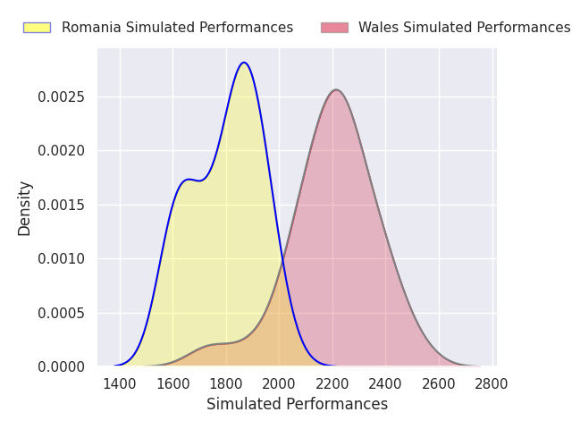
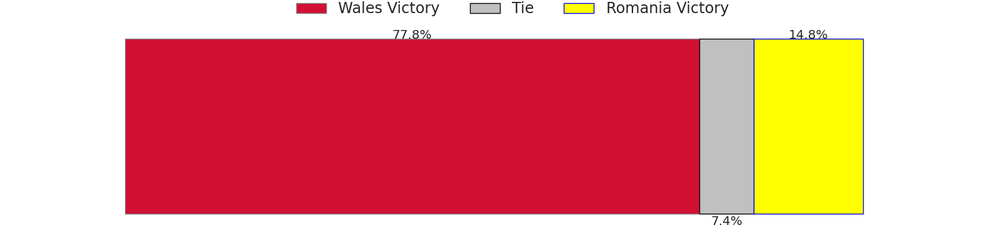
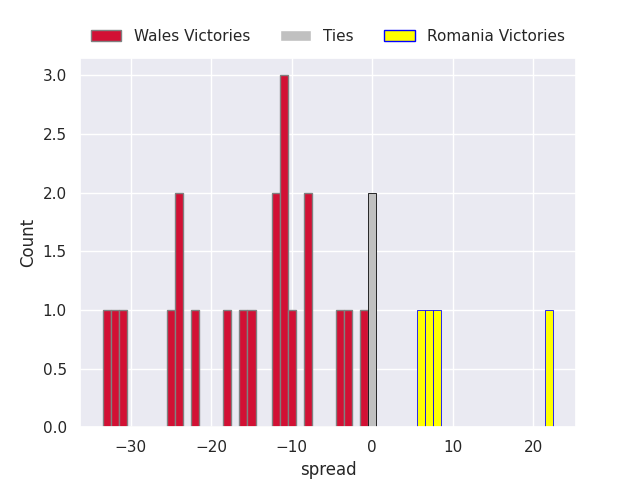

### England V Romania on 2027-10-22

Average Margin: England by 25.0

### Argentina V Portugal on 2027-10-22

Average Margin: Argentina by 15.6

### Argentina V Spain on 2027-10-22

Average Margin: Argentina by 20.3

### Wales V Georgia on 2027-10-22

Average Margin: Wales by 1.5

### United States of America V Scotland on 2027-10-22

Average Margin: Scotland by 13.5

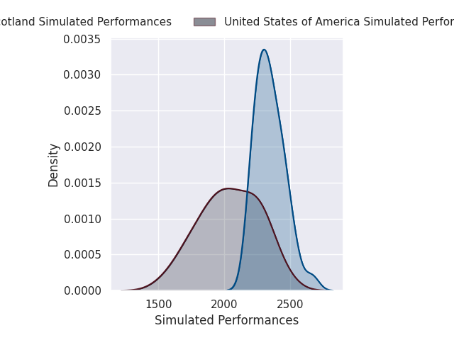
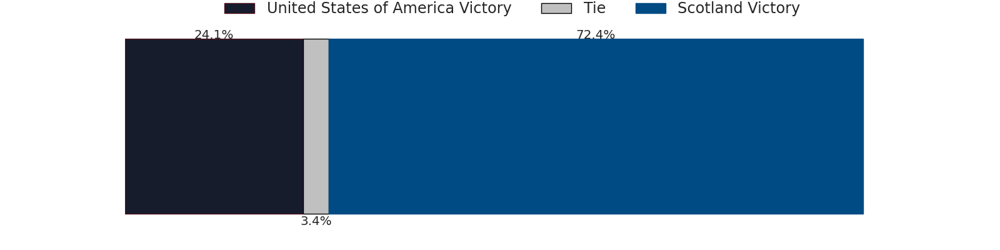
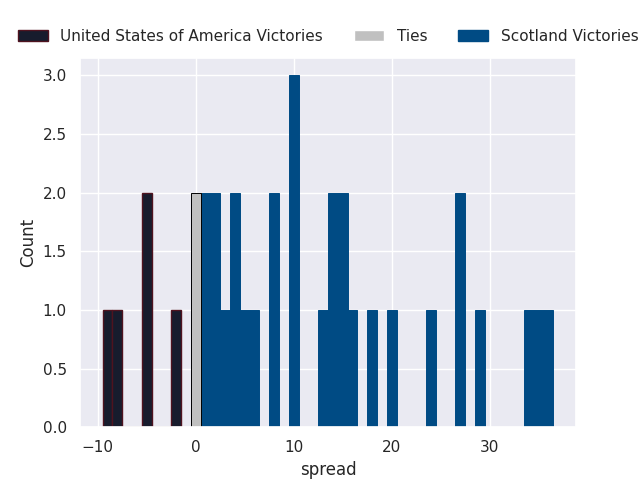

### Fiji V Portugal on 2027-10-22

Average Margin: Portugal by 13.6

### Spain V United States of America on 2027-10-22

Average Margin: United States of America by 3.0

### Scotland V Canada on 2027-10-22

Average Margin: Scotland by 28.1

### Ireland V Wales on 2027-10-22

Average Margin: Ireland by 8.5

### Ireland V Scotland on 2027-10-22

Average Margin: Ireland by 3.0

### Ireland V Canada on 2027-10-22

Average Margin: Ireland by 35.8

### Scotland V Wales on 2027-10-22

Average Margin: Scotland by 18.0

### Ireland V Zimbabwe on 2027-10-22

Average Margin: Ireland by 42.3

### Ireland V Italy on 2027-10-22

Average Margin: Ireland by 19.5

### Scotland V Fiji on 2027-10-22

Average Margin: Scotland by 23.9

### Scotland V Zimbabwe on 2027-10-22

Average Margin: Scotland by 35.3

### Scotland V Australia on 2027-10-22

Average Margin: Scotland by 9.2

### Scotland V Chile on 2027-10-22

Average Margin: Scotland by 27.6

### Scotland V Tonga on 2027-10-22

Average Margin: Scotland by 24.7

### Scotland V Argentina on 2027-10-22

Average Margin: Argentina by 0.0

### Ireland V Argentina on 2027-10-22

Average Margin: Argentina by 4.0

### Ireland V Samoa on 2027-10-22

Average Margin: Ireland by 31.3

### Argentina V Scotland on 2027-10-22

Average Margin: Scotland by 7.5

### Ireland V Portugal on 2027-10-22

Average Margin: Ireland by 20.5

### Ireland V Spain on 2027-10-22

Average Margin: Ireland by 25.5

### Spain V Japan on 2027-10-22

Average Margin: Japan by 8.0

### Argentina V Australia on 2027-10-22

Average Margin: Australia by 2.7

### Scotland V Georgia on 2027-10-22

Average Margin: Scotland by 14.6

### Ireland V Georgia on 2027-10-22

Average Margin: Ireland by 13.3

### Scotland V Portugal on 2027-10-22

Average Margin: Scotland by 20.0

### Scotland V Japan on 2027-10-22

Average Margin: Scotland by 16.9

### Ireland V Tonga on 2027-10-22

Average Margin: Ireland by 34.7

### Scotland V Italy on 2027-10-22

Average Margin: Scotland by 22.2

### Scotland V Spain on 2027-10-22

Average Margin: Scotland by 28.4

### Scotland V United States of America on 2027-10-22

Average Margin: Scotland by 24.8

### Ireland V Chile on 2027-10-22

Average Margin: Ireland by 21.0

### Ireland V Japan on 2027-10-22

Average Margin: Ireland by 15.0

### Ireland V Australia on 2027-10-22

Average Margin: Ireland by 12.5

### Ireland V Fiji on 2027-10-22

Average Margin: Ireland by 22.1

### Ireland V United States of America on 2027-10-22

Average Margin: Ireland by 22.8

### Japan V Portugal on 2027-10-22

Average Margin: Japan by 25.0

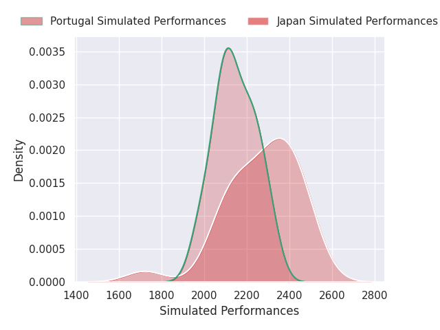

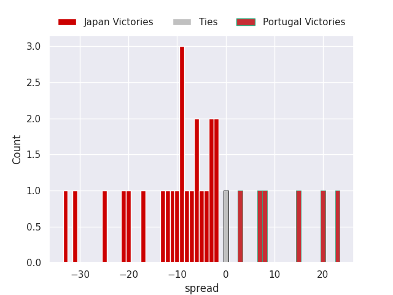

### United States of America V Ireland on 2027-10-22

Average Margin: Ireland by 6.0

### France V Portugal on 2027-10-22

Average Margin: France by 24.0

### New Zealand V Wales on 2027-10-22

Average Margin: New Zealand by 22.0

### New Zealand V Samoa on 2027-10-22

Average Margin: New Zealand by 37.9

### New Zealand V Japan on 2027-10-22

Average Margin: New Zealand by 25.3

### Australia V Fiji on 2027-10-22

Average Margin: Australia by 31.0

### New Zealand V Romania on 2027-10-22

Average Margin: New Zealand by 35.4

### New Zealand V Scotland on 2027-10-22

Average Margin: New Zealand by 17.0

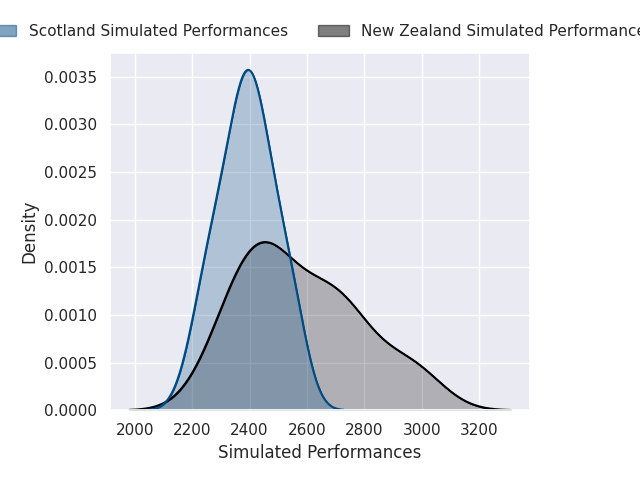

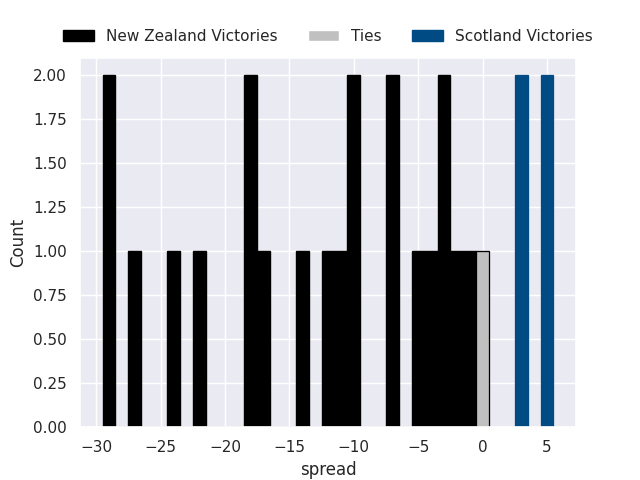

### Australia V Georgia on 2027-10-22

Average Margin: Australia by 5.5

### Australia V Zimbabwe on 2027-10-22

Average Margin: Australia by 18.0

### Australia V Samoa on 2027-10-22

Average Margin: Australia by 21.7

### Australia V Hong Kong on 2027-10-22

Average Margin: Australia by 23.5

### Australia V Canada on 2027-10-22

Average Margin: Australia by 17.0

### South Africa V United States of America on 2027-10-22

Average Margin: South Africa by 30.8

### South Africa V Samoa on 2027-10-22

Average Margin: South Africa by 45.6

### South Africa V Spain on 2027-10-22

Average Margin: South Africa by 35.4

### Australia V Uruguay on 2027-10-22

Average Margin: Australia by 31.0

### South Africa V Fiji on 2027-10-22

Average Margin: South Africa by 32.9

### Australia V Tonga on 2027-10-22

Average Margin: Australia by 23.9

### Australia V United States of America on 2027-10-22

Average Margin: Australia by 17.0

### New Zealand V Portugal on 2027-10-22

Average Margin: New Zealand by 23.4

### New Zealand V Chile on 2027-10-22

Average Margin: New Zealand by 29.8

### New Zealand V Tonga on 2027-10-22

Average Margin: New Zealand by 36.1

### Australia V Chile on 2027-10-22

Average Margin: Australia by 16.9

### New Zealand V Hong Kong on 2027-10-22

Average Margin: New Zealand by 43.2

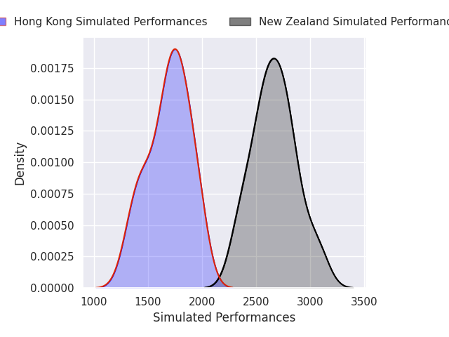
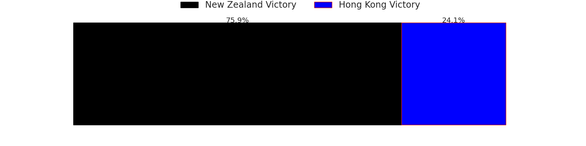
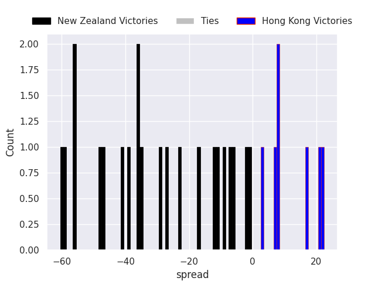

### New Zealand V Spain on 2027-10-22

Average Margin: New Zealand by 30.6

### Australia V Spain on 2027-10-22

Average Margin: Australia by 23.2

### New Zealand V Zimbabwe on 2027-10-22

Average Margin: New Zealand by 38.1

### New Zealand V United States of America on 2027-10-22

Average Margin: New Zealand by 27.0

### Australia V Italy on 2027-10-22

Average Margin: Australia by 6.9

### New Zealand V Italy on 2027-10-22

Average Margin: New Zealand by 27.5

### Australia V Portugal on 2027-10-22

Average Margin: Australia by 10.9

### New Zealand V Georgia on 2027-10-22

Average Margin: New Zealand by 19.5

### New Zealand V Canada on 2027-10-22

Average Margin: New Zealand by 32.9

### New Zealand V Uruguay on 2027-10-22

Average Margin: New Zealand by 37.0

### South Africa V Chile on 2027-10-22

Average Margin: South Africa by 34.0

### South Africa V Georgia on 2027-10-22

Average Margin: South Africa by 22.9

### South Africa V Italy on 2027-10-22

Average Margin: South Africa by 28.4

### Fiji V England on 2027-10-22

Average Margin: England by 13.0

### Fiji V Tonga on 2027-10-22

Average Margin: Fiji by 11.4

### Argentina V Tonga on 2027-10-22

Average Margin: Argentina by 28.7

### Canada V England on 2027-10-22

Average Margin: England by 29.0

### Spain V England on 2027-10-22

Average Margin: England by 13.1

### Canada V Tonga on 2027-10-22

Average Margin: Tonga by 2.5

### Canada V Wales on 2027-10-22

Average Margin: Wales by 15.7

### Spain V Tonga on 2027-10-22

Average Margin: Tonga by 0.8

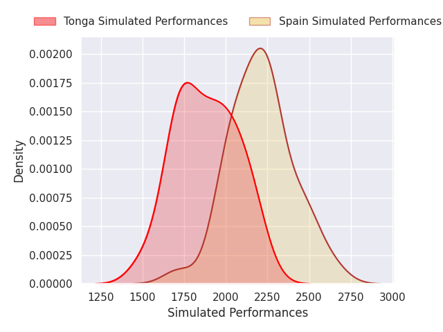
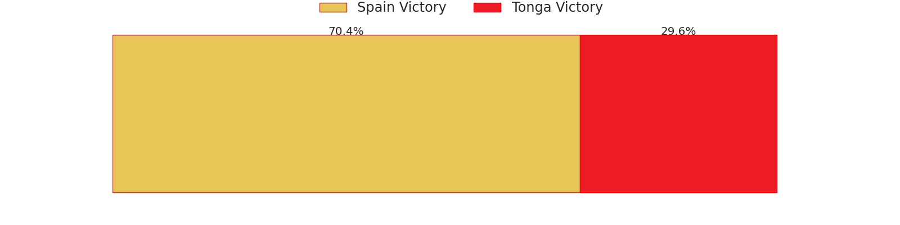
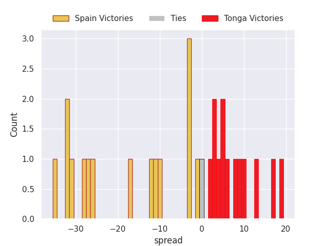

### Argentina V Zimbabwe on 2027-10-22

Average Margin: Argentina by 23.0

### Argentina V England on 2027-10-22

Average Margin: Argentina by 7.0

### France V Ireland on 2027-10-22

Average Margin: France by 8.6

### France V Scotland on 2027-10-22

Average Margin: France by 7.3

### Japan V Ireland on 2027-10-22

Average Margin: Ireland by 4.0

### Japan V Scotland on 2027-10-22

Average Margin: Scotland by 5.8

### Spain V Zimbabwe on 2027-10-22

Average Margin: Spain by 15.1

### Argentina V Wales on 2027-10-22

Average Margin: Argentina by 12.1

### Fiji V Zimbabwe on 2027-10-22

Average Margin: Fiji by 13.7

### Fiji V Wales on 2027-10-22

Average Margin: Wales by 2.8

### South Africa V Wales on 2027-10-22

Average Margin: South Africa by 27.9

### South Africa V Tonga on 2027-10-22

Average Margin: South Africa by 41.2

### South Africa V Portugal on 2027-10-22

Average Margin: South Africa by 28.7

### South Africa V Zimbabwe on 2027-10-22

Average Margin: South Africa by 45.6

### South Africa V Uruguay on 2027-10-22

Average Margin: South Africa by 36.6

### South Africa V Canada on 2027-10-22

Average Margin: South Africa by 41.0

### South Africa V Japan on 2027-10-22

Average Margin: South Africa by 29.4

### Georgia V Fiji on 2027-10-22

Average Margin: Georgia by 22.0

### South Africa V Scotland on 2027-10-22

Average Margin: South Africa by 15.5

### Georgia V Italy on 2027-10-22

Average Margin: Georgia by 12.5

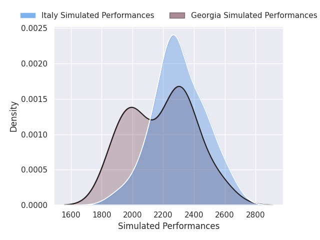

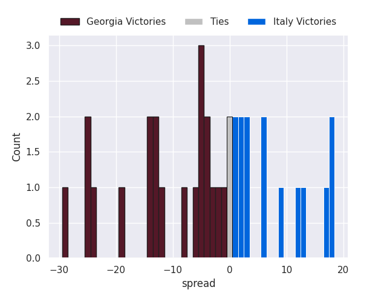

### Georgia V United States of America on 2027-10-22

Average Margin: United States of America by 6.0

### Italy V Portugal on 2027-10-22

Average Margin: Portugal by 15.0

### South Africa V Australia on 2027-10-22

Average Margin: South Africa by 22.0

### Italy V Zimbabwe on 2027-10-22

Average Margin: Italy by 16.0

### Spain V Wales on 2027-10-22

Average Margin: Wales by 5.0

### Scotland V Uruguay on 2027-10-22

Average Margin: Scotland by 47.0

### Ireland V Uruguay on 2027-10-22

Average Margin: Ireland by 32.5

## Week 5

### New Zealand V South Africa on 2027-10-29

Average Margin: New Zealand by 0.7

### Georgia V Scotland on 2027-10-29

Average Margin: Scotland by 6.6

### Georgia V Ireland on 2027-10-29

Average Margin: Georgia by 1.0

### Fiji V Wales on 2027-10-29

Average Margin: Wales by 3.0

### United States of America V Ireland on 2027-10-29

Average Margin: Ireland by 11.6

### Argentina V Australia on 2027-10-29

Average Margin: Argentina by 0.8

### Georgia V Japan on 2027-10-29

Average Margin: Georgia by 2.0

### Argentina V Georgia on 2027-10-29

Average Margin: Argentina by 4.9

### Japan V Italy on 2027-10-29

Average Margin: Japan by 11.0

### Chile V Wales on 2027-10-29

Average Margin: Wales by 18.0

### Japan V Wales on 2027-10-29

Average Margin: Japan by 3.5

### France V Georgia on 2027-10-29

Average Margin: France by 17.0

### Australia V Italy on 2027-10-29

Average Margin: Australia by 7.8

### Chile V England on 2027-10-29

Average Margin: England by 18.5

### United States of America V England on 2027-10-29

Average Margin: England by 14.6

### Japan V Georgia on 2027-10-29

Average Margin: Japan by 2.9

### Japan V Scotland on 2027-10-29

Average Margin: Scotland by 11.4

### Italy V Ireland on 2027-10-29

Average Margin: Ireland by 14.4

### Argentina V Italy on 2027-10-29

Average Margin: Argentina by 11.2

### Tonga V Ireland on 2027-10-29

Average Margin: Ireland by 22.0

### Australia V Scotland on 2027-10-29

Average Margin: Scotland by 2.0

### Argentina V United States of America on 2027-10-29

Average Margin: Argentina by 19.5

### Australia V Ireland on 2027-10-29

Average Margin: Ireland by 18.0

### Portugal V Georgia on 2027-10-29

Average Margin: Georgia by 8.0

### Fiji V Georgia on 2027-10-29

Average Margin: Georgia by 2.0

### England V Argentina on 2027-10-29

Average Margin: England by 23.0

### Spain V Georgia on 2027-10-29

Average Margin: Georgia by 15.0

### New Zealand V Wales on 2027-10-29

Average Margin: New Zealand by 18.8

### Portugal V Ireland on 2027-10-29

Average Margin: Ireland by 7.0

### Argentina V Tonga on 2027-10-29

Average Margin: Argentina by 21.0

### Japan V Ireland on 2027-10-29

Average Margin: Ireland by 4.5

### United States of America V Scotland on 2027-10-29

Average Margin: Scotland by 19.6

### Ireland V Scotland on 2027-10-29

Average Margin: Ireland by 6.4

### Italy V Scotland on 2027-10-29

Average Margin: Scotland by 15.4

### Argentina V Japan on 2027-10-29

Average Margin: Argentina by 22.0

### Portugal V Scotland on 2027-10-29

Average Margin: Scotland by 9.5

### Chile V Ireland on 2027-10-29

Average Margin: Ireland by 21.5

### Australia V Wales on 2027-10-29

Average Margin: Australia by 4.6

### France V England on 2027-10-29

Average Margin: France by 6.2

### New Zealand V England on 2027-10-29

Average Margin: New Zealand by 6.9

### Fiji V Ireland on 2027-10-29

Average Margin: Ireland by 15.2

### Wales V France on 2027-10-29

Average Margin: France by 10.4

### Spain V France on 2027-10-29

Average Margin: France by 21.0

### New Zealand V Italy on 2027-10-29

Average Margin: New Zealand by 27.0

### Spain V South Africa on 2027-10-29

Average Margin: South Africa by 22.0

### Tonga V South Africa on 2027-10-29

Average Margin: South Africa by 24.0

### Italy V South Africa on 2027-10-29

Average Margin: South Africa by 21.0

### Fiji V Scotland on 2027-10-29

Average Margin: Scotland by 12.0

### Australia V Georgia on 2027-10-29

Average Margin: Australia by 16.0

### New Zealand V Chile on 2027-10-29

Average Margin: New Zealand by 8.0

### New Zealand V Portugal on 2027-10-29

Average Margin: New Zealand by 16.0

### New Zealand V United States of America on 2027-10-29

Average Margin: New Zealand by 35.0

### Georgia V South Africa on 2027-10-29

Average Margin: South Africa by 11.0

### New Zealand V Georgia on 2027-10-29

Average Margin: New Zealand by 10.2

### Portugal V South Africa on 2027-10-29

Average Margin: South Africa by 21.4

### Australia V South Africa on 2027-10-29

Average Margin: South Africa by 11.3

### Chile V South Africa on 2027-10-29

Average Margin: South Africa by 42.5

### Argentina V Portugal on 2027-10-29

Average Margin: Argentina by 6.0

### Fiji V France on 2027-10-29

Average Margin: France by 15.7

### Wales V Ireland on 2027-10-29

Average Margin: Ireland by 3.6

### Japan V England on 2027-10-29

Average Margin: England by 12.2

### Australia V England on 2027-10-29

Average Margin: England by 4.4

### England V Ireland on 2027-10-29

Average Margin: England by 14.0

### Tonga V Scotland on 2027-10-29

Average Margin: Scotland by 20.0

### Argentina V Scotland on 2027-10-29

Average Margin: Argentina by 0.3

### Zimbabwe V France on 2027-10-29

Average Margin: France by 16.0

### Argentina V Ireland on 2027-10-29

Average Margin: Argentina by 0.5

### Spain V Scotland on 2027-10-29

Average Margin: Scotland by 19.0

### Canada V France on 2027-10-29

Average Margin: France by 41.0

### Fiji V Portugal on 2027-10-29

Average Margin: Portugal by 3.0

### England V Scotland on 2027-10-29

Average Margin: England by 9.5

### England V France on 2027-10-29

Average Margin: England by 1.8

### Spain V Ireland on 2027-10-29

Average Margin: Ireland by 18.7

### Wales V Scotland on 2027-10-29

Average Margin: Scotland by 6.7

### Wales V Japan on 2027-10-29

Average Margin: Wales by 4.4

### Argentina V France on 2027-10-29

Average Margin: France by 4.9

### Tonga V France on 2027-10-29

Average Margin: France by 34.4

### Samoa V Scotland on 2027-10-29

Average Margin: Scotland by 20.0

## Week 6

### South Africa V France on 2027-11-05

Average Margin: South Africa by 11.3

### England V Argentina on 2027-11-05

Average Margin: England by 9.2

### England V Ireland on 2027-11-05

Average Margin: England by 6.8

### England V Georgia on 2027-11-05

Average Margin: England by 6.7

### Australia V Georgia on 2027-11-05

Average Margin: Australia by 15.0

### France V Scotland on 2027-11-05

Average Margin: Scotland by 6.0

### England V Australia on 2027-11-05

Average Margin: England by 18.5

### Georgia V Ireland on 2027-11-05

Average Margin: Georgia by 1.5

### Japan V Argentina on 2027-11-05

Average Margin: Argentina by 9.2

### Georgia V Argentina on 2027-11-05

Average Margin: Georgia by 4.6

### England V Portugal on 2027-11-05

Average Margin: England by 13.5

### England V Scotland on 2027-11-05

Average Margin: England by 3.9

### France V Argentina on 2027-11-05

Average Margin: France by 13.5

### Japan V Scotland on 2027-11-05

Average Margin: Scotland by 7.0

### France V Ireland on 2027-11-05

Average Margin: France by 9.5

### Wales V Argentina on 2027-11-05

Average Margin: Wales by 6.7

### Japan V Ireland on 2027-11-05

Average Margin: Ireland by 5.6

### Wales V Ireland on 2027-11-05

Average Margin: Ireland by 15.0

### Australia V United States of America on 2027-11-05

Average Margin: Australia by 8.0

### Italy V Ireland on 2027-11-05

Average Margin: Ireland by 12.0

### Australia V Japan on 2027-11-05

Average Margin: Australia by 18.0

### New Zealand V Georgia on 2027-11-05

Average Margin: New Zealand by 16.5

### Japan V Wales on 2027-11-05

Average Margin: Japan by 10.5

### Wales V Scotland on 2027-11-05

Average Margin: Scotland by 23.0

### New Zealand V Portugal on 2027-11-05

Average Margin: New Zealand by 9.0

### Australia V Argentina on 2027-11-05

Average Margin: Australia by 8.0

### South Africa V Japan on 2027-11-05

Average Margin: South Africa by 22.5

### New Zealand V France on 2027-11-05

Average Margin: New Zealand by 6.7

### New Zealand V Wales on 2027-11-05

Average Margin: New Zealand by 16.1

### New Zealand V Ireland on 2027-11-05

Average Margin: New Zealand by 14.3

### New Zealand V Scotland on 2027-11-05

Average Margin: New Zealand by 11.4

### South Africa V Scotland on 2027-11-05

Average Margin: South Africa by 14.2

### South Africa V Wales on 2027-11-05

Average Margin: South Africa by 23.1

### Australia V Ireland on 2027-11-05

Average Margin: Australia by 2.0

### South Africa V Fiji on 2027-11-05

Average Margin: South Africa by 27.5

### New Zealand V Argentina on 2027-11-05

Average Margin: New Zealand by 21.2

### New Zealand V England on 2027-11-05

Average Margin: New Zealand by 8.3

### South Africa V Spain on 2027-11-05

Average Margin: South Africa by 16.0

### South Africa V Ireland on 2027-11-05

Average Margin: South Africa by 16.1

### South Africa V England on 2027-11-05

Average Margin: South Africa by 14.7

### Australia V France on 2027-11-05

Average Margin: France by 2.5

### South Africa V Portugal on 2027-11-05

Average Margin: South Africa by 25.0

### Georgia V Scotland on 2027-11-05

Average Margin: Georgia by 6.0

### South Africa V Argentina on 2027-11-05

Average Margin: South Africa by 24.3

### Australia V Wales on 2027-11-05

Average Margin: Australia by 9.5

### New Zealand V Fiji on 2027-11-05

Average Margin: New Zealand by 17.4

### New Zealand V Japan on 2027-11-05

Average Margin: New Zealand by 8.0

### Australia V Scotland on 2027-11-05

Average Margin: Scotland by 7.0

### Australia V England on 2027-11-05

Average Margin: England by 5.0

### Australia V Fiji on 2027-11-05

Average Margin: Australia by 9.0

### Australia V Italy on 2027-11-05

Average Margin: Australia by 13.0

## Week 7

### France V Scotland on 2027-11-12

Average Margin: France by 7.6

### France V Portugal on 2027-11-12

Average Margin: France by 17.7

### South Africa V Australia on 2027-11-12

Average Margin: South Africa by 17.5

### South Africa V Scotland on 2027-11-12

Average Margin: South Africa by 3.0

### New Zealand V Japan on 2027-11-12

Average Margin: New Zealand by 11.0

### France V Japan on 2027-11-12

Average Margin: France by 20.7

### Japan V Ireland on 2027-11-12

Average Margin: Ireland by 4.5

### Fiji V Australia on 2027-11-12

Average Margin: Australia by 4.0

### Fiji V Ireland on 2027-11-12

Average Margin: Ireland by 6.9

### France V United States of America on 2027-11-12

Average Margin: France by 21.0

### Wales V New Zealand on 2027-11-12

Average Margin: New Zealand by 6.5

### England V Italy on 2027-11-12

Average Margin: England by 7.0

### England V Japan on 2027-11-12

Average Margin: England by 18.0

### Wales V Japan on 2027-11-12

Average Margin: Wales by 7.3

### Fiji V Scotland on 2027-11-12

Average Margin: Scotland by 13.0

### Ireland V Georgia on 2027-11-12

Average Margin: Ireland by 7.0

### Australia V Georgia on 2027-11-12

Average Margin: Australia by 5.0

### Wales V Georgia on 2027-11-12

Average Margin: Georgia by 8.0

### South Africa V France on 2027-11-12

Average Margin: South Africa by 11.7

### Scotland V Ireland on 2027-11-12

Average Margin: Scotland by 6.4

### Georgia V England on 2027-11-12

Average Margin: England by 3.0

### Australia V England on 2027-11-12

Average Margin: Australia by 1.8

### Australia V New Zealand on 2027-11-12

Average Margin: New Zealand by 7.8

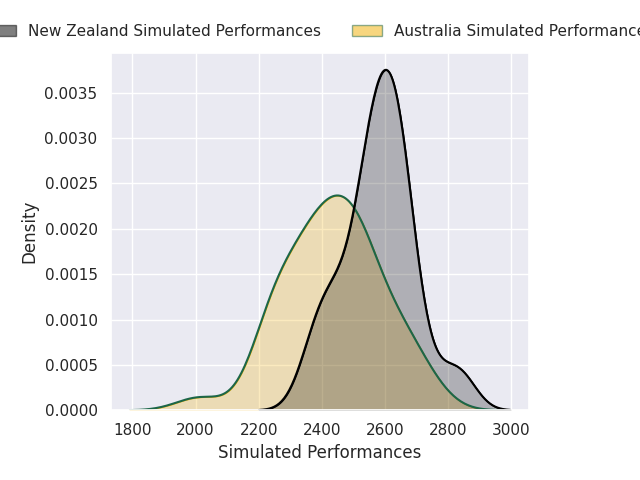
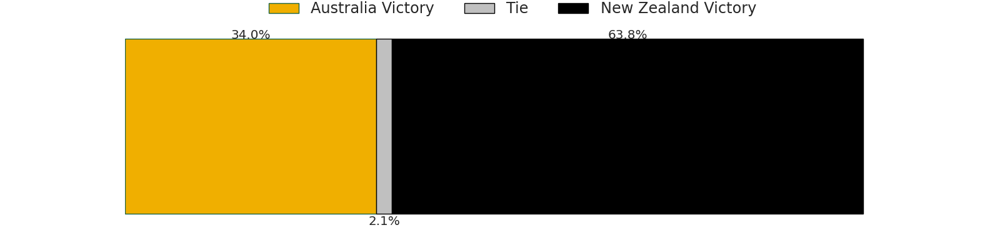
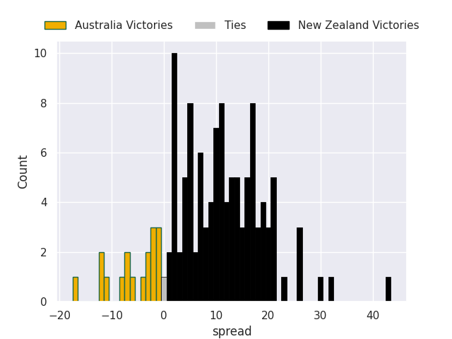

### France V Italy on 2027-11-12

Average Margin: France by 32.0

### Argentina V England on 2027-11-12

Average Margin: Argentina by 0.3

### South Africa V Georgia on 2027-11-12

Average Margin: South Africa by 15.0

### South Africa V Japan on 2027-11-12

Average Margin: South Africa by 17.0

### Fiji V New Zealand on 2027-11-12

Average Margin: New Zealand by 14.0

### France V Fiji on 2027-11-12

Average Margin: France by 22.0

### New Zealand V Georgia on 2027-11-12

Average Margin: New Zealand by 18.0

### Spain V Australia on 2027-11-12

Average Margin: Australia by 0.0

### Japan V Argentina on 2027-11-12

Average Margin: Argentina by 0.5

### South Africa V New Zealand on 2027-11-12

Average Margin: South Africa by 4.0

### Ireland V Australia on 2027-11-12

Average Margin: Ireland by 7.8

### England V Georgia on 2027-11-12

Average Margin: England by 9.5

### France V New Zealand on 2027-11-12

Average Margin: France by 2.6

### New Zealand V Australia on 2027-11-12

Average Margin: New Zealand by 15.2

### Wales V France on 2027-11-12

Average Margin: France by 3.5

### France V England on 2027-11-12

Average Margin: France by 7.4

### France V Georgia on 2027-11-12

Average Margin: France by 15.3

### Ireland V Scotland on 2027-11-12

Average Margin: Ireland by 5.4

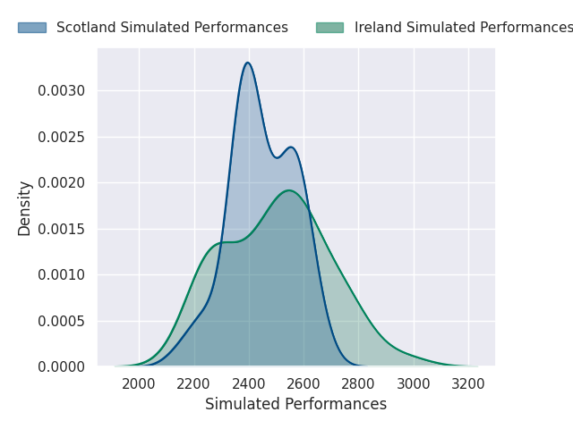

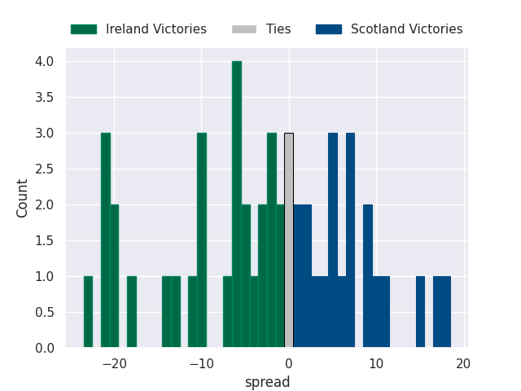

### New Zealand V Scotland on 2027-11-12

Average Margin: New Zealand by 13.8

### France V Ireland on 2027-11-12

Average Margin: France by 6.9

### France V Argentina on 2027-11-12

Average Margin: France by 11.2

### Scotland V Georgia on 2027-11-12

Average Margin: Scotland by 12.3

### France V Australia on 2027-11-12

Average Margin: France by 14.5

### Scotland V England on 2027-11-12

Average Margin: Scotland by 7.6

### Ireland V England on 2027-11-12

Average Margin: Ireland by 2.4

### Wales V Scotland on 2027-11-12

Average Margin: Scotland by 2.3

### New Zealand V Argentina on 2027-11-12

Average Margin: New Zealand by 12.4

### Wales V Ireland on 2027-11-12

Average Margin: Ireland by 2.2

### England V Wales on 2027-11-12

Average Margin: England by 13.0

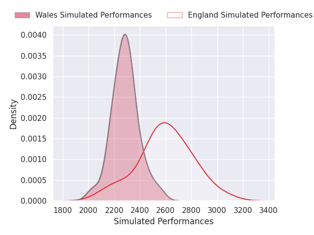
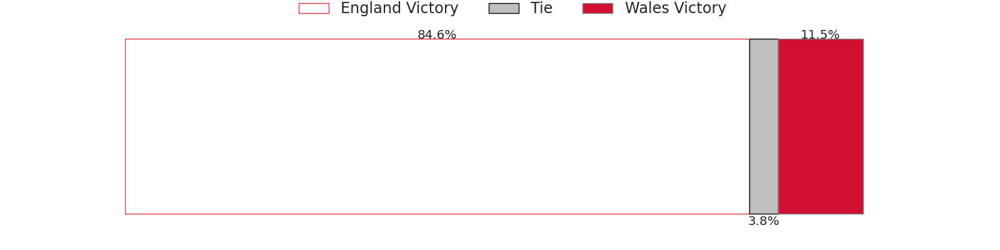
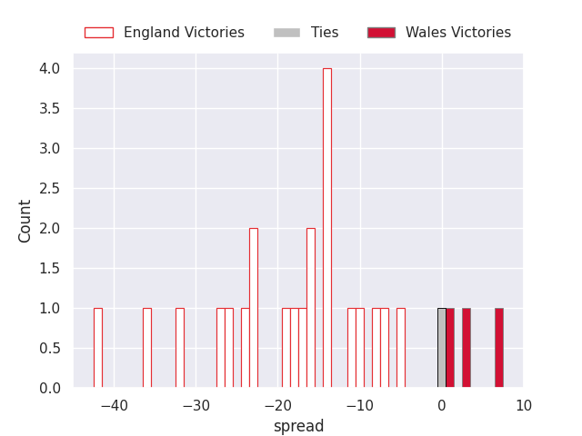

### New Zealand V England on 2027-11-12

Average Margin: New Zealand by 5.7

### Fiji V Argentina on 2027-11-12

Average Margin: Argentina by 6.7

### Australia V Argentina on 2027-11-12

Average Margin: Argentina by 0.6

### South Africa V England on 2027-11-12

Average Margin: South Africa by 6.6

### Wales V England on 2027-11-12

Average Margin: England by 4.0

### Scotland V Argentina on 2027-11-12

Average Margin: Scotland by 12.1

### South Africa V Argentina on 2027-11-12

Average Margin: South Africa by 13.3

### Portugal V Ireland on 2027-11-12

Average Margin: Ireland by 6.0

### Wales V Argentina on 2027-11-12

Average Margin: Wales by 1.6

### New Zealand V Ireland on 2027-11-12

Average Margin: New Zealand by 5.9

### Scotland V Japan on 2027-11-12

Average Margin: Scotland by 27.5

### South Africa V Ireland on 2027-11-12

Average Margin: South Africa by 11.6

### Scotland V Australia on 2027-11-12

Average Margin: Scotland by 12.4

### Wales V Australia on 2027-11-12

Average Margin: Wales by 2.3

### England V Australia on 2027-11-12

Average Margin: England by 13.8

### Argentina V Ireland on 2027-11-12

Average Margin: Ireland by 0.3

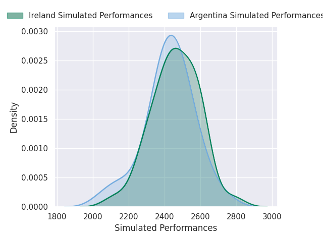

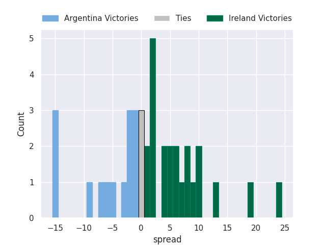

### South Africa V Wales on 2027-11-12

Average Margin: South Africa by 18.0

### Australia V Ireland on 2027-11-12

Average Margin: Ireland by 4.0

