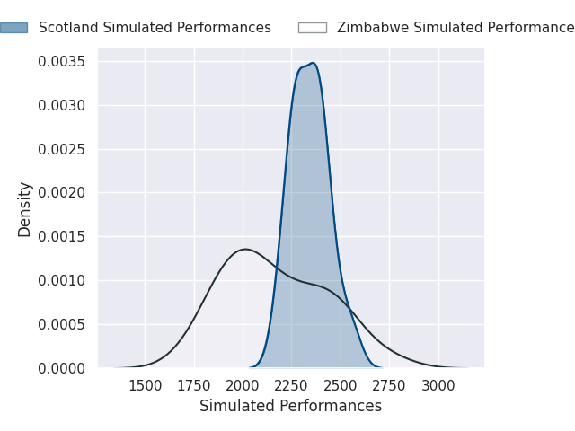
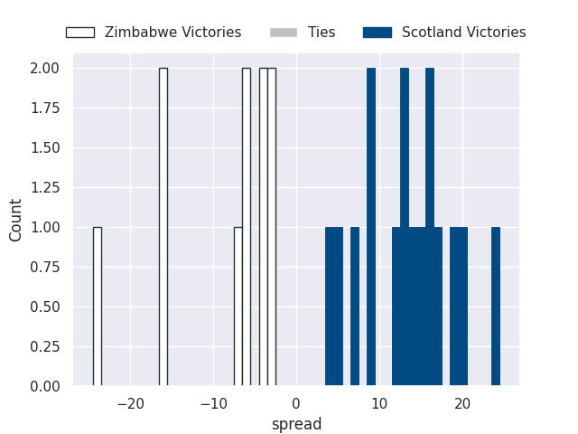

# Team Rankings

# Standings

## Current Standings

### Pool A

| Club   | Played   | Wins   | Point Differential   | Losing Bonus Points   | Try Bonus Points   | Competition Points   |
|--------|----------|--------|----------------------|-----------------------|--------------------|----------------------|

### Pool B

| Club   | Played   | Wins   | Point Differential   | Losing Bonus Points   | Try Bonus Points   | Competition Points   |
|--------|----------|--------|----------------------|-----------------------|--------------------|----------------------|

### Pool C

| Club   | Played   | Wins   | Point Differential   | Losing Bonus Points   | Try Bonus Points   | Competition Points   |
|--------|----------|--------|----------------------|-----------------------|--------------------|----------------------|

### Pool D

| Club   | Played   | Wins   | Point Differential   | Losing Bonus Points   | Try Bonus Points   | Competition Points   |
|--------|----------|--------|----------------------|-----------------------|--------------------|----------------------|

### Pool E

| Club   | Played   | Wins   | Point Differential   | Losing Bonus Points   | Try Bonus Points   | Competition Points   |
|--------|----------|--------|----------------------|-----------------------|--------------------|----------------------|

### Pool F

| Club   | Played   | Wins   | Point Differential   | Losing Bonus Points   | Try Bonus Points   | Competition Points   |
|--------|----------|--------|----------------------|-----------------------|--------------------|----------------------|

## Projected Remaining Table

### Pool A

| Club        |   To Play |   Projected Wins |   Projected Differential |   Projected Losing Bonus Points | Projected Try Bonus Points   |   Projected Competition Points |
|:------------|----------:|-----------------:|-------------------------:|--------------------------------:|:-----------------------------|-------------------------------:|
| New Zealand |         3 |            2.811 |                   90.374 |                           0.124 |                              |                         11.436 |
| Australia   |         3 |            2.131 |                   48.159 |                           0.285 |                              |                          8.889 |
| Chile       |         3 |            0.94  |                  -37.003 |                           0.121 |                              |                          3.905 |
| Hong Kong   |         3 |            0.072 |                 -101.53  |                           0.139 |                              |                          0.439 |

### Pool B

| Club         |   To Play |   Projected Wins |   Projected Differential |   Projected Losing Bonus Points | Projected Try Bonus Points   |   Projected Competition Points |
|:-------------|----------:|-----------------:|-------------------------:|--------------------------------:|:-----------------------------|-------------------------------:|
| South Africa |         3 |            2.975 |                   87.103 |                           0.016 |                              |                         11.926 |
| Georgia      |         3 |            1.474 |                    2.136 |                           0.313 |                              |                          6.287 |
| Italy        |         3 |            1.436 |                   -6.615 |                           0.318 |                              |                          6.156 |
| Romania      |         3 |            0.064 |                  -82.624 |                           0.167 |                              |                          0.445 |

### Pool C

| Club      |   To Play |   Projected Wins |   Projected Differential |   Projected Losing Bonus Points | Projected Try Bonus Points   |   Projected Competition Points |
|:----------|----------:|-----------------:|-------------------------:|--------------------------------:|:-----------------------------|-------------------------------:|
| Argentina |         3 |            2.867 |                   60.334 |                           0.09  |                              |                         11.602 |
| Fiji      |         3 |            1.803 |                   14.783 |                           0.347 |                              |                          7.631 |
| Spain     |         3 |            1.073 |                  -15.699 |                           0.371 |                              |                          4.745 |
| Canada    |         3 |            0.194 |                  -59.418 |                           0.306 |                              |                          1.136 |

### Pool D

| Club     |   To Play |   Projected Wins |   Projected Differential |   Projected Losing Bonus Points | Projected Try Bonus Points   |   Projected Competition Points |
|:---------|----------:|-----------------:|-------------------------:|--------------------------------:|:-----------------------------|-------------------------------:|
| Ireland  |         3 |            2.604 |                   51.721 |                           0.226 |                              |                         10.718 |
| Scotland |         3 |            2.295 |                   43.428 |                           0.296 |                              |                          9.546 |
| Portugal |         3 |            0.629 |                  -38.825 |                           0.358 |                              |                          2.966 |
| Uruguay  |         3 |            0.392 |                  -56.324 |                           0.326 |                              |                          1.976 |

### Pool E

| Club                     |   To Play |   Projected Wins |   Projected Differential |   Projected Losing Bonus Points | Projected Try Bonus Points   |   Projected Competition Points |
|:-------------------------|----------:|-----------------:|-------------------------:|--------------------------------:|:-----------------------------|-------------------------------:|
| France                   |         3 |            2.97  |                   84.09  |                           0.023 |                              |                         11.911 |
| Japan                    |         3 |            1.715 |                    5.432 |                           0.244 |                              |                          7.188 |
| United States of America |         3 |            1.12  |                  -18.483 |                           0.342 |                              |                          4.922 |
| Samoa                    |         3 |            0.135 |                  -71.039 |                           0.239 |                              |                          0.827 |

### Pool F

| Club     |   To Play |   Projected Wins |   Projected Differential |   Projected Losing Bonus Points | Projected Try Bonus Points   |   Projected Competition Points |
|:---------|----------:|-----------------:|-------------------------:|--------------------------------:|:-----------------------------|-------------------------------:|
| England  |         3 |            2.934 |                   84.159 |                           0.042 |                              |                         11.802 |
| Wales    |         3 |            1.963 |                   24.269 |                           0.176 |                              |                          8.078 |
| Tonga    |         3 |            0.733 |                  -45.175 |                           0.276 |                              |                          3.258 |
| Zimbabwe |         3 |            0.326 |                  -63.253 |                           0.312 |                              |                          1.668 |

## Projected Total Table

### Pool A

| Club        |   Played |   Wins |   Point Differential |   Losing Bonus Points | Try Bonus Points   |   Competition Points |
|:------------|---------:|-------:|---------------------:|----------------------:|:-------------------|---------------------:|
| New Zealand |        3 |  2.811 |               90.374 |                 0.124 |                    |               11.436 |
| Australia   |        3 |  2.131 |               48.159 |                 0.285 |                    |                8.889 |
| Chile       |        3 |  0.94  |              -37.003 |                 0.121 |                    |                3.905 |
| Hong Kong   |        3 |  0.072 |             -101.53  |                 0.139 |                    |                0.439 |

### Pool B

| Club         |   Played |   Wins |   Point Differential |   Losing Bonus Points | Try Bonus Points   |   Competition Points |
|:-------------|---------:|-------:|---------------------:|----------------------:|:-------------------|---------------------:|
| South Africa |        3 |  2.975 |               87.103 |                 0.016 |                    |               11.926 |
| Georgia      |        3 |  1.474 |                2.136 |                 0.313 |                    |                6.287 |
| Italy        |        3 |  1.436 |               -6.615 |                 0.318 |                    |                6.156 |
| Romania      |        3 |  0.064 |              -82.624 |                 0.167 |                    |                0.445 |

### Pool C

| Club      |   Played |   Wins |   Point Differential |   Losing Bonus Points | Try Bonus Points   |   Competition Points |
|:----------|---------:|-------:|---------------------:|----------------------:|:-------------------|---------------------:|
| Argentina |        3 |  2.867 |               60.334 |                 0.09  |                    |               11.602 |
| Fiji      |        3 |  1.803 |               14.783 |                 0.347 |                    |                7.631 |
| Spain     |        3 |  1.073 |              -15.699 |                 0.371 |                    |                4.745 |
| Canada    |        3 |  0.194 |              -59.418 |                 0.306 |                    |                1.136 |

### Pool D

| Club     |   Played |   Wins |   Point Differential |   Losing Bonus Points | Try Bonus Points   |   Competition Points |
|:---------|---------:|-------:|---------------------:|----------------------:|:-------------------|---------------------:|
| Ireland  |        3 |  2.604 |               51.721 |                 0.226 |                    |               10.718 |
| Scotland |        3 |  2.295 |               43.428 |                 0.296 |                    |                9.546 |
| Portugal |        3 |  0.629 |              -38.825 |                 0.358 |                    |                2.966 |
| Uruguay  |        3 |  0.392 |              -56.324 |                 0.326 |                    |                1.976 |

### Pool E

| Club                     |   Played |   Wins |   Point Differential |   Losing Bonus Points | Try Bonus Points   |   Competition Points |
|:-------------------------|---------:|-------:|---------------------:|----------------------:|:-------------------|---------------------:|
| France                   |        3 |  2.97  |               84.09  |                 0.023 |                    |               11.911 |
| Japan                    |        3 |  1.715 |                5.432 |                 0.244 |                    |                7.188 |
| United States of America |        3 |  1.12  |              -18.483 |                 0.342 |                    |                4.922 |
| Samoa                    |        3 |  0.135 |              -71.039 |                 0.239 |                    |                0.827 |

### Pool F

| Club     |   Played |   Wins |   Point Differential |   Losing Bonus Points | Try Bonus Points   |   Competition Points |
|:---------|---------:|-------:|---------------------:|----------------------:|:-------------------|---------------------:|
| England  |        3 |  2.934 |               84.159 |                 0.042 |                    |               11.802 |
| Wales    |        3 |  1.963 |               24.269 |                 0.176 |                    |                8.078 |
| Tonga    |        3 |  0.733 |              -45.175 |                 0.276 |                    |                3.258 |
| Zimbabwe |        3 |  0.326 |              -63.253 |                 0.312 |                    |                1.668 |

## Projected Playoff Results

|                          | Reach Round of 16   | Win Round of 16   | Reach Quarterfinal   | Win Quarterfinal   | Reach Semifinal   | Win Semifinal   | Reach Final   | Win Final   |
|:-------------------------|:--------------------|:------------------|:---------------------|:-------------------|:------------------|:----------------|:--------------|:------------|
| New Zealand              | 100.0 %             | 99.8 %            | 99.8 %               | 75.1 %             | 75.1 %            | 66.0 %          | 66.0 %        | 53.0 %      |
| South Africa             | 100.0 %             | 99.1 %            | 99.1 %               | 35.7 %             | 35.7 %            | 31.2 %          | 31.2 %        | 25.8 %      |
| England                  | 100.0 %             | 94.1 %            | 94.1 %               | 52.7 %             | 52.7 %            | 40.0 %          | 40.0 %        | 8.1 %       |
| France                   | 100.0 %             | 76.0 %            | 76.0 %               | 64.1 %             | 64.1 %            | 11.3 %          | 11.3 %        | 7.7 %       |
| Scotland                 | 100.0 %             | 50.5 %            | 50.5 %               | 34.9 %             | 34.9 %            | 9.9 %           | 9.9 %         | 2.2 %       |
| Ireland                  | 100.0 %             | 70.3 %            | 70.3 %               | 44.3 %             | 44.3 %            | 14.8 %          | 14.8 %        | 2.1 %       |
| Australia                | 100.0 %             | 92.2 %            | 92.2 %               | 36.0 %             | 36.0 %            | 19.0 %          | 19.0 %        | 0.9 %       |
| Wales                    | 99.5 %              | 52.9 %            | 52.9 %               | 9.5 %              | 9.5 %             | 0.7 %           | 0.7 %         | 0.2 %       |
| Argentina                | 100.0 %             | 87.6 %            | 87.6 %               | 36.3 %             | 36.3 %            | 6.0 %           | 6.0 %         | 0.0 %       |
| Fiji                     | 97.7 %              | 40.6 %            | 40.6 %               | 5.6 %              | 5.6 %             | 0.3 %           | 0.3 %         | 0.0 %       |
| Georgia                  | 97.1 %              | 12.5 %            | 12.5 %               | 2.3 %              | 2.3 %             | 0.3 %           | 0.3 %         | 0.0 %       |
| Japan                    | 97.8 %              | 6.6 %             | 6.6 %                | 1.2 %              | 1.2 %             | 0.3 %           | 0.3 %         | 0.0 %       |
| Italy                    | 93.2 %              | 3.3 %             | 3.3 %                | 1.0 %              | 1.0 %             | 0.2 %           | 0.2 %         | 0.0 %       |
| Spain                    | 80.1 %              | 6.7 %             | 6.7 %                | 0.4 %              | 0.4 %             | 0.0 %           | 0.0 %         | 0.0 %       |
| United States of America | 79.3 %              | 3.0 %             | 3.0 %                | 0.4 %              | 0.4 %             | 0.0 %           | 0.0 %         | 0.0 %       |
| Portugal                 | 36.7 %              | 1.7 %             | 1.7 %                | 0.4 %              | 0.4 %             | 0.0 %           | 0.0 %         | 0.0 %       |
| Tonga                    | 31.7 %              | 0.9 %             | 0.9 %                | 0.1 %              | 0.1 %             | 0.0 %           | 0.0 %         | 0.0 %       |
| Chile                    | 50.7 %              | 1.3 %             | 1.3 %                | 0.0 %              | 0.0 %             | 0.0 %           | 0.0 %         | 0.0 %       |
| Zimbabwe                 | 9.9 %               | 0.4 %             | 0.4 %                | 0.0 %              | 0.0 %             | 0.0 %           | 0.0 %         | 0.0 %       |
| Canada                   | 8.3 %               | 0.3 %             | 0.3 %                | 0.0 %              | 0.0 %             | 0.0 %           | 0.0 %         | 0.0 %       |
| Uruguay                  | 13.6 %              | 0.1 %             | 0.1 %                | 0.0 %              | 0.0 %             | 0.0 %           | 0.0 %         | 0.0 %       |
| Samoa                    | 3.0 %               | 0.1 %             | 0.1 %                | 0.0 %              | 0.0 %             | 0.0 %           | 0.0 %         | 0.0 %       |
| Romania                  | 1.2 %               | 0.0 %             | 0.0 %                | 0.0 %              | 0.0 %             | 0.0 %           | 0.0 %         | 0.0 %       |
| Hong Kong                | 0.2 %               | 0.0 %             | 0.0 %                | 0.0 %              | 0.0 %             | 0.0 %           | 0.0 %         | 0.0 %       |

# Future Predictions

## Week 1

### Australia V New Zealand on 2027/10/01

Average Margin: New Zealand by 8.6

### England V Wales on 2027/10/01

Average Margin: England by 16.7

### United States of America V Samoa on 2027/10/01

Average Margin: United States of America by 14.8

### France V Japan on 2027/10/01

Average Margin: France by 22.0

### Uruguay V Portugal on 2027/10/01

Average Margin: Portugal by 2.5

### Ireland V Scotland on 2027/10/01

Average Margin: Ireland by 4.2

### Argentina V Fiji on 2027/10/01

Average Margin: Argentina by 13.6

### Georgia V Romania on 2027/10/01

Average Margin: Georgia by 23.6

### Spain V Canada on 2027/10/01

Average Margin: Spain by 13.7

### Tonga V Zimbabwe on 2027/10/01

Average Margin: Tonga by 7.0

### South Africa V Italy on 2027/10/01

Average Margin: South Africa by 25.9

### Chile V Hong Kong on 2027/10/01

Average Margin: Chile by 17.4

## Week 2

### England V Tonga on 2027/10/08

Average Margin: England by 32.7

### Australia V Chile on 2027/10/08

Average Margin: Australia by 20.8

### Japan V Samoa on 2027/10/08

Average Margin: Japan by 19.4

### France V United States of America on 2027/10/08

Average Margin: France by 25.2

### New Zealand V Hong Kong on 2027/10/08

Average Margin: New Zealand by 48.2

### Ireland V Uruguay on 2027/10/08

Average Margin: Ireland by 26.9

### Scotland V Portugal on 2027/10/08

Average Margin: Scotland by 20.7

### Fiji V Canada on 2027/10/08

Average Margin: Fiji by 18.1

### Italy V Romania on 2027/10/08

Average Margin: Italy by 18.8

### South Africa V Georgia on 2027/10/08

Average Margin: South Africa by 20.9

### Argentina V Spain on 2027/10/08

Average Margin: Argentina by 19.0

### Wales V Zimbabwe on 2027/10/08

Average Margin: Wales by 21.5

## Week 3

### Wales V Tonga on 2027/10/15

Average Margin: Wales by 19.4

### England V Zimbabwe on 2027/10/15

Average Margin: England by 34.8

### Australia V Hong Kong on 2027/10/15

Average Margin: Australia by 36.0

### Japan V United States of America on 2027/10/15

Average Margin: Japan by 8.0

### Argentina V Canada on 2027/10/15

Average Margin: Argentina by 27.6

### New Zealand V Chile on 2027/10/15

Average Margin: New Zealand by 33.6

### Fiji V Spain on 2027/10/15

Average Margin: Fiji by 10.3

### South Africa V Romania on 2027/10/15

Average Margin: South Africa by 40.2

### Scotland V Uruguay on 2027/10/15

Average Margin: Scotland by 26.9

### Ireland V Portugal on 2027/10/15

Average Margin: Ireland by 20.6

### France V Samoa on 2027/10/15

Average Margin: France by 36.8

### Italy V Georgia on 2027/10/15

Average Margin: Italy by 0.6

## Week 4

### New Zealand V Tonga on 2027-10-22

Average Margin: New Zealand by 39.9

### Fiji V Spain on 2027-10-22

Average Margin: Fiji by 11.6

### Argentina V Georgia on 2027-10-22

Average Margin: Argentina by 6.2

### Argentina V Japan on 2027-10-22

Average Margin: Argentina by 13.3

### Argentina V Samoa on 2027-10-22

Average Margin: Argentina by 22.7

### Fiji V Chile on 2027-10-22

Average Margin: Fiji by 9.3

### Argentina V Scotland on 2027-10-22

Average Margin: Scotland by 1.0

### Spain V Japan on 2027-10-22

Average Margin: Japan by 14.0

### Argentina V Fiji on 2027-10-22

Average Margin: Argentina by 18.3

### Fiji V Japan on 2027-10-22

Average Margin: Fiji by 9.8

### Fiji V Georgia on 2027-10-22

Average Margin: Fiji by 1.2

### Argentina V Romania on 2027-10-22

Average Margin: Argentina by 33.8

### Fiji V Italy on 2027-10-22

Average Margin: Italy by 1.6

### Fiji V Samoa on 2027-10-22

Average Margin: Fiji by 17.7

### Fiji V United States of America on 2027-10-22

Average Margin: Fiji by 15.0

### Argentina V Zimbabwe on 2027-10-22

Average Margin: Argentina by 21.0

### Argentina V Portugal on 2027-10-22

Average Margin: Argentina by 11.7

### Argentina V Canada on 2027-10-22

Average Margin: Argentina by 30.1

### Argentina V Chile on 2027-10-22

Average Margin: Argentina by 18.3

### Chile V United States of America on 2027-10-22

Average Margin: United States of America by 3.5

### Australia V France on 2027-10-22

Average Margin: France by 4.3

### New Zealand V France on 2027-10-22

Average Margin: New Zealand by 9.0

### Wales V Italy on 2027-10-22

Average Margin: Wales by 9.5

### England V South Africa on 2027-10-22

Average Margin: England by 3.6

### England V Georgia on 2027-10-22

Average Margin: England by 16.3

### England V Italy on 2027-10-22

Average Margin: England by 20.0

### Wales V Georgia on 2027-10-22

Average Margin: Wales by 4.8

### England V Romania on 2027-10-22

Average Margin: England by 51.0

### Argentina V Uruguay on 2027-10-22

Average Margin: Argentina by 17.2

### Argentina V Ireland on 2027-10-22

Average Margin: Argentina by 4.0

### Argentina V United States of America on 2027-10-22

Average Margin: Argentina by 15.3

### Fiji V Portugal on 2027-10-22

Average Margin: Fiji by 2.7

### Argentina V Spain on 2027-10-22

Average Margin: Argentina by 20.7

### Argentina V Italy on 2027-10-22

Average Margin: Argentina by 12.1

### Fiji V Uruguay on 2027-10-22

Average Margin: Fiji by 32.0

### Fiji V Ireland on 2027-10-22

Average Margin: Ireland by 25.0

### Spain V Chile on 2027-10-22

Average Margin: Spain by 6.0

### Spain V Georgia on 2027-10-22

Average Margin: Georgia by 2.0

### Ireland V Portugal on 2027-10-22

Average Margin: Ireland by 17.8

### Scotland V Fiji on 2027-10-22

Average Margin: Scotland by 19.7

### Ireland V Canada on 2027-10-22

Average Margin: Ireland by 37.3

### Ireland V Chile on 2027-10-22

Average Margin: Ireland by 28.4

### Scotland V Tonga on 2027-10-22

Average Margin: Scotland by 31.5

### Scotland V United States of America on 2027-10-22

Average Margin: Scotland by 21.3

### Ireland V Wales on 2027-10-22

Average Margin: Ireland by 15.4

### Ireland V Samoa on 2027-10-22

Average Margin: Ireland by 53.0

### Scotland V Argentina on 2027-10-22

Average Margin: Scotland by 4.0

### Ireland V Zimbabwe on 2027-10-22

Average Margin: Ireland by 26.2

### Ireland V Argentina on 2027-10-22

Average Margin: Ireland by 21.0

### Ireland V Australia on 2027-10-22

Average Margin: Ireland by 8.5

### Scotland V Uruguay on 2027-10-22

Average Margin: Scotland by 32.0

### Ireland V Romania on 2027-10-22

Average Margin: Ireland by 33.0

### Ireland V England on 2027-10-22

Average Margin: England by 1.0

### Scotland V Georgia on 2027-10-22

Average Margin: Scotland by 14.7

### Chile V Japan on 2027-10-22

Average Margin: Japan by 3.4

### Scotland V Wales on 2027-10-22

Average Margin: Scotland by 15.8

### Scotland V Ireland on 2027-10-22

Average Margin: Scotland by 2.1

### Spain V United States of America on 2027-10-22

Average Margin: United States of America by 6.0

### Scotland V Australia on 2027-10-22

Average Margin: Scotland by 14.4

### Scotland V Canada on 2027-10-22

Average Margin: Scotland by 47.0

### Scotland V Chile on 2027-10-22

Average Margin: Scotland by 25.8

### Scotland V Italy on 2027-10-22

Average Margin: Scotland by 18.4

### Ireland V Georgia on 2027-10-22

Average Margin: Ireland by 13.7

### Scotland V Japan on 2027-10-22

Average Margin: Scotland by 21.1

### Ireland V Italy on 2027-10-22

Average Margin: Ireland by 17.3

### Ireland V Japan on 2027-10-22

Average Margin: Ireland by 18.2

### Ireland V Tonga on 2027-10-22

Average Margin: Ireland by 28.4

### Scotland V Spain on 2027-10-22

Average Margin: Scotland by 24.7

### Ireland V Spain on 2027-10-22

Average Margin: Ireland by 25.9

### Scotland V Portugal on 2027-10-22

Average Margin: Scotland by 21.3

### Ireland V Fiji on 2027-10-22

Average Margin: Ireland by 21.3

### Scotland V Zimbabwe on 2027-10-22

Average Margin: Scotland by 27.2

### Ireland V United States of America on 2027-10-22

Average Margin: Ireland by 19.4

### Ireland V Uruguay on 2027-10-22

Average Margin: Ireland by 25.3

### United States of America V Uruguay on 2027-10-22

Average Margin: United States of America by 15.0

### United States of America V Scotland on 2027-10-22

Average Margin: Scotland by 14.7

### Australia V Hong Kong on 2027-10-22

Average Margin: Australia by 19.0

### New Zealand V Japan on 2027-10-22

Average Margin: New Zealand by 25.5

### New Zealand V Fiji on 2027-10-22

Average Margin: New Zealand by 32.0

### Australia V United States of America on 2027-10-22

Average Margin: Australia by 17.6

### Australia V Georgia on 2027-10-22

Average Margin: Australia by 6.7

### Australia V Italy on 2027-10-22

Average Margin: Australia by 14.2

### Australia V Uruguay on 2027-10-22

Average Margin: Australia by 17.7

### Australia V Japan on 2027-10-22

Average Margin: Australia by 19.0

### Australia V Canada on 2027-10-22

Average Margin: Australia by 27.4

### New Zealand V Scotland on 2027-10-22

Average Margin: New Zealand by 10.0

### South Africa V Georgia on 2027-10-22

Average Margin: South Africa by 23.5

### Georgia V Italy on 2027-10-22

Average Margin: Georgia by 4.0

### South Africa V Canada on 2027-10-22

Average Margin: South Africa by 38.4

### South Africa V United States of America on 2027-10-22

Average Margin: South Africa by 29.5

### New Zealand V Wales on 2027-10-22

Average Margin: New Zealand by 28.0

### New Zealand V Romania on 2027-10-22

Average Margin: New Zealand by 43.8

### New Zealand V Zimbabwe on 2027-10-22

Average Margin: New Zealand by 41.3

### Australia V Samoa on 2027-10-22

Average Margin: Australia by 32.0

### New Zealand V United States of America on 2027-10-22

Average Margin: New Zealand by 30.4

### New Zealand V Italy on 2027-10-22

Average Margin: New Zealand by 29.6

### New Zealand V Spain on 2027-10-22

Average Margin: New Zealand by 33.2

### Australia V Chile on 2027-10-22

Average Margin: Australia by 20.4

### New Zealand V Portugal on 2027-10-22

Average Margin: New Zealand by 28.4

### New Zealand V Chile on 2027-10-22

Average Margin: New Zealand by 33.7

### Australia V Spain on 2027-10-22

Average Margin: Australia by 21.3

### Australia V Portugal on 2027-10-22

Average Margin: Australia by 16.8

### New Zealand V Georgia on 2027-10-22

Average Margin: New Zealand by 21.6

### Australia V Zimbabwe on 2027-10-22

Average Margin: Australia by 33.2

### New Zealand V Uruguay on 2027-10-22

Average Margin: New Zealand by 38.7

### Australia V Tonga on 2027-10-22

Average Margin: Australia by 24.1

### New Zealand V Canada on 2027-10-22

Average Margin: New Zealand by 40.0

### Australia V Fiji on 2027-10-22

Average Margin: Australia by 12.0

### New Zealand V Samoa on 2027-10-22

Average Margin: New Zealand by 44.2

### South Africa V Portugal on 2027-10-22

Average Margin: South Africa by 27.4

### South Africa V Spain on 2027-10-22

Average Margin: South Africa by 33.2

### South Africa V Japan on 2027-10-22

Average Margin: South Africa by 24.4

### South Africa V Chile on 2027-10-22

Average Margin: South Africa by 33.2

### Fiji V Tonga on 2027-10-22

Average Margin: Fiji by 15.8

### Fiji V England on 2027-10-22

Average Margin: England by 12.8

### Canada V Wales on 2027-10-22

Average Margin: Wales by 10.9

### Canada V Zimbabwe on 2027-10-22

Average Margin: Canada by 3.0

### Argentina V England on 2027-10-22

Average Margin: England by 5.3

### Spain V Tonga on 2027-10-22

Average Margin: Spain by 4.7

### Canada V England on 2027-10-22

Average Margin: England by 36.0

### Spain V Zimbabwe on 2027-10-22

Average Margin: Zimbabwe by 2.7

### Argentina V Tonga on 2027-10-22

Average Margin: Argentina by 23.3

### France V Ireland on 2027-10-22

Average Margin: France by 9.2

### France V Portugal on 2027-10-22

Average Margin: France by 24.0

### France V Scotland on 2027-10-22

Average Margin: France by 7.4

### France V Uruguay on 2027-10-22

Average Margin: France by 28.7

### Japan V Ireland on 2027-10-22

Average Margin: Ireland by 9.3

### Japan V Scotland on 2027-10-22

Average Margin: Scotland by 1.0

### Fiji V Zimbabwe on 2027-10-22

Average Margin: Fiji by 13.2

### United States of America V Ireland on 2027-10-22

Average Margin: Ireland by 13.0

### Spain V Wales on 2027-10-22

Average Margin: Wales by 4.5

### Fiji V Wales on 2027-10-22

Average Margin: Wales by 0.2

### South Africa V Tonga on 2027-10-22

Average Margin: South Africa by 35.9

### South Africa V Italy on 2027-10-22

Average Margin: South Africa by 27.7

### Georgia V Zimbabwe on 2027-10-22

Average Margin: Georgia by 26.0

### South Africa V Zimbabwe on 2027-10-22

Average Margin: South Africa by 41.9

### South Africa V Uruguay on 2027-10-22

Average Margin: South Africa by 35.6

### Italy V Chile on 2027-10-22

Average Margin: Italy by 2.0

### South Africa V Fiji on 2027-10-22

Average Margin: South Africa by 33.2

### Georgia V United States of America on 2027-10-22

Average Margin: Georgia by 5.3

### South Africa V Samoa on 2027-10-22

Average Margin: South Africa by 36.0

### South Africa V Scotland on 2027-10-22

Average Margin: South Africa by 22.0

### South Africa V Romania on 2027-10-22

Average Margin: South Africa by 42.0

### Georgia V Spain on 2027-10-22

Average Margin: Georgia by 31.5

### South Africa V Wales on 2027-10-22

Average Margin: South Africa by 20.5

### South Africa V Australia on 2027-10-22

Average Margin: South Africa by 20.0

### Spain V England on 2027-10-22

Average Margin: England by 13.6

### Argentina V Wales on 2027-10-22

Average Margin: Argentina by 7.8

### Ireland V France on 2027-10-22

Average Margin: Ireland by 19.0

## Week 5

### New Zealand V South Africa on 2027-10-29

Average Margin: New Zealand by 6.0

### Georgia V Scotland on 2027-10-29

Average Margin: Scotland by 9.1

### Japan V Ireland on 2027-10-29

Average Margin: Ireland by 8.4

### Argentina V Italy on 2027-10-29

Average Margin: Argentina by 12.2

### Argentina V Georgia on 2027-10-29

Average Margin: Argentina by 7.4

### Ireland V Scotland on 2027-10-29

Average Margin: Ireland by 11.3

### Japan V Georgia on 2027-10-29

Average Margin: Georgia by 1.5

### Japan V South Africa on 2027-10-29

Average Margin: South Africa by 36.0

### Chile V Scotland on 2027-10-29

Average Margin: Scotland by 20.0

### Chile V England on 2027-10-29

Average Margin: England by 22.7

### Japan V Italy on 2027-10-29

Average Margin: Japan by 5.3

### New Zealand V Wales on 2027-10-29

Average Margin: New Zealand by 16.2

### France V England on 2027-10-29

Average Margin: France by 3.2

### Australia V Italy on 2027-10-29

Average Margin: Australia by 5.3

### United States of America V Wales on 2027-10-29

Average Margin: Wales by 5.0

### Australia V Wales on 2027-10-29

Average Margin: Australia by 8.4

### United States of America V England on 2027-10-29

Average Margin: England by 20.0

### Japan V Wales on 2027-10-29

Average Margin: Wales by 2.0

### Georgia V Ireland on 2027-10-29

Average Margin: Ireland by 4.3

### Chile V Ireland on 2027-10-29

Average Margin: Ireland by 21.0

### Portugal V Ireland on 2027-10-29

Average Margin: Portugal by 0.3

### Argentina V Wales on 2027-10-29

Average Margin: Argentina by 5.0

### Spain V Georgia on 2027-10-29

Average Margin: Georgia by 2.0

### Argentina V Australia on 2027-10-29

Average Margin: Australia by 1.5

### Argentina V England on 2027-10-29

Average Margin: Argentina by 20.0

### Portugal V Scotland on 2027-10-29

Average Margin: Scotland by 12.9

### Italy V Japan on 2027-10-29

Average Margin: Italy by 14.0

### Zimbabwe V Ireland on 2027-10-29

Average Margin: Ireland by 30.0

### Argentina V Fiji on 2027-10-29

Average Margin: Argentina by 14.0

### United States of America V Scotland on 2027-10-29

Average Margin: Scotland by 14.2

### Italy V Scotland on 2027-10-29

Average Margin: Italy by 4.5

### Argentina V United States of America on 2027-10-29

Average Margin: Argentina by 8.0

### Argentina V Portugal on 2027-10-29

Average Margin: Argentina by 8.5

### Argentina V Japan on 2027-10-29

Average Margin: Argentina by 28.0

### Uruguay V Ireland on 2027-10-29

Average Margin: Ireland by 26.0

### Italy V Ireland on 2027-10-29

Average Margin: Ireland by 3.7

### United States of America V Ireland on 2027-10-29

Average Margin: Ireland by 17.3

### Japan V Scotland on 2027-10-29

Average Margin: Scotland by 9.2

### Japan V England on 2027-10-29

Average Margin: England by 9.8

### Tonga V Georgia on 2027-10-29

Average Margin: Tonga by 3.0

### New Zealand V England on 2027-10-29

Average Margin: New Zealand by 10.1

### Chile V Wales on 2027-10-29

Average Margin: Wales by 20.0

### Spain V France on 2027-10-29

Average Margin: France by 16.6

### Wales V France on 2027-10-29

Average Margin: France by 9.6

### Fiji V France on 2027-10-29

Average Margin: France by 13.1

### England V France on 2027-10-29

Average Margin: England by 2.7

### Italy V South Africa on 2027-10-29

Average Margin: South Africa by 7.0

### Australia V Georgia on 2027-10-29

Average Margin: Australia by 21.0

### Georgia V South Africa on 2027-10-29

Average Margin: South Africa by 18.0

### Wales V Scotland on 2027-10-29

Average Margin: Scotland by 5.1

### United States of America V South Africa on 2027-10-29

Average Margin: South Africa by 22.0

### Portugal V South Africa on 2027-10-29

Average Margin: South Africa by 31.0

### New Zealand V Italy on 2027-10-29

Average Margin: New Zealand by 39.0

### New Zealand V United States of America on 2027-10-29

Average Margin: New Zealand by 47.0

### Australia V Chile on 2027-10-29

Average Margin: Australia by 15.0

### New Zealand V Spain on 2027-10-29

Average Margin: New Zealand by 23.0

### Australia V South Africa on 2027-10-29

Average Margin: South Africa by 7.1

### New Zealand V Georgia on 2027-10-29

Average Margin: New Zealand by 27.1

### Chile V South Africa on 2027-10-29

Average Margin: South Africa by 29.5

### Fiji V Scotland on 2027-10-29

Average Margin: Scotland by 10.1

### Fiji V Ireland on 2027-10-29

Average Margin: Ireland by 13.3

### Argentina V France on 2027-10-29

Average Margin: France by 4.3

### Fiji V United States of America on 2027-10-29

Average Margin: United States of America by 6.0

### Canada V Scotland on 2027-10-29

Average Margin: Scotland by 16.0

### Zimbabwe V Japan on 2027-10-29

Average Margin: Japan by 12.0

### Fiji V Japan on 2027-10-29

Average Margin: Japan by 3.5

### Wales V Japan on 2027-10-29

Average Margin: Japan by 1.0

### Zimbabwe V Scotland on 2027-10-29

Average Margin: Scotland by 38.0

### Zimbabwe V France on 2027-10-29

Average Margin: France by 26.0

### Tonga V Ireland on 2027-10-29

Average Margin: Ireland by 3.0

### Argentina V Ireland on 2027-10-29

Average Margin: Ireland by 7.0

### England V Scotland on 2027-10-29

Average Margin: England by 8.0

### England V Ireland on 2027-10-29

Average Margin: England by 6.2

### Spain V Scotland on 2027-10-29

Average Margin: Scotland by 17.8

### Tonga V France on 2027-10-29

Average Margin: France by 22.7

### Argentina V Scotland on 2027-10-29

Average Margin: Scotland by 1.5

### Canada V France on 2027-10-29

Average Margin: France by 25.0

### Spain V Ireland on 2027-10-29

Average Margin: Ireland by 15.8

### Wales V Ireland on 2027-10-29

Average Margin: Ireland by 6.3

### Australia V England on 2027-10-29

Average Margin: England by 2.2

### Samoa V Ireland on 2027-10-29

Average Margin: Ireland by 13.0

## Week 6

### New Zealand V England on 2027-11-05

Average Margin: New Zealand by 13.7

### Japan V Scotland on 2027-11-05

Average Margin: Scotland by 2.0

### England V Georgia on 2027-11-05

Average Margin: England by 15.6

### Japan V Ireland on 2027-11-05

Average Margin: Ireland by 8.3

### United States of America V Ireland on 2027-11-05

Average Margin: Ireland by 36.0

### Georgia V Ireland on 2027-11-05

Average Margin: Ireland by 1.8

### Wales V Argentina on 2027-11-05

Average Margin: Argentina by 3.8

### England V Japan on 2027-11-05

Average Margin: England by 24.0

### France V Scotland on 2027-11-05

Average Margin: France by 3.0

### Japan V Argentina on 2027-11-05

Average Margin: Argentina by 4.0

### France V Ireland on 2027-11-05

Average Margin: France by 6.0

### New Zealand V Italy on 2027-11-05

Average Margin: New Zealand by 20.0

### Australia V Scotland on 2027-11-05

Average Margin: Scotland by 2.4

### Georgia V Argentina on 2027-11-05

Average Margin: Georgia by 2.0

### France V Argentina on 2027-11-05

Average Margin: France by 2.5

### England V Fiji on 2027-11-05

Average Margin: England by 17.2

### Australia V United States of America on 2027-11-05

Average Margin: Australia by 7.0

### Italy V Ireland on 2027-11-05

Average Margin: Ireland by 8.5

### England V Italy on 2027-11-05

Average Margin: England by 15.0

### Italy V Argentina on 2027-11-05

Average Margin: Italy by 7.0

### Wales V Ireland on 2027-11-05

Average Margin: Ireland by 4.0

### Australia V Portugal on 2027-11-05

Average Margin: Australia by 17.0

### England V Australia on 2027-11-05

Average Margin: England by 3.0

### England V Portugal on 2027-11-05

Average Margin: England by 16.0

### Australia V Tonga on 2027-11-05

Average Margin: Australia by 20.0

### Australia V Italy on 2027-11-05

Average Margin: Australia by 11.0

### Australia V Fiji on 2027-11-05

Average Margin: Australia by 6.8

### Australia V Argentina on 2027-11-05

Average Margin: Australia by 5.2

### England V Argentina on 2027-11-05

Average Margin: England by 11.7

### New Zealand V France on 2027-11-05

Average Margin: New Zealand by 10.5

### South Africa V France on 2027-11-05

Average Margin: South Africa by 9.9

### Australia V France on 2027-11-05

Average Margin: Australia by 1.7

### South Africa V Scotland on 2027-11-05

Average Margin: South Africa by 11.9

### South Africa V Wales on 2027-11-05

Average Margin: South Africa by 18.8

### South Africa V Ireland on 2027-11-05

Average Margin: South Africa by 12.4

### New Zealand V Wales on 2027-11-05

Average Margin: New Zealand by 19.1

### New Zealand V Ireland on 2027-11-05

Average Margin: New Zealand by 13.6

### New Zealand V Scotland on 2027-11-05

Average Margin: New Zealand by 10.6

### New Zealand V Fiji on 2027-11-05

Average Margin: New Zealand by 26.4

### South Africa V Fiji on 2027-11-05

Average Margin: South Africa by 24.9

### Australia V Wales on 2027-11-05

Average Margin: Wales by 8.0

### South Africa V England on 2027-11-05

Average Margin: South Africa by 14.7

### New Zealand V Argentina on 2027-11-05

Average Margin: New Zealand by 16.9

### South Africa V Spain on 2027-11-05

Average Margin: South Africa by 27.0

### South Africa V Argentina on 2027-11-05

Average Margin: South Africa by 13.7

### New Zealand V Japan on 2027-11-05

Average Margin: New Zealand by 13.5

### New Zealand V Spain on 2027-11-05

Average Margin: New Zealand by 13.0

### South Africa V Japan on 2027-11-05

Average Margin: South Africa by 12.0

### Australia V Ireland on 2027-11-05

Average Margin: Australia by 18.0

### New Zealand V United States of America on 2027-11-05

Average Margin: New Zealand by 13.0

### Wales V Scotland on 2027-11-05

Average Margin: Scotland by 9.7

### England V Ireland on 2027-11-05

Average Margin: England by 6.1

### England V Scotland on 2027-11-05

Average Margin: England by 5.9

### Australia V Georgia on 2027-11-05

Average Margin: Australia by 10.6

### New Zealand V Portugal on 2027-11-05

Average Margin: New Zealand by 20.0

### Georgia V Scotland on 2027-11-05

Average Margin: Scotland by 17.0

## Week 7

### England V Wales on 2027-11-12

Average Margin: England by 11.4

### Argentina V England on 2027-11-12

Average Margin: Argentina by 0.4

### Spain V Scotland on 2027-11-12

Average Margin: Spain by 2.0

### France V Portugal on 2027-11-12

Average Margin: France by 10.3

### Fiji V Italy on 2027-11-12

Average Margin: Fiji by 7.0

### England V Japan on 2027-11-12

Average Margin: Japan by 4.0

### France V Italy on 2027-11-12

Average Margin: France by 19.3

### Ireland V United States of America on 2027-11-12

Average Margin: United States of America by 6.0

### Spain V England on 2027-11-12

Average Margin: England by 2.0

### France V Fiji on 2027-11-12

Average Margin: France by 21.0

### Spain V Argentina on 2027-11-12

Average Margin: Argentina by 4.5

### South Africa V Italy on 2027-11-12

Average Margin: South Africa by 25.5

### South Africa V Ireland on 2027-11-12

Average Margin: South Africa by 14.4

### France V New Zealand on 2027-11-12

Average Margin: France by 2.4

### New Zealand V England on 2027-11-12

Average Margin: New Zealand by 9.1

### Fiji V Scotland on 2027-11-12

Average Margin: Scotland by 5.4

### Wales V Scotland on 2027-11-12

Average Margin: Scotland by 3.7

### Wales V Italy on 2027-11-12

Average Margin: Wales by 6.0

### South Africa V Australia on 2027-11-12

Average Margin: South Africa by 13.8

### Fiji V New Zealand on 2027-11-12

Average Margin: New Zealand by 14.0

### Japan V Argentina on 2027-11-12

Average Margin: Japan by 20.0

### England V Argentina on 2027-11-12

Average Margin: England by 9.7

### New Zealand V Japan on 2027-11-12

Average Margin: New Zealand by 34.5

### Australia V England on 2027-11-12

Average Margin: England by 8.5

### New Zealand V Fiji on 2027-11-12

Average Margin: New Zealand by 48.0

### New Zealand V Italy on 2027-11-12

Average Margin: New Zealand by 17.0

### Ireland V Scotland on 2027-11-12

Average Margin: Ireland by 5.2

### Australia V Ireland on 2027-11-12

Average Margin: Australia by 6.0

### Fiji V England on 2027-11-12

Average Margin: England by 18.0

### Scotland V Fiji on 2027-11-12

Average Margin: Scotland by 11.0

### Wales V New Zealand on 2027-11-12

Average Margin: New Zealand by 18.0

### South Africa V New Zealand on 2027-11-12

Average Margin: South Africa by 4.6

### Fiji V Georgia on 2027-11-12

Average Margin: Fiji by 8.0

### France V Tonga on 2027-11-12

Average Margin: France by 27.0

### France V United States of America on 2027-11-12

Average Margin: France by 24.5

### New Zealand V Portugal on 2027-11-12

Average Margin: New Zealand by 24.0

### Japan V Ireland on 2027-11-12

Average Margin: Japan by 6.0

### South Africa V France on 2027-11-12

Average Margin: South Africa by 13.0

### Scotland V Wales on 2027-11-12

Average Margin: Scotland by 13.0

### New Zealand V Australia on 2027-11-12

Average Margin: New Zealand by 15.7

### New Zealand V Argentina on 2027-11-12

Average Margin: New Zealand by 17.3

### Fiji V Argentina on 2027-11-12

Average Margin: Argentina by 5.9

### Fiji V Australia on 2027-11-12

Average Margin: Fiji by 0.4

### Scotland V Australia on 2027-11-12

Average Margin: Scotland by 10.8

### New Zealand V Scotland on 2027-11-12

Average Margin: New Zealand by 9.0

### Ireland V Argentina on 2027-11-12

Average Margin: Ireland by 10.2

### France V Australia on 2027-11-12

Average Margin: France by 11.5

### Wales V Fiji on 2027-11-12

Average Margin: Wales by 17.0

### France V Japan on 2027-11-12

Average Margin: France by 18.0

### Scotland V Ireland on 2027-11-12

Average Margin: Scotland by 3.2

### Scotland V Argentina on 2027-11-12

Average Margin: Scotland by 10.0

### New Zealand V Ireland on 2027-11-12

Average Margin: New Zealand by 11.9

### France V Argentina on 2027-11-12

Average Margin: France by 11.4

### France V Georgia on 2027-11-12

Average Margin: France by 7.5

### France V England on 2027-11-12

Average Margin: France by 5.7

### France V Scotland on 2027-11-12

Average Margin: France by 7.4

### France V Ireland on 2027-11-12

Average Margin: France by 9.3

### Wales V Argentina on 2027-11-12

Average Margin: Argentina by 1.7

### England V Australia on 2027-11-12

Average Margin: England by 8.7

### Wales V Georgia on 2027-11-12

Average Margin: Wales by 7.5

### South Africa V England on 2027-11-12

Average Margin: South Africa by 11.7

### Fiji V Ireland on 2027-11-12

Average Margin: Ireland by 7.5

### Ireland V Georgia on 2027-11-12

Average Margin: Ireland by 6.0

### Argentina V Georgia on 2027-11-12

Average Margin: Georgia by 9.0

### Wales V Ireland on 2027-11-12

Average Margin: Ireland by 3.6

### Scotland V England on 2027-11-12

Average Margin: Scotland by 2.4

### France V Wales on 2027-11-12

Average Margin: France by 12.0

### South Africa V Georgia on 2027-11-12

Average Margin: South Africa by 36.0

### Scotland V Japan on 2027-11-12

Average Margin: Scotland by 15.0

### New Zealand V Georgia on 2027-11-12

Average Margin: New Zealand by 15.2

### Scotland V Georgia on 2027-11-12

Average Margin: Georgia by 4.0

### South Africa V Argentina on 2027-11-12

Average Margin: South Africa by 16.6

### Ireland V Australia on 2027-11-12

Average Margin: Ireland by 9.6

### South Africa V Scotland on 2027-11-12

Average Margin: South Africa by 13.8

### Wales V Australia on 2027-11-12

Average Margin: Wales by 3.2

### Wales V United States of America on 2027-11-12

Average Margin: Wales by 16.0

### Australia V Argentina on 2027-11-12

Average Margin: Australia by 7.9

### Ireland V England on 2027-11-12

Average Margin: Ireland by 5.3

### South Africa V Fiji on 2027-11-12

Average Margin: South Africa by 8.0

