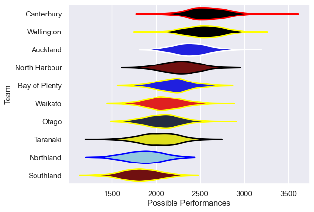

---  
title: "NPC 2004"  
date: 2025-07-29 6:00:00 -0500  
categories: model review projection  
layout: article  
aside:  
    toc: true  
---
# Current Team Rankings

# Standings

## Current Standings

| Club          |   Played |   Wins |   Point Differential |   Losing Bonus Points | Try Bonus Points   |   Competition Points |
|:--------------|---------:|-------:|---------------------:|----------------------:|:-------------------|---------------------:|
| Canterbury    |       11 |      8 |                  184 |                     2 |                    |                   36 |
| Wellington    |       11 |      8 |                  158 |                     1 |                    |                   35 |
| Bay of Plenty |       10 |      7 |                  -12 |                     1 |                    |                   29 |
| Waikato       |       10 |      6 |                   67 |                     1 |                    |                   25 |
| North Harbour |        9 |      4 |                   46 |                     4 |                    |                   22 |
| Taranaki      |        8 |      5 |                   24 |                     1 |                    |                   21 |
| Auckland      |        9 |      4 |                  -22 |                     3 |                    |                   19 |
| Otago         |        9 |      2 |                  -78 |                     1 |                    |                   11 |
| Southland     |        9 |      1 |                 -164 |                     0 |                    |                    4 |
| Northland     |        8 |      0 |                 -203 |                     1 |                    |                    1 |

# Completed Match Review

| Model | Percent Correct Predictions | Spread Error |
| ------ | ------ | ------ |
| Club Level | 61.7% | 14.5 |
| Player Level: Lineup | nan% | nan |
| Player Level: Minutes | nan% | nan |

