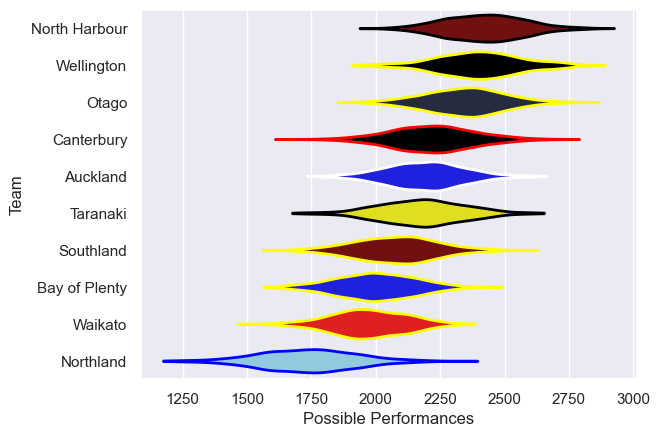

---  
title: "NPC 2005"  
date: 2025-07-29 6:00:00 -0500  
categories: model review projection  
layout: article  
aside:  
    toc: true  
---
# Current Team Rankings

# Standings

## Current Standings

| Club          |   Played |   Wins |   Point Differential |   Losing Bonus Points | Try Bonus Points   |   Competition Points |
|:--------------|---------:|-------:|---------------------:|----------------------:|:-------------------|---------------------:|
| Auckland      |       11 |      9 |                  113 |                     0 |                    |                   36 |
| Canterbury    |       10 |      7 |                   81 |                     1 |                    |                   31 |
| Otago         |       11 |      7 |                   60 |                     1 |                    |                   29 |
| North Harbour |       10 |      6 |                  108 |                     0 |                    |                   26 |
| Wellington    |        9 |      5 |                   64 |                     2 |                    |                   22 |
| Southland     |        9 |      4 |                  -56 |                     2 |                    |                   18 |
| Waikato       |        9 |      4 |                    4 |                     1 |                    |                   17 |
| Bay of Plenty |        9 |      3 |                  -53 |                     2 |                    |                   14 |
| Taranaki      |        9 |      2 |                  -51 |                     3 |                    |                   11 |
| Northland     |        9 |      0 |                 -270 |                     1 |                    |                    1 |

# Completed Match Review

| Model | Percent Correct Predictions | Spread Error |
| ------ | ------ | ------ |
| Club Level | 66.7% | 16.8 |
| Player Level: Lineup | nan% | nan |
| Player Level: Minutes | nan% | nan |

