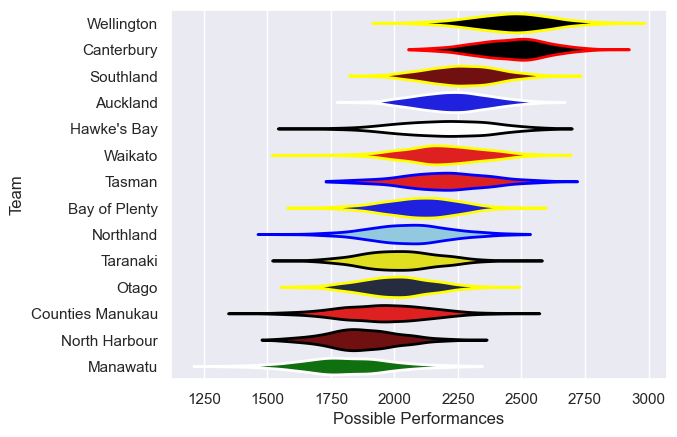

---  
title: "NPC 2008"  
date: 2025-07-29 6:00:00 -0500  
categories: model review projection  
layout: article  
aside:  
    toc: true  
---
# Current Team Rankings

# Standings

## Current Standings

| Club             |   Played |   Wins |   Point Differential |   Losing Bonus Points | Try Bonus Points   |   Competition Points |
|:-----------------|---------:|-------:|---------------------:|----------------------:|:-------------------|---------------------:|
| Canterbury       |       13 |     12 |                  218 |                     1 |                    |                   49 |
| Wellington       |       13 |     11 |                  220 |                     1 |                    |                   45 |
| Hawke's Bay      |       12 |      8 |                   75 |                     1 |                    |                   33 |
| Southland        |       12 |      6 |                   58 |                     3 |                    |                   27 |
| Bay of Plenty    |       11 |      6 |                  -58 |                     1 |                    |                   25 |
| Waikato          |       11 |      4 |                   20 |                     3 |                    |                   21 |
| Tasman           |       11 |      4 |                  -50 |                     3 |                    |                   21 |
| Otago            |       10 |      4 |                  -24 |                     2 |                    |                   20 |
| Taranaki         |       11 |      4 |                  -28 |                     2 |                    |                   20 |
| Auckland         |       10 |      5 |                  -44 |                     0 |                    |                   20 |
| Northland        |       10 |      4 |                  -15 |                     3 |                    |                   19 |
| North Harbour    |       10 |      3 |                  -61 |                     4 |                    |                   16 |
| Counties Manukau |       10 |      2 |                 -177 |                     1 |                    |                   11 |
| Manawatu         |       10 |      1 |                 -134 |                     1 |                    |                    7 |

# Completed Match Review

| Model | Percent Correct Predictions | Spread Error |
| ------ | ------ | ------ |
| Club Level | 61.0% | 14.8 |
| Player Level: Lineup | nan% | nan |
| Player Level: Minutes | nan% | nan |

