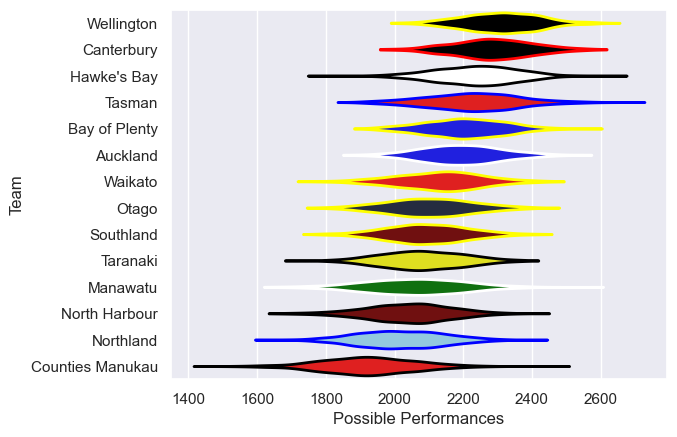

---  
title: "NPC 2009"  
date: 2025-07-29 6:00:00 -0500  
categories: model review projection  
layout: article  
aside:  
    toc: true  
---
# Current Team Rankings

# Standings

## Current Standings

| Club             |   Played |   Wins |   Point Differential |   Losing Bonus Points | Try Bonus Points   |   Competition Points |
|:-----------------|---------:|-------:|---------------------:|----------------------:|:-------------------|---------------------:|
| Canterbury       |       15 |     12 |                  163 |                     3 |                    |                   51 |
| Wellington       |       15 |     10 |                  130 |                     2 |                    |                   42 |
| Southland        |       14 |      9 |                   58 |                     1 |                    |                   39 |
| Auckland         |       13 |      8 |                   49 |                     4 |                    |                   36 |
| Hawke's Bay      |       14 |      8 |                   99 |                     1 |                    |                   35 |
| Waikato          |       12 |      8 |                    2 |                     0 |                    |                   32 |
| Bay of Plenty    |       12 |      7 |                    7 |                     2 |                    |                   30 |
| Otago            |       13 |      5 |                  -23 |                     5 |                    |                   25 |
| Taranaki         |       12 |      5 |                   -5 |                     1 |                    |                   23 |
| Tasman           |       12 |      5 |                  -30 |                     2 |                    |                   22 |
| Manawatu         |       13 |      4 |                  -57 |                     5 |                    |                   21 |
| North Harbour    |       13 |      4 |                  -76 |                     4 |                    |                   20 |
| Northland        |       13 |      3 |                 -116 |                     2 |                    |                   16 |
| Counties Manukau |       13 |      2 |                 -201 |                     2 |                    |                   10 |

# Completed Match Review

| Model | Percent Correct Predictions | Spread Error |
| ------ | ------ | ------ |
| Club Level | 66.3% | 12.3 |
| Player Level: Lineup | nan% | nan |
| Player Level: Minutes | nan% | nan |

