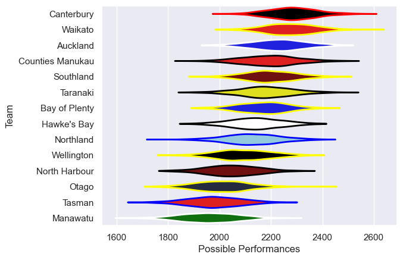

---  
title: "NPC 2010"  
date: 2025-07-29 6:00:00 -0500  
categories: model review projection  
layout: article  
aside:  
    toc: true  
---
# Current Team Rankings

# Standings

## Current Standings

| Club             |   Played |   Wins |   Point Differential |   Losing Bonus Points |   Try Bonus Points |   Competition Points |
|:-----------------|---------:|-------:|---------------------:|----------------------:|-------------------:|---------------------:|
| Canterbury       |       15 |     11 |                  118 |                     1 |                  2 |                   49 |
| Waikato          |       15 |     10 |                   87 |                     1 |                  1 |                   44 |
| Auckland         |       14 |      9 |                  151 |                     3 |                  1 |                   42 |
| Wellington       |       14 |      8 |                   63 |                     4 |                  1 |                   37 |
| Taranaki         |       13 |      9 |                   39 |                     1 |                    |                   37 |
| Southland        |       13 |      8 |                   -2 |                     0 |                    |                   32 |
| Bay of Plenty    |       13 |      7 |                   38 |                     3 |                    |                   31 |
| Hawke's Bay      |       13 |      5 |                    5 |                     3 |                    |                   29 |
| Counties Manukau |       13 |      6 |                  -17 |                     3 |                    |                   27 |
| Northland        |       13 |      5 |                   38 |                     4 |                    |                   24 |
| Tasman           |       13 |      4 |                 -109 |                     3 |                    |                   19 |
| North Harbour    |       13 |      4 |                 -102 |                     2 |                    |                   18 |
| Manawatu         |       13 |      3 |                 -151 |                     2 |                    |                   14 |
| Otago            |       13 |      2 |                 -158 |                     2 |                    |                   10 |

# Completed Match Review

| Model | Percent Correct Predictions | Spread Error |
| ------ | ------ | ------ |
| Club Level | 66.0% | 11.6 |
| Player Level: Lineup | nan% | nan |
| Player Level: Minutes | nan% | nan |

