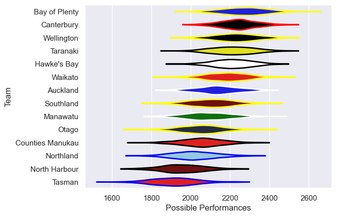

---  
title: "NPC 2011"  
date: 2025-07-29 6:00:00 -0500  
categories: model review projection  
layout: article  
aside:  
    toc: true  
---
# Current Team Rankings

# Standings

## Current Standings

| Club             |   Played |   Wins |   Point Differential |   Losing Bonus Points |   Try Bonus Points |   Competition Points |
|:-----------------|---------:|-------:|---------------------:|----------------------:|-------------------:|---------------------:|
| Hawke's Bay      |       12 |      6 |                   85 |                     1 |                  1 |                   30 |
| Canterbury       |       12 |      6 |                   63 |                     2 |                    |                   30 |
| Manawatu         |       10 |      7 |                   35 |                     1 |                    |                   29 |
| Taranaki         |       10 |      7 |                   22 |                     1 |                    |                   29 |
| Waikato          |       10 |      7 |                   17 |                     1 |                    |                   29 |
| Bay of Plenty    |       10 |      6 |                   63 |                     2 |                  1 |                   27 |
| Auckland         |       10 |      5 |                   -6 |                     4 |                    |                   24 |
| Wellington       |       10 |      5 |                   -9 |                     3 |                    |                   23 |
| Otago            |       10 |      5 |                   -1 |                     2 |                    |                   22 |
| Counties Manukau |       10 |      4 |                  -27 |                     3 |                    |                   19 |
| Southland        |       10 |      4 |                  -34 |                     2 |                    |                   18 |
| Northland        |       10 |      4 |                  -52 |                     2 |                    |                   18 |
| Tasman           |       10 |      2 |                  -82 |                     4 |                    |                   12 |
| North Harbour    |       10 |      2 |                  -74 |                     2 |                    |                   10 |

# Completed Match Review

| Model | Percent Correct Predictions | Spread Error |
| ------ | ------ | ------ |
| Club Level | 68.1% | 10.8 |
| Player Level: Lineup | nan% | nan |
| Player Level: Minutes | nan% | nan |

